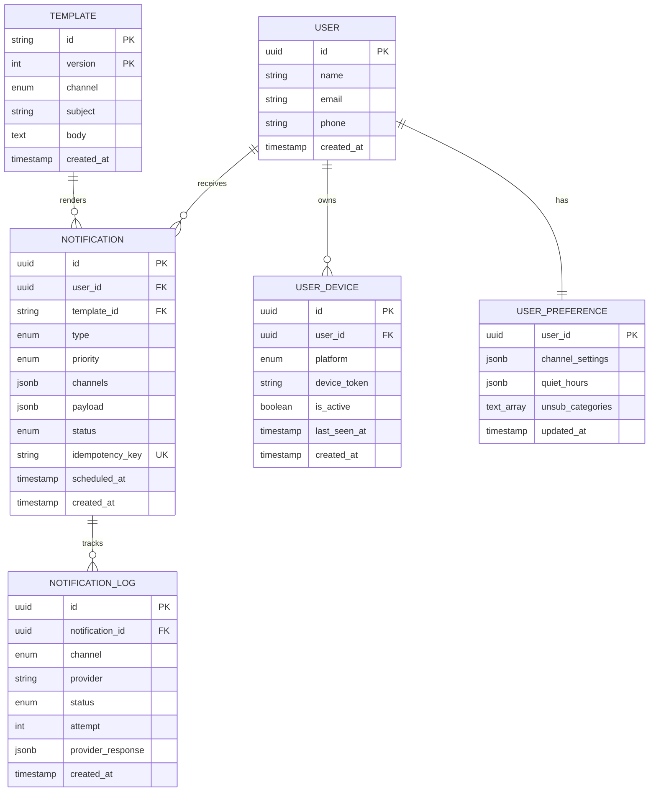
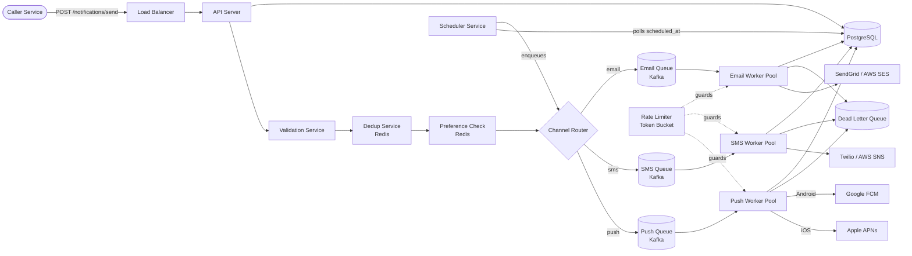
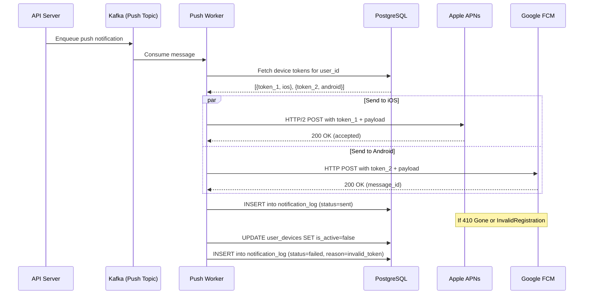
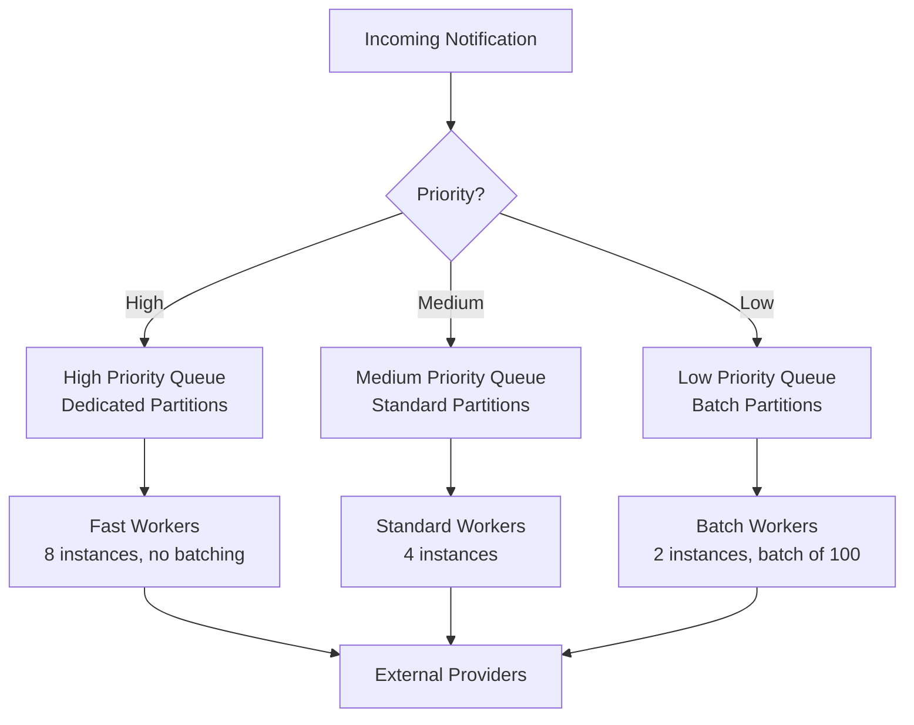
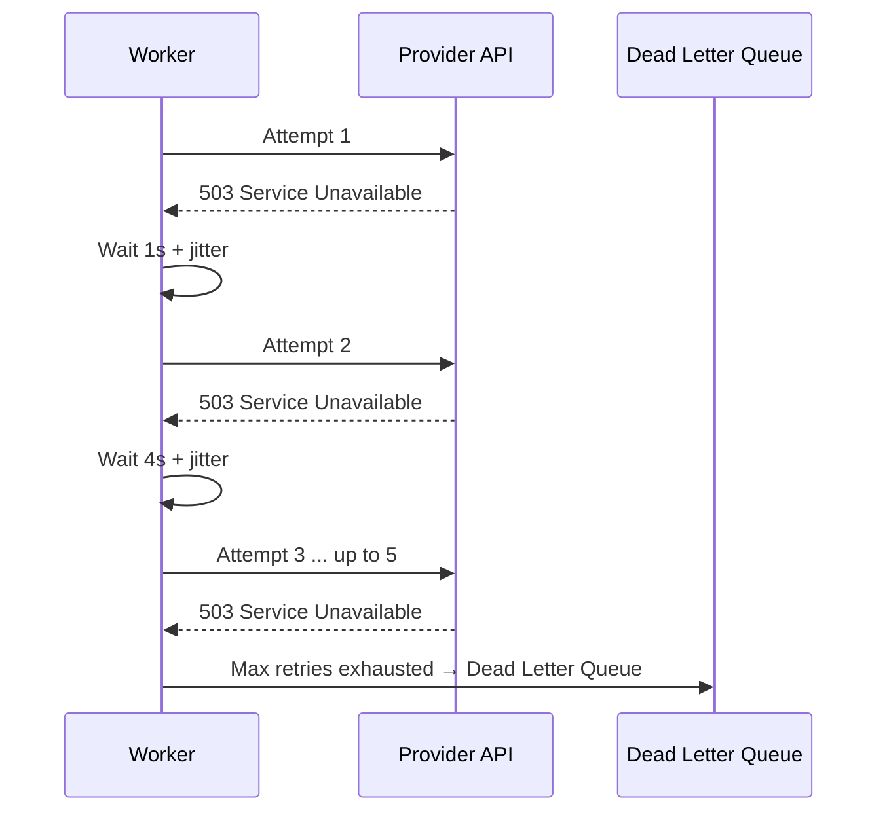

# Design a Notification System

> A notification system is the backbone of user engagement for any modern application.
> It is responsible for delivering timely, relevant messages to users across multiple
> channels -- push notifications (iOS APNs, Android FCM), SMS, and email. The system must
> handle millions of notifications per day with reliability, deduplication, and respect
> for user preferences.

---

## 1. Problem Statement & Requirements

Design a scalable, multi-channel notification system that can reliably deliver push
notifications, SMS, and emails to millions of users. The system should support user
preference management, notification templates, scheduling, priority levels, and retry
logic for failed deliveries.

### 1.1 Functional Requirements

- **FR-1:** Send push notifications to iOS (APNs) and Android (FCM) devices.
- **FR-2:** Send SMS notifications via third-party providers (Twilio, AWS SNS).
- **FR-3:** Send email notifications via providers (SendGrid, AWS SES).
- **FR-4:** Manage user notification preferences (channel opt-in/out, quiet hours, frequency caps).
- **FR-5:** Support notification templates with variable substitution.
- **FR-6:** Support scheduling (send at a future time) and priority levels (high, medium, low).
- **FR-7:** Retry failed deliveries with exponential backoff; route permanently failed messages to a dead-letter queue.

### 1.2 Non-Functional Requirements

- **Throughput:** 10M notifications/day across all channels.
- **Latency:** Soft real-time -- high-priority notifications delivered within 30 seconds of trigger.
- **Delivery guarantee:** At-least-once delivery semantics.
- **Availability:** 99.9% uptime (~8.7 hours downtime/year).
- **Pluggability:** Easy to add new channels (e.g., WhatsApp, Slack) without changing core logic.
- **Observability:** End-to-end tracking of every notification from creation to delivery/failure.

### 1.3 Out of Scope

- In-app notifications (WebSocket/SSE real-time feeds inside the product UI).
- Notification content creation and copywriting workflows.
- A/B testing of notification content.
- Analytics dashboards (open rates, click-through rates).
- User authentication and authorization (assumed handled upstream).

### 1.4 Assumptions & Estimations (Back-of-Envelope Math)

```
Total notifications / day       = 10 M
Notifications / second (avg)    = 10M / 86,400 ≈ 116 NPS
Peak factor                     = 5x
Notifications / second (peak)   = 116 * 5 ≈ 580 NPS

Channel distribution (estimated):
  Push (APNs + FCM)  = 50% → 5M / day → ~58 NPS avg, ~290 NPS peak
  Email              = 35% → 3.5M / day → ~40 NPS avg, ~200 NPS peak
  SMS                = 15% → 1.5M / day → ~17 NPS avg, ~85 NPS peak

Storage per notification record  = ~1 KB (metadata, status, timestamps)
Daily new storage                = 10M * 1 KB = 10 GB / day
30-day retention                 = 10 GB * 30 = 300 GB
1-year retention (for logs)      = 10 GB * 365 ≈ 3.6 TB

User devices table:
  100M users * avg 2 devices     = 200M device tokens
  Each token ≈ 200 bytes         = 200M * 200 B = 40 GB

Template storage                 = Negligible (< 1 GB)
```

> **Tip:** The system is write-heavy (fire-and-forget sends) with relatively few reads
> (user checking notification history). Queue throughput is the primary bottleneck, not DB reads.

---

## 2. API Design

### 2.1 Send Notification

```
POST /api/v1/notifications/send
Headers:
  Authorization: Bearer <service_token>
  X-Idempotency-Key: <uuid>
  Content-Type: application/json

Request Body:
{
  "recipient_id": "user_12345",
  "type": "transactional",             // transactional | marketing | system
  "priority": "high",                  // high | medium | low
  "channels": ["push", "email"],       // optional override; defaults to user prefs
  "template_id": "order_shipped_v2",
  "template_params": {
    "order_id": "ORD-98765",
    "tracking_url": "https://track.example.com/98765"
  },
  "scheduled_at": null                  // null = send immediately, ISO-8601 for future
}

Response: 202 Accepted
{
  "notification_id": "ntf_abc123",
  "status": "queued",
  "created_at": "2026-02-28T10:00:00Z"
}

Error Responses:
  400 - Invalid request body or unknown template_id
  404 - recipient_id not found
  429 - Rate limit exceeded (X-RateLimit-Remaining: 0)
```

### 2.2 Get User Notifications

```
GET /api/v1/notifications/{user_id}?status=delivered&limit=20&cursor=ntf_xyz
Headers:
  Authorization: Bearer <token>

Response: 200 OK
{
  "notifications": [
    {
      "notification_id": "ntf_abc123",
      "type": "transactional",
      "channel": "push",
      "status": "delivered",
      "title": "Your order has shipped!",
      "created_at": "2026-02-28T10:00:00Z",
      "delivered_at": "2026-02-28T10:00:12Z"
    }
  ],
  "next_cursor": "ntf_def456",
  "has_more": true
}
```

### 2.3 Update User Preferences

```
PUT /api/v1/users/{user_id}/preferences
Headers:
  Authorization: Bearer <token>
  Content-Type: application/json

Request Body:
{
  "channels": {
    "push":  { "enabled": true },
    "email": { "enabled": true, "frequency_cap": 5 },  // max 5 emails/day
    "sms":   { "enabled": false }
  },
  "quiet_hours": {
    "enabled": true,
    "start": "22:00",
    "end": "08:00",
    "timezone": "America/New_York"
  },
  "unsubscribed_categories": ["marketing"]
}

Response: 200 OK
{
  "user_id": "user_12345",
  "preferences": { ... },
  "updated_at": "2026-02-28T10:05:00Z"
}
```

> **Guidance:** The `X-Idempotency-Key` header on the send endpoint is critical.
> The server stores this key for 24 hours and deduplicates any replay with the same key.
> Rate limiting headers (`X-RateLimit-Limit`, `X-RateLimit-Remaining`, `X-RateLimit-Reset`)
> are returned on every response.

---

## 3. Data Model

### 3.1 Schema

| Table / Collection     | Column              | Type          | Notes                                      |
| ---------------------- | ------------------- | ------------- | ------------------------------------------ |
| `notifications`        | `id`                | UUID / PK     | Snowflake-generated                        |
| `notifications`        | `user_id`           | UUID / FK     | Indexed, references `users`                |
| `notifications`        | `template_id`       | VARCHAR(64)   | FK to `templates`                          |
| `notifications`        | `type`              | ENUM          | transactional, marketing, system           |
| `notifications`        | `priority`          | ENUM          | high, medium, low                          |
| `notifications`        | `channels`          | JSONB         | Channels this notification targets         |
| `notifications`        | `payload`           | JSONB         | Rendered content per channel               |
| `notifications`        | `status`            | ENUM          | queued, processing, delivered, failed      |
| `notifications`        | `idempotency_key`   | VARCHAR(128)  | Unique index for dedup                     |
| `notifications`        | `scheduled_at`      | TIMESTAMP     | NULL = immediate                           |
| `notifications`        | `created_at`        | TIMESTAMP     | Indexed                                    |
| `user_devices`         | `id`                | UUID / PK     |                                            |
| `user_devices`         | `user_id`           | UUID / FK     | Indexed                                    |
| `user_devices`         | `platform`          | ENUM          | ios, android                               |
| `user_devices`         | `device_token`      | VARCHAR(512)  | APNs / FCM token                           |
| `user_devices`         | `is_active`         | BOOLEAN       | Set to false on invalid token callback     |
| `user_devices`         | `last_seen_at`      | TIMESTAMP     |                                            |
| `user_devices`         | `created_at`        | TIMESTAMP     |                                            |
| `user_preferences`     | `user_id`           | UUID / PK     | One row per user                           |
| `user_preferences`     | `channel_settings`  | JSONB         | Per-channel enabled, frequency cap         |
| `user_preferences`     | `quiet_hours`       | JSONB         | start, end, timezone                       |
| `user_preferences`     | `unsub_categories`  | TEXT[]        | Array of unsubscribed categories           |
| `user_preferences`     | `updated_at`        | TIMESTAMP     |                                            |
| `templates`            | `id`                | VARCHAR(64)   | Human-readable slug, PK                    |
| `templates`            | `version`           | INT           | Composite key with id                      |
| `templates`            | `channel`           | ENUM          | push, sms, email                           |
| `templates`            | `subject`           | VARCHAR(256)  | Email subject / push title                 |
| `templates`            | `body`              | TEXT          | Template with {{variable}} placeholders    |
| `templates`            | `created_at`        | TIMESTAMP     |                                            |
| `notification_log`     | `id`                | UUID / PK     |                                            |
| `notification_log`     | `notification_id`   | UUID / FK     | Indexed                                    |
| `notification_log`     | `channel`           | ENUM          | push, sms, email                           |
| `notification_log`     | `provider`          | VARCHAR(32)   | apns, fcm, twilio, sendgrid               |
| `notification_log`     | `status`            | ENUM          | sent, delivered, bounced, failed           |
| `notification_log`     | `attempt`           | INT           | Retry attempt number                       |
| `notification_log`     | `provider_response` | JSONB         | Raw response from the provider             |
| `notification_log`     | `created_at`        | TIMESTAMP     | Indexed                                    |

### 3.2 ER Diagram



### 3.3 Database Choice Justification

| Requirement                  | Choice         | Reason                                              |
| ---------------------------- | -------------- | --------------------------------------------------- |
| Notification metadata & logs | PostgreSQL     | ACID, JSONB support, rich indexing, mature tooling   |
| User preferences (hot path) | Redis          | Sub-ms reads for preference lookups on every send    |
| Message queuing              | Kafka          | High throughput, durable, supports priority topics   |
| Template rendering cache     | Redis          | Fast retrieval of compiled templates                 |
| Long-term log archival       | S3 + Parquet   | Cheap columnar storage for analytics and auditing    |

> **Guidance:** Preferences are read on every notification send, so caching them
> in Redis avoids a DB round-trip on the hot path. The source of truth remains in
> PostgreSQL; Redis is populated via write-through on preference updates.

---

## 4. High-Level Architecture

### 4.1 Architecture Diagram



### 4.2 Component Walkthrough

| Component            | Responsibility                                                                            |
| -------------------- | ----------------------------------------------------------------------------------------- |
| **API Server**       | Accepts notification requests, validates payload, writes to DB, enqueues to Kafka         |
| **Validation Svc**   | Checks template exists, recipient exists, schema is correct                               |
| **Dedup Service**    | Uses idempotency key in Redis (SET NX, TTL 24h) to reject duplicate requests              |
| **Preference Check** | Reads user preferences from Redis; filters out disabled channels and quiet-hours conflicts |
| **Channel Router**   | Routes the notification to the correct Kafka topic based on target channel                 |
| **Push/SMS/Email Q** | Kafka topics per channel, each with high/medium/low priority partitions                   |
| **Worker Pools**     | Consume from queues, render templates, call provider APIs, log results                    |
| **Rate Limiter**     | Token-bucket per provider to stay within API rate limits (e.g., APNs, Twilio)             |
| **Scheduler**        | Cron-based service that polls DB for notifications with `scheduled_at <= now()`, enqueues  |
| **Dead Letter Queue**| Stores permanently failed notifications for manual review or alerting                     |
| **PostgreSQL**       | Source of truth for notifications, devices, preferences, templates, logs                  |

> **Walk-through:** A caller service hits the API. The API validates the request, checks
> the idempotency key (Redis), looks up user preferences (Redis), and routes the notification
> to the appropriate Kafka topic. A pool of channel-specific workers consumes messages,
> renders the template, respects rate limits, and calls the external provider. Success or
> failure is logged to the `notification_log` table.

---

## 5. Deep Dive: Core Flows

### 5.1 Push Notifications -- APNs (iOS) & FCM (Android)

**Device Token Management:**
- When a user installs the app, the device registers with APNs/FCM and receives a device token.
- The app sends this token to our backend, which stores it in `user_devices`.
- Tokens can change (app reinstall, OS update). The app must re-register on every launch.
- When APNs/FCM returns an "invalid token" error, we mark `is_active = false` in `user_devices`.

**Push Delivery Flow:**



**Key details:**
- APNs uses HTTP/2 with JWT-based authentication. Connections are long-lived (connection pooling).
- FCM uses HTTP v1 API with OAuth 2.0 service account tokens.
- Both support batch sending, but we send per-device for granular error handling.
- APNs has a feedback service for stale tokens; FCM returns errors inline.

### 5.2 SMS Delivery

**Provider integration:**
- Primary provider: Twilio (reliable, global coverage).
- Fallback provider: AWS SNS (cost-effective backup).
- If Twilio returns a 5xx or times out, the worker retries once, then falls back to AWS SNS.

**Delivery flow:**
1. SMS Worker consumes message from the SMS Kafka topic.
2. Looks up the user's phone number from the DB (or cached in Redis).
3. Renders the SMS template (max 160 chars for single-segment, 1600 for long SMS).
4. Calls Twilio's `Messages.create` API with the rendered body.
5. Twilio returns a `message_sid` and initial status (`queued` or `sent`).
6. Twilio sends a delivery report via webhook (status callback URL).
7. Our webhook handler updates `notification_log` with final status (`delivered`, `undelivered`, `failed`).

**Delivery report webhook:**

```
POST /api/v1/webhooks/twilio/delivery-report
{
  "MessageSid": "SM...",
  "MessageStatus": "delivered",
  "To": "+1234567890",
  "ErrorCode": null
}
```

**Key details:**
- SMS is the most expensive channel (~$0.0075/segment). Frequency capping is essential.
- Regulatory compliance: opt-out handling (STOP keyword), TCPA compliance for US numbers.
- International numbers require country-specific sender IDs and may have delivery delays.

### 5.3 Email Delivery

**Provider integration:**
- Primary: SendGrid (transactional email API).
- Fallback: AWS SES (cost-effective, good for bulk).

**Email flow:**
1. Email Worker consumes message from the Email Kafka topic.
2. Fetches the email template (HTML + plain-text) from Redis cache or DB.
3. Renders the template with user-specific variables using a templating engine (e.g., Handlebars).
4. Calls SendGrid's `/v3/mail/send` API with rendered HTML, subject, from/to addresses.
5. SendGrid returns `202 Accepted`.
6. SendGrid sends event webhooks: `delivered`, `opened`, `clicked`, `bounced`, `spam_report`.

**Bounce handling:**
- **Soft bounce** (mailbox full, server down): Retry up to 3 times over 24 hours.
- **Hard bounce** (invalid address): Mark the email as permanently undeliverable. Update user record to flag the email as invalid. Do not retry.
- **Spam complaint**: Automatically unsubscribe the user from marketing emails.

**Key details:**
- Include `List-Unsubscribe` header for one-click unsubscribe (RFC 8058).
- Use dedicated IP addresses with proper SPF, DKIM, and DMARC records for deliverability.
- Warm up new IPs gradually to build sender reputation.

### 5.4 Priority & Ordering

Notifications are classified into three priority levels that map to separate Kafka consumer
groups with different processing guarantees.

| Priority | Use Case                          | Target Latency | Queue Behavior                  |
| -------- | --------------------------------- | -------------- | ------------------------------- |
| High     | OTP, security alerts, 2FA codes   | < 30 seconds   | Dedicated fast-lane consumers   |
| Medium   | Order updates, shipping alerts    | < 5 minutes    | Standard consumer group         |
| Low      | Marketing, weekly digests         | < 1 hour       | Batch-processed, rate-limited   |



**Implementation:**
- Each channel topic (push, sms, email) has three consumer groups: `high`, `medium`, `low`.
- High-priority consumers have more instances and process messages individually (no batching).
- Low-priority consumers batch messages and respect stricter rate limits (avoid flooding users).
- If high-priority queue depth exceeds a threshold, medium-priority workers are paused to free resources.

### 5.5 Retry with Exponential Backoff

When a provider call fails (network error, 5xx, rate limit), the worker retries with
exponential backoff and jitter.

**Retry Policy:**

```
Attempt 1: Immediate
Attempt 2: Wait 1s  + random(0, 500ms)
Attempt 3: Wait 4s  + random(0, 2s)
Attempt 4: Wait 16s + random(0, 8s)
Attempt 5: Wait 64s + random(0, 32s)
-- Max 5 attempts. After that, move to DLQ. --
```

**Decision matrix:**

| Error Type              | Retryable? | Action                                     |
| ----------------------- | ---------- | ------------------------------------------ |
| Network timeout         | Yes        | Retry with backoff                         |
| Provider 5xx            | Yes        | Retry with backoff                         |
| Provider 429 rate limit | Yes        | Retry after `Retry-After` header value     |
| Invalid token (410)     | No         | Mark device inactive, log failure, no retry|
| Hard bounce             | No         | Mark email invalid, log failure, no retry  |
| Invalid payload (400)   | No         | Log failure, send to DLQ for investigation |

**Dead Letter Queue (DLQ):**
- Permanently failed notifications land in a dedicated Kafka DLQ topic.
- A monitoring service consumes from the DLQ, fires alerts, and stores failures for manual review.
- Operations team can replay messages from the DLQ after fixing the root cause.



### 5.6 User Preferences

User preferences are checked on every notification send. They act as a filter layer
between the API and the channel queues.

**Preference evaluation order:**
1. **Global opt-out:** If the user has fully unsubscribed, drop all non-system notifications.
2. **Category filter:** If the notification category is in `unsub_categories`, drop it.
3. **Channel filter:** If the target channel is disabled in `channel_settings`, skip that channel.
4. **Quiet hours:** If current time (in user's timezone) falls within quiet hours:
   - High priority (OTP, security): Send immediately regardless.
   - Medium/Low priority: Delay until quiet hours end (re-enqueue with `scheduled_at`).
5. **Frequency cap:** If the user has exceeded their daily cap for a channel (e.g., 5 emails/day):
   - Track with a Redis counter: `INCR user:{id}:email:count` with TTL of 24 hours.
   - If exceeded, drop the notification and log the reason.

**Caching strategy:**
- Preferences are cached in Redis with a write-through policy.
- On every `PUT /preferences` call, both PostgreSQL and Redis are updated.
- Cache TTL: 1 hour (safety net; most updates go through write-through).
- Cache key: `prefs:{user_id}`.

### 5.7 Deduplication

Duplicate notifications degrade user experience (double SMS charges, spam perception).
The system uses an idempotency key to prevent duplicate sends.

**How it works:**
1. The caller includes an `X-Idempotency-Key` header (typically a deterministic hash of event type + entity ID + timestamp).
2. The API server attempts `SET NX` in Redis: `idemp:{key}` with a 24-hour TTL.
3. If the key already exists, the API returns the original `notification_id` and `202 Accepted` (idempotent response).
4. If the key does not exist, the notification is created and enqueued normally.

**Additional dedup layers:**
- **At the worker level:** Before calling a provider, the worker checks `notification_log` for a `sent` or `delivered` status. If found, skip the send.
- **At the provider level:** Some providers (SendGrid) support their own idempotency keys.

**Edge case -- partial failure:**
If a notification targets multiple channels (push + email) and push succeeds but email fails,
the retry only re-attempts the email channel. The per-channel status is tracked independently
in `notification_log`.

---

## 6. Scaling & Performance

### 6.1 Queue Scaling (Kafka)

- **Separate topics per channel:** `notifications.push`, `notifications.sms`, `notifications.email`.
- **Partitioning:** Partition by `user_id` hash to ensure ordering per user within a channel.
- **Consumer groups:** Separate consumer groups for each priority level within each channel.
- **Partition count:** Start with 12 partitions per topic. At 580 peak NPS across all channels, each partition handles ~16 messages/second -- well within Kafka's capacity.

```
Topic: notifications.push   → 12 partitions → 3 consumer groups (high/med/low)
Topic: notifications.sms    → 6 partitions  → 3 consumer groups
Topic: notifications.email  → 12 partitions → 3 consumer groups
Topic: notifications.dlq    → 3 partitions  → 1 consumer group
```

### 6.2 Worker Horizontal Scaling

| Channel | Workers (Steady) | Workers (Peak) | Scaling Trigger                       |
| ------- | ----------------- | -------------- | ------------------------------------- |
| Push    | 4                 | 12             | Queue lag > 1000 messages             |
| SMS     | 2                 | 6              | Queue lag > 500 messages              |
| Email   | 4                 | 12             | Queue lag > 2000 messages             |

- Workers are stateless containers (Kubernetes pods) that auto-scale based on Kafka consumer lag.
- Each worker maintains a connection pool to its provider (e.g., persistent HTTP/2 connection to APNs).

### 6.3 Rate Limiting per Provider

External providers impose rate limits. The system uses a distributed token-bucket rate limiter
(implemented in Redis) to stay within bounds.

| Provider   | Rate Limit                    | Our Limit (safety margin) |
| ---------- | ----------------------------- | ------------------------- |
| APNs       | No hard limit (throttles)     | 5,000 / sec               |
| FCM        | 600,000 / min per project     | 8,000 / sec               |
| Twilio     | Varies by plan (100-1000 TPS) | 80 / sec                  |
| SendGrid   | 10,000 / sec (paid plan)      | 8,000 / sec               |

- When a worker hits the rate limit, it sleeps for the `Retry-After` duration or a short backoff.
- The rate limiter is shared across all worker instances via Redis: `EVALSHA` Lua script for atomic token-bucket decrement.

### 6.4 Database Scaling

- **Write path:** `notifications` and `notification_log` are write-heavy. Partition the `notification_log` table by `created_at` (monthly partitions) for efficient pruning.
- **Read path:** Reads are mostly by `user_id` (notification history) and `notification_id` (status lookup). Both are indexed.
- **Archival:** Move `notification_log` records older than 30 days to S3 (Parquet format) for long-term analytics. Drop old partitions from PostgreSQL.
- **Connection pooling:** Use PgBouncer to manage database connections from many worker instances.

### 6.5 Caching

| Data               | Cache Policy    | TTL      | Invalidation                |
| ------------------- | --------------- | -------- | --------------------------- |
| User preferences    | Write-through   | 1 hour   | On preference update API    |
| Device tokens       | Cache-aside     | 30 min   | On device registration      |
| Templates           | Cache-aside     | 10 min   | On template deploy          |
| Idempotency keys    | Write (SET NX)  | 24 hours | Auto-expire                 |
| Frequency counters  | Increment       | 24 hours | Auto-expire (daily reset)   |

---

## 7. Reliability & Fault Tolerance

### 7.1 At-Least-Once Delivery

The system guarantees at-least-once delivery through the following mechanisms:

1. **Kafka consumer offsets:** Workers only commit offsets after successfully calling the provider and writing to `notification_log`. If a worker crashes mid-processing, the message is re-delivered.
2. **Idempotent consumers:** Before sending, the worker checks `notification_log` for an existing `sent`/`delivered` record. This prevents actual duplicate sends on reprocessing.
3. **Database write confirmation:** The notification status is updated to `processing` before the provider call and to `delivered`/`failed` after.

### 7.2 Single Points of Failure

| Component        | SPOF? | Mitigation                                                   |
| ---------------- | ----- | ------------------------------------------------------------ |
| API Server       | No    | Stateless, multiple instances behind load balancer           |
| Kafka            | No    | 3-broker cluster, replication factor 3, min ISR 2            |
| PostgreSQL       | Yes   | Synchronous standby, automatic failover (Patroni)            |
| Redis            | Yes   | Redis Sentinel (3 nodes) or Redis Cluster                    |
| Push Workers     | No    | Multiple stateless pods, auto-scaling                        |
| SMS Workers      | No    | Multiple stateless pods, auto-scaling                        |
| Email Workers    | No    | Multiple stateless pods, auto-scaling                        |
| External Providers| No   | Fallback providers per channel (Twilio -> SNS, SendGrid -> SES) |

### 7.3 Provider Failover

Each channel has a primary and fallback provider. If the primary fails after all retry
attempts, the worker switches to the fallback provider before sending to the DLQ.

```
Push:  APNs/FCM (no fallback; each platform has a single provider)
SMS:   Twilio (primary) → AWS SNS (fallback)
Email: SendGrid (primary) → AWS SES (fallback)
```

### 7.4 Graceful Degradation

- **Kafka down:** API server returns `503 Service Unavailable`. Upstream callers should retry.
  Alternatively, the API writes to a local disk buffer and flushes to Kafka when it recovers.
- **Redis down:** Preferences are fetched from PostgreSQL (slower but functional).
  Dedup is skipped (accept the risk of rare duplicates over dropping notifications).
- **Provider down:** Retries exhaust, failover to backup provider. If both fail, DLQ + alert.

### 7.5 Monitoring & Alerting

| Metric                                | Alert Threshold            | Action                          |
| ------------------------------------- | -------------------------- | ------------------------------- |
| Kafka consumer lag (per topic)        | > 5,000 messages           | Scale up workers                |
| Notification delivery rate            | < 95% over 5 min           | Page on-call engineer           |
| Provider error rate (per provider)    | > 5% over 1 min            | Trigger provider failover       |
| DLQ depth                             | > 100 messages             | Investigate root cause          |
| API p99 latency                       | > 500 ms                   | Investigate API server health   |
| End-to-end latency (high priority)    | > 30 seconds               | Investigate queue/worker health |

**Observability stack:** Prometheus + Grafana (metrics), ELK (structured logging), OpenTelemetry (distributed tracing). Every log line includes `notification_id` for end-to-end correlation.

---

## 8. Trade-offs & Alternatives

| Decision                          | Chosen                   | Alternative               | Why Chosen                                                         |
| --------------------------------- | ------------------------ | ------------------------- | ------------------------------------------------------------------ |
| Message queue                     | Kafka                    | RabbitMQ / SQS            | Kafka handles higher throughput, durable replay, better for 10M/day|
| Queue per channel vs single queue | Separate queues          | Single queue              | Isolation: SMS rate limit issues do not block push delivery        |
| Priority handling                 | Separate consumer groups | Single queue with sorting | Simpler to scale independently; no head-of-line blocking           |
| Delivery guarantee                | At-least-once            | Exactly-once              | Exactly-once is much harder; idempotent consumers handle duplicates|
| Template rendering                | Server-side (workers)    | Client-side (caller)      | Centralized control over content, easier i18n and versioning       |
| Preference storage                | PostgreSQL + Redis cache | Redis only                | Need durable storage; Redis is volatile. PG is source of truth     |
| Provider strategy                 | Primary + fallback       | Load-balance across both  | Simpler; only pay for fallback when primary fails                  |
| Scheduling                        | DB polling (cron)        | Delay queues (Kafka)      | Kafka delay queues are complex; DB polling is simple and sufficient |
| Notification log retention        | 30 days hot, S3 archive  | Keep all in PostgreSQL    | Keeps DB size manageable; archived logs still queryable via Athena |

---

## 9. Interview Tips

### What Interviewers Look For

1. **Structured approach:** Start with requirements, then API, data model, architecture, deep dive, scaling.
2. **Multi-channel awareness:** Do not design only for push. Show you understand the nuances of SMS (cost, regulations), email (deliverability, bounces), and push (token management).
3. **Reliability reasoning:** "What happens when Twilio is down?" -- You should have a clear answer (retry, failover to SNS, DLQ).
4. **User experience empathy:** Deduplication, quiet hours, frequency capping -- these show you think beyond the backend.
5. **Quantitative thinking:** Use your throughput numbers to justify partition counts, worker counts, and rate limits.

### Common Follow-up Questions

- **"How do you prevent duplicate notifications?"**
  Idempotency key at API level (Redis SET NX), plus idempotent consumers that check `notification_log` before sending.

- **"What happens if Kafka goes down?"**
  API returns 503. Upstream callers retry. Optionally, buffer to local disk or a secondary queue (SQS) and drain when Kafka recovers.

- **"How do you handle a 10x traffic spike (100M notifications/day)?"**
  Kafka handles the burst (increase partitions from 12 to 36). Auto-scale worker pods (Kubernetes HPA on consumer lag). Rate limiters protect providers. Low-priority notifications can be delayed.

- **"How would you add a new channel like WhatsApp?"**
  Create a new Kafka topic `notifications.whatsapp`, implement a WhatsApp Worker that integrates with the WhatsApp Business API, add `whatsapp` to the channel enum. No changes to the API server or router logic -- pluggable by design.

- **"How do you ensure high-priority messages (OTP) are not delayed?"**
  Dedicated consumer group for high-priority queue. More worker instances. These consumers bypass batching and quiet hours. Separate rate-limit bucket.

- **"How do you handle timezone-aware quiet hours?"**
  Store the user's timezone in preferences. On each notification send, convert current UTC time to the user's local time and compare against quiet hour window. If in quiet hours, re-enqueue with `scheduled_at` set to the end of quiet hours.

### Common Pitfalls

- **Designing only one channel.** The interviewer expects a multi-channel system. Show you understand device tokens, phone numbers, and email addresses are different.
- **Ignoring provider rate limits.** Every external provider has limits. Not mentioning rate limiting is a red flag.
- **No retry or failure handling.** Notifications fail all the time (invalid tokens, bounced emails). You need retry + DLQ.
- **Forgetting user preferences.** A notification system without opt-out and quiet hours is incomplete.
- **Over-engineering priority.** Three priority levels (high/medium/low) are enough. Do not build a complex priority scoring system.
- **Not mentioning deduplication.** Duplicate OTPs or duplicate marketing emails are a real problem. Always mention the idempotency key pattern.

### Key Numbers to Memorize

```
10M notifs/day ≈ 116 NPS avg, 580 NPS peak | 1 KB/record | SMS ~$0.0075/seg
Email ~$0.00035/msg | Push: free | APNs token ~64B | FCM token ~152B
```

---

> **Checklist before finishing your design:**
>
> - [x] Requirements are scoped: push, SMS, email with preferences, templates, scheduling, retry.
> - [x] Back-of-envelope: 10M/day, 116 NPS avg, 580 NPS peak, 300 GB/month storage.
> - [x] Mermaid diagrams: architecture, push flow, priority routing, retry sequence.
> - [x] Database choice justified: PostgreSQL (ACID), Redis (hot-path cache), Kafka (queuing).
> - [x] Scaling: separate Kafka topics, horizontal worker scaling, provider rate limiting.
> - [x] SPOFs identified: PostgreSQL (Patroni failover), Redis (Sentinel), providers (fallback).
> - [x] Trade-offs: 9 explicit decisions with reasoning.
