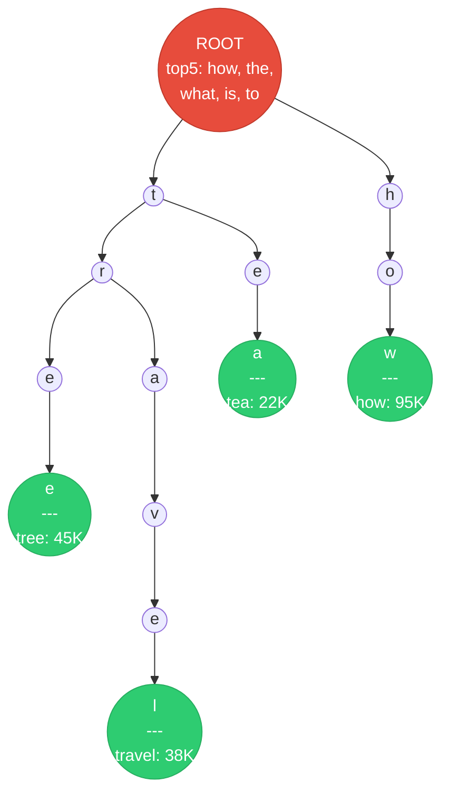
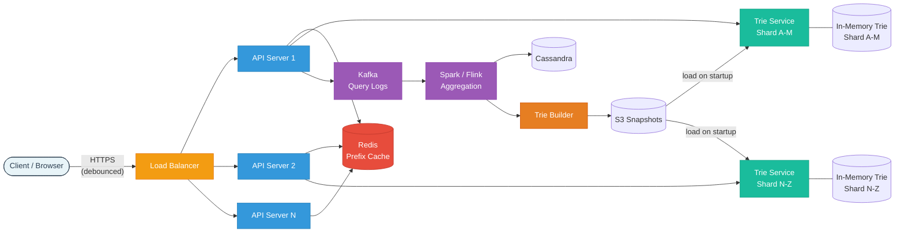
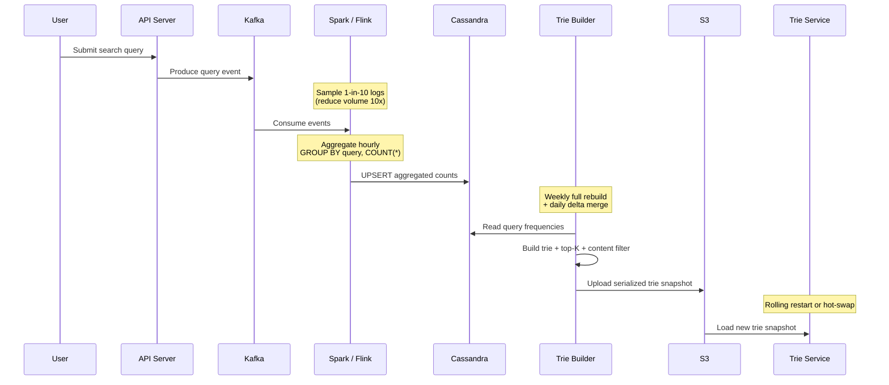
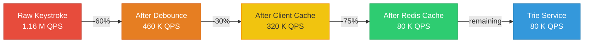
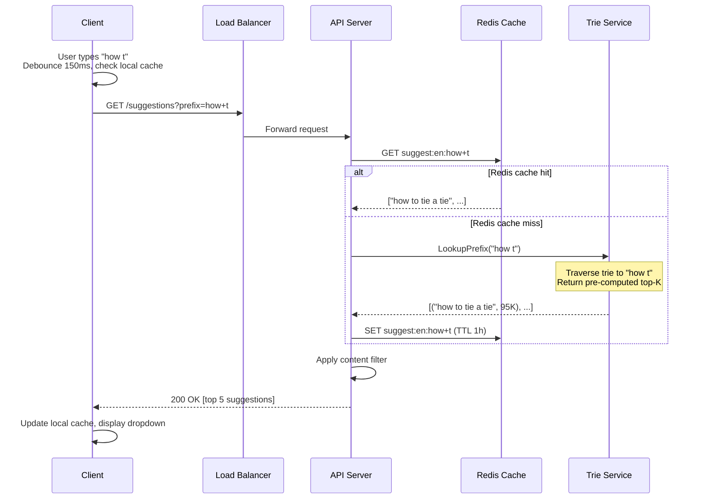
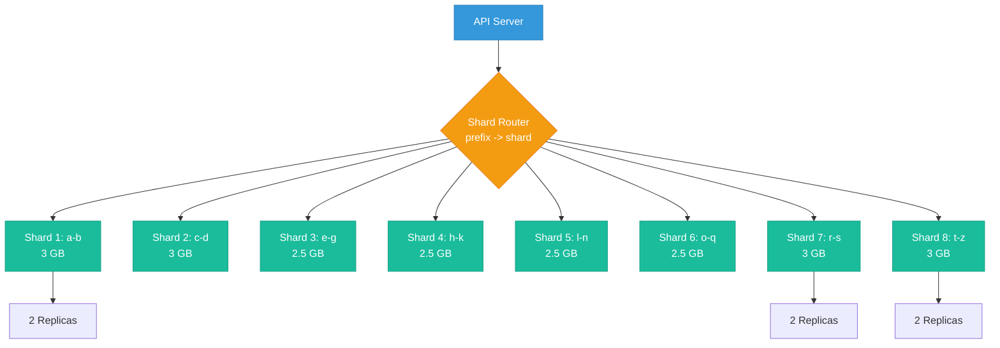

# Design a Search Autocomplete (Typeahead) System

> A search autocomplete system returns real-time suggestions as a user types characters into
> a search box. It predicts the user's intended query and shows the top-K most relevant
> completions, saving keystrokes and guiding users toward popular queries. Covers tries,
> top-K algorithms, data pipelines, and caching at enormous scale.

---

## 1. Problem Statement & Requirements

As users type into a search bar, the system should suggest the most relevant completions
of their partial input in real time. Suggestions must appear within 100 ms to feel
instantaneous. The system must handle billions of queries per day from users worldwide.

### 1.1 Functional Requirements

- **FR-1:** Given a prefix (partial query), return the top 5 most relevant search suggestions.
- **FR-2:** Suggestions ranked by a combination of frequency, recency, and relevance.
- **FR-3:** Support multi-language queries (English, Spanish, Chinese, Arabic, etc.).
- **FR-4:** Support personalized suggestions based on user search history.
- **FR-5:** Filter out inappropriate, offensive, or legally restricted suggestions.
- **FR-6:** New trending queries should surface within a reasonable time window.

### 1.2 Non-Functional Requirements

- **Latency:** p99 < 100 ms end-to-end (must feel instantaneous while typing).
- **Availability:** 99.99% uptime -- degraded search if suggestions fail, but users can
  still type and submit their full query manually.
- **Throughput:** Handle 10 billion queries per day.
- **Consistency model:** Eventual consistency is perfectly acceptable.

### 1.3 Out of Scope

- Full search results (the actual search engine that returns web pages/products).
- Spell correction / "Did you mean?" functionality.
- Voice search and image search.
- Query understanding or NLP-based intent classification.
- UI/frontend design beyond the API contract.

### 1.4 Assumptions & Estimations (Back-of-Envelope Math)

#### Traffic Estimates

```
Total search queries / day           = 10 B
QPS                                  = 10 B / 86,400  ~  116 K QPS
Peak QPS (3x factor)                 = ~348 K QPS

Each query involves multiple keystrokes:
  Average query length               = 4 words, ~20 characters
  Keystrokes triggering API (debounced) = ~10 per query

Suggestion requests / day            = 10 B * 10      = 100 B / day
Raw suggestion QPS                   = 100 B / 86,400 ~  1.16 M QPS

With debouncing + client-side caching (~60% reduction):
  Effective server QPS               ~  460 K QPS
  Peak effective QPS                 ~  1.4 M QPS
```

#### Data Estimates

```
Unique queries in the system         ~ 500 M
Average query length                 ~ 30 bytes (UTF-8)

Trie storage per query               ~ 100 bytes (chars + frequency + top-K + overhead)
Trie size: 500 M * 100 B             = 50 GB raw
With prefix sharing in trie           ~ 15-25 GB (significant deduplication)

Raw query logs / day                 = 10 B * 50 B = 500 GB / day
Aggregated frequency table           = 500 M * 40 B = 20 GB
```

#### Cache Estimates

```
Top queries follow Zipf's law: top 10% of prefixes = ~80% of traffic.
Cacheable prefixes                   ~ 50 M
Each cached entry (prefix + 5 suggestions) ~ 200 bytes
Cache size                           = 50 M * 200 B = 10 GB  (fits in Redis Cluster)
```

---

## 2. API Design

### 2.1 Get Suggestions

```
GET /api/v1/suggestions?prefix=how+to&limit=5&lang=en&user_id=u123

Response: 200 OK
{
  "prefix": "how to",
  "suggestions": [
    { "query": "how to tie a tie",          "score": 98500 },
    { "query": "how to screenshot on mac",  "score": 87200 },
    { "query": "how to lose weight",        "score": 76800 },
    { "query": "how to write a resume",     "score": 65400 },
    { "query": "how to cook rice",          "score": 54100 }
  ]
}

Error Responses:
  400 Bad Request   -- prefix empty or exceeds 100 characters
  429 Too Many Reqs -- rate limit exceeded (50 req/s/IP)
  503 Unavailable   -- trie service degraded; client should retry
```

### 2.2 Report Query (Analytics Ingestion)

```
POST /api/v1/queries
{
  "query": "how to tie a tie",
  "user_id": "u123",
  "timestamp": "2026-02-28T14:30:00Z",
  "lang": "en"
}

Response: 202 Accepted
```

Called when the user actually submits a search query (not on every keystroke). Feeds the
analytics pipeline that updates suggestion rankings.

---

## 3. Data Model

### 3.1 Core Data Structure: Trie

The fundamental data structure is a **trie (prefix tree)**, not a relational table. Each
node represents a character, and paths from root to marked nodes represent complete queries.

```
Trie Node (conceptual):
{
  "char":       "t",
  "children":   { "h": TrieNode, "o": TrieNode, ... },
  "is_end":     true,               // marks end of a valid query
  "frequency":  45000,              // search frequency (if is_end)
  "top_k":      ["tree", "travel"]  // pre-computed top-K for this prefix
}
```

### 3.2 Trie Visualization



Green nodes mark complete queries with frequency counts. When a user types "tr", the system
traverses to the "r" node under "t" and returns pre-computed top-K: `["tree", "travel"]`.

### 3.3 Supporting Storage

| Storage              | Technology        | Data                                | Notes                            |
| -------------------- | ----------------- | ----------------------------------- | -------------------------------- |
| Trie (serving)       | In-memory         | Prefix tree with top-K per node     | Primary serving layer, ~15-25 GB |
| Query frequency      | Cassandra         | `(query, time_bucket) -> count`     | Aggregated counts for rebuilds   |
| Raw query logs       | Kafka + S3        | Every submitted query with metadata | Input to analytics pipeline      |
| Trie snapshots       | S3                | Serialized trie binary              | Recovery and new node startup    |
| Filter/blocklist     | Redis             | Set of banned/offensive terms       | Checked at build + runtime       |
| User search history  | DynamoDB          | Per-user recent queries (last 100)  | For personalization              |

### 3.4 Database Choice Justification

| Requirement             | Choice        | Reason                                                   |
| ----------------------- | ------------- | -------------------------------------------------------- |
| Query frequency storage | **Cassandra** | Write-heavy, time-series data, horizontal scaling        |
| Raw log streaming       | **Kafka**     | High-throughput, durable, ordered event streaming        |
| Trie serving            | **In-memory** | Sub-ms prefix lookups, no disk I/O on critical path      |
| Prefix-level caching    | **Redis**     | Shared cache across API servers, sub-ms, supports TTL    |
| User history            | **DynamoDB**  | Low-latency key-value lookups by user_id, auto-scaling   |

---

## 4. High-Level Architecture

### 4.1 Architecture Diagram



### 4.2 Component Walkthrough

| Component              | Responsibility                                                                 |
| ---------------------- | ------------------------------------------------------------------------------ |
| **Load Balancer**      | L7 routing, TLS termination, health checks                                     |
| **API Server**         | Stateless. Check cache, route to trie shard, return suggestions                |
| **Redis Prefix Cache** | Caches hot prefix -> suggestions mappings. TTL-based eviction                  |
| **Trie Service**       | Holds in-memory trie shard. Prefix lookup returning top-K suggestions          |
| **Kafka**              | Ingests raw query logs on actual search submission                             |
| **Spark / Flink**      | Aggregates query frequencies. Hourly/daily batch jobs                          |
| **Cassandra**          | Stores aggregated query frequencies. Source of truth for trie building          |
| **Trie Builder**       | Reads frequency data, builds trie, serializes to S3 snapshots                  |
| **S3**                 | Stores trie snapshots for durability, recovery, new node loading               |

---

## 5. Deep Dive: Core Flows

### 5.1 Trie Data Structure

A **trie** is a tree optimized for prefix-based retrieval. Unlike a hash table that
requires the full key, a trie finds all strings matching a prefix by tree traversal.

**How prefix matching works:**
1. Start at the root node.
2. For each character in the prefix, follow the corresponding child pointer.
3. If a child does not exist at any point, return empty (no matches).
4. At the prefix node, return the pre-computed top-K suggestions stored there.

**Time complexity:** O(p) where p = prefix length (1-20 chars). Constant in practice.

**Space optimization techniques:**

| Technique               | Description                                    | Space Savings |
| ----------------------- | ---------------------------------------------- | ------------- |
| Compressed trie (radix) | Merge single-child chains into one node        | 30-50%        |
| Limit trie depth        | Cap at 50 characters (truncate long queries)   | 10-20%        |
| Prune low-frequency     | Remove queries below a frequency threshold     | 40-60%        |

### 5.2 Top-K Query Algorithm

For every possible prefix, we need the top-K most popular completions.

#### Pre-Compute Top-K at Each Node (Recommended)

During trie construction, propagate frequency data upward and store top-K at every node.

```
Build process:
  1. Insert all queries with their frequencies.
  2. Post-order traversal (bottom-up).
  3. At each node, merge top-K lists of all children using a min-heap of size K.
  4. Keep only top-K entries.

Example at node "ho" with children "how" and "hot":
  "how" top-5: [how to (95K), how much (88K), how many (76K), ...]
  "hot" top-5: [hotel (82K), hotels near me (71K), hotmail (48K), ...]
  Merged "ho": [how to (95K), how much (88K), hotel (82K), how many (76K), hotels (71K)]
```

| Aspect         | Pre-Compute (Chosen)                  | Compute On-the-Fly                  |
| -------------- | ------------------------------------- | ----------------------------------- |
| Query latency  | O(p) -- just traverse to node         | O(p + subtree traversal + sort)     |
| Build time     | Higher                                | No build step                       |
| Memory         | Higher (K entries per node)           | Lower                               |
| **Our choice** | **Yes -- latency is the priority**    | No -- too slow at 460 K QPS         |

### 5.3 Data Collection Pipeline



**Why sample logs?** At 10 B queries/day, processing every log is expensive. Sampling
1-in-10 gives accurate frequency counts for popular queries. Rare queries below ~100
searches/day are irrelevant for autocomplete anyway.

**Time-weighted frequency:**
```
score(query) = SUM(count_in_window * decay_factor)
  Last 1 hour:   weight = 10
  Last 24 hours:  weight = 5
  Last 7 days:    weight = 2
  Last 30 days:   weight = 1
  Older:          weight = 0
```

### 5.4 Trie Update Strategy

The trie cannot be updated in real time -- locking the in-memory structure on every
request would destroy performance. We use **batch rebuild + delta merge**.

#### Weekly Full Rebuild + Daily Delta Updates

```
Weekly Full Rebuild (Sunday 2 AM UTC):
  1. Read ALL frequency data from Cassandra (past 30 days).
  2. Apply time-decay weighting, filter low-frequency + blocklisted queries.
  3. Build fresh trie with top-K pre-computed at every node.
  4. Serialize and upload to S3. Trie Services rolling restart.

Daily Delta Update (3 AM UTC):
  1. Read only LAST 24 HOURS of aggregated data.
  2. Update frequencies for existing queries, insert new queries above threshold.
  3. Re-compute top-K only for affected prefix paths.
  4. Upload delta patch to S3. Trie Services apply in-place (no restart).
```

| Strategy          | Freshness   | Complexity | Downtime        |
| ----------------- | ----------- | ---------- | --------------- |
| Full rebuild only | Up to 7 days | Low       | Rolling restart |
| Delta only        | Up to 1 day | Medium     | None (hot-swap) |
| **Both (chosen)** | Up to 1 day | Medium     | Minimal         |
| Real-time         | Seconds     | Very high  | None            |

**Handling Trending / Breaking Queries:**
A real-time Flink job monitors Kafka for volume spikes. If a query's count in the last
hour exceeds 10x its historical average, it is injected into a small "trending overlay"
(Redis hash). API servers check the trending overlay first, then the main trie. The
overlay is merged into the main trie during the next daily delta.

### 5.5 Query Optimization

#### Client-Side Optimizations

**1. Debouncing:** Wait 150-200 ms of typing inactivity before calling the API.
```
Without debouncing:  "how to" = 6 API calls (h, ho, how, how_, how_t, how_to)
With debouncing:     "how to" = 2-3 API calls (pauses after "how" and "how to")
Reduction:           ~50-60% fewer API calls
```

**2. Browser Caching:** Cache responses locally (LRU, max 100 entries, TTL 5 min).
If user has results for "app" and types "appl", filter cached results client-side
while the server request is in flight.

#### Server-Side Optimizations

**3. Redis Prefix Cache:** Cache frequently requested prefixes.
```
Key:    "suggest:{lang}:{prefix}"
Value:  JSON array of top-5 suggestions
TTL:    1 hour
Hit rate: 70-85% (short popular prefixes like "how", "what" are always cached)
```

**4. Connection Optimization:** HTTP/2 for multiplexed requests, gRPC between
internal services, keep-alive connections to trie services.

#### Optimization Impact



### 5.6 Suggestion Request Flow



---

## 6. Scaling

### 6.1 Trie Sharding Strategy

A single trie at ~20 GB does not fit comfortably in one server with overhead, and a
single node cannot handle 80 K QPS with consistent low latency. We shard the trie.

#### Weighted Prefix-Range Sharding

Assign prefix ranges to shards based on query volume, not alphabetically (to avoid
hot shards -- 's' and 't' prefixes are far more common than 'x' or 'z' in English).

```
Shard 1:  a, b          (~13%)     Shard 5:  l, m, n       (~12%)
Shard 2:  c, d          (~13%)     Shard 6:  o, p, q       (~12%)
Shard 3:  e, f, g       (~12%)     Shard 7:  r, s          (~13%)
Shard 4:  h, i, j, k    (~12%)     Shard 8:  t-z, 0-9      (~13%)
```

#### Sharding Architecture



### 6.2 Replication per Shard

```
Per shard:   1 primary + 2 replicas = 3 instances
Total:       8 shards * 3 = 24 trie service instances
QPS/instance: 80 K / 24 = ~3,300 QPS (very comfortable for in-memory lookup)
RAM/instance: ~3 GB trie + 2 GB overhead = 5 GB (use 8 GB instances)
```

### 6.3 Multi-Region Deployment

```
US-East:   Full trie cluster (primary for English)
EU-West:   Full trie cluster (primary for European languages)
AP-South:  Full trie cluster (primary for Asian languages)

Each region has its own Redis cache + trie service cluster loaded from
the same S3 snapshots. Query logs ship to central Kafka for aggregation.
Users routed to nearest region via GeoDNS / Anycast.
```

---

## 7. Reliability & Fault Tolerance

### 7.1 Trie Durability: Snapshots to S3

```
After every trie build, the Trie Builder serializes to protobuf and uploads to S3.
  Snapshot versioned: s3://tries/en/2026-02-28T02:00:00.bin
  Previous snapshots retained 7 days for rollback.

Recovery times:
  Cold start (new instance):   30-60 seconds (download + deserialize)
  Warm restart (local disk):   5-10 seconds
  Failover to replica:         0 seconds (traffic shifts immediately)
```

### 7.2 Shard Management with Zookeeper

Zookeeper (3-5 node cluster) handles service discovery (API servers discover trie shard
locations), leader election per shard, health monitoring, and shard-to-prefix mapping
configuration for resharding events.

### 7.3 Graceful Degradation

| Failure Scenario             | Impact                          | Mitigation                                     |
| ---------------------------- | ------------------------------- | ---------------------------------------------- |
| Redis cache down             | All requests hit trie service   | Trie handles load; API servers use local LRU   |
| One trie shard down          | Prefixes in that range fail     | Replicas serve traffic; auto-restart node      |
| All replicas of shard down   | Range unavailable               | Return empty suggestions; search still works   |
| Trie Builder fails           | Trie becomes stale              | Use last good snapshot; alert on-call          |
| Kafka down                   | Logs not collected              | Buffer locally on API servers; replay later    |

**Key principle:** Autocomplete is a nice-to-have enhancement. If suggestions fail, the
user can still type and submit their query. Client-side timeout: 200 ms -- if no response,
show no suggestions and let the user type freely.

### 7.4 Monitoring

```
Key metrics:
  - Suggestion latency p50/p95/p99 (alert if p99 > 100 ms)
  - Redis cache hit rate (alert if < 60%)
  - Trie freshness: time since last rebuild (alert if > 48 hours)
  - Error rate on suggestion endpoint (alert if > 0.1%)
  - Kafka consumer lag (alert if > 1 hour)
```

---

## 8. Trade-offs & Alternatives

### 8.1 Trie vs Hash Map

| Factor            | Trie (Chosen)                        | Hash Map                               |
| ----------------- | ------------------------------------ | -------------------------------------- |
| Prefix search     | O(p) -- native traversal             | Must store all prefixes as keys        |
| Memory            | Shared prefixes save space           | Every prefix stored independently      |
| Update cost       | Re-compute top-K up the tree         | Update one key (simpler)               |
| **Our choice**    | **Yes -- memory efficient at scale** | Only viable for < 1M queries           |

### 8.2 Real-Time vs Batch Updates

| Factor            | Batch (Chosen)                       | Real-Time                              |
| ----------------- | ------------------------------------ | -------------------------------------- |
| Freshness         | Up to 24 hours stale                 | Near real-time (seconds)               |
| Read performance  | Zero impact                          | Locks/CAS hurt reads                   |
| Complexity        | Simple batch pipeline                | Complex streaming + concurrent writes  |
| **Our choice**    | **Yes, with trending fast-path**     | Only for trending overlay              |

### 8.3 In-Memory vs Disk-Based Trie

| Factor            | In-Memory (Chosen)                   | Disk-Based (RocksDB)                   |
| ----------------- | ------------------------------------ | -------------------------------------- |
| Latency           | Sub-ms (nanoseconds)                 | 1-10 ms (disk I/O even with SSD)      |
| Cost              | Higher (RAM expensive)               | Lower (SSD 10x cheaper per GB)        |
| **Our choice**    | **Yes -- 20 GB fits in RAM easily**  | Only if trie exceeds 100+ GB          |

### 8.4 Decision Summary

| Decision               | Chosen                  | Alternative              | Reason                                            |
| ---------------------- | ----------------------- | ------------------------ | ------------------------------------------------- |
| Data structure         | Trie with top-K cache   | Hash map of all prefixes | Memory efficient, natural prefix operations       |
| Top-K computation      | Pre-computed at build    | Computed at query time   | O(p) lookup -- latency is critical                |
| Update frequency       | Daily delta + weekly    | Real-time streaming      | Simpler, no read-path impact                      |
| Serving layer          | In-memory               | Disk-based (RocksDB)    | Sub-ms latency requirement                        |
| Sharding               | Weighted prefix-range   | Consistent hashing       | Simpler routing, predictable locality             |
| Personalization        | History-based re-rank   | ML model per user        | Simple, effective, low-latency                    |

---

## 9. Interview Tips

### 9.1 What Interviewers Look For

| Signal                   | How to Demonstrate It                                                      |
| ------------------------ | -------------------------------------------------------------------------- |
| Data structure mastery   | Explain trie, why it is ideal for prefix search, draw an example           |
| Scale awareness          | Show: 10 B queries -> keystroke amplification -> actual QPS to serve       |
| Optimization layers      | Debouncing -> client cache -> server cache -> trie (layered reduction)     |
| Pipeline thinking        | Separate the serving path (fast) from data collection (batch)              |
| Freshness trade-offs     | Why batch is acceptable, how to handle trending edge cases                 |

### 9.2 Common Follow-Up Questions

**Q: "How do you handle multi-word queries?"**
Treat the entire string including spaces as the prefix. Spaces are just another character
in the trie -- no special handling needed.

**Q: "What if a celebrity dies and suddenly everyone searches for them?"**
The trending fast-path detects the volume spike within minutes, injects the query into
a trending overlay, and it appears in suggestions within 5-15 minutes.

**Q: "How do you handle offensive autocomplete suggestions?"**
Maintain a blocklist applied during trie building AND at runtime as a safety net. Have
a manual override mechanism for rapid removal when issues are reported.

**Q: "How would you add personalization?"**
Store each user's last 100 searches in DynamoDB. At query time, boost suggestions
matching their history (e.g., multiply score by 2x). Mention ML ranking as a follow-up.

**Q: "What happens at 100x scale?"**
Add more shards (16 or 32), more replicas per shard, larger Redis cluster. The
architecture is horizontally scalable -- no fundamental redesign needed.

### 9.3 Pitfalls to Avoid

| Pitfall                                    | Why It Hurts                                              |
| ------------------------------------------ | --------------------------------------------------------- |
| Computing top-K at query time              | Too slow at scale. Pre-compute during trie build.         |
| Updating trie on every incoming query      | Destroys read performance. Use batch updates.             |
| Ignoring keystroke amplification factor    | 10 B searches != 10 B suggestion requests. It is 10-20x. |
| Not mentioning debouncing                  | Shows no client-side optimization thinking.               |
| Using LIKE 'prefix%' in a relational DB   | Slow at scale. Trie is the right tool.                    |
| Forgetting content filtering               | Autocomplete has caused PR disasters for many companies.  |

### 9.4 Interview Timeline (45-Minute Format)

```
 0:00 -  3:00  [3 min]  Clarify requirements. Scale, personalization, languages.
 3:00 -  8:00  [5 min]  Back-of-envelope. QPS with keystroke amplification, trie size.
 8:00 - 11:00  [3 min]  API design. GET /suggestions endpoint, parameters, response.
11:00 - 15:00  [4 min]  Data model. Trie structure, node layout, draw example.
15:00 - 20:00  [5 min]  Architecture. Serving path + data collection pipeline diagram.
20:00 - 32:00  [12 min] Deep dive. Trie ops, top-K, pipeline, update strategy, caching.
32:00 - 38:00  [6 min]  Scaling. Shard the trie, replication, multi-region.
38:00 - 43:00  [5 min]  Reliability + trade-offs. Snapshots, degradation, trie vs hashmap.
43:00 - 45:00  [2 min]  Wrap up. Personalization, ML ranking, trending as extensions.
```

---

## Quick Reference Card

```
System:          Search Autocomplete / Typeahead
Scale:           10 B searches/day -> ~460 K effective suggestion QPS (after debounce)
Data structure:  Trie (prefix tree) with pre-computed top-K at every node
Trie size:       ~15-25 GB (500 M unique queries, prefix-compressed)
Sharding:        8 shards by weighted prefix-range, 2 replicas each = 24 instances
Serving:         In-memory trie, sub-ms lookup per prefix
Cache:           Redis Cluster (~10 GB), 70-85% hit rate, TTL 1 hour
Update cycle:    Weekly full rebuild + daily delta merge + trending fast-path
Pipeline:        Kafka -> Spark -> Cassandra -> Trie Builder -> S3 -> Trie Services
Latency:         p50 ~10 ms, p99 < 100 ms (including network)
Key trade-off:   Batch updates (simple, fast reads) over real-time (complex, slower reads)
Key optimization: Debounce + client cache + Redis = QPS from 1.16 M to ~80 K
```
