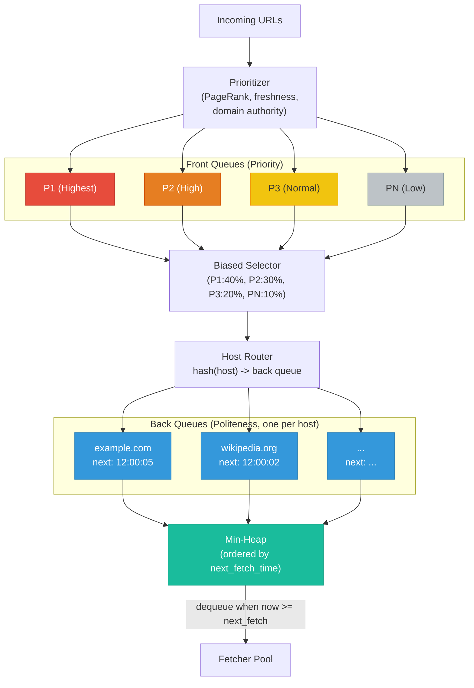
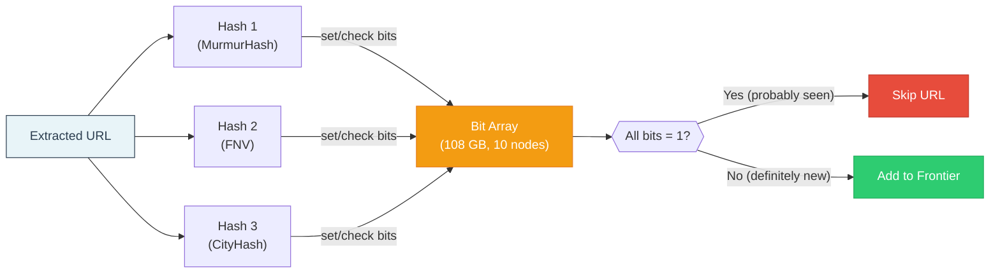
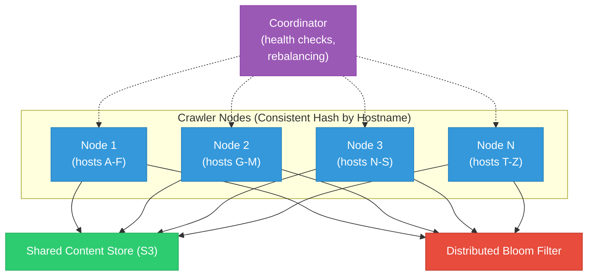
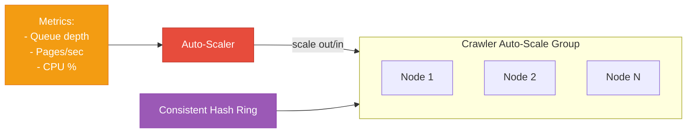

# Design a Web Crawler

> A web crawler (spider/bot) systematically browses the internet by fetching web pages,
> extracting links, and following those links to discover new pages. It is the backbone of
> search engines (Googlebot), archive services (Wayback Machine), and data mining pipelines.
> This question tests scale, politeness constraints, distributed coordination, and dedup.

---

## 1. Problem Statement & Requirements

Design a web crawler that systematically downloads billions of web pages, stores them for
later processing, and continuously discovers new content. The crawler must be polite (respect
website owners), efficient (avoid redundant work), and fault-tolerant (resume after failures).

### 1.1 Functional Requirements

- **FR-1:** Crawl web pages starting from seed URLs, extract links, and recursively crawl
  discovered pages (BFS traversal).
- **FR-2:** Respect `robots.txt` directives -- honor `Disallow`, `Crawl-delay`, and
  `User-agent` rules for every domain.
- **FR-3:** Detect and skip duplicate URLs so the same page is not fetched more than once.
- **FR-4:** Detect near-duplicate content to avoid storing redundant copies.
- **FR-5:** Store raw HTML content of each crawled page for downstream consumers.
- **FR-6:** Prioritize crawling important or frequently-updated pages over obscure ones.

### 1.2 Non-Functional Requirements

- **Scale:** Crawl 1 billion pages per month (~33 million pages/day).
- **Politeness:** Never overwhelm a single domain. Respect `Crawl-delay` directives and
  enforce per-host rate limits even when `robots.txt` does not specify one.
- **Fault tolerance:** If a crawler node crashes, no URLs are permanently lost. Crawling
  resumes from the last checkpoint without re-fetching already-crawled pages.
- **Extensibility:** Architecture allows plugging in new modules (JS renderer, language
  detector, content classifier) without redesigning the core pipeline.
- **Freshness:** Support re-crawling pages with adaptive frequency based on change rate.

### 1.3 Out of Scope

- Rendering JavaScript (assume server-side-rendered HTML only).
- Building a search index or ranking algorithm (downstream consumers handle this).
- Handling CAPTCHA or login-protected pages.
- Image, video, or binary file crawling (HTML pages only).

### 1.4 Assumptions & Estimations (Back-of-Envelope Math)

#### Traffic / Throughput

```
Pages per month        = 1 B
Pages per day          = 1 B / 30               ~ 33.3 M pages/day
Pages per second       = 33.3 M / 86,400        ~ 386 pages/sec
Peak (3x factor)       = 386 * 3                ~ 1,160 pages/sec
```

#### Storage

```
Average page size      = 500 KB raw, ~100 KB gzip compressed
Daily storage          = 33.3 M * 100 KB        = 3.33 TB / day (compressed)
Monthly storage        = 3.33 TB * 30           = ~100 TB / month
5-year storage         = 100 TB * 60            = 6 PB (compressed)
```

#### Bandwidth

```
Inbound (fetching):    386 pages/sec * 500 KB   = ~200 MB/s (peak: ~600 MB/s = 5 Gbps)
DNS lookups:           386/sec (with 80% cache hit rate: ~77 actual queries/sec)
```

#### Bloom Filter for URL Dedup

```
Expected unique URLs (5y) = 60 B
False positive rate       = 0.1%
Bits per element          = 14.4
Total memory              = 60 B * 14.4 bits     = 108 GB (partitioned across ~10 nodes)
```

---

## 2. High-Level Architecture

### 2.1 Architecture Diagram

```mermaid
graph TB
    Seed["Seed URLs"]

    subgraph URL_Frontier["URL Frontier (Priority + Politeness Queues)"]
        PQ["Priority Queue<br/>(by page importance)"]
        PolQ["Politeness Queues<br/>(per-host rate limiting)"]
    end

    Seed --> PQ
    PQ --> PolQ

    subgraph Fetcher_Pool["Fetcher Pool (Distributed)"]
        F1["Fetcher 1"]
        F2["Fetcher 2"]
        FN["Fetcher N"]
    end

    PolQ --> F1
    PolQ --> F2
    PolQ --> FN

    DNS["DNS Resolver<br/>(Local Cache + Resolver)"]
    Robots["robots.txt Cache"]
    F1 & F2 & FN --> DNS
    F1 & F2 & FN --> Robots

    subgraph Processing["Content Processing Pipeline"]
        Parser["HTML Parser"]
        ContentDedup["Content Dedup<br/>(SimHash)"]
        LinkExtractor["URL Extractor /<br/>Normalizer"]
    end

    F1 & F2 & FN --> Parser
    Parser --> ContentDedup
    Parser --> LinkExtractor

    ContentStore["Content Store<br/>(S3 / HDFS)"]
    MetadataDB["Metadata DB<br/>(PostgreSQL)"]
    ContentDedup --> ContentStore
    ContentDedup --> MetadataDB

    URLFilter["URL Filter<br/>(Bloom Filter Dedup)"]
    LinkExtractor --> URLFilter
    URLFilter -->|"new URLs"| PQ

    style Seed fill:#e8f4f8,stroke:#2c3e50,color:#2c3e50
    style PQ fill:#f39c12,stroke:#e67e22,color:#fff
    style PolQ fill:#f39c12,stroke:#e67e22,color:#fff
    style F1 fill:#3498db,stroke:#2980b9,color:#fff
    style F2 fill:#3498db,stroke:#2980b9,color:#fff
    style FN fill:#3498db,stroke:#2980b9,color:#fff
    style DNS fill:#9b59b6,stroke:#8e44ad,color:#fff
    style Robots fill:#9b59b6,stroke:#8e44ad,color:#fff
    style Parser fill:#1abc9c,stroke:#16a085,color:#fff
    style ContentDedup fill:#1abc9c,stroke:#16a085,color:#fff
    style LinkExtractor fill:#1abc9c,stroke:#16a085,color:#fff
    style ContentStore fill:#2ecc71,stroke:#27ae60,color:#fff
    style MetadataDB fill:#2ecc71,stroke:#27ae60,color:#fff
    style URLFilter fill:#e74c3c,stroke:#c0392b,color:#fff
```



### 2.2 Component Walkthrough

| Component              | Responsibility                                                                         |
| ---------------------- | -------------------------------------------------------------------------------------- |
| **Seed URLs**          | Initial well-known URLs (Wikipedia, DMOZ, news sites) to bootstrap the crawl           |
| **URL Frontier**       | Two-layer queue: priority (what to crawl next) + politeness (when to crawl it)          |
| **Fetcher Pool**       | Distributed HTTP clients. Handles timeouts, retries, redirects                         |
| **DNS Resolver**       | Local caching DNS resolver to avoid hitting external DNS on every fetch                 |
| **robots.txt Cache**   | Fetches and caches robots.txt per domain, enforces crawl rules                         |
| **HTML Parser**        | Parses raw HTML, extracts text content and metadata                                    |
| **Content Dedup**      | SimHash fingerprint to detect near-duplicate pages                                     |
| **URL Extractor**      | Extracts `<a href>` links, normalizes them to canonical form                           |
| **URL Filter**         | Bloom filter that rejects already-seen URLs before adding to the frontier               |
| **Content Store**      | S3/HDFS for raw HTML pages (6 PB over 5 years)                                         |
| **Metadata DB**        | Crawl metadata: URL, fetch time, HTTP status, content hash, outlinks                   |

### 2.3 Crawl Loop (End-to-End)

```
1. Pick the highest-priority URL whose host's politeness delay has elapsed.
2. Check robots.txt cache -- if disallowed, discard.
3. Resolve DNS (check local cache first).
4. Fetch via HTTP(S). Follow redirects (up to 5 hops). Handle errors/timeouts.
5. Compute SimHash fingerprint. If near-duplicate of stored page, skip storage.
6. Store raw HTML in content store, record metadata in DB.
7. Extract all links from HTML.
8. Normalize each URL (lowercase host, remove fragments, resolve relative paths).
9. Pass each URL through Bloom filter. If not seen, add to frontier.
10. Go to step 1.
```

---

## 3. Deep Dive

### 3.1 URL Frontier

The frontier is the most critical component. A naive FIFO queue fails because it ignores
page importance and politeness. The frontier has two layers: **front queues** (priority)
and **back queues** (politeness).

#### Frontier Architecture



**Front Queues (Priority):** Incoming URLs are scored by the prioritizer (PageRank, domain
authority, freshness, crawl depth) and placed into N priority queues. The selector picks from
higher-priority queues more frequently via biased random selection.

**Back Queues (Politeness):** Each back queue corresponds to one host. A min-heap orders
all back queues by `next_fetch_time`. The fetcher dequeues only when `now >= next_fetch_time`.
After a fetch, `next_fetch_time = now + crawl_delay` (from robots.txt or default 1s).

### 3.2 Politeness

| Parameter                    | Default Value | robots.txt Override |
| ---------------------------- | ------------- | ------------------- |
| Min delay between requests   | 1 second      | `Crawl-delay: N`    |
| Max concurrent requests/host | 1             | Not configurable    |
| Max pages per host per day   | 10,000        | Not configurable    |
| Backoff on 429/503           | Exponential (2s, 4s, 8s...) | --     |

**robots.txt handling:** Before crawling any URL on a new domain, fetch and cache its
robots.txt (TTL: 24 hours). Parse rules for our User-Agent. Never fetch disallowed paths.
If robots.txt returns 5xx, back off. If 404, assume no restrictions.

### 3.3 DNS Resolution

DNS is a hidden bottleneck at 386 lookups/sec. Three-tier caching strategy:

```
Tier 1: In-process cache (HashMap, TTL = min(DNS TTL, 5 min))  -> 80% hit rate, <0.1 ms
Tier 2: Local resolver (Unbound on each node)                   -> 15% hit rate, <1 ms
Tier 3: External DNS (8.8.8.8)                                  -> 5% hit rate, 10-100 ms
```

Optimizations: DNS prefetching for extracted outlinks, async batch resolution (c-ares
library), minimum 5-minute TTL to avoid excessive re-resolution.

### 3.4 Content Fetching

| Setting                   | Value           | Rationale                                |
| ------------------------- | --------------- | ---------------------------------------- |
| Connection timeout        | 5 seconds       | Avoid hanging on unreachable hosts       |
| Read timeout              | 30 seconds      | Some pages are slow but valid            |
| Max redirects             | 5 hops          | Prevent infinite redirect loops          |
| Max response body         | 10 MB           | Skip abnormally large pages              |
| Accept-Encoding           | gzip, deflate   | Save bandwidth                           |
| Retry policy              | 2 retries       | Exponential backoff on 5xx/network errors|

**Error handling:** 200 -> process normally. 301/302 -> follow redirect. 403/404 -> mark
as blocked/dead. 429/503 -> exponential backoff for the entire host. Timeout -> retry once.

### 3.5 Duplicate Detection

#### 3.5.1 URL Dedup (Bloom Filter)



**Why not a hash set?** A hash set for 60B URLs at 100 bytes each = 6 TB. The Bloom filter
does it in 108 GB -- a 56x reduction -- with 0.1% false positive rate. Missing 60M pages
out of 60B is acceptable; they get re-discovered on subsequent crawl cycles.

#### 3.5.2 Content Dedup (SimHash)

Different URLs can serve identical content (`?ref=twitter` vs `?ref=facebook`). **SimHash**
produces a 64-bit fingerprint where similar documents have similar fingerprints. Two pages
are near-duplicates if their SimHash fingerprints differ by fewer than 3 bits (Hamming
distance).

```
SimHash algorithm:
  1. Tokenize page text into 3-word shingles.
  2. Hash each shingle to 64 bits.
  3. For each bit position: sum +1 if hash bit is 1, -1 if 0.
  4. Final fingerprint: 1 if sum > 0, else 0 for each position.

Storage: 64-bit per page * 1B pages = 8 GB (fits on one machine).
```

| Method      | Memory / doc | Accuracy   | Best For                       |
| ----------- | ------------ | ---------- | ------------------------------ |
| **SimHash** | 8 bytes      | Good       | Large-scale near-dedup         |
| **MinHash** | 80-160 bytes | Better     | Higher accuracy requirements   |
| **MD5**     | 16 bytes     | Exact only | Exact duplicate detection only |

### 3.6 URL Extraction & Normalization

**Extraction:** Parse HTML with a lenient parser. Extract `<a href>`, `<link>`, `<frame>`,
`<iframe>` URLs. Resolve relative URLs against the page base URL. Filter out non-HTTP schemes.

**Normalization rules:**

| Rule                        | Before                                | After                          |
| --------------------------- | ------------------------------------- | ------------------------------ |
| Lowercase scheme and host   | `HTTP://Example.COM/Page`             | `http://example.com/Page`      |
| Remove default port         | `http://example.com:80/page`          | `http://example.com/page`      |
| Remove fragment             | `http://example.com/page#section`     | `http://example.com/page`      |
| Sort query parameters       | `http://example.com?b=2&a=1`          | `http://example.com?a=1&b=2`  |
| Remove tracking params      | `http://example.com?utm_source=tw`    | `http://example.com`          |

**Filtering:** Reject URLs with disallowed extensions (.jpg, .pdf, .zip), URLs > 2048 chars,
URLs with > 15 path segments, and blacklisted domains (spam, honeypots).

### 3.7 Distributed Crawling



**Partitioning by hostname:** `consistent_hash(hostname) -> crawler node`. All URLs for a
host go to the same node, so per-host politeness is enforced locally (no distributed locking).

**Sizing:** At 1s per-host delay, each node handles ~50 concurrent hosts = 50 pages/sec.
Total nodes = 386 / 50 ~ **8 nodes** (baseline), **24 nodes** (peak). Start with 10-15.

---

## 4. Content Storage

**Raw HTML:** S3 with path `s3://crawler-data/{year}/{month}/{day}/{domain_hash}/{url_hash}.html.gz`.
Partitioned by date for lifecycle management, by domain hash for balanced S3 prefix distribution.

**Metadata DB (PostgreSQL):**

| Column             | Type          | Notes                                      |
| ------------------ | ------------- | ------------------------------------------ |
| `url_hash`         | BIGINT / PK   | 64-bit hash of normalized URL              |
| `url`              | TEXT          | Full normalized URL                        |
| `domain`           | VARCHAR(255)  | Hostname, indexed                          |
| `last_crawl_time`  | TIMESTAMP     | When last fetched                          |
| `http_status`      | SMALLINT      | Last HTTP status code                      |
| `content_hash`     | BIGINT        | SimHash fingerprint                        |
| `content_path`     | VARCHAR(512)  | S3 path to stored HTML                     |
| `next_crawl_time`  | TIMESTAMP     | Scheduled re-crawl time, indexed           |

**Database choices:** PostgreSQL for metadata (structured, range queries on timestamps).
S3 for content (cheap blob storage at PB scale). Bloom filter in-memory for URL dedup.
Redis for robots.txt cache (TTL-based expiry).

---

## 5. Scaling

### 5.1 Horizontal Scaling



| Metric                | Scale-Out Threshold        | Scale-In Threshold        |
| --------------------- | -------------------------- | ------------------------- |
| Frontier queue depth  | > 10M URLs pending / node  | < 1M URLs pending / node  |
| Pages fetched / sec   | < 80% of target rate       | > 120% of target rate     |
| CPU utilization       | > 70% sustained 5 min      | < 30% sustained 15 min    |

### 5.2 Frontier Sharding

Frontier is sharded 1:1 with crawler nodes. Each shard manages its assigned domains using
disk-backed queues (RocksDB) for persistence, with the hot portion (next 10K URLs per host)
in RAM. Cross-shard URL routing via RPC when a node discovers URLs for another partition.

---

## 6. Reliability & Fault Tolerance

### 6.1 Checkpoint and Resume

- **Frontier state:** Disk-backed (RocksDB). Survives process restart.
- **Bloom filter:** Snapshotted to disk every 10 minutes. On restart, load latest snapshot.
  URLs in the gap may be re-crawled (content dedup catches duplicates).
- **In-flight URLs:** Marked "in-progress" before fetch. Watchdog reclaims them after 5-min
  timeout if fetcher crashes.
- **Content writes:** S3 PutObject is atomic. Crash during upload = page not stored; URL is
  reclaimed and re-fetched.

### 6.2 Spider Trap Detection

| Strategy                  | Description                                                    |
| ------------------------- | -------------------------------------------------------------- |
| Max crawl depth           | Do not follow links deeper than 15 levels from a seed URL      |
| Max pages per host        | Cap at 10,000 pages per domain per crawl cycle                |
| URL pattern detection     | Flag hosts generating > 1,000 URLs matching the same regex     |
| URL length limit          | Reject URLs > 2,048 characters                                |
| Path segment limit        | Reject URLs with > 15 path segments                           |
| Cycle detection           | Abort redirect chains after 5 hops                            |

### 6.3 Node Failure Recovery

```
1. Coordinator detects failure via missed heartbeats (within 30 seconds).
2. Consistent hash ring updated to exclude failed node.
3. Failed node's domain partitions redistributed to remaining nodes.
4. Frontier shard (on network-attached storage) remounted on replacement node.
5. In-flight URLs reclaimed after 5-minute timeout.
6. Replacement node spun up and joins the hash ring.
```

### 6.4 Backpressure

- **Content store overloaded:** Reduce fetch rate (fetchers sleep longer).
- **Metadata DB overloaded:** Batch writes; pause fetching if queue > 100K pending.
- **Memory pressure:** Spill frontier to disk, reduce fetch rate.

---

## 7. Trade-offs & Alternatives

| Decision                 | Chosen                     | Alternative              | Why Chosen                                                     |
| ------------------------ | -------------------------- | ------------------------ | -------------------------------------------------------------- |
| Traversal                | BFS                        | DFS                      | BFS discovers important shallow pages first; DFS gets stuck in traps |
| URL dedup                | Bloom filter (108 GB)      | Hash set in DB (6 TB)    | 56x less memory; 0.1% FP rate is acceptable                   |
| Content dedup            | SimHash (64-bit)           | MinHash + LSH            | Simpler, 8B vs 80-160B per doc, good enough accuracy          |
| Frontier persistence     | Disk-backed (RocksDB)      | In-memory only           | Survives crashes; frontier too large for RAM alone             |
| Partitioning             | Consistent hash on hostname| Random assignment        | Per-host politeness enforced locally, no distributed locking   |
| Content storage          | S3                         | HDFS                     | Cheaper, fully managed, no cluster maintenance                 |
| Re-crawl scheduling      | Adaptive (change rate)     | Fixed interval           | Avoids wasting resources on static pages                       |

### BFS vs DFS

| Aspect              | BFS                                    | DFS                                    |
| ------------------- | -------------------------------------- | -------------------------------------- |
| Page discovery      | Broad, shallow pages first             | Deep into a single site first          |
| Spider traps        | Less susceptible (breadth limits depth)| Highly susceptible                     |
| Memory usage        | Higher (wide frontier)                 | Lower (narrow stack)                   |
| Politeness          | Naturally spreads across many hosts    | Concentrates on one host               |
| **Verdict**         | **Better for general web crawling**    | Better for focused single-site crawling|

### Bloom Filter Sizing

| FP Rate | Bits/Element | Memory (60B URLs) | Missed Pages              |
| ------- | ------------ | ------------------ | ------------------------- |
| 1%      | 9.6          | 72 GB              | ~600M (too many)          |
| 0.1%    | 14.4         | 108 GB             | ~60M (acceptable)         |
| 0.01%   | 19.2         | 144 GB             | ~6M (diminishing returns) |

### Politeness vs Speed

| Approach              | Crawl Rate / Node | Trade-off                              |
| --------------------- | ----------------- | -------------------------------------- |
| No delay              | Maximum           | Get IP-banned, harm websites, unethical|
| 1s per host (chosen)  | ~50 pages/sec     | Standard politeness, widely accepted   |
| 10s per host          | ~5 pages/sec      | Very polite but very slow              |

---

## 8. Interview Tips

### What Interviewers Look For

| Signal                    | How to Demonstrate It                                                    |
| ------------------------- | ------------------------------------------------------------------------ |
| **Structured thinking**   | Requirements -> estimations -> architecture -> deep dive -> trade-offs   |
| **Scale awareness**       | Show the math: 1B pages/month -> 386 pages/sec -> 10 crawler nodes      |
| **Politeness knowledge**  | Mention robots.txt, per-host delays, why politeness matters              |
| **Dedup understanding**   | Explain both URL dedup (Bloom filter) and content dedup (SimHash)        |
| **Distributed systems**   | Partitioning by domain hash, consistent hashing, fault tolerance         |
| **Trade-off reasoning**   | BFS vs DFS, Bloom filter sizing, SimHash vs MinHash                     |

### Common Follow-Up Questions

**Q: "How would you handle JavaScript-rendered pages?"**
Add a headless browser pool (Puppeteer) as a rendering stage. Only invoke when HTML has
minimal text but contains JS bundles. Expensive (1-5s per page), so use selectively.

**Q: "How do you detect if a page has changed?"**
Store `ETag` and `Last-Modified` headers. Send conditional requests (`If-None-Match`).
304 Not Modified = skip re-processing. Otherwise compare SimHash fingerprints.

**Q: "How do you prioritize re-crawl frequency?"**
Track historical change frequency per page. Frequently-changing pages (news) re-crawled
hourly. Static pages (academic papers) re-crawled monthly. Formula:
`next_crawl = last_crawl + base_interval / change_frequency`.

**Q: "What about a domain with millions of pages?"**
Per-host 1s delay naturally throttles (10M pages = 116 days). Prioritize shallow, high-
PageRank pages. Cap at 10K pages per domain per cycle for fair coverage.

**Q: "How to handle 10x scale increase?"**
Scale crawler nodes 10 -> 100 (horizontal). Increase Bloom filter partitions. Add S3 prefixes
and DB shards. Architecture supports this via consistent hashing and shared-nothing design.

### Common Pitfalls

| Pitfall                                       | Why It Hurts                                        |
| --------------------------------------------- | --------------------------------------------------- |
| Ignoring politeness entirely                  | Instant red flag -- shows no real-world awareness    |
| Using hash set for URL dedup                  | Does not scale to billions. Show you know Bloom filters |
| Single machine design                         | 1B pages/month is impossible on one machine          |
| No spider trap protection                     | Interviewers will ask about infinite loops           |
| Not distinguishing URL dedup from content dedup| They solve different problems. Explain both         |
| Skipping the math                             | Without numbers, all design decisions are arbitrary  |

### Interview Timeline (45 minutes)

```
 0:00 -  3:00  [3 min]  Clarify requirements: scale, politeness, JS rendering, scope.
 3:00 -  8:00  [5 min]  Back-of-envelope: pages/sec, storage, bandwidth, Bloom filter sizing.
 8:00 - 14:00  [6 min]  High-level architecture: crawl loop diagram, component walkthrough.
14:00 - 24:00  [10 min] Deep dive: URL frontier (priority + politeness), Bloom filter, SimHash.
24:00 - 30:00  [6 min]  Distributed crawling: partitioning, consistent hashing, node sizing.
30:00 - 36:00  [6 min]  Reliability: checkpointing, spider traps, failure recovery.
36:00 - 42:00  [6 min]  Trade-offs: BFS vs DFS, Bloom filter sizing, politeness vs speed.
42:00 - 45:00  [3 min]  Wrap up: extensions (JS rendering, adaptive re-crawl, multi-region).
```

---

## Quick Reference Card

```
System:           Web Crawler
Scale:            1 B pages/month, ~386 pages/sec
Storage (5y):     ~6 PB compressed (S3)
Crawler nodes:    10-25 (auto-scaling, consistent hash by hostname)
URL dedup:        Bloom filter, 108 GB, 0.1% FP rate, 10 hash functions
Content dedup:    SimHash, 64-bit fingerprint, 3-bit Hamming threshold
Frontier:         Two-layer: priority queues (front) + politeness queues (back)
Politeness:       1s default per-host delay, respect robots.txt Crawl-delay
DNS:              3-tier cache: in-process -> local resolver -> external
Content storage:  S3 with date/domain-hash path, gzip compressed
Metadata:         PostgreSQL (url_hash, status, content_hash, next_crawl_time)
Key trade-off:    BFS over DFS for broad coverage; Bloom filter over hash set for memory
```
