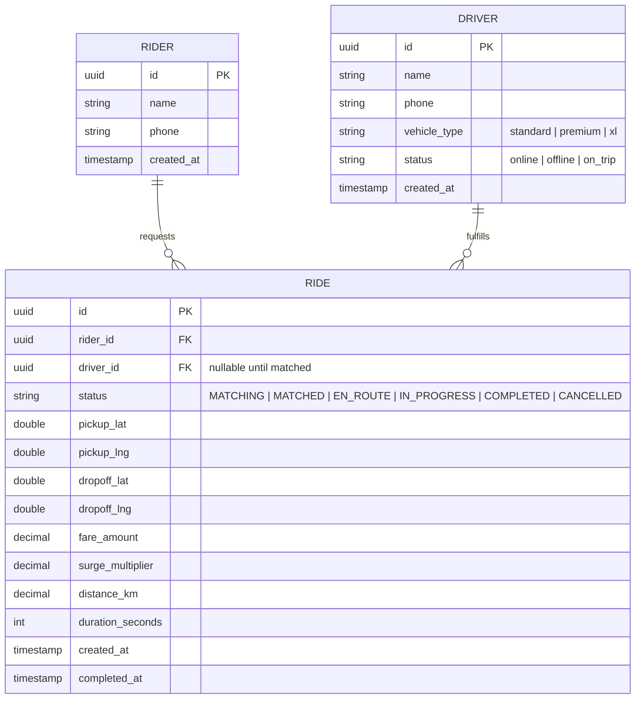
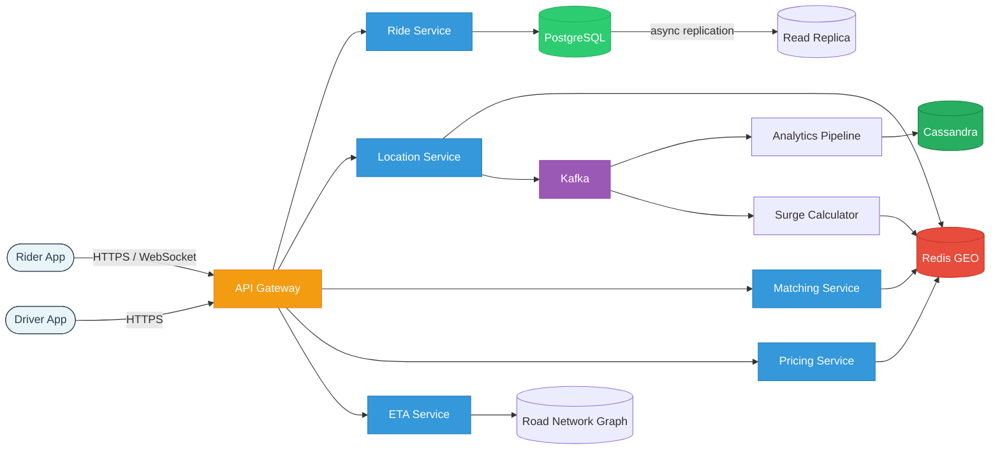
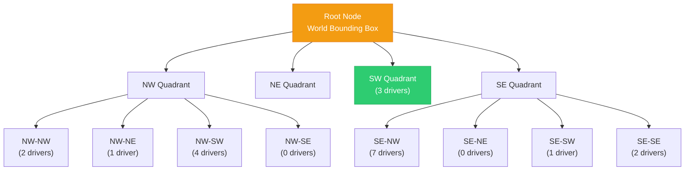
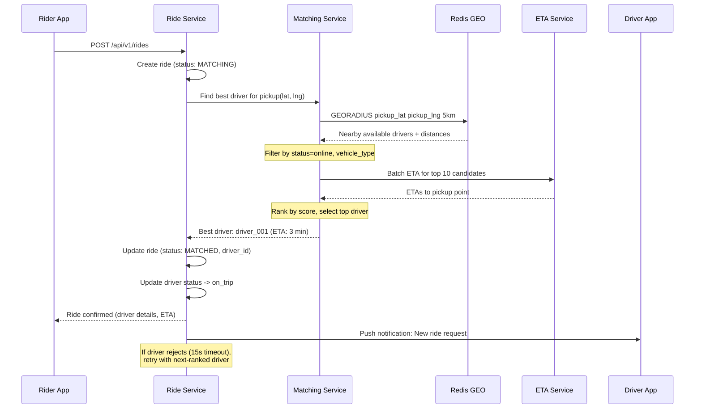
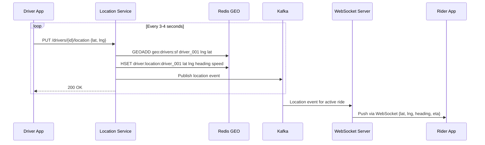
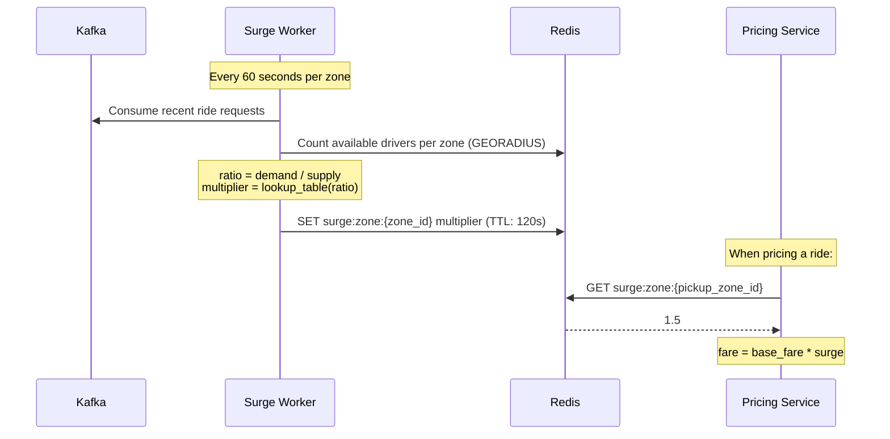

# Design Uber/Lyft (Ride-Sharing Platform)

> A ride-sharing platform connects riders who need transportation with nearby drivers
> in real time. The system must handle geospatial matching, real-time location tracking,
> dynamic pricing, and trip lifecycle management -- all at massive scale with sub-second
> latency. This is a top-tier system design question because it covers real-time systems,
> geospatial indexing, event-driven architecture, and complex state machines.

---

## 1. Problem Statement & Requirements

Design a ride-sharing platform that allows riders to request rides, matches them with
nearby available drivers in real time, tracks driver location throughout the trip, calculates
ETAs and fares, and applies dynamic surge pricing based on supply and demand.

### 1.1 Functional Requirements

- **FR-1:** Rider requests a ride by specifying pickup and dropoff locations.
- **FR-2:** System matches the rider with the best available nearby driver within seconds.
- **FR-3:** Real-time driver location tracking visible to the rider (before and during trip).
- **FR-4:** ETA calculation for driver arrival and trip duration.
- **FR-5:** Trip lifecycle management (requested -> matched -> en route -> in progress -> completed).
- **FR-6:** Fare calculation based on distance, time, and surge multiplier.
- **FR-7:** Surge pricing based on real-time supply/demand ratio per geographic area.

### 1.2 Non-Functional Requirements

- **Latency:** Driver matching must complete in < 5 seconds. Location updates delivered to rider in < 1 second.
- **Availability:** 99.99% uptime -- riders stranded without the app is unacceptable.
- **Throughput:** Support 20M rides/day and 2M concurrent drivers sending location pings.
- **Consistency model:** Eventual consistency for location data. Strong consistency for trip state transitions (no double-matching a driver).
- **Scalability:** Horizontal scaling to handle peak hours (2-3x average traffic).

### 1.3 Out of Scope

- Payment processing and wallet management.
- Driver onboarding, background checks, and vehicle verification.
- Rider/driver ratings and reviews system.
- Ride pooling / shared rides (UberPool / Lyft Shared).
- In-app messaging and calling between rider and driver.

### 1.4 Assumptions & Estimations (Back-of-Envelope Math)

#### Traffic Estimates

```
Rides:
  Rides per day             = 20 M
  Rides per second          = 20 M / 86,400    ~  230 RPS
  Peak rides per second     = 230 * 3           ~  700 RPS

Concurrent drivers:
  Active drivers            = 2 M
  Location update interval  = 4 seconds
  Location update QPS       = 2 M / 4           =  500,000 QPS (500K QPS)
  Peak location QPS         = 500 K * 2          =  1 M QPS

Concurrent riders tracking:
  Active rides at any time  = 20 M / 24 * 0.5   ~  416 K concurrent rides
  Rider location poll QPS   = 416 K / 3          ~  140 K QPS
```

#### Storage Estimates

```
Location data (ephemeral, Redis/in-memory):
  Per driver location        = 50 bytes (driver_id + lat + lng + timestamp + status)
  Total in-memory            = 2 M * 50 B       = 100 MB

Location history (analytics):
  Updates per driver per day = 86,400 / 4        = 21,600 updates
  Total daily updates        = 2 M * 21,600      = 43.2 B records/day
  Daily location storage     = 43.2 B * 30 B     = 1.3 TB / day (30-day retention = 39 TB)

Trip data (persistent):
  Per trip record            = 500 bytes
  Daily trip storage         = 20 M * 500 B      = 10 GB / day
  Yearly trip storage        = 3.65 TB / year
```

---

## 2. API Design

### 2.1 Request a Ride

```
POST /api/v1/rides
Headers: Authorization: Bearer <token>

Request Body:
{
  "rider_id": "rider_abc123",
  "pickup": { "latitude": 37.7749, "longitude": -122.4194 },
  "dropoff": { "latitude": 37.3382, "longitude": -121.8863 },
  "ride_type": "standard"
}

Response: 201 Created
{
  "ride_id": "ride_xyz789",
  "status": "MATCHING",
  "estimated_fare": { "min": 45.00, "max": 58.00, "surge_multiplier": 1.5 },
  "estimated_pickup_eta_seconds": 180
}

Errors: 400 (invalid coords), 404 (no drivers), 429 (rate limited)
```

### 2.2 Get Nearby Drivers

```
GET /api/v1/drivers/nearby?lat=37.7749&lng=-122.4194&radius_km=5&limit=10

Response: 200 OK
{
  "drivers": [
    { "driver_id": "driver_001", "latitude": 37.7751, "longitude": -122.4180,
      "distance_km": 0.15, "eta_seconds": 120, "vehicle_type": "standard" }
  ],
  "total_available": 47
}
```

### 2.3 Update Driver Location

```
PUT /api/v1/drivers/{driver_id}/location

Request: { "latitude": 37.7752, "longitude": -122.4178, "heading": 90.0, "speed_kmh": 35.0 }
Response: 200 OK { "status": "acknowledged" }
```

### 2.4 Get Ride ETA

```
GET /api/v1/rides/{ride_id}/eta

Response: 200 OK
{
  "ride_id": "ride_xyz789",
  "driver_eta_seconds": 145,
  "trip_eta_seconds": 2400,
  "driver_location": { "latitude": 37.7755, "longitude": -122.4170 }
}
```

### 2.5 Real-Time Location Stream (WebSocket)

```
WebSocket: wss://api.example.com/ws/rides/{ride_id}/track

Server pushes every 3-4 seconds:
{ "driver_id": "driver_001", "latitude": 37.7755, "longitude": -122.4170,
  "heading": 90.0, "eta_seconds": 130, "timestamp": "2026-02-28T10:32:04Z" }
```

---

## 3. Data Model

### 3.1 ER Diagram



### 3.2 Real-Time Location Store (Redis)

Driver locations are ephemeral, high-frequency data stored entirely in Redis:

```
driver:location:{driver_id}  ->  Hash {lat, lng, heading, speed, timestamp, status}
  TTL: 30 seconds (auto-expire if driver stops pinging)

geo:drivers:{city_id}  ->  Redis GEO set (GEOADD, GEORADIUS)
  Used for: finding nearby available drivers

ride:active:{ride_id}  ->  Hash {driver_id, rider_id, status, pickup, dropoff}
  TTL: 4 hours
```

### 3.3 Database Choice Justification

| Requirement                  | Choice               | Reason                                                         |
| ---------------------------- | -------------------- | -------------------------------------------------------------- |
| Trip data (ACID)             | **PostgreSQL**       | Trip state transitions need strong consistency, no double-match |
| Real-time driver locations   | **Redis GEO**        | GEORADIUS for proximity, sub-ms latency, handles 500K QPS      |
| Location history / analytics | **Cassandra / TSDB** | Time-series writes at 43B records/day, TTL-based expiry        |
| Event streaming              | **Kafka**            | Decouple location ingestion from processing, replay capability |

---

## 4. High-Level Architecture

### 4.1 Architecture Diagram



### 4.2 Component Walkthrough

| Component              | Responsibility                                                                    |
| ---------------------- | --------------------------------------------------------------------------------- |
| **API Gateway**        | Authentication, rate limiting, request routing, TLS termination                    |
| **Ride Service**       | Trip lifecycle management. Source of truth for ride state in PostgreSQL             |
| **Location Service**   | Ingests 500K QPS driver location updates. Updates Redis GEO. Publishes to Kafka    |
| **Matching Service**   | Finds nearby available drivers via geospatial index. Ranks and selects best driver |
| **Pricing Service**    | Calculates base fare + surge multiplier. Reads surge data from Redis               |
| **ETA Service**        | Computes ETA using road network graph + live traffic data                           |
| **Surge Calculator**   | Kafka consumer. Computes supply/demand ratio per zone every 60 seconds             |

---

## 5. Deep Dive: Core Flows

### 5.1 Geospatial Indexing -- Finding Nearby Drivers

#### Approach 1: QuadTree

Recursively subdivides 2D space into four quadrants. Dense areas (Manhattan) get deeper
subdivisions; rural areas stay shallow.



```
Properties: O(log n) lookup, O(log n + k) range query, adaptive granularity.
Pros: Dense areas get finer cells automatically.
Cons: Hard to distribute across machines. Rebalancing on updates.
```

#### Approach 2: Geohash

Encodes lat/lng into a base32 string. Nearby points share a common prefix.

```
Precision   Geohash     Cell Size           Use Case
4 chars     "9q8y"      ~39 km x 19.5 km    metro area
5 chars     "9q8yy"     ~4.9 km x 4.9 km    city-level
6 chars     "9q8yyk"    ~1.2 km x 0.6 km    neighborhood
7 chars     "9q8yykb"   ~153 m x 153 m      block-level

Finding nearby drivers: query target cell + 8 neighboring cells (boundary fix).
Pros: Simple, maps to sorted key-value stores (Redis, DynamoDB). Easy to shard.
Cons: Fixed grid, does not adapt to density. Edge/boundary problem.
```

#### Approach 3: S2 Geometry (Used by Uber/Google)

Projects Earth onto a cube, uses Hilbert curves for hierarchical decomposition.
Each cell has a 64-bit ID. Cells at a given level are approximately equal area.

```
Uber uses S2 level 12 (~3.3 km^2) for city operations and level 14 for matching.
Pros: Equal-area cells, no edge effects, excellent region covering.
Cons: More complex to implement, requires S2 library.
```

#### Comparison Table

| Criteria                | QuadTree           | Geohash            | S2 Geometry            |
| ----------------------- | ------------------ | ------------------ | ---------------------- |
| **Adaptivity**          | Adaptive (density) | Fixed grid         | Fixed levels, equal area |
| **Implementation**      | Moderate           | Simple             | Complex                |
| **Distributed storage** | Hard               | Easy (prefix)      | Easy (cell ID range)   |
| **Edge/boundary issue** | No                 | Yes (8 neighbors)  | No (Hilbert curve)     |
| **Update cost**         | O(log n)           | O(1) recompute     | O(1) recompute         |
| **Used by**             | Custom solutions   | Redis, DynamoDB    | Uber, Google Maps      |

**Our choice: Redis GEO (geohash internally) for the hot path + S2 for the matching service.**

### 5.2 Driver Matching Algorithm

#### Matching Score

```
Score = w1*(1/distance) + w2*(1/eta) + w3*acceptance_rate + w4*driver_rating

  w1=0.4 (proximity), w2=0.3 (ETA), w3=0.2 (acceptance), w4=0.1 (rating)
```

#### Matching Flow



#### Dispatch Strategy: Single dispatch with fallback. Send to best driver. If no acceptance
within 15 seconds, try next. After 3 rejections, widen radius. After 2 minutes, allow cancel.

### 5.3 Real-Time Location Tracking

#### Location Update Flow



#### Optimizations for 500K QPS

```
1. Batch writes: Buffer updates for 100-200ms, pipeline Redis commands (10-50x fewer round trips)
2. Delta compression: Skip update if driver moved < 5m (reduces QPS by 30-50%)
3. Geographic sharding: Each Location Service instance handles one city region
   500K QPS / 10 shards = 50K QPS per instance
4. Fire-and-forget: Losing one location update is fine (next one arrives in 4s)
```

### 5.4 ETA Calculation

```
Road network = weighted directed graph (nodes = intersections, edges = road segments)

Algorithms (from slowest to fastest for queries):
  Dijkstra:                  O((V+E) log V)  -- too slow for real-time
  A*:                        Faster with heuristic but still expensive
  Contraction Hierarchies:   < 1 ms queries (precomputed shortcuts, used by Uber/Google)

Dynamic ETA = base_travel_time * traffic_multiplier + pickup_overhead
  traffic_multiplier: ML model trained on historical patterns + real-time driver speeds
  pickup_overhead: 60-120 seconds
```

### 5.5 Surge Pricing

City divided into zones (S2 cells at level 12, ~3.3 km^2). Every 60 seconds per zone:

```
supply  = available drivers in zone
demand  = ride requests in last 5 minutes
ratio   = demand / supply

Surge mapping:
  ratio < 1.0   -> 1.0x    ratio 2.0-3.0 -> 2.0x
  ratio 1.0-1.5 -> 1.2x    ratio 3.0-5.0 -> 2.5x
  ratio 1.5-2.0 -> 1.5x    ratio > 5.0   -> 3.0x (capped)
```



#### Fare Formula

```
fare = (base_fare + per_km_rate * distance + per_min_rate * duration) * surge_multiplier
     = ($2.50 + $1.50*10km + $0.25*20min) * 1.5 = $22.50 * 1.5 = $33.75
```

---

## 6. Scaling & Performance

### 6.1 Location Service Sharding

```
Shard by city/region (geohash prefix):
  Shard 1: SF area ("9q8")    -> ~100K drivers, ~50K QPS
  Shard 2: LA area ("9q5")    -> ~150K drivers, ~75K QPS
  Shard 3: NYC area ("dr5")   -> ~200K drivers, ~100K QPS

Each shard has: dedicated Redis GEO instance, Location Service instances, Kafka partition.
Failures isolated to one city. Hot cities scale independently.
```

### 6.2 Kafka Partitioning

```
driver-location-updates:  100 partitions (key=driver_id), retention 24h
ride-events:              50 partitions (key=ride_id), retention 7 days
surge-calculations:       20 partitions (key=zone_id), retention 1 hour

Consumer groups: location-to-redis, location-to-cassandra, location-to-websocket, surge-calculator
```

### 6.3 Database Scaling

```
PostgreSQL sharded by rider_id (hash-based), 8 shards initially.
Per shard: 2.5M writes/day, ~1.25 GB/day.
2 read replicas per shard for trip history queries.
PgBouncer for connection pooling.
```

### 6.4 Performance Summary

| Metric                        | Target           | How Achieved                                     |
| ----------------------------- | ---------------- | ------------------------------------------------ |
| Driver matching latency       | < 5 seconds      | Redis GEORADIUS + pre-ranked candidates          |
| Location update ingestion     | 500K QPS         | Sharded Location Service + Redis GEO             |
| Location update to rider      | < 1 second       | Kafka -> WebSocket server, direct push           |
| ETA calculation               | < 200 ms         | Contraction Hierarchies, precomputed graph       |
| Fare calculation              | < 50 ms          | Simple formula + Redis lookup for surge          |

---

## 7. Reliability & Fault Tolerance

### 7.1 Trip State Machine

```
REQUESTED -> MATCHING -> MATCHED -> DRIVER_EN_ROUTE -> DRIVER_ARRIVED -> TRIP_STARTED -> TRIP_COMPLETED

Any state before TRIP_STARTED can transition to CANCELLED.
```

State transitions enforced with optimistic locking:

```sql
UPDATE rides SET status = 'MATCHED', driver_id = 'driver_001'
WHERE id = 'ride_xyz789' AND status = 'MATCHING' AND driver_id IS NULL;
-- affected_rows = 0 means ride was already matched or cancelled
```

### 7.2 SPOFs and Mitigations

| Component           | SPOF? | Mitigation                                                                   |
| ------------------- | ----- | ---------------------------------------------------------------------------- |
| API Gateway         | Yes   | Multiple instances behind DNS, active-active across AZs                      |
| Location Service    | No    | Stateless, horizontally scaled, sharded by city                              |
| Matching Service    | No    | Stateless, multiple instances, retry on failure                              |
| Redis GEO           | Yes   | Redis Cluster with replicas, auto-failover. Fallback: direct DB query        |
| PostgreSQL          | Yes   | Synchronous standby, auto-failover via Patroni, RTO < 30s                   |
| Kafka               | No    | 3-broker cluster, replication factor 3, min.insync.replicas = 2              |

### 7.3 Reconnection Handling

```
Driver loses connectivity (30s):
  - Redis TTL expires -> driver auto-removed from available pool
  - Active trip NOT cancelled (rider already in car)
  - On reconnect: app sends location, resumes trip or re-enters pool

Rider loses connectivity:
  - Trip continues unaffected (state in PostgreSQL)
  - On reconnect: GET /rides/{id} for current state, re-establish WebSocket

Matching failure recovery:
  - Background job every 30s finds rides stuck in MATCHING > 30 seconds
  - Re-triggers matching to prevent silently dropped requests
```

---

## 8. Trade-offs & Alternatives

### 8.1 Key Design Decisions

| Decision                   | Chosen                      | Alternative                | Why Chosen                                                    |
| -------------------------- | --------------------------- | -------------------------- | ------------------------------------------------------------- |
| Geospatial index           | Redis GEO + S2              | PostGIS                    | Sub-ms latency at 500K QPS; PostGIS too slow for real-time    |
| Rider tracking             | WebSocket (push)            | HTTP polling (pull)        | Real-time updates < 1s; polling wastes bandwidth              |
| Trip state storage         | PostgreSQL                  | Redis                      | ACID for state transitions; Redis not durable enough          |
| Matching strategy          | Single dispatch             | Broadcast                  | Higher acceptance rate, avoids wasted driver effort            |
| Location history           | Cassandra                   | PostgreSQL                 | 43B records/day needs write-optimized time-series store       |

### 8.2 QuadTree vs Geohash vs S2 -- When to Pick

| Scenario                           | Best Choice   | Reason                                               |
| ---------------------------------- | ------------- | ---------------------------------------------------- |
| Prototype / MVP                    | Geohash       | Simplest, works with Redis GEO out of the box        |
| Variable density (cities + rural)  | QuadTree      | Adaptive subdivision handles density differences     |
| Production at Uber/Google scale    | S2 Geometry   | Equal-area cells, no edge effects, battle-tested     |
| In-memory on a single node         | QuadTree      | Fastest for point/range queries with no network hop  |

### 8.3 Push vs Pull for Location Updates

| Factor            | Push (WebSocket)                         | Pull (HTTP Polling)                    |
| ----------------- | ---------------------------------------- | -------------------------------------- |
| **Latency**       | ~100 ms (server pushes immediately)      | Up to 3s (polling interval)            |
| **Bandwidth**     | Efficient (only sends on change)         | Wasteful (empty polls)                 |
| **Scalability**   | Harder (stateful connections)            | Easier (stateless HTTP)                |
| **Our choice**    | Push for active rides                    | Pull for idle browsing                 |

---

## 9. Interview Tips

### 9.1 What Interviewers Look For

| Signal                    | How to Demonstrate It                                                          |
| ------------------------- | ------------------------------------------------------------------------------ |
| **Geospatial knowledge**  | Explain QuadTree, Geohash, S2. Pick one and justify. Know the tradeoffs        |
| **Real-time thinking**    | 500K QPS location updates is the crux. Show ingestion, indexing, and fan-out   |
| **State management**      | Trip state machine is critical. Show valid transitions, handle edge cases      |
| **Scale awareness**       | Compute the QPS. Show sharding strategy for location data                      |

### 9.2 Common Follow-Up Questions

**Q: "How would you handle New Year's Eve (10x surge)?"**
- Auto-scale matching service. Widen search radius when wait times spike.
- Surge pricing balances supply/demand. Batch matching in 2-3s windows.
- Pre-position drivers using historical demand data.

**Q: "What if Redis goes down?"**
- Replica promotion in < 30s. Locations rebuild in 4 seconds (one ping interval).
- Fallback to PostgreSQL GIS queries (higher latency, lower QPS).
- In-flight rides unaffected (trip state in PostgreSQL, WebSocket stays open).

**Q: "How do you prevent double-matching a driver?"**
- Optimistic locking: `UPDATE drivers SET status = 'on_trip' WHERE id = X AND status = 'online'`
- If affected_rows = 0, driver already matched. Retry with next driver.

**Q: "How would you add ride pooling?"**
- Rides get `capacity` and `current_passengers` fields.
- Matching checks `current_passengers < capacity`.
- Routing computes optimal pickup/dropoff ordering. Fare split by distance.

### 9.3 Common Pitfalls

| Pitfall                                        | Why It Hurts You                                                        |
| ---------------------------------------------- | ----------------------------------------------------------------------- |
| Ignoring the 500K QPS location ingestion       | This is THE scaling challenge. Not addressing it signals lack of depth  |
| Storing real-time locations in PostgreSQL       | Relational DB cannot handle 500K writes/sec of ephemeral data           |
| No geospatial index discussion                 | "Just query all drivers" does not work at scale                         |
| Skipping the trip state machine                | Interviewers will ask "what if driver cancels mid-trip?"                |
| Over-complicating surge pricing                | Keep it simple: supply/demand ratio per zone                            |

### 9.4 Interview Timeline (45-Minute Format)

```
 0:00 -  3:00  [3 min]  Clarify requirements. Scale, features, constraints.
 3:00 -  7:00  [4 min]  Back-of-envelope. Location QPS (500K), storage, bandwidth.
 7:00 - 11:00  [4 min]  API design. Ride request, location update, nearby drivers, WebSocket.
11:00 - 15:00  [4 min]  Data model. Rides, drivers, Redis for locations. ER diagram.
15:00 - 20:00  [5 min]  High-level architecture. All services, data stores, Kafka.
20:00 - 26:00  [6 min]  Deep dive: Geospatial indexing (QuadTree vs Geohash vs S2).
26:00 - 31:00  [5 min]  Deep dive: Matching algorithm + real-time location tracking.
31:00 - 35:00  [4 min]  Deep dive: Surge pricing and ETA calculation.
35:00 - 39:00  [4 min]  Scaling. Location service sharding, Redis cluster, Kafka.
39:00 - 43:00  [4 min]  Reliability. Trip state machine, reconnection, SPOFs.
43:00 - 45:00  [2 min]  Trade-offs summary.
```

---

## Quick Reference Card

```
System:            Ride-Sharing (Uber/Lyft)
Core challenge:    Real-time geospatial matching at 500K QPS location updates
Rides/day:         20M rides, ~230 RPS (700 RPS peak)
Concurrent drivers: 2M, location ping every 4 seconds
Location QPS:      500K writes/s (peak 1M)
Geospatial index:  Redis GEO (hot path) + S2 Geometry (matching)
Trip storage:      PostgreSQL (sharded by rider_id)
Location storage:  Redis (real-time) + Cassandra (history)
Event bus:         Kafka (location events, trip events, surge triggers)
Matching latency:  < 5 seconds
Rider tracking:    WebSocket (push), < 1 second latency
Surge pricing:     Supply/demand ratio per S2 zone, recalculated every 60s
Key trade-off:     WebSocket (low latency) over HTTP polling (simpler infra)
```
