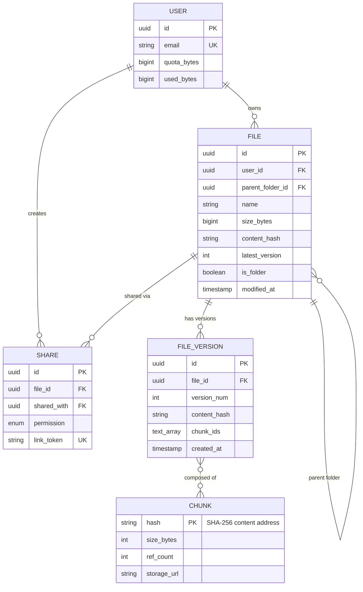
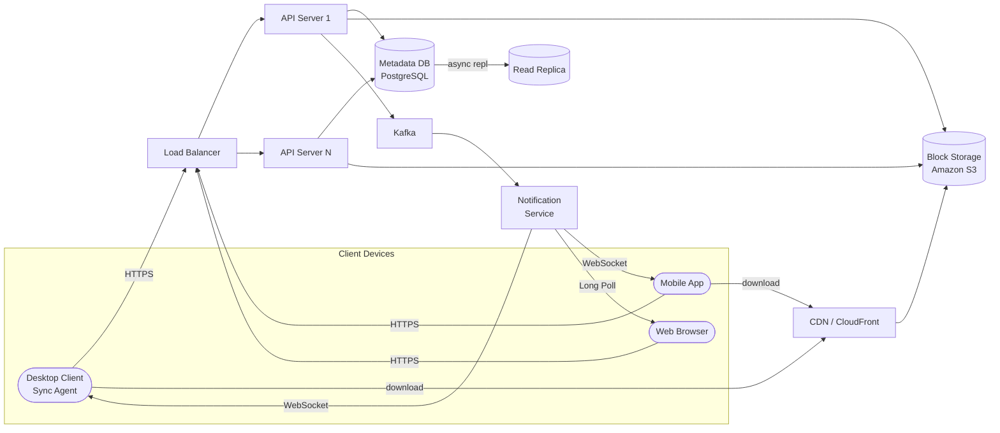
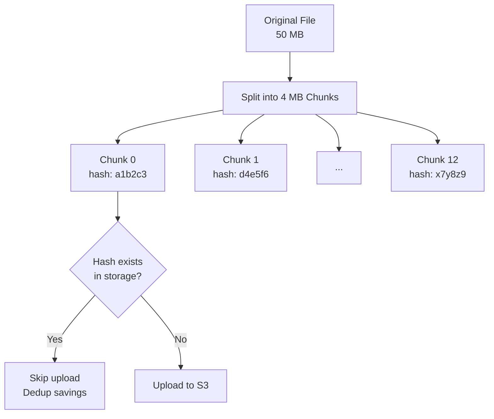
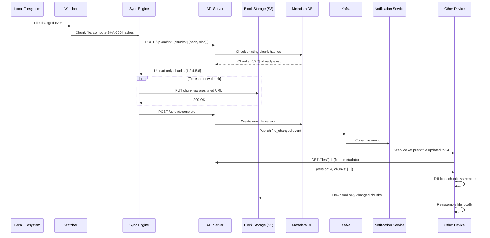
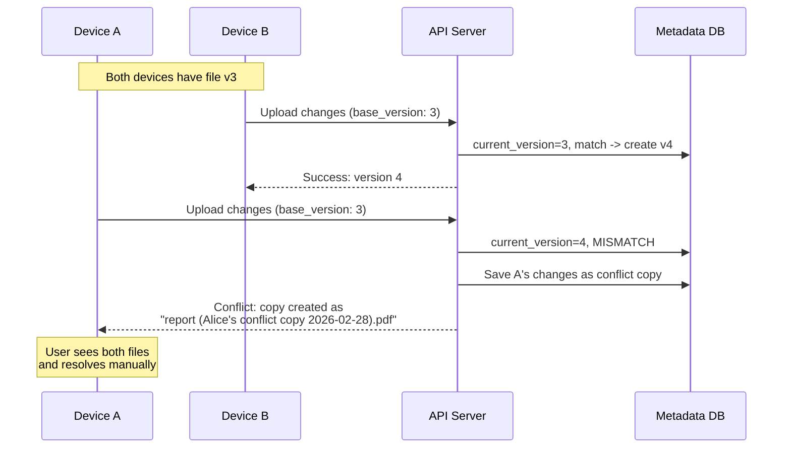
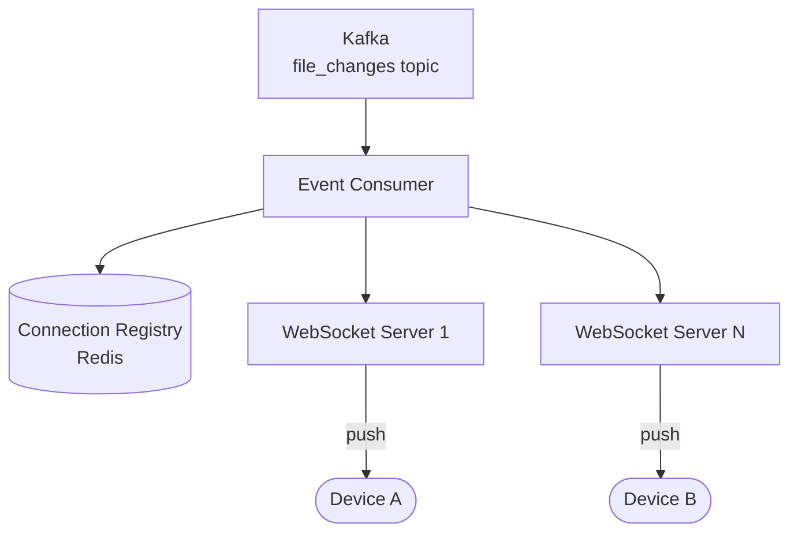

# Design Dropbox / Google Drive (Cloud File Storage & Sync)

> A cloud file storage system lets users upload, store, and sync files across multiple devices.
> When a user modifies a file on one device, the change automatically propagates to all other
> linked devices. The system must handle large files efficiently, minimize bandwidth usage by
> syncing only the changed portions, and resolve conflicts when the same file is edited on
> multiple devices simultaneously. This covers chunking, deduplication, sync protocols,
> conflict resolution, and distributed storage.

---

## 1. Problem Statement & Requirements

Design a cloud file storage and synchronization service (like Dropbox or Google Drive) that
allows users to upload, download, and sync files across devices. The system should handle
large files efficiently, use minimal bandwidth, and keep files consistent across all devices.

### 1.1 Functional Requirements

- **FR-1:** Upload and download files (support files up to 50 GB).
- **FR-2:** Automatic sync across all linked devices -- a change on one device appears on all others.
- **FR-3:** File versioning -- users can view and restore previous versions of a file.
- **FR-4:** Sharing -- share files/folders via links or with specific users (view/edit permissions).
- **FR-5:** Offline editing -- users can modify files offline; changes sync when connectivity is restored.
- **FR-6:** File/folder organization -- create folders, move, rename, delete files.

### 1.2 Non-Functional Requirements

- **Reliability:** Zero data loss. Once a file is uploaded and acknowledged, it must never be lost.
- **Availability:** 99.9% uptime (~8.7 hours downtime/year).
- **Low bandwidth:** Sync only changed portions of a file, not the entire file.
- **Consistency:** Eventual consistency for sync propagation; strong consistency for metadata writes.
- **Large file support:** Handle files up to 50 GB via chunked, resumable uploads.
- **Latency:** Small file changes should propagate to other devices within 5-10 seconds.
- **Conflict resolution:** Gracefully handle simultaneous edits to the same file on different devices.

### 1.3 Out of Scope

- Real-time collaborative editing (that is Google Docs -- a separate system).
- Full-text search across file contents.
- Advanced media features (photo gallery, video streaming, image previews).
- Billing, subscription tiers, and storage quota enforcement.

### 1.4 Assumptions & Estimations (Back-of-Envelope Math)

#### User and Storage Estimates

```
Total users              = 500 M
Daily active users (DAU) = 100 M  (20%)
Average files per user   = 200
Average file size        = 100 KB

Total files              = 500 M * 200 = 100 B files
Total storage            = 100 B * 100 KB = 10 PB (raw, before dedup)
With deduplication (~40% savings):
  Effective storage      = 10 PB * 0.6 = 6 PB
```

#### Sync Traffic Estimates

```
Files modified / user / day  = 5
Total file modifications/day = 100 M * 5 = 500 M / day
Modifications / second       = 500 M / 86,400 ~ 5,800 ops/sec

Average chunks changed per modification = 2 (delta sync)
Chunk uploads / second       = 5,800 * 2 = 11,600 chunks/sec
Metadata queries (list, stat) = 10x file mods = 58,000 QPS

Average devices per user     = 3
Notifications / second       = 5,800 * 3 = 17,400 notifications/sec
Connected WebSocket clients  = 100 M * 1.5 active devices = 150 M connections
```

> **Key insight:** The system is metadata-heavy. Most operations are metadata queries,
> not file transfers. The metadata service must handle 58K+ QPS.

---

## 2. API Design

### 2.1 Chunked Resumable Upload

```
POST /api/v1/files/upload/init
Request:
{
  "file_name": "project-report.pdf",
  "file_size": 52428800,
  "parent_folder_id": "folder_abc123",
  "content_hash": "sha256:a1b2c3...",
  "chunks": [
    {"index": 0, "hash": "sha256:d4e5f6...", "size": 4194304},
    {"index": 1, "hash": "sha256:g7h8i9...", "size": 4194304},
    ...
  ]
}
Response: 200 OK
{
  "upload_id": "upload_xyz789",
  "chunks_already_stored": [0, 3, 7],       // dedup: these chunks exist
  "chunks_to_upload": [1, 2, 4, 5, 6, 8, 9, 10, 11, 12],
  "upload_urls": { "1": "https://storage.example.com/upload/...", ... }
}

PUT /api/v1/files/upload/{upload_id}/chunk/{chunk_index}
Headers: Content-Type: application/octet-stream, X-Chunk-Hash: sha256:g7h8i9...
Body: <raw chunk bytes>
Response: 200 OK { "chunk_index": 1, "status": "stored", "chunks_remaining": 9 }

POST /api/v1/files/upload/{upload_id}/complete
Response: 201 Created { "file_id": "file_def456", "version": 1 }
```

### 2.2 Download

```
GET /api/v1/files/{file_id}/download
Headers: Range: bytes=0-4194303              // optional: partial download / resume
Response: 200 OK (or 206 Partial Content)
Headers: Accept-Ranges: bytes, ETag: "sha256:a1b2c3..."
Body: <file bytes>
```

### 2.3 Get Changes (Delta Sync)

```
GET /api/v1/changes?cursor=last_sync_cursor
Response: 200 OK
{
  "changes": [
    {"type": "file_modified", "file_id": "file_1", "version": 4, ...},
    {"type": "file_added", "file_id": "file_2", ...},
    {"type": "file_deleted", "file_id": "file_3", ...}
  ],
  "cursor": "new_sync_cursor",
  "has_more": false
}
```

### 2.4 List Files & Share

```
GET /api/v1/folders/{folder_id}/contents?cursor=abc&limit=100
Response: 200 OK { "items": [...], "cursor": "next_page_token", "has_more": true }

POST /api/v1/files/{file_id}/share
Request: { "type": "link", "permission": "view", "user_email": "bob@example.com" }
Response: 201 Created { "share_id": "share_abc", "link": "https://drive.example.com/s/share_abc" }
```

---

## 3. Data Model

### 3.1 Schema

| Table           | Column           | Type         | Notes                              |
| --------------- | ---------------- | ------------ | ---------------------------------- |
| `users`         | `id`             | UUID / PK    | Unique user identifier             |
| `users`         | `email`          | VARCHAR(255) | Unique, indexed                    |
| `users`         | `quota_bytes`    | BIGINT       | Storage quota (e.g., 2 TB)         |
| `users`         | `used_bytes`     | BIGINT       | Current usage                      |
| `files`         | `id`             | UUID / PK    | Unique file identifier             |
| `files`         | `user_id`        | UUID / FK    | Owner                              |
| `files`         | `parent_folder_id` | UUID / FK  | Parent folder (nullable for root)  |
| `files`         | `name`           | VARCHAR(255) | File name                          |
| `files`         | `size_bytes`     | BIGINT       | Total file size                    |
| `files`         | `content_hash`   | VARCHAR(64)  | SHA-256 of entire file             |
| `files`         | `latest_version` | INT          | Current version number             |
| `files`         | `is_folder`      | BOOLEAN      | True if folder                     |
| `files`         | `is_deleted`     | BOOLEAN      | Soft delete flag                   |
| `files`         | `modified_at`    | TIMESTAMP    | Indexed for sync queries           |
| `file_versions` | `id`             | UUID / PK    | Version identifier                 |
| `file_versions` | `file_id`        | UUID / FK    | References files.id                |
| `file_versions` | `version_num`    | INT          | Monotonically increasing           |
| `file_versions` | `content_hash`   | VARCHAR(64)  | SHA-256 of this version            |
| `file_versions` | `chunk_ids`      | TEXT[]       | Ordered list of chunk hashes       |
| `file_versions` | `created_at`     | TIMESTAMP    | When version was created           |
| `chunks`        | `hash`           | VARCHAR(64) / PK | SHA-256 (content-addressable)  |
| `chunks`        | `size_bytes`     | INT          | Chunk size                         |
| `chunks`        | `ref_count`      | INT          | File versions referencing this     |
| `chunks`        | `storage_url`    | VARCHAR(512) | S3 object key                      |
| `shares`        | `id`             | UUID / PK    | Share identifier                   |
| `shares`        | `file_id`        | UUID / FK    | File or folder being shared        |
| `shares`        | `shared_with`    | UUID / FK    | Target user (nullable for links)   |
| `shares`        | `permission`     | ENUM         | `view`, `edit`                     |
| `shares`        | `link_token`     | VARCHAR(64)  | Unique token for link sharing      |

### 3.2 ER Diagram



### 3.3 Database Choice Justification

| Requirement              | Choice             | Reason                                               |
| ------------------------ | ------------------ | ---------------------------------------------------- |
| File metadata & versions | **PostgreSQL**     | ACID for metadata consistency, joins for permissions  |
| Chunk blob storage       | **Amazon S3**      | 11 nines durability, cheap at PB scale, CDN-ready    |
| Real-time notifications  | **Redis Pub/Sub**  | Lightweight, low-latency fan-out to connected devices |
| User sessions            | **Redis**          | Fast session lookups for WebSocket connections        |

---

## 4. High-Level Architecture

### 4.1 Architecture Diagram



### 4.2 Component Walkthrough

| Component                | Responsibility                                                                |
| ------------------------ | ----------------------------------------------------------------------------- |
| **Client Sync Agent**    | Monitors local file changes, computes diffs, uploads/downloads chunks         |
| **Load Balancer**        | Distributes traffic, TLS termination, health checks                          |
| **API Servers**          | Stateless; metadata CRUD, auth, upload/download orchestration                |
| **Metadata DB (Postgres)** | Source of truth for file metadata, versions, sharing, folder structure      |
| **Block Storage (S3)**   | Stores raw file chunks; content-addressable by SHA-256 hash                  |
| **Kafka**                | Decouples file change events from notification delivery                      |
| **Notification Service** | Maintains WebSocket/Long Poll connections; pushes change events to clients   |
| **CDN (CloudFront)**     | Caches file chunks at edge locations for fast downloads                      |

---

## 5. Deep Dive: Core Flows

### 5.1 File Chunking

Files are split into 4 MB chunks before upload. Each chunk is identified by its SHA-256 hash,
making it **content-addressable** -- the same data always produces the same hash.

**Why 4 MB chunks?**

| Chunk Size | Pros                                  | Cons                                     |
| ---------- | ------------------------------------- | ---------------------------------------- |
| 1 MB       | Fine-grained dedup, small re-uploads  | Too many chunks, metadata overhead       |
| **4 MB**   | **Good balance of dedup vs overhead** | **Moderate re-upload on small changes**  |
| 16 MB      | Fewer chunks, less metadata           | Large re-upload for tiny changes         |
| 64 MB      | Very few chunks per file              | Poor dedup, wastes bandwidth             |



**Content-Defined Chunking (CDC) -- Advanced Optimization:**

Fixed-size chunking has a flaw: inserting a byte at the beginning shifts all chunk boundaries,
changing every hash. CDC uses a rolling hash (Rabin fingerprint) to find natural split points
based on content, so insertions only affect surrounding chunks. Dropbox uses CDC. For an
interview, mention it as an optimization over fixed-size chunking.

### 5.2 Deduplication

Since chunks are content-addressable, identical data is stored only once across **all users**.

1. Client computes SHA-256 hash for each chunk locally.
2. Client sends chunk hashes to server during upload init.
3. Server checks which hashes already exist in the chunks table.
4. Server tells client to upload only the new chunks.

```
Dedup example: 10,000 users share the same 100 MB PDF
  Without dedup: 10,000 * 100 MB = 1 TB stored
  With dedup:    100 MB stored (25 chunks, each stored once)
  Savings:       99.99%

Overall dedup ratio: 30-60% storage savings at scale
  Our system: 10 PB raw -> ~6 PB after dedup
  Cost savings: 4 PB * $23/TB/month = $92,000/month saved
```

**Reference counting:** Each chunk has a `ref_count`. When a file version is deleted,
ref_count decrements. When it reaches zero, garbage collection deletes the chunk from S3.

### 5.3 Sync Protocol

**Upload Sync Flow:**



**Delta Sync -- Minimizing Bandwidth:**

When a user edits a 50 MB file and changes one paragraph:

```
Before edit:  [C1][C2][C3][C4][C5]...[C12]   (50 MB, 13 chunks)
After edit:   [C1][C2][C3*][C4][C5]...[C12]  (only C3 changed)

Upload: only C3* (4 MB instead of 50 MB) -> 92% bandwidth savings
```

### 5.4 Conflict Resolution

Conflicts occur when the same file is edited on two devices before either sync completes.

**Detection:** Each upload includes `base_version`. The server uses optimistic concurrency:

```
IF current_version == base_version:
    accept upload -> create version (base_version + 1)
ELSE:
    conflict detected -> apply conflict strategy
```

**Conflict strategies:**

| Strategy           | Data Loss Risk | User Effort | Best For                         |
| ------------------ | -------------- | ----------- | -------------------------------- |
| Last-Write-Wins    | High           | None        | Non-critical files               |
| **Conflict Copies**| **None**       | **Medium**  | **General purpose (Dropbox)**    |
| Three-Way Merge    | Low            | Low         | Text files, code                 |
| OT / CRDT          | None           | None        | Real-time collab (Google Docs)   |

**Conflict copy approach (recommended):**



### 5.5 File Versioning

Every modification creates a new version. Versions share unchanged chunks with previous
versions, so versioning is storage-efficient.

```
Version 1: [C_a][C_b][C_c][C_d]          (initial upload)
Version 2: [C_a][C_b][C_c*][C_d]         (chunk 3 changed)
Version 3: [C_a][C_b*][C_c*][C_d][C_e]   (chunk 2 changed, new chunk added)

Naive storage (full copy per version): 3 * 16 MB = 48 MB
With chunk dedup: 7 unique chunks * 4 MB = 28 MB (42% savings)
```

**Retention policy:**
- Keep all versions from last 30 days.
- After 30 days, keep one per day for 6 months.
- After 6 months, keep only creation + latest version.

**Garbage collection** runs nightly: delete expired versions, decrement chunk ref_counts,
delete chunks from S3 when ref_count reaches zero.

### 5.6 Notification Service

| Method             | Latency   | Best For                              |
| ------------------ | --------- | ------------------------------------- |
| **WebSocket**      | ~100 ms   | Desktop/mobile apps (always on)       |
| **Long Polling**   | 1-30 sec  | Web browsers, fallback                |
| **Push (APNs/FCM)**| 1-5 sec   | Mobile apps in background             |



**How it works:**

1. Client connects -> WebSocket server registers in Redis: `ws:{user_id} -> {device_id: server_id}`.
2. File changes -> Kafka event -> consumer looks up user's devices in Redis.
3. Consumer routes notification to the correct WebSocket server -> push to client.
4. Client pulls updated metadata and chunks.

**Scale:** 150M connections / 50K per server = 3,000 WebSocket servers.
Memory: 50K connections * 10 KB = 500 MB per server.

**Offline fallback:** Devices that miss WebSocket pushes use `/changes?cursor=X` to catch
up on all missed changes. Notifications are hints to poll sooner, not the source of truth.

---

## 6. Scaling & Performance

### 6.1 Metadata DB Scaling

**Shard by `user_id`** -- all files, versions, and shares for a user live on the same shard.

```
Shards: 32
Per-shard: 500M / 32 = ~15.6M users, ~3.1B files
Per-shard storage: ~700 GB (fits on single Postgres with NVMe SSD)
Each shard has 2 read replicas for read-heavy metadata queries.
```

**Cross-user queries (sharing):** `file_id` encodes shard information, so the API server
routes to the correct shard when User A accesses a file owned by User B.

### 6.2 Block Storage (S3) Scaling

```
Storage: 6 PB after dedup -> S3 scales to exabyte, no issue
Cost:    6 PB * $23/TB/month = $138,000/month

S3 key structure for even distribution:
  s3://file-chunks/{hash[0:2]}/{hash[2:4]}/{full_hash}
  -> 65,536 prefixes, avoids S3 partition hot spots
```

### 6.3 CDN for Downloads

CDN (CloudFront) sits in front of S3. Popular files cached at edge -> download latency
drops from 200 ms to 20 ms. Signed URLs with 15-minute expiry for access control.

### 6.4 Performance Summary

| Metric                     | Value       | How                                     |
| -------------------------- | ----------- | --------------------------------------- |
| Metadata query latency p50 | ~5 ms       | Postgres with connection pooling        |
| Metadata query latency p99 | ~30 ms      | Read replica fallback                   |
| Chunk upload latency p50   | ~200 ms     | Direct to S3 via presigned URL          |
| Chunk download latency p50 | ~20 ms      | CDN cache hit                           |
| Sync notification latency  | ~1-5 sec    | Kafka -> WebSocket push                 |
| Delta sync (1 chunk change)| ~1-3 sec    | Notification + single chunk download    |

---

## 7. Reliability & Fault Tolerance

### 7.1 S3 Durability (11 Nines)

S3 provides 99.999999999% durability -- store 10 billion objects, expect to lose 1 every
100 years. Data is replicated across 3+ AZs with continuous integrity checking.

### 7.2 Metadata Replication

```
Per shard:
  Primary (AZ-1) --sync replication--> Standby (AZ-2)     RPO = 0
                  --async replication--> Read Replica 1
                  --async replication--> Read Replica 2
  Failover: Patroni / RDS Multi-AZ, RTO < 30 seconds
```

### 7.3 Chunk Integrity Verification

```
1. Client-side:  Compute SHA-256 before upload
2. Upload:       Send hash in X-Chunk-Hash header
3. Server-side:  S3 computes hash on receipt, compares with header
4. Storage:      S3 continuous background integrity checks
5. Download:     Client verifies SHA-256 of downloaded chunk
6. Mismatch:     Re-download from different AZ / report corruption
```

### 7.4 Resumable Uploads

Large uploads survive network interruptions:

```
1. Client inits upload -> receives upload_id + chunk list
2. Client uploads chunks (parallel batches of 4)
3. If connection drops: GET /upload/{upload_id}/status -> server returns received vs missing
4. Client resumes only missing chunks
5. Upload state expires after 7 days if not completed

50 GB file failing at 80%: re-upload 2,500 chunks, not 12,500
```

### 7.5 Single Points of Failure

| Component           | SPOF? | Mitigation                                                    |
| ------------------- | ----- | ------------------------------------------------------------- |
| Load Balancer       | Yes   | Active-passive pair (ALB is managed HA)                       |
| API Servers         | No    | Stateless, auto-scaling, min 6 across 2 AZs                  |
| Metadata DB Primary | Yes   | Synchronous standby, auto-failover, RPO=0                    |
| S3 Block Storage    | No    | Multi-AZ replication, 11 nines durability                    |
| Kafka               | No    | 3-broker cluster, replication factor 3                        |
| Notification Service| No    | Stateless WebSocket servers; clients reconnect + poll fallback|

---

## 8. Trade-offs & Alternatives

### 8.1 Key Design Decisions

| Decision             | Chosen                          | Alternative                 | Why Chosen                                                    |
| -------------------- | ------------------------------- | --------------------------- | ------------------------------------------------------------- |
| Chunk size           | 4 MB fixed                      | Variable (content-defined)  | Simpler; mention CDC as optimization                          |
| Block storage        | Amazon S3                       | Custom distributed FS       | 11 nines durability, no ops burden                            |
| Sync notification    | WebSocket + Long Poll fallback  | Polling only                | Sub-second notification; polling wastes bandwidth             |
| Conflict resolution  | Conflict copies (Dropbox)       | Last-write-wins             | No data loss; user resolves manually                          |
| Metadata DB          | PostgreSQL (sharded)            | DynamoDB                    | Need joins for sharing, ACID for version consistency          |
| Dedup scope          | Global (all users)              | Per-user only               | Massive storage savings (40%); hashes reveal no content       |
| Upload protocol      | Chunked + resumable             | Single PUT                  | Required for 50 GB files; network resilience                  |
| Version storage      | Chunk-level dedup               | Full copy per version       | 40-60% savings from shared chunks                             |

### 8.2 Sync Frequency Trade-offs

| Strategy              | Latency    | Bandwidth | Battery | Complexity |
| --------------------- | ---------- | --------- | ------- | ---------- |
| Immediate (on change) | < 5 sec    | Higher    | Higher  | Medium     |
| Batched (every 30s)   | 30-60 sec  | Lower     | Lower   | Low        |
| **Hybrid**            | **< 5 sec desktop, batched mobile** | **Balanced** | **Balanced** | **Medium** |

### 8.3 Conflict Strategy Comparison

| Strategy           | Data Loss | User Effort | Complexity | Best For                  |
| ------------------ | --------- | ----------- | ---------- | ------------------------- |
| Last-Write-Wins    | High      | None        | Very Low   | Config files              |
| **Conflict Copies**| **None**  | **Medium**  | **Low**    | **General purpose**       |
| Three-Way Merge    | Low       | Low         | High       | Text/code files           |
| OT / CRDT          | None      | None        | Very High  | Real-time collab (GDocs)  |

---

## 9. Interview Tips

### 9.1 How to Approach This in 45 Minutes

```
[0-5 min]   Clarify: file sizes, user count, real-time collab needed?, platforms?
[5-10 min]  Estimation: total storage, sync QPS, notification load, dedup savings
[10-15 min] API: chunked resumable upload, download, changes endpoint, share
[15-20 min] Data model + architecture: files/versions/chunks tables, ER diagram
[20-35 min] Deep dive (pick 2-3): chunking+dedup, sync protocol, conflict resolution
[35-43 min] Scaling + reliability: sharding, S3, resumable uploads, notifications
[43-45 min] Trade-offs: chunk size, sync frequency, conflict strategy
```

### 9.2 What Interviewers Look For

| Signal                     | How to Demonstrate It                                                      |
| -------------------------- | -------------------------------------------------------------------------- |
| **Chunking knowledge**     | Explain why 4 MB, content-addressable hashing, delta sync                  |
| **Dedup understanding**    | Show how same-hash chunks are stored once, compute storage savings         |
| **Sync protocol design**   | Walk through the full upload-notify-download flow with a sequence diagram  |
| **Conflict handling**      | Explain conflict copies vs LWW vs merge, and when each is appropriate     |
| **Scale reasoning**        | Derive chunk upload QPS, WebSocket count, storage requirements             |
| **Reliability thinking**   | Mention S3 durability, resumable uploads, chunk checksums                  |

### 9.3 Common Follow-Up Questions

**Q: "How does the client detect local file changes?"**
OS-level watchers: `inotify` (Linux), `FSEvents` (macOS), `ReadDirectoryChangesW` (Windows).
Fallback: periodic directory scan every 30 seconds comparing modification timestamps.

**Q: "How do you handle a 50 GB video upload?"**
12,500 chunks, parallel upload (4 at a time), resumable on failure, presigned S3 URLs
bypass API servers for the heavy transfer.

**Q: "What if two users upload the exact same file?"**
Content-addressable storage: same hashes, chunks stored once. Each user's metadata
points to shared chunks. Storage cost: 1x instead of 2x.

**Q: "What happens if the notification service goes down?"**
Clients fall back to polling `/changes?cursor=X` every 30-60 seconds. The metadata DB
is the source of truth; notifications are just hints to poll sooner.

**Q: "How do you handle selective sync?"**
Each device stores subscribed folder list. Notification service filters events.
Changes endpoint accepts folder filters. Unsubscribed folders stay in cloud only.

### 9.4 Common Pitfalls

| Pitfall                                    | Why It Hurts                                            |
| ------------------------------------------ | ------------------------------------------------------- |
| Not mentioning chunking                    | Core of cloud storage; without it the design collapses  |
| Uploading full files on every change       | Shows no understanding of bandwidth optimization        |
| Ignoring conflict resolution               | Interviewers will always ask about simultaneous edits   |
| Using polling instead of WebSocket         | Wastes bandwidth and adds latency                       |
| Designing real-time collab (wrong scope)   | Dropbox sync is NOT Google Docs; clarify scope early    |
| No back-of-envelope numbers                | Cannot justify chunk size, shard count, or server count |

### 9.5 Key Numbers to Memorize

```
System:           Cloud File Storage (Dropbox / Google Drive)
Users / DAU:      500M / 100M
Storage:          ~6 PB (after 40% dedup on 10 PB raw)
Chunk size:       4 MB (fixed or content-defined)
Sync QPS:         ~5,800 file mods/sec, ~58K metadata queries/sec
Notifications:    ~17,400/sec to ~150M WebSocket connections
Metadata DB:      PostgreSQL, sharded by user_id, 32 shards
Block storage:    Amazon S3, 11 nines durability
Dedup savings:    30-60% (global, content-addressable chunks)
Conflict:         Conflict copies (Dropbox approach)
Key trade-off:    4 MB chunk = balance of dedup quality vs metadata overhead
```

---

> **Checklist before finishing your design:**
>
> - [x] Requirements scoped: upload/download, sync, versioning, sharing, offline, large files.
> - [x] Back-of-envelope: 6 PB storage, 5.8K sync ops/sec, 150M WebSocket connections.
> - [x] Architecture diagram with Client Sync Agent, API, Metadata DB, S3, Notification Service.
> - [x] Chunking + dedup deep dive with SHA-256 content addressing.
> - [x] Sync protocol sequence diagram (upload, notify, download).
> - [x] Conflict resolution strategies compared (conflict copies chosen).
> - [x] Versioning model with chunk-level dedup and garbage collection.
> - [x] Scaling: metadata sharding by user_id, S3 for block storage, CDN for downloads.
> - [x] Reliability: S3 durability, resumable uploads, chunk checksums, metadata replication.
> - [x] Trade-offs table: chunk size, sync frequency, conflict strategies.
