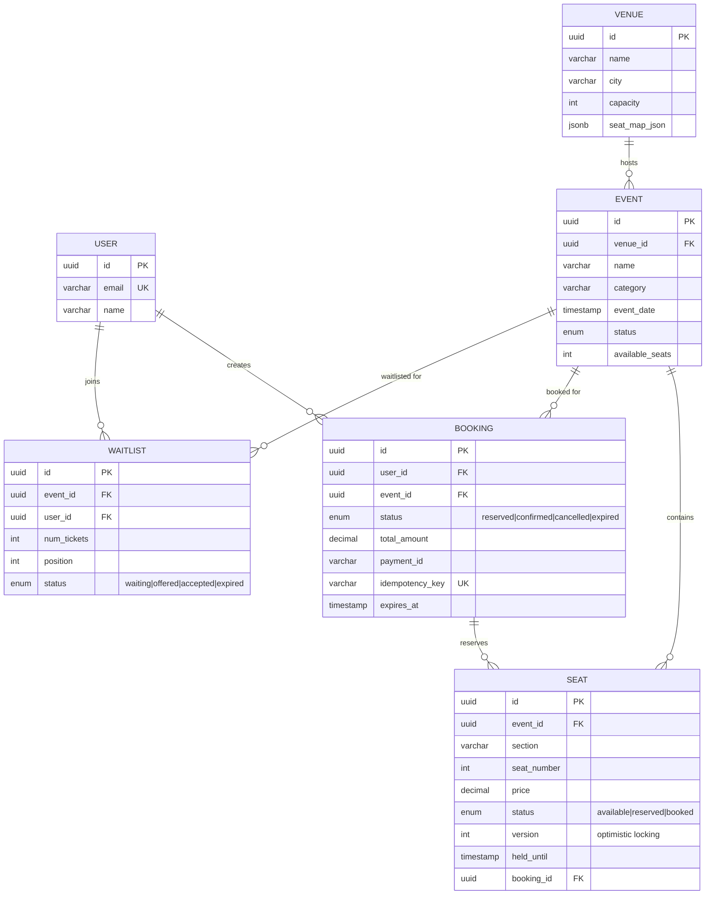
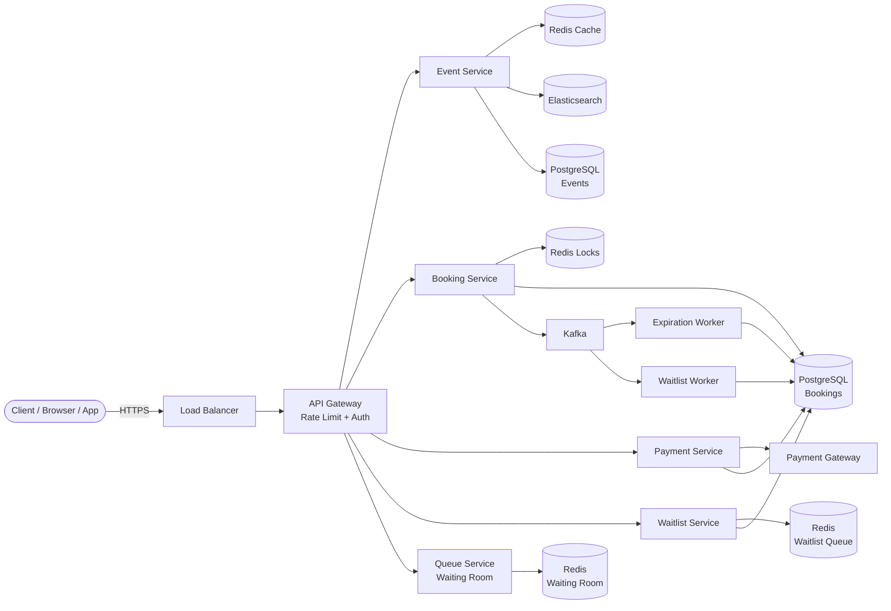
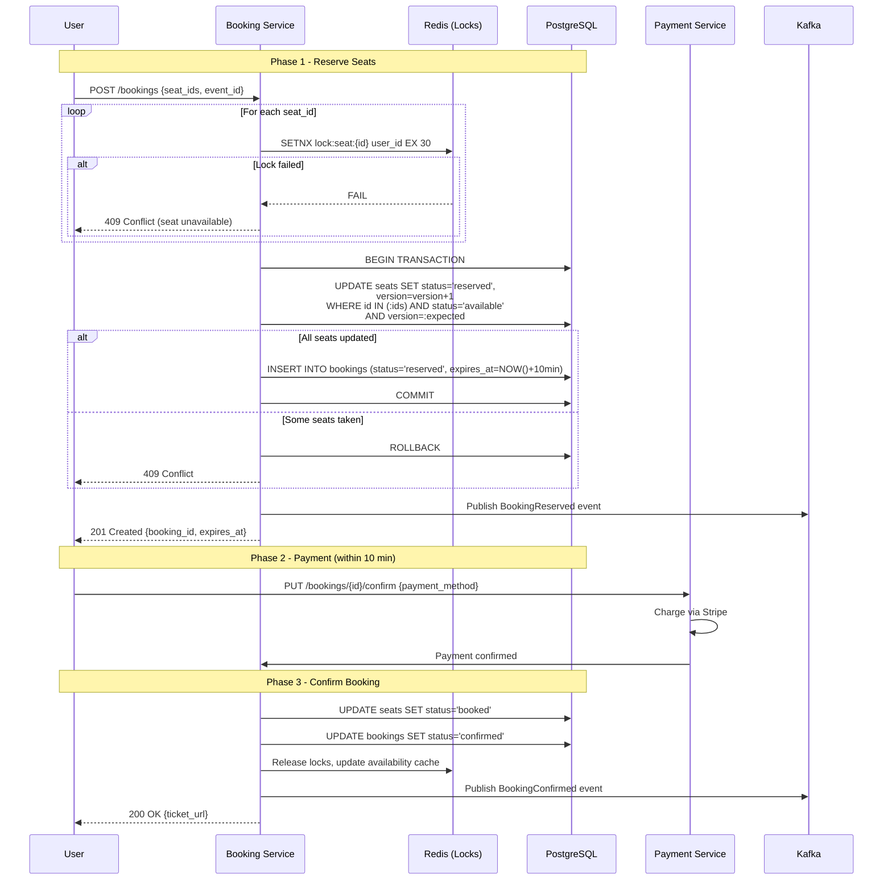
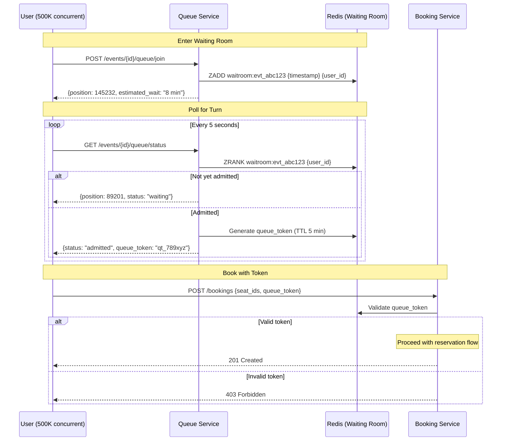

# Design Ticketmaster (Event Ticket Booking)

> An event ticket booking platform that allows users to browse events, view venue seat maps,
> select and reserve seats, complete payment, and receive confirmed tickets. The core
> engineering challenge is preventing double booking under extreme concurrency -- popular events
> (Taylor Swift, FIFA World Cup) can see millions of users competing for the same seats within
> seconds.

---

## 1. Problem Statement & Requirements

Design a system where users can discover events, view available seats on an interactive seat
map, reserve seats with a temporary hold, pay, and receive a confirmed booking. The system
must guarantee that no two users can book the same seat, even when hundreds of thousands of
users are trying simultaneously during a flash sale.

### 1.1 Functional Requirements

- **FR-1:** Browse and search events by name, category, location, date.
- **FR-2:** View venue seat map with real-time seat availability (available / reserved / booked).
- **FR-3:** Reserve one or more seats with a temporary hold (10-minute TTL before auto-release).
- **FR-4:** Complete payment to confirm the booking; release seats if payment fails or times out.
- **FR-5:** Prevent double booking -- no two users can book the same seat for the same event.
- **FR-6:** Waitlist for sold-out events -- auto-offer seats when cancellations or expirations occur.

### 1.2 Non-Functional Requirements

- **Availability:** 99.99% uptime -- ticket sales are time-sensitive and revenue-critical.
- **Consistency:** Strong consistency for seat reservations and bookings.
- **Latency:** End-to-end booking flow (select -> reserve -> pay -> confirm) < 5 seconds
  (excluding user think time). Seat map load < 500 ms.
- **Concurrency:** Handle 10M+ concurrent users during popular on-sales (flash sales). Peak of
  500K users hitting "Reserve" simultaneously for a single event.
- **Throughput:** Sustain 50M ticket transactions per month.

### 1.3 Out of Scope

- Event creation and venue management (admin portal).
- Payment gateway internals (Stripe, PayPal integration details).
- Ticket transfer, resale, and secondary market.
- Notification system (email/SMS confirmations).

### 1.4 Assumptions & Estimations (Back-of-Envelope Math)

#### Traffic Estimates

```
Monthly tickets sold           = 50 M
Daily tickets sold             = 50 M / 30              ~  1.67 M / day
Writes (bookings) / second     = 1.67 M / 86,400        ~  19 WPS (average)
Peak writes / second           = 19 * 1000              ~  19,000 WPS (flash sale, 1000x spike)

Read (browse/search) traffic:
  Read:Write ratio             = 500:1 (browsing >> booking)
  Reads / second (average)     = 19 * 500               ~  9,500 RPS
  Peak reads / second          = 9,500 * 50             ~  475 K RPS (during popular on-sale)

Seat map requests (flash sale) = 500 K RPS (single event, peak)
```

#### Storage Estimates

```
Events in system               = 500 K active events
Seats per event (avg)          = 20,000 (large venues)
Total seat records             = 500 K * 20 K           = 10 B seat records
Seat storage (100 B/record)    = 10 B * 100 B           = 1 TB

Bookings per year              = 50 M * 12              = 600 M
Booking storage (500 B/record) = 600 M * 500 B          = 300 GB / year
5-year total                   ~ 3 TB (seats + bookings + events + indexes)
```

#### Bandwidth Estimates

```
Full seat map payload (20K seats, compressed) ~ 200 KB
Peak full-map bandwidth        = 500 K * 200 KB         = 100 GB/s  (too high!)

With delta updates (~2 KB per status change):
  Peak bandwidth               = 500 K * 2 KB           = 1 GB/s   (manageable with CDN)
```

---

## 2. API Design

### 2.1 Browse Events

```
GET /api/v1/events?category=music&city=new-york&date=2026-03-15&cursor=abc&limit=20

Response: 200 OK
{
  "events": [
    {
      "id": "evt_abc123",
      "name": "Taylor Swift | The Eras Tour",
      "venue": { "id": "ven_xyz", "name": "SoFi Stadium", "city": "Los Angeles" },
      "date": "2026-07-15T19:30:00Z",
      "price_range": { "min": 49.99, "max": 899.99 },
      "availability": "limited"
    }
  ],
  "next_cursor": "def456"
}
```

### 2.2 Get Seat Map & Availability

```
GET /api/v1/events/{eventId}/seats?section=A

Response: 200 OK
{
  "event_id": "evt_abc123",
  "sections": [
    {
      "id": "sec_A",
      "rows": [
        {
          "row": "1",
          "seats": [
            { "id": "seat_A1_01", "number": 1, "status": "available", "price": 299.99 },
            { "id": "seat_A1_02", "number": 2, "status": "reserved",  "price": 299.99 },
            { "id": "seat_A1_03", "number": 3, "status": "booked",    "price": 299.99 }
          ]
        }
      ]
    }
  ],
  "version": 4287
}
```

### 2.3 Reserve Seats (Create Booking)

```
POST /api/v1/bookings
Headers: Idempotency-Key: <uuid>

Request:  { "event_id": "evt_abc123", "seat_ids": ["seat_A1_01", "seat_A1_04"], "queue_token": "qt_789" }

Response: 201 Created
{
  "booking_id": "bk_def456",
  "status": "reserved",
  "seats": [ { "id": "seat_A1_01", "price": 299.99 }, { "id": "seat_A1_04", "price": 299.99 } ],
  "total_amount": 599.98,
  "expires_at": "2026-03-15T10:40:05Z"
}

Errors: 409 Conflict (seat taken), 403 Forbidden (invalid queue token), 429 Rate Limited
```

### 2.4 Confirm Booking (After Payment)

```
PUT /api/v1/bookings/{bookingId}/confirm
Headers: Idempotency-Key: <uuid>

Request:  { "payment_id": "pay_ghi789" }

Response: 200 OK
{ "booking_id": "bk_def456", "status": "confirmed", "ticket_pdf_url": "https://cdn.../bk_def456.pdf" }

Errors: 410 Gone (reservation expired), 402 Payment Required (payment failed)
```

### 2.5 Join Waitlist

```
POST /api/v1/events/{eventId}/waitlist
Request:  { "num_tickets": 2, "preferred_sections": ["A", "B"], "max_price": 500.00 }
Response: 201 Created { "waitlist_id": "wl_jkl012", "position": 342, "status": "waiting" }
```

---

## 3. Data Model

### 3.1 Schema

| Table        | Column            | Type          | Notes                                         |
| ------------ | ----------------- | ------------- | --------------------------------------------- |
| `events`     | `id`              | UUID / PK     | `evt_` prefix                                 |
| `events`     | `name`            | VARCHAR(255)  | Indexed for search                            |
| `events`     | `venue_id`        | UUID / FK     | References `venues.id`                        |
| `events`     | `category`        | VARCHAR(50)   | music, sports, theater                        |
| `events`     | `event_date`      | TIMESTAMP     | Indexed                                       |
| `events`     | `on_sale_date`    | TIMESTAMP     | When tickets go on sale                       |
| `events`     | `status`          | ENUM          | draft / on_sale / sold_out / completed        |
| `events`     | `available_seats` | INT           | Counter, decremented on booking               |
| `venues`     | `id`              | UUID / PK     |                                               |
| `venues`     | `name`            | VARCHAR(255)  |                                               |
| `venues`     | `city`            | VARCHAR(100)  | Indexed                                       |
| `venues`     | `capacity`        | INT           |                                               |
| `venues`     | `seat_map_json`   | JSONB         | Static layout of sections/rows/seats          |
| `seats`      | `id`              | UUID / PK     | Composite index: (event_id, status)           |
| `seats`      | `event_id`        | UUID / FK     |                                               |
| `seats`      | `section`         | VARCHAR(10)   |                                               |
| `seats`      | `row`             | VARCHAR(5)    |                                               |
| `seats`      | `seat_number`     | INT           |                                               |
| `seats`      | `price`           | DECIMAL(10,2) |                                               |
| `seats`      | `status`          | ENUM          | available / reserved / booked                 |
| `seats`      | `version`         | INT           | For optimistic locking                        |
| `seats`      | `held_until`      | TIMESTAMP     | TTL expiry if reserved                        |
| `seats`      | `booking_id`      | UUID / FK     | NULL if available                             |
| `bookings`   | `id`              | UUID / PK     |                                               |
| `bookings`   | `user_id`         | UUID / FK     |                                               |
| `bookings`   | `event_id`        | UUID / FK     |                                               |
| `bookings`   | `status`          | ENUM          | reserved / confirmed / cancelled / expired    |
| `bookings`   | `total_amount`    | DECIMAL(10,2) |                                               |
| `bookings`   | `payment_id`      | VARCHAR(100)  |                                               |
| `bookings`   | `idempotency_key` | VARCHAR(64)   | Unique, prevents duplicate bookings           |
| `bookings`   | `expires_at`      | TIMESTAMP     | 10 min after reservation                      |
| `waitlist`   | `id`              | UUID / PK     |                                               |
| `waitlist`   | `event_id`        | UUID / FK     |                                               |
| `waitlist`   | `user_id`         | UUID / FK     |                                               |
| `waitlist`   | `num_tickets`     | INT           |                                               |
| `waitlist`   | `position`        | INT           | Auto-increment per event (FIFO)               |
| `waitlist`   | `status`          | ENUM          | waiting / offered / accepted / expired        |

### 3.2 ER Diagram



### 3.3 Database Choice Justification

| Requirement                    | Choice             | Reason                                                         |
| ------------------------------ | ------------------ | -------------------------------------------------------------- |
| Bookings & seat state          | **PostgreSQL**     | ACID transactions, row-level locking, strong consistency        |
| Seat availability cache        | **Redis**          | Sub-ms reads, TTL for reservation holds, atomic ops            |
| Distributed locks              | **Redis**          | SETNX with TTL for seat-level distributed locking              |
| Event search & browse          | **Elasticsearch**  | Full-text search, faceted filtering by category/date/location  |
| Async event processing         | **Kafka**          | Durable message queue for booking events, waitlist triggers    |

---

## 4. High-Level Architecture

### 4.1 Architecture Diagram



### 4.2 Component Walkthrough

| Component                  | Responsibility                                                                |
| -------------------------- | ----------------------------------------------------------------------------- |
| **API Gateway**            | Rate limiting, authentication, request routing to microservices.              |
| **Event Service**          | Browse/search events, serve seat map with availability.                       |
| **Booking Service**        | Core service: reserve seats, confirm bookings, handle cancellations.          |
| **Payment Service**        | Orchestrates payment with external gateway, handles retries and refunds.      |
| **Waitlist Service**       | Manages FIFO waitlist per event, auto-offers seats on cancellation.           |
| **Queue Service**          | Virtual waiting room for flash sales -- controls flow into booking service.   |
| **Redis (Locks)**          | Distributed locks for seat reservation (SETNX with TTL).                     |
| **PostgreSQL**             | Source of truth for events, seats, bookings. ACID transactions.               |
| **Kafka**                  | Async event bus: booking events, expiration signals, waitlist triggers.        |
| **Expiration Worker**      | Releases seats when reservation TTL expires.                                  |
| **Waitlist Worker**        | On seat release, offers seat to the next person on the waitlist.              |

---

## 5. Deep Dive: Core Flows

### 5.1 Seat Reservation Flow

The booking flow follows a three-phase approach: **Reserve -> Pay -> Confirm**.



**Reservation TTL (10 minutes):** Gives the user enough time for payment without permanently
locking seats. The expiration worker reclaims seats every 30 seconds.

### 5.2 Preventing Double Booking

#### Approach 1: Pessimistic Locking (SELECT FOR UPDATE)

```sql
BEGIN;
SELECT * FROM seats WHERE id = 'seat_A1_01' FOR UPDATE;  -- row locked
UPDATE seats SET status = 'reserved', booking_id = 'bk_def456' WHERE id = 'seat_A1_01';
COMMIT;
```

#### Approach 2: Optimistic Locking (Version Number)

```sql
UPDATE seats SET status = 'reserved', version = 6
WHERE id = 'seat_A1_01' AND version = 5 AND status = 'available';
-- rows_affected = 0 means someone else got it first -> return 409
```

#### Approach 3: Distributed Lock (Redis SETNX)

```
SETNX lock:seat:seat_A1_01 "user_123" EX 30   -- acquire lock with 30s TTL
-- If OK: proceed to DB update
-- If nil: return 409 immediately (no DB hit)
DEL lock:seat:seat_A1_01                        -- release after DB commit
```

#### Comparison Table

| Aspect                  | Pessimistic (SELECT FOR UPDATE) | Optimistic (Version)        | Distributed Lock (Redis)    |
| ----------------------- | ------------------------------- | --------------------------- | --------------------------- |
| **Contention handling** | Blocks until lock released      | Fails fast, retry needed    | Fails fast, no retry needed |
| **DB load**             | High (holds row locks)          | Medium (retry on conflict)  | Low (lock check in Redis)   |
| **Deadlock risk**       | Yes (multi-seat booking)        | None                        | Possible (mitigated by TTL) |
| **Latency**             | Higher (waits for lock)         | Lower (no waiting)          | Lowest (Redis is sub-ms)    |
| **Flash sale fit**      | Poor (DB bottleneck)            | Good                        | Best                        |
| **Throughput**          | ~500 TPS (DB limited)           | ~2,000 TPS                  | ~50,000 TPS                 |

**Recommended: Redis SETNX + Optimistic Locking (layered)**

1. **Layer 1 (Redis):** Fast rejection -- if lock is held, return 409 without touching the DB.
2. **Layer 2 (DB version check):** Safety net if Redis fails or has a race condition.

### 5.3 Handling High Concurrency (Flash Sales)

500K users cannot all hit the booking service. The DB would collapse. Solution: **Virtual Waiting Room**.



**How it works:**

1. Users are added to a Redis Sorted Set (score = timestamp, FIFO ordering).
2. Admission rate is controlled: e.g., 200 users/second for a 20K-seat venue.
3. Admitted users receive a time-limited token required for the booking API.
4. Result: DB receives 200 RPS instead of 500K RPS. The queue absorbs the burst.

**Why not just scale the booking service?** Scaling does not help when 500K users compete
for the same 20K seats. The database rows (seats) are the bottleneck, not compute.

### 5.4 Seat Map & Availability

```
Layer 1 - CDN (Static Layout):
  Venue seat map layout (sections, rows, coordinates) is static.
  Cached indefinitely on CDN. Only changes when venue is remodeled.

Layer 2 - Redis (Dynamic Availability):
  HSET seats:evt_abc123 seat_A1_01 "available"
  HSET seats:evt_abc123 seat_A1_02 "reserved"
  Full availability: 20K seats * 30 bytes = 600 KB per event.

Layer 3 - SSE (Real-Time Pushes):
  Server-Sent Events push seat status deltas to connected clients:
    { "seat_id": "seat_A1_01", "status": "reserved" }
  ~100 bytes per update vs 200 KB for full map refresh.

Cache invalidation:
  On booking/cancel/expire -> update PostgreSQL -> update Redis -> publish
  to Kafka -> SSE servers push delta to clients. End-to-end: ~100ms.
```

### 5.5 Waitlist System

```
Join Waitlist:
  1. INSERT into waitlist table with auto-increment position
  2. ZADD waitlist:evt_abc123 {position} {user_id}  (Redis Sorted Set)

Seat Becomes Available (Kafka event: SeatReleased):
  1. Waitlist Worker consumes the event
  2. ZPOPMIN waitlist:evt_abc123 -> pops the first user (FIFO)
  3. Create a temporary offer: "15 minutes to book seat X"
  4. Update waitlist status to 'offered'
  5. If user does not accept within 15 min -> offer next person
```

---

## 6. Scaling & Performance

### 6.1 Database Scaling

```
Read Path (Event Browsing):
  - 3-5 read replicas per shard for browsing queries
  - Elasticsearch handles all search queries (synced via Kafka CDC)
  - Redis caches event details (5-min TTL, 95%+ hit rate)

Write Path (Bookings):
  - Flash sale contention is per-event, so shard by event_id
  - Redis locks absorb 99% of contention (fail-fast rejection)
  - Waiting room throttles to ~200 WPS reaching the DB
  - Shard mapping: hash(event_id) % 8 shards
  - Each shard: 1 primary + 2 read replicas = 24 DB instances total
```

### 6.2 Redis Cluster

```
Separate clusters for different concerns:
  Cluster A: Seat availability cache + event cache (read-heavy)
  Cluster B: Distributed locks (write-heavy, low memory)
  Cluster C: Waiting room queues + waitlist sorted sets

Memory estimate:
  Seat availability:  600 MB (1000 events * 600 KB)
  Event cache:        500 MB
  Locks:              50 MB
  Waiting rooms:      200 MB
  Total:              ~1.4 GB
```

### 6.3 Scaling Summary

| Component          | Strategy                              | Instances   |
| ------------------ | ------------------------------------- | ----------- |
| API Gateway        | Horizontal, auto-scale on RPS         | 10-50       |
| Booking Service    | Horizontal, stateless                 | 10-30       |
| Queue Service      | Horizontal, stateless                 | 5-15        |
| PostgreSQL         | Sharded by event_id, read replicas    | 24 (8x3)    |
| Redis              | Cluster mode, separated by concern    | 12          |
| Elasticsearch      | 3-node cluster, sharded indices       | 6           |
| Kafka              | 3 brokers, partitioned topics         | 3-6         |

---

## 7. Reliability & Fault Tolerance

### 7.1 Idempotent Bookings

Every booking request includes an `Idempotency-Key`. The booking service checks for an
existing booking with this key before proceeding. If found, returns the existing booking
(no duplicate charge). Enforced via a UNIQUE index on `idempotency_key`.

### 7.2 Payment Retry & Failure Handling

```
1. Booking Service calls Payment Service with idempotency key
2. Payment Service calls Stripe
3. Success -> confirm booking
4. Transient error -> retry 3x with exponential backoff (1s, 2s, 4s)
   Same idempotency key ensures Stripe deduplicates
5. All retries fail -> mark "payment_failed", seats remain reserved until TTL
6. Permanent error (card declined) -> release seats immediately, return 402
```

### 7.3 Expired Reservation Cleanup

```
Expiration Worker (runs every 30 seconds):
  1. SELECT bookings WHERE status='reserved' AND expires_at < NOW() LIMIT 100
  2. For each: UPDATE status='expired', release seats, update Redis cache
  3. Publish SeatReleased to Kafka (triggers waitlist)
  4. Idempotent: AND status='reserved' in UPDATE prevents race conditions
```

### 7.4 SPOF Analysis

| Component        | SPOF? | Mitigation                                                           |
| ---------------- | ----- | -------------------------------------------------------------------- |
| Load Balancer    | No    | AWS ALB is managed, multi-AZ by default                              |
| Booking Service  | No    | Stateless, auto-scaling, min 3 instances across 2 AZs               |
| PostgreSQL       | Yes   | Synchronous standby in different AZ, auto-failover via Patroni       |
| Redis (Locks)    | Yes   | Redis Cluster with replicas; fallback to DB pessimistic locking      |
| Redis (Cache)    | No    | Cache miss hits DB -- degraded latency, not an outage               |
| Kafka            | No    | 3-broker cluster, replication factor 3, min.insync.replicas = 2      |

### 7.5 Graceful Degradation

```
Redis (locks) down:   Fall back to SELECT FOR UPDATE. Lower throughput, correctness preserved.
Elasticsearch down:   Degrade to basic SQL queries on read replicas. No full-text search.
Kafka down:           Expiration worker polls DB directly. Waitlist pauses. No data loss.
```

---

## 8. Trade-offs & Alternatives

### 8.1 Key Decisions

| Decision                     | Chosen                         | Alternative                     | Why Chosen                                              |
| ---------------------------- | ------------------------------ | ------------------------------- | ------------------------------------------------------- |
| Locking strategy             | Redis SETNX + Optimistic       | Pessimistic (SELECT FOR UPDATE) | Fail-fast at Redis layer, DB as safety net              |
| Flash sale handling          | Virtual waiting room           | Let everyone compete            | Without queue, DB collapses under 500K concurrent       |
| Seat status cache            | Redis hash per event           | In-memory cache on API servers  | Centralized, consistent across all instances            |
| Real-time updates            | SSE                            | WebSocket                       | Simpler (unidirectional), sufficient for status push    |
| Reservation TTL              | 10 minutes                     | 5 min / 15 min                  | Balance: enough for payment, minimal seat hoarding      |
| Database shard key           | event_id                       | user_id                         | Contention is per-event, not per-user                   |

### 8.2 Queue vs No Queue

| Aspect                    | With Waiting Room               | Without Queue                     |
| ------------------------- | ------------------------------- | --------------------------------- |
| **User experience**       | Fair, predictable wait          | Chaotic, error-prone              |
| **System load**           | Controlled (200 RPS to DB)      | Uncontrolled (500K RPS to DB)     |
| **Error rate**            | < 1%                            | > 90% (most get 409/503)          |
| **Fairness**              | Strict FIFO                     | Fastest network wins              |
| **DB survival**           | Guaranteed                      | Likely crashes                    |
| **Complexity**            | Higher (queue service needed)   | Lower                             |

---

## 9. Interview Tips

### 9.1 What Interviewers Look For

| Signal                       | How to Demonstrate It                                                     |
| ---------------------------- | ------------------------------------------------------------------------- |
| **Concurrency understanding** | Explain double booking prevention with specific locking strategies       |
| **Scale reasoning**          | "500K concurrent users cannot all hit the DB -- we need a waiting room"   |
| **Trade-off articulation**   | "We chose Redis locks over pessimistic locking because..."                |
| **Consistency awareness**    | "Seat bookings need strong consistency; event search can be eventual"     |
| **Back-of-envelope math**    | Show the 500K RPS vs DB capacity gap to justify the waiting room         |

### 9.2 Common Follow-Up Questions

**Q: "What if a user selects a seat but someone books it before they click Reserve?"**
- SSE pushes real-time updates (~100ms). Even if stale, the Redis lock / DB version check
  rejects the request with 409. Client refreshes the map.

**Q: "How do you prevent scalpers booking 100 tickets?"**
- Max tickets per user per event (e.g., 4-6). Rate limiting. Queue token tied to user ID.

**Q: "What if Redis goes down during a flash sale?"**
- Circuit breaker detects failure. Fall back to PostgreSQL pessimistic locking. Throughput
  drops from ~50K to ~500 TPS, but correctness is preserved.

**Q: "How do you handle partial seat bookings (want 4, only 3 available)?"**
- Atomic all-or-nothing. Lock ALL seats before committing. If any unavailable, reject entirely.

### 9.3 Common Pitfalls

| Pitfall                                          | Impact                                                      |
| ------------------------------------------------ | ----------------------------------------------------------- |
| Ignoring double booking prevention               | This is THE core problem -- must address in depth            |
| Not mentioning virtual waiting room              | System cannot survive flash sales without demand shaping     |
| Using only DB locks for high concurrency         | DB cannot handle 500K concurrent lock requests               |
| Forgetting reservation TTL and expiration        | Seats permanently locked by users who abandon checkout       |
| Not making bookings idempotent                   | Duplicate charges on network retries                         |

### 9.4 Interview Timeline (45 Minutes)

```
 0:00 -  3:00  [3 min]  Clarify: Scale? Flash sales? Seat selection vs general admission?
 3:00 -  8:00  [5 min]  Estimations: QPS, concurrent users, storage.
 8:00 - 12:00  [4 min]  API design: Reserve, confirm, browse, seat map.
12:00 - 16:00  [4 min]  Data model: Events, seats, bookings, waitlist. ER diagram.
16:00 - 21:00  [5 min]  High-level architecture diagram and component walkthrough.
21:00 - 33:00  [12 min] Deep dive: Reservation flow, double booking prevention, waiting room.
33:00 - 39:00  [6 min]  Scaling & reliability: Sharding, caching, SPOF, failover.
39:00 - 43:00  [4 min]  Trade-offs: Locking strategies, queue vs no queue.
43:00 - 45:00  [2 min]  Wrap up: Waitlist, extensions.
```

---

## Quick Reference Card

```
System:            Ticketmaster (Event Ticket Booking)
Core challenge:    Preventing double booking under extreme concurrency
Peak concurrency:  500K users competing for ~20K seats
Monthly tickets:   50 M
QPS (average):     ~19 WPS bookings, ~9.5 K RPS reads
QPS (flash sale):  ~19 K WPS attempts, throttled to ~200 WPS via waiting room
Storage (5y):      ~3 TB
DB:                PostgreSQL (sharded by event_id)
Cache:             Redis Cluster (~1.4 GB)
Locking:           Redis SETNX (fast rejection) + DB optimistic locking (safety net)
Flash sale:        Virtual waiting room (Redis Sorted Set, token-based admission)
Reservation TTL:   10 minutes (auto-release on expiry)
Key trade-off:     Queue adds complexity but is essential for flash sale survival
```
