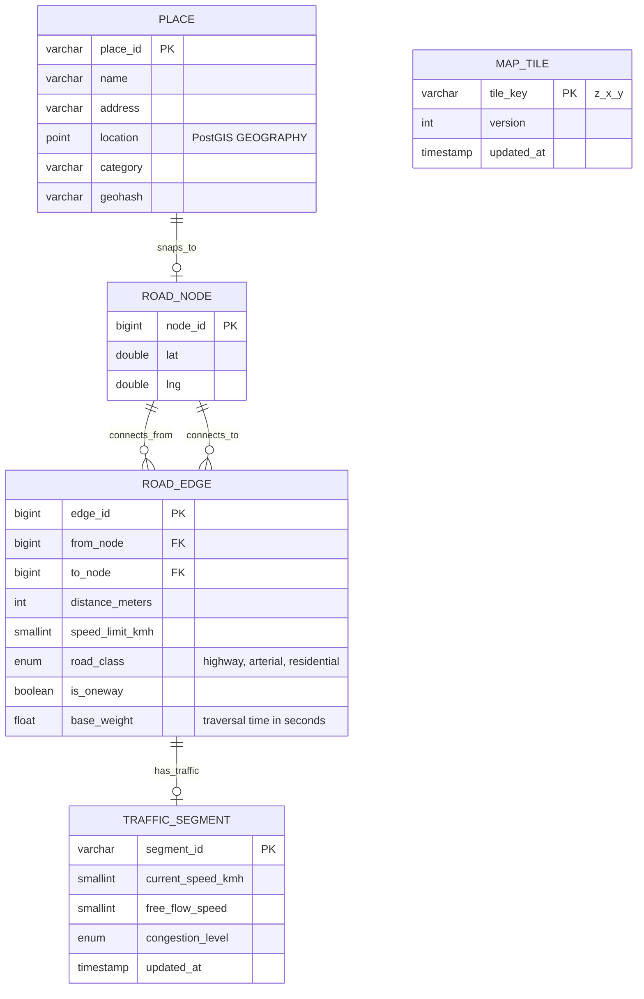
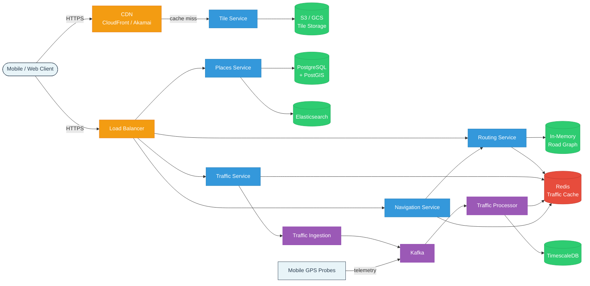
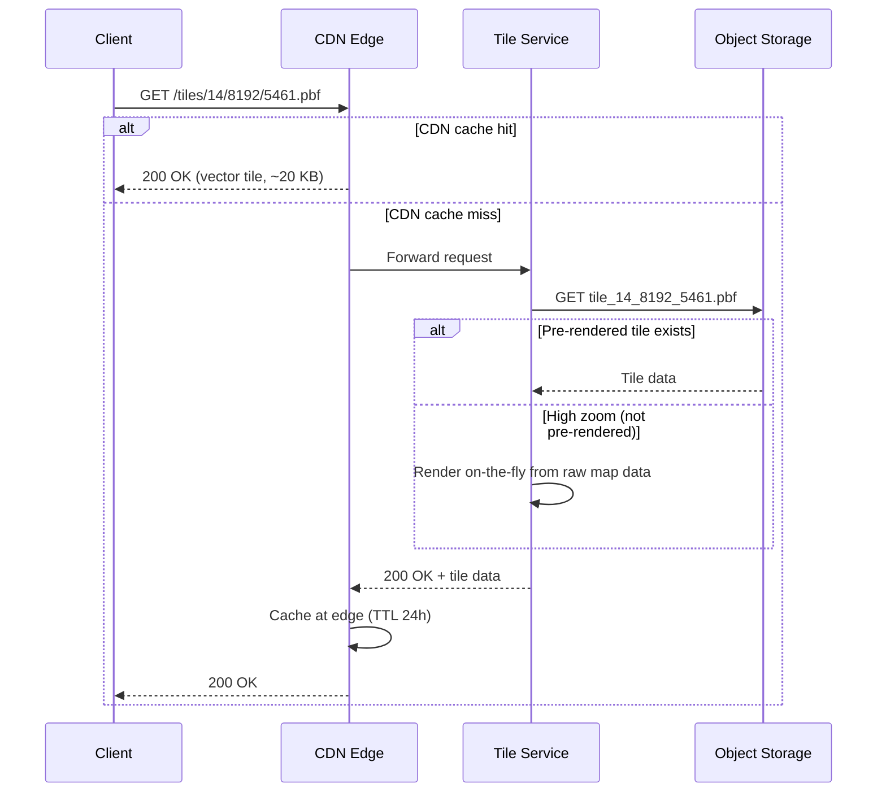
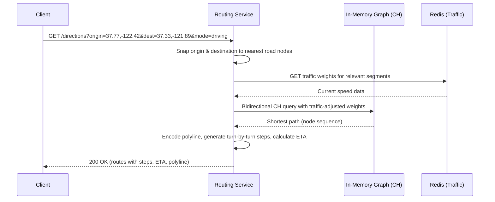
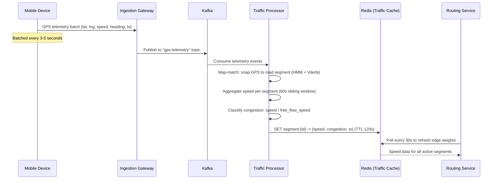
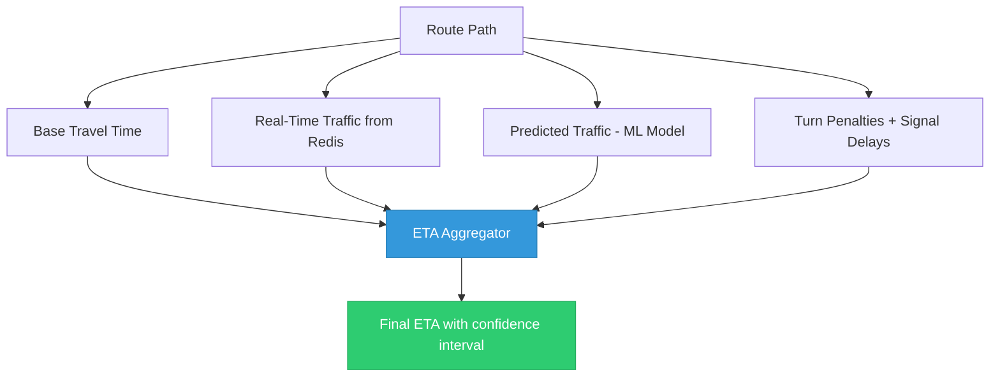
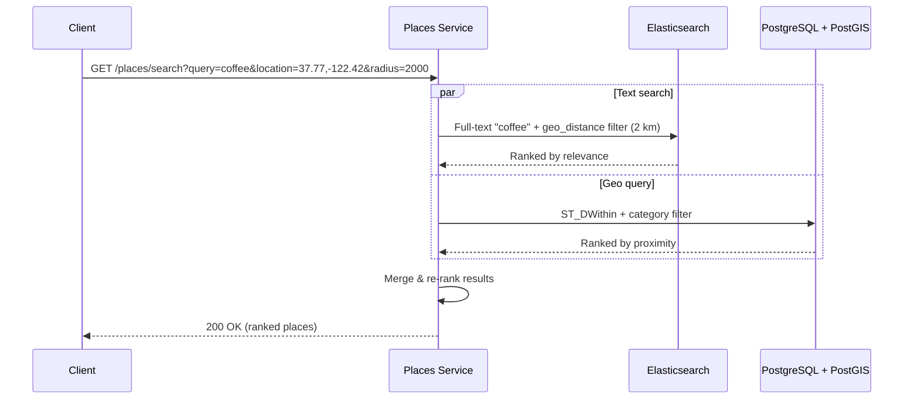

# Design Google Maps

> Google Maps is a mapping platform that provides tile rendering, place search, turn-by-turn
> navigation, and real-time traffic. It combines geospatial data, graph algorithms, real-time
> streaming, and massive CDN infrastructure -- topics interviewers love to probe.

---

## 1. Problem Statement & Requirements

Design a mapping and navigation platform that renders interactive maps, searches for places,
computes driving/walking/transit directions, and overlays real-time traffic conditions.

### 1.1 Functional Requirements

- **FR-1:** Render interactive map tiles at multiple zoom levels (0-22) with pan and zoom.
- **FR-2:** Search for places by name, address, or category and return geolocated results.
- **FR-3:** Compute directions between origin and destination for driving, walking, and transit.
- **FR-4:** Display real-time traffic conditions (congestion, incidents) on the map.
- **FR-5:** Calculate ETA for a given route, updated in real-time during navigation.
- **FR-6:** Provide turn-by-turn navigation instructions with voice guidance.

### 1.2 Non-Functional Requirements

| Requirement        | Target                                                              |
| ------------------ | ------------------------------------------------------------------- |
| **Availability**   | 99.99% uptime -- navigation must work reliably during active trips  |
| **Latency**        | Map tile load < 200 ms (CDN edge), route computation < 500 ms      |
| **Throughput**     | Support 1B+ monthly active users, 100M daily navigation sessions   |
| **Accuracy**       | ETA within 10% of actual travel time for 90th percentile of trips   |
| **Offline support**| Users can download regions for offline map viewing and navigation   |
| **Freshness**      | Traffic data updated every 30-60 seconds on active road segments    |

### 1.3 Out of Scope

- Street View panoramic imagery.
- Business listings, reviews, and ratings.
- Satellite and aerial imagery layers.
- Indoor maps and floor plans.

### 1.4 Assumptions & Estimations (Back-of-Envelope Math)

#### Traffic Estimates

```
Monthly active users (MAU)         = 1 B
Daily active users (DAU)           = 250 M  (25% of MAU)
Daily map tile requests            = 250 M * 40 tiles/session = 10 B tile requests/day
Tile requests / second             = 10 B / 86,400 ~ 115 K RPS
Peak tile RPS                      = 115 K * 3 ~ 350 K RPS

Daily navigation requests          = 100 M
Route computations / second        = 100 M / 86,400 ~ 1,160 RPS
Peak route RPS                     = 1,160 * 5 ~ 5,800 RPS (rush hour)

Daily place search requests        = 200 M
Search queries / second            = 200 M / 86,400 ~ 2,315 RPS
```

#### Storage Estimates

```
Map Tile Storage:
  Tiles with land coverage (all zooms) ~ 5 T tiles
  Average vector tile size             = 20 KB
  Pre-rendered storage (zoom 0-18)     ~ 7 PB (higher zooms rendered on demand)

Road Graph:
  Road segments worldwide              ~ 1 B segments
  Average segment size                 = 200 bytes (node pair, distance, speed, metadata)
  Road graph storage                   = 1 B * 200 B = 200 GB (fits in memory!)

Places Database:
  Total places worldwide               ~ 200 M * 1 KB = 200 GB

Traffic Data (real-time):
  Active road segments                 ~ 100 M * 100 B = 10 GB (fits in Redis)
```

---

## 2. API Design

### 2.1 Get Map Tile

```
GET /api/v1/tiles/{z}/{x}/{y}.pbf
  z, x, y  - Zoom level and tile coordinates (Web Mercator)

Response: 200 OK
  Content-Type: application/x-protobuf
  Cache-Control: public, max-age=86400
  ETag: "v3-z14-x8192-y5461"
  Body: <binary vector tile data>

  304 Not Modified   -- tile unchanged (ETag match)
  404 Not Found      -- tile does not exist (ocean)
```

### 2.2 Get Directions

```
GET /api/v1/directions?origin={lat,lng}&destination={lat,lng}&mode={mode}&departure_time={ts}

Query Parameters:
  origin, destination  - "lat,lng" coordinates
  waypoints            - Optional intermediate stops
  mode                 - "driving" | "walking" | "transit"
  departure_time       - Unix timestamp (for traffic-aware routing)
  alternatives         - "true" for up to 3 alternative routes

Response: 200 OK
{
  "routes": [{
    "summary": "I-280 S",
    "distance_meters": 48200,
    "duration_seconds": 2340,
    "duration_in_traffic_seconds": 2880,
    "polyline": "encoded_polyline_string",
    "steps": [{
      "instruction": "Head south on Market St",
      "distance_meters": 500,
      "duration_seconds": 60,
      "maneuver": "turn-right"
    }]
  }]
}
```

### 2.3 Search Places

```
GET /api/v1/places/search?query={query}&location={lat,lng}&radius={meters}

Query Parameters:
  query, location, radius, type, cursor, limit (default 20)

Response: 200 OK
{
  "results": [{
    "place_id": "ChIJN1t_tDeuEmsRUsoyG83frY4",
    "name": "Blue Bottle Coffee",
    "address": "66 Mint St, San Francisco, CA 94103",
    "location": { "lat": 37.7821, "lng": -122.4065 },
    "category": "coffee_shop",
    "distance_meters": 320
  }],
  "next_cursor": "eyJvZmZzZXQiOjIwfQ=="
}
```

### 2.4 Get Traffic Data

```
GET /api/v1/traffic?bounds={sw_lat,sw_lng,ne_lat,ne_lng}&zoom={z}

Response: 200 OK
{
  "segments": [{
    "segment_id": "seg_8a3f2b",
    "polyline": "encoded_polyline",
    "speed_kmh": 35,
    "free_flow_speed_kmh": 65,
    "congestion_level": "heavy",
    "updated_at": "2026-02-28T14:30:00Z"
  }]
}
```

---

## 3. Data Model

### 3.1 ER Diagram



### 3.2 Database Choice Justification

| Requirement                | Choice                   | Reason                                                       |
| -------------------------- | ------------------------ | ------------------------------------------------------------ |
| Map tile storage           | **S3 / GCS + CDN**       | Massive blob storage, cheap, CDN-friendly, immutable tiles   |
| Road graph (routing)       | **In-memory graph**      | 200 GB fits in RAM; sub-ms edge traversals for fast routing  |
| Places with geo queries    | **PostgreSQL + PostGIS** | Spatial indexes (R-tree/GiST), proximity queries, full-text  |
| Place full-text search     | **Elasticsearch**        | Inverted index, fuzzy matching, relevance scoring            |
| Real-time traffic          | **Redis**                | 10 GB fits in memory; sub-ms reads; TTL for stale data      |
| Historical traffic         | **TimescaleDB**          | Time-series data for ETA model training and trend analysis   |

---

## 4. High-Level Architecture

### 4.1 Architecture Diagram



### 4.2 Component Walkthrough

| Component               | Responsibility                                                                 |
| ------------------------ | ------------------------------------------------------------------------------ |
| **CDN**                  | Serves pre-rendered map tiles from edge locations. Absorbs 95%+ of tile traffic. |
| **Tile Service**         | Handles CDN cache misses. Reads tiles from S3 or renders on demand.              |
| **Routing Service**      | Computes shortest/fastest path using the in-memory road graph + CH.              |
| **Places Service**       | Place search via PostGIS geospatial queries + Elasticsearch text search.         |
| **Traffic Service**      | Serves real-time traffic data for map overlay and routing weight adjustments.     |
| **Navigation Service**   | Manages active sessions: re-routing, ETA updates, turn-by-turn instructions.     |
| **Kafka + Processor**    | Ingests GPS telemetry, aggregates speed per road segment, updates Redis.         |
| **TimescaleDB**          | Stores historical traffic patterns for ETA prediction models.                    |

---

## 5. Deep Dive: Core Flows

### 5.1 Map Tile Rendering

#### Tile Coordinate System

The world is projected onto a flat square (Web Mercator) and divided into tiles. At zoom
level `z`, the world is `2^z x 2^z` tiles, each 256x256 pixels.

```
Zoom 0:  1 tile      (entire world)
Zoom 1:  4 tiles     (2x2)
Zoom 14: 268 M tiles (city-level detail)
Zoom 18: 68 B tiles  (street-level)
Zoom 22: 17.6 T tiles (building-level, on-demand only)
```

#### Vector vs Raster Tiles

| Aspect              | Vector Tiles (PBF)              | Raster Tiles (PNG)             |
| ------------------- | ------------------------------- | ------------------------------ |
| **Size**            | ~20 KB per tile                 | ~30-50 KB per tile             |
| **Zoom behavior**   | Smooth zoom (re-render locally) | Discrete zoom (blurry between) |
| **Styling**         | Dynamic (dark mode, custom)     | Fixed at render time           |
| **Client load**     | Higher (must render with GPU)   | Lower (just display)           |
| **Offline size**    | Smaller download                | Larger download                |
| **Localization**    | Client renders labels in user lang | Must pre-render per language|

**Decision: Vector tiles.** Smaller payloads, smooth zooming, dynamic styling, better offline.

#### Tile Serving Flow



**Pre-rendering strategy:** Zoom 0-18 pre-rendered (~7 PB). Zoom 19-22 on-demand + cached.

### 5.2 Graph-Based Routing

#### Road Network as a Weighted Graph

- **Nodes** = intersections and waypoints (~500M nodes globally)
- **Edges** = road segments between nodes (~1B edges)
- **Edge weight** = traversal time = `distance / speed`, adjusted by traffic

```
Example: Node A -> Node B
  distance=400m, speed_limit=50 km/h, base_weight=28.8s
  With congestion (current_speed=25 km/h): adjusted_weight = 57.6s
```

#### Routing Algorithms Comparison

| Algorithm               | Pre-processing | Query Time     | Live Traffic?  | Best For         |
| ----------------------- | -------------- | -------------- | -------------- | ---------------- |
| **Dijkstra**            | None           | 2-10 s         | Easy           | Small graphs     |
| **A***                  | None           | 100 ms - 2 s   | Easy           | Medium graphs    |
| **Contraction Hierarchies** | Hours (offline) | < 1 ms     | Needs CCH      | Production       |
| **CH + Customizable (CCH)** | Hours + minutes | < 5 ms    | Yes            | Production + traffic |

**Dijkstra** explores all nodes by increasing distance -- too slow for 1B-edge graphs.

**A*** adds a heuristic `f(n) = g(n) + h(n)` (straight-line distance to destination),
pruning the search space. 2-10x faster than Dijkstra, still too slow at global scale.

**Contraction Hierarchies (CH)** -- the production choice:
1. **Pre-processing (offline):** Iteratively remove unimportant nodes, add shortcut edges
   to preserve shortest paths. Takes hours but done once.
2. **Query (online):** Bidirectional search on the contracted graph. Most low-importance
   nodes are gone, so the search space is tiny. Result: **< 1 ms** queries.
3. **Traffic support via CCH:** Separate graph topology (contracted once) from edge weights
   (updated in seconds when traffic changes).

#### Routing Flow



### 5.3 Real-Time Traffic

#### Data Sources

| Source                    | Data                             | Volume             |
| ------------------------- | -------------------------------- | ------------------- |
| **Mobile GPS probes**     | Speed, location, heading         | 10M+ active probes  |
| **Connected vehicles**    | Speed, brake events              | Millions of vehicles |
| **Road sensors / loops**  | Volume count, speed              | Fixed locations      |
| **Government feeds**      | Road closures, construction      | Published schedules  |

#### Traffic Ingestion Pipeline



#### Congestion Classification

```
congestion = current_speed / free_flow_speed
  >= 0.85  ->  "free_flow"   (green)
  >= 0.65  ->  "light"       (yellow)
  >= 0.40  ->  "moderate"    (orange)
  >= 0.15  ->  "heavy"       (red)
  <  0.15  ->  "blocked"     (dark red)
```

### 5.4 ETA Calculation

ETA is not simply `distance / speed`. Traffic changes during the trip.

#### ETA Components



**ML-based prediction:** For a 4-hour trip leaving at 8 AM, the model predicts traffic at
8:30 AM for segments reached at 8:30, at 9 AM for segments reached at 9 AM, etc. This
accounts for rush hour starting/ending during the trip.

- **Features:** time of day, day of week, current traffic, weather, events, historical data.
- **Model:** Graph Neural Network (GNN) that captures spatial relationships between segments.
- **Result:** Google's DeepMind GNN reduced ETA errors by 40-50% over heuristics.

### 5.5 Place Search

#### Geospatial Indexing Approaches

**Geohash:** Encodes (lat, lng) into a string; shared prefixes = spatial proximity.

```
Geohash length    Approximate area
5 chars           ~5 km x 5 km
6 chars           ~1.2 km x 600 m
7 chars           ~150 m x 150 m
```

**PostGIS R-tree (GiST Index):** Partitions 2D space into nested bounding rectangles.
Supports complex spatial queries (within radius, nearest-N).

```sql
SELECT place_id, name, ST_Distance(location, ST_MakePoint(-122.42, 37.77)::geography) AS dist
FROM places
WHERE ST_DWithin(location, ST_MakePoint(-122.42, 37.77)::geography, 2000)
  AND category = 'coffee_shop'
ORDER BY dist LIMIT 20;
```

**Chosen: PostGIS R-tree + Elasticsearch.** PostGIS for geo queries, ES for fuzzy text
search and autocomplete. Merge results ranked by `0.6 * relevance + 0.4 * proximity`.



---

## 6. Scaling & Performance

### 6.1 CDN Tile Distribution

```
Tile RPS:           115 K average, 350 K peak
CDN cache hit rate:  95%+ (tiles are immutable per version)
Origin RPS:         ~5,750 (5% cache miss)
CDN edge locations:  200+ globally
Tile TTL at edge:    24 hours
Cache invalidation:  Versioned URLs (/v3/tiles/...) -- deploy new version
```

### 6.2 Routing Graph Sharding by Region

The global road graph (~200 GB) fits in memory, but for latency and redundancy we shard:

```
Region shards:
  North America:  ~40 GB    Europe:       ~50 GB
  Asia-Pacific:   ~60 GB    South America: ~20 GB
  Africa + ME:    ~15 GB    Oceania:       ~5 GB

Each shard: 3 replicas (active-active), deployed in nearest datacenter.
Cross-region routes: stitch at boundary nodes between shards.
```

### 6.3 Pre-computation

| Pre-computed Data             | Update Frequency | Benefit                              |
| ----------------------------- | ---------------- | ------------------------------------ |
| Contraction Hierarchies       | Weekly           | < 1 ms route queries vs seconds      |
| Popular route caches          | Hourly           | Skip computation for top routes       |
| Historical traffic profiles   | Daily            | Faster ETA with time-of-day patterns |
| Tile rendering (zoom 0-18)    | Monthly          | No render at request time             |

### 6.4 Performance Summary

| Metric                    | Value         | How                                            |
| ------------------------- | ------------- | ---------------------------------------------- |
| Tile load latency (p50)   | ~30 ms        | CDN edge hit, gzip-compressed vector tile      |
| Tile load latency (p99)   | ~150 ms       | CDN miss, origin fetch from S3                 |
| Route computation (p50)   | ~50 ms        | CH query + traffic lookup                      |
| Route computation (p99)   | ~300 ms       | Long-distance route + traffic weight lookup    |
| Place search (p50)        | ~40 ms        | ES query + PostGIS spatial filter              |
| Traffic data freshness    | 30-60 s       | Kafka pipeline end-to-end                      |

---

## 7. Reliability & Fault Tolerance

### 7.1 Offline Maps

Users download map regions for offline use (critical for travel, rural areas, tunnels).

```
Offline package contents:
  - Vector tiles for region (zoom 0-16)
  - Compressed road graph partition (for offline CH routing)
  - Place data (names, addresses, locations)
  - No traffic data (requires connectivity)

Package sizes:
  City (San Francisco):  ~150 MB
  State (California):    ~500 MB
  Country (Japan):       ~1.5 GB
```

Offline routing uses CH on the local graph with free-flow speeds (no traffic). Less
accurate ETA but fully functional navigation.

### 7.2 SPOFs and Mitigations

| Component           | SPOF? | Mitigation                                                          |
| ------------------- | ----- | ------------------------------------------------------------------- |
| CDN                 | No    | Multi-provider CDN, DNS failover                                    |
| Tile / Places / etc.| No    | Stateless, auto-scaling across AZs                                  |
| Road Graph (RAM)    | Yes   | 3 replicas per region, graph loaded from snapshot on boot            |
| PostgreSQL (Places) | Yes   | Synchronous standby + auto-failover via Patroni                     |
| Redis (Traffic)     | Yes   | Redis Cluster, 3 masters + 3 replicas                              |
| Kafka               | No    | 3-broker cluster, replication factor 3                              |

### 7.3 Graceful Degradation

```
Traffic pipeline down:
  -> Routing falls back to historical traffic patterns for time-of-day
  -> ETA accuracy degrades from ~10% error to ~20% error

Elasticsearch down:
  -> Fall back to PostGIS LIKE queries; exact/prefix matches work, fuzzy degrades

One routing shard down:
  -> Active-active replicas serve traffic; cross-region fallback adds ~200ms latency
```

---

## 8. Trade-offs & Alternatives

### 8.1 Key Design Decisions

| Decision                      | Chosen                        | Alternative                   | Why Chosen                                                  |
| ----------------------------- | ----------------------------- | ----------------------------- | ----------------------------------------------------------- |
| Tile format                   | Vector tiles (PBF)            | Raster tiles (PNG)            | Smaller, smooth zoom, dynamic styling, better offline       |
| Routing algorithm             | Contraction Hierarchies       | A* algorithm                  | < 1 ms vs 100ms-2s for long routes                          |
| Traffic integration           | CCH (overlay weights)         | Recompute CH per update       | CCH updates in seconds; full CH rebuild takes hours         |
| Geospatial index              | PostGIS R-tree                | Geohash in Redis              | R-tree handles complex queries; geohash = prefix only       |
| Place search                  | ES + PostGIS                  | PostGIS full-text only        | ES gives better relevance, autocomplete, fuzzy matching     |
| Traffic ingestion             | Kafka streaming               | Batch processing              | Real-time 30-60s freshness required                         |
| Graph storage                 | In-memory (RAM)               | Disk-based (RocksDB)          | Sub-ms lookups needed; 200 GB fits in RAM                   |
| ETA calculation               | ML model + heuristics         | Pure heuristic                | ML reduces ETA error by 40-50%                              |

### 8.2 Routing Algorithm Detail

| Factor                          | Dijkstra        | A*              | Contraction Hierarchies |
| ------------------------------- | --------------- | --------------- | ----------------------- |
| **Pre-processing**              | None            | None            | Hours (one-time)        |
| **Query time (100 km route)**   | 2-5 seconds     | 200-500 ms      | < 1 ms                  |
| **Query time (cross-continent)**| 10-30 seconds   | 1-5 seconds     | 1-5 ms                  |
| **Memory overhead**             | O(V)            | O(V)            | 2-3x original graph     |
| **Live traffic**                | Easy            | Easy            | Needs CCH extension     |
| **Implementation complexity**   | Simple          | Moderate        | Complex                 |

### 8.3 Vector vs Raster Tiles

| Factor                  | Vector Tiles                       | Raster Tiles                       |
| ----------------------- | ---------------------------------- | ---------------------------------- |
| **Bandwidth per tile**  | ~20 KB                             | ~30-50 KB                          |
| **Total storage**       | ~50 PB                             | ~100+ PB                           |
| **Smooth zoom**         | Yes (client re-renders)            | No (blurry between levels)         |
| **Dark mode**           | Re-style client-side               | Must pre-render separate set       |
| **Client requirements** | WebGL / GPU                        | Any device with image display      |
| **Localization**        | Client renders labels in user lang | Must pre-render per language        |

---

## 9. Interview Tips

### 9.1 What Interviewers Look For

| Signal                   | How to Demonstrate                                                             |
| ------------------------ | ------------------------------------------------------------------------------ |
| **Scope management**     | Immediately clarify: "Are we designing tiles, routing, traffic, or all three?" |
| **Estimation skills**    | Compute tile storage, routing QPS, graph memory size (200 GB fits in RAM)     |
| **Algorithm knowledge**  | Explain why Dijkstra is too slow and how CH pre-processing solves it           |
| **CDN strategy**         | Show that 95%+ of tile requests never reach origin                            |
| **Real-time systems**    | Describe the Kafka traffic pipeline and its freshness guarantees              |
| **Trade-off reasoning**  | "Vector tiles over raster because of dynamic styling and smaller size"        |

### 9.2 Common Follow-Up Questions

**Q: "How does turn-by-turn navigation work?"**
- Client sends GPS location periodically. Server checks if user is on-route; if deviated,
  re-computes route. ETA updated every 30s. Turn instructions triggered by proximity.

**Q: "How do you handle cross-region routes?"**
- Each shard has boundary nodes. Routing service queries both shards and stitches at boundaries.

**Q: "What happens during a major highway closure?"**
- Traffic processors detect near-zero speed, mark segments as "blocked" (weight = infinity).
  New queries avoid it. Active navigation sessions get re-routed within 30 seconds.

**Q: "How does ETA work for a 4-hour trip?"**
- Route divided into time segments. ML model predicts traffic at the time user reaches each
  segment. Accounts for rush hour starting/ending during the trip.

### 9.3 Common Pitfalls

| Pitfall                                          | Why It Hurts                                     |
| ------------------------------------------------ | ------------------------------------------------ |
| Ignoring tiles, jumping to routing               | Tiles are the highest-volume component            |
| Using Dijkstra without faster alternatives        | Shows lack of algorithm depth                     |
| Not mentioning CDN for tiles                     | Cannot handle 115K+ tile RPS without CDN          |
| Treating ETA as distance / speed                 | Interviewers expect traffic + ML discussion       |
| Not sizing the road graph (200 GB = fits in RAM) | This is a key insight; show you computed it        |

### 9.4 Interview Timeline (45-Minute Format)

```
 0:00 -  3:00  [3 min]  Clarify requirements: tiles? routing? traffic? offline?
 3:00 -  8:00  [5 min]  Back-of-envelope: tile storage, routing QPS, graph size.
 8:00 - 12:00  [4 min]  API design: /tiles, /directions, /places/search, /traffic.
12:00 - 16:00  [4 min]  Data model + database choices.
16:00 - 21:00  [5 min]  High-level architecture diagram. Walk through components.
21:00 - 27:00  [6 min]  Deep dive: tile rendering + CDN strategy.
27:00 - 33:00  [6 min]  Deep dive: routing (Dijkstra -> A* -> CH).
33:00 - 37:00  [4 min]  Deep dive: real-time traffic pipeline.
37:00 - 41:00  [4 min]  Scaling + reliability + offline support.
41:00 - 45:00  [4 min]  Trade-offs and wrap-up.
```

---

## Quick Reference Card

```
System:           Google Maps (Mapping + Navigation)
Tile RPS:         ~115 K (95% served from CDN)
Route RPS:        ~1,160 (peak ~5,800)
Tile storage:     ~7 PB (pre-rendered zoom 0-18, vector)
Road graph:       ~200 GB (fits in memory)
Places:           ~200 GB (PostgreSQL + PostGIS)
Traffic data:     ~10 GB (Redis, real-time)
Tile format:      Vector tiles (PBF) via CDN
Routing:          Contraction Hierarchies (< 1 ms queries)
Traffic pipeline: GPS probes -> Kafka -> Processor -> Redis
ETA:              ML model + real-time + historical traffic
Key trade-off:    CH gives < 1 ms routing but needs hours of offline pre-processing
                  and CCH extension for live traffic weight updates
```
