# Design Zoom (Video Conferencing)

> A video conferencing system enables real-time audio/video communication between
> participants over the internet. This design focuses on the media transport layer
> (WebRTC, SFU architecture), signaling, and scaling to millions of concurrent meetings
> -- a unique system design problem dealing with real-time streaming rather than
> traditional request/response patterns.

---

## 1. Problem Statement & Requirements

Design a scalable video conferencing platform that supports 1-on-1 calls, group video
meetings with up to 1000 participants, screen sharing, in-meeting chat, recording, and
virtual backgrounds -- all with ultra-low latency and adaptive quality.

### 1.1 Functional Requirements

- **FR-1:** Users can create and join video meetings via a unique meeting link/ID.
- **FR-2:** Support 1-on-1 video calls and group calls with up to 1000 participants.
- **FR-3:** Screen sharing -- any participant can share their screen or application window.
- **FR-4:** In-meeting chat -- text messaging during an active call.
- **FR-5:** Meeting recording -- host can record; stored and downloadable after the meeting.
- **FR-6:** Virtual backgrounds -- real-time background replacement using client-side ML.

### 1.2 Non-Functional Requirements

- **Latency:** End-to-end audio/video < 150ms (glass-to-glass). Jitter buffer adds 20-60ms.
- **Availability:** 99.99% uptime. Active meetings must not drop during server maintenance.
- **Scalability:** Support millions of concurrent meetings (2 to 1000 participants each).
- **Adaptive Quality:** Dynamically adjust resolution/bitrate per participant's bandwidth.
- **Security:** DTLS-SRTP encryption for all media. E2E encryption for 1-on-1 calls.

### 1.3 Out of Scope

- Breakout rooms, collaborative whiteboard, calendar integration and scheduling.
- Phone dial-in (PSTN gateway), waiting room management, live streaming to YouTube/Twitch.

### 1.4 Assumptions & Estimations (Back-of-Envelope Math)

```
--- Users & Meetings ---
Daily meeting participants      = 300 M
Avg meeting duration            = 45 min
Avg participants per meeting    = 10
Total meetings per day          = 300 M / 10 = 30 M meetings / day
Avg concurrent meetings         = 30 M * (45 / 1440) = ~940 K
Peak concurrent meetings (3x)   = ~2.8 M concurrent meetings
Peak concurrent participants    = 2.8 M * 10 = 28 M participants

--- Bandwidth per Participant (SFU model) ---
Upload:   1 video (720p) = 1.5 Mbps + 1 audio (Opus) = 48 Kbps  -> ~1.55 Mbps
Download: Realistically 4 full tiles + 5 thumbnails + 9 audio    -> ~7.4 Mbps

--- SFU Server Sizing ---
One SFU handles ~500 participants
SFU servers needed (peak): 28 M / 500 = 56,000 SFU servers
With headroom + failover: ~75,000 SFU servers globally

--- Recording Storage ---
Recorded meetings (5% of total) = 1.5 M recordings / day
Avg recording size (45min, 720p) = 500 MB
Daily recording storage          = 1.5 M * 500 MB = 750 TB / day

--- Signaling ---
WebSocket connections (peak)     = 28 M concurrent
Signaling events/sec (peak)      = ~52 K events/sec
```

> **Key Insight:** Unlike traditional web services, video conferencing is bandwidth-bound,
> not storage-bound. The core challenge is distributing real-time media globally with
> sub-150ms latency while adapting to heterogeneous client bandwidth.

---

## 2. API Design

### 2.1 Create a Meeting

```
POST /api/v1/meetings
Headers: Authorization: Bearer <token>
Request:
  {
    "title": "Weekly Standup",
    "max_participants": 100,
    "settings": { "recording_enabled": true, "mute_on_join": true }
  }
Response: 201 Created
  {
    "meeting_id": "mtg_8a3f7c2d",
    "join_url": "https://zoom.example.com/j/8a3f7c2d",
    "host_key": "hk_9x7b2m",
    "passcode": "482916"
  }
```

### 2.2 Join a Meeting

```
POST /api/v1/meetings/{meeting_id}/join
Request:
  {
    "display_name": "Alice",
    "passcode": "482916",
    "device_info": { "platform": "web", "supports_simulcast": true }
  }
Response: 200 OK
  {
    "session_id": "sess_f2a1b9c3",
    "signaling_ws_url": "wss://sig-us-east.zoom.example.com/ws?token=...",
    "turn_servers": [{ "urls": "turn:turn-us.zoom.example.com:443", "credential": "..." }],
    "stun_servers": [{ "urls": "stun:stun.zoom.example.com:3478" }],
    "participants": [{ "user_id": "u_123", "display_name": "Bob", "video_on": true }]
  }
```

### 2.3 Leave a Meeting

```
POST /api/v1/meetings/{meeting_id}/leave
Request:  { "session_id": "sess_f2a1b9c3", "reason": "user_left" }
Response: 200 OK { "status": "left" }
```

### 2.4 WebSocket Signaling Protocol

```
Connection: wss://sig-us-east.zoom.example.com/ws?token=...

--- Client -> Server ---
{ "type": "offer",     "sdp": "v=0\r\n..." }
{ "type": "answer",    "sdp": "v=0\r\n..." }
{ "type": "ice",       "candidate": { "candidate": "...", "sdpMid": "0" } }
{ "type": "mute",      "track": "audio" }
{ "type": "chat",      "message": "Hello everyone!" }
{ "type": "screen_share", "action": "start" }

--- Server -> Client ---
{ "type": "participant_joined",  "user_id": "u_789", "display_name": "Carol" }
{ "type": "participant_left",    "user_id": "u_789" }
{ "type": "offer",  "sdp": "...", "from": "sfu" }
{ "type": "quality_hint",  "max_resolution": "360p", "reason": "bandwidth" }
{ "type": "dominant_speaker", "user_id": "u_123" }
```

> **Design Notes:** REST APIs handle meeting lifecycle. WebSocket handles real-time
> signaling (SDP/ICE exchange). Media flows over UDP (SRTP) directly between client
> and SFU -- not through the WebSocket or REST layer.

---

## 3. Data Model

### 3.1 Schema

| Table            | Column             | Type          | Notes                        |
| ---------------- | ------------------- | ------------- | ---------------------------- |
| `meetings`       | `meeting_id`       | VARCHAR(16)/PK| Short unique ID              |
| `meetings`       | `host_user_id`     | BIGINT / FK   | Creator                     |
| `meetings`       | `title`            | VARCHAR(255)  |                              |
| `meetings`       | `status`           | ENUM          | scheduled, active, ended     |
| `meetings`       | `max_participants` | INT           | 2 to 1000                   |
| `meetings`       | `sfu_cluster_id`   | VARCHAR(32)   | Assigned SFU cluster         |
| `meetings`       | `settings`         | JSON          | recording, mute_on_join      |
| `meetings`       | `started_at`       | TIMESTAMP     |                              |
| `meetings`       | `ended_at`         | TIMESTAMP     |                              |
| `participants`   | `session_id`       | UUID / PK     | Unique per join              |
| `participants`   | `meeting_id`       | VARCHAR(16)/FK| Indexed                     |
| `participants`   | `user_id`          | BIGINT / FK   | Nullable for guests          |
| `participants`   | `display_name`     | VARCHAR(100)  |                              |
| `participants`   | `role`             | ENUM          | host, co_host, participant   |
| `participants`   | `joined_at`        | TIMESTAMP     |                              |
| `participants`   | `left_at`          | TIMESTAMP     |                              |
| `recordings`     | `recording_id`     | UUID / PK     |                              |
| `recordings`     | `meeting_id`       | VARCHAR(16)/FK|                              |
| `recordings`     | `storage_url`      | VARCHAR(500)  | S3/GCS URL                   |
| `recordings`     | `status`           | ENUM          | recording, processing, ready |
| `recordings`     | `file_size_bytes`  | BIGINT        |                              |
| `recordings`     | `duration_seconds` | INT           |                              |

### 3.2 ER Diagram

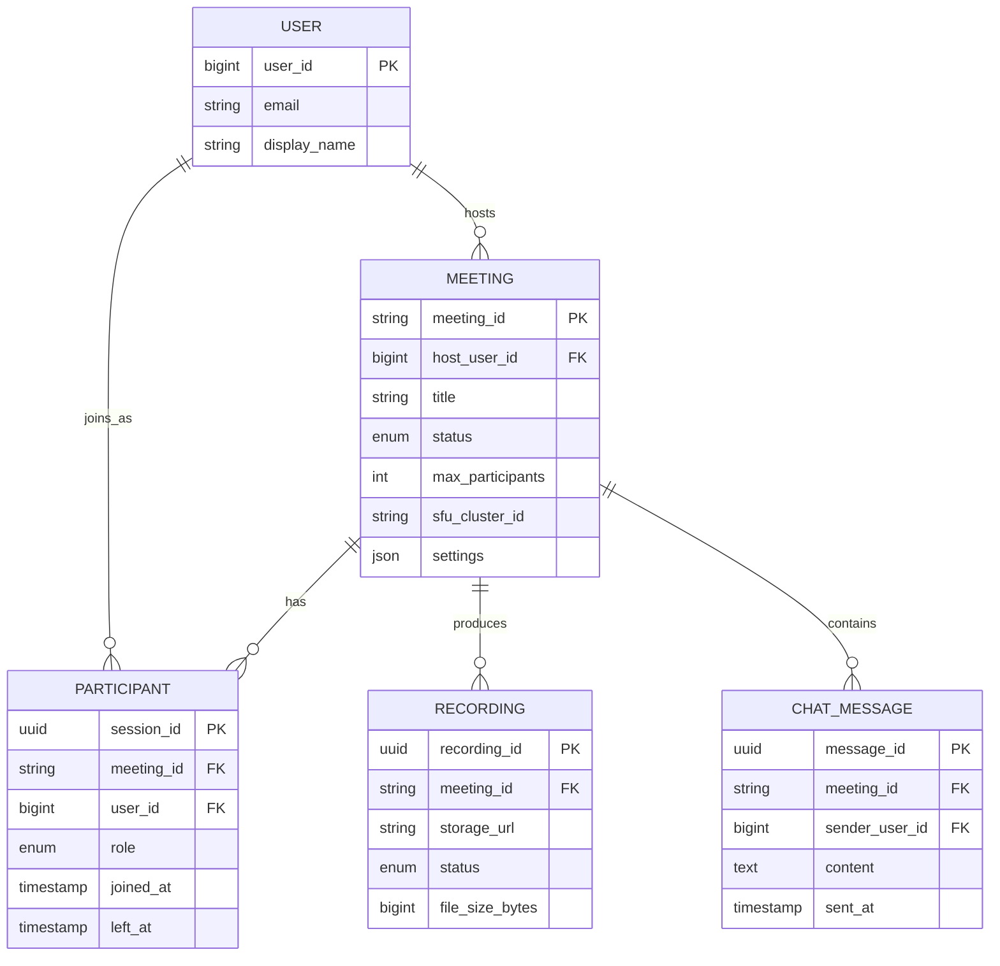

### 3.3 Database Choice Justification

| Requirement             | Choice          | Reason                                          |
| ----------------------- | --------------- | ----------------------------------------------- |
| Meeting & user metadata | PostgreSQL      | ACID, relational integrity, mature ecosystem    |
| Active meeting state    | Redis           | Sub-ms lookups for participant lists, SFU maps  |
| Chat messages           | Cassandra       | Append-heavy, time-series, partition by meeting |
| Recording files         | S3 / GCS        | Cheap, 11 nines durability, lifecycle policies  |
| Signaling state         | In-memory (SFU) | Ephemeral per-meeting, no persistence needed    |

---

## 4. High-Level Architecture

### 4.1 Architecture Diagram

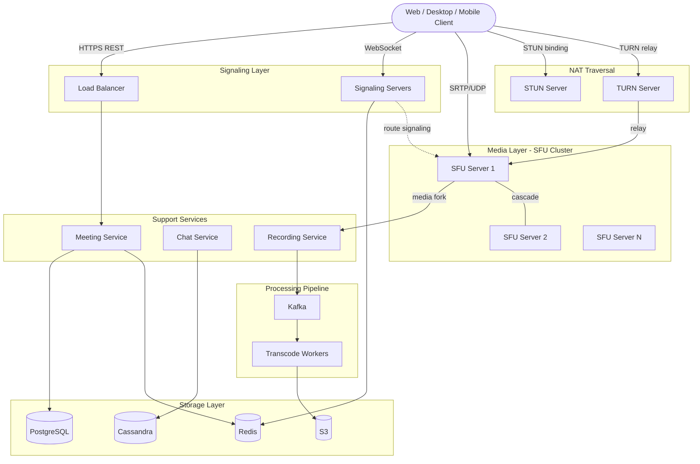

### 4.2 Component Walkthrough

| Component            | Responsibility                                                 |
| -------------------- | -------------------------------------------------------------- |
| **Meeting Service**  | Meeting CRUD, participant management, SFU cluster assignment   |
| **Signaling Server** | WebSocket for SDP/ICE exchange, participant events             |
| **SFU Server**       | Receives media from senders, selectively forwards to receivers |
| **STUN Server**      | Returns client's public IP:port for NAT traversal              |
| **TURN Server**      | Relays media when direct connection fails (symmetric NAT)      |
| **Chat Service**     | In-meeting text messages, distributed via signaling WS         |
| **Recording Service**| Captures forked streams from SFU, uploads raw segments to S3   |
| **Transcode Workers**| Converts raw recordings to MP4, generates final composite      |

---

## 5. Deep Dive

### 5.1 WebRTC Fundamentals

WebRTC handles media capture, encoding, transport, and rendering. The key components:

| Component          | Role                                                     |
| ------------------ | -------------------------------------------------------- |
| `getUserMedia()`   | Captures camera/microphone from the device               |
| `RTCPeerConnection`| Manages peer connection, ICE, DTLS, SRTP                 |
| SDP                | Describes media capabilities (codecs, resolution)        |
| ICE                | Finds the best network path between peers                |
| SRTP               | Encrypts media in transit (AES-128)                      |

**WebRTC Signaling Flow (Client to SFU):**

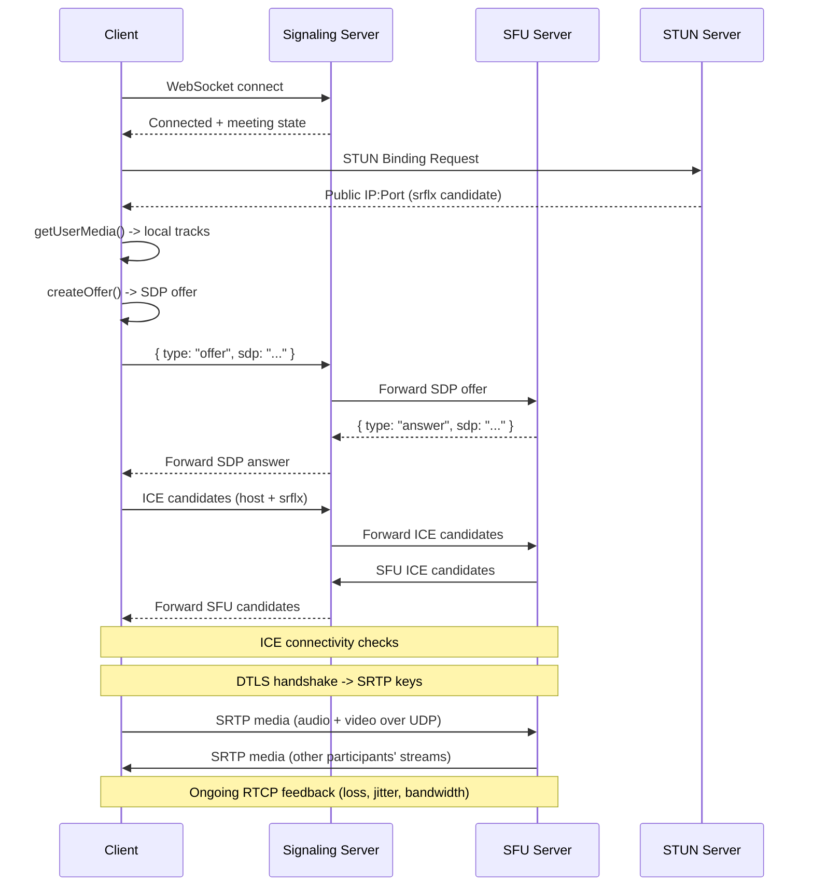

### 5.2 STUN and TURN Servers (NAT Traversal)

Most clients sit behind NATs, making their private IPs unreachable from the internet.

**STUN:** Discovers the client's public IP:port mapping. Lightweight, stateless. Works for
~85% of cases (full cone, restricted cone, port-restricted NAT). Fails for symmetric NAT.

**TURN:** Relays all media through a server. Works 100% of cases including symmetric NAT
and strict firewalls. Expensive -- all media bandwidth flows through TURN. Used by ~15%
of connections.

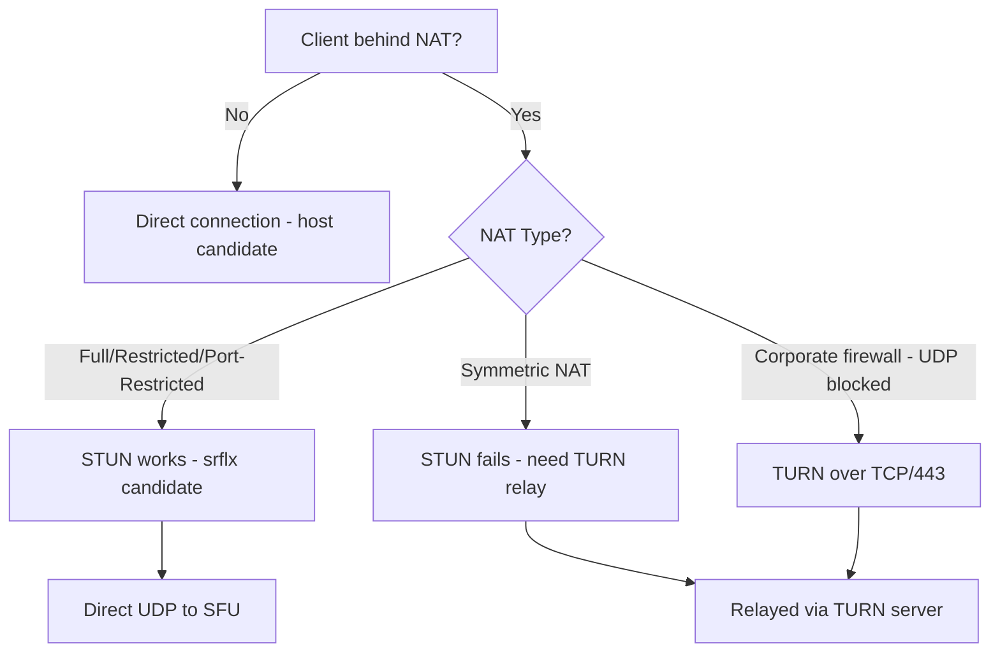

### 5.3 SFU vs MCU vs Mesh

**Mesh (Peer-to-Peer):**

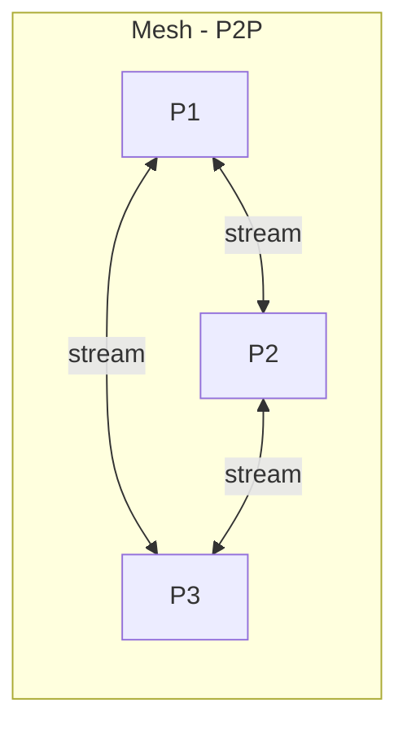

Each participant sends their stream to every other participant directly. No server needed.
N participants = N-1 uploads + N-1 downloads per person. Practical limit: 3-4 people.

**SFU (Selective Forwarding Unit):**

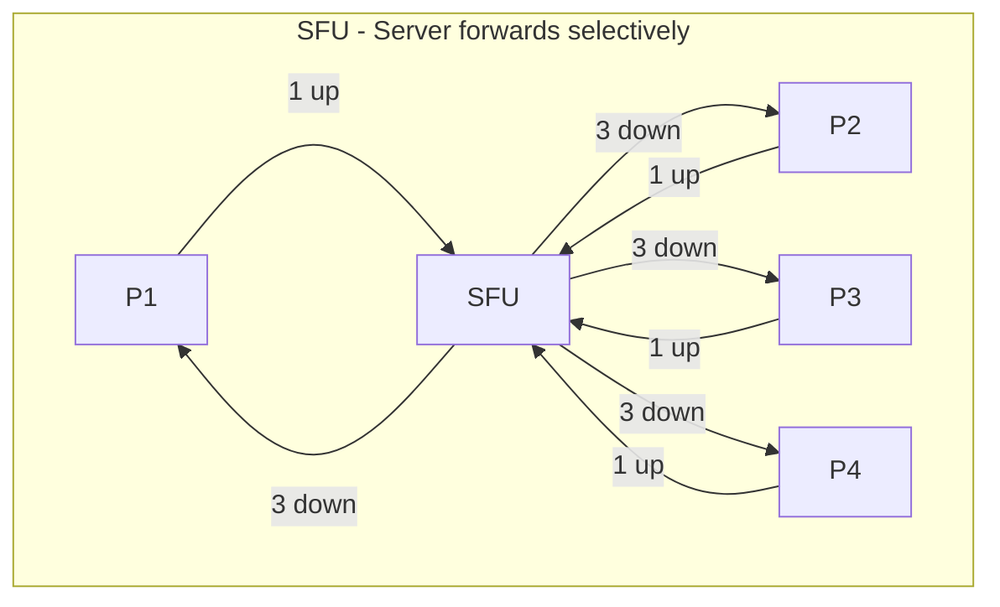

Each participant sends ONE stream to the SFU. The SFU forwards each stream to all other
participants without transcoding. It selects which quality layer to forward per receiver.

**MCU (Multipoint Control Unit):**

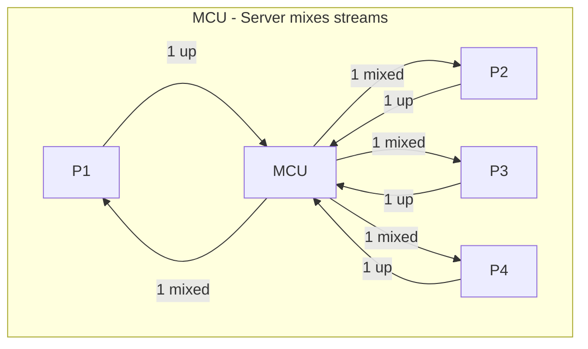

MCU decodes all streams, composites them into a single mixed video, re-encodes, and sends
one stream to each participant. Minimal client bandwidth but enormous server CPU.

**Comparison Table:**

| Dimension            | Mesh (P2P)            | SFU                      | MCU                       |
| -------------------- | --------------------- | ------------------------ | ------------------------- |
| **Server CPU**       | None                  | Low (packet forwarding)  | Very High (decode+encode) |
| **Client upload**    | N-1 streams           | 1 stream                 | 1 stream                  |
| **Client download**  | N-1 streams           | N-1 (selectable quality) | 1 mixed stream            |
| **Latency**          | Lowest (direct)       | Low (forward only)       | Higher (transcode delay)  |
| **Max participants** | 3-4                   | 50-100 (cascadable)      | 20-30 (CPU bound)         |
| **Scalability**      | Not scalable          | Highly scalable          | Limited                   |
| **Quality control**  | None                  | Per-receiver selection   | Fixed layout              |
| **E2E encryption**   | Possible              | Possible (insertable)    | Broken (must decrypt)     |
| **Cost**             | Free                  | Moderate                 | Expensive                 |
| **Used by**          | Small P2P calls       | Zoom, Meet, Teams        | Legacy telepresence       |

> **Why SFU wins:** Best balance of scalability, latency, and quality control. Low server
> CPU (no transcoding), per-receiver quality adaptation via simulcast, horizontal scaling
> through cascading.

### 5.4 Bandwidth Adaptation

Participants have vastly different bandwidth (fiber vs cellular). The system adapts dynamically.

**Simulcast (Multiple Encodings from Sender):**

```
Sender encodes 3 quality levels simultaneously and sends all to SFU:
  High:   1080p, 2.5 Mbps, 30fps -> forwarded to receivers with good bandwidth
  Medium: 360p,  500 Kbps, 15fps -> forwarded to medium-bandwidth receivers
  Low:    180p,  150 Kbps, 15fps -> forwarded to low-bandwidth or thumbnail tiles

SFU selection logic per receiver:
  - Available bandwidth > 2.5 Mbps? -> forward HIGH
  - Available bandwidth > 500 Kbps? -> forward MEDIUM
  - Otherwise -> forward LOW
  - Active speaker view? -> HIGH for speaker, LOW for thumbnails
  - Tab in background? -> pause video, audio only
```

**SVC (Scalable Video Coding) -- Layered Approach:**

```
Single layered encoding instead of 3 independent ones:
  Base Layer:         180p, 150 Kbps (always required)
  Enhancement L1:    +360p, +350 Kbps
  Enhancement L2:    +1080p, +2 Mbps

SFU drops higher layers mid-stream without re-negotiation.
Smoother transitions, less bandwidth waste, but requires VP9 SVC or AV1 codec support.
```

| Aspect               | Simulcast                      | SVC                          |
| -------------------- | ------------------------------ | ---------------------------- |
| Sender CPU           | 3x encoding                    | 1.3x encoding (layered)     |
| Sender bandwidth     | ~3.1 Mbps total                | ~2.7 Mbps total              |
| Switching speed      | Needs keyframe                 | Instant (drop layers)        |
| Codec support        | VP8, H.264, VP9, AV1           | VP9 SVC, AV1 only           |
| Quality transitions  | Abrupt (resolution change)     | Smooth (layer drop/add)      |
| Industry adoption    | Wide (Google Meet, Jitsi)      | Growing (Zoom, Teams)        |

**Bandwidth Estimation Loop:**

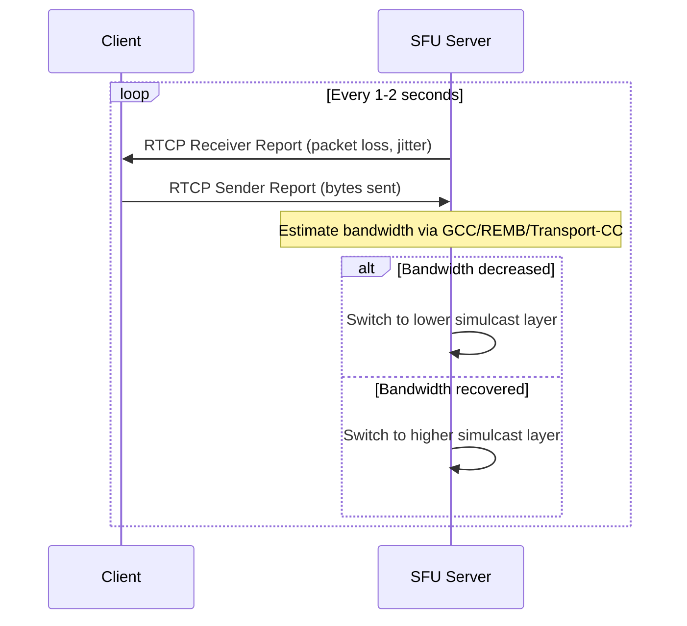

### 5.5 Recording Architecture

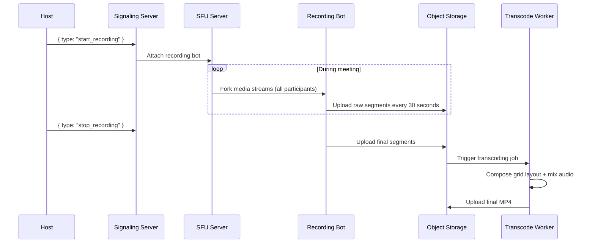

Server-side recording is chosen over client-side because it works regardless of client
device, captures all participants consistently, and can generate multiple layouts. The
trade-off is server compute cost and storage (500 MB per 45-minute meeting).

---

## 6. Scaling & Performance

### 6.1 Geographic SFU Distribution

Media latency is dominated by physical distance. SFUs must be deployed at the edge.

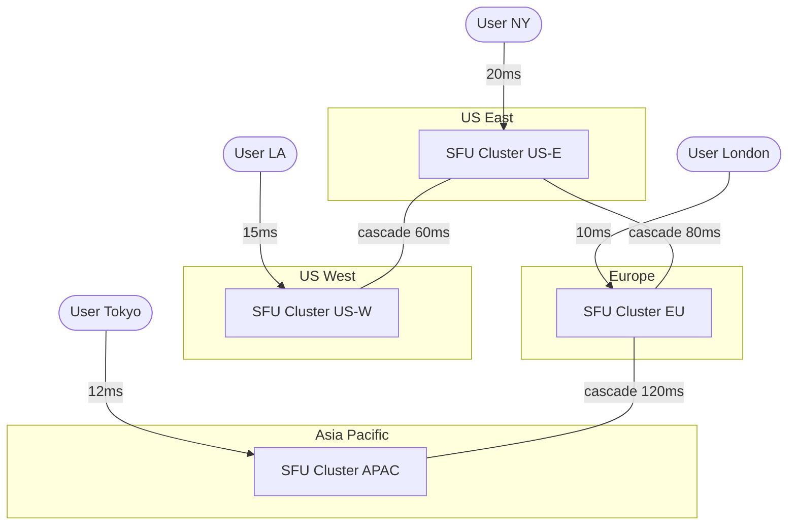

**Cross-region meetings:** First participant anchors the meeting to the nearest SFU.
Participants from other regions connect to their local SFU, and a cascade link
(server-to-server WebRTC) bridges the two SFUs over dedicated backbone.

### 6.2 Cascaded SFU for Large Meetings

A single SFU handles ~500 participants. For 1000-person meetings, we cascade multiple SFUs:

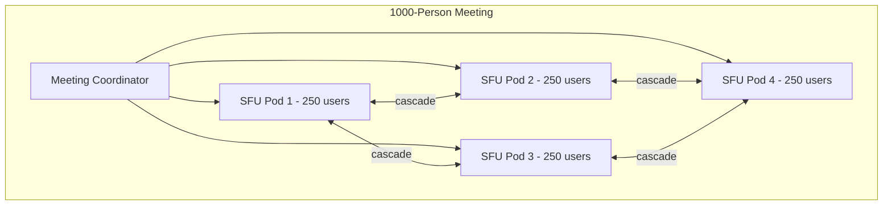

**Webinar mode optimization:** In a 1000-person meeting, only 1-5 speakers send video.
The other 995 are receive-only. This reduces the problem from 1000 bidirectional streams
to 5 video streams forwarded to 1000 receivers -- a ~100x reduction in SFU load.

### 6.3 Auto-Scaling Strategy

```
SFU Servers:    Target 400/500 participants. Drain mode for scale-down (no new meetings,
                wait for existing to end). Pre-warm by time-of-day per timezone.
Signaling:      Target 50K WebSocket connections/instance. Stateless (Redis) -> instant scale.
TURN Servers:   Target 7/10 Gbps utilization. Geo-distributed with Anycast routing.
```

---

## 7. Reliability & Fault Tolerance

### 7.1 Single Points of Failure

| Component        | SPOF? | Mitigation                                              |
| ---------------- | ----- | ------------------------------------------------------- |
| Signaling Server | No    | Stateless, WS reconnects to any instance via LB         |
| SFU Server       | Yes*  | Hot standby receives stream copies; ICE restart on fail  |
| STUN Server      | No    | Stateless, multiple instances behind Anycast             |
| TURN Server      | Yes*  | ICE restart with alternate TURN on failure               |
| Redis            | Yes   | Redis Sentinel/Cluster with replicas                     |
| PostgreSQL       | Yes   | Primary + sync standby, auto failover (Patroni)         |
| Recording Bot    | Yes*  | Segment-based: resume recording with new bot, gap < 30s |

### 7.2 SFU Failover and Reconnection

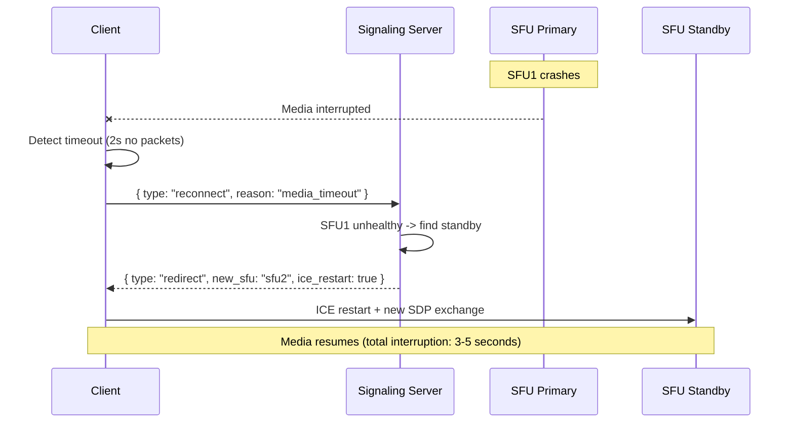

### 7.3 Graceful Degradation

```
SFU overloaded (CPU > 90%):
  -> Reduce max resolution from 1080p to 720p for all streams
  -> Disable simulcast high layer, forward medium + low only

TURN server overloaded:
  -> Stop new allocations; existing sessions continue
  -> New participants attempt direct connection

Recording service down:
  -> Meeting continues uninterrupted (non-critical path)
  -> Notify host that recording is paused

Redis down:
  -> SFU continues forwarding media (media path has no DB dependency)
  -> New joins fail until Redis recovers; existing meetings unaffected
```

### 7.4 Client-Side Resilience

- **Network switch (WiFi -> Cellular):** ICE restart gathers new candidates, re-establishes
  SRTP in 1-3 seconds.
- **Packet loss:** Jitter buffer absorbs up to 200ms. Opus FEC for audio. PLI requests
  keyframe for video. NACK requests retransmission.
- **Sudden bandwidth drop:** GCC detects delay increase, client reduces send bitrate, SFU
  switches to lower simulcast layer for this sender only.

---

## 8. Trade-offs & Alternatives

### 8.1 Key Architecture Decisions

| Decision               | Chosen            | Alternative         | Why Chosen                                          |
| ---------------------- | ----------------- | ------------------- | --------------------------------------------------- |
| Media topology         | SFU               | MCU                 | Lower latency, lower server CPU, per-receiver quality |
| Media topology         | SFU               | Mesh (P2P)          | Scales beyond 3-4 people, O(1) client upload        |
| Quality adaptation     | Simulcast + SVC   | Single quality      | Heterogeneous clients need different quality levels  |
| Signaling transport    | WebSocket         | HTTP long-poll      | Bidirectional, low latency, persistent connection    |
| Media transport        | SRTP over UDP     | SRTP over TCP       | No head-of-line blocking, lower latency              |
| Recording              | Server-side       | Client-side         | Reliable, consistent, all participants captured      |
| NAT traversal          | STUN + TURN       | Always TURN         | STUN covers 85% at zero relay cost                   |
| Large meetings         | Cascaded SFU      | Single large SFU    | Horizontal scaling, geo-distribution                 |

### 8.2 Core Trade-offs

```
Latency vs Quality:
  Lower jitter buffer = lower latency but more glitches on packet loss
  Higher resolution = better quality but more bandwidth and latency

Server Cost vs User Experience:
  More SFU servers = lower load = better quality, but higher infra cost
  TURN is expensive but necessary for 15% of connections

Encryption vs Features:
  True E2E encryption prevents server-side recording
  Solution: E2E for 1-on-1, server-mediated encryption for group + recording
```

---

## 9. Interview Tips

### What to Lead With

1. **Start with the media topology decision.** Frame the core problem as "how do we route
   media between N participants?" Walk through Mesh vs SFU vs MCU. Land on SFU.
2. **Separate signaling from media.** Make it clear that signaling (WebSocket) and media
   (UDP/SRTP) are completely separate paths. This is the most common misconception.
3. **Use numbers.** "28M peak concurrent participants each sending 1.5 Mbps need 56K SFU
   servers. That is why geo-distribution and cascading are essential."

### Common Follow-up Questions

| Question                                          | Answer Sketch                                    |
| ------------------------------------------------- | ------------------------------------------------ |
| "How does a client behind strict NAT connect?"    | ICE: STUN first (85%), TURN relay fallback (15%) |
| "What if the SFU crashes mid-meeting?"            | Standby SFU, ICE restart, 3-5s recovery          |
| "How do you handle 1000-person all-hands?"        | Cascaded SFUs + webinar mode (5 senders, 995 receivers) |
| "Why not peer-to-peer for everything?"            | 10 participants = 9 uploads at 1.5 Mbps = 13.5 Mbps up (impractical) |
| "How does screen sharing work?"                   | getDisplayMedia() -> separate track to SFU, forwarded like video |
| "Different bandwidth across users?"               | Simulcast: 3 quality layers, SFU picks per receiver |
| "How does virtual background work?"               | Client-side ML segmentation (MediaPipe) before encode |

### Mistakes to Avoid

- **Confusing signaling with media.** Signaling = WebSocket (lightweight). Media = UDP/SRTP
  (high bandwidth). Completely separate paths.
- **Proposing Mesh for group calls.** Mesh breaks at 5+ participants. Always lead with SFU.
- **Forgetting NAT traversal.** Most clients are behind NATs. Mention STUN/TURN proactively.
- **Ignoring bandwidth heterogeneity.** Explain simulcast or SVC for adaptive quality.
- **Treating this like a traditional web service.** There is no database in the hot path.
  The hot path is UDP packets through SFU servers.

### Time Allocation (45-minute interview)

```
[0-5 min]   Requirements & estimations -> 28M peak, 56K SFU servers
[5-10 min]  API design (REST + WebSocket signaling)
[10-25 min] Architecture: signaling vs media paths, SFU vs MCU vs Mesh, WebRTC flow
[25-35 min] Scaling: geo SFUs, cascading, simulcast, TURN sizing
[35-45 min] Reliability, trade-offs, Q&A
```

---

## 10. Quick Reference Card

```
System:           Video Conferencing (Zoom / Google Meet / Teams)
Scale:            300M daily participants, 28M peak concurrent, 2.8M concurrent meetings
Core challenge:   Real-time media routing with <150ms latency across heterogeneous networks
Key decision:     SFU (Selective Forwarding Unit) over MCU or Mesh
Media transport:  SRTP over UDP, signaling over WebSocket
NAT traversal:    STUN (85%) + TURN relay (15%)
Quality control:  Simulcast (1080p/360p/180p) + SVC, per-receiver selection at SFU
Large meetings:   Cascaded SFUs + webinar mode (few senders, many receivers)
Recording:        Server-side fork at SFU -> recording bot -> S3 -> transcode to MP4
Geo-distribution: SFU clusters in 10+ regions, cascaded via backbone links
Failover:         SFU standby + ICE restart, 3-5 second recovery
Encryption:       DTLS-SRTP transport, E2E optional via Insertable Streams
Availability:     99.99% (drain deploys, SFU failover, multi-region)
```
