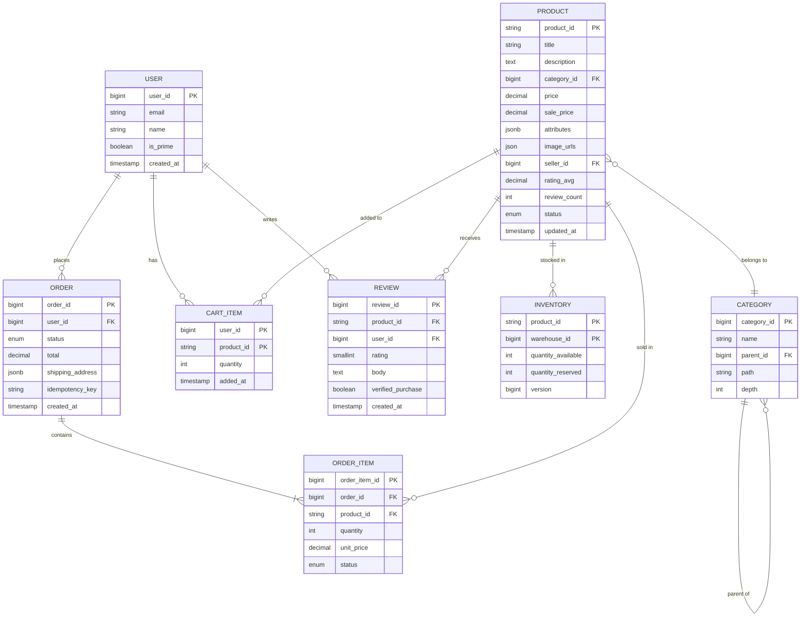
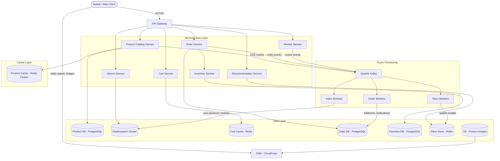
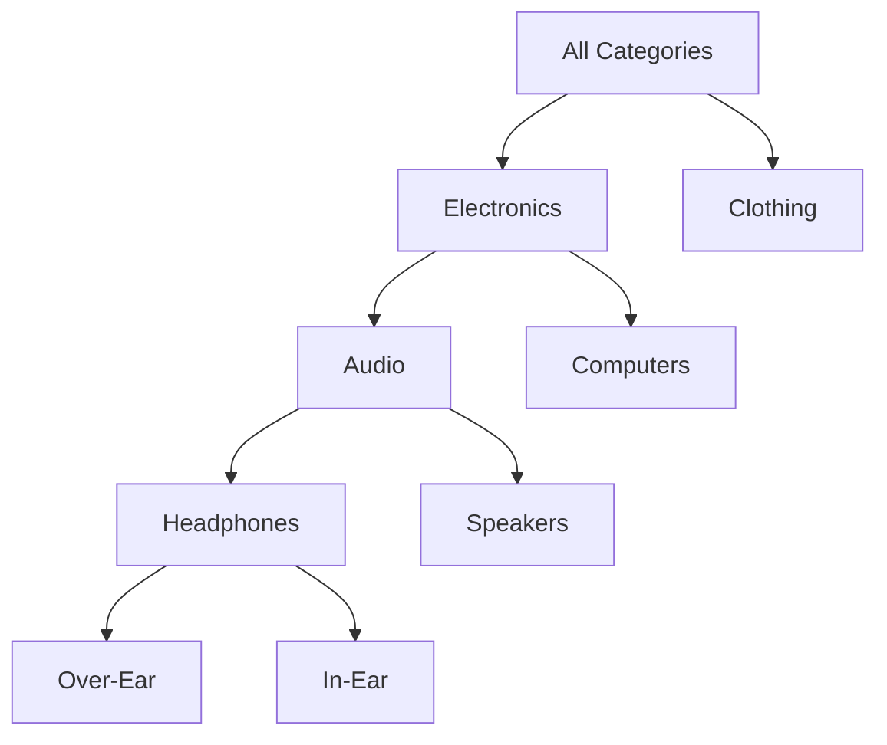
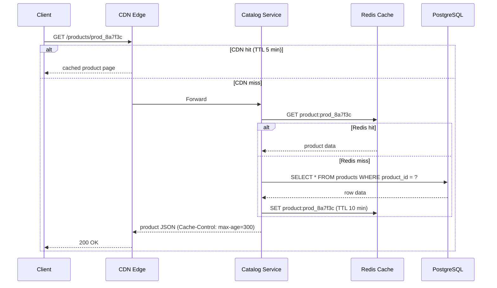
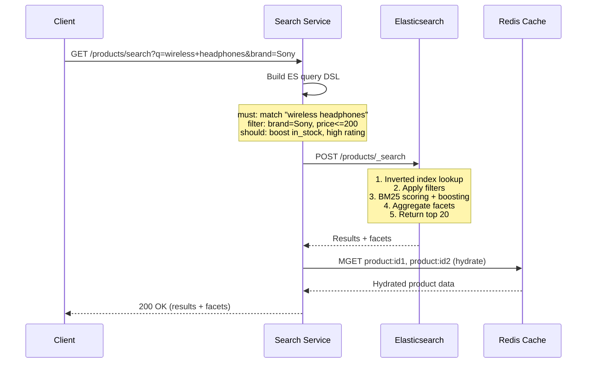
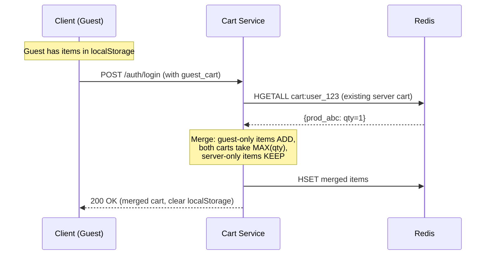
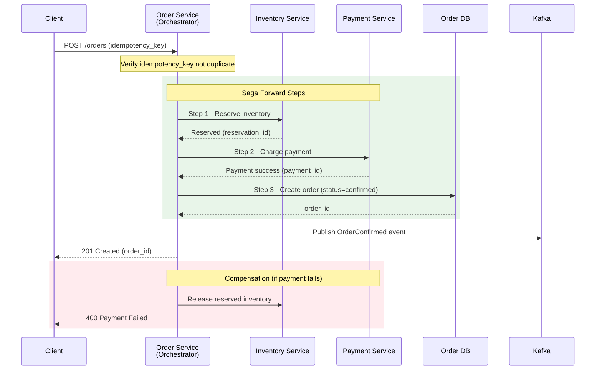

# Design Amazon E-Commerce

> Amazon-style e-commerce spans catalog management, search, shopping cart, checkout,
> inventory, order tracking, reviews, and recommendations. The core challenge is handling
> extreme read traffic (100B+ views/day) while maintaining strong consistency for orders
> and inventory -- especially during flash sales like Prime Day where traffic spikes 10-100x.

---

## 1. Problem Statement & Requirements

Design a large-scale e-commerce platform that allows users to browse, search, and purchase
products with hundreds of millions of SKUs, supporting flash sale traffic spikes while
ensuring inventory is never oversold.

### 1.1 Functional Requirements

- **FR-1:** Product catalog -- browse by category, search by keyword, filter by attributes (price, brand, rating).
- **FR-2:** Product detail pages -- display product info, images, pricing, availability.
- **FR-3:** Shopping cart -- add/remove/update items, persist across sessions, merge guest cart on login.
- **FR-4:** Checkout and order placement -- address, shipping, payment, order confirmation.
- **FR-5:** Inventory management -- real-time stock tracking, reservation on checkout.
- **FR-6:** Order tracking -- view order status, history, estimated delivery.
- **FR-7:** Reviews and ratings -- submit reviews, view aggregated ratings.
- **FR-8:** Recommendations -- "frequently bought together", "customers also viewed".

### 1.2 Non-Functional Requirements

- **Availability:** 99.99% for catalog/search; 99.999% for order placement.
- **Latency:** Search < 200ms p99, product page < 150ms p99, checkout < 500ms p99.
- **Throughput:** 100B product views/day, 10M orders/day.
- **Consistency:** Eventual for catalog/reviews; strong for inventory/orders.
- **Durability:** Zero data loss for orders and payments.
- **Scalability:** Handle 10-100x spikes during Prime Day and Black Friday.

### 1.3 Out of Scope

- Seller portal and seller onboarding workflows.
- Payment gateway internals (treated as a black box).
- Warehouse management system (WMS) and logistics routing.
- Authentication/authorization, customer support, advertising.

### 1.4 Assumptions & Estimations

```
Total registered users   = 300 M
Daily active users (DAU) = 300 M
Total products           = 500 M

--- Product Views (Read) ---
Product views / day      = 100 B
Views / second           = 100 B / 86,400 ~ 1.16 M RPS
Peak (Prime Day, 5x)     = ~5.8 M RPS

--- Search Queries ---
Searches / day           = 3 B (avg 10 per active user)
Search QPS               = 3 B / 86,400 ~ 35,000 QPS
Peak search QPS          = ~175,000 QPS

--- Orders (Write) ---
Orders / day             = 10 M
Orders / second          = 10 M / 86,400 ~ 116 OPS
Peak orders / second     = ~1,200 OPS (Prime Day, 10x)
Avg items per order      = 3

--- Cart Operations ---
Cart updates / day       = 500 M
Cart QPS                 = 500 M / 86,400 ~ 5,800 QPS

--- Storage ---
Product catalog          = 500 M * 10 KB = 5 TB
Product images           = 500 M * 8 * 500 KB = 2 PB (S3 + CDN)
Order storage / year     = 3.65 B * 3.5 KB = ~12.8 TB / year
Reviews total            = 2 B * 1 KB = 2 TB

--- Memory (Cache) ---
Hot products (top 10%)   = 50 M * 10 KB = 500 GB (Redis Cluster)
Session/cart cache       = 300 M * 2 KB = 600 GB
```

> **Key Insight:** The system is extremely read-heavy (1.16M RPS views vs 116 OPS orders).
> Catalog and search must be aggressively cached. Orders are low-volume but demand strong
> consistency and zero data loss.

---

## 2. API Design

### 2.1 Product Search

```
GET /api/v1/products/search?q=wireless+headphones&category=electronics
    &brand=Sony&price_min=50&price_max=200&sort=relevance&cursor=eyJ...&limit=20

Response: 200 OK
  {
    "results": [
      {
        "product_id": "prod_8a7f3c",
        "title": "Sony WH-1000XM5 Wireless Headphones",
        "price": 349.99,
        "sale_price": 278.00,
        "rating": 4.7,
        "review_count": 42891,
        "thumbnail_url": "https://cdn.example.com/products/8a7f3c/thumb.jpg",
        "in_stock": true,
        "prime_eligible": true
      }
    ],
    "facets": {
      "brands": [{"name": "Sony", "count": 142}, {"name": "Bose", "count": 98}],
      "price_ranges": [{"range": "$50-$100", "count": 67}],
      "ratings": [{"stars": 4, "count": 210}]
    },
    "total_results": 1284,
    "next_cursor": "eyJzIjoyMH0=",
    "has_more": true
  }
```

### 2.2 Product Detail

```
GET /api/v1/products/{product_id}

Response: 200 OK
  {
    "product_id": "prod_8a7f3c",
    "title": "Sony WH-1000XM5 Wireless Headphones",
    "description": "Industry-leading noise cancellation...",
    "price": 349.99,
    "sale_price": 278.00,
    "images": ["https://cdn.example.com/products/8a7f3c/img1.jpg"],
    "attributes": { "color": "Black", "battery_life": "30 hours" },
    "category_path": ["Electronics", "Headphones", "Over-Ear"],
    "rating": 4.7,
    "review_count": 42891,
    "inventory": { "in_stock": true, "estimated_delivery": "2026-03-02" },
    "recommendations": {
      "frequently_bought_together": ["prod_case_01", "prod_cable_02"],
      "customers_also_viewed": ["prod_bose_qc", "prod_apple_max"]
    }
  }
```

### 2.3 Cart Operations

```
POST /api/v1/cart/items
Request:  { "product_id": "prod_8a7f3c", "quantity": 1 }
Response: 201 Created { "cart_id": "cart_user123", "items": [...], "cart_total": 278.00 }

PATCH /api/v1/cart/items/{product_id}
Request:  { "quantity": 2 }
Response: 200 OK (updated cart)

DELETE /api/v1/cart/items/{product_id}
Response: 200 OK (updated cart)
```

### 2.4 Order Placement & Retrieval

```
POST /api/v1/orders
Headers: Idempotency-Key: idem_a1b2c3d4
Request:
  {
    "cart_id": "cart_user123",
    "shipping_address_id": "addr_456",
    "shipping_method": "prime_two_day",
    "payment_method_id": "pm_visa_7890"
  }
Response: 201 Created
  {
    "order_id": "ord_20260228_a1b2c3",
    "status": "confirmed",
    "total": 601.98,
    "estimated_delivery": "2026-03-02"
  }

GET /api/v1/orders/{order_id}
Response: 200 OK { "order_id": "...", "status": "shipped", "tracking_number": "1Z...",
  "timeline": [{"status": "confirmed", "timestamp": "..."}, ...] }
```

> **Design Notes:** `Idempotency-Key` prevents duplicate orders from retries. Cursor-based
> pagination for search and order history. Rate limiting: 1000/min for search, 10/min for orders.

---

## 3. Data Model

### 3.1 ER Diagram



### 3.2 Database Choice Justification

| Requirement                   | Choice             | Reason                                                     |
| ----------------------------- | ------------------ | ---------------------------------------------------------- |
| Product catalog (metadata)    | PostgreSQL         | JSONB for flexible attributes, ACID, mature ecosystem      |
| Product search                | Elasticsearch      | Inverted index, faceted search, BM25 relevance scoring     |
| Shopping cart (logged-in)     | Redis              | Sub-ms reads, TTL for cart expiry                          |
| Shopping cart (guest)         | Client localStorage| No server cost, merged on login                            |
| Orders & order items          | PostgreSQL         | ACID transactions, strong consistency                      |
| Inventory                     | PostgreSQL         | Row-level locking, optimistic concurrency                  |
| Reviews                       | PostgreSQL + ES    | PG for writes, ES for search/sort                          |
| Product images                | Amazon S3          | Cheap, durable (11 nines), CDN-friendly                    |
| Recommendations (precomputed) | Redis              | Low-latency lookups for item-to-item mappings              |
| Event streaming               | Apache Kafka       | Durable, high-throughput, ordered partitions                |
| Caching (hot products)        | Redis Cluster      | In-memory, sub-ms reads, 500 GB cluster                    |

---

## 4. High-Level Architecture

### 4.1 Architecture Diagram



### 4.2 Component Walkthrough

| Component                   | Responsibility                                                         |
| --------------------------- | ---------------------------------------------------------------------- |
| **API Gateway**             | TLS termination, routing, rate limiting, authentication                |
| **Product Catalog Service** | Product CRUD, category browsing, product detail page assembly          |
| **Search Service**          | Keyword search, faceted filtering, autocomplete, relevance ranking     |
| **Cart Service**            | Cart CRUD, total calculation, guest-cart merge                         |
| **Order Service**           | Checkout orchestration (saga), order creation, status updates          |
| **Inventory Service**       | Stock queries, reservation, decrement, release on cancel               |
| **Recommendation Service**  | Serves precomputed recs ("also bought", "also viewed")                |
| **Review Service**          | Submit reviews, aggregate ratings, sort/filter reviews                 |
| **Kafka**                   | Event bus: product CDC, order events, review events                    |
| **Index Workers**           | Consume CDC events, update Elasticsearch index                         |
| **CDN**                     | Product images, JS/CSS bundles, cacheable API responses                |

---

## 5. Deep Dive: Core Flows

### 5.1 Product Catalog & Category Browsing

Categories form a tree (Electronics > Audio > Headphones > Over-Ear) using the
**materialized path pattern** for efficient ancestor/descendant queries.



**Variable Product Attributes (JSONB):** Different categories have different attributes.
Headphones have "driver_size" and "battery_life"; shirts have "size" and "material".
JSONB in PostgreSQL allows flexible schema with GIN-indexed attribute queries.

**Caching Strategy (3-tier):**



### 5.2 Search with Elasticsearch



| Feature              | Implementation                                                |
| -------------------- | ------------------------------------------------------------- |
| Full-text search     | BM25 scoring on title + description                           |
| Faceted search       | ES aggregations: terms agg (brands), range agg (prices)       |
| Autocomplete         | Edge n-gram tokenizer on title field                          |
| Spell correction     | ES `suggest` API with phrase suggester                        |
| Synonym handling     | Custom synonym filter: "headphones" = "earphones" = "headset" |
| Relevance boosting   | Boost in-stock, high-rating, and recent products              |

**ES Sync via CDC:** PostgreSQL WAL -> Debezium -> Kafka -> Index Worker -> ES (~1-3s lag).

### 5.3 Shopping Cart

| User Type   | Storage              | Reason                                     |
| ----------- | -------------------- | ------------------------------------------ |
| Logged-in   | Redis Hash           | Persists across devices, sub-ms access     |
| Guest       | localStorage         | No server cost, no auth needed             |

**Redis Structure:** `HSET cart:user_123 prod_8a7f3c '{"qty":1,"seller":"sony"}'` (TTL 30 days)



### 5.4 Inventory Management

**Reservation Pattern (two-phase):**

```
Phase 1 - RESERVE (checkout start): quantity_available -= qty, quantity_reserved += qty
Phase 2 - COMMIT (payment success): quantity_reserved -= qty
Phase 3 - RELEASE (timeout/cancel):  quantity_reserved -= qty, quantity_available += qty
Reservation TTL: 10 minutes (auto-release if checkout not completed)
```

**Optimistic Locking:**

```sql
UPDATE inventory
SET quantity_available = quantity_available - :qty,
    quantity_reserved = quantity_reserved + :qty,
    version = version + 1
WHERE product_id = :pid AND warehouse_id = :wid
  AND quantity_available >= :qty AND version = :expected_version;
-- affected_rows = 0 -> conflict (retry with backoff)
-- affected_rows = 1 -> success
```

**Flash Sale (Prime Day) Strategy:**

```
1. Redis atomic DECR: DECR inventory:prod_flash_01
   - Result >= 0: allow checkout. Result < 0: INCR back, return "sold out"
   - Handles 100K+ concurrent attempts. Async sync to PostgreSQL.
2. Request queuing: Kafka partition by product_id serializes concurrent attempts
3. Rate limiting: 1 checkout attempt per user per item per minute
4. DB safety net: CHECK (quantity_available >= 0) constraint
```

### 5.5 Order Pipeline (Saga Pattern)



**Saga Compensation Table:**

| Step | Service   | Forward Action     | Compensation Action       |
| ---- | --------- | ------------------ | ------------------------- |
| 1    | Inventory | Reserve stock      | Release reservation       |
| 2    | Payment   | Charge customer    | Refund payment            |
| 3    | Order DB  | Create order       | Mark order cancelled      |

**Why Saga over 2PC?** 2PC requires all participants to hold locks until the coordinator
decides -- blocks on any failure, does not scale across microservices. Saga uses local
transactions with compensating actions: non-blocking, scalable, eventual consistency
during brief compensation windows.

### 5.6 Recommendations

| Type                         | Algorithm               | Data Source              |
| ---------------------------- | ----------------------- | ------------------------ |
| "Frequently bought together" | Co-purchase association | Order history pairs      |
| "Customers also viewed"      | Collaborative filtering | Clickstream sessions     |
| "Recommended for you"        | User-based CF + content | Purchases + browsing     |
| "Top sellers in category"    | Popularity ranking      | Sales volume by category |

**Pipeline:** Spark batch job (every 4-6h) computes item-to-item similarity, stores top-20
per product in Redis (`reco:also_bought:prod_8a7f3c -> [prod_case, prod_cable, ...]`).
Online serving is a sub-ms Redis lookup. Fallback: category-level popular products.

---

## 6. Scaling & Performance

### 6.1 Product Catalog: CDN + Cache

```
Layer 1 - CDN: Cache-Control max-age=300, hit rate ~85-90%
  Effective origin RPS: 1.16M * 0.15 = ~174K RPS

Layer 2 - Redis Cluster: 50M hot products * 10 KB = 500 GB, 30 nodes
  Hit rate ~95%. Effective DB RPS: 174K * 0.05 = ~8,700 RPS

Layer 3 - PostgreSQL Read Replicas: 10 replicas, ~870 QPS each (trivial)
```

### 6.2 Elasticsearch Cluster

```
Index: 500M products (~5 TB)
50 primary shards (100 GB each) + 1 replica = 100 shards total
25 data nodes (64 GB RAM each, NVMe storage)
Peak 175K QPS / 25 nodes = 7,000 QPS per node
```

### 6.3 Order DB Sharding

```
Shard key: user_id (consistent hashing, 256 virtual nodes)
16 PostgreSQL instances
Per-shard: 625K orders/day, ~7.2 OPS (trivial)
Storage: 800 GB/year/shard
"My Orders" is always a single-shard query
Cross-shard analytics via data warehouse (Redshift) through CDC
```

### 6.4 Flash Sale Auto-Scaling

```
Normal -> Prime Day (10x):
  Catalog Service:  20 -> 200 instances (auto-scale on CPU > 60%)
  Search Service:   15 -> 150 instances
  Cart Service:     10 -> 100 instances
  Order Service:    5  -> 50 instances
  Elasticsearch:    +25 data nodes with replica shards
  Redis:            Double cluster with read replicas
Pre-scale 2 hours before event. All services stateless.
```

---

## 7. Reliability & Fault Tolerance

### 7.1 Inventory Race Conditions

```
1. Optimistic locking (version column) -- works for normal traffic
2. Redis atomic DECR for flash sales -- no race possible
3. DB CHECK (quantity_available >= 0) -- safety net
4. Reservation TTL (10 min) -- prevents lockup from abandoned checkouts
```

### 7.2 Order Idempotency

```
1. Client generates idempotency_key (UUID) before POST /orders
2. Order Service: SELECT * FROM orders WHERE idempotency_key = :key
3. If exists: return existing order (no double charge)
4. If not: proceed. UNIQUE constraint on idempotency_key prevents race
5. Concurrent duplicates: second INSERT fails, retries SELECT, returns existing
```

### 7.3 Payment Retry

```
Timeout:     Query payment gateway for status after 30s. If unknown, mark
             "pending_payment", background worker retries every 60s for 24h.
Declined:    Compensate saga (release inventory), return error to user.
Partial fail (charged but order DB write fails): Kafka event ensures eventual
             order creation. Reconciliation job runs hourly.
```

### 7.4 SPOF Analysis

| Component       | SPOF? | Mitigation                                               |
| --------------- | ----- | -------------------------------------------------------- |
| API Gateway     | Yes   | Active-passive pair, DNS failover, multi-AZ              |
| Catalog Service | No    | Stateless, 20+ instances, auto-scaling                   |
| Product DB      | Yes   | Sync standby + Patroni auto-failover (RTO < 30s)        |
| Order DB        | Yes   | Sync standby per shard, RPO = 0                          |
| Inventory DB    | Yes   | Sync standby, hot standby for immediate failover         |
| Redis Cache     | No    | Redis Cluster with replicas, automatic slot failover     |
| Elasticsearch   | No    | Replica shards, cluster rebalancing on node failure      |
| Kafka           | No    | 3-broker ISR, replication factor 3, min.insync = 2       |

### 7.5 Graceful Degradation

```
Elasticsearch down -> Fall back to PostgreSQL full-text search (800ms vs 100ms)
Redis Cache down   -> Reads hit PostgreSQL replicas (200ms vs 30ms)
Payment GW down    -> Queue orders for retry, show maintenance banner
Reco Service down  -> Show "Popular in category" (CDN-cached fallback)
```

---

## 8. Trade-offs & Alternatives

| Decision                         | Chosen                     | Alternative             | Why Chosen                                                 |
| -------------------------------- | -------------------------- | ----------------------- | ---------------------------------------------------------- |
| Product DB                       | PostgreSQL (JSONB)         | MongoDB                 | ACID for inventory, JSONB gives flexible schema            |
| Search engine                    | Elasticsearch              | Solr / Algolia          | Battle-tested at scale, rich aggregation framework         |
| Cart storage                     | Redis + localStorage       | DynamoDB                | Sub-ms for frequent cart ops, localStorage for guests      |
| Inventory concurrency            | Optimistic lock + Redis    | Pessimistic locking     | Less contention normally, Redis for flash sales            |
| Order transactions               | Saga (orchestrated)        | 2PC / distributed lock  | Non-blocking, scales across services, compensatable        |
| Product sync to ES               | CDC via Kafka (Debezium)   | Dual-write              | No inconsistency risk from failed dual writes              |
| Recommendations                  | Precomputed batch          | Real-time ML inference  | Simpler, sub-ms serving; batch every 4-6 hours             |
| Category hierarchy               | Materialized path          | Nested sets             | Simple queries, easy to cache, fast prefix search          |
| Catalog consistency              | Eventual (1-3s lag)        | Strong                  | Catalog changes infrequent; caching requires eventual      |
| Order/inventory consistency      | Strong (ACID)              | Eventual                | Cannot tolerate overselling or lost orders                 |
| Flash sale inventory             | Redis atomic DECR          | DB locking only         | Redis handles 100K+ DECR/sec; DB would bottleneck          |

---

## 9. Interview Tips

### What to Lead With

1. **Clarify scope.** E-commerce is huge. Ask: "Buyer experience only, or also seller side?"
2. **Start with estimations.** The 1.16M RPS reads vs 116 OPS orders split drives everything.
3. **Draw architecture early.** Sketch 6 core services + data stores + Kafka + CDN.

### Common Follow-up Questions

| Question                                                     | Answer Sketch                                                      |
| ------------------------------------------------------------ | ------------------------------------------------------------------ |
| "How do you prevent overselling during a flash sale?"        | Redis atomic DECR + DB CHECK constraint + reservation TTL          |
| "What if payment succeeds but order DB write fails?"         | Kafka event guarantees eventual creation; reconciliation job       |
| "How do you handle 100K reviews on a product?"               | Paginate from ES, precompute rating histogram, cache top reviews   |
| "What if ES is slow during Prime Day?"                       | Pre-warm cache, add replica shards, degrade to simplified search   |
| "How do you handle out-of-stock items in cart?"              | Validate stock at checkout, show warning on cart page              |
| "Product with 10 sellers at different prices?"               | Separate `offers` table, show Buy Box winner (lowest price+rating) |

### Mistakes to Avoid

- **Do not conflate catalog DB with search index.** PostgreSQL is source of truth;
  Elasticsearch is a derived read view. Interviewers test this understanding.
- **Do not forget inventory consistency.** Mention optimistic locking, atomic counters,
  and the reservation pattern -- not just "decrement the count."
- **Do not skip the saga pattern.** Checkout involves Inventory + Payment + Order.
  Explain why 2PC fails and how saga compensation handles partial failures.
- **Do not ignore flash sales.** Pre-scaling, request queuing, Redis hot-path optimization.

### Time Allocation (45-minute interview)

```
[0-5 min]   Requirements & estimations
[5-10 min]  API design & data model
[10-15 min] High-level architecture (draw diagram)
[15-30 min] Deep dive: Search (ES), Inventory (reservation), Order (saga)
[30-40 min] Scaling (CDN/cache layers, sharding) & reliability (SPOF table)
[40-45 min] Trade-offs & follow-ups
```

---

## 10. Quick Reference Card

```
System:            Amazon E-Commerce
Scale:             300M DAU, 500M products, 10M orders/day
Core challenge:    Extreme read traffic (1.16M RPS) + strong consistency for orders
Key services:      Catalog, Search, Cart, Order, Inventory, Recommendations
Product search:    Elasticsearch (50 shards, 25 nodes, faceted search, BM25)
Product cache:     CDN (85%) -> Redis Cluster (95%) -> PostgreSQL replicas
Cart:              Redis (logged-in), localStorage (guest), merge on login
Orders:            Saga pattern (Inventory -> Payment -> Order DB)
Inventory:         Optimistic locking + Redis atomic DECR for flash sales
Async backbone:    Kafka (CDC for search sync, order events, reco pipeline)
Consistency:       Eventual for catalog (1-3s), Strong for orders/inventory
Flash sales:       Pre-scaling, Redis counters, request queuing, reservation TTL
```
