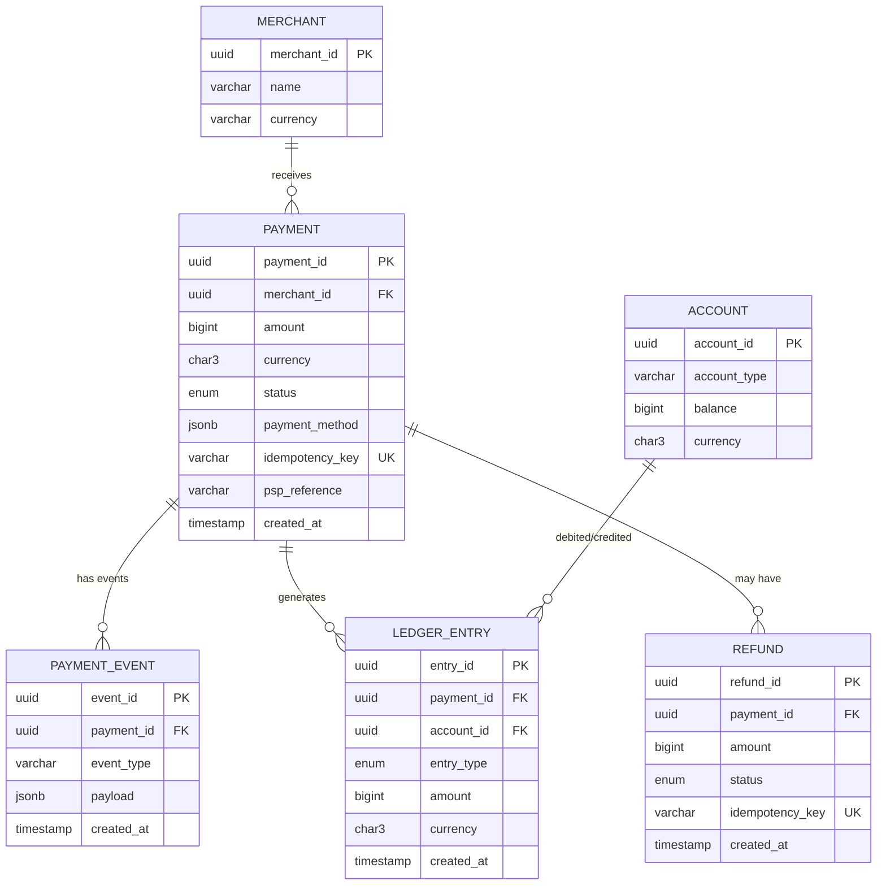
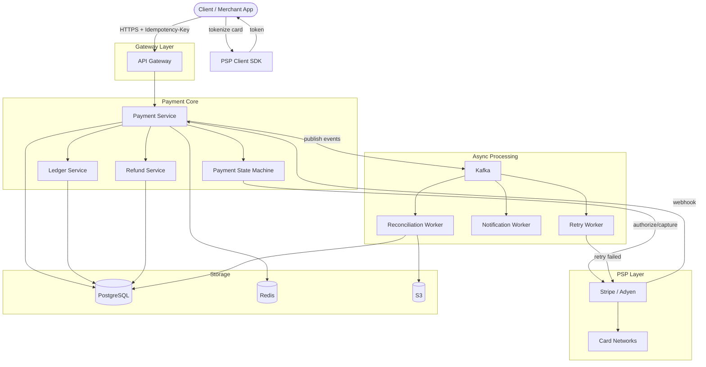
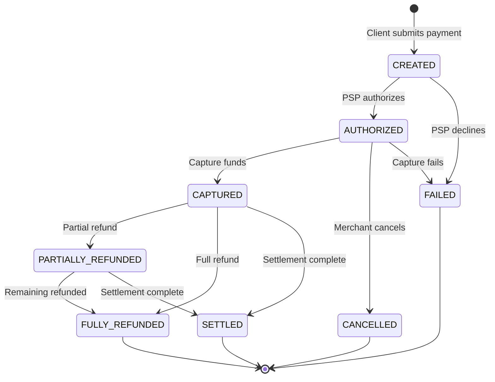
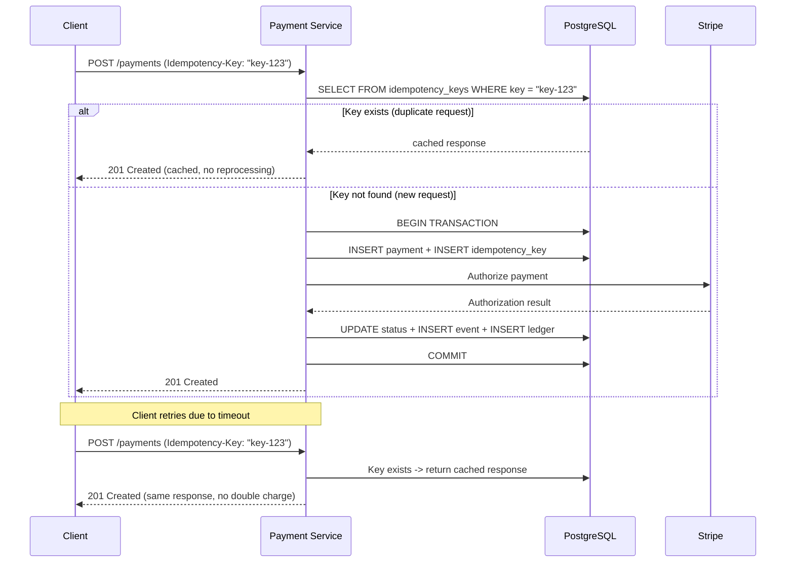
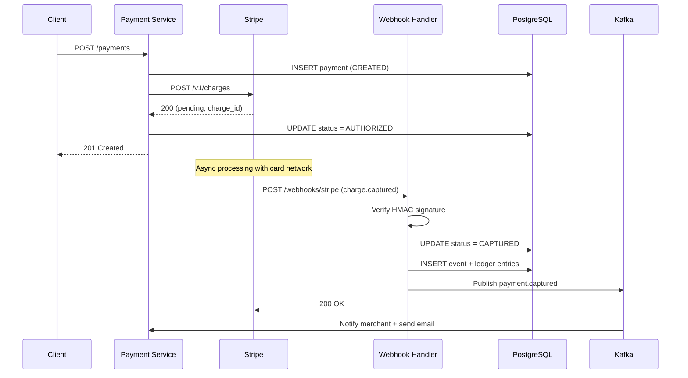

# Design a Payment System

> A payment system processes financial transactions between buyers, merchants, and banks.
> It handles payment initiation, authorization, capture, settlement, and refunds while
> ensuring exactly-once semantics, PCI DSS compliance, and full auditability. The core
> challenge is correctness and reliability, not raw throughput -- money is at stake.

---

## 1. Problem Statement & Requirements

Design a reliable payment system that accepts payments via multiple methods, processes
refunds, tracks transaction status, and maintains a complete audit trail -- all while
guaranteeing no payment is ever processed twice (exactly-once semantics).

### 1.1 Functional Requirements

- **FR-1:** Process payments via credit card, debit card, and digital wallets.
- **FR-2:** Support full and partial refunds for completed payments.
- **FR-3:** Track payment status in real time (pending, authorized, captured, settled, failed).
- **FR-4:** Maintain complete transaction history with filtering and pagination.
- **FR-5:** Support multi-currency payments with automatic conversion.
- **FR-6:** Support recurring/subscription payments with configurable billing cycles.

### 1.2 Non-Functional Requirements

- **Consistency:** Strong consistency for payment state transitions. Exactly-once via idempotency keys.
- **Availability:** 99.999% uptime (~5.26 min downtime/year). Downtime = lost revenue.
- **Latency:** Payment initiation < 1s at p99. Status queries < 100ms at p99.
- **Durability:** Zero data loss. Every state change persisted before acknowledgment.
- **Compliance:** PCI DSS Level 1. No raw card data stored -- tokenized via PSP.
- **Auditability:** Immutable audit trail for every payment event.

### 1.3 Out of Scope

- Fraud detection ML models and risk scoring internals.
- Internal bank processing and settlement networks (ACH, SWIFT).
- Merchant onboarding and KYC/KYB verification.
- Authentication and identity management.

### 1.4 Assumptions & Estimations

```
Transactions / day       = 1 M
Average transaction      = $50

--- Throughput ---
Writes / second (WPS)    = 1 M / 86,400     ~ 12 WPS (avg)
Peak WPS (10x)           = ~120 WPS
Reads / second (RPS)     = 5x write ratio    ~ 60 RPS (avg), ~600 peak

Note: Payment systems are NOT high-QPS. The challenge is correctness, not throughput.

--- Storage ---
Per transaction          = 2 KB (payment + metadata)
Per event log            = 500 B (avg 5 events/payment = 2.5 KB)
Per ledger entry         = 200 B (avg 2 entries/payment = 400 B)
Daily total              ~ 5 GB / day
5-year total             ~ 9.1 TB

--- Financial Volume ---
Daily GMV                = 1 M * $50  = $50 M / day
Annual GMV               = $18.25 B / year
```

> **Key Insight:** At ~12 WPS, a single PostgreSQL handles the load. The real challenges:
> (1) exactly-once semantics, (2) distributed state with external PSPs, (3) double-entry
> bookkeeping, (4) regulatory compliance.

---

## 2. API Design

### 2.1 Initiate a Payment

```
POST /api/v1/payments
Headers:
  Authorization: Bearer <token>
  Idempotency-Key: "uuid-v4-from-client"

Request:
  {
    "amount": 5000,                        // smallest currency unit (cents)
    "currency": "USD",
    "payment_method": {
      "type": "card",
      "token": "tok_visa_4242"             // tokenized by PSP client SDK
    },
    "merchant_id": "merch_abc123",
    "description": "Order #12345",
    "metadata": { "order_id": "order_12345" },
    "capture_method": "automatic"          // automatic | manual
  }

Response: 201 Created
  {
    "payment_id": "pay_7f3a9b2c",
    "status": "authorized",
    "amount": 5000,
    "currency": "USD",
    "payment_method": { "type": "card", "last4": "4242", "brand": "visa" },
    "idempotency_key": "uuid-v4-from-client",
    "created_at": "2026-02-28T10:30:00Z"
  }
```

### 2.2 Get Payment Status

```
GET /api/v1/payments/{payment_id}
Headers: Authorization: Bearer <token>

Response: 200 OK
  {
    "payment_id": "pay_7f3a9b2c",
    "status": "captured",
    "amount": 5000,
    "currency": "USD",
    "events": [
      { "type": "payment.created",    "timestamp": "2026-02-28T10:30:00Z" },
      { "type": "payment.authorized", "timestamp": "2026-02-28T10:30:01Z" },
      { "type": "payment.captured",   "timestamp": "2026-02-28T10:30:02Z" }
    ],
    "created_at": "2026-02-28T10:30:00Z"
  }
```

### 2.3 Refund a Payment

```
POST /api/v1/payments/{payment_id}/refund
Headers:
  Authorization: Bearer <token>
  Idempotency-Key: "refund-uuid-v4"

Request:  { "amount": 2500, "reason": "customer_request" }

Response: 201 Created
  {
    "refund_id": "ref_8d4c1e5f",
    "payment_id": "pay_7f3a9b2c",
    "status": "pending",
    "amount": 2500,
    "reason": "customer_request",
    "created_at": "2026-02-28T12:00:00Z"
  }
```

> **Design Notes:**
> - `Idempotency-Key` is **mandatory** for all write endpoints.
> - Amounts in smallest currency unit (cents) to avoid floating-point errors.
> - Card tokens generated client-side by PSP SDK -- raw card numbers never touch our servers.
> - Cursor-based pagination for list endpoints: `GET /api/v1/payments?cursor=<c>&limit=20`.

---

## 3. Data Model

### 3.1 Schema

| Table              | Column            | Type          | Notes                                  |
| ------------------ | ----------------- | ------------- | -------------------------------------- |
| `payments`         | `payment_id`      | UUID / PK     | Snowflake ID                           |
| `payments`         | `merchant_id`     | UUID / FK     | Indexed, shard key                     |
| `payments`         | `amount`          | BIGINT        | Smallest currency unit                 |
| `payments`         | `currency`        | CHAR(3)       | ISO 4217 (USD, EUR)                    |
| `payments`         | `status`          | ENUM          | created, authorized, captured, settled, failed, cancelled |
| `payments`         | `payment_method`  | JSONB         | Type, token, last4, brand              |
| `payments`         | `idempotency_key` | VARCHAR(255)  | UNIQUE index                           |
| `payments`         | `psp_reference`   | VARCHAR(255)  | External PSP transaction ID            |
| `payments`         | `metadata`        | JSONB         | Merchant key-value pairs               |
| `payments`         | `created_at`      | TIMESTAMP     | Indexed                                |
| `payment_events`   | `event_id`        | UUID / PK     | Append-only, immutable                 |
| `payment_events`   | `payment_id`      | UUID / FK     | Indexed                                |
| `payment_events`   | `event_type`      | VARCHAR(50)   | created, authorized, captured, etc.    |
| `payment_events`   | `payload`         | JSONB         | Full event data snapshot               |
| `payment_events`   | `created_at`      | TIMESTAMP     | Never updated                          |
| `ledger_entries`   | `entry_id`        | UUID / PK     | Double-entry bookkeeping               |
| `ledger_entries`   | `payment_id`      | UUID / FK     | Links to payment                       |
| `ledger_entries`   | `account_id`      | UUID / FK     | Merchant, platform, or PSP account     |
| `ledger_entries`   | `entry_type`      | ENUM          | debit, credit                          |
| `ledger_entries`   | `amount`          | BIGINT        | Always positive                        |
| `ledger_entries`   | `currency`        | CHAR(3)       | ISO 4217                               |
| `ledger_entries`   | `created_at`      | TIMESTAMP     | Immutable                              |
| `refunds`          | `refund_id`       | UUID / PK     |                                        |
| `refunds`          | `payment_id`      | UUID / FK     | Indexed                                |
| `refunds`          | `amount`          | BIGINT        | Refund amount in cents                 |
| `refunds`          | `status`          | ENUM          | pending, succeeded, failed             |
| `refunds`          | `idempotency_key` | VARCHAR(255)  | UNIQUE index                           |
| `refunds`          | `psp_reference`   | VARCHAR(255)  | External PSP refund ID                 |
| `refunds`          | `created_at`      | TIMESTAMP     |                                        |

### 3.2 ER Diagram



### 3.3 Database Choice Justification

| Requirement              | Choice       | Reason                                              |
| ------------------------ | ------------ | --------------------------------------------------- |
| Payments, ledger, events | PostgreSQL   | ACID transactions, strong consistency, row-level locks |
| Idempotency keys         | PostgreSQL   | Same transaction scope as payment creation           |
| Async event streaming    | Apache Kafka | Durable, ordered, exactly-once delivery semantics    |
| Payment status cache     | Redis        | Fast status lookups, TTL-based expiry                |
| Reconciliation files     | S3           | Batch files from PSPs, cheap durable storage         |

> **Why PostgreSQL for everything transactional?** Payment creation, event logging, ledger
> entries, and idempotency key storage MUST happen atomically in a single transaction.
> PostgreSQL handles this naturally. Multiple databases would require 2PC.

---

## 4. High-Level Architecture

### 4.1 Architecture Diagram



### 4.2 Component Walkthrough

| Component                 | Responsibility                                                |
| ------------------------- | ------------------------------------------------------------- |
| **API Gateway**           | TLS termination, rate limiting, authentication, routing       |
| **Payment Service**       | Orchestrates payment lifecycle, validates requests, idempotency|
| **Payment State Machine** | Enforces valid state transitions (created->authorized->captured)|
| **Ledger Service**        | Double-entry bookkeeping, ensures every transaction balances  |
| **Refund Service**        | Handles full/partial refunds, validates refund eligibility    |
| **PSP Integration**       | Communicates with Stripe/Adyen, translates protocols          |
| **Kafka**                 | Event bus for async processing                                |
| **Reconciliation Worker** | Matches internal records vs PSP/bank settlement files         |
| **Retry Worker**          | Retries transient PSP failures with exponential backoff       |
| **PostgreSQL**            | Source of truth for payments, events, ledger                  |
| **Redis**                 | Payment status cache for fast lookups                         |

---

## 5. Deep Dive: Core Flows

### 5.1 Payment Flow -- State Machine



| From          | To                 | Trigger                    | Ledger Side Effect                      |
| ------------- | ------------------ | -------------------------- | --------------------------------------- |
| (new)         | CREATED            | Client submits payment     | Insert payment record + event           |
| CREATED       | AUTHORIZED         | PSP confirms card hold     | Hold funds entry                        |
| AUTHORIZED    | CAPTURED           | Auto or merchant capture   | Debit customer, credit merchant         |
| CAPTURED      | PARTIALLY_REFUNDED | Partial refund processed   | Debit merchant, credit customer         |
| CAPTURED      | SETTLED            | Bank settlement completes  | Move from pending to settled            |

### 5.2 Idempotency -- Preventing Double Charges



**Three layers of protection:**
1. **Client idempotency key** -- UNIQUE constraint in DB prevents duplicate processing.
2. **ACID transaction** -- Payment + event + ledger + key stored atomically.
3. **PSP idempotency** -- We forward our key to the PSP for double protection.

### 5.3 Double-Entry Bookkeeping

Every transaction generates matching debit and credit entries. Total debits always equal
total credits. This is the fundamental accounting principle.

**Example: $50 Payment Captured**

| Step         | Debit Account    | Credit Account    | Amount |
| ------------ | ---------------- | ----------------- | ------ |
| Capture      | Customer Account | Merchant Pending  | $50.00 |
| Platform Fee | Merchant Pending | Platform Revenue  | $1.50  |
| Settlement   | Merchant Pending | Merchant Settled  | $48.50 |

**Verification (must always return 0):**

```sql
SELECT SUM(CASE WHEN entry_type = 'debit' THEN amount ELSE -amount END)
FROM ledger_entries WHERE payment_id = 'pay_7f3a9b2c';
-- Result: 0 (balanced)
```

**Why double-entry?** Self-auditing (imbalance = instant error detection), dispute
resolution (complete money trail), regulatory compliance, simplified reconciliation.

### 5.4 PSP Integration -- Webhooks



**Webhook security:** HMAC signature verification, replay prevention via stored webhook
IDs, state machine rejects out-of-order transitions, handler is idempotent.

### 5.5 Reconciliation

```
Daily Process:
  1. PSP uploads settlement files to S3 (CSV/JSON).
  2. Reconciliation Worker parses and matches by psp_reference.
  3. Compare: amount, currency, status, settlement date.
  4. Flag discrepancies:
     - MISSING_INTERNAL:  PSP record we don't have
     - MISSING_EXTERNAL:  Our record PSP doesn't have
     - AMOUNT_MISMATCH:   Amounts differ
     - STATUS_MISMATCH:   Status differs (webhook missed?)
  5. Alert on unresolved discrepancies > $100.
```

| Reconciliation Type | Frequency | Description                              |
| ------------------- | --------- | ---------------------------------------- |
| PSP Settlement      | Daily     | Match internal records vs PSP file       |
| Bank Settlement     | Weekly    | Match PSP payouts vs bank statements     |
| Ledger Balance      | Hourly    | Verify total debits = total credits      |

### 5.6 Retry & Error Handling

| Failure Type   | HTTP Status       | Examples                     | Action            |
| -------------- | ----------------- | ---------------------------- | ----------------- |
| Transient      | 500, 502, 503, 429 | PSP timeout, rate limited  | Retry with backoff|
| Permanent      | 400, 402, 422     | Insufficient funds, bad card | Fail immediately  |
| Indeterminate  | Timeout           | Network partition            | Query PSP status  |

**Retry backoff:** `delay = min(base * 2^attempt, max_delay) + jitter`. Max 5 attempts
over ~31 seconds. After exhaustion, move to Kafka DLQ + alert on-call engineer.

**Indeterminate failures (hardest case):** We sent a charge but got no response. Did
the PSP charge or not? Solution: mark UNKNOWN, query PSP status endpoint, reconcile.
Idempotency key makes retry safe regardless.

---

## 6. Scaling & Performance

### 6.1 Database Scaling

**Shard by merchant_id:** All queries for a merchant's payments hit one shard. Payments,
events, and ledger entries share the same shard key -- no cross-shard transactions.
Start with 8 shards (each handles ~1.5 WPS avg -- massive headroom).

**Read replicas:** 2 per shard for transaction history, reports, and analytics.
Replication lag < 100ms (acceptable for historical queries).

### 6.2 Event Sourcing for Audit

The `payment_events` table is append-only. Every state change is an immutable event:
- Complete audit trail -- replay any payment's history.
- Regulatory compliance -- prove to auditors what occurred.
- Event replay -- rebuild read models from the event log.
- Analytics -- stream events to data warehouse.

### 6.3 Kafka Partitioning

```
Topics:
  payment.events    (12 partitions)  -- state changes
  payment.webhooks  (6 partitions)   -- incoming PSP webhooks
  payment.retry     (3 partitions)   -- failed payments for retry
  payment.dlq       (1 partition)    -- dead letter queue

Partition key: payment_id (ordered processing per payment)
Retention: 30 days | Replication factor: 3 | Min ISR: 2
```

---

## 7. Reliability & Fault Tolerance

### 7.1 Single Points of Failure

| Component          | SPOF? | Mitigation                                          |
| ------------------ | ----- | --------------------------------------------------- |
| API Gateway        | Yes   | Active-passive pair, DNS failover                   |
| Payment Service    | No    | Stateless, 3+ instances, auto-scaling               |
| PostgreSQL Primary | Yes   | Synchronous standby, Patroni failover (< 30s, RPO=0)|
| Redis              | No    | Redis Sentinel (3 nodes), automatic failover        |
| Kafka              | No    | 3-broker ISR, replication factor 3                  |
| PSP (Stripe)       | Yes   | Multi-PSP: if Stripe down, route to Adyen           |

### 7.2 Exactly-Once Guarantees

Three mechanisms combined:
1. **Idempotency keys** -- client UUID, UNIQUE constraint, cached responses.
2. **ACID transactions** -- payment + event + ledger + key in single transaction.
3. **PSP idempotency** -- our key forwarded to PSP for external deduplication.

### 7.3 PCI DSS Compliance

```
1. NEVER store raw card numbers or CVV -- tokenized client-side by PSP SDK.
   Reduces scope from SAQ D (most stringent) to SAQ A (simplest).
2. TLS 1.3 everywhere, AES-256 at rest, database-level encryption.
3. Network segmentation: payment services in isolated VPC.
4. Principle of least privilege, MFA for production access.
5. Audit logs for every data access, quarterly pen testing.
```

### 7.4 Graceful Degradation

```
PSP down       -> Route to backup PSP (Adyen). Retry worker handles in-flight.
DB Primary down -> Patroni promotes standby in 30s. Zero data loss.
Kafka down     -> Payments still processed synchronously. Async effects delayed.
Redis down     -> Status reads go to PostgreSQL. Latency: 5ms -> 50ms.
```

---

## 8. Trade-offs & Alternatives

| Decision                  | Chosen                      | Alternative           | Why Chosen                                                |
| ------------------------- | --------------------------- | --------------------- | --------------------------------------------------------- |
| Event sourcing vs CRUD    | Event sourcing              | Simple CRUD           | Immutable audit trail required by regulators              |
| Sync vs async payment     | Sync auth + async settle    | Fully async           | User needs immediate auth feedback                        |
| Single vs multi-PSP       | Multi-PSP with failover     | Single PSP            | Eliminates PSP as SPOF, enables cost optimization         |
| SQL vs NoSQL              | PostgreSQL                  | DynamoDB              | ACID critical for financial data                          |
| Monolith vs microservices | Modular monolith            | Microservices         | At 12 WPS, micro adds overhead without benefit            |
| Idempotency storage       | Same DB as payments         | Separate Redis        | Atomic with payment in single transaction                 |
| Ledger model              | Double-entry                | Single-entry          | Self-balancing, required for audits                       |
| Currency handling          | Smallest unit (cents)      | Decimal/float         | Eliminates floating-point precision errors                |

**PSP Comparison:**

| Feature          | Stripe        | Adyen           | PayPal        |
| ---------------- | ------------- | --------------- | ------------- |
| Developer UX     | Excellent     | Good            | Fair          |
| Global coverage  | 46 countries  | 200+ countries  | 200+ countries|
| Pricing          | 2.9% + $0.30  | Interchange++   | 2.9% + $0.30 |
| Webhook reliability | Very high  | Very high       | Moderate      |
| Best for         | Startups, SMB | Enterprise      | Consumer P2P  |

**Consistency vs Availability:** Payment systems are one of the rare cases where CP
beats AP. A temporarily unavailable system is better than one that double-charges.
High availability is achieved through standby promotion, multi-PSP, and idempotent retries.

---

## 9. Interview Tips

### What to Lead With

1. **Exactly-once semantics.** The core challenge is preventing double charges, NOT throughput.
2. **State machine.** Draw the payment lifecycle early (created->authorized->captured->settled).
3. **Idempotency unprompted.** "Every write endpoint accepts an idempotency key."

### Common Follow-up Questions

| Question                                     | Answer                                                      |
| -------------------------------------------- | ----------------------------------------------------------- |
| "What if the PSP times out mid-payment?"     | Mark UNKNOWN, query PSP status, reconcile; idempotency key = safe retry |
| "How do you prevent double charges?"         | Three layers: client key, DB UNIQUE, PSP idempotency        |
| "How does reconciliation work?"              | Daily batch: parse PSP settlement files, match by psp_reference, flag discrepancies |
| "Why not microservices?"                     | 12 WPS -- modular monolith avoids network overhead and distributed transactions |
| "How do you handle multi-currency?"          | Store original currency; convert at capture with locked FX rate; ledger in both |
| "How to add fraud detection?"                | Risk scoring between creation and PSP auth; high-risk -> manual review queue |

### Mistakes to Avoid

- **Designing for millions of QPS.** Payment = low throughput, high correctness.
- **Storing raw card numbers.** Mention PCI DSS and tokenization immediately.
- **Using eventual consistency for payment state.** Strong consistency is mandatory.
- **Forgetting the ledger.** Double-entry separates toy systems from real ones.
- **Ignoring indeterminate failures.** "Sent charge, got no response" is the hardest case.

### Time Allocation (45 min)

```
[0-5 min]   Requirements & estimations -> 1M txns/day, ~12 WPS, correctness focus
[5-10 min]  API + data model -> idempotency key, payments + events + ledger tables
[10-25 min] Architecture deep dive -> state machine, idempotency, bookkeeping, PSP
[25-35 min] Reliability -> exactly-once, retry strategy, reconciliation, PCI
[35-45 min] Scaling, trade-offs, Q&A -> shard by merchant_id, event sourcing
```

---

## 10. Quick Reference Card

```
System:          Payment Processing System
Scale:           1M txns/day, ~12 WPS, $50M daily GMV
Core challenge:  Exactly-once payment processing (no double charges)
Key mechanism:   Idempotency keys + ACID transactions + PSP idempotency
State machine:   CREATED -> AUTHORIZED -> CAPTURED -> SETTLED (+ FAILED, REFUNDED)
Ledger:          Double-entry bookkeeping (every debit has a matching credit)
Database:        PostgreSQL (ACID, strong consistency, atomic writes)
Async backbone:  Kafka (events, notifications, retry, reconciliation)
PSP strategy:    Primary (Stripe) + Fallback (Adyen)
Compliance:      PCI DSS SAQ A (client-side card tokenization)
Consistency:     Strong (CP over AP -- correctness > availability)
Availability:    99.999% via sync standby, multi-PSP, idempotent retries
Reconciliation:  Daily batch: internal records vs PSP settlement files
```
