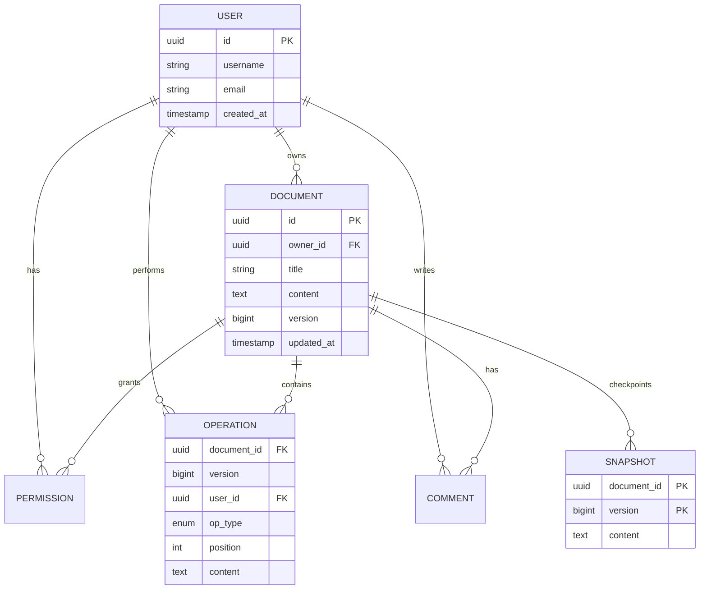
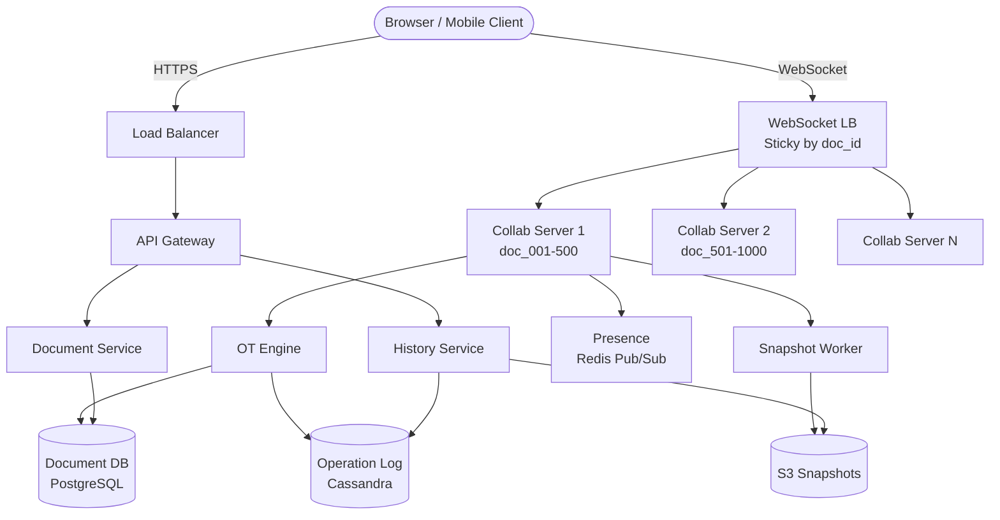
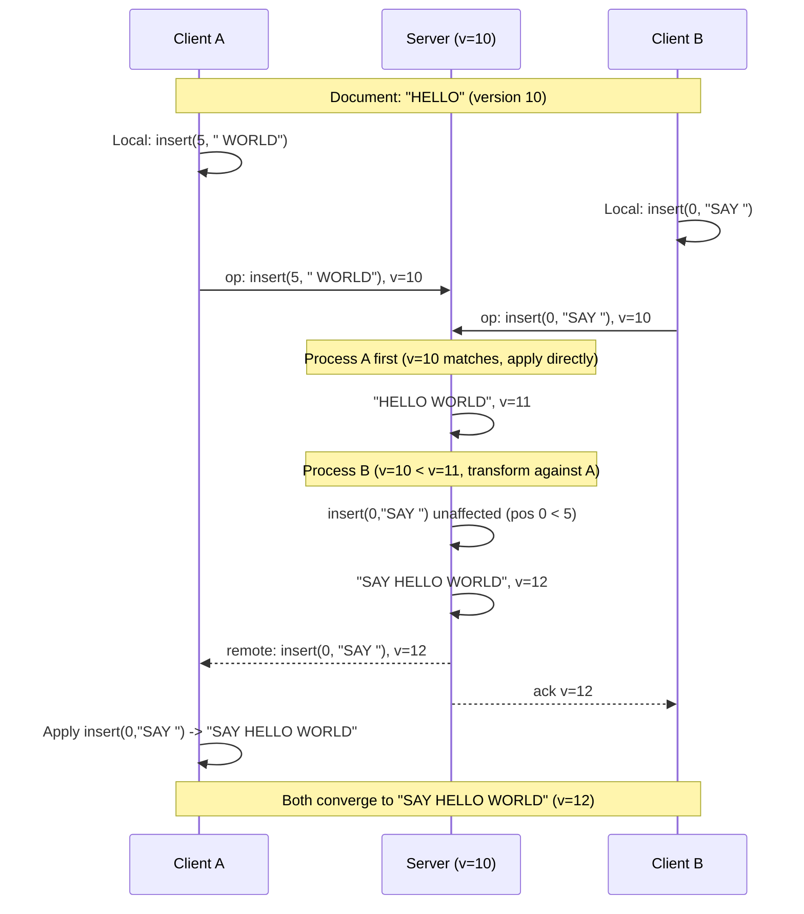
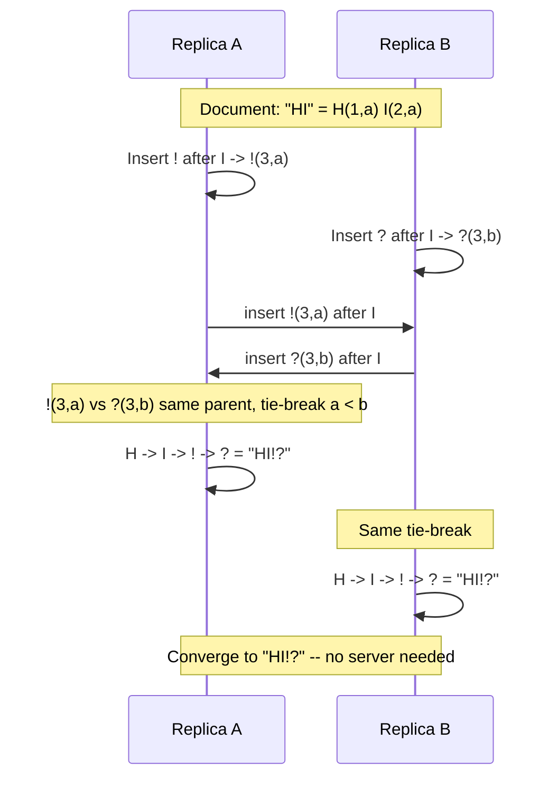
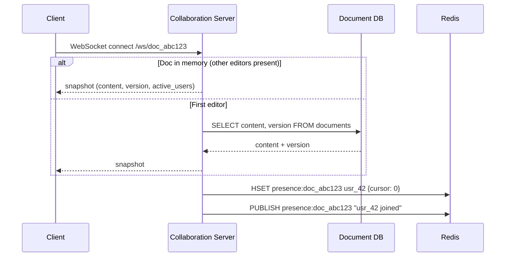
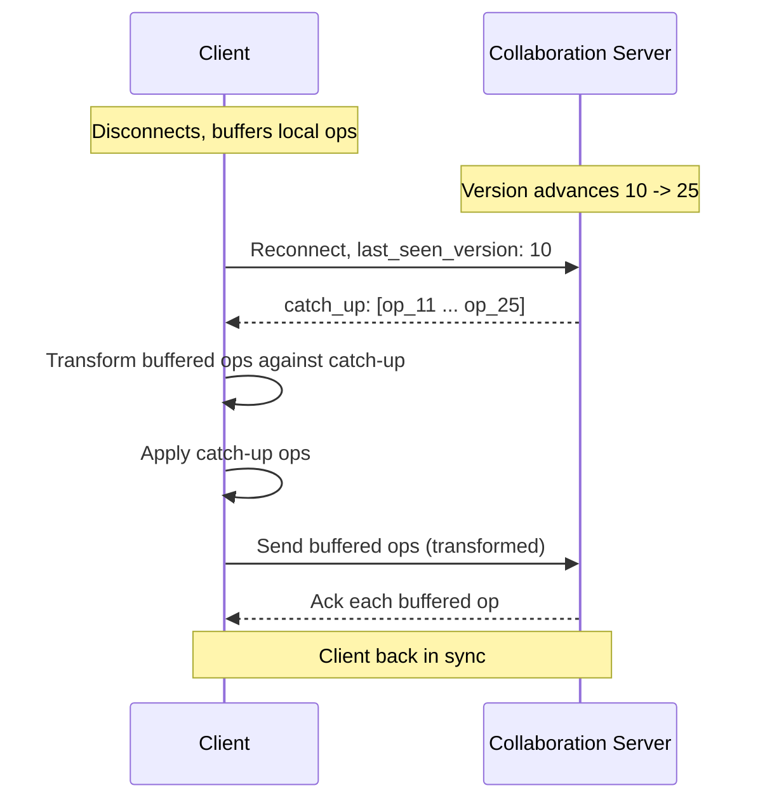

# Design Google Docs (Real-time Collaborative Editing)

> A real-time collaborative document editing platform where multiple users can simultaneously
> edit the same document with sub-100ms sync latency. The core challenge is conflict-free
> concurrent editing -- when two users type at the same position, the system must
> deterministically resolve the conflict so all clients converge to the same state.
> This requires either Operational Transformation (OT) or CRDTs.

---

## 1. Problem Statement & Requirements

Design a Google Docs-like system that allows multiple users to create, edit, and collaborate
on rich-text documents in real time. The system must handle concurrent edits from 100+
simultaneous editors, show live cursor positions, maintain version history, and support
comments and sharing permissions.

### 1.1 Functional Requirements

- **FR-1:** Create, read, update, and delete documents
- **FR-2:** Real-time collaborative editing -- multiple users editing simultaneously with changes visible within 100ms
- **FR-3:** Cursor presence -- show each collaborator's cursor position and selection
- **FR-4:** Version history -- view and restore any previous version of a document
- **FR-5:** Comments and discussions -- anchored to specific text ranges
- **FR-6:** Sharing and permissions -- view, comment, or edit access; link sharing

> **Priority for deep dive:** Real-time collaborative editing (FR-2) is the hardest problem,
> followed by cursor presence (FR-3) and version history (FR-4).

### 1.2 Non-Functional Requirements

- **Sync Latency:** < 100ms for operation propagation between collaborators
- **Consistency:** Strong eventual consistency -- all clients must converge to the same state
- **Concurrency:** Support 100+ simultaneous editors on a single document
- **Availability:** 99.9% uptime (~8.7 hours downtime/year)
- **Durability:** Zero data loss for acknowledged edits
- **Scalability:** Support 10M concurrently active documents across the platform

### 1.3 Out of Scope

- Rich text formatting engine (bold, italic, fonts)
- Offline editing and sync
- Suggestions mode (track changes)
- Spreadsheets or presentation slides
- Export to PDF/DOCX

### 1.4 Assumptions & Estimations (Back-of-Envelope Math)

```
Users
  Total users           = 500M
  DAU                   = 100M  (20%)
  Concurrent documents  = 10M   (10% of DAU have a doc open)

Edit Traffic
  Avg keystrokes/min    = 40 per active user
  Avg editors/document  = 3
  Ops/second            = 10M * 3 * 40 / 60 = ~20M ops/sec (platform-wide)
  Per-document peak     = 100 editors * 40/60 = ~67 ops/sec

Storage
  Avg document size     = 50 KB
  Documents created/day = 20M
  Daily new storage     = 20M * 50 KB = 1 TB/day
  Yearly storage        = ~365 TB/year

Operation Log
  Avg operation size    = 100 bytes
  Daily ops (8hr active)= 20M * 28,800 = 576B ops/day
  Daily op log          = 576B * 100B = ~57 TB/day (before compaction)
  After compaction      = ~5 TB/day (periodic snapshots reduce log)

WebSocket Connections
  Concurrent            = 10M docs * 3 editors = 30M connections
  Servers needed (10K/server) = 3,000 WebSocket servers
```

> **Key insight:** The system is write-heavy at the operation level (every keystroke is a
> write), but each write is tiny (100 bytes). The challenge is not throughput but ordering
> and conflict resolution across concurrent operations.

---

## 2. API Design

### 2.1 REST API (Document CRUD)

```
POST /api/v1/documents
  Request:  { "title": "Untitled Document" }
  Response: 201 { "id": "doc_abc123", "title": "...", "owner_id": "usr_42", ... }

GET /api/v1/documents/{doc_id}
  Response: 200 { "id": "doc_abc123", "content": "...", "version": 4523, ... }

DELETE /api/v1/documents/{doc_id}
  Response: 204 No Content

GET /api/v1/documents/{doc_id}/history?cursor=<cursor>&limit=20
  Response: 200 { "versions": [{ "version": 4523, "user_id": "...", "timestamp": "..." }] }

POST /api/v1/documents/{doc_id}/share
  Request:  { "user_email": "alice@example.com", "role": "editor" }
  Response: 200 { "shared": true }

POST /api/v1/documents/{doc_id}/comments
  Request:  { "anchor_start": 150, "anchor_end": 175, "text": "Rephrase this?" }
  Response: 201 { "id": "cmt_789", "resolved": false }
```

### 2.2 WebSocket API (Real-time Collaboration)

```
Connection: ws://collab.example.com/ws/documents/{doc_id}?token=<auth_token>

Client -> Server:
  { "type": "operation", "client_version": 4520,
    "operation": { "type": "insert", "position": 150, "content": "Hello" } }
  { "type": "cursor_update", "position": 155, "selection_end": 170 }

Server -> Client:
  { "type": "operation_ack", "server_version": 4521 }
  { "type": "remote_operation", "user_id": "usr_99", "server_version": 4521,
    "operation": { "type": "insert", "position": 100, "content": "World" } }
  { "type": "presence_update", "user_id": "usr_99", "cursor_position": 155, "color": "#FF5733" }
  { "type": "document_snapshot", "content": "...", "version": 4520, "active_users": [...] }
```

---

## 3. Data Model

### 3.1 Schema

**Documents Table** (PostgreSQL)

| Column       | Type         | Notes                            |
| ------------ | ------------ | -------------------------------- |
| `id`         | UUID / PK    | Snowflake-style ID               |
| `title`      | VARCHAR(255) |                                  |
| `owner_id`   | UUID / FK    | References users                 |
| `content`    | TEXT         | Latest document snapshot         |
| `version`    | BIGINT       | Monotonically increasing per doc |
| `created_at` | TIMESTAMP    |                                  |
| `updated_at` | TIMESTAMP    | Indexed                          |

**Operations Log** (Cassandra -- append-heavy)

| Column        | Type    | Notes                          |
| ------------- | ------- | ------------------------------ |
| `document_id` | UUID    | Partition key                  |
| `version`     | BIGINT  | Clustering key (ASC)           |
| `user_id`     | UUID    |                                |
| `op_type`     | ENUM    | 'insert' or 'delete'          |
| `position`    | INT     | Character position             |
| `content`     | TEXT    | Inserted text (null for delete)|
| `length`      | INT     | Deleted chars (null for insert)|
| `created_at`  | TIMESTAMP |                              |

**Permissions** | `document_id` UUID PK, `user_id` UUID PK, `role` ENUM, `granted_at` TIMESTAMP

**Comments** | `id` UUID PK, `document_id` FK, `user_id` FK, `anchor_start` INT, `anchor_end` INT, `text` TEXT, `resolved` BOOL, `parent_id` UUID

**Snapshots** | `document_id` UUID, `version` BIGINT (composite PK), `content` TEXT, `created_at` TIMESTAMP

### 3.2 ER Diagram



### 3.3 Database Choice Justification

| Requirement        | Choice        | Reason                                                    |
| ------------------ | ------------- | --------------------------------------------------------- |
| Document metadata  | PostgreSQL    | Structured, ACID for permission changes                   |
| Operation log      | Cassandra     | Append-only, high write throughput, partition by doc_id    |
| Document snapshots | S3            | Large blobs, cheap, versioned buckets                     |
| Active sessions    | Redis         | In-memory presence, pub/sub for cursor broadcasts         |

---

## 4. High-Level Architecture

### 4.1 Architecture Diagram



### 4.2 Component Walkthrough

| Component              | Responsibility                                                   |
| ---------------------- | ---------------------------------------------------------------- |
| **WebSocket LB**       | Sticky routing by doc_id -- all editors of a doc hit same server |
| **Collaboration Server** | Holds WebSocket connections, runs OT engine, broadcasts ops    |
| **OT Engine**          | Transforms concurrent ops, assigns version numbers, single-threaded per doc |
| **Presence Service**   | Tracks cursors via Redis pub/sub, broadcasts to all clients      |
| **Document Service**   | CRUD for documents, manages permissions and sharing              |
| **History Service**    | Reconstructs any version from snapshots + operation log          |
| **Snapshot Worker**    | Saves full document state every 100 versions for fast reconstruction |

> **Key decision:** Each document is assigned to exactly ONE collaboration server. This
> server is the single sequencer for OT correctness. We trade per-document horizontal
> scalability for consistency -- one server handles up to ~100 editors per document.

---

## 5. Deep Dive: Core Flows

### 5.1 Operational Transformation (OT)

OT is the algorithm Google Docs uses. When two users concurrently edit, transform one
operation against the other so both produce the same result.

#### Operations and Transform Rules

```
Primitives:  insert(position, text)  |  delete(position, length)

Example - Document: "ABCD"
  User A: insert(1, "X")  -> "AXBCD"
  User B: delete(2, 1)    -> "ABD"     (delete C)

  Naive apply A then B: "AXBCD" -> delete(2,1) removes "B" -- WRONG!
  Solution: transform B against A -> delete(3, 1)
  Correct:  "AXBCD" -> delete(3,1) -> "AXBD"

Transform rules:
  insert(a) vs insert(b): if a <= b, shift b right by len(a's text)
  insert vs delete:       if insert_pos <= delete_pos, shift delete right
  delete vs delete:       handle overlapping ranges, reduce lengths
  Same position tie-break: lower user_id goes first (deterministic)
```

#### Centralized OT Protocol

```
1. Server maintains authoritative state + monotonic version counter
2. Client applies edits locally immediately (optimistic)
3. Client sends operation with last-seen server version
4. Server transforms incoming op against ops since client's version
5. Server applies, increments version, broadcasts to other clients
6. Receiving clients transform against their pending local ops before applying
```

#### OT Conflict Resolution Flow



### 5.2 CRDT (Conflict-free Replicated Data Types)

CRDTs are an alternative (used by Figma, Yjs). No central server needed -- operations
are commutative and convergent by design.

#### RGA (Replicated Growable Array)

```
Every character gets a unique, globally ordered ID = (lamport_timestamp, replica_id)

Document: "ABC" -> A(1,r1), B(2,r1), C(3,r1)

r1 inserts "X" after A: X(4,r1), parent=A -> A -> X -> B -> C
r2 inserts "Y" after A: Y(4,r2), parent=A -> conflict!

Resolution: same timestamp, tie-break by replica_id
  If r1 < r2: order is A -> X -> Y -> B -> C
  Deterministic -- all replicas converge without coordination.

Deletes use tombstones (mark as deleted, never remove):
  Delete X: A -> X(tombstone) -> B -> C  (visible: "ABC")
  Why? Concurrent inserts "after X" need the reference point.
  Garbage collected when all replicas have seen the tombstone.
```

#### CRDT Concurrent Editing Flow



### 5.3 OT vs CRDT Comparison

| Aspect              | OT                              | CRDT                                  |
| ------------------- | ------------------------------- | ------------------------------------- |
| Central server      | Required (single sequencer)     | Not required (peer-to-peer possible)  |
| Consistency         | Strong (server is truth)        | Strong eventual (convergent)          |
| Complexity          | Transform functions are tricky  | Data structure complex but provable   |
| Memory overhead     | Low (compact operations)        | Higher (tombstones, character IDs)    |
| Offline support     | Hard (needs server)             | Natural (apply locally, sync later)   |
| Scalability per doc | Limited by single server        | No central bottleneck                 |
| Production users    | Google Docs, MS Office Online   | Figma, Yjs, Automerge                 |
| Best for            | Centralized systems             | Decentralized / offline-first         |

### 5.4 Cursor/Presence Sync

```
Presence data per user per document (stored in Redis hash):
  HSET presence:doc_abc123 usr_42 '{cursor: 150, selection_end: 175, color: "#FF5733"}'
  Broadcast via Redis Pub/Sub channel: presence:doc_abc123

Cursor adjustment on remote operations:
  Remote insert(50, "Hello") -- 5 chars at position 50:
    if cursor.position > 50: cursor.position += 5
  Remote delete(50, 3):
    if cursor.position > 53: cursor.position -= 3
    elif cursor.position > 50: cursor.position = 50  (collapse to delete point)

Throttling:
  Client: max 10 cursor updates/sec (100ms debounce)
  Server: batch broadcasts every 50ms
  Stale: mark idle after 5 minutes, remove after WebSocket disconnect + 10s grace
```

### 5.5 Version History

```
Snapshot + Operation Log strategy:

Snapshots: full document saved every 100 operations (stored in S3)
Operation log: every individual op in Cassandra, partitioned by doc_id

Reconstruct version V:
  1. Find nearest snapshot at version S where S <= V
  2. Fetch ops from S+1 to V from Cassandra
  3. Replay ops on snapshot -> document at version V
  Example: version 450 = snapshot@400 + replay 50 ops (fast)

Named versions (UI grouping):
  Same user within 30 seconds -> grouped as one entry
  Different user -> new entry
  Explicit "Name this version" -> creates a bookmark

Compaction (ops older than 30 days):
  Ensure snapshot exists -> delete individual ops
  Keep snapshots at regular intervals for historical access
```

### 5.6 Document Storage

```
Two representations maintained:

1. In-Memory (Collaboration Server): live document for real-time OT
   - All operations applied here first, sub-100ms latency
   - Periodically flushed to PostgreSQL (every 1-5 seconds)

2. PostgreSQL (Durable): latest snapshot for initial document load
   - Source of truth when no collaboration server has the doc in memory
   - Updated in batches, not on every keystroke
```



---

## 6. Scaling & Performance

### 6.1 Partitioning by Document ID

```
One document = one collaboration server (required for OT ordering)

Partition assignment: consistent hashing on doc_id, stored in ZooKeeper/etcd
WebSocket LB reads partition map and routes connections

Capacity per server:
  10,000 WebSocket connections, ~500 active documents
  500 docs * 67 ops/sec = ~33K OT operations/sec per server

Cluster sizing:
  10M concurrent docs / 500 per server = 20,000 collaboration servers
  With 2x failover headroom = ~40,000 servers
```

### 6.2 Sticky Routing

```
All editors of a document MUST connect to the same collaboration server.
The OT engine requires a single sequencer per document.

WebSocket LB extracts doc_id from URL -> looks up assigned server in etcd -> routes

Failover: if server dies, docs reassigned to healthy servers.
New server loads state from PostgreSQL + replays recent ops from Cassandra.
Clients reconnect (exponential backoff). Recovery: 1-5 seconds.
```

### 6.3 Database Scaling

```
PostgreSQL: sharded by doc_id (64 shards), read replicas for listing queries
Cassandra:  partition by doc_id, cluster by version. RF=3, QUORUM writes. Handles 20M ops/sec
Redis:      50+ node cluster, partitioned by doc_id. ~30M sessions * 500B = ~15 GB
```

---

## 7. Reliability & Fault Tolerance

### 7.1 Operation Log as Source of Truth

Every operation is written to Cassandra (QUORUM) BEFORE acknowledgment to client.
In-memory state is reconstructable by replaying from the latest snapshot.
Unlogged operations (server crash mid-write) are retried by the client (no ack received).

### 7.2 Reconnection and Catch-up



If too many ops missed (>1000): server sends full snapshot, client resets.

### 7.3 Single Points of Failure

| Component            | SPOF? | Mitigation                                               |
| -------------------- | ----- | -------------------------------------------------------- |
| WebSocket LB         | Yes   | Active-passive pair, DNS failover                        |
| Collaboration Server | Yes*  | *Per-document. Reassigned on failure, state from op log  |
| PostgreSQL           | Yes   | Synchronous standby, Patroni failover, RPO=0            |
| Cassandra            | No    | 3x replication, quorum writes, auto repair               |
| Redis                | No    | Cluster with replicas. Presence is ephemeral, rebuildable|
| S3                   | No    | 11 nines durability                                      |

### 7.4 Graceful Degradation

```
Collab server fails:  Clients reconnect to new server (1-5s), state rebuilt from op log
Cassandra slow:       Server buffers ops in memory + local WAL, writes async. Risk: crash = loss
Redis down:           Cursors freeze, editing continues (OT independent of presence)
PostgreSQL down:      Can't open new docs; active docs in memory keep working
```

---

## 8. Trade-offs & Alternatives

| Decision                     | Chosen                          | Alternative                | Why Chosen                                               |
| ---------------------------- | ------------------------------- | -------------------------- | -------------------------------------------------------- |
| OT vs CRDT                   | OT (centralized)                | CRDT (Yjs/Automerge)       | Server control, lower memory, proven at Google scale     |
| Centralized vs decentralized | 1 server per doc                | Peer-to-peer               | Simpler consistency; P2P needs CRDT                      |
| Op log storage               | Cassandra                       | Kafka / PostgreSQL          | High write throughput, partition by doc_id               |
| Snapshot frequency            | Every 100 versions              | Every op / every 1000       | Max 100 ops to replay vs storage cost                    |
| Real-time transport          | WebSocket                       | Long polling / SSE           | Bidirectional, sub-100ms, single connection               |
| Doc state                    | In-memory + DB                  | DB only                    | DB adds 5-10ms/op -- unacceptable for real-time          |
| Presence transport           | Redis Pub/Sub                   | Direct WS broadcast         | Decoupled from collab server, survives migration         |
| Version granularity          | Per-op + grouped in UI          | Per-save                    | Full fidelity in storage, friendly grouping for users    |

---

## 9. Interview Tips

### How to Present in 45 Minutes

```
[0-5 min]   Requirements: "Real-time collab is the focus." 20M ops/sec, 30M WS connections.
[5-10 min]  API: REST for CRUD, WebSocket for ops. Documents, ops log, permissions.
[10-30 min] Deep dive: OT with concrete example. Sequence diagram. CRDT as alternative.
[30-40 min] Scaling: "1 doc = 1 server." Sticky routing. Op log as source of truth.
[40-45 min] Trade-offs: OT vs CRDT. Centralized vs decentralized.
```

### Key Insights That Impress Interviewers

1. **OT vs CRDT is the centerpiece.** Walk through the transform function with a concrete
   example. Knowing both shows breadth; explaining the math shows depth.

2. **"One doc = one server" is the key insight.** OT requires a single sequencer. This is
   a deliberate trade-off: per-document scalability limited to ~100 editors for correctness.

3. **Quantify WebSocket scale.** 30M connections at 10K/server = 3,000 servers. Real-time
   systems scale differently than request-response systems.

4. **Snapshots + op log for version history.** Checkpoint every 100 ops, reconstruct by
   replaying max 100 ops. Shows practical systems thinking.

5. **Cursor positions need OT too.** Remote inserts shift all cursor positions -- a subtle
   detail that demonstrates full understanding.

### Common Follow-up Questions

**Q: Two users type at the same position?**
A: OT tie-breaks by user_id (lower ID goes first). Deterministic -- all clients converge.

**Q: Why not CRDTs?**
A: CRDTs have higher memory (unique char IDs + tombstones) and more network overhead.
But for a new system, CRDTs (Yjs) are increasingly preferred. Figma uses them successfully.

**Q: 1,000 simultaneous editors?**
A: Hit server limits. Options: cap editors, partition doc into sections with separate OT
engines, or switch to CRDT. Google caps at ~100 editors in practice.

**Q: Collaboration server crashes?**
A: Clients disconnect 1-5s. WebSocket LB reassigns doc. New server rebuilds from PostgreSQL
snapshot + Cassandra op replay. Clients reconnect with catch-up protocol.

**Q: How do comments survive edits?**
A: Comment anchors adjusted using same transform logic as cursors. If anchored text deleted,
comment becomes orphaned and shown at nearest surviving position.

---

> **Checklist:**
>
> - [x] Requirements: 6 functional, 6 non-functional, 5 out-of-scope
> - [x] Estimations: 20M ops/sec, 30M WS connections, ~365 TB/year
> - [x] Architecture diagram with collaboration servers, OT engine, presence
> - [x] Deep dive: OT with transform rules + conflict resolution sequence diagram
> - [x] CRDT alternative with RGA and tombstones + sequence diagram
> - [x] OT vs CRDT comparison table (8 dimensions)
> - [x] Cursor presence sync with position adjustment
> - [x] Version history: snapshots + op log + compaction
> - [x] Scaling: partition by doc_id, sticky routing
> - [x] SPOFs identified with mitigation
> - [x] 8 trade-offs with reasoning
> - [x] Interview tips with timing, Q&A, key insights
