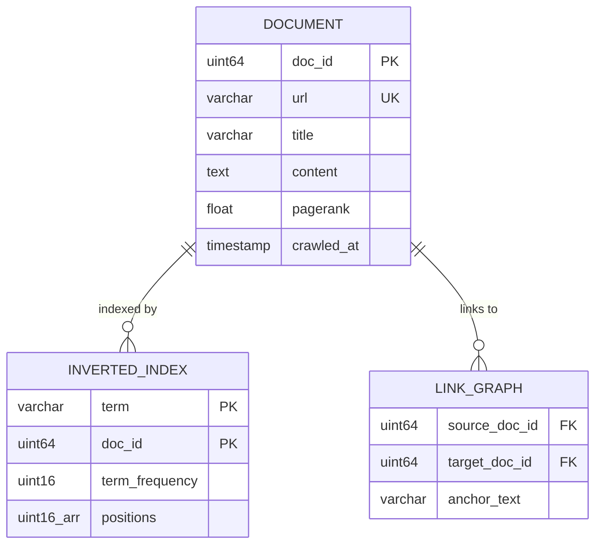
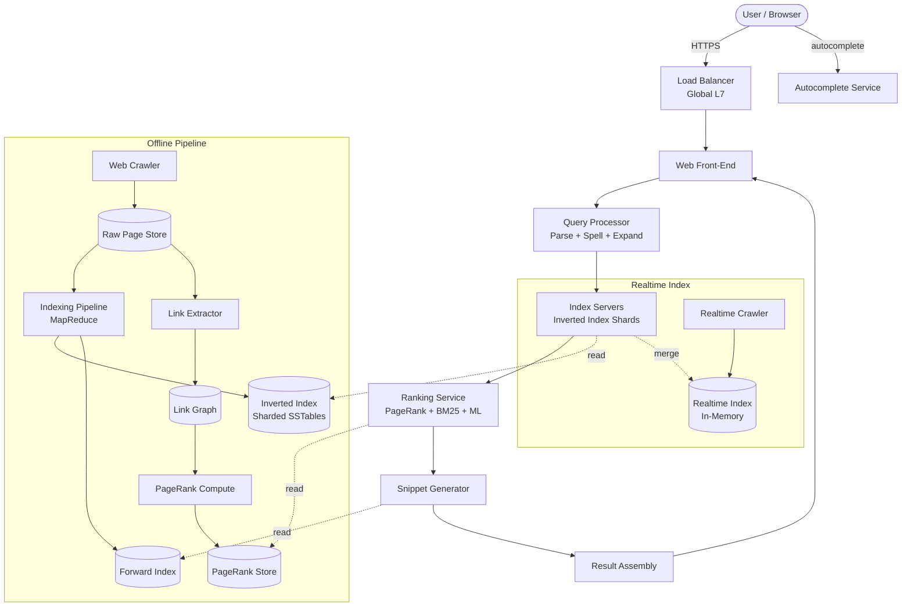
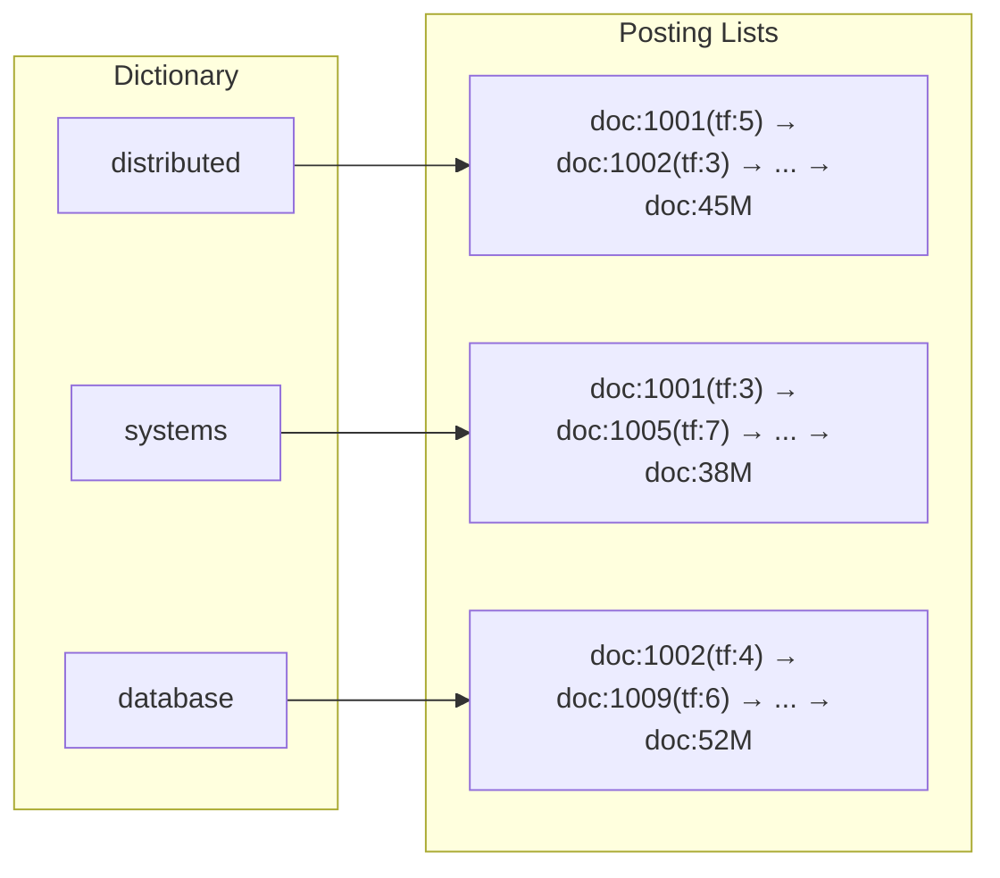
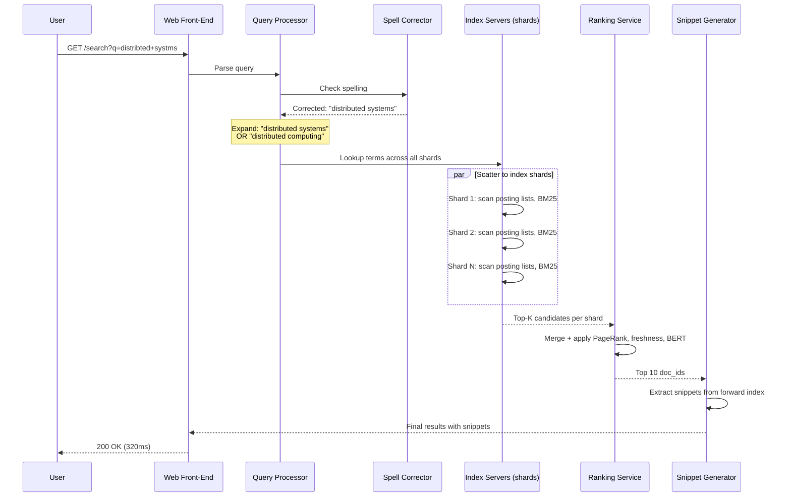
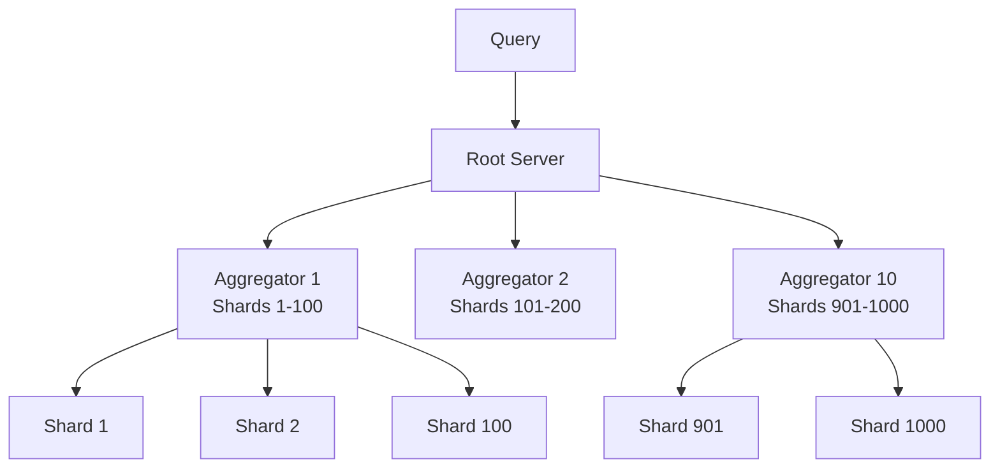

# Design Google Search

> A web-scale search engine that crawls, indexes, and ranks billions of web pages to
> return the most relevant results within milliseconds. The core challenges are building
> a massive inverted index, ranking with hundreds of signals (PageRank, BM25, BERT),
> and serving billions of queries per day with sub-500ms latency.

---

## 1. Problem Statement & Requirements

Design a web search engine that allows users to enter a text query and receive a ranked
list of relevant web pages. The system must crawl the web continuously, build and maintain
an index of 100B+ pages, and serve results with low latency at massive scale.

### 1.1 Functional Requirements

- **FR-1: Web Search** -- User submits a query and receives a ranked list of results (title, URL, snippet).
- **FR-2: Autocomplete** -- Suggest popular query completions as the user types in real time.
- **FR-3: Spell Correction** -- Detect misspelled queries and suggest/auto-correct ("Did you mean...").
- **FR-4: Snippet Generation** -- Display a relevant text excerpt with query terms highlighted per result.
- **FR-5: Vertical Search Tabs** -- Switch between Web, Images, Videos, News, and Maps result types.
- **FR-6: Knowledge Panels** -- For entity queries, show a structured information card alongside results.

> **Priority for deep dive:** Inverted index construction, query processing pipeline,
> and PageRank/ranking signals are the hardest problems.

### 1.2 Non-Functional Requirements

- **Latency:** p99 search response < 500ms, autocomplete < 100ms
- **Scale:** 100B+ indexed pages, 8.5B searches/day
- **Availability:** 99.99% uptime (< 52 min downtime/year)
- **Freshness:** Breaking news indexed within minutes, general pages within hours to days
- **Consistency:** Eventual -- index updates propagate gradually

### 1.3 Out of Scope

- Ads ranking and auction system
- Personalization ML models (user-specific ranking beyond location/language)
- SafeSearch / content moderation pipelines
- Google Assistant / voice search integration

### 1.4 Assumptions & Estimations (Back-of-Envelope Math)

```
Query Traffic
  Searches per day          = 8.5 B
  QPS                       = 8.5B / 86,400 ~ 100,000 QPS
  Peak QPS (3x)             = ~300,000 QPS

Index Scale
  Total indexed pages       = 100 B
  Avg page size (raw HTML)  = 100 KB
  Raw crawled data          = 100B * 100 KB = 10 PB
  Avg indexed doc size      = 2 KB (after extraction, compression)

Inverted Index
  Unique terms              = ~1 B (after stemming, normalization)
  Avg posting list length   = 10,000 doc IDs per term
  Posting entry size        = 12 bytes (doc_id + position + freq)
  Inverted index size       = 1B * 10,000 * 12 B = 120 TB
  With compression (~4x)    = ~30 TB

PageRank Storage
  100B pages * 8 bytes      = 800 GB (fits in memory across cluster)

Bandwidth
  Avg response size         = 50 KB (10 results with snippets)
  Outgoing bandwidth        = 100K QPS * 50 KB = 5 GB/s

Storage Summary
  Crawled data (raw)        = ~10 PB
  Inverted index            = ~30 TB (compressed)
  Forward index (docs)      = ~200 TB
  PageRank scores           = ~800 GB
```

> **Key insight:** The system is fundamentally read-heavy. Writes (index updates) happen
> offline in batch/streaming pipelines. This separation of the serving path (online) from
> the indexing path (offline) is the critical architectural decision.

---

## 2. API Design

```
GET /api/v1/search?q=<query>&page=1&type=web&lang=en&region=us
  Response: 200 OK
    {
      "query": "distributed systems",
      "corrected_query": null,
      "did_you_mean": null,
      "total_results": 1420000000,
      "time_ms": 320,
      "knowledge_panel": { "title": "...", "description": "...", "source": "Wikipedia" },
      "results": [
        {
          "rank": 1,
          "title": "Distributed Systems - Wikipedia",
          "url": "https://en.wikipedia.org/wiki/Distributed_computing",
          "snippet": "A <b>distributed system</b> is a system whose components...",
          "favicon": "https://en.wikipedia.org/favicon.ico",
          "published_date": "2026-02-15"
        }
      ],
      "pagination": { "current_page": 1, "next_page": "...&page=2" }
    }

GET /api/v1/autocomplete?q=<prefix>&lang=en&region=us
  Response: 200 OK
    {
      "prefix": "distrib",
      "suggestions": [
        "distributed systems",
        "distributed computing",
        "distributed database"
      ]
    }
```

> **Rate Limiting:** Public API rate-limited by IP address. Automated scraping beyond
> 100 QPS/IP triggers CAPTCHA challenges.

---

## 3. Data Model

### 3.1 Schema

**Forward Index** -- processed content of each crawled page.

| Field            | Type          | Notes                                  |
| ---------------- | ------------- | -------------------------------------- |
| `doc_id`         | UINT64 / PK   | Unique document identifier             |
| `url`            | VARCHAR(2048) | Canonical URL                          |
| `title`          | VARCHAR(512)  | Extracted `<title>` tag                |
| `content`        | TEXT          | Cleaned body text (HTML stripped)      |
| `pagerank`       | FLOAT         | Pre-computed PageRank score            |
| `crawled_at`     | TIMESTAMP     | Last successful crawl time             |
| `content_hash`   | UINT64        | SimHash for near-duplicate detection   |

**Inverted Index** -- maps terms to documents containing them.

| Field            | Type          | Notes                                  |
| ---------------- | ------------- | -------------------------------------- |
| `term`           | VARCHAR(100)  | Normalized, stemmed token              |
| `doc_id`         | UINT64        | Reference to forward index             |
| `term_frequency` | UINT16        | Times the term appears in this doc     |
| `positions`      | UINT16[]      | Word positions for phrase queries      |
| `field`          | ENUM          | title / body / anchor / url            |

**Link Graph** -- hyperlink structure for PageRank.

| Field            | Type          | Notes                                  |
| ---------------- | ------------- | -------------------------------------- |
| `source_doc_id`  | UINT64        | Page containing the link               |
| `target_doc_id`  | UINT64        | Page being linked to                   |
| `anchor_text`    | VARCHAR(255)  | Text of the hyperlink                  |

### 3.2 ER Diagram



### 3.3 Storage Choice Justification

| Requirement            | Choice                     | Reason                                                  |
| ---------------------- | -------------------------- | ------------------------------------------------------- |
| Forward index          | Custom SSTable / column store | Optimized batch reads, compressed storage             |
| Inverted index         | Custom SSTable             | Sorted posting lists, variable-byte encoding, mmap      |
| Link graph             | Bigtable / distributed KV  | Sparse wide rows, efficient adjacency scans             |
| PageRank scores        | In-memory (distributed)    | ~800 GB across cluster, sub-ms lookup required          |
| Autocomplete trie      | In-memory (Redis / custom) | p99 < 100ms requires in-memory prefix lookup            |
| Crawl metadata         | Bigtable                   | Billions of URLs, high write throughput                  |

---

## 4. High-Level Architecture

### 4.1 Architecture Diagram



### 4.2 Component Walkthrough

| Component              | Responsibility                                                         |
| ---------------------- | ---------------------------------------------------------------------- |
| **Load Balancer**      | Global L7 routing, TLS termination, geo-routing to nearest DC          |
| **Web Front-End**      | Orchestrates search pipeline, assembles final response                 |
| **Query Processor**    | Parses query, spell correction, query expansion, synonym resolution    |
| **Index Servers**      | Look up terms in inverted index, return matching doc IDs with BM25     |
| **Ranking Service**    | Combines PageRank, BM25, freshness, ML scores for final ranking        |
| **Snippet Generator**  | Extracts relevant text from forward index around query terms           |
| **Web Crawler**        | Fetches pages, respects robots.txt, schedules recrawls by priority     |
| **Indexing Pipeline**  | Tokenize, stem, build inverted index, compute document features        |
| **PageRank Compute**   | Iterative graph algorithm computing authority scores for all pages     |
| **Realtime Indexer**   | Indexes breaking/fresh content within minutes                          |

---

## 5. Deep Dive: Core Flows

### 5.1 Web Crawling

> For full crawler deep dive, see `../13-web-crawler.md`.

```
Crawl Scheduling & Freshness:
  News/trending domains:    every 5-15 minutes
  High-PageRank pages:      every 1-4 hours
  Medium-importance pages:  every 1-7 days
  Low-priority / static:    every 2-4 weeks
  Dead pages (404/410):     retry 3x, then remove from index

Near-Duplicate Detection (SimHash):
  - Compute locality-sensitive hash per page
  - Pages with Hamming distance < 3 bits = near-duplicates
  - Keep canonical version (highest PageRank), discard duplicates
```

### 5.2 Inverted Index

The inverted index is the heart of the search engine -- mapping every unique term to
the list of documents containing it.

#### Structure

```
Term: "distributed"  |  Document Frequency: 45,000,000

Posting List:
  [ {doc:1001, tf:5, pos:[12,45,89,102,200], field:body},
    {doc:1002, tf:3, pos:[1,34,78],           field:title},
    {doc:1003, tf:1, pos:[250],               field:body},
    ... (45 million entries) ]
```



#### Building the Index

```
Raw HTML → Content Extraction → Tokenization → Normalization → Index Build

1. Content Extraction: Strip HTML/JS/CSS. Extract title, headings, body, meta.
2. Tokenization: Split on whitespace/punctuation. Handle URLs, emails, numbers.
3. Normalization:
   - Lowercasing: "Distributed" → "distributed"
   - Stemming (Porter): "running" → "run", "systems" → "system"
   - Stop word removal: "the", "is", "at" (but keep for phrase queries)
   - Unicode normalization, accent folding
4. Index Build (MapReduce):
   - Map: emit (term, doc_id, tf, positions) per term per document
   - Shuffle: group by term
   - Reduce: build sorted posting list per term → output SSTables
```

#### Index Compression

```
Variable-Byte Encoding (VByte):
  Store doc_id gaps (deltas) instead of absolute IDs:
    doc_ids [1001, 1005, 1012, 1013] → gaps [1001, 4, 7, 1]
  Small gaps encode in 1 byte; larger gaps in 2-4 bytes.
  7 data bits per byte + 1 continuation bit.

PForDelta (Patched Frame-of-Reference):
  Most gaps encoded with fixed bit width; exceptions patched separately.
  SIMD-friendly: decode 128 integers in one CPU instruction batch.

Block-based compression:
  Posting list split into blocks of 128 doc_ids.
  Each block independently compressed → enables skip pointers.
  Skip to block N without decompressing blocks 0..N-1.

Result: 120 TB uncompressed → ~30 TB compressed (4x reduction)
```

### 5.3 Query Processing Pipeline



#### Latency Budget

```
Total budget: 500ms (p99)
  Query parsing + spell correction:     20ms
  Index lookup (scatter to shards):    150ms
  Merge + PageRank + ML re-ranking:    100ms
  Snippet generation:                   80ms
  Network overhead (internal RPCs):     70ms
  Result assembly + serialization:      30ms
```

### 5.4 PageRank

PageRank measures page "authority" based on the web's link structure.

#### The Random Surfer Model

```
A surfer starts at a random page and follows links randomly:
  - With probability d=0.85, click a random outbound link
  - With probability 0.15, teleport to a completely random page

Formula:
  PR(p) = (1-d)/N + d * SUM( PR(q) / L(q) )  for all q linking to p

  PR(p) = PageRank of page p, d = 0.85, N = total pages, L(q) = outlinks from q

A page has high PageRank if many high-PageRank pages link to it.
```

#### Iterative Computation

```
Algorithm (Power Iteration):
  1. Initialize: PR(p) = 1/N for all pages
  2. Repeat 50-100 iterations until convergence:
     For each page p: PR_new(p) = (1-d)/N + d * SUM(PR_old(q)/L(q))
  3. Distributed via MapReduce:
     - Map: emit (target, PR(source)/outlinks(source)) per link
     - Reduce: sum contributions per target, apply damping
     - One MapReduce job = one iteration
  4. Scale: 100B pages, ~1T edges, ~500 TB I/O per full recomputation
     Full recompute weekly, incremental updates daily.

Edge Cases:
  - Dangling pages (no outlinks): redistribute their PR equally to all pages
  - Spider traps (self-linking loops): damping factor ensures 15% teleport-out
  - Link spam: mitigated by TrustRank (propagate trust from known-good seeds)
```

### 5.5 Ranking Signals

```
Classic Signals:
  1. PageRank -- link authority, pre-computed offline
  2. BM25 -- improved TF-IDF with term saturation and length normalization
     Score(q,d) = SUM: IDF(t) * (tf*k1+1) / (tf + k1*(1 - b + b*|d|/avgdl))
     k1=1.2, b=0.75. Resists keyword-stuffing (TF saturates)
  3. Freshness -- recency of page, weighted by Query-Deserves-Freshness classifier
  4. Field weights -- title match: 10x, anchor text: 8x, URL: 5x, headings: 3x

Modern ML Signals:
  5. BERT/Transformer relevance -- semantic understanding, not just keywords
     Input: [CLS] query [SEP] passage [SEP] → relevance score (0-1)
     Captures negation, intent, context that keyword matching misses
  6. User engagement -- CTR, dwell time, pogo-sticking (aggregated, not per-user)
  7. Page quality -- Core Web Vitals, mobile-friendliness, HTTPS

Two-Phase Ranking Pipeline:
  Phase 1 (Index Servers): BM25 narrows 100B docs → ~10K-50K candidates (cheap)
  Phase 2 (Ranking Service): PageRank + BERT re-ranks top candidates (expensive)
  Why? BERT is 1000x slower than BM25. Running it on 100B docs is impossible.
```

### 5.6 Snippet Generation

```
Algorithm:
  1. Retrieve document text from forward index
  2. Find all query term occurrences
  3. Score candidate passages (150-300 chars) by:
     - Term density (how many query terms in passage)
     - Coverage (are all query terms present?)
     - Position (prefer near document start)
  4. Select highest-scoring passage, highlight terms with <b> tags

Fallbacks:
  - If query terms only in title/anchor: use <meta description>
  - Structured data (schema.org FAQ/How-to): use for rich snippets
  - Cache snippets for popular queries (~30-40% hit rate)
```

### 5.7 Spell Correction

```
Approach 1: Edit Distance -- find dictionary words within Levenshtein distance 1-2
Approach 2: N-gram similarity -- bigram/trigram overlap with dictionary words
Approach 3: Query Log Mining (primary method at Google scale)
  - "distribted systems" searched 50 times, followed by "distributed systems" 45 times
  - Learn corrections from user session behavior
  - Handles proper nouns, brand names, evolving language automatically

Combined Pipeline:
  1. High-frequency query in logs → no correction needed
  2. Low frequency → generate candidates from all three approaches
  3. Rank by: language model probability, query log frequency, edit distance
  4. High confidence: auto-correct. Medium: "Did you mean?". Low: no correction.

Noisy Channel Model:
  P(correction | misspelling) ∝ P(misspelling | correction) * P(correction)
  Error model (keyboard distance, common typos) × Language model (query frequency)
```

---

## 6. Scaling & Performance

### 6.1 Index Sharding

```
Document-Based Sharding (used in practice):
  Each shard holds the complete inverted index for a subset of documents.
  100B docs / 1000 shards = 100M docs per shard → ~30 GB index (fits in RAM)

  Pros: easy rebalancing, uniform load, independent shard consistency
  Cons: every query hits every shard (high fan-out)

  vs. Term-Based Sharding:
  Pros: query only hits shards for query terms (low fan-out)
  Cons: hot terms ("the") create hot shards, cross-shard intersection for multi-term

  Google's choice: document-based with extensive replication.
```

### 6.2 Replication & Distributed Query

```
Each shard replicated 3-5 times across data centers:
  Shard 1: Replica A (DC-East), B (DC-West), C (DC-EU)
  Total: 1000 shards * 5 replicas = 5000 index servers

Tree-Structured Aggregation:
  Root → 10 Tier-1 aggregators → 100 shards each
  Each shard returns top-100 → Tier-1 merges to top-1000 → Root merges to top-10K
  Ranking service re-scores → final top-10

Latency control:
  150ms timeout per shard. If 5% timeout, return results from 95%.
  Missing 50 of 1000 shards = missing ~0.1% of index. Unnoticeable.
```



### 6.3 Caching Strategy

```
Level 1: Result Cache (front-end)
  Full results for popular queries. TTL: 5 min. Hit rate: ~30%.
Level 2: Posting List Cache (index servers)
  Decompressed posting lists for frequent terms. In-memory LRU. Hit rate: ~70%.
Level 3: Snippet Cache
  Pre-generated snippets for popular (query, doc_id) pairs. Hit rate: ~40%.

Impact: L1 absorbs ~210K of 300K peak QPS. Each index server handles ~18 QPS.
```

---

## 7. Reliability & Fault Tolerance

### 7.1 Single Points of Failure

| Component         | SPOF? | Mitigation                                              |
| ----------------- | ----- | ------------------------------------------------------- |
| Load Balancer     | Yes   | Anycast IP, multiple global LBs, DNS failover           |
| Web Front-End     | No    | Stateless, hundreds of instances, auto-scaling           |
| Index Servers     | No    | 3-5 replicas per shard across data centers               |
| Ranking Service   | No    | Stateless, reads from replicated PageRank store          |
| Forward Index     | No    | Replicated; degrade (skip snippets) if unavailable       |
| Crawler           | No    | Distributed, idempotent jobs, automatic retry            |
| Indexing Pipeline  | No    | MapReduce with checkpointed state, automatic retry       |

### 7.2 Graceful Degradation

```
Ranking service overloaded → skip ML re-ranking, serve BM25-only results
Snippet generation slow    → show title + URL, or cached meta description
Autocomplete down          → search still works, just no suggestions
Realtime index unavailable → serve from main index (hours stale, acceptable)
Knowledge panel down       → omit panel, core results unaffected
Shard timeout              → return results from remaining shards (partial but fast)
```

### 7.3 Index Updates & Freshness

```
Index serving uses atomic segment swaps:
  - New index segments built offline, shipped to all replicas
  - Atomic cutover: old segment → new segment simultaneously
  - Rollback possible by reverting to previous segment

Realtime index fills the freshness gap:
  - In-memory index for pages crawled in the last few hours
  - Merged with main index results at query time
  - Periodically folded into the next batch index build
```

---

## 8. Trade-offs & Alternatives

| Decision                    | Chosen                        | Alternative              | Why Chosen                                                              |
| --------------------------- | ----------------------------- | ------------------------ | ----------------------------------------------------------------------- |
| Index sharding              | Document-based                | Term-based               | Simpler rebalancing, uniform load; term-based creates hot shards        |
| Freshness strategy          | Tiered (realtime + batch)     | Batch-only               | Breaking news needs minutes-fresh index; batch means hours of staleness |
| Recall vs precision         | High precision                | High recall              | Users judge top-10 quality; 1M mediocre results is useless              |
| Relevance scoring           | BM25                          | TF-IDF                   | BM25 has TF saturation and length normalization; resists stuffing       |
| ML ranking                  | Two-phase (BM25 → BERT)       | BERT on all docs          | BERT is 1000x slower; only affordable on top-K candidates              |
| Snippet source              | Dynamic (query-dependent)     | Static (meta description) | Dynamic shows exact matching passage; static misses query context       |
| PageRank schedule           | Weekly full + daily incremental| Realtime per-page         | Full graph iteration inherently batch; incremental handles new pages   |
| Spell correction            | Query-log mining              | Dictionary-only           | Logs capture names, brands, new terms; dictionaries are static          |
| Storage engine              | Custom SSTable                | Elasticsearch             | At 100B+ docs, off-the-shelf cannot match custom performance            |
| Consistency model           | Eventual                      | Strong                   | Search tolerates seconds/minutes of staleness                            |

---

## 9. Interview Tips

### How to Present in 45 Minutes

```
[0-5 min]   Requirements & estimations
            - 100K QPS, 100B pages, 30TB inverted index
            - Read-heavy system with offline indexing

[5-10 min]  API + data model
            - GET /search?q=query&page=1&type=web
            - Forward index, inverted index, link graph

[10-30 min] Architecture + deep dives
            - Draw two-path architecture: offline pipeline + serving path
            - Inverted index: building, compression, sharding
            - Query pipeline: BM25 → PageRank → BERT re-ranking
            - PageRank: random surfer, iterative computation

[30-40 min] Scaling & reliability
            - 1000 shards, 5 replicas, tree-structured aggregation
            - Multi-level caching (L1 absorbs 70% of queries)

[40-45 min] Trade-offs: freshness vs completeness, recall vs precision
```

### Key Insights That Impress Interviewers

1. **Separate offline from online.** Immediately splitting into indexing pipeline and
   serving path shows deep understanding.
2. **Know inverted index internals.** Posting lists, variable-byte encoding, skip pointers,
   block compression. This is what makes search possible.
3. **Two-phase ranking.** BM25 narrows 100B to 10K cheaply. BERT refines top-K expensively.
   Explain why you cannot run BERT on all documents.
4. **Quantify the index.** "100B pages, 1B terms, 30TB compressed, 1000 shards, 5 replicas."
5. **PageRank is necessary but not sufficient.** Explain the algorithm, then note modern
   search uses hundreds of signals. PageRank alone is easily gamed (link farms).

### Common Follow-up Questions

**Q: How do you handle breaking news queries?**
A: Realtime index (in-memory) indexes pages within minutes. Query-Deserves-Freshness
classifier detects time-sensitive queries and boosts realtime index weight.

**Q: How do you prevent SEO spam?**
A: TrustRank (propagate trust from seed sites), content quality detection (thin content,
keyword stuffing), link spam pattern detection, manual penalties.

**Q: What if a query matches 50 billion documents?**
A: Never scan all 50B. Posting lists sorted by impact score; early termination when adding
more docs won't change top-K. Plus tree aggregation limits per-shard work.

**Q: What happens when a shard goes down mid-query?**
A: 150ms timeout. Results from remaining 999 shards returned. Missing 1 of 1000 shards =
~0.1% of index missing. User won't notice.

### Common Pitfalls

- **Don't start with "just use Elasticsearch."** Explain the principles first.
- **Don't forget the offline pipeline.** Crawling and indexing are half the system.
- **Don't conflate indexing with serving.** Different architectures, scaling, failure modes.
- **Don't say "compute PageRank in real time."** It requires 50-100 iterations over the
  entire link graph. Inherently batch.
- **Don't ignore compression.** 120TB vs 30TB determines RAM vs disk for every query.

---

> **Checklist:**
>
> - [x] Requirements: 6 functional, 5 non-functional, 4 out-of-scope
> - [x] Back-of-envelope: 100K QPS, 100B pages, 30TB index, 800GB PageRank
> - [x] Architecture diagram with offline pipeline + online serving
> - [x] Inverted index deep dive (structure, building, compression)
> - [x] Query pipeline with sequence diagram and latency budget
> - [x] PageRank (formula, iteration, edge cases)
> - [x] Ranking signals: BM25, PageRank, BERT, freshness, engagement
> - [x] Snippet generation and spell correction
> - [x] Sharding (document-based, 1000 shards, 5 replicas)
> - [x] Multi-level caching with hit rates
> - [x] SPOFs identified and mitigated
> - [x] 10 trade-offs with reasoning
> - [x] Interview tips with timing, Q&A, and pitfalls
