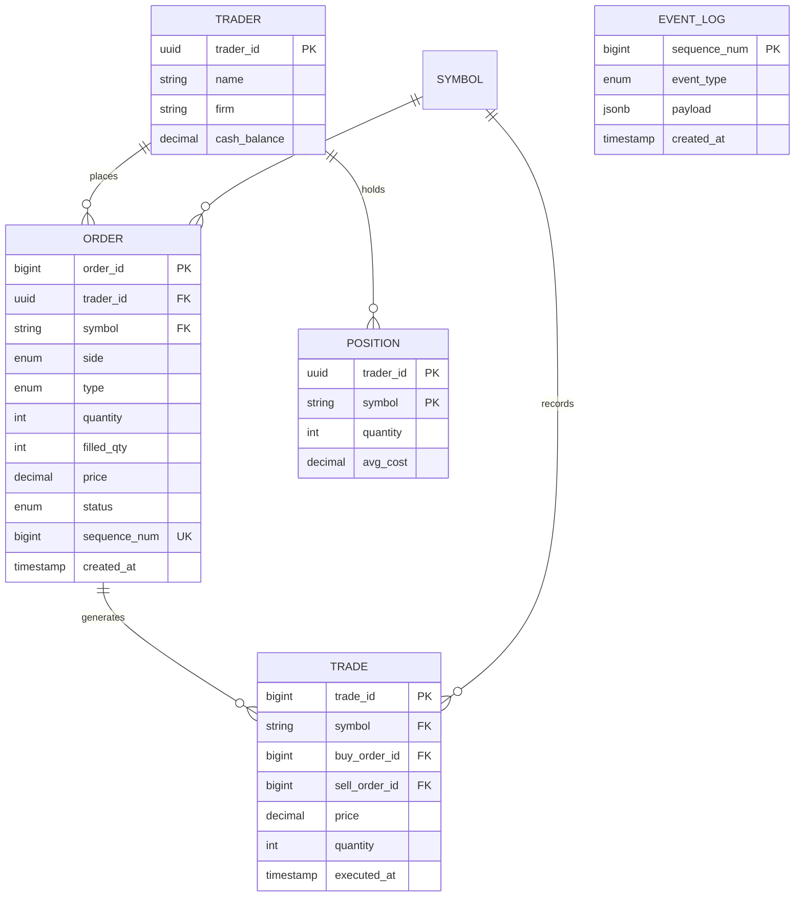
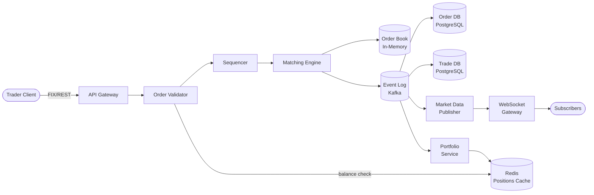
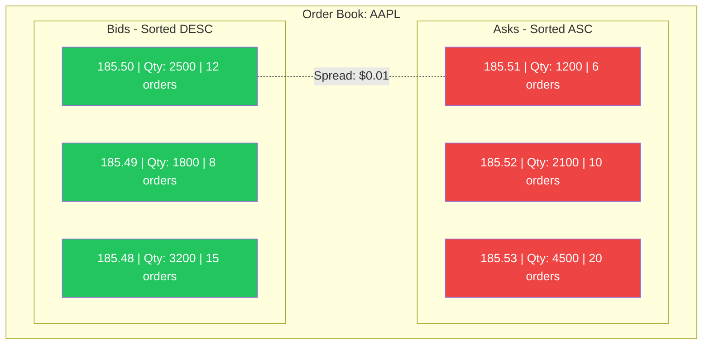
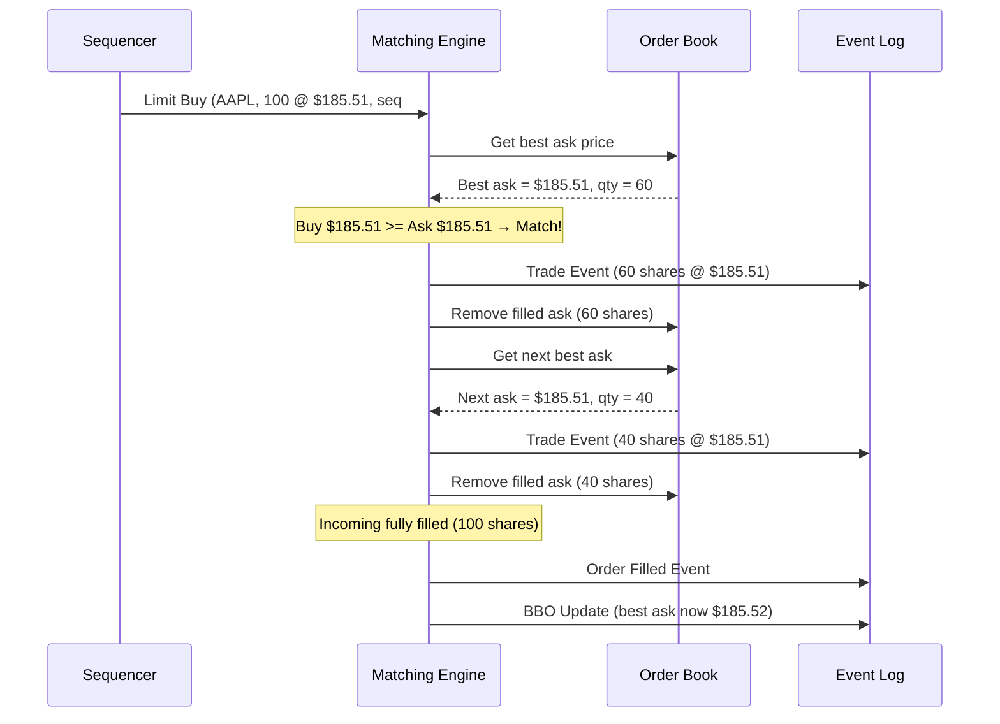
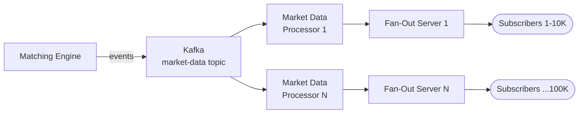
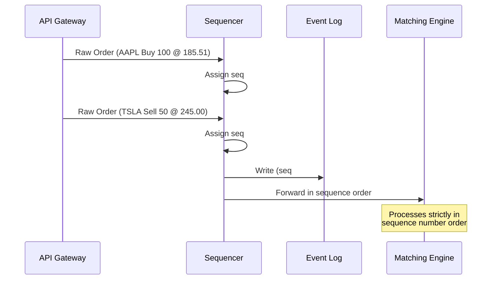
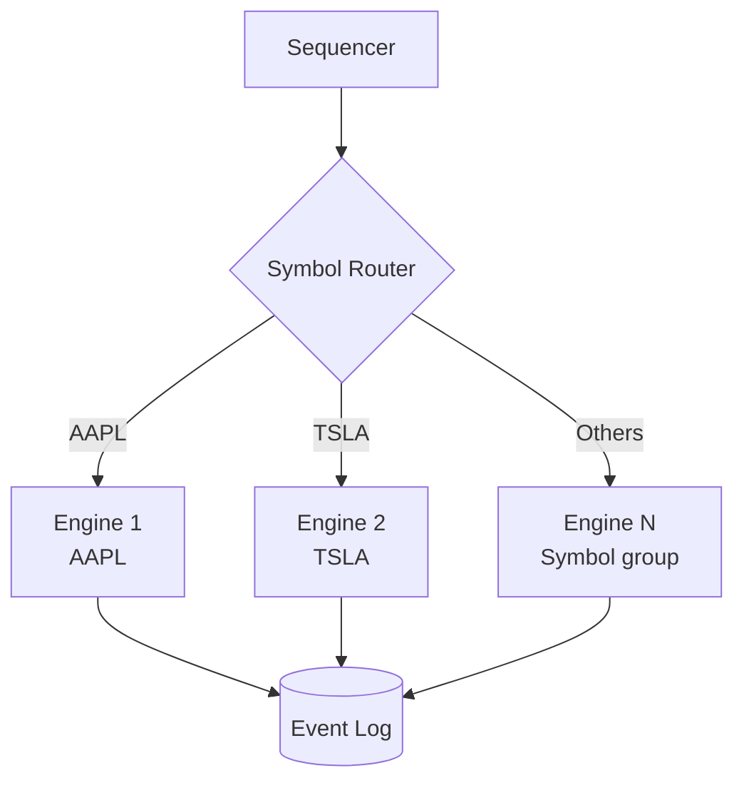
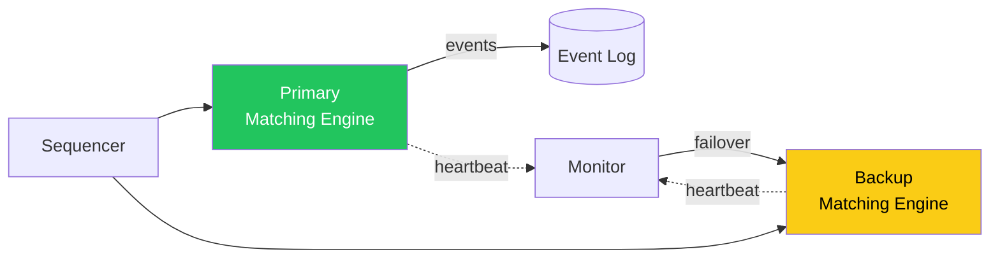

# Design a Stock Exchange

> A stock exchange is a centralized marketplace where buyers and sellers submit
> orders to trade financial instruments (stocks, ETFs, derivatives). The core of
> any exchange is the **matching engine** -- a deterministic system that pairs buy
> and sell orders using price-time priority. This design question tests your
> understanding of ultra-low latency architecture, in-memory processing, event
> sourcing, deterministic sequencing, and real-time market data distribution.

---

## 1. Problem Statement & Requirements

Design a stock exchange system that accepts orders from traders, matches them in
real time using a price-time priority algorithm, maintains a live order book for
each symbol, and broadcasts market data to all subscribers. The system must
process millions of orders per second with sub-millisecond latency and guarantee
that no order is executed twice or lost.

### 1.1 Functional Requirements

- **FR-1: Order Placement** -- Traders can place orders of various types: market,
  limit, stop, stop-limit, Immediate-Or-Cancel (IOC), and Fill-Or-Kill (FOK).
- **FR-2: Order Matching** -- The matching engine pairs buy and sell orders using
  price-time priority (FIFO at each price level). Partial fills are supported.
- **FR-3: Order Book** -- Maintain a real-time order book per symbol with sorted
  bid (buy) and ask (sell) sides, showing price levels and aggregated quantities.
- **FR-4: Market Data Feed** -- Publish real-time price updates, trades, and order
  book snapshots via WebSocket. Support L1 (best bid/ask) and L2 (full depth).
- **FR-5: Order Management** -- Traders can cancel or modify open orders.
- **FR-6: Portfolio & Position Tracking** -- Track each trader's holdings, cash
  balance, and open positions in real time after each trade execution.

> **Scope for deep dive:** We focus on the matching engine (FR-2), order book
> management (FR-3), the sequencer for deterministic ordering, and ultra-low
> latency design patterns.

### 1.2 Non-Functional Requirements

- **Latency:** < 1 ms (p99) for order matching. End-to-end order-to-ack < 5 ms.
- **Throughput:** 1 million orders per second at peak.
- **Consistency:** Strong -- no duplicate executions, no lost orders. Every order
  processed exactly once in a deterministic sequence.
- **Availability:** 99.99% during trading hours (6.5 hours/day for US equities).
- **Durability:** Zero data loss. Every order and trade persisted to an append-only
  event log for audit and replay.
- **Fairness:** Orders processed strictly in the sequence they are received.
- **Audit Trail:** Complete, immutable log of all events for regulatory compliance.

### 1.3 Out of Scope

- Regulatory compliance implementation details (SEC, FINRA rules).
- Margin trading and margin call mechanics.
- Options and derivatives pricing models.
- User authentication, KYC workflows, payment settlement with clearinghouses.

### 1.4 Assumptions & Estimations (Back-of-Envelope Math)

```
Symbols & Trading
------------------
Total symbols traded         = 10,000 (stocks + ETFs)
Active symbols at any moment = ~3,000 (top 30% drive 90% of volume)
Trading hours per day        = 6.5 hours = 23,400 seconds

Order Volume
--------------
Orders per day               = 5 billion
Orders per second (avg)      = 5B / 23,400 ~ 214K OPS
Peak factor                  = 5x (market open, news events)
Orders per second (peak)     = 214K * 5 ~ 1M OPS

Order Book Size
-----------------
Price levels per side         = ~500 (liquid stocks)
Orders per price level        = ~50 (average)
Total orders in book/symbol   = 500 * 2 * 50 = 50,000
Memory per order              = ~128 bytes
Order book per symbol         = 50,000 * 128 B = ~6.4 MB
All symbols                   = 10,000 * 6.4 MB = ~64 GB (fits in RAM)

Trade Volume
--------------
Trades per day                = ~1 billion
Trade record size             = ~256 bytes
Daily trade storage           = 1B * 256 B = ~256 GB
Yearly trade storage          = 256 GB * 252 trading days = ~63 TB

Market Data
-------------
L1 updates/sec (all symbols)  = ~500K
L2 updates/sec                = ~2M
Concurrent subscribers        = ~100K
Outbound bandwidth (L1)       = 100K * 50 KB/s = ~5 GB/s
```

> **Key insight:** All order books combined fit in memory (~64 GB). This enables
> in-memory processing, which is essential for sub-millisecond latency.

---

## 2. API Design

### 2.1 Place Order

```
POST /api/v1/orders
Headers: Authorization: Bearer <token>, X-Request-ID: <uuid>

Request:
{
  "symbol": "AAPL", "side": "buy", "type": "limit",
  "quantity": 100, "price": 185.50,
  "stop_price": null, "time_in_force": "day"
}

Response: 201 Created
{
  "order_id": "ord_7f3a9b2c", "symbol": "AAPL", "side": "buy",
  "type": "limit", "quantity": 100, "filled_quantity": 0,
  "price": 185.50, "status": "accepted",
  "created_at": "2026-02-28T14:30:00.000123Z"
}

Errors: 400 (invalid params), 403 (insufficient funds), 429 (rate limit)
```

### 2.2 Cancel Order

```
DELETE /api/v1/orders/{order_id}

Response: 200 OK
{ "order_id": "ord_7f3a9b2c", "status": "cancelled", "cancelled_quantity": 100 }

Errors: 404 (not found), 409 (already filled/cancelled)
```

### 2.3 Get Order Book

```
GET /api/v1/orderbook/{symbol}?depth=10

Response: 200 OK
{
  "symbol": "AAPL",
  "timestamp": "2026-02-28T14:30:00.000789Z",
  "bids": [
    { "price": 185.50, "quantity": 2500, "order_count": 12 },
    { "price": 185.49, "quantity": 1800, "order_count": 8 }
  ],
  "asks": [
    { "price": 185.51, "quantity": 1200, "order_count": 6 },
    { "price": 185.52, "quantity": 2100, "order_count": 10 }
  ]
}
```

### 2.4 Market Data WebSocket

```
WebSocket /ws/v1/market-data

Subscribe: { "action": "subscribe", "channels": ["l1", "trades"], "symbols": ["AAPL"] }

L1 Update:
{ "channel": "l1", "symbol": "AAPL", "best_bid": 185.50, "best_bid_qty": 2500,
  "best_ask": 185.51, "best_ask_qty": 1200, "last_price": 185.51, "volume": 12345678 }

Trade Update:
{ "channel": "trades", "symbol": "AAPL", "price": 185.51, "quantity": 100,
  "aggressor_side": "buy", "trade_id": "trd_abc123" }
```

> **Note:** For ultra-low latency institutional feeds, the exchange offers a binary
> protocol (FIX/FAST) over raw TCP instead of WebSocket. REST/WS is for retail clients.

---

## 3. Data Model

### 3.1 Schema

| Table          | Column          | Type          | Notes                                          |
| -------------- | --------------- | ------------- | ---------------------------------------------- |
| `orders`       | `order_id`      | BIGINT / PK   | Sequencer-assigned monotonic ID                |
| `orders`       | `trader_id`     | UUID / FK     | References `traders`                           |
| `orders`       | `symbol`        | VARCHAR(10)   | Indexed                                        |
| `orders`       | `side`          | ENUM          | buy, sell                                      |
| `orders`       | `type`          | ENUM          | market, limit, stop, stop_limit, ioc, fok      |
| `orders`       | `quantity`      | INT           | Original quantity                              |
| `orders`       | `filled_qty`    | INT           | Quantity filled so far                         |
| `orders`       | `price`         | DECIMAL(12,4) | Limit price (NULL for market)                  |
| `orders`       | `status`        | ENUM          | accepted, partial, filled, cancelled, rejected |
| `orders`       | `sequence_num`  | BIGINT / UK   | Global sequence number from sequencer          |
| `orders`       | `created_at`    | TIMESTAMP     | Nanosecond precision                           |
| `trades`       | `trade_id`      | BIGINT / PK   | Monotonic ID                                   |
| `trades`       | `symbol`        | VARCHAR(10)   | Indexed                                        |
| `trades`       | `buy_order_id`  | BIGINT / FK   | References `orders`                            |
| `trades`       | `sell_order_id` | BIGINT / FK   | References `orders`                            |
| `trades`       | `price`         | DECIMAL(12,4) | Execution price                                |
| `trades`       | `quantity`      | INT           | Executed quantity                               |
| `trades`       | `executed_at`   | TIMESTAMP     | Nanosecond precision                           |
| `positions`    | `trader_id`     | UUID / PK     | Composite PK with symbol                       |
| `positions`    | `symbol`        | VARCHAR(10)   | Composite PK                                   |
| `positions`    | `quantity`      | INT           | Net position                                   |
| `positions`    | `avg_cost`      | DECIMAL(12,4) | Volume-weighted average cost                   |
| `event_log`    | `sequence_num`  | BIGINT / PK   | Global sequence number                         |
| `event_log`    | `event_type`    | ENUM          | order_new, order_cancel, trade, etc.           |
| `event_log`    | `payload`       | JSONB         | Full event data                                |
| `event_log`    | `created_at`    | TIMESTAMP     | Nanosecond precision                           |

### 3.2 ER Diagram



### 3.3 Database Choice Justification

| Requirement                | Choice             | Reason                                                        |
| -------------------------- | ------------------ | ------------------------------------------------------------- |
| Order book (hot path)      | In-memory (custom) | Must be < 1ms; no database can match in-memory structures     |
| Order & trade persistence  | PostgreSQL         | ACID, rich indexing, audit queries, regulatory compliance     |
| Event log (streaming)      | Kafka + PostgreSQL | Kafka for real-time streaming; PG for durable queryable log   |
| Market data distribution   | Kafka              | High-throughput pub/sub, fan-out to thousands of subscribers  |
| Portfolio/position cache   | Redis              | Sub-ms reads for balance checks on order validation           |
| Time-series market data    | TimescaleDB        | Efficient time-range queries for OHLCV candles and history    |

> **Key insight:** The matching engine's order book is **never** read from a database.
> It is an in-memory data structure rebuilt from the event log on startup.

---

## 4. High-Level Architecture

### 4.1 Architecture Diagram



### 4.2 Component Walkthrough

| Component              | Responsibility                                                                     |
| ---------------------- | ---------------------------------------------------------------------------------- |
| **API Gateway**        | Receives orders via FIX (institutional) or REST (retail), rate limiting             |
| **Order Validator**    | Validates parameters, checks trader balance/positions in Redis, rejects bad orders  |
| **Sequencer**          | Assigns global monotonic sequence number; single point of serialization             |
| **Matching Engine**    | Matches buy/sell orders using price-time priority; produces trades                  |
| **Order Book**         | In-memory sorted structure (per symbol) of all active orders                        |
| **Event Log (Kafka)**  | Append-only log of all events for replay and downstream consumers                  |
| **Market Data Pub**    | Computes L1/L2 snapshots from events, publishes to subscribers                     |
| **Portfolio Service**  | Updates trader balances and positions after each trade                              |
| **Redis**              | Caches portfolio balances for fast validation on incoming orders                    |

> **Walk-through:** A trader sends a limit order via FIX. The gateway forwards it to the
> validator (balance check via Redis). The sequencer assigns a global sequence number. The
> matching engine processes in sequence order. If matched, a trade event flows through Kafka
> to databases (persistence), market data publisher (real-time feeds), and portfolio service.

---

## 5. Deep Dive: Core Flows

### 5.1 Order Matching Engine

The matching engine is the heart of the exchange. It uses **price-time priority (FIFO)**.

**Algorithm:**
1. Bids sorted by price **descending** (highest first). Same price: FIFO by arrival time.
2. Asks sorted by price **ascending** (lowest first). Same price: FIFO by arrival time.
3. A trade occurs when best bid price >= best ask price.
4. Execution price = price of the resting order (the one already in the book).
5. Partial fills: if incoming quantity > resting quantity, the resting order is filled and
   removed; the incoming order continues matching against the next level.

**Order Book Data Structure:**



**In-memory implementation:**
- Each price level is a node in a **sorted map** (red-black tree or skip list), keyed by price.
- Each node contains a **doubly linked list** of orders at that price, in FIFO order.
- Insert: O(log P), Cancel: O(1) with order-ID lookup map, Match at best: O(1).
- P = number of distinct price levels (~500 per side for liquid stocks).
- The engine is **single-threaded** per symbol -- no locks, fully deterministic.

**Matching Flow:**



### 5.2 Order Types

| Order Type    | Description                                                | Matching Behavior                                          |
| ------------- | ---------------------------------------------------------- | ---------------------------------------------------------- |
| **Market**    | Execute immediately at best available price                | Sweeps the book; no price guarantee                        |
| **Limit**     | Execute at specified price or better                       | Matches if price crosses; remainder rests in book          |
| **Stop**      | Becomes market order when stop price is reached            | Triggered by last trade price, then acts as market         |
| **Stop-Limit**| Becomes limit order when stop price is reached             | Triggered by last trade price, then acts as limit          |
| **IOC**       | Fill what is available now, cancel the rest                | Partial fill allowed; unfilled portion cancelled           |
| **FOK**       | Fill entire quantity now, or cancel entire order            | All-or-nothing; rejected if full quantity unavailable      |

**Stop orders** are stored in a separate structure sorted by stop price. After every
trade, the engine checks if the last trade price has crossed any stop prices. Triggered
stop orders are converted and injected into the regular matching flow.

### 5.3 Market Data Feed

**L1 (Best Bid and Offer):** Best bid/ask price and quantity. Updated on every trade or
BBO change. ~50K updates/sec. Used by retail traders.

**L2 (Full Market Depth):** All price levels with aggregated quantities. Updated on every
order add/cancel/modify. ~500K updates/sec. Used by algorithmic traders.

**Distribution architecture:**



- Kafka partitioned by symbol so all events for one symbol go to the same partition.
- Processors compute L1/L2 snapshots and incremental deltas.
- Fan-out servers use multicast for institutional feeds, WebSocket for retail.
- Bandwidth optimization: incremental deltas (not full snapshots) + binary encoding.

### 5.4 Sequencer

The sequencer assigns a **globally unique, monotonically increasing sequence number** to
every incoming event before it reaches the matching engine.

**Why it matters:**
- Deterministic ordering: if two orders arrive "at the same time," the sequencer decides
  which is first. This is essential for fairness, audit, and deterministic replay.
- Event sourcing: given the same sequence of events, the matching engine always produces
  the same output. This enables disaster recovery by replaying the log.

**Implementation:**
- **Single-threaded** process on a dedicated server. No locks, no CAS loops.
- Receives events via kernel-bypass networking, timestamps with nanosecond precision,
  assigns the next sequence number.
- Writes to event log (Kafka) and forwards to matching engine.
- On modern hardware, a single thread can process 5-10 million events/sec.



### 5.5 Ultra-Low Latency Design

Achieving sub-millisecond matching requires eliminating every source of overhead.

**1. In-Memory Processing:**
- Entire order book in RAM. No disk I/O on the hot path.
- Pre-allocated memory at startup (no GC pauses). C++/Rust, not GC'd languages.
- Object pooling: order objects recycled, not allocated/deallocated.

**2. Kernel Bypass (DPDK/RDMA):**
- Standard TCP adds 10-50us per hop via kernel network stack.
- DPDK bypasses the kernel; application reads packets directly from NIC via user-space drivers.
- RDMA allows server-to-server memory access without involving CPU (< 2us latency).

**3. Lock-Free Data Structures:**
- Matching engine is single-threaded (no locks needed).
- Sequencer-to-engine communication via lock-free SPSC ring buffers (LMAX Disruptor pattern).
- No context switches, no system calls on the hot path.

**4. CPU Pinning & NUMA Awareness:**
- Matching engine thread pinned to a dedicated CPU core (isolcpus).
- Memory on same NUMA node. No other processes on that core.

**5. Co-location:** Traders place servers in the exchange's data center. Cross-connect
cables reduce network latency to < 10 microseconds.

**6. Binary Protocols:** FIX/FAST or custom binary format instead of JSON/HTTP.
Zero-copy deserialization. Fixed-size messages.

**Latency budget:**

| Stage                       | Typical Latency |
| --------------------------- | --------------- |
| Network (co-located)        | 1-10 us         |
| Gateway parsing (binary)    | 1-5 us          |
| Sequencer assignment        | 0.5-1 us        |
| Matching engine processing  | 1-10 us         |
| Event log write (async)     | 0 us (non-blocking) |
| Response back to client     | 1-10 us         |
| **Total end-to-end**        | **5-40 us**     |

---

## 6. Scaling & Performance

### 6.1 Partitioning by Symbol

The primary scaling strategy: **partition the matching engine by symbol**. Orders for
different symbols are completely independent -- no cross-symbol state.

```
Top 100 symbols:        1 dedicated matching engine each
Next 900 symbols:       grouped into 10 engines (~90 each)
Remaining 9000 symbols: grouped into 50 engines (~180 each)
Total engines:          ~160
```



### 6.2 Market Data Fan-Out

With 100K subscribers needing filtered real-time updates, use a **tiered fan-out tree**:
1. Matching engines produce raw events (one stream per symbol).
2. Market Data Aggregators consume from Kafka, compute L1/L2 snapshots.
3. Fan-out servers push to end clients (~10K WebSocket connections each).
4. Servers filter per client subscription (only send subscribed symbols).
5. Incremental deltas + periodic full snapshots (every 30s) for resync.

### 6.3 Gateway Scaling

- Multiple gateway instances behind a Layer 4 load balancer.
- FIX sessions: long-lived TCP, sticky routing by session.
- REST/WebSocket: horizontal scaling behind L7 load balancer.
- Per-trader rate limiting: 1000 OPS (institutional), 10 OPS (retail).

---

## 7. Reliability & Fault Tolerance

### 7.1 Primary-Backup Replication



1. Sequencer sends every event to both primary and backup engines.
2. Both process identically (same code, same sequence, deterministic).
3. Primary's output goes to downstream systems; backup's output is verified but discarded.
4. If primary fails, monitor promotes backup in < 1 second (already fully caught up).

### 7.2 Event Sourcing & Replay

All state is derived from the event log.

**Recovery:** On startup, the engine replays from the last checkpoint to rebuild the
exact order book state. Checkpoints every ~1M events for fast recovery.

**Benefits:** Full audit trail, deterministic debugging (replay exact sequence),
disaster recovery (rebuild from log), regulatory compliance.

### 7.3 Circuit Breakers (Trading Halts)

| Level   | Trigger                              | Action                                |
| ------- | ------------------------------------ | ------------------------------------- |
| Level 1 | Symbol drops > 10% in 5 min         | Halt that symbol for 5 minutes        |
| Level 2 | Index drops > 7% from open           | Market-wide halt for 15 minutes       |
| Level 3 | Index drops > 20% from open          | Market closed for the day             |

The engine monitors last trade prices and enters "halt" state when thresholds are
breached. All orders for halted symbols are rejected. Re-enabled via opening auction.

### 7.4 Single Points of Failure

| Component        | SPOF? | Mitigation                                                    |
| ---------------- | ----- | ------------------------------------------------------------- |
| API Gateway      | No    | Multiple instances behind L4 load balancer                    |
| Order Validator  | No    | Stateless, horizontally scalable                              |
| Sequencer        | Yes   | Hot standby with automatic failover; < 1s switchover          |
| Matching Engine  | Yes   | Synchronous primary-backup replication                        |
| Kafka            | No    | 3-broker cluster, replication factor 3, min ISR 2             |
| PostgreSQL       | Yes   | Synchronous standby with automatic failover (Patroni)         |
| Redis            | Yes   | Redis Sentinel (3 nodes) for automatic failover               |

---

## 8. Trade-offs & Alternatives

| Decision                      | Chosen                     | Alternative              | Why Chosen                                                          |
| ----------------------------- | -------------------------- | ------------------------ | ------------------------------------------------------------------- |
| Matching engine model         | Single-threaded per symbol | Multi-threaded with locks| Determinism, no contention, reproducible for audit                  |
| Order book storage            | In-memory only             | DB-backed                | Sub-microsecond access; DB cannot meet < 1ms requirement            |
| State management              | Event sourcing             | Checkpointed state       | Full audit trail, deterministic replay, regulatory compliance       |
| Network protocol              | Kernel bypass (DPDK)       | Standard TCP/IP          | 10-50x lower latency; standard TCP adds 10-50us overhead           |
| Serialization format          | Binary (FIX/custom)        | JSON over HTTP           | Zero-copy deserialization; JSON parsing adds 5-20us                 |
| Replication model              | Synchronous primary-backup| Async replication        | Zero data loss; async risks losing trades on failover               |
| Sequencer design              | Single global sequencer    | Distributed (vector clocks)| Total ordering mandatory for fairness; distributed adds complexity |
| Market data distribution      | Tiered fan-out tree        | Direct pub-sub           | Direct push does not scale to 100K subscribers per symbol           |
| Programming language (engine) | C++ / Rust                 | Java / Go                | No GC pauses; predictable latency; C++ is industry standard        |

---

## 9. Interview Tips

### What Interviewers Look For

1. **Matching engine understanding** -- price-time priority, order book structure (sorted
   map + linked lists), partial fills, and why it must be single-threaded.
2. **Latency awareness** -- do not put HTTP/JSON or a database on the hot path. Exchanges
   operate in the microsecond regime.
3. **Determinism & sequencing** -- explain why a single-threaded sequencer is necessary
   for fairness and auditability.
4. **Event sourcing** -- the event log (not the DB) is the source of truth. Replay for
   recovery and audit.
5. **Symbol partitioning** -- the natural scaling key; symbols are independent.

### Common Follow-up Questions

- **"How do you ensure fairness?"** The sequencer serializes all events. One always gets a
  lower sequence number. No "same time" exists.
- **"What if the matching engine crashes?"** Backup takes over in < 1s (already in sync).
  Cold restart replays event log from last checkpoint.
- **"Flash crash?"** Circuit breakers halt trading. Engine monitors price movements and
  triggers halts at configured thresholds.
- **"Why not use a database for the order book?"** DB introduces disk I/O, network
  round-trips, and serialization overhead. Even Redis is ~100us. Order book needs
  sub-microsecond operations.
- **"How to prevent a trader from overwhelming the system?"** Per-trader rate limiting
  at the gateway (token bucket). Institutional: 1000 OPS, retail: 10 OPS.

### Common Pitfalls

- Using HTTP/JSON on the critical path (exchanges use binary protocols + kernel bypass).
- Putting a database on the matching hot path (order book must be in-memory).
- Ignoring the sequencer (no fairness or deterministic replay without it).
- Multi-threading the matching engine (single-threaded is faster AND correct).
- Forgetting circuit breakers (every real exchange has trading halts).
- Over-engineering with microservices (matching engine must be a monolithic, optimized process).

### Key Numbers to Memorize

```
NASDAQ matching latency:     ~10-50 microseconds
NYSE matching latency:       ~20-100 microseconds
Peak orders/sec:             1-5 million (all symbols)
US equity symbols:           ~8,000 (NYSE + NASDAQ)
Trading hours (US):          6.5 hours (9:30 AM - 4:00 PM ET)
Order book memory:           ~64 GB (all symbols)
Tick size (US equities):     $0.01
Daily trade volume (US):     ~10-15 billion shares
Co-location latency:         < 10 microseconds
Kernel bypass latency:       < 2 microseconds (DPDK/RDMA)
```

---

> **Checklist before finishing your design:**
>
> - [x] Requirements scoped: order types, matching, order book, market data, portfolio.
> - [x] Back-of-envelope: 1M OPS peak, 10K symbols, 64 GB in RAM, 63 TB/year trades.
> - [x] Mermaid diagrams: architecture, order book, matching flow, replication, fan-out.
> - [x] Database choices justified: in-memory (hot), PostgreSQL (persist), Kafka (events).
> - [x] Scaling: symbol partitioning, tiered market data fan-out, gateway scaling.
> - [x] SPOFs: sequencer (hot standby), matching engine (primary-backup), PG (Patroni).
> - [x] Trade-offs: 9 explicit decisions covering latency, consistency, and architecture.
