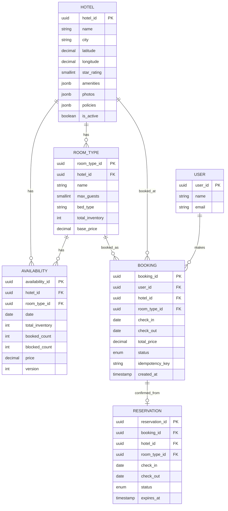
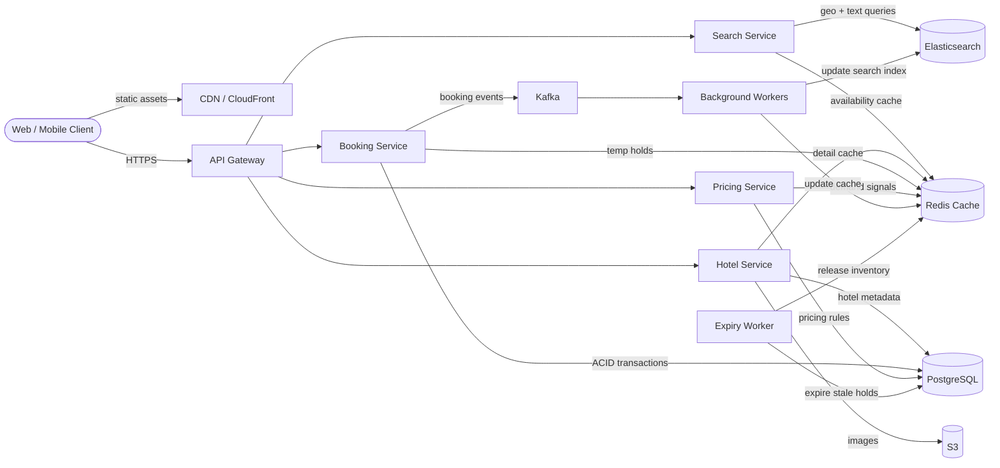
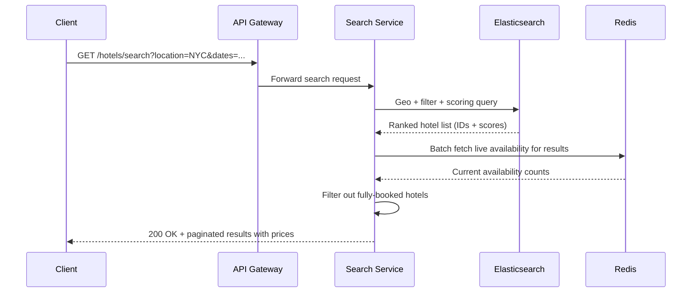
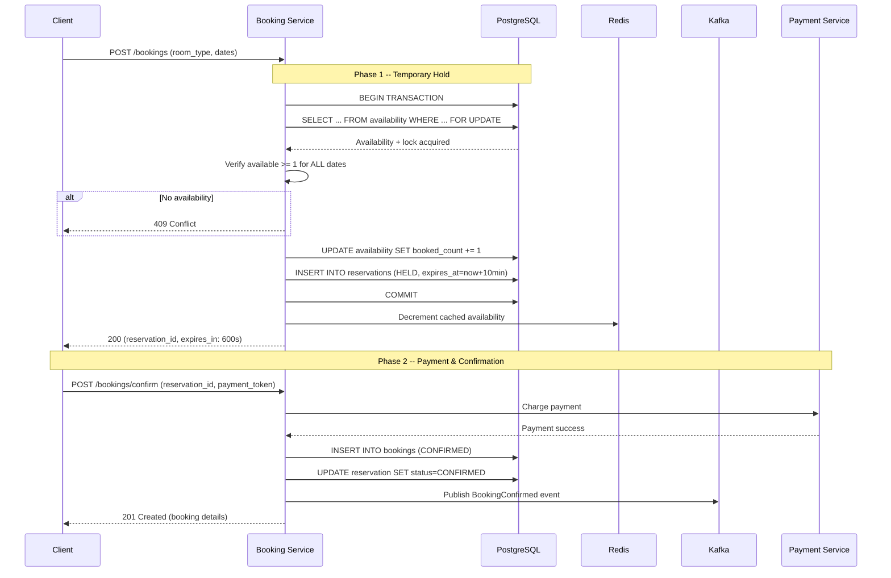
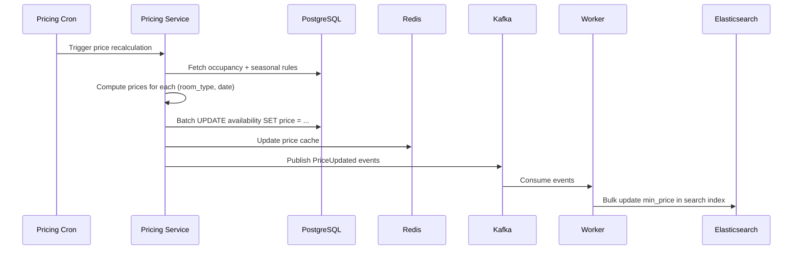

# Design a Hotel Booking System (Booking.com)

> Design a platform where travellers can search for hotels by location, dates,
> and guest count, view room availability and pricing, and make reservations
> with guaranteed consistency (no overbooking). This tests your ability to
> balance eventual consistency (search) with strong consistency (reservations).

---

## 1. Problem Statement & Requirements

Design a hotel booking platform similar to Booking.com where users search for
hotels, compare prices, and reserve rooms for specific date ranges. The central
engineering challenge is **inventory management** -- ensuring the same room-night
is never sold twice under concurrent booking attempts and high search traffic.

### 1.1 Functional Requirements

- **FR-1: Hotel Search** -- Search by location, check-in/check-out dates, guest
  count, and filters (price, stars, amenities).
- **FR-2: Hotel & Room Details** -- View hotel page with photos, policies, and
  available room types with prices for selected dates.
- **FR-3: Room Booking** -- Reserve rooms for a date range with guaranteed no
  overbooking (double-selling the same room-night).
- **FR-4: Booking Management** -- View, modify, or cancel bookings. Cancellation
  policies (free window, penalties) apply.
- **FR-5: Dynamic Pricing** -- Prices vary by season, demand, day-of-week, and
  current occupancy.
- **FR-6: Hotel Onboarding** -- Partners register properties, define room types,
  set base prices, and manage inventory.

> **Scope for deep dive:** Search (FR-1), booking flow with overbooking
> prevention (FR-3), availability/inventory management, and dynamic pricing (FR-5).

### 1.2 Non-Functional Requirements

| Attribute           | Target                                                       |
| ------------------- | ------------------------------------------------------------ |
| **Availability**    | 99.99% for both search and bookings                          |
| **Search latency**  | p50 < 100 ms, p99 < 500 ms                                  |
| **Booking latency** | p99 < 2 seconds (includes temporary hold + confirmation)     |
| **Consistency**     | Strong for bookings; eventual for search (few seconds stale) |
| **Throughput**      | 500 M searches/day, 10 M bookings/month                     |
| **Durability**      | Zero data loss for confirmed bookings                        |

### 1.3 Out of Scope

- Payment processing (assume a separate payment gateway).
- User reviews and ratings system.
- Loyalty programs and reward points.
- Customer support / chat with hotels.

### 1.4 Assumptions & Estimations

```
Hotels & Inventory
-------------------
Total hotels            = 2 M
Avg rooms per hotel     = 50
Total rooms             = 100 M
Room-nights per year    = 100 M * 365       = 36.5 B room-nights/year

Search Traffic
---------------
Searches per day        = 500 M
Search QPS (avg)        = 500 M / 86,400    ~ 5,800 QPS
Peak search QPS (5x)    = ~29,000 QPS

Booking Traffic
----------------
Bookings per month      = 10 M
Bookings per day        = ~333 K/day
Booking QPS (avg)       = 333 K / 86,400    ~ 4 QPS
Peak booking QPS (10x)  = ~40 QPS
Avg stay = 3 nights     → 1 M room-nights booked/day

Note: The funnel is 500M searches → 333K bookings. Search is the
scalability bottleneck; booking is the consistency bottleneck.

Storage
--------
Hotel metadata          = 2 M * 10 KB       = 20 GB
Availability table      = 100 M * 365 * 50B = ~1.8 TB/year
Booking records         = 120 M/year * 1 KB = ~120 GB/year
Search index (ES)       = ~100 GB
```

> **Key insight:** Search dominates QPS (5,800 vs 4). The architecture must be
> bifurcated: an eventually consistent search layer and a strongly consistent
> ACID booking layer.

---

## 2. API Design

All endpoints versioned under `/api/v1/`. Auth via Bearer token. Rate limiting
headers in every response. Cursor-based pagination on list endpoints.

### 2.1 Hotel Search

```
GET /api/v1/hotels/search?location=NYC&check_in=2026-07-15&check_out=2026-07-18
    &guests=2&rooms=1&min_price=100&max_price=500&star_rating=4
    &amenities=pool,wifi&sort_by=price&cursor=abc&limit=20

  Response: 200 {
    "results": [
      {
        "hotel_id": "h_nyc_001",
        "name": "Grand Central Hotel",
        "star_rating": 4,
        "location": { "lat": 40.7527, "lng": -73.9772 },
        "thumbnail_url": "https://cdn.example.com/h_nyc_001/thumb.jpg",
        "min_price_per_night": 249.00,
        "amenities": ["wifi", "pool", "gym"],
        "review_score": 8.7,
        "available_rooms": 3
      }
    ],
    "total_count": 342,
    "next_cursor": "def456"
  }
```

### 2.2 Hotel Details & Room Availability

```
GET /api/v1/hotels/{hotel_id}/rooms?check_in=2026-07-15&check_out=2026-07-18&guests=2

  Response: 200 {
    "hotel": { "hotel_id": "h_nyc_001", "name": "...", "photos": [...], ... },
    "rooms": [
      {
        "room_type_id": "rt_001",
        "name": "Deluxe King Room",
        "max_guests": 2,
        "price_per_night": [
          { "date": "2026-07-15", "price": 249.00 },
          { "date": "2026-07-16", "price": 249.00 },
          { "date": "2026-07-17", "price": 249.00 }
        ],
        "total_price": 747.00,
        "available_count": 3,
        "cancellation_policy": "FREE_CANCELLATION"
      }
    ]
  }
```

### 2.3 Create Booking

```
POST /api/v1/bookings
  Headers:  Idempotency-Key: "idem_uuid_123"
  Request:  {
              "hotel_id": "h_nyc_001",
              "room_type_id": "rt_001",
              "check_in": "2026-07-15",
              "check_out": "2026-07-18",
              "guests": 2,
              "guest_name": "John Doe",
              "guest_email": "john@example.com"
            }
  Response: 201 {
              "booking_id": "bk_abc123",
              "status": "CONFIRMED",
              "total_price": 747.00,
              "cancellation_deadline": "2026-07-14T15:00:00Z",
              "created_at": "2026-02-28T10:30:00Z"
            }
  Errors:   409 Conflict (room unavailable), 400 Bad Request
```

### 2.4 Cancel Booking

```
DELETE /api/v1/bookings/{booking_id}
  Response: 200 {
              "booking_id": "bk_abc123",
              "status": "CANCELLED",
              "refund_amount": 747.00,
              "cancellation_fee": 0.00
            }
  Errors:   404 Not Found, 403 Forbidden, 422 Past cancellation deadline
```

---

## 3. Data Model

### 3.1 ER Diagram



### 3.2 Key Index: Availability Table

The `availability` table is the most critical. One row per (hotel, room_type, date):

```sql
CREATE UNIQUE INDEX idx_availability_lookup
  ON availability (hotel_id, room_type_id, date);

-- Available rooms = total_inventory - booked_count - blocked_count
-- Checked atomically during booking via version column
```

### 3.3 Database Choice Justification

| Requirement              | Choice        | Reason                                             |
| ------------------------ | ------------- | -------------------------------------------------- |
| Booking transactions     | PostgreSQL    | ACID, row-level locking, SELECT FOR UPDATE          |
| Hotel search             | Elasticsearch | Geo queries, full-text, faceted filters at 29K QPS  |
| Availability cache       | Redis         | Sub-ms reads for hot availability data              |
| Async event processing   | Kafka         | Durable, ordered event streaming                    |
| Hotel images             | S3 + CDN      | Cheap blob storage, global edge delivery            |
| Reservation expiry       | Redis (TTL)   | Automatic key expiration for temp holds             |

> **Why PostgreSQL over DynamoDB?** We need multi-row transactions (decrement
> availability across N dates atomically) and row-level locking. DynamoDB's
> single-item transaction model is insufficient.

---

## 4. High-Level Architecture

### 4.1 Architecture Diagram



### 4.2 Component Walkthrough

| Component              | Responsibility                                                |
| ---------------------- | ------------------------------------------------------------- |
| **API Gateway**        | Rate limiting, auth, routing, TLS termination                 |
| **Search Service**     | Hotel search queries, delegates to Elasticsearch              |
| **Hotel Service**      | CRUD for hotel metadata, room types, photos                   |
| **Booking Service**    | Reservation holds, booking confirmation, cancellation         |
| **Pricing Service**    | Computes dynamic prices based on demand and occupancy         |
| **PostgreSQL**         | Source of truth for bookings, availability, hotel data         |
| **Elasticsearch**      | Search index with geo, text, and filter capabilities          |
| **Redis**              | Availability cache, reservation TTLs, hotel detail cache      |
| **Kafka**              | Event bus for async operations (index sync, notifications)    |
| **Expiry Worker**      | Releases expired reservation holds                            |

> **Data flow:** Writes go to PostgreSQL, then propagate async via Kafka to
> Elasticsearch and Redis. Search reads hit ES; availability reads hit Redis
> first, then fall back to PostgreSQL.

---

## 5. Deep Dive: Core Flows

### 5.1 Hotel Search Flow

We use Elasticsearch for geo-distance queries, full-text matching, and faceted
filtering at 29K peak QPS.

**Search query construction:**
1. **Geo filter** -- `geo_distance` to find hotels within X km of location.
2. **Availability filter** -- `available_room_count > 0` (updated async in ES).
3. **Faceted filters** -- `term` on star_rating, amenities; `range` on price.
4. **Relevance scoring** -- `function_score` combining text match, review score,
   booking popularity, and distance.



**Why two-phase (ES + Redis)?** ES availability data may be seconds stale. After
ranking from ES, we cross-check Redis (updated within ms of a booking) to remove
hotels that became fully booked. Accurate availability + fast search.

### 5.2 Availability & Inventory Management

We use **date-based inventory**: for each (hotel, room_type, date), track how
many rooms are booked.

```sql
-- Check availability for ALL dates in the range
SELECT date, (total_inventory - booked_count - blocked_count) AS available
FROM availability
WHERE hotel_id = $1 AND room_type_id = $2
  AND date >= $3 AND date < $4
  AND (total_inventory - booked_count - blocked_count) > 0;
-- If returned rows = number of nights, rooms are available for entire stay
```

**Why date-based count vs. individual room tracking?**

| Approach              | Pros                                 | Cons                                |
| --------------------- | ------------------------------------ | ----------------------------------- |
| **Date-based count**  | Simple, fewer rows, fast aggregation | Cannot assign specific room numbers |
| **Individual rooms**  | Can assign room 301 specifically     | Massive table, overlap queries      |
| **Interval ranges**   | Compact for long stays               | Complex overlap detection           |

We choose **date-based count** because guests do not pick room numbers (unlike
airline seats). The front desk assigns rooms at check-in.

### 5.3 Booking Flow (End-to-End)

Two-phase approach: temporary hold (reservation) then confirm after payment.
Prevents users from losing rooms while entering payment details.



**Reservation expiry:** If payment is not completed in 10 minutes, a background
worker releases the hold:

```sql
-- Runs every 30 seconds
UPDATE availability a SET booked_count = booked_count - 1
FROM reservations r
WHERE r.hotel_id = a.hotel_id AND r.room_type_id = a.room_type_id
  AND a.date >= r.check_in AND a.date < r.check_out
  AND r.status = 'HELD' AND r.expires_at < NOW();

UPDATE reservations SET status = 'EXPIRED'
WHERE status = 'HELD' AND expires_at < NOW();
```

### 5.4 Preventing Overbooking

**Approach 1: Optimistic Locking (default)**

```sql
-- Read current availability with version
SELECT available, version FROM availability
WHERE hotel_id = $1 AND room_type_id = $2 AND date = $3;
-- Returns: available = 3, version = 42

-- Atomic update with version guard
UPDATE availability
SET booked_count = booked_count + 1, version = version + 1
WHERE hotel_id = $1 AND room_type_id = $2 AND date = $3
  AND version = 42
  AND (total_inventory - booked_count - blocked_count) > 0;
-- affected_rows = 0 → someone else modified first → retry (up to 3x)
```

**Approach 2: Pessimistic Locking (flash sales / low inventory)**

```sql
BEGIN;
SELECT * FROM availability
WHERE hotel_id = $1 AND room_type_id = $2 AND date >= $3 AND date < $4
FOR UPDATE;  -- Lock rows
-- Check availability, then update
UPDATE availability SET booked_count = booked_count + 1 WHERE ...;
COMMIT;
```

**Comparison:**

| Approach             | Throughput | Contention        | Best For                        |
| -------------------- | ---------- | ----------------- | ------------------------------- |
| Optimistic locking   | High       | Retry on conflict | Normal traffic, most bookings   |
| Pessimistic (FOR UPDATE) | Medium | Blocks concurrent | Flash sales, last-room scenarios|
| Distributed lock     | High       | External manager  | Multi-region setups             |

**Our strategy:** Optimistic by default. When inventory drops below 3 rooms for
a (room_type, date), auto-switch to pessimistic locking.

### 5.5 Dynamic Pricing

```
final_price = base_price
            * seasonal_multiplier     (0.7 - 2.0)
            * day_of_week_multiplier  (0.8 - 1.3)
            * demand_multiplier       (0.9 - 1.5)
            * occupancy_factor        (1.0 - 1.8)
```

**Occupancy Factor Curve:**

| Occupancy % | Factor |
| ----------- | ------ |
| < 40%       | 1.0    |
| 40 - 60%    | 1.1    |
| 60 - 80%    | 1.3    |
| 80 - 90%    | 1.5    |
| > 90%       | 1.8    |

A batch job runs every 15 minutes, recalculating prices for the next 90 days.
Prices are written to `availability.price` in PostgreSQL and pushed to Redis
and Elasticsearch for fast reads.



---

## 6. Scaling & Performance

### 6.1 Search Cluster Scaling

```
Peak QPS per ES node  ~ 3,000
Peak search QPS       = 29,000
Nodes needed          = 29,000 / 3,000 ~ 10 data nodes
With 2 replicas       = 30 nodes total
```

**Shard by geographic region** -- Hotels in NA, EU, Asia in separate shards.
90%+ of searches are location-specific, so most queries hit 1-2 shards.

### 6.2 Booking Database Scaling

At ~40 peak booking QPS, a single PostgreSQL primary with read replicas suffices:

- **Vertical scaling first** -- 64 cores, 256 GB RAM handles thousands of TPS.
- **Read replicas** (2-3) for booking history and reporting.
- **Sharding (at scale):** Shard by `hotel_id` -- all availability and bookings
  for a hotel on the same shard, keeping transactions local. 16-64 shards via
  `hash(hotel_id) % N`.

### 6.3 Caching Strategy

| Data               | Cache      | TTL        | Invalidation                 |
| ------------------ | ---------- | ---------- | ---------------------------- |
| Hotel metadata     | Redis + CDN| 1 hour     | On hotel update              |
| Room availability  | Redis      | 30 seconds | On every booking/cancel      |
| Search results     | Redis      | 60 seconds | Key = hash(query params)     |
| Pricing data       | Redis      | 15 minutes | On price recalculation       |

### 6.4 Handling Flash Sales

1. **Rate limiting** -- 5 booking attempts/minute per user.
2. **Queue-based booking** -- For flash sales, requests are enqueued in Kafka
   and processed serially per hotel. Users get "pending" status.
3. **Pre-warm caches** -- Load all affected availability into Redis before sale.
4. **Auto-switch to pessimistic locking** when inventory < 3.

---

## 7. Reliability & Fault Tolerance

### 7.1 Single Points of Failure

| Component      | SPOF? | Mitigation                                           |
| -------------- | ----- | ---------------------------------------------------- |
| API Gateway    | Yes   | Active-active pair, DNS failover                     |
| Search Service | No    | Stateless, auto-scaling group                        |
| Booking Service| No    | Stateless, multiple instances                        |
| PostgreSQL     | Yes   | Synchronous standby, automatic failover (Patroni)   |
| Elasticsearch  | No    | Multi-node cluster with replica shards               |
| Redis          | Yes   | Redis Sentinel / Cluster (3+ nodes)                  |
| Kafka          | No    | 3-broker cluster, ISR replication factor 3           |

### 7.2 Booking Idempotency

Every booking includes an `Idempotency-Key`. Before creating a booking:
```sql
SELECT booking_id FROM bookings WHERE idempotency_key = $1;
-- If found → return existing booking (no double-charge)
-- If not   → proceed with new booking
-- UNIQUE constraint on idempotency_key prevents races
```

### 7.3 Reservation Expiry & Cleanup

- **Primary:** Worker runs every 30s, expiring `HELD` reservations past TTL.
- **Backup:** Redis TTL keys trigger keyspace notifications if DB worker lags.
- **Reconciliation (hourly):** Compare `booked_count` against actual confirmed +
  held bookings per (hotel, room_type, date). Fix drift and alert.

### 7.4 Graceful Degradation

| Failure               | Degraded Behavior                                     |
| --------------------- | ----------------------------------------------------- |
| Elasticsearch down    | Fall back to PostgreSQL search (slower, basic)        |
| Redis down            | Reads go to PostgreSQL; latency increases 5-10x       |
| Kafka down            | Bookings still work; ES/cache updates queue in memory |
| Pricing Service down  | Use last computed prices (cached)                     |

---

## 8. Trade-offs & Alternatives

| Decision                 | Chosen                     | Alternative              | Why Chosen                                                 |
| ------------------------ | -------------------------- | ------------------------ | ---------------------------------------------------------- |
| Search engine            | Elasticsearch              | PostgreSQL + PostGIS     | ES handles geo + text + facets at 29K QPS; PG cannot       |
| Availability model       | Date-based count           | Individual room slots    | Simpler, fewer rows; guests do not pick room numbers       |
| Overbooking prevention   | Optimistic + pessimistic   | Distributed locks (Redis)| DB-level locking is simpler; no external lock dependency   |
| Booking consistency      | Strong (ACID)              | Eventual + compensation  | Overbooking is unacceptable; compensation is bad UX        |
| Search consistency       | Eventual (bounded stale)   | Strong (real-time)       | 2-3s staleness OK; strong consistency kills search perf    |
| Pricing computation      | Batch (every 15 min)       | Real-time per request    | Batch is cheaper; 15-min staleness fine for prices         |
| Temp hold mechanism      | DB reservation + TTL       | Redis-only locks         | DB gives durability; Redis locks vanish on restart         |
| DB shard key             | hotel_id                   | user_id                  | Keeps booking txn local; user queries via scatter-gather   |

---

## 9. Interview Tips

### What Makes Hotel Booking Unique

1. **Dual consistency model** -- Search is eventually consistent, bookings are
   strongly consistent. Clearly articulate why and how.
2. **Inventory is the bottleneck** -- The availability table is the hottest
   table. Everything else is secondary.
3. **Date-range operations** -- Unlike e-commerce (decrement stock by 1), hotel
   booking must atomically check and update N dates simultaneously.
4. **Temporary holds** -- The two-phase booking flow (hold + confirm) is a
   pattern interviewers love to explore.

### Common Follow-up Questions

- **"Two users book the last room simultaneously?"** -- One succeeds via
  optimistic locking (version check), the other retries and gets 409.
- **"Flash sale on a popular hotel?"** -- Queue-based booking via Kafka,
  pessimistic locking for low inventory, rate limiting, pre-warmed caches.
- **"PostgreSQL goes down mid-booking?"** -- Synchronous standby via Patroni,
  client retries with same idempotency key on the new primary.
- **"How to keep ES in sync?"** -- Kafka CDC: booking events update ES index.
  Bounded staleness ~2-3s. Reconciliation job catches drift.
- **"Why not a single database?"** -- PG cannot handle 29K QPS for geo + text +
  facet queries. ES cannot provide ACID. Use each for its strength.

### Key Numbers to Memorize

```
Search QPS:     ~6K avg,  ~29K peak
Booking QPS:    ~4 avg,   ~40 peak
Availability:   36.5 B room-nights/year
Search index:   ~100 GB
Booking storage: ~120 GB/year
```

### Whiteboard Checklist

- [ ] Bifurcated architecture (search path vs. booking path)
- [ ] Date-based inventory model with availability table
- [ ] Two-phase booking flow (hold + confirm)
- [ ] Overbooking prevention with optimistic locking + version column
- [ ] Idempotency keys for booking retries
- [ ] Reservation expiry mechanism
- [ ] Elasticsearch sharding by region for search scaling
- [ ] Dynamic pricing formula with occupancy factor
