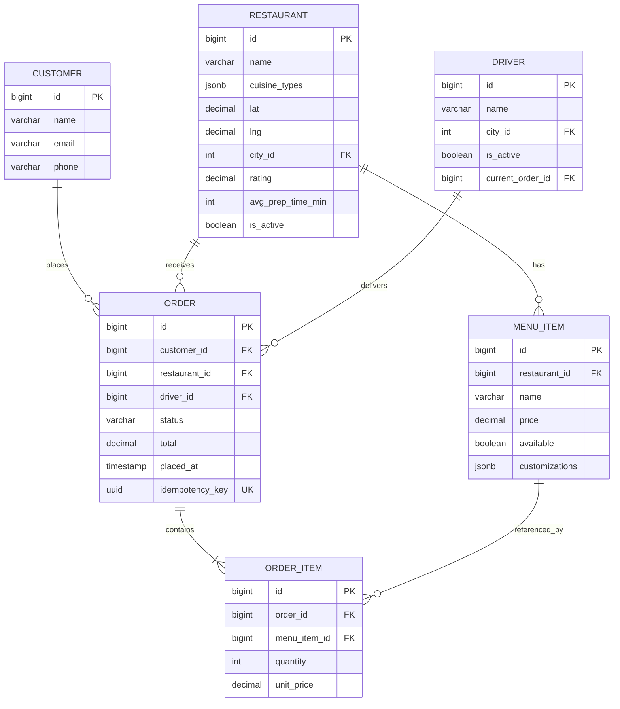
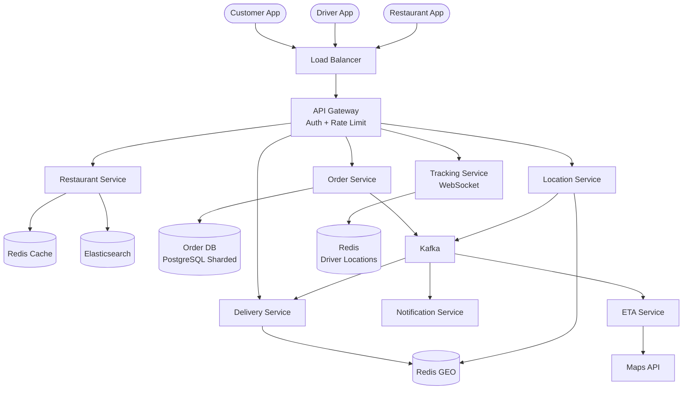
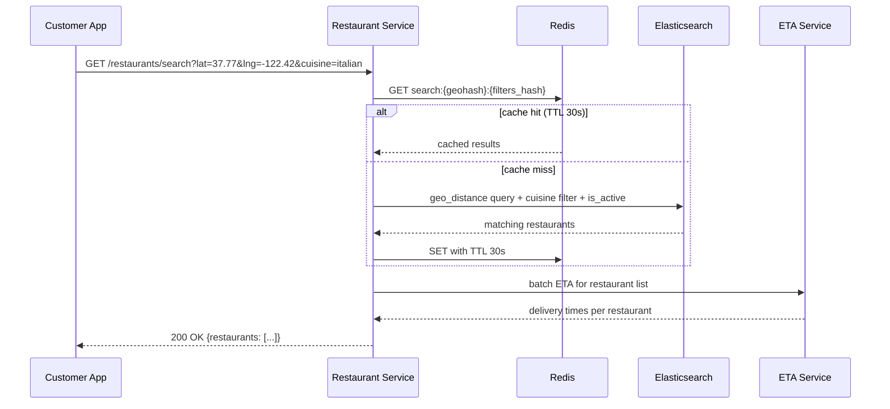
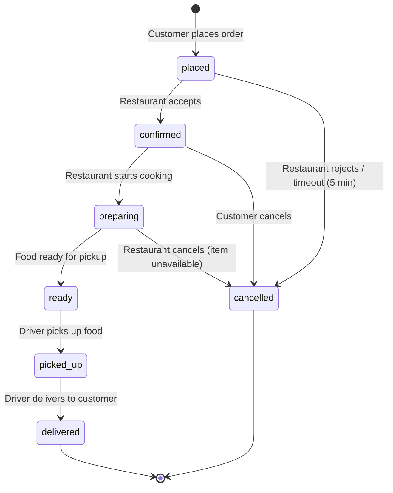
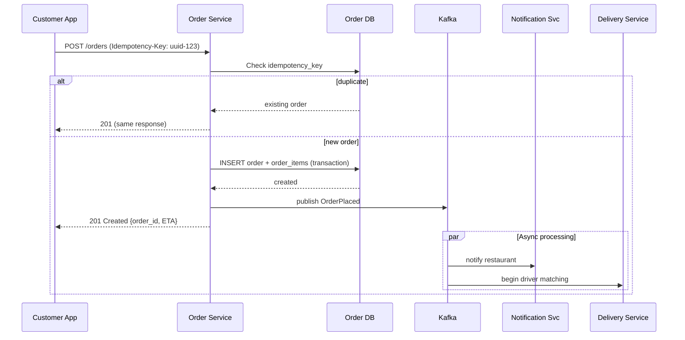
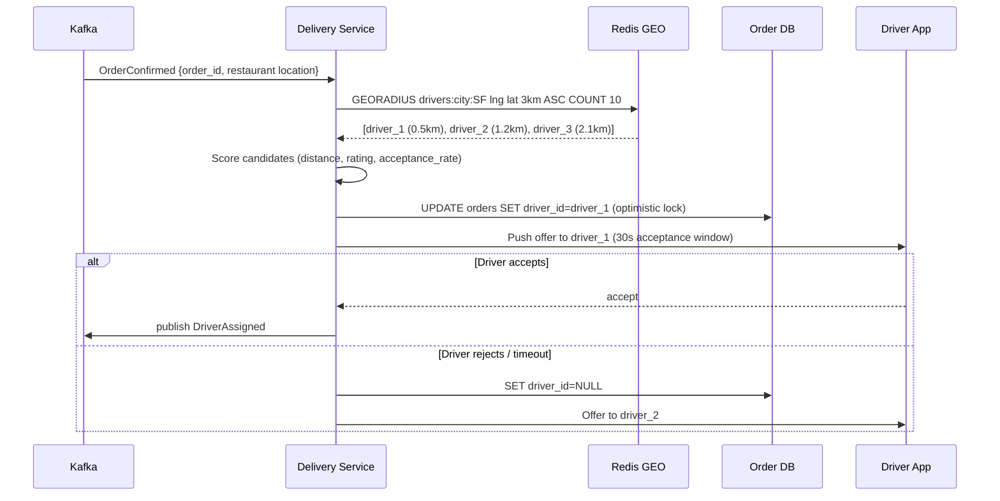
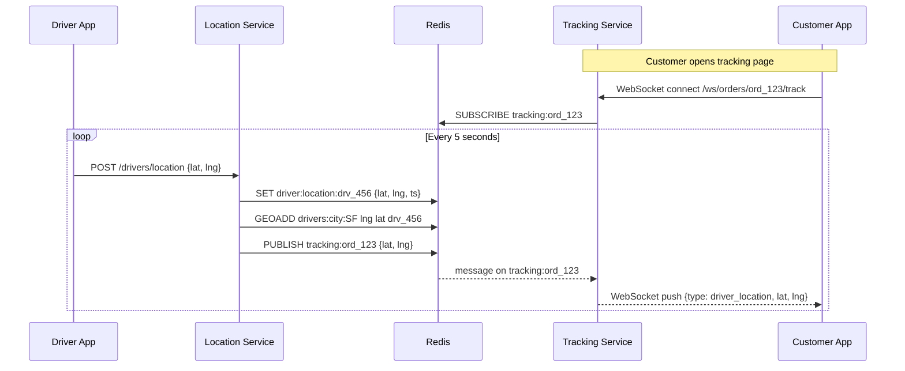

# Design a Food Delivery System (DoorDash / Uber Eats)

> A platform where customers browse nearby restaurants, place food orders, and
> track deliveries in real time. The core challenges are geospatial restaurant
> search, real-time order state management, optimal driver-to-order matching,
> and live delivery tracking -- all while handling massive peak-hour traffic
> spikes during lunch and dinner windows.

---

## 1. Problem Statement & Requirements

Design a food delivery platform similar to DoorDash or Uber Eats that allows
customers to discover restaurants by location, browse menus, place orders,
and track deliveries in real time. The system must match orders with nearby
delivery drivers, provide accurate ETAs, and handle extreme traffic spikes
during peak meal hours.

### 1.1 Functional Requirements

- **FR-1: Restaurant Search** -- Browse and search restaurants by location,
  cuisine, rating, and delivery time with geospatial filtering.
- **FR-2: Menu Browsing** -- View a restaurant's menu with item details,
  prices, customization options, and availability.
- **FR-3: Order Placement** -- Add items to cart, customize, and place an
  order with delivery address and special instructions.
- **FR-4: Real-time Tracking** -- Track order through every stage with live
  driver location on a map.
- **FR-5: Driver Assignment** -- Automatically match orders with nearby
  available drivers, optimizing by distance/ETA/driver load.
- **FR-6: ETA Estimation** -- Accurate delivery time combining prep time,
  pickup ETA, and delivery ETA.
- **FR-7: Restaurant Order Management** -- Restaurants accept/reject orders,
  update prep status, mark orders ready for pickup.

> **Scope for deep dive:** Restaurant search (FR-1), order state management
> (FR-3/FR-4), driver assignment (FR-5), and real-time tracking (FR-4).

### 1.2 Non-Functional Requirements

- **Scale:** 10M orders/day, 500K concurrent active deliveries at peak
- **Availability:** 99.99% uptime -- downtime during peak hours = lost revenue
- **Latency:** Search p99 < 200ms, order placement p99 < 500ms, tracking < 2s
- **Consistency:** Strong for orders (no double charges). Eventual for locations/search.

### 1.3 Out of Scope

- Payment processing and billing
- Promotions, coupons, and discount engine
- Driver onboarding and background checks
- Customer support and dispute resolution
- Ratings and reviews system

### 1.4 Assumptions & Estimations (Back-of-Envelope Math)

```
Orders & Traffic
  Orders per day            = 10M
  Orders per second (avg)   = 10M / 86,400 ~ 116 orders/sec
  Peak factor               = 5x (lunch + dinner = ~4h peak window)
  Peak orders/sec           = 116 * 5 ~ 580 orders/sec

  Avg searches per order    = 10 (browse before deciding)
  Peak search QPS           = 580 * 10 ~ 5,800 RPS

Driver Location Updates
  Active drivers at peak    = 500K
  Update frequency          = every 5 seconds
  Location ingestion rate   = 500K / 5 = 100K updates/sec

Storage
  Order record              = 2 KB -> 10M * 2 KB = 20 GB/day -> 7.3 TB/year
  Restaurants               = 1M * 1 KB = 1 GB (small, easily cached)
  Menu items                = 50M * 500 B = 25 GB
  Location updates          = 100K/sec * 32 B = 3.2 MB/sec (only latest kept hot)
```

> **Key insight:** Massive read traffic for search (5,800 RPS), a firehose of
> location updates (100K/sec), and heavily time-concentrated traffic (60% of
> daily orders in 4 peak hours).

---

## 2. API Design

All endpoints require `Authorization: Bearer <token>`. Cursor-based pagination.

```
GET /api/v1/restaurants/search?lat=37.77&lng=-122.42&radius=5&cuisine=italian
                               &sort=delivery_time&cursor=<cursor>&limit=20
  Response: 200 OK
            {
              "restaurants": [
                {
                  "id": "rst_abc123", "name": "Mario's Pizzeria",
                  "cuisine": ["italian"], "rating": 4.5,
                  "distance_km": 1.2, "delivery_fee": 2.99,
                  "estimated_delivery_min": 25, "is_open": true
                }
              ],
              "next_cursor": "cur_xyz789", "has_more": true
            }

GET /api/v1/restaurants/{restaurant_id}/menu
  Response: 200 OK
            {
              "categories": [
                {
                  "name": "Appetizers",
                  "items": [
                    { "id": "itm_001", "name": "Garlic Bread", "price": 6.99,
                      "available": true, "customizations": [...] }
                  ]
                }
              ]
            }

POST /api/v1/orders
  Headers:  Idempotency-Key: <uuid>
  Request:  {
              "restaurant_id": "rst_abc123",
              "items": [{ "item_id": "itm_001", "quantity": 2, "customizations": [...] }],
              "delivery_address": { "lat": 37.78, "lng": -122.41, "formatted": "..." }
            }
  Response: 201 Created
            { "order_id": "ord_123456", "status": "placed",
              "estimated_delivery_at": "2026-02-28T12:45:00Z", "total": 19.97 }

GET /api/v1/orders/{order_id}/track
  Response: 200 OK
            { "status": "picked_up",
              "driver": { "name": "John", "current_location": { "lat": 37.775, "lng": -122.415 } },
              "estimated_delivery_at": "2026-02-28T12:42:00Z",
              "timeline": [
                { "status": "placed", "at": "..." }, { "status": "confirmed", "at": "..." }, ...
              ] }

WebSocket /ws/v1/orders/{order_id}/track
  Server pushes: { "type": "driver_location", "lat": ..., "lng": ..., "ts": ... }
                 { "type": "status_update", "status": "delivered" }
                 { "type": "eta_update", "estimated_delivery_at": "..." }

PUT /api/v1/restaurants/{id}/orders/{order_id}/status
  Request:  { "status": "preparing" }
  Response: 200 OK

POST /api/v1/drivers/location
  Request:  { "lat": 37.775, "lng": -122.415, "timestamp": "..." }
  Response: 200 OK
```

> **Idempotency:** `Idempotency-Key` on order placement prevents duplicate
> orders on network retries. Server stores key for 24h, returns same response.

---

## 3. Data Model

### 3.1 Schema

**Orders Table** (PostgreSQL, sharded by `city_id`)

| Column                 | Type         | Notes                                |
| ---------------------- | ------------ | ------------------------------------ |
| `id`                   | BIGINT / PK  | Snowflake ID                         |
| `customer_id`          | BIGINT / FK  | Indexed                              |
| `restaurant_id`        | BIGINT / FK  | Indexed                              |
| `driver_id`            | BIGINT / FK  | Nullable until assigned              |
| `city_id`              | INT          | Shard key                            |
| `status`               | VARCHAR(20)  | placed/confirmed/preparing/ready/... |
| `delivery_lat/lng`     | DECIMAL(9,6) | Delivery location                    |
| `items_total`          | DECIMAL(8,2) |                                      |
| `delivery_fee`         | DECIMAL(8,2) |                                      |
| `estimated_delivery_at`| TIMESTAMP    | Updated as ETA changes               |
| `placed_at`            | TIMESTAMP    | Indexed                              |
| `idempotency_key`      | UUID         | Unique index, prevents duplicates    |

**Restaurants Table** (PostgreSQL)

| Column             | Type         | Notes                                    |
| ------------------ | ------------ | ---------------------------------------- |
| `id`               | BIGINT / PK  | Snowflake ID                             |
| `name`             | VARCHAR(100) |                                          |
| `cuisine_types`    | JSONB        | ["italian", "pizza"]                     |
| `lat` / `lng`      | DECIMAL(9,6) | Restaurant location                      |
| `geohash`          | VARCHAR(12)  | Indexed for proximity                    |
| `city_id`          | INT / FK     | Shard key                                |
| `rating`           | DECIMAL(2,1) | Denormalized average                     |
| `avg_prep_time_min`| INT          | Historical average                       |
| `delivery_radius_km`| DECIMAL(3,1)|                                          |
| `is_active`        | BOOLEAN      |                                          |

**Menu Items, Order Items, Drivers** -- standard relational tables with FKs.
**Driver Locations** stored in Redis: `driver:location:{id}` with 60s TTL.

### 3.2 ER Diagram



### 3.3 Database Choice Justification

| Requirement                | Choice        | Reason                                                     |
| -------------------------- | ------------- | ---------------------------------------------------------- |
| Orders, restaurants, menus | PostgreSQL    | ACID for order writes, structured relations, mature tooling |
| Driver locations (hot)     | Redis         | Sub-ms reads, TTL auto-expiry, GEO commands                |
| Restaurant search          | Elasticsearch | Geospatial + full-text + faceted filtering in one engine   |
| Driver spatial index       | Redis GEO     | GEORADIUS for nearby drivers, O(N+logN), 100K writes/sec   |
| Async event processing     | Kafka         | Durable stream, multiple consumers, replay capability      |
| Restaurant/menu cache      | Redis         | Cache-aside, reduce DB load for hot restaurant data        |

---

## 4. High-Level Architecture

### 4.1 Architecture Diagram



### 4.2 Component Walkthrough

| Component               | Responsibility                                                          |
| ------------------------ | ----------------------------------------------------------------------- |
| **Restaurant Service**   | Search via Elasticsearch, menu management, caches restaurant data       |
| **Order Service**        | Order lifecycle, state machine transitions, idempotent creation         |
| **Delivery Service**     | Driver-to-order matching, assignment optimization, reassignment         |
| **Location Service**     | Ingests driver GPS updates (100K/sec), updates Redis GEO index          |
| **Tracking Service**     | WebSocket connections, pushes real-time updates to customers            |
| **ETA Service**          | Calculates delivery time estimates using ML model + Maps API            |
| **Kafka**                | Decouples order events from delivery, notifications, ETA processing     |

---

## 5. Deep Dive: Core Flows

### 5.1 Restaurant Search (Geospatial)



```
Elasticsearch query structure:
  - geo_distance filter: 5km radius from customer location
  - Term filter: cuisine_types, is_active=true
  - Range filter: rating >= min_rating
  - Sort: delivery_time ASC or distance ASC

Index routing by city_id: all restaurants in one city co-located on same shard.
Reduces scatter-gather for city-scoped searches.

Sync: restaurant updates -> Kafka -> ES indexer (2-5s latency).
Cache: 30s TTL, ~70% hit rate -> only 1,740 RPS to Elasticsearch at peak.
```

### 5.2 Order Management (State Machine)



#### Order Placement Flow



#### State Transition Actions

```
placed -> confirmed:   Trigger driver matching, notify customer, calculate ETA
confirmed -> preparing: Update status, notify customer with updated ETA
preparing -> ready:    Notify assigned driver "Head to restaurant now"
ready -> picked_up:    Begin live tracking, recalculate delivery ETA
picked_up -> delivered: Notify customer, release driver, settle payment
Any -> cancelled:      Notify all parties, release driver if assigned
```

### 5.3 Delivery Assignment (Driver Matching)



#### Matching Algorithm

```
Scoring formula per candidate driver:
  score = 0.4 * (1 / distance_to_restaurant)
        + 0.3 * (1 / estimated_pickup_time)
        + 0.2 * driver_rating
        + 0.1 * acceptance_rate

Radius expansion: 3km -> 5km -> 8km if no candidates found.
Max 3 rejections before holding and retrying every 60 seconds.

Redis GEO commands:
  GEOADD drivers:city:SF {lng} {lat} driver_123   -- update position
  GEORADIUS drivers:city:SF -122.42 37.77 3 km ASC COUNT 10  -- find nearby
  ZREM drivers:city:SF driver_123                  -- remove on assignment/offline

  City-level sharding: ~15K drivers per city -> GEORADIUS < 1ms
```

### 5.4 Real-time Order Tracking



```
WebSocket scaling:
  500K concurrent deliveries -> up to 500K WebSocket connections
  Each Tracking Service instance: ~50K connections
  Need: 10 instances minimum (provision 15 for headroom)

  On instance failure: customers auto-reconnect within seconds.
  Brief tracking gap (5-10s) is acceptable.

Redis Pub/Sub:
  Channel per order: tracking:{order_id}
  Active channels at peak: ~500K
  Memory overhead: ~50 MB (negligible)
  Auto-cleanup: no subscribers -> channel garbage collected

Fallback: SSE for clients without WebSocket support, long polling as last resort.
```

### 5.5 ETA Estimation

```
Total ETA = Prep Time + Pickup ETA + Delivery ETA

Prep Time (ML model):
  Features: restaurant_id, hour_of_day, num_items, current_pending_orders
  Model: LightGBM trained on historical order completion times
  Retrained daily, served via model serving infrastructure
  Target: within 5 minutes of actual, 80% of the time

Pickup ETA: Maps API route duration (driver -> restaurant)
Delivery ETA: Maps API route duration (restaurant -> customer)

Update schedule:
  - Initial: when order placed (historical averages)
  - Refined: when driver assigned (real route calculation)
  - Live: every 30s after pickup (from driver's current position)
```

---

## 6. Scaling & Performance

### 6.1 Database Scaling

```
Shard key: city_id (all hot queries are city-scoped)
  - Search, matching, delivery are all city-local
  - Eliminates cross-shard queries for common operations

Shards: 32 (start), expandable to 128
  Per shard: 580 peak / 32 ~ 18 WPS (very comfortable)
  Each shard: 1 primary + 2 read replicas = 96 DB instances total

Hot shard mitigation:
  NYC (~15% of orders) split across shards 0-3
  If a city grows disproportionately, split into sub-regions
```

### 6.2 Caching Strategy

```
Restaurant data:  Redis, TTL 5 min, ~95% hit rate, 1 GB total
Menu data:        Redis, TTL 2 min (availability changes), 25 GB (3 nodes)
Search results:   Redis, TTL 30s, ~70% hit rate (5,800 -> 1,740 ES QPS)
Driver locations: Redis write-through, TTL 60s, always fresh
```

### 6.3 Peak Hour Handling

```
60% of daily orders in 4 peak hours (lunch + dinner) = 5x average load.

1. Pre-scaling: Kubernetes scheduled scaling 30 min before predicted peak
2. Request queuing: Kafka buffers order events if services are overloaded
3. Cache TTL increase: search cache 30s -> 60s during peak (2x fewer ES queries)
4. Circuit breaker: if ETA Service is slow, return cached/estimated ETAs
5. Load shedding: "Restaurant is busy" for overloaded restaurants
```

---

## 7. Reliability & Fault Tolerance

### 7.1 Single Points of Failure

| Component        | SPOF? | Mitigation                                                |
| ---------------- | ----- | --------------------------------------------------------- |
| Load Balancer    | Yes   | Active-passive pair, DNS failover                         |
| Order DB Primary | Yes   | Synchronous standby, Patroni failover, RTO < 30s         |
| API/Order Svc    | No    | Stateless, horizontally scaled                            |
| Redis Cache      | No    | Redis Cluster with replicas                               |
| Redis GEO        | No    | Cluster; rebuilds in 60s from incoming driver pings       |
| Kafka            | No    | 3-broker ISR, min.insync.replicas=2                       |
| Elasticsearch    | No    | Replica shards, auto reallocation                         |
| Tracking Svc     | Yes*  | Sticky sessions; client auto-reconnects on failure        |

### 7.2 Order State Persistence

```
- Synchronous replication: Order DB primary -> standby (RPO = 0)
- State machine enforcement: app code + DB CHECK constraints
- Idempotent placement: idempotency_key unique index, 24h retention
- WAL archiving to S3 for point-in-time recovery
```

### 7.3 Driver Reassignment on Failure

```
1. Driver goes offline (no location update for 60s):
   -> Mark unavailable, reassign order to next driver, notify customer

2. Driver rejects: immediate reassignment to next candidate
   -> After 3 rejections, expand search radius

3. Restaurant cancels after driver assigned:
   -> Release driver, notify customer, compensate driver for wasted time

Maximum 3 reassignment attempts before escalating to support.
```

### 7.4 Graceful Degradation

```
Elasticsearch down:  Fall back to PostgreSQL + PostGIS (300ms vs 50ms)
Redis Cache down:    All reads hit DB directly (200ms vs 20ms)
Redis GEO down:      DB query for active drivers + app-layer distance calc (500ms)
Kafka down:          Order Service writes to DB synchronously, Delivery polls DB
ETA Service down:    Return avg_prep_time + (distance * 3 min/km) as fallback
```

---

## 8. Trade-offs & Alternatives

| Decision                     | Chosen                  | Alternative             | Why Chosen                                                            |
| ---------------------------- | ----------------------- | ----------------------- | --------------------------------------------------------------------- |
| Restaurant search            | Elasticsearch           | PostGIS                 | Full-text + geo + facets in one; PostGIS needs separate text search   |
| Driver spatial index         | Redis GEO               | PostGIS                 | Sub-ms at 100K writes/sec; PostGIS has write overhead                |
| Order DB shard key           | city_id                 | customer_id             | All hot queries are city-scoped; avoids cross-shard joins            |
| Real-time tracking           | WebSocket               | SSE / Polling           | Bidirectional, lower overhead, widely supported                      |
| Driver matching              | Greedy scoring          | Hungarian algorithm     | O(n) per order vs O(n^3); good enough at 580 orders/sec             |
| ETA prediction               | ML model (LightGBM)    | Heuristic formula       | Captures restaurant-specific patterns; 30% more accurate            |
| Event bus                    | Kafka                   | RabbitMQ                | Replay for recovery, multiple consumer groups, high throughput       |
| Order state mgmt             | State machine + DB      | Full event sourcing     | Simpler to implement; event sourcing adds complexity at this scale   |
| Location protocol            | HTTP/2 keep-alive       | UDP / gRPC streaming    | Reliable and simple; UDP loses updates; gRPC complex on mobile       |
| Cache invalidation           | TTL-based (short)       | Event-driven            | Simple, 30s staleness acceptable for search/menus                    |

---

## 9. Interview Tips

### How to Present in 45 Minutes

```
[0-5 min]   Requirements & math: 580 peak orders/sec, 5,800 search RPS,
            100K location updates/sec. Identify three hard problems.
[5-10 min]  API + data model: search, order, track endpoints + ER diagram
[10-30 min] Deep dives: order state machine, driver matching (Redis GEO),
            real-time tracking (WebSocket + Pub/Sub)
[30-40 min] Scaling: shard by city_id, peak hour handling, degradation
[40-45 min] Trade-offs summary, what you'd add with more time
```

### Key Insights That Impress

1. **Order state machine is the backbone.** Draw it early, reference throughout.
2. **Geospatial indexing is the core challenge.** "GEORADIUS on 15K city-level
   drivers returns in under 1ms at 100K updates/sec."
3. **city_id sharding aligns with access patterns.** All hot queries are local.
4. **Peak hour handling.** 60% of orders in 4 hours. Pre-scaling + Kafka buffering.
5. **Idempotent order placement.** Prevents double-charges on mobile retries.

### Common Follow-up Q&A

**Q: Driver shortage during peak?**
A: Expand radius (3km->8km), surge pricing, batch pickups, increase displayed ETA.

**Q: Restaurant is slow, driver waiting?**
A: Track wait time, compensate driver, feed data back to ML prep time model.

**Q: Multi-restaurant orders?**
A: Split into sub-orders, one driver per sub-order or sequential pickups.

**Q: Customer unreachable at delivery?**
A: Auto call/text, 5-min wait, photo evidence, mark "delivery attempted."

### Pitfalls to Avoid

- Ignoring the geospatial dimension (every major query is spatial)
- Treating driver matching as trivial ("just pick the nearest one")
- No explicit order state machine -> hard to answer race condition questions
- Ignoring peak hours (5x spikes when it matters most)
- Over-engineering ETA (mention ML, don't spend 10 minutes on model details)

---

> **Checklist:**
>
> - [x] Requirements: 7 functional, 4 non-functional, 5 out-of-scope
> - [x] Estimations: 580 orders/sec peak, 5,800 search RPS, 100K location/sec
> - [x] Architecture: 5 services + Kafka + Redis + ES + PostgreSQL
> - [x] Deep dives: search, order state machine, driver matching, tracking, ETA
> - [x] Database choices justified with reasons
> - [x] Scaling: city_id sharding, caching, peak hour strategies
> - [x] SPOFs identified with mitigations
> - [x] 10 trade-offs with reasoning
> - [x] Interview guide with timing, Q&A, and pitfalls
