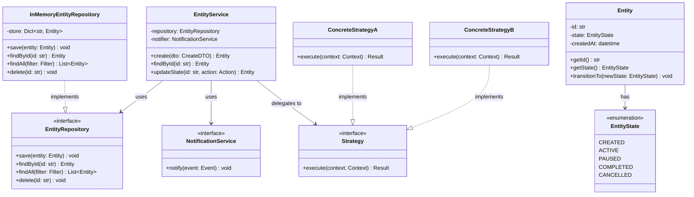
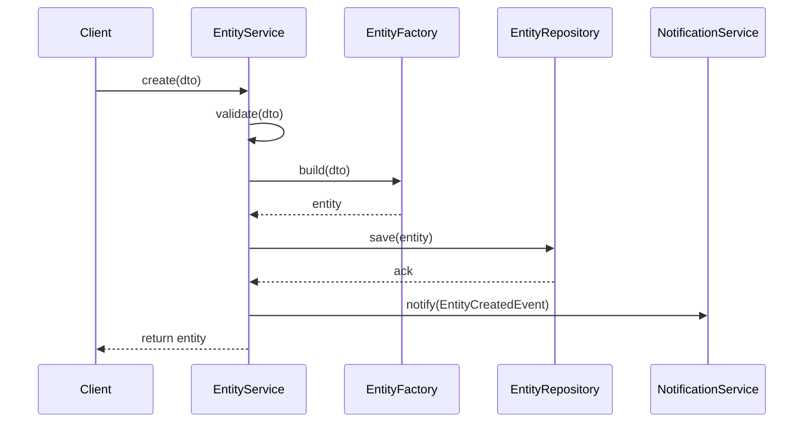
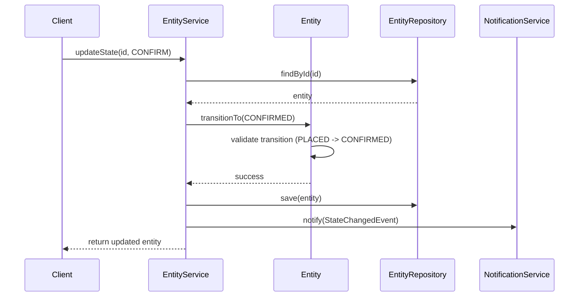
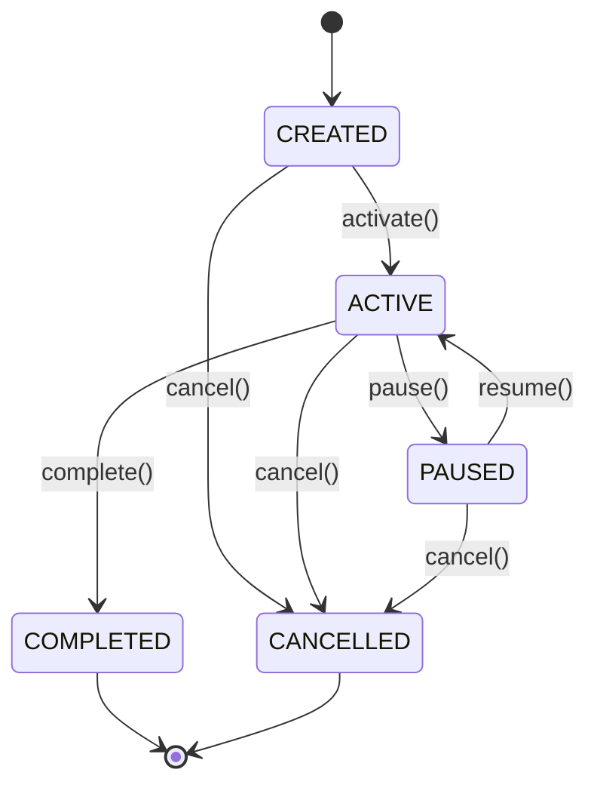

# Low-Level Design: [System Name]

> **How to use this template:** Copy this file, replace `[System Name]` with your system,
> and fill in each section. LLD interviews focus on object-oriented design, SOLID principles,
> design patterns, and clean code. A typical round is 45-60 minutes: spend 5-10 min on
> requirements, 10 min on class design, 10 min on patterns and flows, 15 min on code, and
> 5-10 min on extensibility and edge cases.

---

## 1. Requirements

### 1.1 Functional Requirements

- FR-1: ...
- FR-2: ...
- FR-3: ...

### 1.2 Constraints & Assumptions

- The system runs as a single process (no distributed concerns).
- Concurrency model: single-threaded / multi-threaded (specify).
- Persistence: in-memory only / backed by a database (specify).
- Expected scale: number of entities, operations per second, etc.

> **Guidance:** In LLD interviews, scope is smaller than HLD. Focus on the core domain
> objects and their interactions. Ask clarifying questions like: "Should I support
> multiple payment methods?" or "Is the parking lot multi-floor?"

---

## 2. Use Cases

List the primary use cases as actor-action pairs.

| #  | Actor    | Action                          | Outcome                        |
|----|----------|---------------------------------|--------------------------------|
| UC-1 | User   | Creates a new [entity]          | Entity is stored, ID returned  |
| UC-2 | User   | Searches for [entity] by criteria | Matching list returned        |
| UC-3 | Admin  | Updates [entity] state          | State transition executed      |
| UC-4 | System | Triggers scheduled [action]     | Side effects processed         |

> **Guidance:** Keep it to 4-6 use cases. Each one will map to a method or flow later.

---

## 3. Core Classes & Interfaces

### 3.1 Class Diagram



### 3.2 Class Descriptions

| Class / Interface         | Responsibility                                            | Pattern        |
|---------------------------|-----------------------------------------------------------|----------------|
| `EntityService`           | Orchestrates business logic, validates input               | Facade         |
| `Entity`                  | Core domain object, owns state transitions                 | Domain Model   |
| `EntityState`             | Enum of valid states                                       | Enumeration    |
| `EntityRepository`        | Abstract persistence contract                              | Repository     |
| `InMemoryEntityRepository`| In-memory implementation for interviews / testing          | Repository     |
| `NotificationService`     | Abstraction for sending notifications on state changes     | Observer       |
| `Strategy` / `Concrete*`  | Pluggable algorithm (pricing, matching, routing, etc.)     | Strategy       |

> **Guidance:** Favour interfaces over concrete classes at boundaries. This makes the
> design testable and satisfies the Dependency Inversion Principle.

---

## 4. Design Patterns Used

| Pattern    | Where Applied                  | Why                                              |
|------------|--------------------------------|--------------------------------------------------|
| Strategy   | Algorithm selection            | Swap algorithms at runtime without changing callers|
| Observer   | State change notifications     | Decouple domain logic from side effects           |
| Factory    | Entity creation                | Centralise complex construction logic             |
| State      | Entity state transitions       | Each state encapsulates its own transition rules  |
| Repository | Data access                    | Abstract storage details behind an interface      |
| Singleton  | Configuration / registry       | Ensure one shared instance (use sparingly)        |

### 4.1 Strategy Pattern Example

```
Context: A ride-sharing app needs different pricing strategies (surge, flat, distance-based).

Instead of:
    if pricing_type == "surge": ...
    elif pricing_type == "flat": ...

Use:
    pricing_strategy.calculate(ride_context)

Where pricing_strategy is injected and implements PricingStrategy interface.
```

### 4.2 State Pattern Example

```
Context: An order can be in states: PLACED -> CONFIRMED -> SHIPPED -> DELIVERED / CANCELLED.

Each state is a class with an allowed set of transitions.
PLACED.confirm() -> CONFIRMED   (valid)
PLACED.ship()    -> ERROR        (invalid, must confirm first)
```

> **Guidance:** Name the pattern, explain where it applies, and justify *why* it
> helps. Interviewers do not want pattern-stuffing; they want thoughtful application.

---

## 5. Key Flows

### 5.1 Create Flow



### 5.2 State Transition Flow



> **Guidance:** Draw one flow per major use case. Show method-level calls, not
> HTTP requests. Keep the focus on object interactions.

---

## 6. State Diagrams



### State Transition Table

| Current State | Event        | Next State  | Guard Condition            |
|---------------|-------------|-------------|----------------------------|
| CREATED       | activate()  | ACTIVE      | All required fields set    |
| ACTIVE        | pause()     | PAUSED      | None                       |
| PAUSED        | resume()    | ACTIVE      | None                       |
| ACTIVE        | complete()  | COMPLETED   | All sub-tasks done         |
| CREATED       | cancel()    | CANCELLED   | None                       |
| ACTIVE        | cancel()    | CANCELLED   | None                       |
| PAUSED        | cancel()    | CANCELLED   | None                       |

> **Guidance:** Every object that can change state deserves a state diagram. The table
> format is useful for complex transitions with guard conditions.

---

## 7. Code Skeleton

Below is a Python skeleton. Replace placeholder names with your domain objects.

```python
from abc import ABC, abstractmethod
from enum import Enum
from datetime import datetime
from dataclasses import dataclass, field
from typing import List, Optional, Dict
import uuid


# ── Enums ────────────────────────────────────────────────────────────

class EntityState(Enum):
    CREATED = "CREATED"
    ACTIVE = "ACTIVE"
    PAUSED = "PAUSED"
    COMPLETED = "COMPLETED"
    CANCELLED = "CANCELLED"


# ── Domain Model ─────────────────────────────────────────────────────

VALID_TRANSITIONS: Dict[EntityState, List[EntityState]] = {
    EntityState.CREATED: [EntityState.ACTIVE, EntityState.CANCELLED],
    EntityState.ACTIVE: [EntityState.PAUSED, EntityState.COMPLETED, EntityState.CANCELLED],
    EntityState.PAUSED: [EntityState.ACTIVE, EntityState.CANCELLED],
    EntityState.COMPLETED: [],
    EntityState.CANCELLED: [],
}


@dataclass
class Entity:
    id: str = field(default_factory=lambda: str(uuid.uuid4()))
    state: EntityState = EntityState.CREATED
    created_at: datetime = field(default_factory=datetime.utcnow)

    def transition_to(self, new_state: EntityState) -> None:
        if new_state not in VALID_TRANSITIONS[self.state]:
            raise ValueError(
                f"Invalid transition: {self.state.value} -> {new_state.value}"
            )
        self.state = new_state


# ── Repository Interface ─────────────────────────────────────────────

class EntityRepository(ABC):
    @abstractmethod
    def save(self, entity: Entity) -> None: ...

    @abstractmethod
    def find_by_id(self, entity_id: str) -> Optional[Entity]: ...

    @abstractmethod
    def find_all(self) -> List[Entity]: ...

    @abstractmethod
    def delete(self, entity_id: str) -> None: ...


class InMemoryEntityRepository(EntityRepository):
    def __init__(self):
        self._store: Dict[str, Entity] = {}

    def save(self, entity: Entity) -> None:
        self._store[entity.id] = entity

    def find_by_id(self, entity_id: str) -> Optional[Entity]:
        return self._store.get(entity_id)

    def find_all(self) -> List[Entity]:
        return list(self._store.values())

    def delete(self, entity_id: str) -> None:
        self._store.pop(entity_id, None)


# ── Strategy Interface ───────────────────────────────────────────────

class Strategy(ABC):
    @abstractmethod
    def execute(self, context: dict) -> dict: ...


class ConcreteStrategyA(Strategy):
    def execute(self, context: dict) -> dict:
        # Implement algorithm A
        return {"result": "strategy_a_output"}


class ConcreteStrategyB(Strategy):
    def execute(self, context: dict) -> dict:
        # Implement algorithm B
        return {"result": "strategy_b_output"}


# ── Observer / Notification ──────────────────────────────────────────

class Event:
    def __init__(self, event_type: str, payload: dict):
        self.event_type = event_type
        self.payload = payload


class NotificationService(ABC):
    @abstractmethod
    def notify(self, event: Event) -> None: ...


class LoggingNotificationService(NotificationService):
    def notify(self, event: Event) -> None:
        print(f"[EVENT] {event.event_type}: {event.payload}")


# ── Service (Facade) ─────────────────────────────────────────────────

class EntityService:
    def __init__(
        self,
        repository: EntityRepository,
        notifier: NotificationService,
        strategy: Strategy,
    ):
        self._repo = repository
        self._notifier = notifier
        self._strategy = strategy

    def create(self, **kwargs) -> Entity:
        entity = Entity(**kwargs)
        self._repo.save(entity)
        self._notifier.notify(Event("ENTITY_CREATED", {"id": entity.id}))
        return entity

    def get(self, entity_id: str) -> Entity:
        entity = self._repo.find_by_id(entity_id)
        if entity is None:
            raise KeyError(f"Entity {entity_id} not found")
        return entity

    def update_state(self, entity_id: str, new_state: EntityState) -> Entity:
        entity = self.get(entity_id)
        entity.transition_to(new_state)
        self._repo.save(entity)
        self._notifier.notify(
            Event("STATE_CHANGED", {"id": entity.id, "new_state": new_state.value})
        )
        return entity

    def run_strategy(self, context: dict) -> dict:
        return self._strategy.execute(context)
```

> **Guidance:** In an interview, write the class signatures and key methods first.
> Fill in method bodies only for the most interesting logic (state transitions,
> strategy dispatch). Skip boilerplate getters/setters.

---

## 8. Extensibility & Edge Cases

### 8.1 Extensibility Checklist

| Change Request                         | How the Design Handles It                     |
|----------------------------------------|-----------------------------------------------|
| Add a new state                        | Add enum value + update transition map         |
| Add a new strategy / algorithm         | Implement `Strategy` interface, inject it      |
| Switch from in-memory to DB storage    | Implement `EntityRepository` with DB driver    |
| Add a new notification channel         | Implement `NotificationService` interface      |
| Support concurrent access              | Add locking in repository or use thread-safe structures |

### 8.2 Edge Cases to Address

- What happens if `transition_to` is called with the current state?
- What if two threads call `update_state` on the same entity simultaneously?
- What if the repository `find_by_id` returns `None`?
- What if a notification fails -- should the state change be rolled back?
- How do you handle idempotent operations (double-create, double-cancel)?

> **Guidance:** Mentioning edge cases proactively signals senior-level thinking.
> You do not need to solve all of them, but you should acknowledge them.

---

## 9. Interview Tips

### What Interviewers Look For

1. **SOLID principles** -- Is each class single-responsibility? Are interfaces lean?
2. **Design patterns** -- Are patterns applied where they genuinely help?
3. **Extensibility** -- Can the design accommodate new requirements with minimal changes?
4. **Code clarity** -- Are names meaningful? Is the structure easy to follow?
5. **Trade-off awareness** -- Can you explain why you chose composition over inheritance?

### Approach for a 45-Minute LLD Round

1. **Minutes 0-5:** Clarify requirements, list use cases.
2. **Minutes 5-15:** Draw the class diagram on the whiteboard.
3. **Minutes 15-25:** Walk through 1-2 key flows as sequence diagrams.
4. **Minutes 25-40:** Write the code skeleton, focusing on core logic.
5. **Minutes 40-45:** Discuss extensibility, edge cases, and testing.

### Common Follow-up Questions

- "How would you add [new feature] without modifying existing classes?"
- "What if we need to support multiple [strategies / types / formats]?"
- "How would you unit test this service?"
- "What happens under concurrent access?"
- "Which SOLID principle does this part of your design follow?"

### Common Pitfalls

- Drawing a class diagram that is really a database schema (tables != classes).
- Using inheritance where composition is more appropriate.
- Over-using Singleton (it introduces global state and hurts testability).
- Writing too much boilerplate code instead of focusing on interesting logic.
- Forgetting to define interfaces at system boundaries.
- Not mentioning testing strategy (dependency injection enables mocking).

---

> **Checklist before finishing your design:**
> - [ ] Requirements clarified and scoped.
> - [ ] Class diagram drawn with relationships (association, composition, inheritance).
> - [ ] At least 2 design patterns identified and justified.
> - [ ] State diagram for any stateful objects.
> - [ ] Code skeleton covers core domain logic.
> - [ ] Edge cases acknowledged.
> - [ ] Extensibility demonstrated for at least one likely change request.
