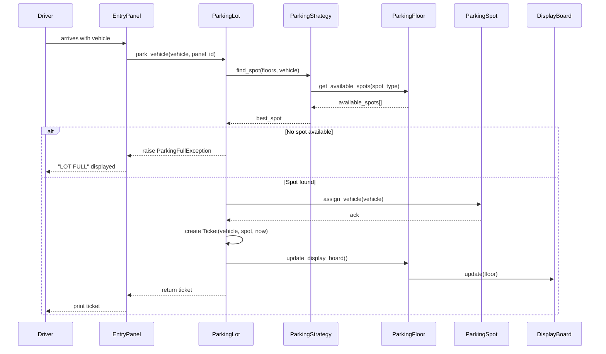
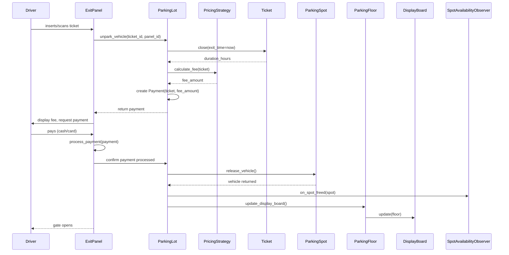
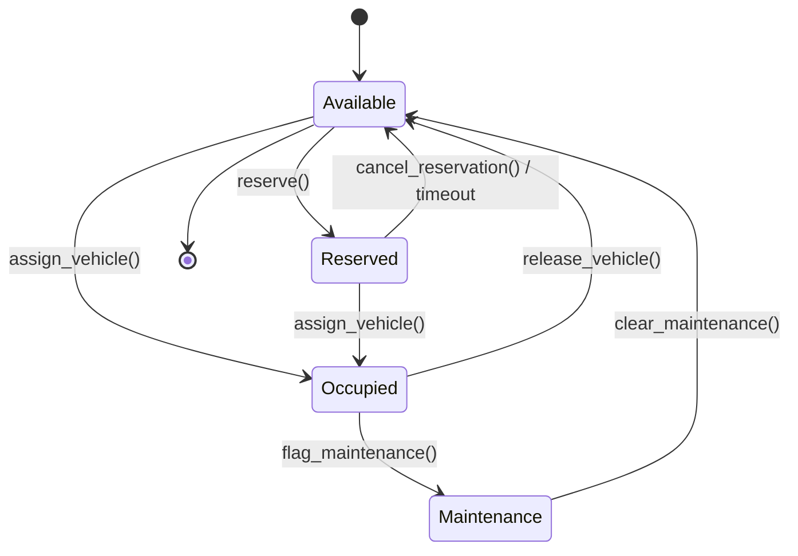
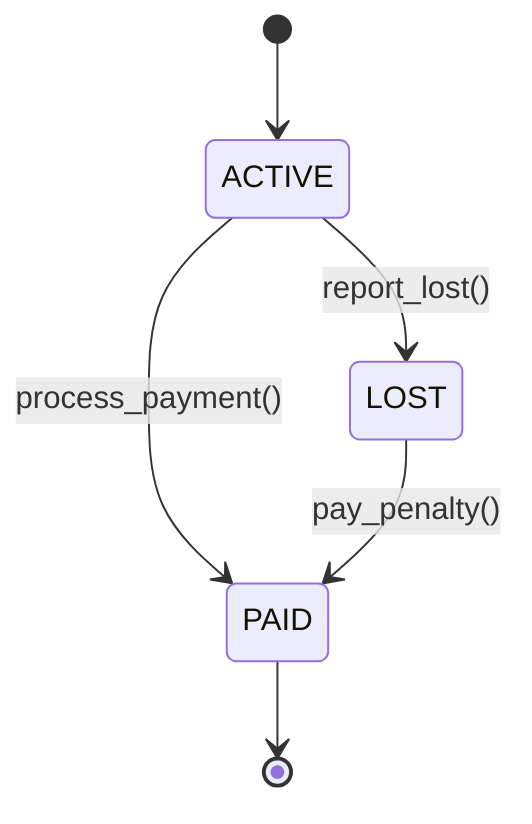

# Low-Level Design: Parking Lot System

> A multi-floor parking lot system that supports different vehicle types, multiple
> entry/exit points, pluggable pricing and spot-assignment strategies, and real-time
> availability tracking. This is one of the most frequently asked LLD interview
> questions -- master it and you will have a reusable template for many other problems.

---

## 1. Requirements

### 1.1 Functional Requirements

- **FR-1:** Park a vehicle (car, motorcycle, truck) in an appropriately sized spot.
- **FR-2:** Unpark a vehicle and free the spot for future use.
- **FR-3:** Find available spots filtered by vehicle type and floor.
- **FR-4:** Calculate the parking fee based on duration (hourly or daily rate).
- **FR-5:** Support multiple floors, each containing spots of different sizes.
- **FR-6:** Support multiple entry and exit points (panels).
- **FR-7:** Generate a ticket on entry and process payment on exit.
- **FR-8:** Display real-time availability on each floor.

### 1.2 Constraints & Assumptions

- The system runs as a single process (no distributed concerns).
- Concurrency model: multi-threaded -- multiple vehicles can enter/exit simultaneously.
- Persistence: in-memory (interview scope); easily swappable via Repository pattern.
- Expected scale: 5 floors, ~500 spots per floor, ~2500 total spots.
- Each spot can hold exactly one vehicle at a time.
- A vehicle can only occupy one spot at a time.
- Trucks require large spots; cars fit in compact or large; motorcycles fit in motorcycle spots.

> **Guidance:** In the interview, start by asking: "How many floors? How many entry
> points? Do we need to support reservations or valet?" Scope it down quickly.

---

## 2. Use Cases

| #    | Actor   | Action                              | Outcome                                      |
|------|---------|-------------------------------------|-----------------------------------------------|
| UC-1 | Driver  | Drives to entry panel               | System finds a spot, generates ticket         |
| UC-2 | Driver  | Drives to exit panel with ticket    | Fee is calculated, payment processed, spot freed |
| UC-3 | Driver  | Checks availability on display board| Real-time spot counts shown per floor         |
| UC-4 | System  | Assigns spot to incoming vehicle    | Nearest/best spot selected via strategy       |
| UC-5 | Admin   | Changes pricing strategy            | New pricing takes effect for future tickets   |
| UC-6 | System  | Notifies waiting drivers            | Observer fires when a spot becomes available  |

> **Guidance:** Keep it to 4-6 use cases. Each one maps to a method or flow later.

---

## 3. Core Classes & Interfaces

### 3.1 Class Diagram

```mermaid
classDiagram
    class ParkingLot {
        -instance: ParkingLot$
        -floors: List~ParkingFloor~
        -entry_panels: List~EntryPanel~
        -exit_panels: List~ExitPanel~
        -parking_strategy: ParkingStrategy
        -pricing_strategy: PricingStrategy
        -active_tickets: Dict~str, Ticket~
        +get_instance()$ ParkingLot
        +find_available_spot(vehicle: Vehicle) ParkingSpot
        +park_vehicle(vehicle: Vehicle, entry_panel_id: str) Ticket
        +unpark_vehicle(ticket_id: str, exit_panel_id: str) Payment
        +get_availability() Dict
        +set_parking_strategy(strategy: ParkingStrategy) void
        +set_pricing_strategy(strategy: PricingStrategy) void
    }

    class ParkingFloor {
        -floor_number: int
        -spots: List~ParkingSpot~
        -display_board: DisplayBoard
        +get_available_spots(spot_type: SpotType) List~ParkingSpot~
        +get_spot_count_by_type(spot_type: SpotType) int
        +update_display_board() void
    }

    class ParkingSpot {
        <<abstract>>
        #spot_id: str
        #spot_type: SpotType
        #floor_number: int
        #is_occupied: bool
        #vehicle: Vehicle
        +can_fit(vehicle: Vehicle) bool*
        +assign_vehicle(vehicle: Vehicle) void
        +release_vehicle() Vehicle
        +is_available() bool
    }

    class CompactSpot {
        +can_fit(vehicle: Vehicle) bool
    }

    class LargeSpot {
        +can_fit(vehicle: Vehicle) bool
    }

    class MotorcycleSpot {
        +can_fit(vehicle: Vehicle) bool
    }

    class HandicappedSpot {
        +can_fit(vehicle: Vehicle) bool
    }

    class Vehicle {
        <<abstract>>
        #license_plate: str
        #vehicle_type: VehicleType
        +get_type() VehicleType
    }

    class Car {
    }

    class Truck {
    }

    class Motorcycle {
    }

    class Ticket {
        -ticket_id: str
        -vehicle: Vehicle
        -spot: ParkingSpot
        -entry_time: datetime
        -exit_time: datetime
        -entry_panel_id: str
        -status: TicketStatus
        +get_duration_hours() float
        +close(exit_time: datetime) void
    }

    class Payment {
        -payment_id: str
        -ticket: Ticket
        -amount: float
        -status: PaymentStatus
        -method: PaymentMethod
        -paid_at: datetime
        +process() bool
    }

    class ParkingStrategy {
        <<interface>>
        +find_spot(floors: List~ParkingFloor~, vehicle: Vehicle) ParkingSpot
    }

    class NearestFirstStrategy {
        +find_spot(floors: List~ParkingFloor~, vehicle: Vehicle) ParkingSpot
    }

    class EvenDistributionStrategy {
        +find_spot(floors: List~ParkingFloor~, vehicle: Vehicle) ParkingSpot
    }

    class PricingStrategy {
        <<interface>>
        +calculate_fee(ticket: Ticket) float
    }

    class HourlyPricing {
        -rates: Dict~VehicleType, float~
        +calculate_fee(ticket: Ticket) float
    }

    class FlatRatePricing {
        -daily_rate: Dict~VehicleType, float~
        +calculate_fee(ticket: Ticket) float
    }

    class ProgressivePricing {
        -tiers: List~PricingTier~
        +calculate_fee(ticket: Ticket) float
    }

    class EntryPanel {
        -panel_id: str
        +scan_vehicle(vehicle: Vehicle) Ticket
    }

    class ExitPanel {
        -panel_id: str
        +scan_ticket(ticket_id: str) Payment
        +process_payment(payment: Payment) bool
    }

    class DisplayBoard {
        -floor_number: int
        -available_compact: int
        -available_large: int
        -available_motorcycle: int
        -available_handicapped: int
        +update(floor: ParkingFloor) void
        +show() str
    }

    class SpotFactory {
        +create_spot(spot_type: SpotType, spot_id: str, floor: int)$ ParkingSpot
    }

    class SpotAvailabilityObserver {
        <<interface>>
        +on_spot_freed(spot: ParkingSpot) void
    }

    ParkingLot "1" *-- "1..*" ParkingFloor : contains
    ParkingLot "1" *-- "1..*" EntryPanel : has
    ParkingLot "1" *-- "1..*" ExitPanel : has
    ParkingLot --> ParkingStrategy : uses
    ParkingLot --> PricingStrategy : uses

    ParkingFloor "1" *-- "1..*" ParkingSpot : contains
    ParkingFloor "1" *-- "1" DisplayBoard : has

    CompactSpot --|> ParkingSpot : extends
    LargeSpot --|> ParkingSpot : extends
    MotorcycleSpot --|> ParkingSpot : extends
    HandicappedSpot --|> ParkingSpot : extends

    Car --|> Vehicle : extends
    Truck --|> Vehicle : extends
    Motorcycle --|> Vehicle : extends

    NearestFirstStrategy ..|> ParkingStrategy : implements
    EvenDistributionStrategy ..|> ParkingStrategy : implements

    HourlyPricing ..|> PricingStrategy : implements
    FlatRatePricing ..|> PricingStrategy : implements
    ProgressivePricing ..|> PricingStrategy : implements

    Ticket --> Vehicle : references
    Ticket --> ParkingSpot : references
    Payment --> Ticket : references

    SpotFactory ..> ParkingSpot : creates
    ParkingLot ..|> SpotAvailabilityObserver : notifies
```



### 3.2 Class Descriptions

| Class / Interface            | Responsibility                                                     | Pattern      |
|------------------------------|--------------------------------------------------------------------|--------------|
| `ParkingLot`                 | Central coordinator; manages floors, panels, strategies, tickets   | Singleton    |
| `ParkingFloor`               | Holds spots for one floor; tracks per-floor availability           | Composite    |
| `ParkingSpot` (abstract)     | Base class for all spot types; knows if it can fit a vehicle       | Template     |
| `CompactSpot`                | Fits cars and motorcycles                                          | --           |
| `LargeSpot`                  | Fits cars, trucks, and motorcycles                                 | --           |
| `MotorcycleSpot`             | Fits only motorcycles                                              | --           |
| `HandicappedSpot`            | Fits cars; reserved for handicapped permits                        | --           |
| `Vehicle` (abstract)         | Base class for all vehicle types                                   | --           |
| `Car`, `Truck`, `Motorcycle` | Concrete vehicle types with their own `VehicleType`                | --           |
| `Ticket`                     | Issued on entry; tracks vehicle, spot, entry/exit times            | Domain Model |
| `Payment`                    | Encapsulates fee, payment method, and status                       | Domain Model |
| `ParkingStrategy`            | Interface for spot-assignment algorithm                            | Strategy     |
| `NearestFirstStrategy`       | Assigns closest available spot (lowest floor, lowest spot id)      | Strategy     |
| `EvenDistributionStrategy`   | Distributes vehicles evenly across floors                          | Strategy     |
| `PricingStrategy`            | Interface for fee calculation algorithm                            | Strategy     |
| `HourlyPricing`              | Charges per hour based on vehicle type                             | Strategy     |
| `FlatRatePricing`            | Charges a flat daily rate regardless of duration                   | Strategy     |
| `ProgressivePricing`         | Tiered rates (e.g., first 2 hrs cheap, then more expensive)       | Strategy     |
| `EntryPanel`                 | Scans vehicle at entry; delegates to ParkingLot for spot + ticket  | --           |
| `ExitPanel`                  | Scans ticket at exit; calculates fee, processes payment            | --           |
| `DisplayBoard`               | Shows real-time availability for a floor                           | Observer     |
| `SpotFactory`                | Creates the correct ParkingSpot subclass from a SpotType enum      | Factory      |
| `SpotAvailabilityObserver`   | Callback interface for spot-freed events                           | Observer     |

> **Guidance:** Favour interfaces over concrete classes at boundaries. This makes the
> design testable and satisfies the Dependency Inversion Principle.

---

## 4. Design Patterns Used

| Pattern    | Where Applied                               | Why                                                          |
|------------|---------------------------------------------|--------------------------------------------------------------|
| Strategy   | `PricingStrategy`, `ParkingStrategy`        | Swap pricing/assignment algorithms at runtime without changing callers |
| Factory    | `SpotFactory.create_spot()`                 | Centralise spot creation; caller does not need to know subclass |
| Singleton  | `ParkingLot.get_instance()`                 | Exactly one parking lot instance in the process               |
| Observer   | `SpotAvailabilityObserver`, `DisplayBoard`  | Decouple spot state changes from UI updates and notifications |
| Template   | `ParkingSpot.can_fit()` abstract method     | Subclasses define fitting rules; base class handles common logic |

### 4.1 Strategy Pattern -- Pricing

```
Context: The parking lot needs to support hourly, flat-rate, and progressive pricing.

Instead of:
    if pricing_type == "hourly":
        fee = hours * rate
    elif pricing_type == "flat":
        fee = daily_rate
    elif pricing_type == "progressive":
        fee = calculate_tiers(hours)

Use:
    fee = self._pricing_strategy.calculate_fee(ticket)

Where _pricing_strategy is injected and implements the PricingStrategy interface.
Adding a new pricing model (e.g., WeekendPricing) requires only a new class --
zero changes to ParkingLot or ExitPanel.
```

### 4.2 Strategy Pattern -- Spot Assignment

```
Context: Different lots may prefer different assignment policies.

NearestFirstStrategy: Scans floors bottom-up, returns the first available spot.
    Good for driver convenience (less walking).

EvenDistributionStrategy: Picks the floor with the most available spots.
    Good for even wear-and-tear and ventilation balance.

Both implement ParkingStrategy.find_spot() -- the ParkingLot is unaware of
which algorithm is running.
```

### 4.3 Factory Pattern -- Spot Creation

```
Context: When initialising floors, we read a config like:
    [{"type": "COMPACT", "count": 100}, {"type": "LARGE", "count": 50}, ...]

SpotFactory.create_spot(SpotType.COMPACT, spot_id, floor_number)
    returns a CompactSpot instance.

This avoids a long if-elif chain in the floor initialisation code and makes
adding new spot types (e.g., ElectricSpot) a one-line addition to the factory.
```

### 4.4 Observer Pattern -- Spot Availability

```
Context: When a vehicle leaves and a spot is freed, several things need to happen:
    1. The DisplayBoard for that floor must update its counts.
    2. Waiting drivers (if lot was full) should be notified.
    3. Analytics/logging may want to record the event.

Instead of the ParkingSpot calling all of these directly, it fires an event.
Observers subscribe and react independently. Adding a new observer (e.g.,
MobileAppNotifier) requires zero changes to ParkingSpot.
```

> **Guidance:** Name the pattern, explain where it applies, and justify *why* it
> helps. Interviewers do not want pattern-stuffing; they want thoughtful application.

---

## 5. Key Flows

### 5.1 Vehicle Entry Flow



### 5.2 Vehicle Exit Flow



> **Guidance:** Draw one flow per major use case. Show method-level calls, not
> HTTP requests. Keep the focus on object interactions.

---

## 6. State Diagrams

### 6.1 Parking Spot States



### 6.2 Spot State Transition Table

| Current State | Event                  | Next State  | Guard Condition                    |
|---------------|------------------------|-------------|------------------------------------|
| Available     | assign_vehicle()       | Occupied    | vehicle.type fits spot.type        |
| Available     | reserve()              | Reserved    | valid reservation request          |
| Reserved      | assign_vehicle()       | Occupied    | vehicle matches reservation        |
| Reserved      | cancel_reservation()   | Available   | none                               |
| Reserved      | timeout (30 min)       | Available   | reservation expired                |
| Occupied      | release_vehicle()      | Available   | payment completed                  |
| Occupied      | flag_maintenance()     | Maintenance | admin action                       |
| Maintenance   | clear_maintenance()    | Available   | admin action                       |

### 6.3 Ticket States



---

## 7. Code Skeleton

```python
from abc import ABC, abstractmethod
from enum import Enum
from datetime import datetime
from dataclasses import dataclass, field
from typing import List, Optional, Dict
from threading import Lock
import uuid
import math


# ── Enums ────────────────────────────────────────────────────────────

class VehicleType(Enum):
    CAR = "CAR"
    TRUCK = "TRUCK"
    MOTORCYCLE = "MOTORCYCLE"


class SpotType(Enum):
    COMPACT = "COMPACT"
    LARGE = "LARGE"
    MOTORCYCLE = "MOTORCYCLE"
    HANDICAPPED = "HANDICAPPED"


class TicketStatus(Enum):
    ACTIVE = "ACTIVE"
    PAID = "PAID"
    LOST = "LOST"


class PaymentStatus(Enum):
    PENDING = "PENDING"
    COMPLETED = "COMPLETED"
    FAILED = "FAILED"


class PaymentMethod(Enum):
    CASH = "CASH"
    CREDIT_CARD = "CREDIT_CARD"
    UPI = "UPI"


class SpotState(Enum):
    AVAILABLE = "AVAILABLE"
    OCCUPIED = "OCCUPIED"
    RESERVED = "RESERVED"
    MAINTENANCE = "MAINTENANCE"


# ── Vehicles ─────────────────────────────────────────────────────────

class Vehicle(ABC):
    def __init__(self, license_plate: str, vehicle_type: VehicleType):
        self._license_plate = license_plate
        self._vehicle_type = vehicle_type

    @property
    def license_plate(self) -> str:
        return self._license_plate

    @property
    def vehicle_type(self) -> VehicleType:
        return self._vehicle_type


class Car(Vehicle):
    def __init__(self, license_plate: str):
        super().__init__(license_plate, VehicleType.CAR)


class Truck(Vehicle):
    def __init__(self, license_plate: str):
        super().__init__(license_plate, VehicleType.TRUCK)


class Motorcycle(Vehicle):
    def __init__(self, license_plate: str):
        super().__init__(license_plate, VehicleType.MOTORCYCLE)


# ── Parking Spots ────────────────────────────────────────────────────

class ParkingSpot(ABC):
    def __init__(self, spot_id: str, spot_type: SpotType, floor_number: int):
        self._spot_id = spot_id
        self._spot_type = spot_type
        self._floor_number = floor_number
        self._state = SpotState.AVAILABLE
        self._vehicle: Optional[Vehicle] = None
        self._lock = Lock()

    @property
    def spot_id(self) -> str:
        return self._spot_id

    @property
    def spot_type(self) -> SpotType:
        return self._spot_type

    @property
    def floor_number(self) -> int:
        return self._floor_number

    def is_available(self) -> bool:
        return self._state == SpotState.AVAILABLE

    @abstractmethod
    def can_fit(self, vehicle: Vehicle) -> bool:
        """Return True if this spot can accommodate the given vehicle."""
        ...

    def assign_vehicle(self, vehicle: Vehicle) -> None:
        with self._lock:
            if not self.is_available() and self._state != SpotState.RESERVED:
                raise ValueError(f"Spot {self._spot_id} is not available")
            if not self.can_fit(vehicle):
                raise ValueError(
                    f"Vehicle type {vehicle.vehicle_type} cannot fit in {self._spot_type}"
                )
            self._vehicle = vehicle
            self._state = SpotState.OCCUPIED

    def release_vehicle(self) -> Optional[Vehicle]:
        with self._lock:
            if self._state != SpotState.OCCUPIED:
                raise ValueError(f"Spot {self._spot_id} is not occupied")
            vehicle = self._vehicle
            self._vehicle = None
            self._state = SpotState.AVAILABLE
            return vehicle


class CompactSpot(ParkingSpot):
    def __init__(self, spot_id: str, floor_number: int):
        super().__init__(spot_id, SpotType.COMPACT, floor_number)

    def can_fit(self, vehicle: Vehicle) -> bool:
        return vehicle.vehicle_type in (VehicleType.CAR, VehicleType.MOTORCYCLE)


class LargeSpot(ParkingSpot):
    def __init__(self, spot_id: str, floor_number: int):
        super().__init__(spot_id, SpotType.LARGE, floor_number)

    def can_fit(self, vehicle: Vehicle) -> bool:
        return vehicle.vehicle_type in (
            VehicleType.CAR, VehicleType.TRUCK, VehicleType.MOTORCYCLE
        )


class MotorcycleSpot(ParkingSpot):
    def __init__(self, spot_id: str, floor_number: int):
        super().__init__(spot_id, SpotType.MOTORCYCLE, floor_number)

    def can_fit(self, vehicle: Vehicle) -> bool:
        return vehicle.vehicle_type == VehicleType.MOTORCYCLE


class HandicappedSpot(ParkingSpot):
    def __init__(self, spot_id: str, floor_number: int):
        super().__init__(spot_id, SpotType.HANDICAPPED, floor_number)

    def can_fit(self, vehicle: Vehicle) -> bool:
        return vehicle.vehicle_type == VehicleType.CAR


# ── Spot Factory ─────────────────────────────────────────────────────

class SpotFactory:
    _BUILDERS = {
        SpotType.COMPACT: CompactSpot,
        SpotType.LARGE: LargeSpot,
        SpotType.MOTORCYCLE: MotorcycleSpot,
        SpotType.HANDICAPPED: HandicappedSpot,
    }

    @staticmethod
    def create_spot(spot_type: SpotType, spot_id: str, floor_number: int) -> ParkingSpot:
        builder = SpotFactory._BUILDERS.get(spot_type)
        if builder is None:
            raise ValueError(f"Unknown spot type: {spot_type}")
        return builder(spot_id, floor_number)


# ── Ticket ───────────────────────────────────────────────────────────

@dataclass
class Ticket:
    ticket_id: str = field(default_factory=lambda: str(uuid.uuid4()))
    vehicle: Vehicle = field(default=None)
    spot: ParkingSpot = field(default=None)
    entry_time: datetime = field(default_factory=datetime.utcnow)
    exit_time: Optional[datetime] = None
    entry_panel_id: str = ""
    status: TicketStatus = TicketStatus.ACTIVE

    def get_duration_hours(self) -> float:
        end = self.exit_time or datetime.utcnow()
        delta = end - self.entry_time
        return delta.total_seconds() / 3600

    def close(self, exit_time: datetime) -> None:
        self.exit_time = exit_time
        self.status = TicketStatus.PAID


# ── Payment ──────────────────────────────────────────────────────────

@dataclass
class Payment:
    payment_id: str = field(default_factory=lambda: str(uuid.uuid4()))
    ticket: Ticket = field(default=None)
    amount: float = 0.0
    status: PaymentStatus = PaymentStatus.PENDING
    method: PaymentMethod = PaymentMethod.CASH
    paid_at: Optional[datetime] = None

    def process(self) -> bool:
        # In a real system this would call a payment gateway.
        self.status = PaymentStatus.COMPLETED
        self.paid_at = datetime.utcnow()
        return True


# ── Pricing Strategies ───────────────────────────────────────────────

class PricingStrategy(ABC):
    @abstractmethod
    def calculate_fee(self, ticket: Ticket) -> float:
        ...


class HourlyPricing(PricingStrategy):
    """Charges per hour (rounded up). Different rate per vehicle type."""

    def __init__(self, rates: Optional[Dict[VehicleType, float]] = None):
        self._rates = rates or {
            VehicleType.MOTORCYCLE: 10.0,
            VehicleType.CAR: 20.0,
            VehicleType.TRUCK: 40.0,
        }

    def calculate_fee(self, ticket: Ticket) -> float:
        hours = math.ceil(ticket.get_duration_hours())
        rate = self._rates.get(ticket.vehicle.vehicle_type, 20.0)
        return hours * rate


class FlatRatePricing(PricingStrategy):
    """Charges a flat daily rate regardless of how many hours."""

    def __init__(self, daily_rates: Optional[Dict[VehicleType, float]] = None):
        self._daily_rates = daily_rates or {
            VehicleType.MOTORCYCLE: 50.0,
            VehicleType.CAR: 100.0,
            VehicleType.TRUCK: 200.0,
        }

    def calculate_fee(self, ticket: Ticket) -> float:
        days = math.ceil(ticket.get_duration_hours() / 24) or 1
        rate = self._daily_rates.get(ticket.vehicle.vehicle_type, 100.0)
        return days * rate


class ProgressivePricing(PricingStrategy):
    """First N hours at base rate, then higher rate after that."""

    def __init__(
        self,
        base_hours: int = 2,
        base_rate: float = 30.0,
        extra_rate: float = 50.0,
    ):
        self._base_hours = base_hours
        self._base_rate = base_rate
        self._extra_rate = extra_rate

    def calculate_fee(self, ticket: Ticket) -> float:
        hours = math.ceil(ticket.get_duration_hours())
        if hours <= self._base_hours:
            return hours * self._base_rate
        base_cost = self._base_hours * self._base_rate
        extra_cost = (hours - self._base_hours) * self._extra_rate
        return base_cost + extra_cost


# ── Parking Strategies ───────────────────────────────────────────────

class ParkingStrategy(ABC):
    @abstractmethod
    def find_spot(
        self, floors: List["ParkingFloor"], vehicle: Vehicle
    ) -> Optional[ParkingSpot]:
        ...


class NearestFirstStrategy(ParkingStrategy):
    """Assign the first available spot on the lowest floor."""

    def find_spot(
        self, floors: List["ParkingFloor"], vehicle: Vehicle
    ) -> Optional[ParkingSpot]:
        for floor in sorted(floors, key=lambda f: f.floor_number):
            for spot in floor.spots:
                if spot.is_available() and spot.can_fit(vehicle):
                    return spot
        return None


class EvenDistributionStrategy(ParkingStrategy):
    """Pick the floor with the most available spots to balance load."""

    def find_spot(
        self, floors: List["ParkingFloor"], vehicle: Vehicle
    ) -> Optional[ParkingSpot]:
        best_floor = None
        max_available = -1

        for floor in floors:
            available = [
                s for s in floor.spots if s.is_available() and s.can_fit(vehicle)
            ]
            if len(available) > max_available:
                max_available = len(available)
                best_floor = floor

        if best_floor is None or max_available == 0:
            return None

        for spot in best_floor.spots:
            if spot.is_available() and spot.can_fit(vehicle):
                return spot
        return None


# ── Observer ─────────────────────────────────────────────────────────

class SpotAvailabilityObserver(ABC):
    @abstractmethod
    def on_spot_freed(self, spot: ParkingSpot) -> None:
        ...


class DisplayBoard:
    """Shows live availability counts for a single floor."""

    def __init__(self, floor_number: int):
        self.floor_number = floor_number
        self.available_compact = 0
        self.available_large = 0
        self.available_motorcycle = 0
        self.available_handicapped = 0

    def update(self, floor: "ParkingFloor") -> None:
        self.available_compact = floor.get_spot_count_by_type(SpotType.COMPACT)
        self.available_large = floor.get_spot_count_by_type(SpotType.LARGE)
        self.available_motorcycle = floor.get_spot_count_by_type(SpotType.MOTORCYCLE)
        self.available_handicapped = floor.get_spot_count_by_type(SpotType.HANDICAPPED)

    def show(self) -> str:
        return (
            f"Floor {self.floor_number} | "
            f"Compact: {self.available_compact} | "
            f"Large: {self.available_large} | "
            f"Motorcycle: {self.available_motorcycle} | "
            f"Handicapped: {self.available_handicapped}"
        )


# ── Parking Floor ────────────────────────────────────────────────────

class ParkingFloor:
    def __init__(self, floor_number: int, spots: List[ParkingSpot]):
        self._floor_number = floor_number
        self._spots = spots
        self._display_board = DisplayBoard(floor_number)
        self._display_board.update(self)

    @property
    def floor_number(self) -> int:
        return self._floor_number

    @property
    def spots(self) -> List[ParkingSpot]:
        return self._spots

    def get_available_spots(self, spot_type: SpotType) -> List[ParkingSpot]:
        return [
            s for s in self._spots
            if s.is_available() and s.spot_type == spot_type
        ]

    def get_spot_count_by_type(self, spot_type: SpotType) -> int:
        return len(self.get_available_spots(spot_type))

    def update_display_board(self) -> None:
        self._display_board.update(self)

    @property
    def display_board(self) -> DisplayBoard:
        return self._display_board


# ── Entry & Exit Panels ─────────────────────────────────────────────

class EntryPanel:
    def __init__(self, panel_id: str, parking_lot: "ParkingLot"):
        self._panel_id = panel_id
        self._parking_lot = parking_lot

    def scan_vehicle(self, vehicle: Vehicle) -> Ticket:
        return self._parking_lot.park_vehicle(vehicle, self._panel_id)


class ExitPanel:
    def __init__(self, panel_id: str, parking_lot: "ParkingLot"):
        self._panel_id = panel_id
        self._parking_lot = parking_lot

    def scan_ticket(self, ticket_id: str) -> Payment:
        return self._parking_lot.unpark_vehicle(ticket_id, self._panel_id)

    @staticmethod
    def process_payment(payment: Payment) -> bool:
        return payment.process()


# ── Parking Lot (Singleton) ─────────────────────────────────────────

class ParkingLot:
    _instance: Optional["ParkingLot"] = None
    _lock = Lock()

    def __init__(
        self,
        floors: List[ParkingFloor],
        entry_panels: Optional[List[EntryPanel]] = None,
        exit_panels: Optional[List[ExitPanel]] = None,
        parking_strategy: Optional[ParkingStrategy] = None,
        pricing_strategy: Optional[PricingStrategy] = None,
    ):
        self._floors = floors
        self._entry_panels = entry_panels or []
        self._exit_panels = exit_panels or []
        self._parking_strategy = parking_strategy or NearestFirstStrategy()
        self._pricing_strategy = pricing_strategy or HourlyPricing()
        self._active_tickets: Dict[str, Ticket] = {}
        self._observers: List[SpotAvailabilityObserver] = []
        self._ticket_lock = Lock()

    @classmethod
    def get_instance(cls, **kwargs) -> "ParkingLot":
        if cls._instance is None:
            with cls._lock:
                if cls._instance is None:
                    cls._instance = cls(**kwargs)
        return cls._instance

    @classmethod
    def reset_instance(cls) -> None:
        """For testing only."""
        cls._instance = None

    # ── Strategy setters ─────────────────────────────────────────────

    def set_parking_strategy(self, strategy: ParkingStrategy) -> None:
        self._parking_strategy = strategy

    def set_pricing_strategy(self, strategy: PricingStrategy) -> None:
        self._pricing_strategy = strategy

    # ── Observer management ──────────────────────────────────────────

    def add_observer(self, observer: SpotAvailabilityObserver) -> None:
        self._observers.append(observer)

    def _notify_spot_freed(self, spot: ParkingSpot) -> None:
        for observer in self._observers:
            observer.on_spot_freed(spot)

    # ── Core operations ──────────────────────────────────────────────

    def find_available_spot(self, vehicle: Vehicle) -> Optional[ParkingSpot]:
        return self._parking_strategy.find_spot(self._floors, vehicle)

    def park_vehicle(self, vehicle: Vehicle, entry_panel_id: str) -> Ticket:
        spot = self.find_available_spot(vehicle)
        if spot is None:
            raise Exception("Parking lot is full for this vehicle type")

        spot.assign_vehicle(vehicle)

        ticket = Ticket(
            vehicle=vehicle,
            spot=spot,
            entry_panel_id=entry_panel_id,
        )

        with self._ticket_lock:
            self._active_tickets[ticket.ticket_id] = ticket

        # Update display board for the affected floor
        for floor in self._floors:
            if floor.floor_number == spot.floor_number:
                floor.update_display_board()
                break

        return ticket

    def unpark_vehicle(self, ticket_id: str, exit_panel_id: str) -> Payment:
        with self._ticket_lock:
            ticket = self._active_tickets.get(ticket_id)
            if ticket is None:
                raise KeyError(f"Ticket {ticket_id} not found")

        ticket.close(exit_time=datetime.utcnow())
        fee = self._pricing_strategy.calculate_fee(ticket)

        payment = Payment(ticket=ticket, amount=fee)

        # Release the spot
        spot = ticket.spot
        spot.release_vehicle()

        # Remove ticket from active list
        with self._ticket_lock:
            self._active_tickets.pop(ticket_id, None)

        # Notify observers
        self._notify_spot_freed(spot)

        # Update display board
        for floor in self._floors:
            if floor.floor_number == spot.floor_number:
                floor.update_display_board()
                break

        return payment

    def get_availability(self) -> Dict[int, Dict[str, int]]:
        result = {}
        for floor in self._floors:
            result[floor.floor_number] = {
                spot_type.value: floor.get_spot_count_by_type(spot_type)
                for spot_type in SpotType
            }
        return result


# ── Usage Example ────────────────────────────────────────────────────

def build_sample_lot() -> ParkingLot:
    """Build a 3-floor parking lot for demonstration."""
    ParkingLot.reset_instance()

    floors = []
    for floor_num in range(1, 4):
        spots: List[ParkingSpot] = []
        for i in range(1, 31):
            spots.append(SpotFactory.create_spot(SpotType.COMPACT, f"F{floor_num}-C{i}", floor_num))
        for i in range(1, 11):
            spots.append(SpotFactory.create_spot(SpotType.LARGE, f"F{floor_num}-L{i}", floor_num))
        for i in range(1, 11):
            spots.append(SpotFactory.create_spot(SpotType.MOTORCYCLE, f"F{floor_num}-M{i}", floor_num))
        for i in range(1, 6):
            spots.append(SpotFactory.create_spot(SpotType.HANDICAPPED, f"F{floor_num}-H{i}", floor_num))
        floors.append(ParkingFloor(floor_num, spots))

    lot = ParkingLot.get_instance(
        floors=floors,
        parking_strategy=NearestFirstStrategy(),
        pricing_strategy=HourlyPricing(),
    )
    return lot


if __name__ == "__main__":
    lot = build_sample_lot()

    car = Car("KA-01-AB-1234")
    ticket = lot.park_vehicle(car, entry_panel_id="EP-1")
    print(f"Parked: {ticket.ticket_id} at spot {ticket.spot.spot_id}")
    print(f"Availability: {lot.get_availability()}")

    payment = lot.unpark_vehicle(ticket.ticket_id, exit_panel_id="XP-1")
    print(f"Fee: {payment.amount}, Status: {payment.status}")
```

> **Guidance:** In an interview, write the class signatures and key methods first.
> Fill in method bodies only for the most interesting logic (state transitions,
> strategy dispatch, concurrency locks). Skip boilerplate getters/setters.

---

## 8. Extensibility & Edge Cases

### 8.1 Extensibility Checklist

| Change Request                            | How the Design Handles It                                      |
|-------------------------------------------|----------------------------------------------------------------|
| Add electric vehicle charging spots       | Create `ElectricSpot(ParkingSpot)`, add `ELECTRIC` to `SpotType`, register in `SpotFactory` |
| Add valet parking service                 | Create `ValetService` class that wraps `ParkingLot.park_vehicle()` with driver assignment |
| Add a reservation system                  | Use the `RESERVED` state in `ParkingSpot`; add a `Reservation` class with expiry timer |
| Support multiple parking rates (weekend)  | Implement a new `WeekendPricing(PricingStrategy)` and swap at runtime |
| Switch from in-memory to database         | Extract a `TicketRepository` interface; implement `DatabaseTicketRepository` |
| Add monthly pass / subscription           | Create `SubscriptionPricing(PricingStrategy)` that checks pass validity before charging |
| Add mobile app notifications              | Implement `SpotAvailabilityObserver` with push notification logic |
| Support multi-level handicapped priority  | Adjust `HandicappedSpot.can_fit()` to check permit level on the `Vehicle` |

### 8.2 Edge Cases to Address

- **Lot is full:** `find_available_spot()` returns `None`. The `EntryPanel` should display "LOT FULL" and refuse entry. Optionally queue the vehicle and notify via Observer when a spot frees up.
- **Lost ticket:** Charge the maximum daily rate. The `Ticket` status transitions to `LOST`, and a penalty fee is applied.
- **Concurrent entry at multiple panels:** The `Lock` in `ParkingSpot.assign_vehicle()` prevents double-assignment. Two threads may find the same spot, but only one will succeed; the other retries.
- **Vehicle already parked:** Before creating a ticket, check if a ticket with the same license plate already exists in `_active_tickets`. Reject duplicate entries.
- **Power failure / crash recovery:** In-memory state is lost. For production, persist tickets and spot states to a database and rebuild on startup.
- **Payment gateway failure:** `Payment.process()` returns `False`. The `ExitPanel` should retry or offer an alternative payment method. Do not release the spot until payment succeeds.
- **Oversized vehicle at compact spot:** `can_fit()` prevents this. A `Truck` will never be assigned to a `CompactSpot` because `CompactSpot.can_fit()` returns `False` for `TRUCK`.
- **Midnight rollover for daily pricing:** `FlatRatePricing` uses `math.ceil(hours / 24)` so a vehicle parked for 25 hours pays for 2 days.

> **Guidance:** Mentioning edge cases proactively signals senior-level thinking.
> You do not need to solve all of them, but you should acknowledge them.

---

## 9. Interview Tips

### What Interviewers Look For

1. **SOLID principles** -- Is each class single-responsibility? Are interfaces lean (ISP)? Do you depend on abstractions not concretions (DIP)?
2. **Design patterns** -- Are Strategy, Factory, Observer applied where they genuinely help? Can you explain the trade-offs?
3. **Extensibility** -- Can you add electric spots or weekend pricing without modifying existing classes (OCP)?
4. **Concurrency awareness** -- Do you mention locks, thread safety, race conditions at entry panels?
5. **Code clarity** -- Are names meaningful? Is the class hierarchy shallow and intuitive?

### Approach for a 45-Minute LLD Round

1. **Minutes 0-5:** Clarify requirements. Ask about vehicle types, floor count, pricing model, entry/exit points.
2. **Minutes 5-15:** Draw the class diagram. Start with `ParkingLot`, `ParkingFloor`, `ParkingSpot`, `Vehicle`. Add strategies and panels.
3. **Minutes 15-25:** Walk through the entry and exit flows as sequence diagrams.
4. **Minutes 25-40:** Write the code skeleton. Focus on `ParkingSpot.can_fit()`, `ParkingStrategy.find_spot()`, `PricingStrategy.calculate_fee()`, and the `park_vehicle` / `unpark_vehicle` orchestration.
5. **Minutes 40-45:** Discuss extensibility (electric spots, reservations) and edge cases (lot full, concurrent access, lost ticket).

### Common Follow-up Questions

- "How would you add a reservation system without modifying `ParkingLot`?"
  - Add a `ReservationService` that calls `spot.reserve()` and sets a timeout.
- "What if we need surge pricing during peak hours?"
  - Implement `SurgePricing(PricingStrategy)` that checks the current time.
- "How would you unit test the parking strategy?"
  - Inject a mock `ParkingFloor` list with known spots; assert the correct spot is returned.
- "What happens if two cars arrive at different entry panels simultaneously?"
  - The `Lock` in `assign_vehicle()` ensures only one car gets a given spot. The other car's assignment retries with the next available spot.
- "Why did you use the Strategy pattern instead of simple if-else?"
  - Open/Closed Principle: adding a new pricing model requires only a new class, not modifying existing code. It also makes each strategy independently testable.

### Common Pitfalls

- Drawing a database schema instead of a class diagram (tables are not classes).
- Making `ParkingSpot` a concrete class with a `type` field and a giant `if-elif` in `can_fit()`.
- Forgetting concurrency: two panels assigning the same spot simultaneously.
- Over-engineering: adding a microservice architecture for a single-process LLD problem.
- Not defining interfaces for `PricingStrategy` and `ParkingStrategy`, making the design rigid.
- Using inheritance where composition works better (e.g., making `ParkingLot` extend `ParkingFloor`).

---

> **Checklist before finishing your design:**
> - [x] Requirements clarified and scoped (vehicle types, floors, pricing, panels).
> - [x] Class diagram drawn with relationships (composition, inheritance, interface).
> - [x] At least 2 design patterns identified and justified (Strategy, Factory, Singleton, Observer).
> - [x] State diagram for ParkingSpot (Available, Occupied, Reserved, Maintenance).
> - [x] Sequence diagrams for entry and exit flows.
> - [x] Code skeleton covers core domain logic with type hints and concurrency.
> - [x] Edge cases acknowledged (lot full, lost ticket, concurrent access, payment failure).
> - [x] Extensibility demonstrated (electric spots, reservations, new pricing models).
