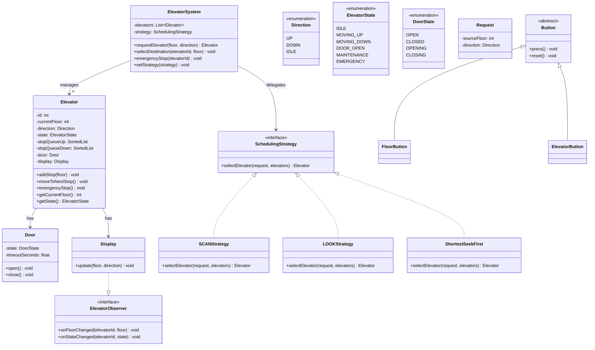
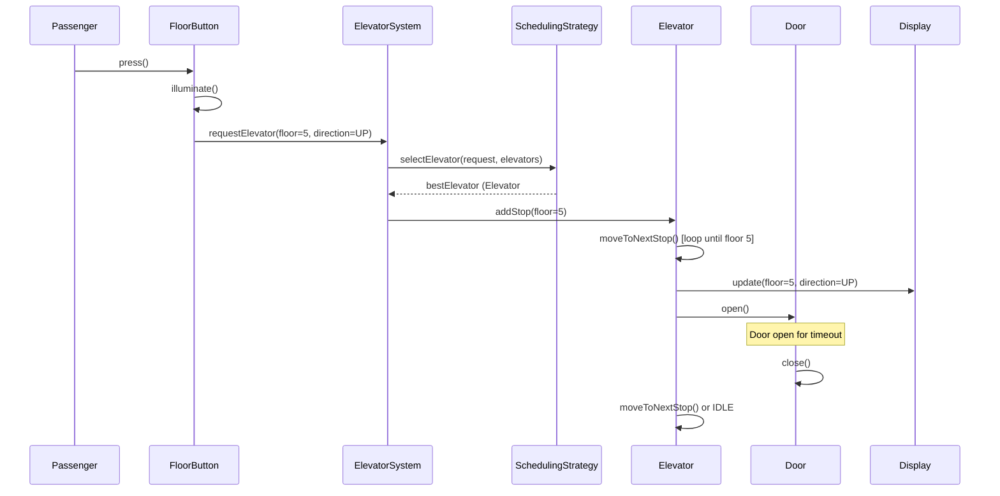
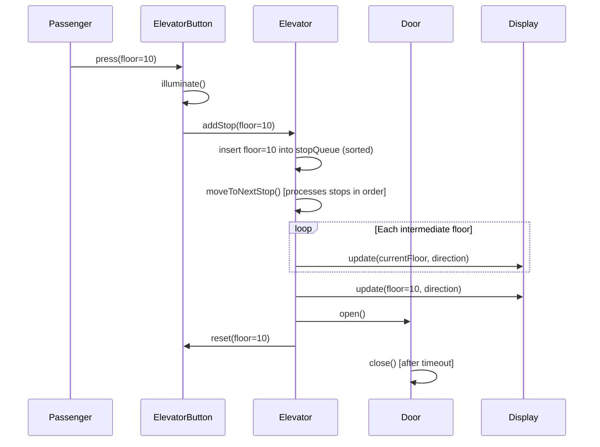
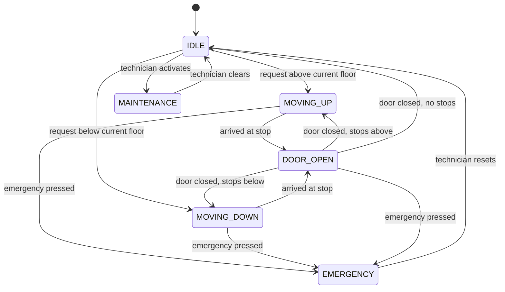
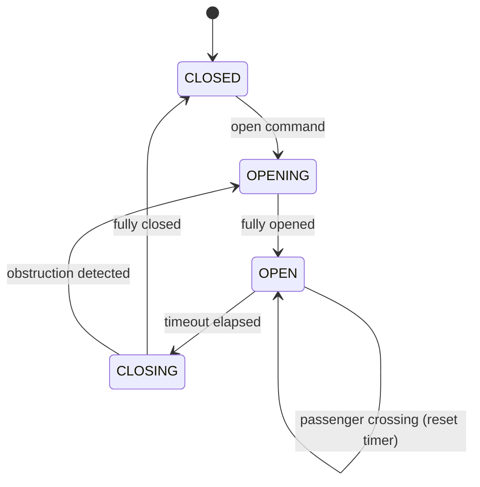

# Low-Level Design: Elevator System

> An elevator system manages N elevators across M floors, handling concurrent
> requests from passengers on floors and inside cars. The core challenge is
> scheduling -- deciding which elevator serves which request to minimize wait
> time. This problem tests state machines, strategy pattern, and concurrency.

---

## 1. Requirements

### 1.1 Functional Requirements

- FR-1: Passengers can request an elevator from any floor by pressing Up/Down button.
- FR-2: Passengers inside an elevator can select destination floors.
- FR-3: The system dispatches the optimal elevator for each floor request.
- FR-4: Each elevator moves through its assigned stops, opening doors at each.
- FR-5: Displays on floors and inside cars show current floor and direction.
- FR-6: Emergency stop halts the elevator and opens doors at nearest safe floor.
- FR-7: Doors open on arrival and close after a configurable timeout.

### 1.2 Constraints & Assumptions

- Single process, multi-threaded -- each elevator runs in its own thread.
- In-memory only (no database required).
- **M floors** (configurable, e.g. 1-50) and **N elevators** (configurable, e.g. 2-8).
- Each elevator has a maximum weight capacity.
- Requests are concurrent -- multiple passengers press buttons simultaneously.
- Door open/close time and floor travel time are configurable constants.

---

## 2. Use Cases

| #    | Actor     | Action                             | Outcome                                             |
|------|-----------|------------------------------------|------------------------------------------------------|
| UC-1 | Passenger | Presses Up/Down button on a floor  | System assigns best elevator; button illuminates      |
| UC-2 | Passenger | Selects destination floor in car   | Floor added to elevator's stop queue                  |
| UC-3 | Passenger | Presses emergency stop             | Elevator halts, doors open at nearest safe floor      |
| UC-4 | System    | Dispatches elevator to request     | Optimal elevator selected via scheduling strategy     |
| UC-5 | System    | Updates displays                   | Current floor and direction shown in real time         |
| UC-6 | Technician| Places elevator in maintenance     | Elevator stops accepting requests                     |

---

## 3. Core Classes & Interfaces

### 3.1 Class Diagram



### 3.2 Class Descriptions

| Class / Interface      | Responsibility                                                          | Pattern    |
|------------------------|-------------------------------------------------------------------------|------------|
| `ElevatorSystem`       | Central controller; receives requests, dispatches elevators             | Facade     |
| `Elevator`             | One elevator car; manages stop queue, movement, and state               | State      |
| `Door`                 | Models door open/close lifecycle with timed auto-close                  | State      |
| `Request`              | Immutable value object capturing a floor request with direction         | Command    |
| `Button` (abstract)    | Base for pressable buttons with illumination state                      | Template   |
| `FloorButton`          | Button on a floor -- creates Request when pressed                       | Command    |
| `ElevatorButton`       | Button inside car -- adds destination to stop queue                     | Command    |
| `Display`              | Shows current floor and direction; observes elevator state              | Observer   |
| `SchedulingStrategy`   | Interface for elevator selection algorithms                             | Strategy   |
| `SCANStrategy`         | Selects elevator using SCAN (disk-arm) algorithm                        | Strategy   |
| `LOOKStrategy`         | SCAN variant that reverses at last request, not last floor              | Strategy   |
| `ShortestSeekFirst`    | Selects closest available elevator regardless of direction              | Strategy   |
| `ElevatorObserver`     | Interface for listening to elevator state changes                       | Observer   |

---

## 4. Design Patterns Used

| Pattern   | Where Applied                        | Why                                                         |
|-----------|--------------------------------------|-------------------------------------------------------------|
| Strategy  | `SchedulingStrategy` for dispatch    | Swap scheduling algorithms at runtime without changing callers |
| State     | `ElevatorState` transitions          | Each state governs valid transitions and actions             |
| Observer  | `ElevatorObserver` for Display       | Decouple movement logic from UI updates                      |
| Command   | `Request` and `Button` press actions | Encapsulate requests as objects for queuing and logging       |
| Facade    | `ElevatorSystem` as entry point      | Simplify client interaction with the multi-elevator subsystem|
| Singleton | `ElevatorSystem` (one per building)  | Ensure one controller coordinates all elevators              |

### 4.1 Strategy -- Scheduling

Instead of `if algorithm == "SCAN": ... elif ...`, use `self._strategy.select_elevator(request, elevators)` where the strategy is injectable at runtime.

### 4.2 State -- Elevator

`IDLE -> MOVING_UP/DOWN -> DOOR_OPEN -> IDLE`. Each state encapsulates its own transition rules, avoiding a massive if/elif chain in `Elevator`.

### 4.3 Observer -- Display

When an elevator moves, it notifies observers: `for obs in self._observers: obs.on_floor_changed(self.id, self.current_floor)`. This keeps `Elevator` decoupled from `Display` and `FloorButton`.

---

## 5. Key Flows

### 5.1 Floor Request Flow



### 5.2 Destination Selection Flow



---

## 6. State Diagrams

### 6.1 Elevator State Diagram



### 6.2 Door State Diagram



### 6.3 State Transition Table

| Current State | Event                       | Next State   | Guard Condition                |
|---------------|-----------------------------|--------------|--------------------------------|
| IDLE          | request above               | MOVING_UP    | Stop queue non-empty           |
| IDLE          | request below               | MOVING_DOWN  | Stop queue non-empty           |
| MOVING_UP     | arrived at stop             | DOOR_OPEN    | Current floor in stop queue    |
| MOVING_DOWN   | arrived at stop             | DOOR_OPEN    | Current floor in stop queue    |
| DOOR_OPEN     | door closed, stops above    | MOVING_UP    | Remaining stops > current      |
| DOOR_OPEN     | door closed, stops below    | MOVING_DOWN  | Remaining stops < current      |
| DOOR_OPEN     | door closed, no stops       | IDLE         | Stop queue empty               |
| ANY           | emergency pressed           | EMERGENCY    | Not in MAINTENANCE             |
| IDLE          | technician activates        | MAINTENANCE  | Elevator is idle               |
| MAINTENANCE   | technician clears           | IDLE         | Maintenance complete           |
| EMERGENCY     | technician resets           | IDLE         | Emergency resolved             |

---

## 7. Code Skeleton

```python
from abc import ABC, abstractmethod
from enum import Enum
from dataclasses import dataclass, field
from typing import List, Optional, Dict
from threading import Lock
from sortedcontainers import SortedList
import uuid, time
from datetime import datetime


# -- Enums ----------------------------------------------------------------

class Direction(Enum):
    UP = "UP"
    DOWN = "DOWN"
    IDLE = "IDLE"

class ElevatorState(Enum):
    IDLE = "IDLE"
    MOVING_UP = "MOVING_UP"
    MOVING_DOWN = "MOVING_DOWN"
    DOOR_OPEN = "DOOR_OPEN"
    MAINTENANCE = "MAINTENANCE"
    EMERGENCY = "EMERGENCY"

class DoorState(Enum):
    OPEN = "OPEN"
    CLOSED = "CLOSED"
    OPENING = "OPENING"
    CLOSING = "CLOSING"

@dataclass(frozen=True)
class Request:
    source_floor: int
    direction: Direction
    id: str = field(default_factory=lambda: str(uuid.uuid4()))
    timestamp: datetime = field(default_factory=datetime.utcnow)

class ElevatorObserver(ABC):
    @abstractmethod
    def on_floor_changed(self, elevator_id: int, floor: int) -> None: ...
    @abstractmethod
    def on_state_changed(self, elevator_id: int, state: ElevatorState) -> None: ...


class Display(ElevatorObserver):
    def __init__(self, location: str):
        self._location = location
        self._current_floor: int = 1
        self._direction: Direction = Direction.IDLE

    def on_floor_changed(self, elevator_id: int, floor: int) -> None:
        self._current_floor = floor

    def on_state_changed(self, elevator_id: int, state: ElevatorState) -> None:
        pass

    def show(self) -> str:
        return f"[{self._location}] Floor: {self._current_floor}"

class Door:
    def __init__(self, timeout_seconds: float = 3.0):
        self._state = DoorState.CLOSED
        self._timeout = timeout_seconds

    def open(self) -> None:
        self._state = DoorState.OPENING
        self._state = DoorState.OPEN

    def close(self) -> None:
        self._state = DoorState.CLOSING
        self._state = DoorState.CLOSED

    @property
    def is_open(self) -> bool:
        return self._state == DoorState.OPEN

class Button(ABC):
    def __init__(self, floor: int):
        self._floor = floor
        self._is_pressed = False

    @abstractmethod
    def press(self) -> None: ...

    def reset(self) -> None:
        self._is_pressed = False


class FloorButton(Button):
    def __init__(self, floor: int, direction: Direction, system: "ElevatorSystem"):
        super().__init__(floor)
        self._direction = direction
        self._system = system

    def press(self) -> None:
        if not self._is_pressed:
            self._is_pressed = True
            self._system.request_elevator(self._floor, self._direction)


class ElevatorButton(Button):
    def __init__(self, floor: int, elevator: "Elevator"):
        super().__init__(floor)
        self._elevator = elevator

    def press(self) -> None:
        if not self._is_pressed:
            self._is_pressed = True
            self._elevator.add_stop(self._floor)

class SchedulingStrategy(ABC):
    @abstractmethod
    def select_elevator(self, request: Request, elevators: List["Elevator"]) -> Optional["Elevator"]: ...


class SCANStrategy(SchedulingStrategy):
    """
    SCAN (Elevator / Disk-Arm Algorithm):
    1. Prefer elevator moving in same direction with request ahead.
    2. Among candidates, pick closest.
    3. Fallback to closest idle, then closest overall.
    """
    def select_elevator(self, request: Request, elevators: List["Elevator"]) -> Optional["Elevator"]:
        available = [e for e in elevators
                     if e.state not in (ElevatorState.MAINTENANCE, ElevatorState.EMERGENCY)]
        if not available:
            return None

        best, best_score = None, float("inf")
        for e in available:
            score = self._score(e, request)
            if score < best_score:
                best_score, best = score, e
        return best

    def _score(self, elevator: "Elevator", req: Request) -> float:
        dist = abs(elevator.current_floor - req.source_floor)
        if elevator.state == ElevatorState.IDLE:
            return dist
        e_dir = Direction.UP if elevator.state == ElevatorState.MOVING_UP else Direction.DOWN
        if e_dir == req.direction:
            if req.direction == Direction.UP and elevator.current_floor <= req.source_floor:
                return dist
            if req.direction == Direction.DOWN and elevator.current_floor >= req.source_floor:
                return dist
        return dist + elevator.stop_count * 2  # penalize: must finish sweep first


class LOOKStrategy(SchedulingStrategy):
    """LOOK: Like SCAN but reverses at last request, not last floor.
    Prefers idle elevators, then same-direction-ahead, then closest overall."""
    def select_elevator(self, request: Request, elevators: List["Elevator"]) -> Optional["Elevator"]:
        avail = [e for e in elevators if e.state not in (ElevatorState.MAINTENANCE, ElevatorState.EMERGENCY)]
        if not avail:
            return None
        idle = [e for e in avail if e.state == ElevatorState.IDLE]
        pool = idle if idle else avail
        return min(pool, key=lambda e: abs(e.current_floor - request.source_floor))


class ShortestSeekFirst(SchedulingStrategy):
    """Always pick nearest available elevator. Simple but can starve distant floors."""
    def select_elevator(self, request: Request, elevators: List["Elevator"]) -> Optional["Elevator"]:
        avail = [e for e in elevators if e.state not in (ElevatorState.MAINTENANCE, ElevatorState.EMERGENCY)]
        return min(avail, key=lambda e: abs(e.current_floor - request.source_floor)) if avail else None

VALID_TRANSITIONS: Dict[ElevatorState, List[ElevatorState]] = {
    ElevatorState.IDLE:        [ElevatorState.MOVING_UP, ElevatorState.MOVING_DOWN, ElevatorState.MAINTENANCE],
    ElevatorState.MOVING_UP:   [ElevatorState.DOOR_OPEN, ElevatorState.EMERGENCY],
    ElevatorState.MOVING_DOWN: [ElevatorState.DOOR_OPEN, ElevatorState.EMERGENCY],
    ElevatorState.DOOR_OPEN:   [ElevatorState.MOVING_UP, ElevatorState.MOVING_DOWN, ElevatorState.IDLE, ElevatorState.EMERGENCY],
    ElevatorState.MAINTENANCE: [ElevatorState.IDLE],
    ElevatorState.EMERGENCY:   [ElevatorState.IDLE],
}

class Elevator:
    def __init__(self, elevator_id: int, total_floors: int):
        self._id = elevator_id
        self._current_floor = 1
        self._state = ElevatorState.IDLE
        self._direction = Direction.IDLE
        self._door = Door()
        self._display = Display(f"Elevator {elevator_id}")
        self._stop_queue_up: SortedList = SortedList()
        self._stop_queue_down: SortedList = SortedList()
        self._observers: List[ElevatorObserver] = [self._display]
        self._lock = Lock()

    @property
    def id(self) -> int: return self._id
    @property
    def current_floor(self) -> int: return self._current_floor
    @property
    def state(self) -> ElevatorState: return self._state
    @property
    def direction(self) -> Direction: return self._direction
    @property
    def stop_count(self) -> int: return len(self._stop_queue_up) + len(self._stop_queue_down)

    def add_observer(self, obs: ElevatorObserver) -> None:
        self._observers.append(obs)

    def add_stop(self, floor: int) -> None:
        with self._lock:
            if floor > self._current_floor:
                if floor not in self._stop_queue_up:
                    self._stop_queue_up.add(floor)
            elif floor < self._current_floor:
                if floor not in self._stop_queue_down:
                    self._stop_queue_down.add(floor)
            else:
                self._transition_to(ElevatorState.DOOR_OPEN)
                self._door.open()

    def move_to_next_stop(self) -> None:
        with self._lock:
            if self._state in (ElevatorState.MAINTENANCE, ElevatorState.EMERGENCY):
                return
            if self._direction in (Direction.UP, Direction.IDLE) and self._stop_queue_up:
                self._move_up()
            elif self._stop_queue_down:
                self._direction = Direction.DOWN
                self._move_down()
            elif self._stop_queue_up:
                self._direction = Direction.UP
                self._move_up()
            else:
                self._direction = Direction.IDLE
                self._transition_to(ElevatorState.IDLE)

    def _move_up(self) -> None:
        self._transition_to(ElevatorState.MOVING_UP)
        self._direction = Direction.UP
        target = self._stop_queue_up[0]
        while self._current_floor < target:
            self._current_floor += 1
            self._notify_floor()
        self._stop_queue_up.remove(target)
        self._transition_to(ElevatorState.DOOR_OPEN)
        self._door.open()
        time.sleep(self._door._timeout)
        self._door.close()

    def _move_down(self) -> None:
        self._transition_to(ElevatorState.MOVING_DOWN)
        self._direction = Direction.DOWN
        target = self._stop_queue_down[-1]
        while self._current_floor > target:
            self._current_floor -= 1
            self._notify_floor()
        self._stop_queue_down.remove(target)
        self._transition_to(ElevatorState.DOOR_OPEN)
        self._door.open()
        time.sleep(self._door._timeout)
        self._door.close()

    def emergency_stop(self) -> None:
        with self._lock:
            self._state = ElevatorState.EMERGENCY
            self._stop_queue_up.clear()
            self._stop_queue_down.clear()
            self._door.open()

    def _transition_to(self, new_state: ElevatorState) -> None:
        if new_state not in VALID_TRANSITIONS.get(self._state, []):
            if new_state != ElevatorState.EMERGENCY:
                raise ValueError(f"Invalid: {self._state.value} -> {new_state.value}")
        self._state = new_state
        for obs in self._observers:
            obs.on_state_changed(self._id, self._state)

    def _notify_floor(self) -> None:
        for obs in self._observers:
            obs.on_floor_changed(self._id, self._current_floor)

class ElevatorSystem:
    def __init__(self, num_elevators: int, num_floors: int):
        self._num_floors = num_floors
        self._elevators = [Elevator(i, num_floors) for i in range(num_elevators)]
        self._strategy: SchedulingStrategy = SCANStrategy()
        self._lock = Lock()

    def request_elevator(self, floor: int, direction: Direction) -> Optional[Elevator]:
        request = Request(source_floor=floor, direction=direction)
        with self._lock:
            best = self._strategy.select_elevator(request, self._elevators)
        if best:
            best.add_stop(floor)
        return best

    def select_destination(self, elevator_id: int, floor: int) -> None:
        self._elevators[elevator_id].add_stop(floor)

    def emergency_stop(self, elevator_id: int) -> None:
        self._elevators[elevator_id].emergency_stop()

    def set_strategy(self, strategy: SchedulingStrategy) -> None:
        self._strategy = strategy

    def get_status(self) -> List[Dict]:
        return [{"id": e.id, "floor": e.current_floor, "state": e.state.value,
                 "direction": e.direction.value, "stops": e.stop_count}
                for e in self._elevators]
```

---

## 8. Extensibility & Edge Cases

### 8.1 Extensibility

| Change Request                    | How the Design Handles It                                       |
|-----------------------------------|-----------------------------------------------------------------|
| VIP elevator (priority service)   | Subclass `Elevator` with priority queue; separate scheduling    |
| Freight elevator                  | Subclass with higher capacity; add to separate scheduling pool  |
| Energy saving mode                | New state `ENERGY_SAVING`; park idle elevators at ground floor  |
| Fire emergency mode               | New strategy sending all elevators to ground, opening all doors |
| New scheduling algorithm          | Implement `SchedulingStrategy`, inject via `set_strategy()`     |
| Weight sensor                     | Add weight to `Elevator`; skip dispatch if near capacity        |
| Access control (key card)         | Wrap `ElevatorButton.press()` with authorization check          |

### 8.2 Edge Cases

- **Simultaneous same-floor requests:** Deduplicate; one elevator per floor+direction.
- **Elevator at capacity:** Scheduler skips full elevators; add weight check.
- **All elevators in maintenance:** Return "service unavailable" to floor button.
- **Door obstruction:** `CLOSING -> OPENING` transition; add retry limit.
- **Request for current floor:** If idle and already there, just open door.
- **Starvation:** Add aging mechanism to boost priority of distant requests over time.

---

## 9. Interview Tips

### Approach for a 45-Minute Round

1. **0-5 min:** Clarify -- how many elevators, floors, special modes?
2. **5-15 min:** Class diagram: `ElevatorSystem`, `Elevator`, `SchedulingStrategy`.
3. **15-25 min:** Walk through floor-request and destination-selection flows.
4. **25-40 min:** Code skeleton -- `Elevator`, `SCANStrategy`, state transitions.
5. **40-45 min:** Extensibility (VIP, fire mode) and edge cases (starvation, capacity).

### Scheduling Algorithm Comparison

| Algorithm          | Pros                                 | Cons                                    |
|--------------------|--------------------------------------|-----------------------------------------|
| SCAN               | Fair, no starvation, predictable     | Goes to last floor even with no requests|
| LOOK               | More efficient, reverses early       | Slightly more complex                   |
| Shortest Seek First| Minimizes immediate wait time        | Can starve distant floors               |
| FCFS               | Simple, fair ordering                | Poor with many concurrent requests      |

### Common Follow-ups

- **Peak-hour traffic?** Pre-position at lobby; zone-based scheduling.
- **100 floors, 20 elevators?** Zone the building (elevators 1-5 for floors 1-25, etc.).
- **Unit test scheduling?** Inject mock elevators with known positions; assert selection.
- **Fire mode?** `FireModeStrategy` sends all elevators to ground, opens all doors.

### Common Pitfalls

- Drawing a DB schema instead of OOP class diagram.
- Putting all logic in `ElevatorSystem` instead of distributing to `Elevator`.
- Forgetting the state machine -- transitions must be validated.
- Only one scheduling algorithm without abstracting behind an interface.

---

> **Checklist:**
> - [x] Requirements clarified (N elevators, M floors, concurrent).
> - [x] Class diagram with relationships (composition, inheritance, interface).
> - [x] Design patterns justified (Strategy, State, Observer, Command).
> - [x] State diagrams for Elevator and Door.
> - [x] Code skeleton covers scheduling, movement, state transitions.
> - [x] Edge cases acknowledged (starvation, capacity, concurrency).
> - [x] Extensibility demonstrated (VIP, freight, fire mode, new algorithms).
