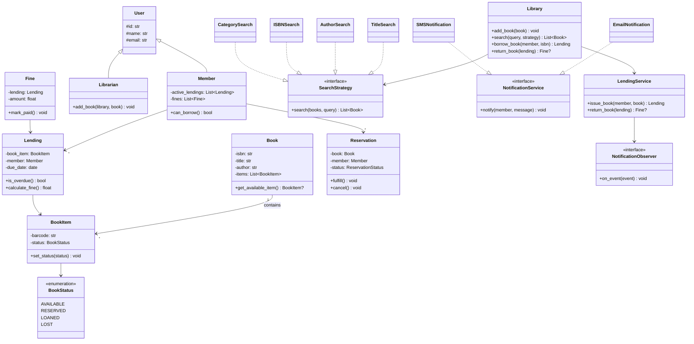
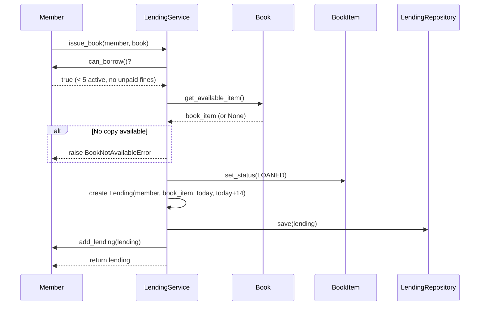
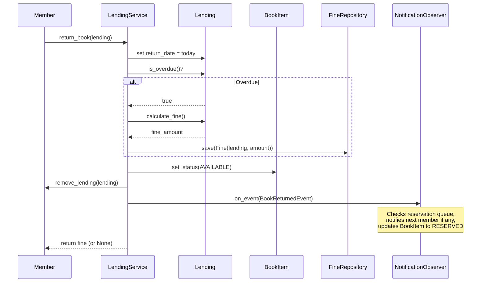
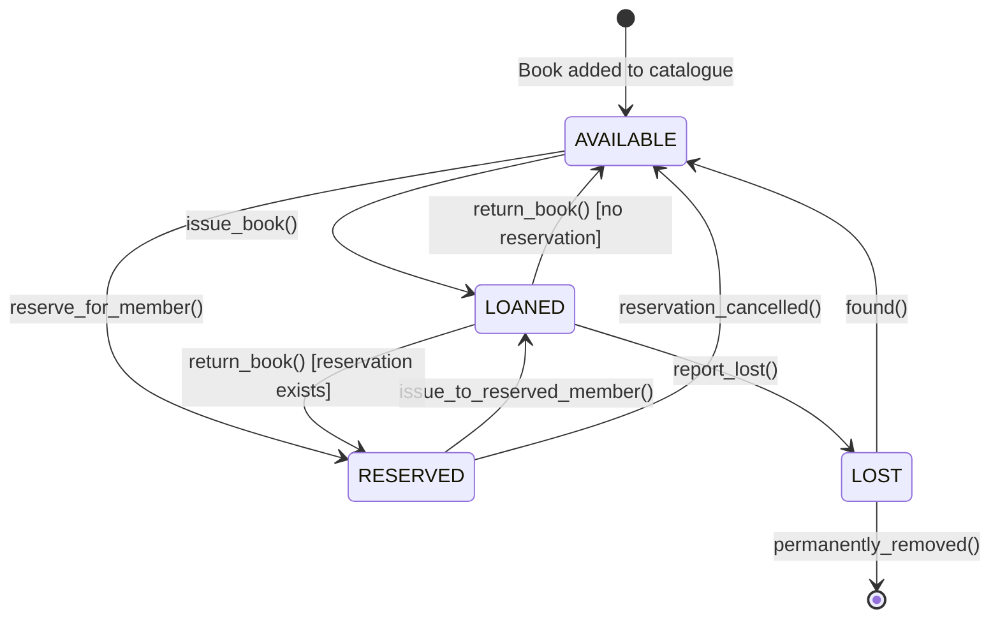
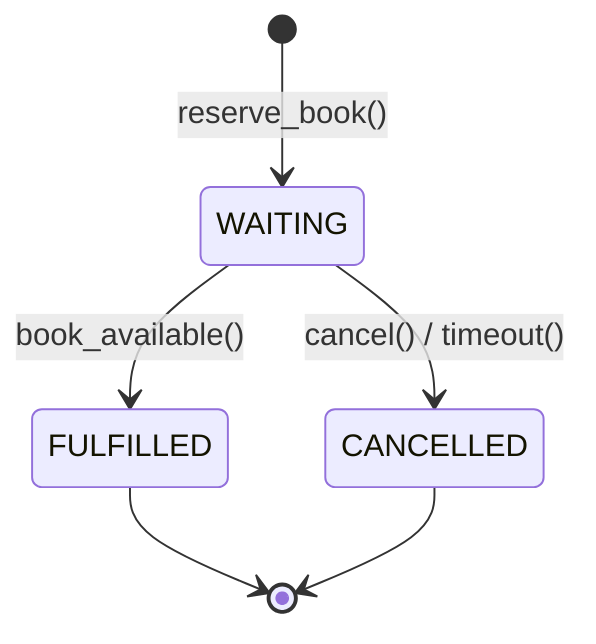

# Low-Level Design: Library Management System

> Covers cataloguing, membership, lending, reservations, fines, and notifications.
> Focus: OOP, SOLID principles, and design patterns for a 45-60 min LLD interview.

---

## 1. Requirements

### 1.1 Functional Requirements

- **FR-1:** Add/remove books from the catalogue.
- **FR-2:** Search books by title, author, ISBN, or category.
- **FR-3:** Register members and manage their profiles.
- **FR-4:** Issue (lend) books to members and record lending details.
- **FR-5:** Return books and update availability status.
- **FR-6:** Reserve books currently on loan; notify when available.
- **FR-7:** Track due dates for every active lending record.
- **FR-8:** Calculate fines for overdue returns automatically.
- **FR-9:** Send notifications for overdue books and reserved-book availability.

### 1.2 Constraints & Assumptions

- Single process, in-memory storage (repository interface allows DB swap).
- A single book title can have **multiple physical copies** (`BookItem`).
- Member borrow limit: **5 books** at a time.
- Lending period: **14 days** from the issue date.
- Fine rate: **$1 per day** past the due date.
- Concurrency: single-threaded (acknowledge multi-threaded edge cases).

---

## 2. Use Cases

| #    | Actor     | Action                        | Outcome                                          |
|------|-----------|-------------------------------|--------------------------------------------------|
| UC-1 | Member    | Searches for a book           | Matching books returned                          |
| UC-2 | Member    | Borrows a book                | Lending record created, book status updated      |
| UC-3 | Member    | Returns a book                | Fine calculated if overdue, status updated       |
| UC-4 | Member    | Reserves an unavailable book  | Reservation queued, notified when ready           |
| UC-5 | Member    | Pays a fine                   | Fine marked paid, borrowing privileges restored  |
| UC-6 | System    | Sends notification            | Member receives email or SMS                     |
| UC-7 | Librarian | Adds/removes books            | Catalogue updated                                |

---

## 3. Core Classes & Interfaces

### 3.1 Class Diagram



### 3.2 Class Descriptions

| Class / Interface       | Responsibility                                        | Pattern      |
|-------------------------|-------------------------------------------------------|--------------|
| `Library`               | Facade; coordinates books, members, services          | Facade       |
| `Book`                  | Catalogue entry; groups multiple physical copies       | Domain Model |
| `BookItem`              | Single physical copy; tracks status and location       | Domain Model |
| `User`                  | Base class with identity fields                        | Inheritance  |
| `Member` / `Librarian`  | Member borrows; Librarian manages catalogue            | Domain Model |
| `Lending`               | Book issued to a member; tracks dates and fines        | Domain Model |
| `Reservation`           | Queued request for an unavailable book                 | Domain Model |
| `Fine`                  | Monetary penalty for overdue returns                   | Domain Model |
| `SearchStrategy`        | Interface for pluggable search algorithms              | Strategy     |
| `NotificationService`   | Interface for sending messages to members              | Factory      |
| `NotificationObserver`  | Interface for reacting to library events               | Observer     |
| `LendingService`        | Orchestrates issue/return logic; manages observers     | Service      |

---

## 4. Design Patterns Used

| Pattern        | Where Applied                                | Why                                                         |
|----------------|----------------------------------------------|-------------------------------------------------------------|
| **Observer**   | `LendingService` notifies on book return     | Decouples return logic from reservation fulfillment         |
| **State**      | `BookItem` status transitions                | Each state defines valid transitions; prevents illegal moves|
| **Strategy**   | `SearchStrategy` implementations             | Swap search algorithm at runtime without changing callers   |
| **Factory**    | `NotificationFactory` creates Email/SMS      | Centralises notification channel selection                  |
| **Repository** | `BookRepository`, `LendingRepository`, etc.  | Abstracts storage behind interfaces for testability         |
| **Facade**     | `Library` class                              | Single entry point to the subsystem                         |

### 4.1 Observer -- Reserve & Notify

```
On book return: LendingService fires BookReturnedEvent -> ReservationObserver finds
next reservation -> notifies member -> sets BookItem to RESERVED, reservation FULFILLED.
Benefit: LendingService knows nothing about reservations or notifications.
```

### 4.2 State -- BookItem Lifecycle

```
AVAILABLE --issue()--> LOANED | AVAILABLE --reserve()--> RESERVED
RESERVED  --issue()--> LOANED | RESERVED  --cancel()-->  AVAILABLE
LOANED --return()--> AVAILABLE/RESERVED | LOANED --report_lost()--> LOST
LOST --found()--> AVAILABLE
Invalid transitions (e.g., AVAILABLE -> LOST) raise ValueError.
```

### 4.3 Strategy -- Pluggable Search

```
Instead of:  if search_type == "title": ... elif "author": ...
Use:         results = search_strategy.search(books, query)
Library accepts any SearchStrategy implementation at runtime.
```

### 4.4 Factory -- Notification Channels

```
NotificationFactory.create("email") -> EmailNotification()
NotificationFactory.create("sms")   -> SMSNotification()
Adding push notifications = new class + one line in factory.
```

---

## 5. Key Flows

### 5.1 Borrow Book Flow



### 5.2 Return Book Flow



---

## 6. State Diagrams

### 6.1 BookItem State Diagram



### 6.2 State Transition Table

| Current State | Event              | Next State | Guard Condition                  |
|---------------|--------------------|------------|----------------------------------|
| AVAILABLE     | `issue_book()`     | LOANED     | Member can borrow                |
| AVAILABLE     | `reserve()`        | RESERVED   | Reservation observer triggers    |
| RESERVED      | `issue()`          | LOANED     | Reserved member presents         |
| RESERVED      | `cancel()`         | AVAILABLE  | Member cancels or window expires |
| LOANED        | `return()`         | AVAILABLE  | No pending reservation           |
| LOANED        | `return()`         | RESERVED   | Next reservation exists          |
| LOANED        | `report_lost()`    | LOST       | Member or librarian reports      |
| LOST          | `found()`          | AVAILABLE  | Book recovered                   |

### 6.3 Reservation States



---

## 7. Code Skeleton

```python
from abc import ABC, abstractmethod
from enum import Enum
from datetime import date, datetime, timedelta
from dataclasses import dataclass, field
from typing import List, Optional, Dict
import uuid


# ── Enums & Constants ────────────────────────────────────────────────────

class BookStatus(Enum):
    AVAILABLE = "AVAILABLE"
    RESERVED = "RESERVED"
    LOANED = "LOANED"
    LOST = "LOST"

class ReservationStatus(Enum):
    WAITING = "WAITING"
    FULFILLED = "FULFILLED"
    CANCELLED = "CANCELLED"

MAX_BOOKS_PER_MEMBER = 5
LENDING_PERIOD_DAYS = 14
FINE_PER_DAY = 1.0

VALID_BOOK_TRANSITIONS: Dict[BookStatus, List[BookStatus]] = {
    BookStatus.AVAILABLE: [BookStatus.LOANED, BookStatus.RESERVED],
    BookStatus.RESERVED:  [BookStatus.LOANED, BookStatus.AVAILABLE],
    BookStatus.LOANED:    [BookStatus.AVAILABLE, BookStatus.RESERVED, BookStatus.LOST],
    BookStatus.LOST:      [BookStatus.AVAILABLE],
}


# ── Domain Models ────────────────────────────────────────────────────────

@dataclass
class BookItem:
    barcode: str = field(default_factory=lambda: str(uuid.uuid4()))
    status: BookStatus = BookStatus.AVAILABLE
    rack_location: str = ""
    _book: Optional["Book"] = field(default=None, repr=False)

    def set_status(self, new_status: BookStatus) -> None:
        if new_status not in VALID_BOOK_TRANSITIONS[self.status]:
            raise ValueError(f"Invalid transition: {self.status.value} -> {new_status.value}")
        self.status = new_status

    def is_available(self) -> bool:
        return self.status == BookStatus.AVAILABLE


@dataclass
class Book:
    isbn: str
    title: str
    author: str
    category: str = ""
    items: List[BookItem] = field(default_factory=list)

    def add_item(self, item: BookItem) -> None:
        item._book = self
        self.items.append(item)

    def get_available_item(self) -> Optional[BookItem]:
        return next((i for i in self.items if i.is_available()), None)

    def available_count(self) -> int:
        return sum(1 for item in self.items if item.is_available())


@dataclass
class User:
    id: str = field(default_factory=lambda: str(uuid.uuid4()))
    name: str = ""
    email: str = ""
    phone: str = ""


@dataclass
class Lending:
    id: str = field(default_factory=lambda: str(uuid.uuid4()))
    book_item: BookItem = field(default_factory=BookItem)
    member: Optional["Member"] = None
    issue_date: date = field(default_factory=date.today)
    due_date: date = field(default_factory=lambda: date.today() + timedelta(days=LENDING_PERIOD_DAYS))
    return_date: Optional[date] = None

    def is_overdue(self) -> bool:
        check_date = self.return_date or date.today()
        return check_date > self.due_date

    def calculate_fine(self) -> float:
        if not self.is_overdue():
            return 0.0
        check_date = self.return_date or date.today()
        return (check_date - self.due_date).days * FINE_PER_DAY


@dataclass
class Reservation:
    id: str = field(default_factory=lambda: str(uuid.uuid4()))
    book: Optional[Book] = None
    member: Optional["Member"] = None
    reserved_at: datetime = field(default_factory=datetime.utcnow)
    status: ReservationStatus = ReservationStatus.WAITING

    def fulfill(self) -> None:
        if self.status != ReservationStatus.WAITING:
            raise ValueError("Can only fulfill a WAITING reservation")
        self.status = ReservationStatus.FULFILLED

    def cancel(self) -> None:
        self.status = ReservationStatus.CANCELLED


@dataclass
class Fine:
    id: str = field(default_factory=lambda: str(uuid.uuid4()))
    lending: Optional[Lending] = None
    amount: float = 0.0
    paid: bool = False

    def mark_paid(self) -> None:
        self.paid = True


@dataclass
class Member(User):
    active_lendings: List[Lending] = field(default_factory=list)
    fines: List[Fine] = field(default_factory=list)

    def can_borrow(self) -> bool:
        return len(self.active_lendings) < MAX_BOOKS_PER_MEMBER and not any(not f.paid for f in self.fines)

    def add_lending(self, lending: Lending) -> None:
        self.active_lendings.append(lending)

    def remove_lending(self, lending: Lending) -> None:
        self.active_lendings = [l for l in self.active_lendings if l.id != lending.id]


@dataclass
class Librarian(User):
    employee_id: str = ""


# ── Strategy Pattern: Search ─────────────────────────────────────────────

class SearchStrategy(ABC):
    @abstractmethod
    def search(self, books: List[Book], query: str) -> List[Book]: ...

class TitleSearch(SearchStrategy):
    def search(self, books: List[Book], query: str) -> List[Book]:
        return [b for b in books if query.lower() in b.title.lower()]

class AuthorSearch(SearchStrategy):
    def search(self, books: List[Book], query: str) -> List[Book]:
        return [b for b in books if query.lower() in b.author.lower()]

class ISBNSearch(SearchStrategy):
    def search(self, books: List[Book], query: str) -> List[Book]:
        return [b for b in books if b.isbn == query]

class CategorySearch(SearchStrategy):
    def search(self, books: List[Book], query: str) -> List[Book]:
        return [b for b in books if query.lower() in b.category.lower()]


# ── Observer + Factory: Notifications ────────────────────────────────────

class NotificationService(ABC):
    @abstractmethod
    def notify(self, member: Member, message: str) -> None: ...

class EmailNotification(NotificationService):
    def notify(self, member: Member, message: str) -> None:
        print(f"[EMAIL -> {member.email}] {message}")

class SMSNotification(NotificationService):
    def notify(self, member: Member, message: str) -> None:
        print(f"[SMS -> {member.phone}] {message}")

class NotificationFactory:
    _map = {"email": EmailNotification, "sms": SMSNotification}

    @staticmethod
    def create(channel: str) -> NotificationService:
        if channel not in NotificationFactory._map:
            raise ValueError(f"Unknown channel: {channel}")
        return NotificationFactory._map[channel]()


class LibraryEvent:
    def __init__(self, event_type: str, payload: dict):
        self.event_type = event_type
        self.payload = payload

class NotificationObserver(ABC):
    @abstractmethod
    def on_event(self, event: LibraryEvent) -> None: ...

class ReservationObserver(NotificationObserver):
    """Watches for book returns and fulfills the next reservation."""
    def __init__(self, reservation_repo, notifier: NotificationService):
        self._repo, self._notifier = reservation_repo, notifier

    def on_event(self, event: LibraryEvent) -> None:
        if event.event_type != "BOOK_RETURNED":
            return
        book, book_item = event.payload["book"], event.payload["book_item"]
        if next_res := self._repo.find_next_waiting(book.isbn):
            book_item.set_status(BookStatus.RESERVED)
            next_res.fulfill()
            self._repo.save(next_res)
            self._notifier.notify(next_res.member, f'"{book.title}" is ready.')


# ── Repository Interfaces ────────────────────────────────────────────────

class BookRepository(ABC):
    @abstractmethod
    def save(self, book: Book) -> None: ...
    @abstractmethod
    def find_by_isbn(self, isbn: str) -> Optional[Book]: ...
    @abstractmethod
    def find_all(self) -> List[Book]: ...
    @abstractmethod
    def delete(self, isbn: str) -> None: ...

class LendingRepository(ABC):
    @abstractmethod
    def save(self, lending: Lending) -> None: ...

class ReservationRepository(ABC):
    @abstractmethod
    def save(self, reservation: Reservation) -> None: ...
    @abstractmethod
    def find_next_waiting(self, isbn: str) -> Optional[Reservation]: ...

class FineRepository(ABC):
    @abstractmethod
    def save(self, fine: Fine) -> None: ...


# ── Service Layer ────────────────────────────────────────────────────────

class LendingService:
    def __init__(self, lending_repo: LendingRepository, fine_repo: FineRepository):
        self._lending_repo = lending_repo
        self._fine_repo = fine_repo
        self._observers: List[NotificationObserver] = []

    def add_observer(self, observer: NotificationObserver) -> None:
        self._observers.append(observer)

    def _fire_event(self, event: LibraryEvent) -> None:
        for obs in self._observers:
            obs.on_event(event)

    def issue_book(self, member: Member, book: Book) -> Lending:
        if not member.can_borrow():
            raise PermissionError("Borrow limit reached or unpaid fines exist.")
        book_item = book.get_available_item()
        if not book_item:
            raise LookupError(f'No available copy of "{book.title}".')
        book_item.set_status(BookStatus.LOANED)
        lending = Lending(book_item=book_item, member=member)
        self._lending_repo.save(lending)
        member.add_lending(lending)
        return lending

    def return_book(self, lending: Lending) -> Optional[Fine]:
        lending.return_date, fine_obj = date.today(), None
        if lending.is_overdue():
            fine_obj = Fine(lending=lending, amount=lending.calculate_fine())
            self._fine_repo.save(fine_obj)
            if lending.member:
                lending.member.fines.append(fine_obj)
        lending.book_item.set_status(BookStatus.AVAILABLE)
        if lending.member:
            lending.member.remove_lending(lending)
        self._lending_repo.save(lending)
        self._fire_event(LibraryEvent("BOOK_RETURNED", {
            "book": lending.book_item._book, "book_item": lending.book_item,
        }))
        return fine_obj


# ── Library Facade ───────────────────────────────────────────────────────

class Library:
    def __init__(self, name: str, book_repo: BookRepository, lending_service: LendingService):
        self.name = name
        self._book_repo = book_repo
        self._lending_service = lending_service

    def add_book(self, book: Book) -> None:
        self._book_repo.save(book)

    def remove_book(self, isbn: str) -> None:
        self._book_repo.delete(isbn)

    def search(self, query: str, strategy: SearchStrategy) -> List[Book]:
        return strategy.search(self._book_repo.find_all(), query)

    def borrow_book(self, member: Member, isbn: str) -> Lending:
        book = self._book_repo.find_by_isbn(isbn)
        if not book:
            raise LookupError(f"No book found with ISBN: {isbn}")
        return self._lending_service.issue_book(member, book)

    def return_book(self, lending: Lending) -> Optional[Fine]:
        return self._lending_service.return_book(lending)
```

---

## 8. Extensibility & Edge Cases

### 8.1 Extensibility Checklist

| Change Request                  | How the Design Handles It                                        |
|---------------------------------|------------------------------------------------------------------|
| Digital books / e-books         | `DigitalBookItem(BookItem)` with download URL; no copy limit     |
| Audiobooks                      | `AudioBookItem(BookItem)` with streaming metadata                |
| Inter-library loans             | `SourceLibrary` field on `BookItem`; new service                 |
| Recommendation engine           | New `RecommendationStrategy` interface; plug into Library        |
| New search criteria             | Implement new `SearchStrategy` -- zero existing code changes     |
| Push notifications              | Implement `NotificationService`; register in factory             |
| Book renewals                   | `renew()` on `Lending`; extend due date if no reservation        |
| Database persistence            | Implement repository interfaces with DB driver                   |

### 8.2 Edge Cases

- **Double borrow:** Allow -- different physical copies, both count toward limit.
- **Reservation for available book:** Reject; prompt direct borrowing.
- **Lost book with reservation:** Notify member; move to next copy or cancel.
- **Partial fine payment:** Track paid vs. remaining; block borrowing until fully paid.
- **Limit reached + reservation fulfilled:** Check limit before assigning reserved copy.
- **Concurrent return of same lending:** Idempotency -- if `return_date` set, no-op.
- **Clock issues:** Use server time consistently; never rely on client-provided dates.

---

## 9. Interview Tips

### What Interviewers Look For

1. **SOLID** -- `Book` vs. `BookItem` (SRP), `SearchStrategy` interface (OCP).
2. **Patterns** -- Observer, Strategy, State, Factory -- named, applied, justified.
3. **Separation of concerns** -- Domain models own rules; services orchestrate; repos store.
4. **Edge cases** -- Concurrency, idempotency, boundary conditions (limit = 5).
5. **Extensibility** -- New search/notification = new class, no existing code changed.

### 45-Minute Approach

1. **0-5 min:** Clarify requirements (copies, limits, fines, reservations).
2. **5-15 min:** Class diagram: Book, BookItem, Member, Lending, interfaces.
3. **15-25 min:** Borrow and return sequence diagrams.
4. **25-40 min:** Code: `LendingService`, `calculate_fine()`, `set_status()`.
5. **40-45 min:** Extensibility and edge cases.

### Common Follow-ups

- **"Add renewal?"** -- `renew()` on Lending, check reservations before extending due date.
- **"Fine model changes?"** -- Extract into `FineStrategy` interface, inject into LendingService.
- **"Unit test LendingService?"** -- Inject mock repos; verify status changes and fines.
- **"Concurrent borrow of last copy?"** -- Optimistic locking on BookItem status.

### Common Pitfalls

- Confusing `Book` (catalogue entry) with `BookItem` (physical copy).
- Business logic in the repository layer instead of domain models.
- Forgetting reservation-notification flow on return (richest interaction).
- Over-engineering; Observer with a callback list is sufficient.
- No interfaces at boundaries -- violates Open/Closed.
