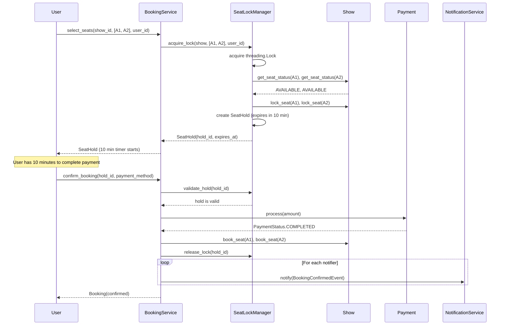
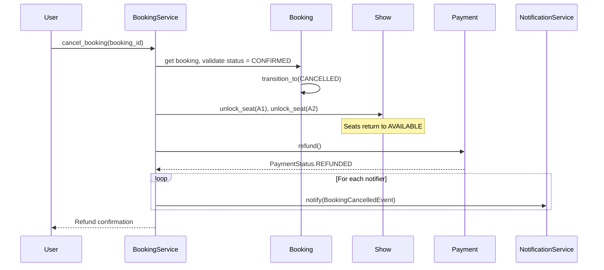
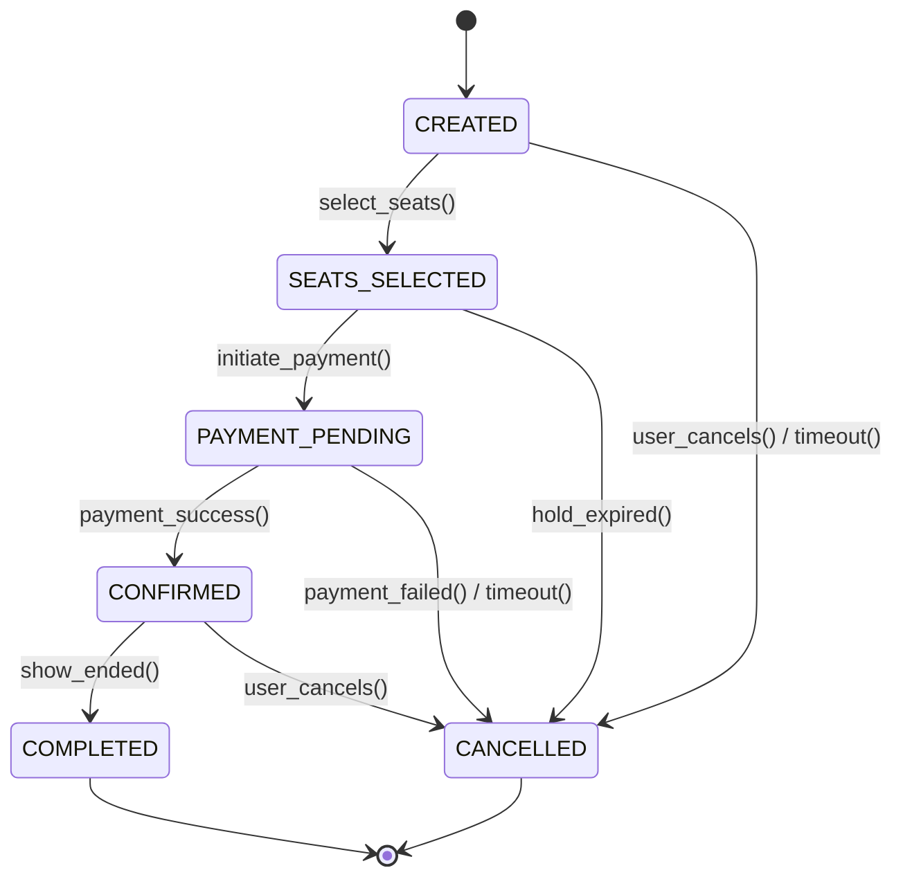
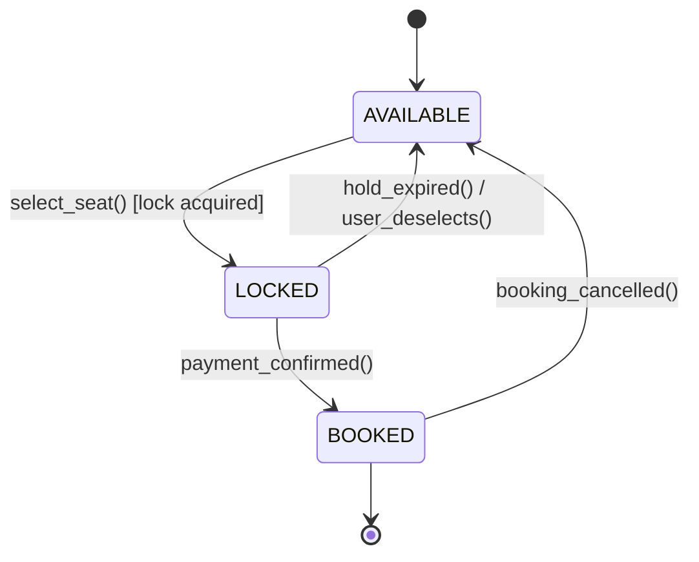

# Low-Level Design: Movie Ticket Booking System (BookMyShow)

> A movie ticket booking system allows users to browse movies, view showtimes across
> multiple theaters/screens, select seats from an interactive seat map, book tickets
> with payment, and cancel bookings. The core challenge is handling concurrent seat
> selection without double-booking, using a 10-minute temporary seat hold mechanism.

---

## 1. Requirements

### 1.1 Functional Requirements

- FR-1: Browse movies currently showing in a city, with search and filter by genre/language.
- FR-2: View available showtimes for a movie across multiple theaters and screens.
- FR-3: Display an interactive seat map showing seat availability (Available, Selected, Booked).
- FR-4: Select one or more seats and temporarily hold them for 10 minutes.
- FR-5: Book tickets by completing payment within the hold window.
- FR-6: Cancel a confirmed booking and process refund based on cancellation policy.
- FR-7: View booking history for a user.
- FR-8: Support multiple theaters, each with multiple screens and seat categories.
- FR-9: Apply dynamic pricing (base, weekend, peak hour, holiday).

### 1.2 Constraints & Assumptions

- The system runs as a single process with multi-threaded concurrency.
- No two users can book the same seat for the same show (no double booking).
- Seats are temporarily locked for 10 minutes during the selection/payment flow.
- If payment is not completed within 10 minutes, the lock is released automatically.
- Persistence: in-memory for interview context (repository pattern allows DB swap).
- Seat categories: Regular, Premium, VIP -- each with different pricing.

> **Guidance:** The critical constraint here is concurrency. In an interview, always
> call out the double-booking problem upfront. The 10-minute hold timer is the standard
> industry solution (used by BookMyShow, Ticketmaster, etc.).

---

## 2. Use Cases

| #    | Actor  | Action                             | Outcome                                       |
|------|--------|------------------------------------|------------------------------------------------|
| UC-1 | User   | Searches movies by city/genre      | List of matching movies returned               |
| UC-2 | User   | Views showtimes for a movie        | List of shows with theater, screen, time       |
| UC-3 | User   | Selects seats from the seat map    | Seats temporarily locked for 10 min            |
| UC-4 | User   | Completes payment and books        | Booking confirmed, seats marked BOOKED         |
| UC-5 | User   | Cancels a booking                  | Booking cancelled, seats released, refund init |
| UC-6 | User   | Views booking history              | List of past and upcoming bookings             |
| UC-7 | System | Releases expired seat locks        | Locked seats return to AVAILABLE after 10 min  |

---

## 3. Core Classes & Interfaces

### 3.1 Class Diagram

```mermaid
classDiagram
    class MovieTicketSystem {
        -booking_service: BookingService
        +search_movies(city, genre, language) List~Movie~
        +get_showtimes(movie_id, city) List~Show~
        +get_seat_map(show_id) List~Seat~
        +select_seats(show_id, seat_ids, user_id) SeatHold
        +book_tickets(hold_id, payment_info) Booking
        +cancel_booking(booking_id) Refund
    }

    class Movie {
        -id: str
        -title: str
        -genre: str
        -language: str
        -duration_minutes: int
        -rating: float
    }

    class Theater {
        -id: str
        -name: str
        -city: str
        -screens: List~Screen~
        +add_screen(screen) void
    }

    class Screen {
        -id: str
        -name: str
        -seats: List~Seat~
        +get_seat_layout() List~Seat~
    }

    class Show {
        -id: str
        -movie: Movie
        -screen: Screen
        -start_time: datetime
        -seat_statuses: Dict~str, SeatStatus~
        +get_available_seats() List~Seat~
        +lock_seat(seat_id) bool
        +unlock_seat(seat_id) void
        +book_seat(seat_id) void
    }

    class Seat {
        -id: str
        -row: str
        -number: int
        -category: SeatCategory
        +get_base_price() float
    }

    class RegularSeat { }
    class PremiumSeat { }
    class VIPSeat { }

    class SeatCategory {
        <<enumeration>>
        REGULAR
        PREMIUM
        VIP
    }

    class SeatStatus {
        <<enumeration>>
        AVAILABLE
        LOCKED
        BOOKED
    }

    class BookingStatus {
        <<enumeration>>
        CREATED
        SEATS_SELECTED
        PAYMENT_PENDING
        CONFIRMED
        COMPLETED
        CANCELLED
    }

    class Booking {
        -id: str
        -user_id: str
        -show: Show
        -seats: List~Seat~
        -status: BookingStatus
        -total_amount: float
        -payment: Payment
        +transition_to(new_status) void
        +calculate_total(strategy) float
    }

    class SeatHold {
        -id: str
        -show_id: str
        -seat_ids: List~str~
        -user_id: str
        -expires_at: datetime
        +is_expired() bool
    }

    class Payment {
        -id: str
        -amount: float
        -status: PaymentStatus
        +process() bool
        +refund() bool
    }

    class PricingStrategy {
        <<interface>>
        +calculate_price(seat, show) float
    }

    class BasePricing {
        +calculate_price(seat, show) float
    }
    class WeekendPricing {
        +calculate_price(seat, show) float
    }
    class PeakHourPricing {
        +calculate_price(seat, show) float
    }
    class HolidayPricing {
        +calculate_price(seat, show) float
    }

    class NotificationService {
        <<interface>>
        +notify(event) void
    }
    class EmailNotification {
        +notify(event) void
    }
    class SMSNotification {
        +notify(event) void
    }

    class BookingService {
        -pricing_strategy: PricingStrategy
        -notifiers: List~NotificationService~
        -seat_lock_manager: SeatLockManager
        +select_seats(show_id, seat_ids, user_id) SeatHold
        +confirm_booking(hold_id, payment_info) Booking
        +cancel_booking(booking_id) Refund
    }

    class SeatLockManager {
        -locks: Dict~str, SeatHold~
        -mutex: threading.Lock
        +acquire_lock(show, seat_ids, user_id) SeatHold
        +release_lock(hold_id, show) void
        +validate_hold(hold_id) SeatHold
        +cleanup_expired_locks() void
    }

    MovieTicketSystem --> BookingService : delegates
    Theater "1" --> "*" Screen : contains
    Screen "1" --> "*" Seat : contains
    Show --> Movie : shows
    Show --> Screen : plays on
    Booking --> Show : for
    Booking "*" --> "*" Seat : reserves
    Booking --> Payment : has
    RegularSeat --|> Seat : extends
    PremiumSeat --|> Seat : extends
    VIPSeat --|> Seat : extends
    BookingService --> PricingStrategy : uses
    BookingService --> NotificationService : notifies via
    BookingService --> SeatLockManager : locks via
    BasePricing ..|> PricingStrategy : implements
    WeekendPricing ..|> PricingStrategy : implements
    PeakHourPricing ..|> PricingStrategy : implements
    HolidayPricing ..|> PricingStrategy : implements
    EmailNotification ..|> NotificationService : implements
    SMSNotification ..|> NotificationService : implements
```



### 3.2 Class Descriptions

| Class / Interface      | Responsibility                                                        | Pattern      |
|------------------------|-----------------------------------------------------------------------|--------------|
| `MovieTicketSystem`    | Top-level facade; orchestrates search, booking, cancellation          | Facade       |
| `Movie`                | Domain entity representing a film with metadata                       | Domain Model |
| `Theater`              | Physical theater with multiple screens                                | Domain Model |
| `Screen`               | Single auditorium within a theater, owns seat layout                  | Domain Model |
| `Show`                 | Specific screening of a movie on a screen at a time                   | Domain Model |
| `Seat`                 | Base class for a seat; subclassed by category (Regular/Premium/VIP)   | Inheritance  |
| `SeatHold`             | Temporary reservation with a 10-minute TTL                           | Value Object |
| `Booking`              | User's ticket booking with state transitions                          | Domain Model |
| `Payment`              | Handles payment processing and refunds                                | Domain Model |
| `PricingStrategy`      | Interface for pluggable pricing algorithms                            | Strategy     |
| `NotificationService`  | Interface for sending booking notifications                           | Observer     |
| `BookingService`       | Core business logic for seat selection, booking, cancellation         | Service      |
| `SeatLockManager`      | Thread-safe seat locking with TTL-based expiration                    | Concurrency  |

---

## 4. Design Patterns Used

| Pattern     | Where Applied                          | Why                                                    |
|-------------|----------------------------------------|--------------------------------------------------------|
| Strategy    | `PricingStrategy` implementations      | Swap pricing logic at runtime without modifying booking code |
| Observer    | `NotificationService` in `BookingService` | Decouple booking logic from notification channels      |
| State       | `BookingStatus` transitions in `Booking` | Each state defines valid transitions; prevents invalid changes |
| Facade      | `MovieTicketSystem` as entry point     | Simplifies client interaction with a unified API       |
| Concurrency | `SeatLockManager` with `threading.Lock` | Prevents double-booking via mutex-protected seat locking |

### 4.1 Strategy Pattern -- Dynamic Pricing

```
Instead of:
    if is_weekend(show.start_time):   price = base * 1.3
    elif is_peak_hour(show.start_time): price = base * 1.5

Use:
    price = pricing_strategy.calculate_price(seat, show)

Adding a new pricing tier (e.g., "EarlyBirdPricing") requires only
a new class -- no modification to existing code (Open/Closed Principle).
```

### 4.2 Observer Pattern -- Booking Notifications

```
Instead of:
    def confirm_booking(self, ...):
        send_email(user, booking)
        send_sms(user, booking)

Use:
    for notifier in self._notifiers:
        notifier.notify(BookingConfirmedEvent(booking))

Adding push notifications = new class, no changes to BookingService.
```

### 4.3 Concurrency -- Seat Locking Mechanism

```
Problem: Two users click "Select Seat A1" simultaneously.
Without locking, both succeed -> double booking.

Solution: SeatLockManager uses threading.Lock (mutex):
    with self._mutex:
        if self._is_seat_available(show_id, seat_id):
            self._mark_as_locked(show_id, seat_id, user_id)
            return SeatHold(expires_in=10_min)
        else:
            raise SeatUnavailableError(...)

Only one thread enters the critical section at a time.
The 10-minute TTL is enforced by a background cleanup thread.
```

---

## 5. Key Flows

### 5.1 Seat Selection and Booking Flow



### 5.2 Cancellation Flow with Refund



---

## 6. State Diagrams

### 6.1 Booking State Diagram



| Current State    | Event              | Next State       | Guard Condition                       |
|------------------|--------------------|------------------|---------------------------------------|
| CREATED          | select_seats()     | SEATS_SELECTED   | Seats are available and lockable      |
| SEATS_SELECTED   | initiate_payment() | PAYMENT_PENDING  | Hold is still valid (< 10 min)        |
| PAYMENT_PENDING  | payment_success()  | CONFIRMED        | Payment gateway returns success       |
| PAYMENT_PENDING  | payment_failed()   | CANCELLED        | Payment gateway returns failure       |
| CONFIRMED        | show_ended()       | COMPLETED        | Current time > show end time          |
| CONFIRMED        | user_cancels()     | CANCELLED        | Cancellation window still open        |
| SEATS_SELECTED   | hold_expired()     | CANCELLED        | 10-minute hold has expired            |

### 6.2 Seat State Diagram



| Current State | Event                | Next State  | Guard Condition                    |
|---------------|----------------------|-------------|------------------------------------|
| AVAILABLE     | select_seat()        | LOCKED      | Lock acquired by SeatLockManager   |
| LOCKED        | payment_confirmed()  | BOOKED      | Payment completed within 10 min    |
| LOCKED        | hold_expired()       | AVAILABLE   | 10-minute timer elapsed            |
| BOOKED        | booking_cancelled()  | AVAILABLE   | Cancellation processed             |

> **Guidance:** The LOCKED intermediate state is the key differentiator from naive
> implementations that go directly from AVAILABLE to BOOKED.

---

## 7. Code Skeleton

```python
from abc import ABC, abstractmethod
from enum import Enum
from datetime import datetime, timedelta
from dataclasses import dataclass, field
from typing import List, Optional, Dict, Set
import uuid
import threading


# -- Enums -------------------------------------------------------------------

class SeatCategory(Enum):
    REGULAR = "REGULAR"
    PREMIUM = "PREMIUM"
    VIP = "VIP"

class SeatStatus(Enum):
    AVAILABLE = "AVAILABLE"
    LOCKED = "LOCKED"
    BOOKED = "BOOKED"

class BookingStatus(Enum):
    CREATED = "CREATED"
    SEATS_SELECTED = "SEATS_SELECTED"
    PAYMENT_PENDING = "PAYMENT_PENDING"
    CONFIRMED = "CONFIRMED"
    COMPLETED = "COMPLETED"
    CANCELLED = "CANCELLED"

class PaymentStatus(Enum):
    PENDING = "PENDING"
    COMPLETED = "COMPLETED"
    FAILED = "FAILED"
    REFUNDED = "REFUNDED"

BOOKING_TRANSITIONS: Dict[BookingStatus, List[BookingStatus]] = {
    BookingStatus.CREATED: [BookingStatus.SEATS_SELECTED, BookingStatus.CANCELLED],
    BookingStatus.SEATS_SELECTED: [BookingStatus.PAYMENT_PENDING, BookingStatus.CANCELLED],
    BookingStatus.PAYMENT_PENDING: [BookingStatus.CONFIRMED, BookingStatus.CANCELLED],
    BookingStatus.CONFIRMED: [BookingStatus.COMPLETED, BookingStatus.CANCELLED],
    BookingStatus.COMPLETED: [],
    BookingStatus.CANCELLED: [],
}


# -- Domain Models ------------------------------------------------------------

@dataclass
class Movie:
    id: str = field(default_factory=lambda: str(uuid.uuid4()))
    title: str = ""
    genre: str = ""
    language: str = ""
    duration_minutes: int = 0

@dataclass
class Seat:
    id: str = ""
    row: str = ""
    number: int = 0
    category: SeatCategory = SeatCategory.REGULAR

    def get_base_price(self) -> float:
        return {SeatCategory.REGULAR: 200.0, SeatCategory.PREMIUM: 350.0, SeatCategory.VIP: 500.0}[self.category]

@dataclass
class Screen:
    id: str = field(default_factory=lambda: str(uuid.uuid4()))
    name: str = ""
    seats: List[Seat] = field(default_factory=list)

@dataclass
class Theater:
    id: str = field(default_factory=lambda: str(uuid.uuid4()))
    name: str = ""
    city: str = ""
    screens: List[Screen] = field(default_factory=list)

@dataclass
class Show:
    id: str = field(default_factory=lambda: str(uuid.uuid4()))
    movie: Optional[Movie] = None
    screen: Optional[Screen] = None
    start_time: Optional[datetime] = None
    seat_statuses: Dict[str, SeatStatus] = field(default_factory=dict)

    def __post_init__(self):
        if self.screen and not self.seat_statuses:
            for seat in self.screen.seats:
                self.seat_statuses[seat.id] = SeatStatus.AVAILABLE

    def get_available_seats(self) -> List[Seat]:
        return [s for s in self.screen.seats if self.seat_statuses.get(s.id) == SeatStatus.AVAILABLE]

    def lock_seat(self, seat_id: str) -> bool:
        if self.seat_statuses.get(seat_id) == SeatStatus.AVAILABLE:
            self.seat_statuses[seat_id] = SeatStatus.LOCKED
            return True
        return False

    def unlock_seat(self, seat_id: str) -> None:
        if self.seat_statuses.get(seat_id) in (SeatStatus.LOCKED, SeatStatus.BOOKED):
            self.seat_statuses[seat_id] = SeatStatus.AVAILABLE

    def book_seat(self, seat_id: str) -> None:
        if self.seat_statuses.get(seat_id) == SeatStatus.LOCKED:
            self.seat_statuses[seat_id] = SeatStatus.BOOKED

@dataclass
class SeatHold:
    id: str = field(default_factory=lambda: str(uuid.uuid4()))
    show_id: str = ""
    seat_ids: List[str] = field(default_factory=list)
    user_id: str = ""
    expires_at: datetime = field(default_factory=lambda: datetime.utcnow() + timedelta(minutes=10))

    def is_expired(self) -> bool:
        return datetime.utcnow() > self.expires_at

@dataclass
class Payment:
    id: str = field(default_factory=lambda: str(uuid.uuid4()))
    booking_id: str = ""
    amount: float = 0.0
    status: PaymentStatus = PaymentStatus.PENDING

    def process(self) -> bool:
        self.status = PaymentStatus.COMPLETED  # In production: call payment gateway
        return True

    def refund(self) -> bool:
        if self.status == PaymentStatus.COMPLETED:
            self.status = PaymentStatus.REFUNDED
            return True
        return False

@dataclass
class Booking:
    id: str = field(default_factory=lambda: str(uuid.uuid4()))
    user_id: str = ""
    show: Optional[Show] = None
    seats: List[Seat] = field(default_factory=list)
    status: BookingStatus = BookingStatus.CREATED
    total_amount: float = 0.0
    payment: Optional[Payment] = None

    def transition_to(self, new_status: BookingStatus) -> None:
        if new_status not in BOOKING_TRANSITIONS.get(self.status, []):
            raise ValueError(f"Invalid transition: {self.status.value} -> {new_status.value}")
        self.status = new_status

    def calculate_total(self, strategy: "PricingStrategy") -> float:
        self.total_amount = sum(strategy.calculate_price(s, self.show) for s in self.seats)
        return self.total_amount


# -- Pricing Strategy (Strategy Pattern) -------------------------------------

class PricingStrategy(ABC):
    @abstractmethod
    def calculate_price(self, seat: Seat, show: Show) -> float: ...

class BasePricing(PricingStrategy):
    def calculate_price(self, seat: Seat, show: Show) -> float:
        return seat.get_base_price()

class WeekendPricing(PricingStrategy):
    def calculate_price(self, seat: Seat, show: Show) -> float:
        base = seat.get_base_price()
        return base * 1.3 if show.start_time and show.start_time.weekday() >= 5 else base

class PeakHourPricing(PricingStrategy):
    def calculate_price(self, seat: Seat, show: Show) -> float:
        base = seat.get_base_price()
        return base * 1.5 if show.start_time and 18 <= show.start_time.hour < 22 else base

class HolidayPricing(PricingStrategy):
    def __init__(self, holidays: Set[str] = None):
        self._holidays = holidays or set()  # {"2026-01-26", "2026-08-15", ...}

    def calculate_price(self, seat: Seat, show: Show) -> float:
        base = seat.get_base_price()
        return base * 2.0 if show.start_time and show.start_time.strftime("%Y-%m-%d") in self._holidays else base


# -- Notification (Observer Pattern) ------------------------------------------

@dataclass
class BookingEvent:
    event_type: str = ""
    booking: Optional[Booking] = None

class NotificationService(ABC):
    @abstractmethod
    def notify(self, event: BookingEvent) -> None: ...

class EmailNotification(NotificationService):
    def notify(self, event: BookingEvent) -> None:
        print(f"[EMAIL] {event.event_type}: Booking {event.booking.id}")

class SMSNotification(NotificationService):
    def notify(self, event: BookingEvent) -> None:
        print(f"[SMS] {event.event_type}: Booking {event.booking.id}")


# -- Seat Lock Manager (Concurrency) -----------------------------------------

class SeatUnavailableError(Exception): pass
class HoldExpiredError(Exception): pass

class SeatLockManager:
    def __init__(self, hold_duration_minutes: int = 10):
        self._locks: Dict[str, SeatHold] = {}         # hold_id -> SeatHold
        self._seat_locks: Dict[str, str] = {}          # "show_id:seat_id" -> hold_id
        self._mutex = threading.Lock()
        self._hold_duration = timedelta(minutes=hold_duration_minutes)

    def acquire_lock(self, show: Show, seat_ids: List[str], user_id: str) -> SeatHold:
        with self._mutex:
            # Check all seats are available (atomic check)
            for seat_id in seat_ids:
                key = f"{show.id}:{seat_id}"
                if key in self._seat_locks:
                    existing = self._locks.get(self._seat_locks[key])
                    if existing and not existing.is_expired():
                        raise SeatUnavailableError(f"Seat {seat_id} is already locked")

            # Lock all seats atomically
            hold = SeatHold(show_id=show.id, seat_ids=seat_ids, user_id=user_id,
                            expires_at=datetime.utcnow() + self._hold_duration)
            for seat_id in seat_ids:
                self._seat_locks[f"{show.id}:{seat_id}"] = hold.id
                show.lock_seat(seat_id)
            self._locks[hold.id] = hold
            return hold

    def release_lock(self, hold_id: str, show: Show) -> None:
        with self._mutex:
            hold = self._locks.pop(hold_id, None)
            if hold:
                for seat_id in hold.seat_ids:
                    self._seat_locks.pop(f"{show.id}:{seat_id}", None)

    def validate_hold(self, hold_id: str) -> SeatHold:
        hold = self._locks.get(hold_id)
        if not hold or hold.is_expired():
            raise HoldExpiredError(f"Hold {hold_id} not found or expired")
        return hold

    def cleanup_expired_locks(self, shows: Dict[str, Show]) -> int:
        """Background task: release all expired holds."""
        released = 0
        with self._mutex:
            expired = [hid for hid, h in self._locks.items() if h.is_expired()]
            for hold_id in expired:
                hold = self._locks.pop(hold_id)
                show = shows.get(hold.show_id)
                if show:
                    for sid in hold.seat_ids:
                        show.unlock_seat(sid)
                        self._seat_locks.pop(f"{show.id}:{sid}", None)
                released += 1
        return released


# -- Booking Service ----------------------------------------------------------

class BookingService:
    def __init__(self, show_store: Dict[str, Show], pricing: PricingStrategy,
                 notifiers: List[NotificationService], lock_mgr: SeatLockManager = None):
        self._shows = show_store
        self._bookings: Dict[str, Booking] = {}
        self._pricing = pricing
        self._notifiers = notifiers
        self._lock_mgr = lock_mgr or SeatLockManager()

    def select_seats(self, show_id: str, seat_ids: List[str], user_id: str) -> SeatHold:
        show = self._shows.get(show_id)
        if not show:
            raise KeyError(f"Show {show_id} not found")
        return self._lock_mgr.acquire_lock(show, seat_ids, user_id)

    def confirm_booking(self, hold_id: str, payment_method: str) -> Booking:
        hold = self._lock_mgr.validate_hold(hold_id)
        show = self._shows[hold.show_id]
        seat_map = {s.id: s for s in show.screen.seats}
        seats = [seat_map[sid] for sid in hold.seat_ids]

        booking = Booking(user_id=hold.user_id, show=show, seats=seats)
        booking.transition_to(BookingStatus.SEATS_SELECTED)
        booking.calculate_total(self._pricing)
        booking.transition_to(BookingStatus.PAYMENT_PENDING)

        payment = Payment(booking_id=booking.id, amount=booking.total_amount)
        if payment.process():
            booking.payment = payment
            booking.transition_to(BookingStatus.CONFIRMED)
            for sid in hold.seat_ids:
                show.book_seat(sid)
            self._lock_mgr.release_lock(hold_id, show)
            self._bookings[booking.id] = booking
            self._broadcast(BookingEvent("BOOKING_CONFIRMED", booking))
            return booking
        else:
            booking.transition_to(BookingStatus.CANCELLED)
            self._lock_mgr.release_lock(hold_id, show)
            raise RuntimeError("Payment failed")

    def cancel_booking(self, booking_id: str) -> Payment:
        booking = self._bookings.get(booking_id)
        if not booking:
            raise KeyError(f"Booking {booking_id} not found")
        booking.transition_to(BookingStatus.CANCELLED)
        for seat in booking.seats:
            booking.show.unlock_seat(seat.id)
        if booking.payment:
            booking.payment.refund()
        self._broadcast(BookingEvent("BOOKING_CANCELLED", booking))
        return booking.payment

    def _broadcast(self, event: BookingEvent) -> None:
        for notifier in self._notifiers:
            notifier.notify(event)
```

> **Guidance:** In an interview, write `SeatLockManager.acquire_lock()` and
> `BookingService.confirm_booking()` first -- these are the two methods
> interviewers care about most. Skip boilerplate getters.

---

## 8. Extensibility & Edge Cases

### 8.1 Extensibility Checklist

| Change Request                          | How the Design Handles It                                 |
|-----------------------------------------|-----------------------------------------------------------|
| Add food/beverage ordering              | Create `FoodOrder` linked to `Booking`; new service class |
| Add loyalty points / rewards            | New `LoyaltyObserver` implementing `NotificationService`  |
| Add group booking / bulk discounts      | New `GroupPricingStrategy` implementing `PricingStrategy`  |
| Add new seat categories (Recliner)      | Add enum value to `SeatCategory`, set base price          |
| Switch to database persistence          | Implement repository interfaces with DB driver            |
| Add coupon / promo code support         | Decorator on `PricingStrategy` that applies discount      |
| Add waitlist for sold-out shows         | New `WaitlistService` observing cancellation events       |
| Add show reminders                      | Scheduled `NotificationService` trigger before show time  |

### 8.2 Edge Cases

- **Double booking race condition:** Handled by `SeatLockManager` with `threading.Lock`.
- **Hold expires during payment:** `validate_hold()` checked before processing; fails gracefully.
- **User closes browser mid-booking:** Background cleanup releases locks after 10 min.
- **Partial seat lock failure:** `acquire_lock` checks all seats first, then locks atomically (all-or-nothing).
- **Cancellation after show started:** Guard condition on `transition_to` can check `show.start_time`.
- **Concurrent cancellation:** Status transition validation prevents double-cancel.
- **Same user re-selecting:** `SeatLockManager` can reject or extend the existing hold.

---

## 9. Interview Tips

### Approach for a 45-Minute Round

1. **Minutes 0-5:** Clarify requirements. Ask: "Should I handle concurrent seat selection? Dynamic pricing?"
2. **Minutes 5-15:** Draw the class diagram. Focus on `Show`, `Seat`, `Booking`, `SeatLockManager`.
3. **Minutes 15-25:** Walk through the booking flow as a sequence diagram. Emphasize lock-pay-confirm.
4. **Minutes 25-40:** Write `SeatLockManager.acquire_lock()` and `BookingService.confirm_booking()`.
5. **Minutes 40-45:** Discuss extensibility and edge cases.

### Key Talking Points

- **Why a 10-minute hold?** Industry standard. Too short and users cannot complete payment. Too long and seats are blocked unnecessarily. BookMyShow uses approximately 10 minutes.
- **Mutex vs. optimistic locking?** Mutex is simpler for in-memory single-process. In distributed systems, use Redis SETNX with TTL or database row-level locking.
- **Why Strategy for pricing?** Prices change by day, time, and season. Hard-coding if-else chains violates Open/Closed. Each new pricing rule is a new class.

### Common Follow-up Questions

- "What if two users select the same seat simultaneously?" -- The mutex ensures only one succeeds.
- "How would you scale to multiple servers?" -- Replace in-memory locks with Redis distributed locks or DB row locking.
- "How would you handle partial payment failures?" -- Saga pattern: if payment fails, release lock. If payment succeeds but save fails, initiate refund.

### Common Pitfalls

- Forgetting the concurrency aspect -- this is the core challenge of the problem.
- Going directly from AVAILABLE to BOOKED without the LOCKED intermediate state.
- Not handling user abandonment (no background cleanup for expired holds).
- Putting pricing logic inside `Booking` instead of using a strategy.
- Over-engineering with microservices and message queues -- this is LLD, not HLD.
