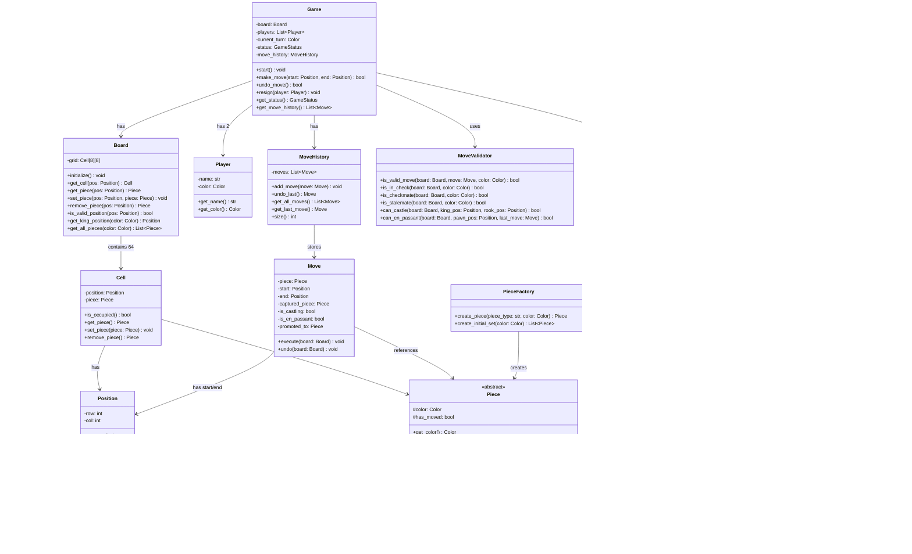
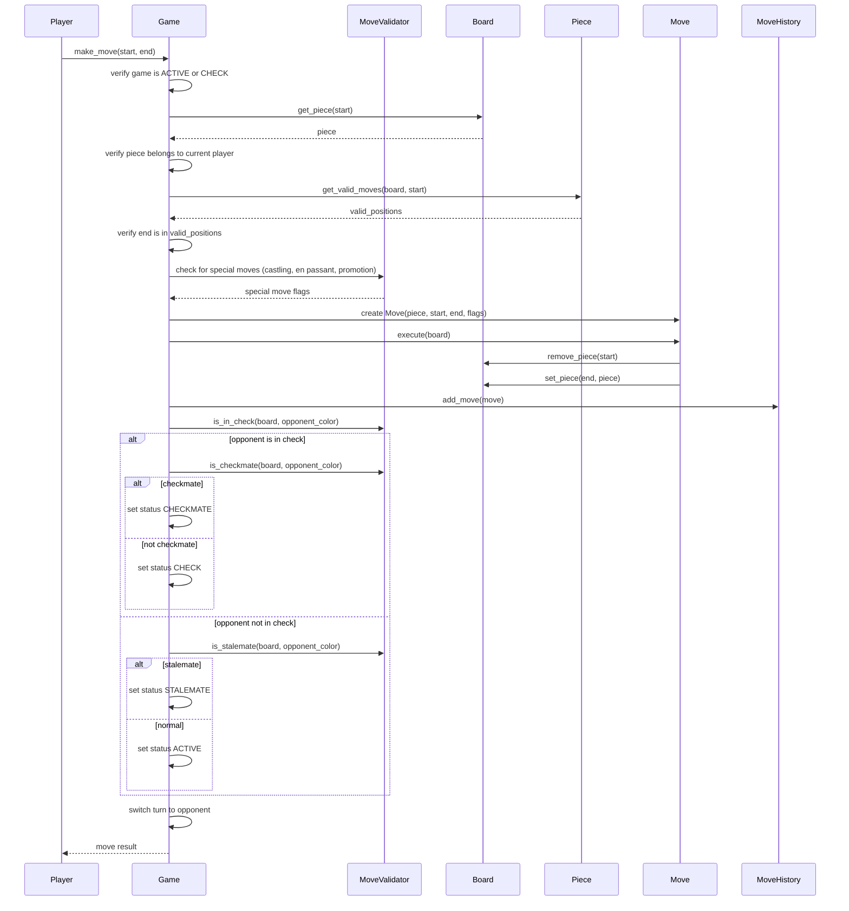
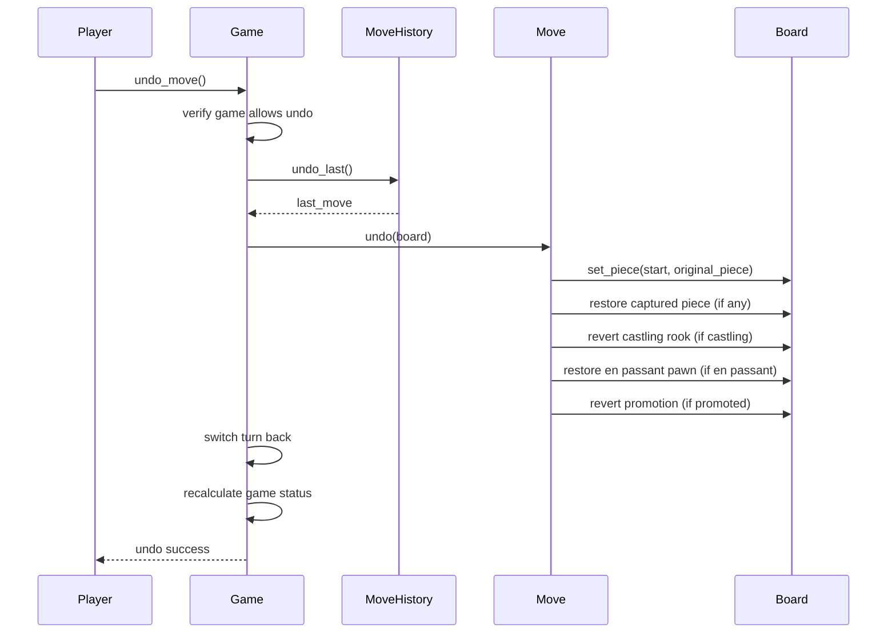
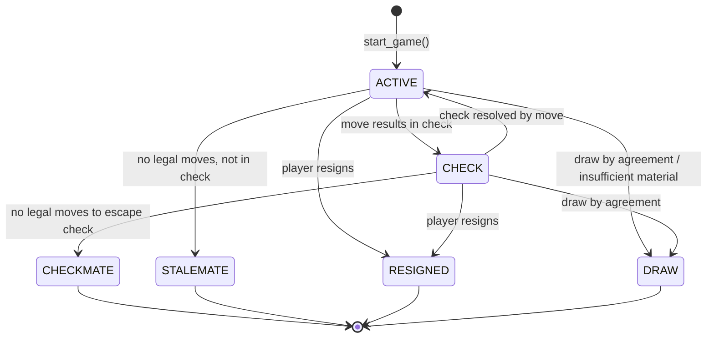

# Low-Level Design: Chess Game

> A two-player chess game engine that enforces standard chess rules, validates
> legal moves per piece type, detects check/checkmate/stalemate, and supports
> special moves (castling, en passant, pawn promotion) with full undo capability.

---

## 1. Requirements

### 1.1 Functional Requirements

- FR-1: Support a two-player game on a standard 8x8 board with alternating turns.
- FR-2: Validate legal moves for each piece type (King, Queen, Rook, Bishop, Knight, Pawn).
- FR-3: Detect check -- warn the player whose king is under attack.
- FR-4: Detect checkmate -- declare the opponent as the winner.
- FR-5: Detect stalemate -- declare the game as a draw.
- FR-6: Support special moves: castling (king-side and queen-side), en passant, and pawn promotion.
- FR-7: Maintain a complete move history with move notation.
- FR-8: Support undo of the last move (reverting board state, captured pieces, and special move side effects).
- FR-9: Allow a player to resign at any time, ending the game.

### 1.2 Constraints & Assumptions

- The system runs as a single process (no distributed concerns).
- Concurrency model: single-threaded (turn-based, one move at a time).
- Persistence: in-memory only (no database).
- Standard FIDE chess rules apply (no custom variants).
- Board is always 8x8 with 32 pieces at the start.
- No time control in the base design (extensibility section covers chess clocks).

> **Guidance:** In an LLD interview for chess, clarify early: "Should I handle
> all special moves (castling, en passant, promotion) or just basic piece
> movement?" This scopes the problem and shows maturity.

---

## 2. Use Cases

| #    | Actor  | Action                          | Outcome                                      |
|------|--------|---------------------------------|----------------------------------------------|
| UC-1 | Player | Starts a new game               | Board initialized with 32 pieces, White moves first |
| UC-2 | Player | Makes a move (source -> dest)   | Move validated, board updated, turn switches  |
| UC-3 | System | Detects check/checkmate/stalemate | Game status updated, players notified        |
| UC-4 | Player | Requests undo of last move      | Board reverted to previous state              |
| UC-5 | Player | Resigns from the game           | Opponent declared winner, game ends           |
| UC-6 | Player | Views move history              | Ordered list of all moves returned            |

> **Guidance:** Keep it to 4-6 use cases. Each one maps to a method or flow
> in the code skeleton below.

---

## 3. Core Classes & Interfaces

### 3.1 Class Diagram



### 3.2 Class Descriptions

| Class / Interface  | Responsibility                                                       | Pattern      |
|--------------------|----------------------------------------------------------------------|--------------|
| `Game`             | Orchestrates gameplay: turn management, move execution, status checks | Facade       |
| `Board`            | Manages the 8x8 grid of cells and piece placement                    | Domain Model |
| `Cell`             | Represents a single square, holds at most one piece                  | Domain Model |
| `Position`         | Immutable (row, col) coordinate on the board                         | Value Object |
| `Player`           | Represents a player with a name and assigned color                   | Domain Model |
| `Piece` (abstract) | Base class for all pieces; defines move generation interface         | Strategy     |
| `King..Pawn`       | Concrete pieces, each implementing its own movement rules            | Strategy     |
| `Move`             | Command object encapsulating a single move with full undo info       | Command      |
| `MoveHistory`      | Stack of executed moves, supports undo                               | Collection   |
| `MoveValidator`    | Validates moves against board state, detects check/checkmate         | Service      |
| `PieceFactory`     | Creates pieces for initial board setup                               | Factory      |
| `Color`            | Enum: WHITE, BLACK                                                   | Enumeration  |
| `GameStatus`       | Enum: ACTIVE, CHECK, CHECKMATE, STALEMATE, RESIGNED, DRAW           | Enumeration  |

> **Guidance:** Each piece subclass encapsulates its own movement rules. This is
> the Strategy pattern applied through polymorphism -- the `Game` class never
> needs to know which piece type it is dealing with.

---

## 4. Design Patterns Used

| Pattern  | Where Applied                          | Why                                                         |
|----------|----------------------------------------|-------------------------------------------------------------|
| Strategy | Move validation per piece type         | Each piece defines its own `get_valid_moves()` -- swap piece behavior without changing the caller |
| Command  | `Move` as a command object             | Encapsulates move execution and undo in a single object, enabling full move reversal |
| State    | `GameStatus` transitions               | Game behavior changes based on status (e.g., cannot move after checkmate) |
| Factory  | `PieceFactory` for initial board setup | Centralizes piece creation, easy to extend for variants      |

### 4.1 Strategy Pattern -- Piece Movement

```
Context: Each chess piece moves differently (rook slides in straight lines,
bishop slides diagonally, knight jumps in L-shapes, etc.).

Instead of:
    if piece_type == "rook":
        return get_rook_moves(board, position)
    elif piece_type == "bishop":
        return get_bishop_moves(board, position)
    ...

Use:
    piece.get_valid_moves(board, position)

Where each Piece subclass implements its own movement logic. The Game
and MoveValidator never need a type check -- they just call the method.
```

### 4.2 Command Pattern -- Move with Undo

```
Context: A move in chess changes multiple pieces of state (piece positions,
captured pieces, castling rights, en passant state). Undoing a move must
perfectly reverse ALL of these side effects.

Each Move object stores:
    - The piece that moved
    - The start and end positions
    - Any captured piece (and its original position)
    - Whether it was a castling move (and the rook's movement)
    - Whether it was en passant (and the captured pawn's position)
    - The promoted piece (if pawn promotion occurred)

move.execute(board)  -->  applies the move to the board
move.undo(board)     -->  perfectly reverses every side effect
```

### 4.3 State Pattern -- Game Status

```
Context: The game transitions through states that control allowed actions.

ACTIVE   -- normal play, moves allowed
CHECK    -- current player's king is in check, must resolve
CHECKMATE -- game over, current player loses
STALEMATE -- game over, draw (no legal moves but not in check)
RESIGNED  -- game over, resigning player loses
DRAW      -- game over by agreement or insufficient material

Only certain transitions are valid (see State Diagram in Section 6).
```

### 4.4 Factory Pattern -- Board Initialization

```
Context: Setting up the initial board requires creating 32 pieces in
specific positions. A PieceFactory centralizes this logic.

factory = PieceFactory()
white_pieces = factory.create_initial_set(Color.WHITE)
black_pieces = factory.create_initial_set(Color.BLACK)

Adding a chess variant (e.g., Chess960) only requires a new factory
method -- no changes to Board, Game, or Piece classes.
```

> **Guidance:** Name the pattern, explain where it applies, and justify *why* it
> helps. Interviewers do not want pattern-stuffing; they want thoughtful application.

---

## 5. Key Flows

### 5.1 Make Move Flow



### 5.2 Undo Move Flow



> **Guidance:** Draw one flow per major use case. Show method-level calls, not
> HTTP requests. Keep the focus on object interactions.

---

## 6. State Diagrams

### 6.1 Game Status State Machine



### 6.2 State Transition Table

| Current State | Event                              | Next State  | Guard Condition                          |
|---------------|------------------------------------|-------------|------------------------------------------|
| ACTIVE        | Move puts opponent in check        | CHECK       | Opponent king attacked but can escape     |
| CHECK         | Move resolves check                | ACTIVE      | King no longer attacked after move        |
| CHECK         | No legal moves available           | CHECKMATE   | King in check and no escape exists        |
| ACTIVE        | No legal moves, king not in check  | STALEMATE   | Current player has zero legal moves       |
| ACTIVE        | Player calls resign()              | RESIGNED    | None                                      |
| CHECK         | Player calls resign()              | RESIGNED    | None                                      |
| ACTIVE        | Draw conditions met                | DRAW        | Mutual agreement or insufficient material |
| CHECK         | Draw conditions met                | DRAW        | Mutual agreement                          |

> **Guidance:** Every object that can change state deserves a state diagram. The table
> format is useful for complex transitions with guard conditions.

---

## 7. Code Skeleton

```python
from abc import ABC, abstractmethod
from enum import Enum
from dataclasses import dataclass, field
from typing import List, Optional, Tuple
from copy import deepcopy


# -- Enums ---------------------------------------------------------------

class Color(Enum):
    WHITE = "WHITE"
    BLACK = "BLACK"

    def opposite(self) -> "Color":
        return Color.BLACK if self == Color.WHITE else Color.WHITE


class GameStatus(Enum):
    ACTIVE = "ACTIVE"
    CHECK = "CHECK"
    CHECKMATE = "CHECKMATE"
    STALEMATE = "STALEMATE"
    RESIGNED = "RESIGNED"
    DRAW = "DRAW"


# -- Value Objects --------------------------------------------------------

@dataclass(frozen=True)
class Position:
    row: int
    col: int

    def is_valid(self) -> bool:
        return 0 <= self.row < 8 and 0 <= self.col < 8

    def __repr__(self) -> str:
        col_letter = chr(ord('a') + self.col)
        return f"{col_letter}{self.row + 1}"


# -- Piece (Abstract + Concrete) -----------------------------------------

class Piece(ABC):
    def __init__(self, color: Color):
        self.color = color
        self.has_moved = False

    @abstractmethod
    def get_valid_moves(self, board: "Board", position: Position) -> List[Position]:
        """Return all positions this piece can move to, ignoring check constraints."""
        ...

    @abstractmethod
    def get_symbol(self) -> str:
        ...

    def _slide_moves(self, board: "Board", position: Position,
                     directions: List[Tuple[int, int]]) -> List[Position]:
        """Helper for sliding pieces (Rook, Bishop, Queen)."""
        moves = []
        for dr, dc in directions:
            r, c = position.row + dr, position.col + dc
            while 0 <= r < 8 and 0 <= c < 8:
                target = Position(r, c)
                target_piece = board.get_piece(target)
                if target_piece is None:
                    moves.append(target)
                elif target_piece.color != self.color:
                    moves.append(target)  # capture
                    break
                else:
                    break  # blocked by own piece
                r += dr
                c += dc
        return moves


class King(Piece):
    def get_valid_moves(self, board: "Board", position: Position) -> List[Position]:
        moves = []
        for dr in [-1, 0, 1]:
            for dc in [-1, 0, 1]:
                if dr == 0 and dc == 0:
                    continue
                target = Position(position.row + dr, position.col + dc)
                if not target.is_valid():
                    continue
                target_piece = board.get_piece(target)
                if target_piece is None or target_piece.color != self.color:
                    moves.append(target)
        # Castling moves are handled separately in MoveValidator
        return moves

    def get_symbol(self) -> str:
        return "K" if self.color == Color.WHITE else "k"


class Queen(Piece):
    def get_valid_moves(self, board: "Board", position: Position) -> List[Position]:
        directions = [(-1, -1), (-1, 0), (-1, 1), (0, -1),
                      (0, 1), (1, -1), (1, 0), (1, 1)]
        return self._slide_moves(board, position, directions)

    def get_symbol(self) -> str:
        return "Q" if self.color == Color.WHITE else "q"


class Rook(Piece):
    def get_valid_moves(self, board: "Board", position: Position) -> List[Position]:
        directions = [(-1, 0), (1, 0), (0, -1), (0, 1)]
        return self._slide_moves(board, position, directions)

    def get_symbol(self) -> str:
        return "R" if self.color == Color.WHITE else "r"


class Bishop(Piece):
    def get_valid_moves(self, board: "Board", position: Position) -> List[Position]:
        directions = [(-1, -1), (-1, 1), (1, -1), (1, 1)]
        return self._slide_moves(board, position, directions)

    def get_symbol(self) -> str:
        return "B" if self.color == Color.WHITE else "b"


class Knight(Piece):
    def get_valid_moves(self, board: "Board", position: Position) -> List[Position]:
        moves = []
        offsets = [(-2, -1), (-2, 1), (-1, -2), (-1, 2),
                   (1, -2), (1, 2), (2, -1), (2, 1)]
        for dr, dc in offsets:
            target = Position(position.row + dr, position.col + dc)
            if not target.is_valid():
                continue
            target_piece = board.get_piece(target)
            if target_piece is None or target_piece.color != self.color:
                moves.append(target)
        return moves

    def get_symbol(self) -> str:
        return "N" if self.color == Color.WHITE else "n"


class Pawn(Piece):
    def get_valid_moves(self, board: "Board", position: Position) -> List[Position]:
        moves = []
        direction = 1 if self.color == Color.WHITE else -1
        start_row = 1 if self.color == Color.WHITE else 6

        # Single step forward
        one_step = Position(position.row + direction, position.col)
        if one_step.is_valid() and board.get_piece(one_step) is None:
            moves.append(one_step)

            # Double step from starting position
            if position.row == start_row:
                two_step = Position(position.row + 2 * direction, position.col)
                if board.get_piece(two_step) is None:
                    moves.append(two_step)

        # Diagonal captures
        for dc in [-1, 1]:
            diag = Position(position.row + direction, position.col + dc)
            if diag.is_valid():
                target_piece = board.get_piece(diag)
                if target_piece is not None and target_piece.color != self.color:
                    moves.append(diag)

        # En passant is handled separately in MoveValidator
        return moves

    def get_symbol(self) -> str:
        return "P" if self.color == Color.WHITE else "p"


# -- Cell -----------------------------------------------------------------

class Cell:
    def __init__(self, position: Position):
        self.position = position
        self.piece: Optional[Piece] = None

    def is_occupied(self) -> bool:
        return self.piece is not None

    def get_piece(self) -> Optional[Piece]:
        return self.piece

    def set_piece(self, piece: Optional[Piece]) -> None:
        self.piece = piece

    def remove_piece(self) -> Optional[Piece]:
        removed = self.piece
        self.piece = None
        return removed


# -- Board ----------------------------------------------------------------

class Board:
    def __init__(self):
        self.grid: List[List[Cell]] = [
            [Cell(Position(r, c)) for c in range(8)] for r in range(8)
        ]

    def initialize(self) -> None:
        """Set up the standard starting position."""
        factory = PieceFactory()
        # Place white pieces (rows 0-1)
        self._place_back_rank(0, Color.WHITE, factory)
        self._place_pawn_rank(1, Color.WHITE)
        # Place black pieces (rows 6-7)
        self._place_pawn_rank(6, Color.BLACK)
        self._place_back_rank(7, Color.BLACK, factory)

    def _place_back_rank(self, row: int, color: Color, factory: "PieceFactory") -> None:
        order = ["rook", "knight", "bishop", "queen", "king", "bishop", "knight", "rook"]
        for col, piece_type in enumerate(order):
            piece = factory.create_piece(piece_type, color)
            self.set_piece(Position(row, col), piece)

    def _place_pawn_rank(self, row: int, color: Color) -> None:
        for col in range(8):
            self.set_piece(Position(row, col), Pawn(color))

    def get_cell(self, pos: Position) -> Cell:
        return self.grid[pos.row][pos.col]

    def get_piece(self, pos: Position) -> Optional[Piece]:
        return self.grid[pos.row][pos.col].get_piece()

    def set_piece(self, pos: Position, piece: Optional[Piece]) -> None:
        self.grid[pos.row][pos.col].set_piece(piece)

    def remove_piece(self, pos: Position) -> Optional[Piece]:
        return self.grid[pos.row][pos.col].remove_piece()

    def is_valid_position(self, pos: Position) -> bool:
        return pos.is_valid()

    def get_king_position(self, color: Color) -> Position:
        for r in range(8):
            for c in range(8):
                piece = self.grid[r][c].get_piece()
                if isinstance(piece, King) and piece.color == color:
                    return Position(r, c)
        raise ValueError(f"No {color.value} king found on board")

    def get_all_pieces(self, color: Color) -> List[Tuple[Position, Piece]]:
        result = []
        for r in range(8):
            for c in range(8):
                piece = self.grid[r][c].get_piece()
                if piece is not None and piece.color == color:
                    result.append((Position(r, c), piece))
        return result


# -- Move (Command Pattern) -----------------------------------------------

@dataclass
class Move:
    piece: Piece
    start: Position
    end: Position
    captured_piece: Optional[Piece] = None
    is_castling: bool = False
    castling_rook_start: Optional[Position] = None
    castling_rook_end: Optional[Position] = None
    is_en_passant: bool = False
    en_passant_capture_pos: Optional[Position] = None
    promoted_to: Optional[Piece] = None
    was_first_move: bool = False  # track if piece had not moved before

    def execute(self, board: Board) -> None:
        """Apply this move to the board."""
        self.was_first_move = not self.piece.has_moved

        # Capture the piece at the destination (if any)
        self.captured_piece = board.get_piece(self.end)

        # Move the piece
        board.remove_piece(self.start)
        board.set_piece(self.end, self.piece)
        self.piece.has_moved = True

        # Handle castling -- also move the rook
        if self.is_castling and self.castling_rook_start and self.castling_rook_end:
            rook = board.remove_piece(self.castling_rook_start)
            board.set_piece(self.castling_rook_end, rook)
            if rook:
                rook.has_moved = True

        # Handle en passant -- remove the captured pawn
        if self.is_en_passant and self.en_passant_capture_pos:
            self.captured_piece = board.remove_piece(self.en_passant_capture_pos)

        # Handle pawn promotion
        if self.promoted_to is not None:
            board.set_piece(self.end, self.promoted_to)

    def undo(self, board: Board) -> None:
        """Reverse this move, restoring the board to its previous state."""
        # Revert pawn promotion
        if self.promoted_to is not None:
            board.set_piece(self.end, self.piece)

        # Move the piece back
        board.remove_piece(self.end)
        board.set_piece(self.start, self.piece)

        # Restore has_moved flag
        if self.was_first_move:
            self.piece.has_moved = False

        # Revert castling
        if self.is_castling and self.castling_rook_start and self.castling_rook_end:
            rook = board.remove_piece(self.castling_rook_end)
            board.set_piece(self.castling_rook_start, rook)
            if rook:
                rook.has_moved = False

        # Restore en passant captured pawn
        if self.is_en_passant and self.en_passant_capture_pos:
            board.set_piece(self.en_passant_capture_pos, self.captured_piece)
        elif self.captured_piece is not None:
            board.set_piece(self.end, self.captured_piece)

    def __repr__(self) -> str:
        symbol = self.piece.get_symbol().upper()
        capture = "x" if self.captured_piece else ""
        return f"{symbol}{self.start}{capture}{self.end}"


# -- Move History ---------------------------------------------------------

class MoveHistory:
    def __init__(self):
        self._moves: List[Move] = []

    def add_move(self, move: Move) -> None:
        self._moves.append(move)

    def undo_last(self) -> Optional[Move]:
        if not self._moves:
            return None
        return self._moves.pop()

    def get_last_move(self) -> Optional[Move]:
        return self._moves[-1] if self._moves else None

    def get_all_moves(self) -> List[Move]:
        return list(self._moves)

    def size(self) -> int:
        return len(self._moves)


# -- Piece Factory --------------------------------------------------------

class PieceFactory:
    _PIECE_MAP = {
        "king": King,
        "queen": Queen,
        "rook": Rook,
        "bishop": Bishop,
        "knight": Knight,
        "pawn": Pawn,
    }

    def create_piece(self, piece_type: str, color: Color) -> Piece:
        cls = self._PIECE_MAP.get(piece_type.lower())
        if cls is None:
            raise ValueError(f"Unknown piece type: {piece_type}")
        return cls(color)

    def create_initial_set(self, color: Color) -> List[Piece]:
        back_rank = ["rook", "knight", "bishop", "queen", "king",
                     "bishop", "knight", "rook"]
        pieces = [self.create_piece(p, color) for p in back_rank]
        pieces += [Pawn(color) for _ in range(8)]
        return pieces


# -- Move Validator -------------------------------------------------------

class MoveValidator:
    @staticmethod
    def is_valid_move(board: Board, start: Position, end: Position,
                      color: Color, last_move: Optional[Move] = None) -> bool:
        """Check if a move is legal (piece rules + does not leave own king in check)."""
        piece = board.get_piece(start)
        if piece is None or piece.color != color:
            return False

        # Check basic piece movement rules
        valid_positions = piece.get_valid_moves(board, start)
        if end not in valid_positions:
            # Also check special moves (castling, en passant)
            if not MoveValidator._is_special_move(board, piece, start, end, last_move):
                return False

        # Simulate the move and check if own king is still safe
        return MoveValidator._does_not_expose_king(board, start, end, color)

    @staticmethod
    def _does_not_expose_king(board: Board, start: Position,
                              end: Position, color: Color) -> bool:
        """Simulate a move and verify the king is not in check afterward."""
        # Save state
        moving_piece = board.get_piece(start)
        captured = board.get_piece(end)

        # Simulate
        board.remove_piece(start)
        board.set_piece(end, moving_piece)

        safe = not MoveValidator.is_in_check(board, color)

        # Restore
        board.set_piece(start, moving_piece)
        board.set_piece(end, captured)

        return safe

    @staticmethod
    def is_in_check(board: Board, color: Color) -> bool:
        """Return True if the king of the given color is under attack."""
        king_pos = board.get_king_position(color)
        opponent = color.opposite()

        for pos, piece in board.get_all_pieces(opponent):
            if king_pos in piece.get_valid_moves(board, pos):
                return True
        return False

    @staticmethod
    def is_checkmate(board: Board, color: Color) -> bool:
        """Return True if the given color is in checkmate."""
        if not MoveValidator.is_in_check(board, color):
            return False
        return not MoveValidator._has_any_legal_move(board, color)

    @staticmethod
    def is_stalemate(board: Board, color: Color) -> bool:
        """Return True if the given color has no legal moves but is not in check."""
        if MoveValidator.is_in_check(board, color):
            return False
        return not MoveValidator._has_any_legal_move(board, color)

    @staticmethod
    def _has_any_legal_move(board: Board, color: Color) -> bool:
        """Check if the given color has at least one legal move."""
        for pos, piece in board.get_all_pieces(color):
            for target in piece.get_valid_moves(board, pos):
                if MoveValidator._does_not_expose_king(board, pos, target, color):
                    return True
        return False

    @staticmethod
    def _is_special_move(board: Board, piece: Piece, start: Position,
                         end: Position, last_move: Optional[Move]) -> bool:
        """Check if the move is a valid castling or en passant."""
        if isinstance(piece, King):
            return MoveValidator.can_castle(board, start, end)
        if isinstance(piece, Pawn) and last_move:
            return MoveValidator.can_en_passant(board, start, end, last_move)
        return False

    @staticmethod
    def can_castle(board: Board, king_pos: Position, target_pos: Position) -> bool:
        """Validate castling: king and rook not moved, path clear, no check through."""
        king = board.get_piece(king_pos)
        if not isinstance(king, King) or king.has_moved:
            return False

        # Determine king-side vs queen-side
        col_diff = target_pos.col - king_pos.col
        if abs(col_diff) != 2:
            return False

        rook_col = 7 if col_diff > 0 else 0
        rook_pos = Position(king_pos.row, rook_col)
        rook = board.get_piece(rook_pos)

        if not isinstance(rook, Rook) or rook.has_moved:
            return False

        # Check path is clear between king and rook
        step = 1 if col_diff > 0 else -1
        for c in range(king_pos.col + step, rook_col, step):
            if board.get_piece(Position(king_pos.row, c)) is not None:
                return False

        # King must not pass through or land on an attacked square
        for c_offset in [0, step, 2 * step]:
            check_pos = Position(king_pos.row, king_pos.col + c_offset)
            board_copy_king = board.get_piece(king_pos)
            # Simulate king at each position along the path
            board.remove_piece(king_pos)
            board.set_piece(check_pos, board_copy_king)
            in_check = MoveValidator.is_in_check(board, king.color)
            board.remove_piece(check_pos)
            board.set_piece(king_pos, board_copy_king)
            if in_check:
                return False

        return True

    @staticmethod
    def can_en_passant(board: Board, pawn_pos: Position,
                       target_pos: Position, last_move: Move) -> bool:
        """Validate en passant: opponent pawn just moved two squares forward."""
        pawn = board.get_piece(pawn_pos)
        if not isinstance(pawn, Pawn):
            return False

        # The last move must have been a two-square pawn advance
        if not isinstance(last_move.piece, Pawn):
            return False
        if abs(last_move.start.row - last_move.end.row) != 2:
            return False

        # The capturing pawn must be on the same row as the opponent's pawn
        if pawn_pos.row != last_move.end.row:
            return False

        # The target square must be diagonally adjacent to the capturing pawn
        direction = 1 if pawn.color == Color.WHITE else -1
        expected_target = Position(pawn_pos.row + direction, last_move.end.col)
        if target_pos != expected_target:
            return False

        # The columns must be adjacent
        if abs(pawn_pos.col - last_move.end.col) != 1:
            return False

        return True


# -- Player ---------------------------------------------------------------

class Player:
    def __init__(self, name: str, color: Color):
        self.name = name
        self.color = color

    def get_name(self) -> str:
        return self.name

    def get_color(self) -> Color:
        return self.color


# -- Game (Facade) --------------------------------------------------------

class Game:
    def __init__(self, player1_name: str, player2_name: str):
        self.board = Board()
        self.players = [
            Player(player1_name, Color.WHITE),
            Player(player2_name, Color.BLACK),
        ]
        self.current_turn = Color.WHITE
        self.status = GameStatus.ACTIVE
        self.move_history = MoveHistory()
        self.validator = MoveValidator()

    def start(self) -> None:
        """Initialize the board and set the game to active."""
        self.board.initialize()
        self.status = GameStatus.ACTIVE
        self.current_turn = Color.WHITE

    def make_move(self, start: Position, end: Position,
                  promote_to: str = "queen") -> bool:
        """Attempt to make a move. Returns True if successful."""
        if self.status in (GameStatus.CHECKMATE, GameStatus.STALEMATE,
                           GameStatus.RESIGNED, GameStatus.DRAW):
            raise ValueError("Game is already over")

        piece = self.board.get_piece(start)
        if piece is None:
            raise ValueError(f"No piece at {start}")
        if piece.color != self.current_turn:
            raise ValueError("Not your turn")

        last_move = self.move_history.get_last_move()

        # Validate the move
        if not self.validator.is_valid_move(
            self.board, start, end, self.current_turn, last_move
        ):
            raise ValueError(f"Illegal move: {start} -> {end}")

        # Build the Move command
        move = self._build_move(piece, start, end, last_move, promote_to)

        # Execute
        move.execute(self.board)
        self.move_history.add_move(move)

        # Update game status
        opponent = self.current_turn.opposite()
        self._update_status(opponent)

        # Switch turn
        self.current_turn = opponent
        return True

    def _build_move(self, piece: Piece, start: Position, end: Position,
                    last_move: Optional[Move], promote_to: str) -> Move:
        """Construct a Move object with all special-move flags."""
        move = Move(piece=piece, start=start, end=end)

        # Castling
        if isinstance(piece, King) and abs(start.col - end.col) == 2:
            move.is_castling = True
            if end.col > start.col:  # king-side
                move.castling_rook_start = Position(start.row, 7)
                move.castling_rook_end = Position(start.row, 5)
            else:  # queen-side
                move.castling_rook_start = Position(start.row, 0)
                move.castling_rook_end = Position(start.row, 3)

        # En passant
        if (isinstance(piece, Pawn) and last_move and
                self.validator.can_en_passant(self.board, start, end, last_move)):
            move.is_en_passant = True
            move.en_passant_capture_pos = last_move.end

        # Pawn promotion
        promotion_row = 7 if piece.color == Color.WHITE else 0
        if isinstance(piece, Pawn) and end.row == promotion_row:
            factory = PieceFactory()
            move.promoted_to = factory.create_piece(promote_to, piece.color)

        return move

    def _update_status(self, opponent_color: Color) -> None:
        """Check for check, checkmate, or stalemate after a move."""
        if self.validator.is_checkmate(self.board, opponent_color):
            self.status = GameStatus.CHECKMATE
        elif self.validator.is_stalemate(self.board, opponent_color):
            self.status = GameStatus.STALEMATE
        elif self.validator.is_in_check(self.board, opponent_color):
            self.status = GameStatus.CHECK
        else:
            self.status = GameStatus.ACTIVE

    def undo_move(self) -> bool:
        """Undo the last move. Returns True if successful."""
        last_move = self.move_history.undo_last()
        if last_move is None:
            return False

        last_move.undo(self.board)
        self.current_turn = self.current_turn.opposite()

        # Recalculate status
        if self.validator.is_in_check(self.board, self.current_turn):
            self.status = GameStatus.CHECK
        else:
            self.status = GameStatus.ACTIVE

        return True

    def resign(self, player: Player) -> None:
        """Player resigns. The opponent wins."""
        self.status = GameStatus.RESIGNED

    def get_status(self) -> GameStatus:
        return self.status

    def get_current_player(self) -> Player:
        for p in self.players:
            if p.color == self.current_turn:
                return p
        raise ValueError("No player found for current turn")

    def get_move_history(self) -> List[Move]:
        return self.move_history.get_all_moves()


# -- Usage Example --------------------------------------------------------

if __name__ == "__main__":
    game = Game("Alice", "Bob")
    game.start()

    # Scholar's Mate example
    game.make_move(Position(1, 4), Position(3, 4))  # e2 -> e4
    game.make_move(Position(6, 4), Position(4, 4))  # e7 -> e5
    game.make_move(Position(0, 5), Position(3, 2))  # Bf1 -> c4
    game.make_move(Position(7, 1), Position(5, 2))  # Nb8 -> c6
    game.make_move(Position(0, 3), Position(2, 5))  # Qd1 -> f3
    game.make_move(Position(6, 3), Position(5, 3))  # d7 -> d6
    game.make_move(Position(2, 5), Position(6, 5))  # Qf3 -> f7  (checkmate)

    print(f"Game status: {game.get_status()}")  # CHECKMATE
    print(f"Move history ({game.move_history.size()} moves):")
    for m in game.get_move_history():
        print(f"  {m}")
```

> **Guidance:** In an interview, write the class signatures and key methods first.
> Fill in method bodies only for the most interesting logic (move validation,
> check detection, special moves). Skip boilerplate getters/setters.

---

## 8. Extensibility & Edge Cases

### 8.1 Extensibility Checklist

| Change Request                         | How the Design Handles It                                    |
|----------------------------------------|--------------------------------------------------------------|
| Add chess clock / timer                | Add a `Timer` class per player; `Game` checks time on each move |
| Online multiplayer                     | Extract a `GameServer` that wraps `Game` and handles networking |
| AI opponent                            | Implement a `Player` subclass that uses minimax or alpha-beta to select moves |
| Move notation (PGN export)             | Add a `PGNFormatter` that reads `MoveHistory` and outputs standard notation |
| Save / load game                       | Serialize `Board` state and `MoveHistory` to JSON or FEN string |
| Chess960 (Fischer Random)              | Create a `Chess960Factory` with randomized back-rank placement |
| Draw by repetition / 50-move rule      | Track position hashes in `MoveHistory`; check for threefold repetition |
| Support for spectators                 | Add an Observer pattern: spectators subscribe to game events   |

### 8.2 Edge Cases to Address

- **Self-check:** A move that leaves your own king in check must be rejected.
- **Castling through check:** King cannot castle through, out of, or into check.
- **En passant timing:** En passant is only valid immediately after the opponent's two-square pawn advance.
- **Pawn promotion choice:** Player must choose which piece to promote to (not always queen).
- **Stalemate vs. checkmate:** Carefully distinguish -- stalemate requires NO legal moves AND king is NOT in check.
- **Insufficient material:** King vs. King, King+Bishop vs. King, King+Knight vs. King are automatic draws.
- **Threefold repetition:** Same position occurring three times allows a draw claim.
- **50-move rule:** If 50 moves pass with no pawn move or capture, either player may claim a draw.

> **Guidance:** Mentioning edge cases proactively signals senior-level thinking.
> You do not need to solve all of them, but you should acknowledge them.

---

## 9. Interview Tips

### What Interviewers Look For

1. **SOLID principles** -- Is each piece class single-responsibility? Does `Piece` define a clean interface?
2. **Design patterns** -- Strategy (piece movement), Command (undo), Factory (board setup) -- applied where they genuinely help.
3. **Extensibility** -- Can you add a new piece type or game variant without modifying existing classes?
4. **Code clarity** -- Are names meaningful (`MoveValidator`, not `Helper`)? Is the structure easy to follow?
5. **Trade-off awareness** -- Why polymorphism over a switch statement? Why Command pattern for undo?

### Approach for a 45-Minute LLD Round

1. **Minutes 0-5:** Clarify requirements. Ask: "Should I handle all special moves? Is this in-memory only?"
2. **Minutes 5-15:** Draw the class diagram. Start with `Game`, `Board`, `Piece` hierarchy, `Move`.
3. **Minutes 15-25:** Walk through the "make move" flow as a sequence diagram.
4. **Minutes 25-40:** Write the code skeleton. Focus on `Piece.get_valid_moves()`, `MoveValidator.is_in_check()`, and `Move.execute()/undo()`.
5. **Minutes 40-45:** Discuss extensibility (AI, timer, online) and edge cases (castling through check, en passant timing).

### Key Talking Points

- **Why abstract `Piece` class?** Open-Closed Principle: add new piece types without modifying `Game` or `Board`.
- **Why `Move` as a Command?** Undo is trivial. Move history is a stack of command objects. Each stores everything needed to reverse itself.
- **Why `MoveValidator` is separate from `Piece`?** Pieces know their own movement rules, but cross-cutting concerns (check detection, castling validation) belong in a dedicated validator. Single Responsibility Principle.
- **Why `Position` is frozen/immutable?** Value objects should not change after creation. Prevents subtle bugs when positions are shared across moves.

### Common Follow-up Questions

- "How would you add an AI player without changing existing classes?"
- "How does your undo handle castling and en passant?"
- "What is the time complexity of check detection? Can you optimize it?"
- "How would you implement threefold repetition detection?"
- "How would you unit test the `MoveValidator`?"

### Common Pitfalls

- Using a giant switch/if-else for piece movement instead of polymorphism.
- Forgetting to handle "does this move leave my own king in check?"
- Not storing enough state in `Move` to support a complete undo.
- Conflating the board model with display logic (keep rendering separate).
- Over-engineering with too many patterns (e.g., adding Observer when not needed).
- Hardcoding piece positions instead of using a factory for setup.

---

> **Checklist before finishing your design:**
> - [x] Requirements clarified and scoped.
> - [x] Class diagram drawn with relationships (inheritance, composition, association).
> - [x] 4 design patterns identified and justified (Strategy, Command, State, Factory).
> - [x] State diagram for game status transitions.
> - [x] Code skeleton covers all core domain logic (piece movement, validation, check/checkmate, special moves, undo).
> - [x] Edge cases acknowledged (self-check, castling rules, en passant timing, draws).
> - [x] Extensibility demonstrated (AI, timer, PGN, online, Chess960).
