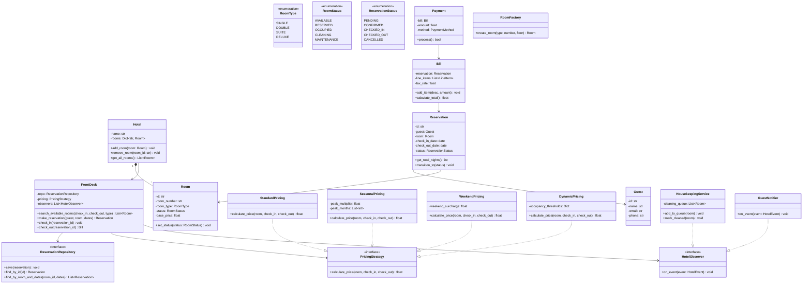
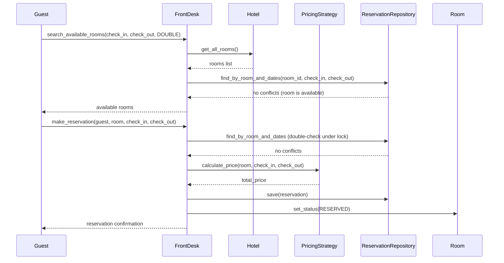
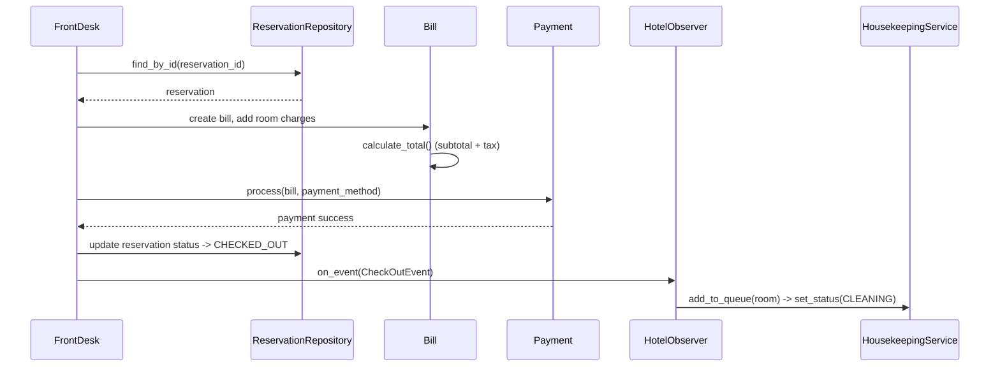
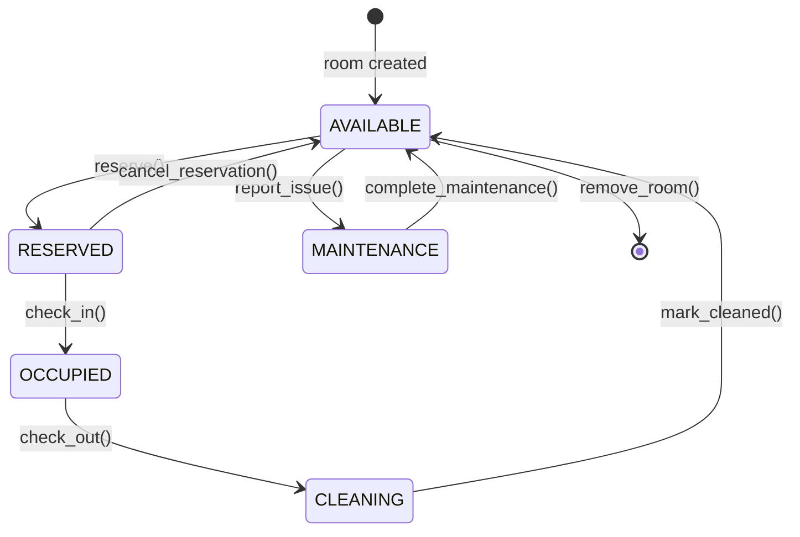
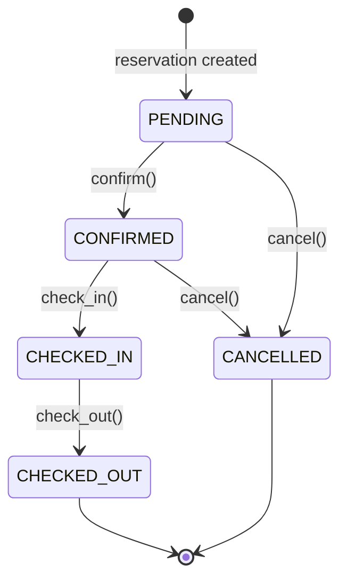

# Low-Level Design: Hotel Management System

> A hotel management system handles room inventory, guest reservations, check-in/check-out
> workflows, dynamic pricing, housekeeping coordination, and billing. The design emphasizes
> clean state management for rooms, pluggable pricing strategies, and decoupled notifications
> via the observer pattern.

---

## 1. Requirements

### 1.1 Functional Requirements

- FR-1: Manage room inventory -- add, remove, and update rooms with types (Single, Double, Suite, Deluxe).
- FR-2: Search available rooms by date range, room type, and guest capacity.
- FR-3: Make, modify, and cancel reservations with conflict detection (no overbooking).
- FR-4: Check-in a guest against an existing reservation; mark room as occupied.
- FR-5: Check-out a guest, generate an itemized bill, and process payment.
- FR-6: Apply pricing strategies -- standard, seasonal, weekend, and dynamic pricing.
- FR-7: Track housekeeping status per room (cleaning schedules, maintenance requests).
- FR-8: Generate bills with room charges, taxes, and additional services.

### 1.2 Constraints & Assumptions

- The system runs as a single process (monolithic, not distributed).
- Concurrency model: multi-threaded -- concurrent reservation requests must be handled safely.
- Persistence: in-memory repositories (swappable to database via interface).
- No overbooking allowed -- a room can have at most one active reservation per date.
- Time granularity is per-night (no hourly bookings).
- Payment processing is abstracted behind an interface (no real gateway integration).

---

## 2. Use Cases

| #    | Actor       | Action                     | Outcome                                          |
|------|-------------|----------------------------|--------------------------------------------------|
| UC-1 | Guest       | Searches available rooms  | List of available rooms matching criteria         |
| UC-2 | Guest       | Makes a reservation       | Reservation created, room marked as reserved      |
| UC-3 | Guest       | Cancels a reservation     | Reservation cancelled, room released              |
| UC-4 | Front Desk  | Checks in a guest         | Room status changes to OCCUPIED                   |
| UC-5 | Front Desk  | Checks out a guest        | Bill generated, payment processed, room to CLEANING |
| UC-6 | Housekeeping| Marks room as cleaned     | Room status changes back to AVAILABLE             |
| UC-7 | Admin       | Adds or updates a room    | Room inventory updated                            |
| UC-8 | System      | Applies pricing           | Correct rate calculated based on active strategy  |

---

## 3. Core Classes & Interfaces

### 3.1 Class Diagram



### 3.2 Class Descriptions

| Class / Interface        | Responsibility                                                  | Pattern      |
|--------------------------|-----------------------------------------------------------------|--------------|
| `Hotel`                  | Aggregate root; owns room inventory and coordinates services    | Aggregate    |
| `Room`                   | Physical room with type, status, and pricing info               | Domain Model |
| `Guest`                  | Guest profile with contact and identification details           | Domain Model |
| `Reservation`            | Binds a guest to a room for a date range; tracks booking status | Domain Model |
| `Bill` / `Payment`       | Itemized invoice and payment transaction                        | Domain Model |
| `PricingStrategy`        | Interface for pluggable rate calculation algorithms             | Strategy     |
| `FrontDesk`              | Orchestrates reservations, check-in/out, and pricing            | Facade       |
| `HotelObserver`          | Interface for event-driven notifications                        | Observer     |
| `HousekeepingService`    | Manages cleaning queue; listens for checkout events             | Observer     |
| `RoomFactory`            | Creates rooms with type-specific defaults (price, capacity)     | Factory      |
| `ReservationRepository`  | Abstract persistence contract for reservations                  | Repository   |

---

## 4. Design Patterns Used

| Pattern    | Where Applied                        | Why                                                          |
|------------|--------------------------------------|--------------------------------------------------------------|
| Strategy   | `PricingStrategy` implementations    | Swap pricing algorithms at runtime without changing FrontDesk |
| State      | `RoomStatus` transitions             | Each status defines its own valid transitions                |
| Observer   | `HotelObserver` on check-out/check-in| Decouple housekeeping and notifications from booking logic   |
| Factory    | `RoomFactory.create_room()`          | Encapsulate room creation with type-specific defaults        |
| Repository | `ReservationRepository`              | Abstract storage so in-memory can be swapped for a database  |
| Facade     | `FrontDesk`                          | Single entry point orchestrating multiple subsystems         |

### 4.1 Strategy Pattern -- Pricing

```
Context: A hotel charges different rates depending on season, day of week, and occupancy.

Instead of:
    if season == "peak": price *= 1.5
    elif day == "saturday": price *= 1.2

Use:
    pricing_strategy.calculate_price(room, check_in, check_out)

Where pricing_strategy is injected into FrontDesk and implements PricingStrategy.
The hotel manager can switch strategies without touching reservation logic.
```

### 4.2 State Pattern -- Room Status

```
Each state restricts which transitions are legal:
    AVAILABLE.reserve()   -> RESERVED    (valid)
    AVAILABLE.check_in()  -> ERROR       (must reserve first)
    RESERVED.check_in()   -> OCCUPIED    (valid)
    OCCUPIED.check_out()  -> CLEANING    (valid)
    CLEANING.mark_clean() -> AVAILABLE   (valid)
    CLEANING.check_in()   -> ERROR       (room not ready)

Invalid transitions raise an exception, preventing inconsistent state.
```

### 4.3 Observer Pattern -- Event Notifications

```
When a guest checks out, multiple things must happen:
  1. Housekeeping must be notified to clean the room.
  2. The guest must receive a receipt/thank-you notification.

Instead of FrontDesk calling each service directly (tight coupling), use:
    for observer in self._observers:
        observer.on_event(CheckOutEvent(room, guest, bill))

New observers can be added without modifying FrontDesk.
```

---

## 5. Key Flows

### 5.1 Make Reservation Flow



### 5.2 Check-Out and Billing Flow



---

## 6. State Diagrams

### 6.1 Room Status State Machine



### 6.2 Reservation Status State Machine



### 6.3 State Transition Tables

**Room Transitions:**

| Current State | Event                  | Next State   | Guard Condition                      |
|---------------|------------------------|--------------|--------------------------------------|
| AVAILABLE     | reserve()              | RESERVED     | No conflicting reservation for dates |
| AVAILABLE     | report_issue()         | MAINTENANCE  | None                                 |
| RESERVED      | check_in()             | OCCUPIED     | Check-in date has arrived            |
| RESERVED      | cancel_reservation()   | AVAILABLE    | None                                 |
| OCCUPIED      | check_out()            | CLEANING     | Bill generated and payment processed |
| CLEANING      | mark_cleaned()         | AVAILABLE    | Housekeeping confirms completion     |
| MAINTENANCE   | complete_maintenance() | AVAILABLE    | Maintenance team signs off           |

**Reservation Transitions:**

| Current State | Event       | Next State   | Guard Condition                        |
|---------------|-------------|--------------|----------------------------------------|
| PENDING       | confirm()   | CONFIRMED    | Payment or deposit received            |
| PENDING       | cancel()    | CANCELLED    | Cancellation policy allows it          |
| CONFIRMED     | check_in()  | CHECKED_IN   | Guest presents ID, check-in date valid |
| CONFIRMED     | cancel()    | CANCELLED    | Cancellation policy allows it          |
| CHECKED_IN    | check_out() | CHECKED_OUT  | Bill settled                           |

---

## 7. Code Skeleton

```python
from abc import ABC, abstractmethod
from enum import Enum
from datetime import date, datetime, timedelta
from dataclasses import dataclass, field
from typing import List, Optional, Dict, Tuple
import uuid, threading

# -- Enums & Transitions -----------------------------------------------------

class RoomType(Enum):
    SINGLE = "SINGLE"
    DOUBLE = "DOUBLE"
    SUITE = "SUITE"
    DELUXE = "DELUXE"

class RoomStatus(Enum):
    AVAILABLE = "AVAILABLE"
    RESERVED = "RESERVED"
    OCCUPIED = "OCCUPIED"
    CLEANING = "CLEANING"
    MAINTENANCE = "MAINTENANCE"

class ReservationStatus(Enum):
    PENDING = "PENDING"
    CONFIRMED = "CONFIRMED"
    CHECKED_IN = "CHECKED_IN"
    CHECKED_OUT = "CHECKED_OUT"
    CANCELLED = "CANCELLED"

class PaymentMethod(Enum):
    CASH = "CASH"
    CREDIT_CARD = "CREDIT_CARD"
    UPI = "UPI"

VALID_ROOM_TRANSITIONS = {
    RoomStatus.AVAILABLE: [RoomStatus.RESERVED, RoomStatus.MAINTENANCE],
    RoomStatus.RESERVED: [RoomStatus.OCCUPIED, RoomStatus.AVAILABLE],
    RoomStatus.OCCUPIED: [RoomStatus.CLEANING],
    RoomStatus.CLEANING: [RoomStatus.AVAILABLE],
    RoomStatus.MAINTENANCE: [RoomStatus.AVAILABLE],
}

# -- Domain Models ------------------------------------------------------------

@dataclass
class Guest:
    id: str = field(default_factory=lambda: str(uuid.uuid4()))
    name: str = ""
    email: str = ""
    phone: str = ""

@dataclass
class Room:
    id: str = field(default_factory=lambda: str(uuid.uuid4()))
    room_number: str = ""
    room_type: RoomType = RoomType.SINGLE
    status: RoomStatus = RoomStatus.AVAILABLE
    floor: int = 1
    base_price: float = 0.0

    def set_status(self, new_status: RoomStatus) -> None:
        if new_status not in VALID_ROOM_TRANSITIONS[self.status]:
            raise ValueError(f"Invalid: {self.status.value} -> {new_status.value}")
        self.status = new_status

@dataclass
class Reservation:
    id: str = field(default_factory=lambda: str(uuid.uuid4()))
    guest: Guest = field(default_factory=Guest)
    room: Room = field(default_factory=Room)
    check_in_date: date = field(default_factory=date.today)
    check_out_date: date = field(default_factory=date.today)
    status: ReservationStatus = ReservationStatus.PENDING

    def get_total_nights(self) -> int:
        return (self.check_out_date - self.check_in_date).days

    def transition_to(self, new_status: ReservationStatus) -> None:
        # Similar validation against VALID_RESERVATION_TRANSITIONS map
        self.status = new_status

@dataclass
class Bill:
    id: str = field(default_factory=lambda: str(uuid.uuid4()))
    reservation: Reservation = field(default_factory=Reservation)
    line_items: List = field(default_factory=list)
    tax_rate: float = 0.18

    def add_item(self, description: str, amount: float) -> None:
        self.line_items.append({"desc": description, "amount": amount})

    def calculate_total(self) -> float:
        subtotal = sum(item["amount"] for item in self.line_items)
        return round(subtotal * (1 + self.tax_rate), 2)

# -- Observer -----------------------------------------------------------------

@dataclass
class HotelEvent:
    event_type: str = ""
    room: Optional[Room] = None
    guest: Optional[Guest] = None

class HotelObserver(ABC):
    @abstractmethod
    def on_event(self, event: HotelEvent) -> None: ...

class HousekeepingService(HotelObserver):
    def __init__(self):
        self._queue: List[Room] = []

    def on_event(self, event: HotelEvent) -> None:
        if event.event_type == "CHECKOUT" and event.room:
            self._queue.append(event.room)
            event.room.set_status(RoomStatus.CLEANING)

    def mark_cleaned(self, room: Room) -> None:
        room.set_status(RoomStatus.AVAILABLE)
        self._queue = [r for r in self._queue if r.id != room.id]

class GuestNotifier(HotelObserver):
    def on_event(self, event: HotelEvent) -> None:
        if event.event_type == "ROOM_READY" and event.guest:
            print(f"[NOTIFY] {event.guest.email}: Your room is ready.")

# -- Pricing Strategies -------------------------------------------------------

class PricingStrategy(ABC):
    @abstractmethod
    def calculate_price(self, room: Room, check_in: date, check_out: date) -> float: ...

class StandardPricing(PricingStrategy):
    def calculate_price(self, room: Room, check_in: date, check_out: date) -> float:
        return room.base_price * (check_out - check_in).days

class SeasonalPricing(PricingStrategy):
    def __init__(self, peak_months=None, peak_multiplier=1.5):
        self._peak_months = peak_months or [4, 5, 6, 10, 11, 12]
        self._multiplier = peak_multiplier

    def calculate_price(self, room: Room, check_in: date, check_out: date) -> float:
        total, current = 0.0, check_in
        while current < check_out:
            m = self._multiplier if current.month in self._peak_months else 1.0
            total += room.base_price * m
            current += timedelta(days=1)
        return round(total, 2)

class WeekendPricing(PricingStrategy):
    def __init__(self, surcharge=0.25):
        self._surcharge = surcharge

    def calculate_price(self, room: Room, check_in: date, check_out: date) -> float:
        total, current = 0.0, check_in
        while current < check_out:
            mult = (1 + self._surcharge) if current.weekday() in (4, 5) else 1.0
            total += room.base_price * mult
            current += timedelta(days=1)
        return round(total, 2)

class DynamicPricing(PricingStrategy):
    def __init__(self, hotel: "Hotel"):
        self._hotel = hotel
        self._thresholds = [(0.9, 1.8), (0.75, 1.4), (0.5, 1.1), (0.0, 1.0)]

    def calculate_price(self, room: Room, check_in: date, check_out: date) -> float:
        rooms = self._hotel.get_all_rooms()
        occupied = sum(1 for r in rooms if r.status in (RoomStatus.OCCUPIED, RoomStatus.RESERVED))
        rate = occupied / len(rooms) if rooms else 0
        multiplier = next(m for t, m in self._thresholds if rate >= t)
        return round(room.base_price * multiplier * (check_out - check_in).days, 2)

# -- Factory & Repository ----------------------------------------------------

class RoomFactory:
    _DEFAULTS = {RoomType.SINGLE: 100, RoomType.DOUBLE: 180, RoomType.SUITE: 350, RoomType.DELUXE: 500}

    @staticmethod
    def create_room(room_type: RoomType, room_number: str, floor: int) -> Room:
        return Room(room_number=room_number, room_type=room_type, floor=floor,
                    base_price=RoomFactory._DEFAULTS.get(room_type, 100))

class ReservationRepository(ABC):
    @abstractmethod
    def save(self, reservation: Reservation) -> None: ...
    @abstractmethod
    def find_by_id(self, res_id: str) -> Optional[Reservation]: ...
    @abstractmethod
    def find_by_room_and_dates(self, room_id: str, ci: date, co: date) -> List[Reservation]: ...

class InMemoryReservationRepository(ReservationRepository):
    def __init__(self):
        self._store: Dict[str, Reservation] = {}
        self._lock = threading.Lock()

    def save(self, reservation: Reservation) -> None:
        with self._lock:
            self._store[reservation.id] = reservation

    def find_by_id(self, res_id: str) -> Optional[Reservation]:
        return self._store.get(res_id)

    def find_by_room_and_dates(self, room_id: str, ci: date, co: date) -> List[Reservation]:
        return [r for r in self._store.values()
                if r.room.id == room_id
                and r.status not in (ReservationStatus.CANCELLED, ReservationStatus.CHECKED_OUT)
                and r.check_in_date < co and r.check_out_date > ci]

# -- Hotel & FrontDesk (Facade) -----------------------------------------------

class Hotel:
    def __init__(self, name: str):
        self.name, self._rooms = name, {}

    def add_room(self, room: Room) -> None: self._rooms[room.id] = room
    def remove_room(self, room_id: str) -> None: self._rooms.pop(room_id, None)
    def get_all_rooms(self) -> List[Room]: return list(self._rooms.values())

class FrontDesk:
    def __init__(self, hotel: Hotel, repo: ReservationRepository, pricing: PricingStrategy):
        self._hotel, self._repo, self._pricing = hotel, repo, pricing
        self._observers: List[HotelObserver] = []
        self._lock = threading.Lock()

    def add_observer(self, obs: HotelObserver) -> None: self._observers.append(obs)
    def set_pricing(self, s: PricingStrategy) -> None: self._pricing = s

    def search_available_rooms(self, ci: date, co: date, rt: RoomType = None) -> List[Room]:
        return [r for r in self._hotel.get_all_rooms()
                if r.status != RoomStatus.MAINTENANCE
                and (rt is None or r.room_type == rt)
                and not self._repo.find_by_room_and_dates(r.id, ci, co)]

    def make_reservation(self, guest: Guest, room: Room, ci: date, co: date) -> Reservation:
        with self._lock:  # Prevents overbooking under concurrency
            if self._repo.find_by_room_and_dates(room.id, ci, co):
                raise ValueError(f"Room {room.room_number} not available.")
            res = Reservation(guest=guest, room=room, check_in_date=ci,
                              check_out_date=co, status=ReservationStatus.CONFIRMED)
            self._repo.save(res)
            room.set_status(RoomStatus.RESERVED)
            self._notify(HotelEvent("RESERVATION_CONFIRMED", room, guest))
            return res

    def check_in(self, res_id: str) -> None:
        res = self._repo.find_by_id(res_id)
        res.transition_to(ReservationStatus.CHECKED_IN)
        res.room.set_status(RoomStatus.OCCUPIED)

    def check_out(self, res_id: str, method: PaymentMethod) -> Bill:
        res = self._repo.find_by_id(res_id)
        res.transition_to(ReservationStatus.CHECKED_OUT)
        rate = self._pricing.calculate_price(res.room, res.check_in_date, res.check_out_date)
        bill = Bill(reservation=res)
        bill.add_item(f"Room {res.room.room_number} ({res.get_total_nights()} nights)", rate)
        self._notify(HotelEvent("CHECKOUT", res.room, res.guest))
        return bill

    def _notify(self, event: HotelEvent) -> None:
        for obs in self._observers:
            obs.on_event(event)
```

---

## 8. Extensibility & Edge Cases

### 8.1 Extensibility Checklist

| Change Request                              | How the Design Handles It                                      |
|---------------------------------------------|----------------------------------------------------------------|
| Add room service ordering                   | Create `RoomServiceOrder` class; add line items to `Bill`      |
| Implement a loyalty/rewards program         | Add `LoyaltyService` observer; accumulate points on checkout   |
| Support multi-property hotel chain          | Add `HotelChain` aggregate that owns multiple `Hotel` instances|
| Add conference/banquet room booking         | Create `ConferenceRoom` subclass with hourly pricing strategy  |
| Add a new pricing strategy (holiday rates)  | Implement `PricingStrategy` interface, inject into `FrontDesk` |
| Switch from in-memory to database storage   | Implement `ReservationRepository` with a database driver       |
| Support group bookings (multiple rooms)     | Create `GroupReservation` holding a list of `Reservation`      |

### 8.2 Edge Cases to Address

- **Overbooking race condition:** Two concurrent requests book the same room for overlapping dates. Handled by the lock in `make_reservation` and double-checking availability under lock.
- **No-show handling:** Guest never checks in. A scheduled job should cancel stale reservations after a grace period (e.g., 24 hours past check-in date).
- **Maintenance during reservation:** A room with a future reservation goes into maintenance. Must notify the guest and reassign to an equivalent room.
- **Date validation:** Check-out date must be after check-in date. Both dates must be in the future.
- **Idempotent operations:** Cancelling an already-cancelled reservation should not throw.
- **Concurrent housekeeping:** Two housekeepers should not be assigned the same room. The cleaning queue should dequeue atomically.

---

## 9. Interview Tips

### What Interviewers Look For

1. **SOLID principles** -- `PricingStrategy` follows Open/Closed (add new strategies without modifying `FrontDesk`). `ReservationRepository` follows Dependency Inversion.
2. **Design patterns applied thoughtfully** -- Strategy for pricing, Observer for event-driven side effects, Factory for room creation, State for room lifecycle.
3. **Concurrency awareness** -- Locking during reservation to prevent overbooking. Thread-safe repository operations.
4. **State management** -- Clear state machines for both rooms and reservations with explicit valid transitions.
5. **Separation of concerns** -- Billing is separate from reservation logic. Housekeeping is decoupled via observer.

### Approach for a 45-Minute LLD Round

1. **Minutes 0-5:** Clarify scope. Ask: "Should I handle multiple hotels or just one? Do we need hourly bookings?"
2. **Minutes 5-15:** Draw the class diagram. Start with `Room`, `Guest`, `Reservation`, then add `FrontDesk` as the facade.
3. **Minutes 15-25:** Walk through reservation and check-out flows as sequence diagrams.
4. **Minutes 25-40:** Code skeleton -- focus on `Room.set_status()`, `FrontDesk.make_reservation()`, and `PricingStrategy`.
5. **Minutes 40-45:** Discuss extensibility (loyalty program, multi-property) and edge cases (race conditions, no-shows).

### Common Follow-up Questions

- "How would you prevent overbooking on multiple servers?" -- Optimistic locking with version field, or distributed locking (Redis/Zookeeper).
- "How would you add a new room type?" -- Add a `RoomType` enum value and a new entry in `RoomFactory._DEFAULTS`. No other changes needed.
- "How would you unit test FrontDesk?" -- Inject mock `ReservationRepository` and mock `PricingStrategy`. Verify `make_reservation` calls `save()`.
- "What about composite pricing (seasonal + weekend)?" -- Use Decorator pattern: `CompositePricing` wraps a base strategy and applies multiple adjustments.
- "How would you handle split bills?" -- Allow multiple `Payment` objects per `Bill`. Track remaining balance.

### Common Pitfalls

- Mixing room status management with reservation logic (violates SRP).
- Hardcoding pricing rules inside the reservation flow instead of using a strategy.
- Forgetting concurrency -- two users booking the same room simultaneously.
- Using inheritance for room types (`SingleRoom`, `DoubleRoom`) when composition with `RoomType` enum is simpler.
- Not defining a clear state machine for rooms, leading to invalid states.

---

> **Checklist before finishing your design:**
> - [x] Requirements clarified and scoped (8 FRs, constraints defined).
> - [x] Class diagram with relationships (composition, association, interface implementation).
> - [x] 4 design patterns identified and justified (Strategy, State, Observer, Factory).
> - [x] State diagrams for Room and Reservation with transition tables.
> - [x] Code skeleton covers core domain logic (state transitions, pricing, overbooking prevention).
> - [x] Edge cases acknowledged (race conditions, no-shows, maintenance conflicts).
> - [x] Extensibility demonstrated (loyalty, multi-property, composite pricing, room service).
