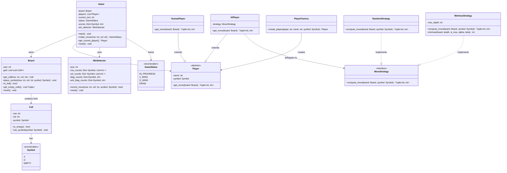
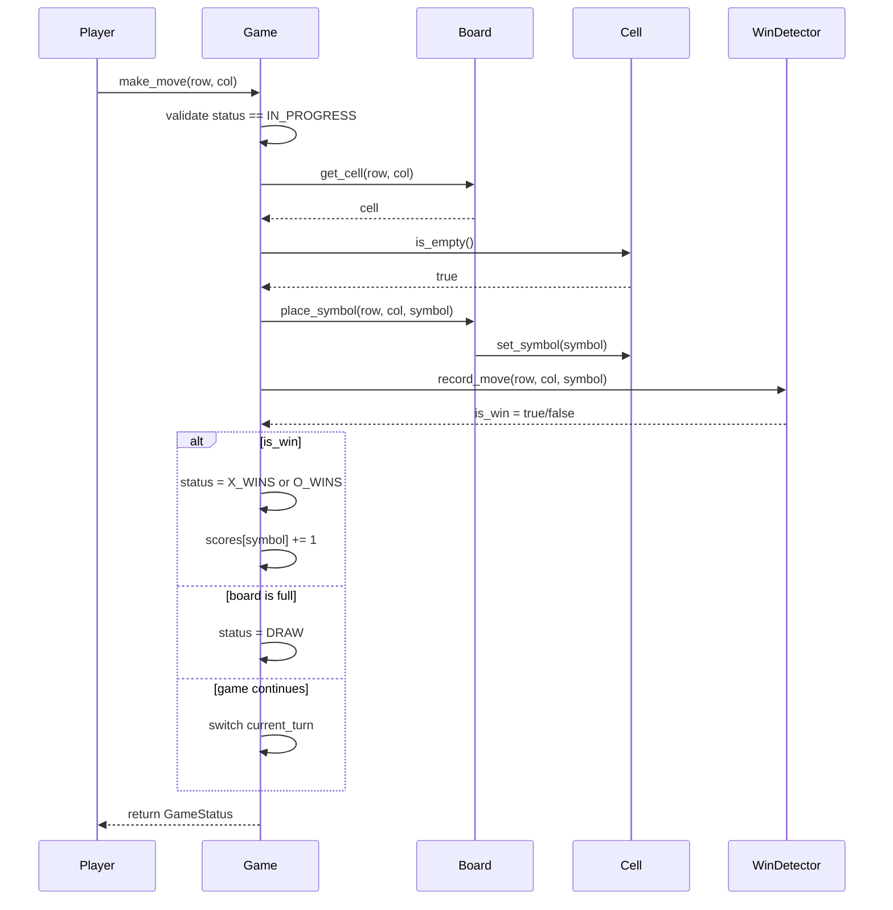
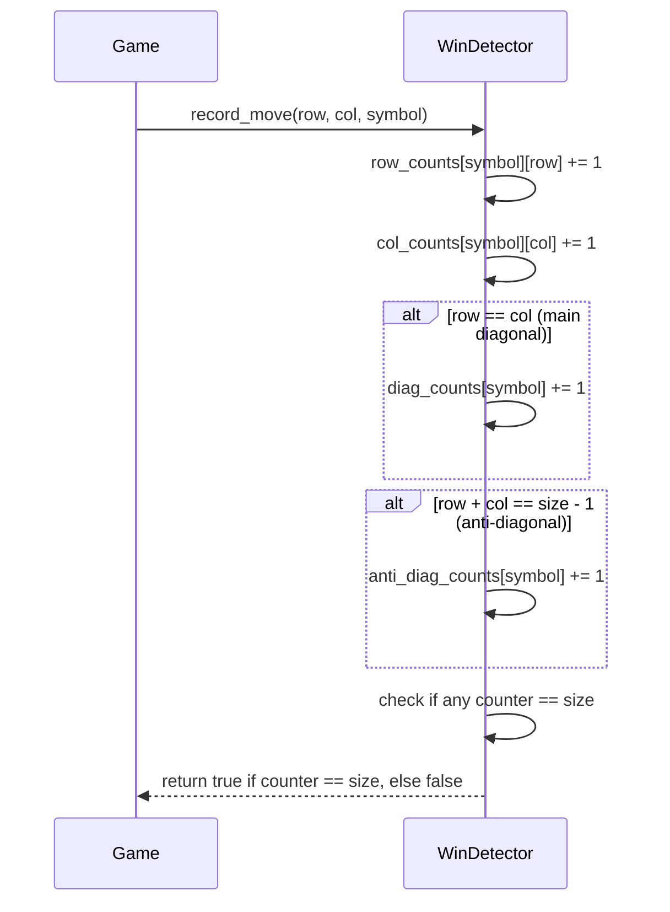
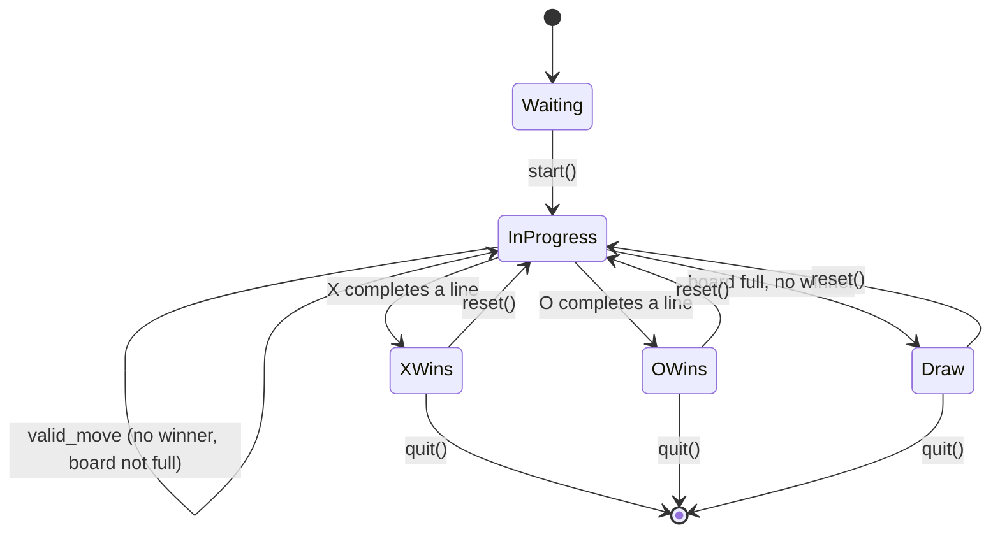

# Low-Level Design: Tic-Tac-Toe Game

> Two-player Tic-Tac-Toe on an NxN board (default 3x3). Detects wins, draws,
> and invalid moves. Supports human vs AI and is extensible to K-in-a-row variants.

---

## 1. Requirements

### 1.1 Functional Requirements

- FR-1: Support a two-player game on an NxN board (default N=3).
- FR-2: Players alternate turns; Player 1 is always X and goes first.
- FR-3: Validate every move -- reject out-of-bounds or already-occupied cells.
- FR-4: Detect a win when a player completes an entire row, column, or diagonal.
- FR-5: Detect a draw when all cells are filled with no winner.
- FR-6: Track cumulative scores across multiple rounds.
- FR-7: Allow players to restart / replay after a game ends.
- FR-8: Support Human vs Human and Human vs AI modes.

### 1.2 Constraints & Assumptions

- The system runs as a single process (console-based, no networking).
- Concurrency model: single-threaded (turn-based game, no concurrent moves).
- Persistence: in-memory only; scores reset when the process exits.
- Board size N is configurable at game creation time (minimum 3).
- AI difficulty is pluggable via the Strategy pattern.

---

## 2. Use Cases

| #    | Actor  | Action                          | Outcome                                      |
|------|--------|---------------------------------|----------------------------------------------|
| UC-1 | Player | Starts a new game               | Board is created, Player X is prompted        |
| UC-2 | Player | Makes a move (row, col)         | Symbol placed if valid; error if invalid      |
| UC-3 | System | Checks for win after each move  | Game ends with winner or continues            |
| UC-4 | System | Checks for draw after each move | Game ends as draw or continues                |
| UC-5 | Player | Requests a rematch / restart    | Scores persist, board resets, new round begins|
| UC-6 | AI     | Computes next move              | AI strategy selects optimal cell              |

---

## 3. Core Classes & Interfaces

### 3.1 Class Diagram



### 3.2 Class Descriptions

| Class / Interface   | Responsibility                                                          | Pattern      |
|---------------------|-------------------------------------------------------------------------|--------------|
| `Game`              | Orchestrates gameplay: turn management, move validation, status updates  | Facade       |
| `Board`             | Maintains the NxN grid of cells, handles placement and reset            | Domain Model |
| `Cell`              | Represents a single position on the board, holds a symbol               | Value Object |
| `Symbol`            | Enum for X, O, and EMPTY                                                | Enumeration  |
| `GameStatus`        | Enum for game outcomes: IN_PROGRESS, X_WINS, O_WINS, DRAW              | Enumeration  |
| `Player`            | Abstract base for all player types, defines `get_move` contract         | Template     |
| `HumanPlayer`       | Concrete player that reads input from a human                           | --           |
| `AIPlayer`          | Concrete player that delegates move selection to a strategy             | Strategy     |
| `MoveStrategy`      | Interface for AI move algorithms                                        | Strategy     |
| `RandomStrategy`    | Picks a random empty cell                                               | Strategy     |
| `MinimaxStrategy`   | Uses minimax with alpha-beta pruning for optimal play                   | Strategy     |
| `WinDetector`       | O(1) per-move win detection using row/col/diagonal counters             | Domain Model |
| `PlayerFactory`     | Creates Human or AI players based on configuration                      | Factory      |

---

## 4. Design Patterns Used

| Pattern   | Where Applied                     | Why                                                          |
|-----------|-----------------------------------|--------------------------------------------------------------|
| Strategy  | `MoveStrategy` for AI players     | Swap AI algorithms (random, minimax) without changing AIPlayer|
| State     | `GameStatus` transitions in `Game`| Each status governs what actions are legal next               |
| Factory   | `PlayerFactory`                   | Centralise player creation; caller does not know concrete type|
| Facade    | `Game` class                      | Single entry point for all game operations                    |

### 4.1 Strategy Pattern -- AI Move Selection

```
Instead of:
    if difficulty == "easy": pick random cell
    elif difficulty == "hard": run minimax

Use:
    ai_player.strategy.compute_move(board, symbol)

Strategy is injected at construction time. Adding a new difficulty (e.g., MCTS)
requires only a new class implementing MoveStrategy -- no changes to AIPlayer.
```

### 4.2 State Pattern -- Game Status Transitions

```
WAITING      -> start()     -> IN_PROGRESS
IN_PROGRESS  -> make_move() -> IN_PROGRESS  (no winner, board not full)
IN_PROGRESS  -> make_move() -> X_WINS       (X completes a line)
IN_PROGRESS  -> make_move() -> O_WINS       (O completes a line)
IN_PROGRESS  -> make_move() -> DRAW         (board full, no winner)
X_WINS/O_WINS/DRAW -> reset() -> IN_PROGRESS (new round)

Moves are rejected unless status is IN_PROGRESS.
```

### 4.3 Factory Pattern -- Player Creation

```
PlayerFactory.create_player("human", "Alice", Symbol.X)       -> HumanPlayer
PlayerFactory.create_player("ai", "Bot", Symbol.O, MinimaxStrategy())  -> AIPlayer

Game does not know or care whether it deals with HumanPlayer or AIPlayer.
```

---

## 5. Key Flows

### 5.1 Make Move Flow



### 5.2 Win Detection Algorithm Flow



> **Key insight:** By maintaining running counters for each row, column, and
> diagonal, we achieve O(1) win detection per move instead of O(N^2) scanning.

---

## 6. State Diagrams

### 6.1 Game Lifecycle



### 6.2 State Transition Table

| Current State | Event / Action          | Next State   | Guard Condition                   |
|---------------|------------------------|--------------|-----------------------------------|
| Waiting       | start()                | InProgress   | Two players assigned, board ready |
| InProgress    | make_move() -- valid   | InProgress   | No winner, board not full         |
| InProgress    | make_move() -- win     | XWins/OWins  | WinDetector returns true          |
| InProgress    | make_move() -- draw    | Draw         | Board is full, no winner          |
| XWins/OWins   | reset()                | InProgress   | Scores preserved, board cleared   |
| Draw          | reset()                | InProgress   | Scores preserved, board cleared   |
| Any terminal  | quit()                 | [*]          | --                                |

---

## 7. Code Skeleton

```python
from abc import ABC, abstractmethod
from enum import Enum
from dataclasses import dataclass
from typing import List, Optional, Dict, Tuple
import random, math

# -- Enums -----------------------------------------------------------------
class Symbol(Enum):
    X = "X"; O = "O"; EMPTY = " "

class GameStatus(Enum):
    WAITING = "WAITING"; IN_PROGRESS = "IN_PROGRESS"
    X_WINS = "X_WINS"; O_WINS = "O_WINS"; DRAW = "DRAW"

# -- Cell ------------------------------------------------------------------
@dataclass
class Cell:
    row: int
    col: int
    symbol: Symbol = Symbol.EMPTY

    def is_empty(self) -> bool: return self.symbol == Symbol.EMPTY

    def set_symbol(self, symbol: Symbol) -> None:
        if not self.is_empty():
            raise ValueError(f"Cell ({self.row}, {self.col}) already occupied")
        self.symbol = symbol

# -- Board -----------------------------------------------------------------
class Board:
    def __init__(self, size: int = 3):
        self._size = size
        self._grid = [[Cell(r, c) for c in range(size)] for r in range(size)]
        self._move_count = 0

    @property
    def size(self) -> int: return self._size

    def get_cell(self, row: int, col: int) -> Cell:
        if not (0 <= row < self._size and 0 <= col < self._size):
            raise IndexError(f"({row}, {col}) out of bounds")
        return self._grid[row][col]

    def place_symbol(self, row: int, col: int, symbol: Symbol) -> None:
        self.get_cell(row, col).set_symbol(symbol)
        self._move_count += 1

    def is_full(self) -> bool: return self._move_count == self._size ** 2

    def get_empty_cells(self) -> List[Tuple[int, int]]:
        return [(r, c) for r in range(self._size)
                for c in range(self._size) if self._grid[r][c].is_empty()]

    def reset(self) -> None:
        for row in self._grid:
            for cell in row:
                cell.symbol = Symbol.EMPTY
        self._move_count = 0

# -- Win Detector (O(1) per move) ------------------------------------------
class WinDetector:
    """Maintains counters for rows, columns, and diagonals. O(1) per move."""
    def __init__(self, size: int):
        self._size = size
        self._row = {Symbol.X: [0]*size, Symbol.O: [0]*size}
        self._col = {Symbol.X: [0]*size, Symbol.O: [0]*size}
        self._diag = {Symbol.X: 0, Symbol.O: 0}
        self._anti = {Symbol.X: 0, Symbol.O: 0}

    def record_move(self, row: int, col: int, symbol: Symbol) -> bool:
        self._row[symbol][row] += 1
        self._col[symbol][col] += 1
        if row == col: self._diag[symbol] += 1
        if row + col == self._size - 1: self._anti[symbol] += 1
        return (self._row[symbol][row] == self._size
                or self._col[symbol][col] == self._size
                or self._diag[symbol] == self._size
                or self._anti[symbol] == self._size)

    def reset(self) -> None:
        for s in (Symbol.X, Symbol.O):
            self._row[s] = [0]*self._size; self._col[s] = [0]*self._size
            self._diag[s] = 0; self._anti[s] = 0

# -- Player ----------------------------------------------------------------
class Player(ABC):
    def __init__(self, name: str, symbol: Symbol):
        self._name, self._symbol = name, symbol
    @property
    def name(self) -> str: return self._name
    @property
    def symbol(self) -> Symbol: return self._symbol
    @abstractmethod
    def get_move(self, board: Board) -> Tuple[int, int]: ...

class HumanPlayer(Player):
    def get_move(self, board: Board) -> Tuple[int, int]:
        raw = input(f"{self._name} ({self._symbol.value}), enter row col: ")
        return tuple(map(int, raw.strip().split()))

# -- AI Strategies (Strategy Pattern) -------------------------------------
class MoveStrategy(ABC):
    @abstractmethod
    def compute_move(self, board: Board, symbol: Symbol) -> Tuple[int, int]: ...

class RandomStrategy(MoveStrategy):
    def compute_move(self, board: Board, symbol: Symbol) -> Tuple[int, int]:
        return random.choice(board.get_empty_cells())

class MinimaxStrategy(MoveStrategy):
    """Minimax with alpha-beta pruning. Best for 3x3; depth-limit for larger."""
    def __init__(self, max_depth: int = 9):
        self._max_depth = max_depth

    def compute_move(self, board: Board, symbol: Symbol) -> Tuple[int, int]:
        opp = Symbol.O if symbol == Symbol.X else Symbol.X
        best_score, best_move = -math.inf, None
        for r, c in board.get_empty_cells():
            board.get_cell(r, c).symbol = symbol; board._move_count += 1
            score = self._minimax(board, 0, False, -math.inf, math.inf, symbol, opp)
            board.get_cell(r, c).symbol = Symbol.EMPTY; board._move_count -= 1
            if score > best_score: best_score, best_move = score, (r, c)
        return best_move

    def _minimax(self, board, depth, is_max, alpha, beta, ai, opp) -> float:
        winner = self._check_winner(board)
        if winner == ai: return 10 - depth
        if winner == opp: return depth - 10
        if board.is_full() or depth >= self._max_depth: return 0
        sym, best = (ai, -math.inf) if is_max else (opp, math.inf)
        for r, c in board.get_empty_cells():
            board.get_cell(r, c).symbol = sym; board._move_count += 1
            val = self._minimax(board, depth+1, not is_max, alpha, beta, ai, opp)
            board.get_cell(r, c).symbol = Symbol.EMPTY; board._move_count -= 1
            if is_max: best = max(best, val); alpha = max(alpha, val)
            else: best = min(best, val); beta = min(beta, val)
            if beta <= alpha: break
        return best

    @staticmethod
    def _check_winner(board: Board) -> Optional[Symbol]:
        n = board.size
        for i in range(n):
            s = board.get_cell(i, 0).symbol
            if s != Symbol.EMPTY and all(board.get_cell(i, c).symbol == s for c in range(n)):
                return s
            s = board.get_cell(0, i).symbol
            if s != Symbol.EMPTY and all(board.get_cell(r, i).symbol == s for r in range(n)):
                return s
        s = board.get_cell(0, 0).symbol
        if s != Symbol.EMPTY and all(board.get_cell(d, d).symbol == s for d in range(n)):
            return s
        s = board.get_cell(0, n-1).symbol
        if s != Symbol.EMPTY and all(board.get_cell(d, n-1-d).symbol == s for d in range(n)):
            return s
        return None

class AIPlayer(Player):
    def __init__(self, name: str, symbol: Symbol, strategy: MoveStrategy):
        super().__init__(name, symbol)
        self._strategy = strategy
    def get_move(self, board: Board) -> Tuple[int, int]:
        return self._strategy.compute_move(board, self._symbol)

# -- Player Factory -------------------------------------------------------
class PlayerFactory:
    @staticmethod
    def create_player(ptype: str, name: str, symbol: Symbol,
                      strategy: Optional[MoveStrategy] = None) -> Player:
        if ptype == "human": return HumanPlayer(name, symbol)
        if ptype == "ai": return AIPlayer(name, symbol, strategy or RandomStrategy())
        raise ValueError(f"Unknown player type: {ptype}")

# -- Game (Facade) --------------------------------------------------------
class Game:
    def __init__(self, player1: Player, player2: Player, board_size: int = 3):
        self._board = Board(board_size)
        self._players = [player1, player2]
        self._current_turn = 0
        self._status = GameStatus.WAITING
        self._win_detector = WinDetector(board_size)
        self._scores: Dict[Symbol, int] = {Symbol.X: 0, Symbol.O: 0}

    @property
    def status(self) -> GameStatus: return self._status
    @property
    def scores(self) -> Dict[Symbol, int]: return dict(self._scores)

    def start(self) -> None: self._status = GameStatus.IN_PROGRESS
    def get_current_player(self) -> Player: return self._players[self._current_turn]

    def make_move(self, row: int, col: int) -> GameStatus:
        if self._status != GameStatus.IN_PROGRESS:
            raise RuntimeError(f"Cannot move: game is {self._status.value}")
        current = self.get_current_player()
        self._board.place_symbol(row, col, current.symbol)
        if self._win_detector.record_move(row, col, current.symbol):
            self._status = GameStatus.X_WINS if current.symbol == Symbol.X else GameStatus.O_WINS
            self._scores[current.symbol] += 1
        elif self._board.is_full():
            self._status = GameStatus.DRAW
        else:
            self._current_turn = 1 - self._current_turn
        return self._status

    def reset(self) -> None:
        self._board.reset(); self._win_detector.reset()
        self._current_turn = 0; self._status = GameStatus.IN_PROGRESS
```

---

## 8. Extensibility & Edge Cases

### 8.1 Extensibility Checklist

| Change Request                            | How the Design Handles It                                     |
|-------------------------------------------|---------------------------------------------------------------|
| NxN board (e.g., 5x5, 10x10)             | Board and WinDetector already accept `size` parameter         |
| K-in-a-row to win (K != N)               | Add `win_length` param to WinDetector; adjust counter threshold|
| New AI difficulty (MCTS, neural net)      | Implement `MoveStrategy` interface, inject into AIPlayer       |
| Online multiplayer                        | Replace `HumanPlayer.get_move` with a network-backed player   |
| Persistent leaderboard                    | Extract scores into a `ScoreRepository` interface              |
| Undo / redo moves                         | Add a move history stack to `Game`; reverse counter updates    |
| Spectator mode                            | Add Observer pattern: `Game` emits events, spectators subscribe|
| Tournament mode                           | Create a `Tournament` class managing multiple `Game` instances |

### 8.2 Edge Cases to Address

- **Double move on same cell:** `Cell.set_symbol` raises if already occupied.
- **Move after game over:** `Game.make_move` rejects if status is not IN_PROGRESS.
- **Out-of-bounds move:** `Board.get_cell` raises `IndexError`.
- **AI on large boards:** `MinimaxStrategy.max_depth` limits search depth.
- **Draw correctness:** Draw only declared when board is full AND no winner.

### 8.3 Complexity Analysis

| Operation          | Time            | Space          |
|--------------------|-----------------|----------------|
| Place symbol       | O(1)            | O(1)           |
| Win detection      | O(1) per move   | O(N) counters  |
| Minimax (3x3)      | O(9!) worst     | O(9) stack     |
| Minimax + pruning  | ~O(b^(d/2))     | O(d) stack     |

---

## 9. Interview Tips

### What Interviewers Look For

1. **Clean class hierarchy** -- Player as abstract base, Human and AI as concrete implementations.
2. **O(1) win detection** -- The counter-based approach signals algorithmic maturity.
3. **Strategy pattern for AI** -- Shows understanding of open/closed principle.
4. **Separation of concerns** -- Board does not know about players; Game orchestrates.
5. **Input validation** -- Occupied cells, out-of-bounds, wrong game state.

### Approach for a 45-Minute LLD Round

1. **Minutes 0-5:** Clarify requirements. Ask: "Should I support NxN? AI player? Score tracking?"
2. **Minutes 5-15:** Draw the class diagram: Game, Board, Cell, Player, WinDetector.
3. **Minutes 15-25:** Walk through the make-move sequence diagram. Explain O(1) win detection.
4. **Minutes 25-40:** Write code for Board, WinDetector, and Game.make_move.
5. **Minutes 40-45:** Discuss minimax briefly, extensibility, and edge cases.

### Common Follow-up Questions

- "How does your win detection work? What is its time complexity?"
- "How would you extend this to a 15x15 Gomoku board (5-in-a-row)?"
- "What if we want undo/redo functionality?"
- "What if both players are AI -- does your design handle that?"
- "How would you make this work over a network?"

### Common Pitfalls

- Scanning the entire board after every move (O(N^2) instead of O(1)).
- Putting game logic inside Board instead of keeping it as a pure data structure.
- Hardcoding 3x3 dimensions instead of parameterising board size.
- Implementing AI logic directly in AIPlayer instead of using Strategy.

---

> **Design checklist:** Requirements scoped -- Class diagram with relationships --
> Patterns justified (Strategy, Factory, State, Facade) -- State diagram -- Code skeleton
> with O(1) win detection and minimax -- Edge cases acknowledged -- Extensibility demonstrated.
