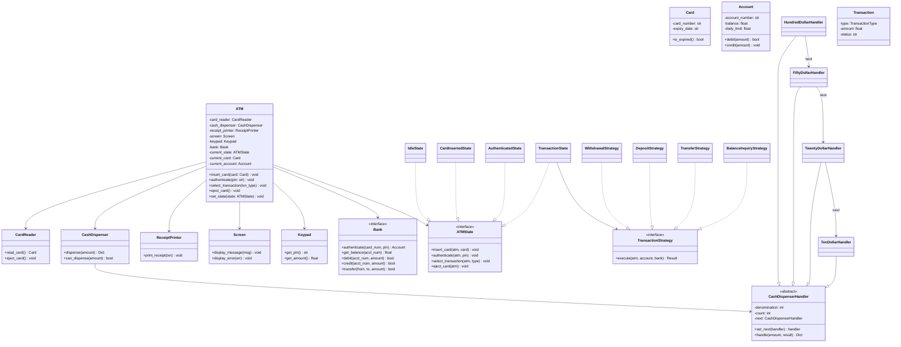
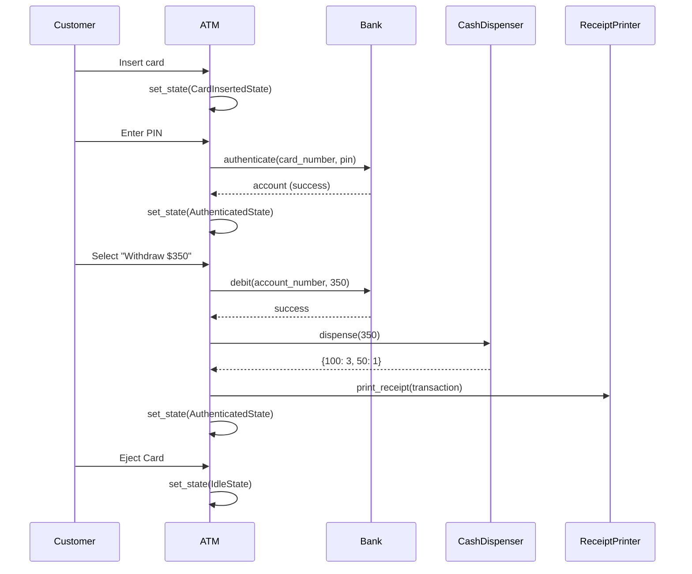
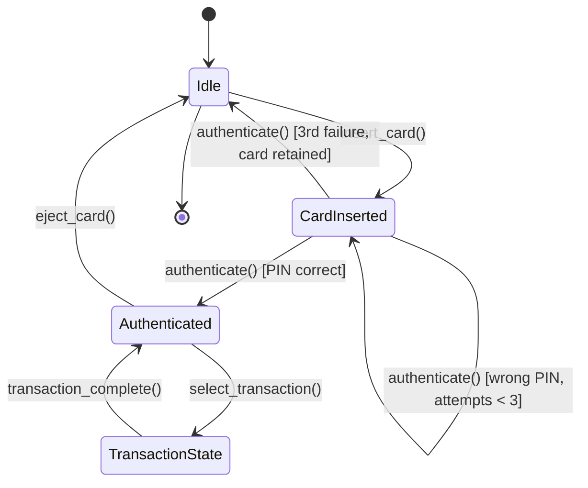

# Low-Level Design: ATM Machine

> An ATM (Automated Teller Machine) allows bank customers to perform financial
> transactions -- balance inquiry, cash withdrawal, cash deposit, and fund transfer --
> without visiting a bank branch. The design must handle multiple card types,
> denominations, concurrent access, and strict transaction atomicity.

---

## 1. Requirements

### 1.1 Functional Requirements

- FR-1: **Card Insertion & Ejection** -- Accept a bank card, read card data, eject when session ends or on error.
- FR-2: **PIN Authentication** -- Verify 4-digit PIN against the bank. Lock card after 3 consecutive failures.
- FR-3: **Check Balance** -- Display current account balance on screen after authentication.
- FR-4: **Withdraw Cash** -- Dispense the requested amount using available denominations; enforce daily limits.
- FR-5: **Deposit Cash** -- Accept cash deposit and credit the account after bank verification.
- FR-6: **Transfer Funds** -- Transfer money between two accounts within the same bank network.
- FR-7: **Print Receipt** -- Generate a receipt with transaction details (type, amount, balance, timestamp).

### 1.2 Constraints & Assumptions

- The ATM communicates with a remote **Bank** service (modeled as an interface).
- Cash dispenser holds denominations: $100, $50, $20, $10 with finite supply.
- Daily withdrawal limit per account: $5,000 (configurable).
- Transaction atomicity: full completion or full rollback (e.g., debit reversed if dispense fails).
- Each physical ATM processes one customer at a time; the bank handles account-level locking.

---

## 2. Use Cases

| #    | Actor    | Action                              | Outcome                                              |
|------|----------|-------------------------------------|------------------------------------------------------|
| UC-1 | Customer | Inserts bank card                   | ATM reads card, transitions to CardInserted state     |
| UC-2 | Customer | Enters PIN                          | ATM authenticates with bank; success or retry/lock    |
| UC-3 | Customer | Selects "Check Balance"             | Current balance displayed on screen                   |
| UC-4 | Customer | Selects "Withdraw" and enters amount| Cash dispensed, account debited, receipt offered       |
| UC-5 | Customer | Selects "Deposit" and inserts cash  | Cash accepted, account credited after verification    |
| UC-6 | Customer | Selects "Transfer" with target acct | Funds moved between accounts, confirmation displayed  |
| UC-7 | Customer | Selects "Eject Card" or session ends| Card returned, ATM resets to Idle                     |

---

## 3. Core Classes & Interfaces

### 3.1 Class Diagram



### 3.2 Class Descriptions

| Class / Interface          | Responsibility                                                 | Pattern                 |
|----------------------------|----------------------------------------------------------------|-------------------------|
| `ATM`                      | Central controller; holds hardware, delegates to current state | Context (State)         |
| `CardReader`               | Reads card data, ejects card                                   | Component               |
| `CashDispenser`            | Manages denomination inventory via handler chain               | Facade                  |
| `ReceiptPrinter`           | Prints transaction receipts                                    | Component               |
| `Screen` / `Keypad`        | Display output and capture user input                          | Component               |
| `Card`                     | Immutable value object: card number, expiry, bank code         | Value Object            |
| `Account`                  | Balance, daily limit tracking, debit/credit operations         | Domain Model            |
| `Bank`                     | Interface for remote bank auth, debit, credit, transfer        | Gateway Interface       |
| `ATMState` (interface)     | Defines allowed operations per state                           | State                   |
| `IdleState`                | Accepts only card insertion                                    | Concrete State          |
| `CardInsertedState`        | Accepts PIN entry; tracks failed attempts                      | Concrete State          |
| `AuthenticatedState`       | Allows transaction selection or card ejection                  | Concrete State          |
| `TransactionState`         | Delegates to the selected transaction strategy                 | Concrete State          |
| `TransactionStrategy`      | Interface for different transaction types                      | Strategy                |
| `CashDispenserHandler`     | Abstract handler in the denomination chain                     | Chain of Responsibility |
| `Transaction`              | Records transaction type, amount, timestamp, status            | Domain Model            |

---

## 4. Design Patterns Used

| Pattern                     | Where Applied                        | Why                                                              |
|-----------------------------|--------------------------------------|------------------------------------------------------------------|
| **State**                   | ATM operational states               | Each state encapsulates allowed ops; prevents invalid actions     |
| **Chain of Responsibility** | Cash dispensing (denominations)      | Greedy allocation per denomination; easy to add/remove bills      |
| **Strategy**                | Transaction types                    | Each transaction is interchangeable; satisfies Open/Closed        |
| **Facade**                  | ATM class                            | Unified interface over card reader, dispenser, printer, bank      |

### 4.1 State Pattern -- ATM Lifecycle

```
IdleState          -> Only insert_card(). All other ops raise error.
CardInsertedState  -> Only authenticate(). Tracks PIN attempts (max 3).
AuthenticatedState -> select_transaction() or eject_card().
TransactionState   -> Runs strategy, returns to Authenticated.
```

### 4.2 Chain of Responsibility -- Cash Dispensing

```
$350 -> HundredHandler: 3x$100 (rem=50) -> FiftyHandler: 1x$50 (rem=0) -> {100:3, 50:1}
$100 bin empty: $350 -> FiftyHandler: 7x$50 -> {50:7}
```

### 4.3 Strategy Pattern -- Transaction Types

```
strategy = strategy_map[txn_type]; result = strategy.execute(atm, account, bank)
Adding BillPayment = one new class, zero changes to ATM.
```

---

## 5. Key Flows

### 5.1 Complete ATM Session Flow (Withdrawal)



---

## 6. State Diagrams

### 6.1 ATM State Machine



### 6.2 State Transition Table

| Current State    | Event                   | Next State        | Guard Condition                  |
|------------------|-------------------------|-------------------|----------------------------------|
| Idle             | insert_card()           | CardInserted      | Card valid and not expired       |
| CardInserted     | authenticate(pin)       | Authenticated     | PIN correct                      |
| CardInserted     | authenticate(pin)       | CardInserted      | PIN wrong, attempts < 3          |
| CardInserted     | authenticate(pin)       | Idle              | 3rd wrong attempt, card retained |
| Authenticated    | select_transaction()    | TransactionState  | None                             |
| TransactionState | transaction_complete()  | Authenticated     | None                             |
| Authenticated    | eject_card()            | Idle              | None                             |

---

## 7. Code Skeleton (Python)

```python
from abc import ABC, abstractmethod
from enum import Enum
from datetime import datetime
from dataclasses import dataclass, field
from typing import List, Optional, Dict
import uuid


# ── Enums & Value Objects ────────────────────────────────────────────────

class TransactionType(Enum):
    BALANCE_INQUIRY = "BALANCE_INQUIRY"
    WITHDRAWAL = "WITHDRAWAL"
    DEPOSIT = "DEPOSIT"
    TRANSFER = "TRANSFER"

@dataclass(frozen=True)
class Card:
    card_number: str
    expiry_date: str   # MM/YY
    bank_code: str

    def is_expired(self) -> bool:
        m, y = self.expiry_date.split("/")
        return datetime.now() > datetime(2000 + int(y), int(m), 1)

@dataclass
class Account:
    account_number: str
    balance: float
    daily_withdrawn: float = 0.0
    daily_limit: float = 5000.0

    def get_daily_remaining(self) -> float:
        return self.daily_limit - self.daily_withdrawn

    def debit(self, amount: float) -> bool:
        if amount > self.balance or amount > self.get_daily_remaining():
            return False
        self.balance -= amount
        self.daily_withdrawn += amount
        return True

    def credit(self, amount: float) -> None:
        self.balance += amount

@dataclass
class Transaction:
    id: str = field(default_factory=lambda: str(uuid.uuid4()))
    type: TransactionType = TransactionType.BALANCE_INQUIRY
    account_number: str = ""
    amount: float = 0.0
    timestamp: datetime = field(default_factory=datetime.now)
    status: str = "INITIATED"


# ── Bank Interface ───────────────────────────────────────────────────────

class Bank(ABC):
    @abstractmethod
    def authenticate(self, card_number: str, pin: str) -> Optional[Account]: ...
    @abstractmethod
    def get_balance(self, acct: str) -> float: ...
    @abstractmethod
    def debit(self, acct: str, amount: float) -> bool: ...
    @abstractmethod
    def credit(self, acct: str, amount: float) -> bool: ...
    @abstractmethod
    def transfer(self, src: str, dst: str, amount: float) -> bool: ...


# ── Hardware Components ──────────────────────────────────────────────────

class CardReader:
    def __init__(self): self._card: Optional[Card] = None
    def read_card(self, card: Card) -> Card: self._card = card; return card
    def eject_card(self) -> None: self._card = None
    def is_card_inserted(self) -> bool: return self._card is not None

class Screen:
    def display_message(self, msg: str) -> None: print(f"[SCREEN] {msg}")
    def display_balance(self, bal: float) -> None: print(f"[SCREEN] Balance: ${bal:.2f}")
    def display_error(self, err: str) -> None: print(f"[SCREEN][ERROR] {err}")

class Keypad:
    def get_pin(self) -> str: return input("[KEYPAD] PIN: ")
    def get_amount(self) -> float: return float(input("[KEYPAD] Amount: "))
    def get_input(self, prompt: str = "") -> str: return input(f"[KEYPAD] {prompt}: ")

class ReceiptPrinter:
    def __init__(self): self._has_paper = True
    def has_paper(self) -> bool: return self._has_paper
    def print_receipt(self, txn: Transaction) -> None:
        print(f"=== RECEIPT === {txn.type.value} | ${txn.amount:.2f} | {txn.status}")


# ── Chain of Responsibility: Cash Dispensing ─────────────────────────────

class CashDispenserHandler(ABC):
    def __init__(self, denomination: int, count: int):
        self._denomination = denomination
        self._count = count
        self._next: Optional[CashDispenserHandler] = None

    def set_next(self, handler: "CashDispenserHandler") -> "CashDispenserHandler":
        self._next = handler
        return handler

    def handle(self, amount: int, result: Dict[int, int]) -> Dict[int, int]:
        if amount >= self._denomination and self._count > 0:
            num_bills = min(amount // self._denomination, self._count)
            result[self._denomination] = num_bills
            self._count -= num_bills
            amount -= num_bills * self._denomination
        if amount > 0 and self._next:
            return self._next.handle(amount, result)
        if amount > 0 and not self._next:
            raise ValueError(f"Cannot dispense remaining ${amount}")
        return result

class HundredDollarHandler(CashDispenserHandler):
    def __init__(self, count=500): super().__init__(100, count)

class FiftyDollarHandler(CashDispenserHandler):
    def __init__(self, count=500): super().__init__(50, count)

class TwentyDollarHandler(CashDispenserHandler):
    def __init__(self, count=500): super().__init__(20, count)

class TenDollarHandler(CashDispenserHandler):
    def __init__(self, count=500): super().__init__(10, count)

class CashDispenser:
    def __init__(self):
        h100, h50, h20, h10 = (HundredDollarHandler(), FiftyDollarHandler(),
                                TwentyDollarHandler(), TenDollarHandler())
        h100.set_next(h50); h50.set_next(h20); h20.set_next(h10)
        self._chain = h100

    def dispense(self, amount: int) -> Dict[int, int]:
        if amount % 10 != 0: raise ValueError("Amount must be a multiple of $10")
        return self._chain.handle(amount, {})

    def can_dispense(self, amount: int) -> bool:
        return amount % 10 == 0 and amount <= self.get_available_cash()

    def get_available_cash(self) -> int:
        total, h = 0, self._chain
        while h: total += h._denomination * h._count; h = h._next
        return total


# ── Strategy: Transaction Types ──────────────────────────────────────────

@dataclass
class TransactionResult:
    success: bool
    message: str
    transaction: Optional[Transaction] = None

class TransactionStrategy(ABC):
    @abstractmethod
    def execute(self, atm: "ATM", account: Account, bank: Bank) -> TransactionResult: ...

class BalanceInquiryStrategy(TransactionStrategy):
    def execute(self, atm, account, bank):
        balance = bank.get_balance(account.account_number)
        atm.screen.display_balance(balance)
        txn = Transaction(type=TransactionType.BALANCE_INQUIRY,
                          account_number=account.account_number, status="SUCCESS")
        return TransactionResult(True, "Balance displayed.", txn)

class WithdrawalStrategy(TransactionStrategy):
    def execute(self, atm, account, bank):
        amount = int(atm.keypad.get_amount())
        if amount > account.get_daily_remaining():
            return TransactionResult(False, "Exceeds daily limit")
        if not atm.cash_dispenser.can_dispense(amount):
            return TransactionResult(False, "ATM cannot dispense this amount")
        if not bank.debit(account.account_number, amount):
            return TransactionResult(False, "Bank declined")
        try:
            bills = atm.cash_dispenser.dispense(amount)
            atm.screen.display_message(f"Dispensing: {bills}")
        except ValueError:
            bank.credit(account.account_number, amount)  # rollback
            return TransactionResult(False, "Dispense error. Reversed.")
        txn = Transaction(type=TransactionType.WITHDRAWAL,
                          account_number=account.account_number, amount=amount, status="SUCCESS")
        return TransactionResult(True, "Cash dispensed.", txn)

class DepositStrategy(TransactionStrategy):
    def execute(self, atm, account, bank):
        amount = atm.keypad.get_amount()
        atm.screen.display_message("Insert cash into deposit slot.")
        if not bank.credit(account.account_number, amount):
            return TransactionResult(False, "Deposit failed")
        txn = Transaction(type=TransactionType.DEPOSIT,
                          account_number=account.account_number, amount=amount, status="SUCCESS")
        return TransactionResult(True, "Deposit accepted.", txn)

class TransferStrategy(TransactionStrategy):
    def execute(self, atm, account, bank):
        target = atm.keypad.get_input("Destination account")
        amount = atm.keypad.get_amount()
        if not bank.transfer(account.account_number, target, amount):
            return TransactionResult(False, "Transfer declined")
        txn = Transaction(type=TransactionType.TRANSFER,
                          account_number=account.account_number, amount=amount, status="SUCCESS")
        return TransactionResult(True, "Transfer complete.", txn)


# ── State Pattern: ATM States ───────────────────────────────────────────

class ATMState(ABC):
    @abstractmethod
    def insert_card(self, atm: "ATM", card: Card) -> None: ...
    @abstractmethod
    def authenticate(self, atm: "ATM", pin: str) -> None: ...
    @abstractmethod
    def select_transaction(self, atm: "ATM", txn_type: TransactionType) -> None: ...
    @abstractmethod
    def eject_card(self, atm: "ATM") -> None: ...

class IdleState(ATMState):
    def insert_card(self, atm, card):
        if card.is_expired():
            atm.screen.display_error("Card expired"); atm.card_reader.eject_card(); return
        atm.card_reader.read_card(card)
        atm.current_card = card
        atm.screen.display_message("Card accepted. Enter PIN.")
        atm.set_state(CardInsertedState())

    def authenticate(self, atm, pin): raise RuntimeError("No card inserted")
    def select_transaction(self, atm, t): raise RuntimeError("Not authenticated")
    def eject_card(self, atm): atm.screen.display_message("No card inserted")

class CardInsertedState(ATMState):
    MAX_ATTEMPTS = 3
    def __init__(self): self._attempts = 0

    def insert_card(self, atm, card): atm.screen.display_error("Card already inserted")

    def authenticate(self, atm, pin):
        account = atm.bank.authenticate(atm.current_card.card_number, pin)
        if account:
            atm.current_account = account
            atm.screen.display_message("Authenticated.")
            atm.set_state(AuthenticatedState())
        else:
            self._attempts += 1
            remaining = self.MAX_ATTEMPTS - self._attempts
            if remaining > 0:
                atm.screen.display_error(f"Wrong PIN. {remaining} attempt(s) left.")
            else:
                atm.screen.display_error("Card retained after 3 failures.")
                atm.current_card = None; atm.card_reader.eject_card()
                atm.set_state(IdleState())

    def select_transaction(self, atm, t): raise RuntimeError("Not authenticated")
    def eject_card(self, atm):
        atm.card_reader.eject_card(); atm.current_card = None
        atm.set_state(IdleState())

class AuthenticatedState(ATMState):
    STRATEGY_MAP = {
        TransactionType.BALANCE_INQUIRY: BalanceInquiryStrategy,
        TransactionType.WITHDRAWAL: WithdrawalStrategy,
        TransactionType.DEPOSIT: DepositStrategy,
        TransactionType.TRANSFER: TransferStrategy,
    }

    def insert_card(self, atm, card): atm.screen.display_error("Session active")
    def authenticate(self, atm, pin): atm.screen.display_message("Already authenticated")

    def select_transaction(self, atm, txn_type):
        strategy = self.STRATEGY_MAP[txn_type]()
        result = strategy.execute(atm, atm.current_account, atm.bank)
        if result.success and result.transaction:
            atm.transaction_log.append(result.transaction)
            if atm.receipt_printer.has_paper():
                atm.receipt_printer.print_receipt(result.transaction)
            atm.screen.display_message(result.message)
        else:
            atm.screen.display_error(result.message)
        # Stay in AuthenticatedState for another transaction

    def eject_card(self, atm):
        atm.card_reader.eject_card()
        atm.current_card = None; atm.current_account = None
        atm.screen.display_message("Card ejected. Thank you.")
        atm.set_state(IdleState())


# ── ATM Controller ───────────────────────────────────────────────────────

class ATM:
    def __init__(self, atm_id: str, bank: Bank):
        self.atm_id = atm_id
        self.bank = bank
        self.card_reader = CardReader()
        self.cash_dispenser = CashDispenser()
        self.receipt_printer = ReceiptPrinter()
        self.screen = Screen()
        self.keypad = Keypad()
        self.current_state: ATMState = IdleState()
        self.current_card: Optional[Card] = None
        self.current_account: Optional[Account] = None
        self.transaction_log: List[Transaction] = []

    def set_state(self, state: ATMState) -> None:
        self.current_state = state

    def insert_card(self, card: Card) -> None:
        self.current_state.insert_card(self, card)

    def authenticate(self, pin: str) -> None:
        self.current_state.authenticate(self, pin)

    def select_transaction(self, txn_type: TransactionType) -> None:
        self.current_state.select_transaction(self, txn_type)

    def eject_card(self) -> None:
        self.current_state.eject_card(self)
```

---

## 8. Extensibility & Edge Cases

### 8.1 Extensibility Checklist

| Change Request                          | How the Design Handles It                                           |
|-----------------------------------------|---------------------------------------------------------------------|
| Add cardless / mobile ATM (NFC, QR)     | New `CardReader` subclass; ATM interface unchanged                  |
| Add multi-language support              | Inject a `Locale` strategy into `Screen` for message translation    |
| Add check deposit                       | New `CheckDepositStrategy` implementing `TransactionStrategy`       |
| Add bill payment                        | New `BillPaymentStrategy` implementing `TransactionStrategy`        |
| Add new denomination ($5, $1)           | New `CashDispenserHandler` subclass; link into the chain            |
| Switch to real bank API                 | Implement `Bank` interface with HTTP client; no ATM code changes    |
| Add maintenance mode for technicians    | New `MaintenanceState` implementing `ATMState`                      |

### 8.2 Edge Cases

- **Amount not dispensable:** $35 with $10 minimum denomination -- chain fails; return error.
- **ATM out of cash:** Block all withdrawals; display "Cash unavailable."
- **Network failure mid-transaction:** Credit-back rollback if debit succeeded but dispense failed.
- **Card retained:** After 3 wrong PINs, card kept; ATM resets to Idle.
- **Concurrent bank access:** Bank must use account-level locking.
- **Daily limit reached:** Reject with remaining limit displayed.
- **Printer out of paper:** Skip receipt; do not block the transaction.

---

## 9. Interview Tips

### What Interviewers Look For

1. **State Pattern mastery** -- ATM is a textbook state machine. Invalid operations (withdrawing before PIN) should be rejected by the state itself, not by if-else guards.
2. **Chain of Responsibility** -- Cash dispensing is the classic example. Show greedy allocation and graceful fallback when a denomination runs out.
3. **Strategy for transactions** -- Each transaction type is its own class. Adding a new type requires zero changes to ATM.
4. **Atomicity awareness** -- Explain rollback: if debit succeeds but dispense fails, credit the account back.
5. **Interface at boundaries** -- `Bank` is an interface. This decouples ATM from any specific bank and enables testing.

### Approach for a 45-Minute Round

1. **Minutes 0-5:** Clarify requirements. Ask about transfers, denominations, daily limits.
2. **Minutes 5-15:** Draw class diagram. Start with ATM + hardware, then states and chain.
3. **Minutes 15-25:** Walk through withdrawal flow as a sequence diagram.
4. **Minutes 25-40:** Code the state classes and cash dispenser chain. Skip boilerplate.
5. **Minutes 40-45:** Discuss edge cases and extensibility.

### Common Follow-up Questions

- "How do you handle a network timeout after the bank has already debited?"
- "What if we add a $5 denomination? How many files change?" (One new handler class.)
- "How would you unit test the cash dispenser without real bills?" (Mock the chain.)
- "Can you add a new transaction type without modifying the ATM class?" (Yes, via Strategy.)

### Common Pitfalls

- Giant `if-elif` block instead of State pattern.
- Hardcoding denominations instead of Chain of Responsibility.
- Forgetting atomicity -- debiting without ensuring cash can be dispensed.
- Not defining `Bank` as an interface -- coupling ATM to a specific bank.

---

> **Checklist before finishing your design:**
> - [x] Requirements clarified: card auth, balance, withdraw, deposit, transfer, receipt.
> - [x] Class diagram with relationships (ATM composes hardware, delegates to states).
> - [x] Design patterns: State, Chain of Responsibility, Strategy, Facade.
> - [x] State diagram for ATM lifecycle with transition table.
> - [x] Sequence diagrams for session flow and cash dispensing chain.
> - [x] Code skeleton covers State, Chain of Responsibility, Strategy, and ATM controller.
> - [x] Edge cases: network failure, denomination shortage, concurrent access, daily limits.
> - [x] Extensibility: new transaction types, new denominations, cardless ATM.
