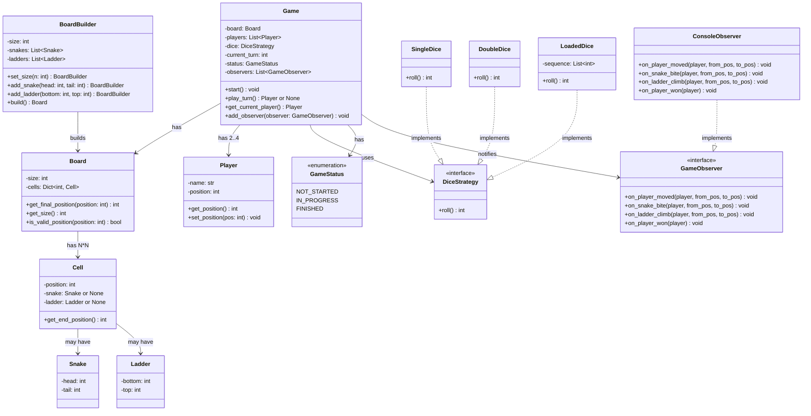
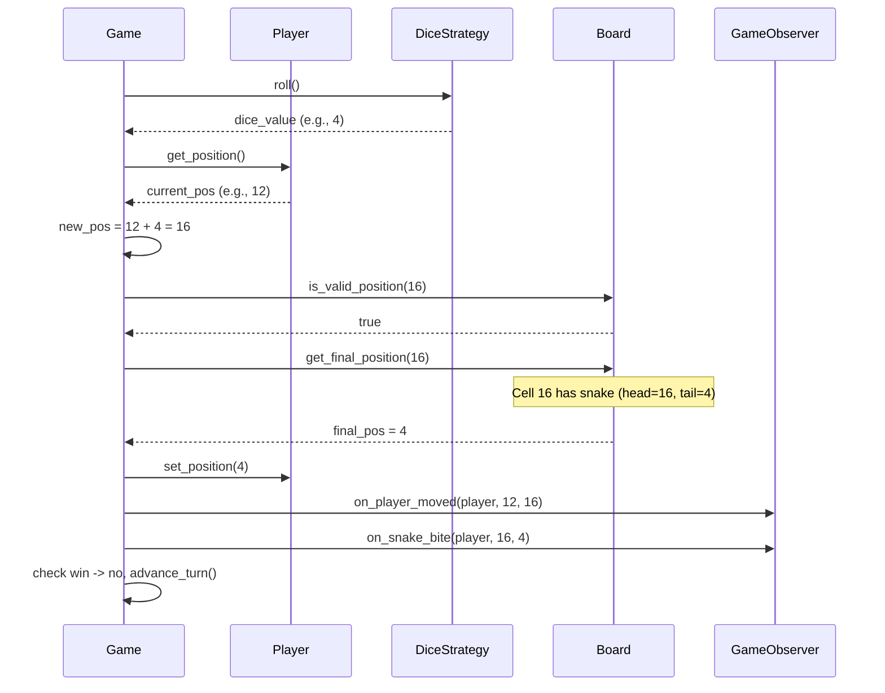
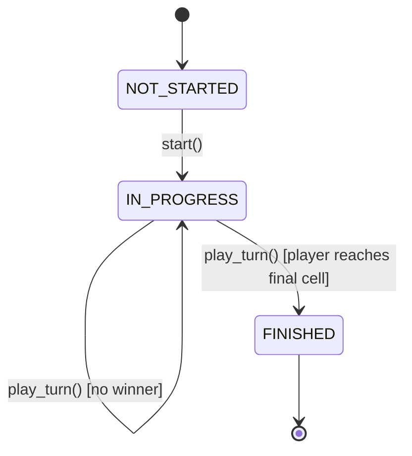
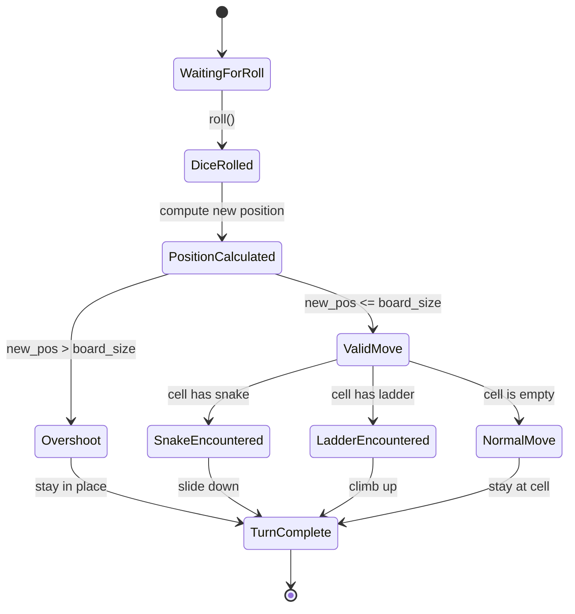

# Low-Level Design: Snake and Ladder Game

> 2-4 players roll dice to race across a numbered grid, climbing ladders and sliding
> down snakes. First player to reach the final cell wins.

---

## 1. Requirements

### 1.1 Functional Requirements

- FR-1: Support 2 to 4 players in a single game session.
- FR-2: The board is an NxN grid (default 10x10 = 100 cells), configurable at setup.
- FR-3: Configurable set of snakes (head, tail) and ladders (bottom, top).
- FR-4: Players take turns rolling a dice (default: single fair die, values 1-6).
- FR-5: Landing on a snake's head slides the player down to its tail.
- FR-6: Landing on a ladder's bottom climbs the player up to its top.
- FR-7: A player wins by landing exactly on the last cell (cell 100 for 10x10).
- FR-8: If a roll would overshoot the last cell, the player stays in place.
- FR-9: All players start at position 0 (off the board, before cell 1).

### 1.2 Constraints & Assumptions

- Single process, single-threaded, in-memory only.
- Snake head must be strictly greater than its tail.
- Ladder bottom must be strictly less than its top.
- No snake head or ladder bottom on cell 1 or cell N*N.
- A cell cannot have both a snake head and a ladder bottom.
- Snakes and ladders must not form infinite loops.
- Dice produces uniform random values between 1 and 6 (inclusive).

---

## 2. Use Cases

| #    | Actor  | Action                           | Outcome                                      |
|------|--------|----------------------------------|-----------------------------------------------|
| UC-1 | Host   | Starts a new game with N players | Board set up, players initialized at pos 0    |
| UC-2 | Player | Rolls the dice on their turn     | Dice returns a value between 1 and 6          |
| UC-3 | System | Moves player to new position     | Position updated, snake/ladder resolved       |
| UC-4 | System | Detects win condition             | Game ends, winner announced                   |
| UC-5 | System | Advances turn to next player     | Next player becomes the active player         |

---

## 3. Core Classes & Interfaces

### 3.1 Class Diagram



### 3.2 Class Descriptions

| Class / Interface | Responsibility                                              | Pattern   |
|-------------------|-------------------------------------------------------------|-----------|
| `Game`            | Orchestrates game loop, manages turns, enforces rules       | Facade    |
| `Board`           | Holds cells with snakes/ladders, resolves final positions   | Domain    |
| `BoardBuilder`    | Constructs a validated Board with snakes and ladders        | Builder   |
| `Player`          | Tracks player identity and current position                 | Domain    |
| `Cell`            | Single cell, may contain a snake or ladder                  | Domain    |
| `Snake`           | Value object: head -> tail (moves player down)              | Value Obj |
| `Ladder`          | Value object: bottom -> top (moves player up)               | Value Obj |
| `DiceStrategy`    | Interface for dice rolling behavior                         | Strategy  |
| `SingleDice`      | Standard single die (1-6)                                   | Strategy  |
| `DoubleDice`      | Two dice summed (2-12)                                      | Strategy  |
| `LoadedDice`      | Deterministic sequence for testing                          | Strategy  |
| `GameStatus`      | Enum: NOT_STARTED, IN_PROGRESS, FINISHED                    | Enum      |
| `GameObserver`    | Interface for reacting to game events                       | Observer  |
| `ConsoleObserver` | Prints game events to console                               | Observer  |

---

## 4. Design Patterns Used

| Pattern  | Where Applied            | Why                                                             |
|----------|--------------------------|-----------------------------------------------------------------|
| Builder  | `BoardBuilder`           | Board setup has complex validation; builder separates construction from representation |
| Strategy | `DiceStrategy` hierarchy | Swap dice behavior without changing game logic                  |
| Observer | `GameObserver` interface | Decouple game logic from UI/logging; multiple listeners independently |
| Facade   | `Game` class             | Simple interface to complex subsystem of board, players, dice   |

### 4.1 Pattern Examples

```
Builder: BoardBuilder collects all snakes/ladders, validates the entire config
(conflicts, loops, boundaries) at build() time, then produces an immutable Board.

Strategy: Game calls self.dice.roll() -- doesn't know or care if it's a SingleDice,
DoubleDice, or LoadedDice. New dice types need zero changes to Game.

Observer: Game iterates self.observers and calls on_player_moved(), on_snake_bite(),
etc. Console, network, or animation observers can be added/removed freely.
```

---

## 5. Key Flows

### 5.1 Play Turn Flow



> **Guidance:** Win: position 97 + roll 3 = 100 (exact match, game ends).
> Overshoot: position 99 + roll 4 = 103 > 100, `is_valid_position` returns false,
> player stays at 99.

---

## 6. State Diagrams

### 6.1 Game State



### 6.2 Player Turn State (within a single turn)



### State Transition Table

| Current State | Event       | Next State  | Guard Condition         |
|---------------|-------------|-------------|-------------------------|
| NOT_STARTED   | start()     | IN_PROGRESS | 2-4 players added       |
| IN_PROGRESS   | play_turn() | IN_PROGRESS | No player at final cell |
| IN_PROGRESS   | play_turn() | FINISHED    | Player reaches cell 100 |

---

## 7. Code Skeleton

```python
from abc import ABC, abstractmethod
from enum import Enum
from dataclasses import dataclass, field
from typing import List, Optional, Dict, Set
import random, uuid


# -- Enums & Value Objects ----------------------------------------------------

class GameStatus(Enum):
    NOT_STARTED = "NOT_STARTED"
    IN_PROGRESS = "IN_PROGRESS"
    FINISHED = "FINISHED"

@dataclass(frozen=True)
class Snake:
    head: int
    tail: int
    def __post_init__(self):
        if self.head <= self.tail:
            raise ValueError(f"Snake head ({self.head}) must be > tail ({self.tail})")

@dataclass(frozen=True)
class Ladder:
    bottom: int
    top: int
    def __post_init__(self):
        if self.bottom >= self.top:
            raise ValueError(f"Ladder bottom ({self.bottom}) must be < top ({self.top})")

@dataclass
class Cell:
    position: int
    snake: Optional[Snake] = None
    ladder: Optional[Ladder] = None

    def get_end_position(self) -> int:
        if self.snake: return self.snake.tail
        if self.ladder: return self.ladder.top
        return self.position

@dataclass
class Player:
    name: str
    id: str = field(default_factory=lambda: str(uuid.uuid4()))
    position: int = 0

    def get_position(self) -> int: return self.position
    def set_position(self, pos: int) -> None: self.position = pos
    def get_name(self) -> str: return self.name


# -- Dice Strategy (Strategy Pattern) ----------------------------------------

class DiceStrategy(ABC):
    @abstractmethod
    def roll(self) -> int: ...

class SingleDice(DiceStrategy):
    def roll(self) -> int: return random.randint(1, 6)

class DoubleDice(DiceStrategy):
    def roll(self) -> int: return random.randint(1, 6) + random.randint(1, 6)

class LoadedDice(DiceStrategy):
    """Deterministic sequence for testing. Cycles through values."""
    def __init__(self, sequence: List[int]):
        self._sequence, self._index = sequence, 0
    def roll(self) -> int:
        value = self._sequence[self._index % len(self._sequence)]
        self._index += 1
        return value


# -- Observer Pattern ---------------------------------------------------------

class GameObserver(ABC):
    @abstractmethod
    def on_player_moved(self, player: Player, from_pos: int, to_pos: int) -> None: ...
    @abstractmethod
    def on_snake_bite(self, player: Player, from_pos: int, to_pos: int) -> None: ...
    @abstractmethod
    def on_ladder_climb(self, player: Player, from_pos: int, to_pos: int) -> None: ...
    @abstractmethod
    def on_player_won(self, player: Player) -> None: ...

class ConsoleObserver(GameObserver):
    def on_player_moved(self, p: Player, f: int, t: int) -> None:
        print(f"  {p.name} moved from {f} to {t}")
    def on_snake_bite(self, p: Player, f: int, t: int) -> None:
        print(f"  {p.name} bitten by snake at {f}, slides to {t}")
    def on_ladder_climb(self, p: Player, f: int, t: int) -> None:
        print(f"  {p.name} climbs ladder at {f}, jumps to {t}")
    def on_player_won(self, p: Player) -> None:
        print(f"  {p.name} wins the game!")


# -- Board & Builder ----------------------------------------------------------

class Board:
    def __init__(self, size: int, cells: Dict[int, Cell]):
        self._total_cells = size * size
        self._cells = cells

    def get_size(self) -> int: return self._total_cells
    def is_valid_position(self, pos: int) -> bool: return 1 <= pos <= self._total_cells

    def get_final_position(self, position: int) -> int:
        if position in self._cells:
            return self._cells[position].get_end_position()
        return position

class BoardBuilder:
    def __init__(self):
        self._size, self._snakes, self._ladders = 10, [], []

    def set_size(self, n: int) -> "BoardBuilder":
        self._size = n; return self

    def add_snake(self, head: int, tail: int) -> "BoardBuilder":
        self._snakes.append(Snake(head, tail)); return self

    def add_ladder(self, bottom: int, top: int) -> "BoardBuilder":
        self._ladders.append(Ladder(bottom, top)); return self

    def build(self) -> Board:
        total = self._size * self._size
        self._validate(total)
        cells: Dict[int, Cell] = {}
        for snake in self._snakes:
            cells[snake.head] = Cell(position=snake.head, snake=snake)
        for ladder in self._ladders:
            cells[ladder.bottom] = Cell(position=ladder.bottom, ladder=ladder)
        return Board(self._size, cells)

    def _validate(self, total: int) -> None:
        occupied: Set[int] = set()
        for snake in self._snakes:
            if snake.head in (1, total):
                raise ValueError(f"Snake head cannot be at cell 1 or {total}")
            if snake.head in occupied:
                raise ValueError(f"Cell {snake.head} already occupied")
            occupied.add(snake.head)
        for ladder in self._ladders:
            if ladder.bottom in (1, total):
                raise ValueError(f"Ladder bottom cannot be at cell 1 or {total}")
            if ladder.bottom in occupied:
                raise ValueError(f"Cell {ladder.bottom} already occupied")
            occupied.add(ladder.bottom)
        # Cycle detection via jump map
        jump_map: Dict[int, int] = {}
        for s in self._snakes: jump_map[s.head] = s.tail
        for l in self._ladders: jump_map[l.bottom] = l.top
        for start in jump_map:
            visited: Set[int] = set()
            current = start
            while current in jump_map:
                if current in visited:
                    raise ValueError(f"Infinite loop at cell {current}")
                visited.add(current)
                current = jump_map[current]


# -- Game (Facade) ------------------------------------------------------------

class Game:
    def __init__(self, board: Board, dice: DiceStrategy, players: List[Player]):
        if not (2 <= len(players) <= 4):
            raise ValueError("Need 2-4 players")
        self._board = board
        self._dice = dice
        self._players = players
        self._current_turn = 0
        self._status = GameStatus.NOT_STARTED
        self._observers: List[GameObserver] = []
        self._winner: Optional[Player] = None

    def add_observer(self, obs: GameObserver) -> None: self._observers.append(obs)
    def get_current_player(self) -> Player:
        return self._players[self._current_turn % len(self._players)]

    def start(self) -> None:
        self._status = GameStatus.IN_PROGRESS

    def play_turn(self) -> Optional[Player]:
        """Execute one turn. Returns winner if game ends, else None."""
        if self._status != GameStatus.IN_PROGRESS:
            raise RuntimeError("Game is not in progress")

        player = self.get_current_player()
        dice_value = self._dice.roll()
        old_pos = player.get_position()
        new_pos = old_pos + dice_value

        # Overshoot check
        if not self._board.is_valid_position(new_pos):
            self._current_turn += 1
            return None

        # Resolve snakes and ladders
        final_pos = self._board.get_final_position(new_pos)
        player.set_position(final_pos)

        # Notify observers
        for obs in self._observers: obs.on_player_moved(player, old_pos, new_pos)
        if final_pos < new_pos:
            for obs in self._observers: obs.on_snake_bite(player, new_pos, final_pos)
        elif final_pos > new_pos:
            for obs in self._observers: obs.on_ladder_climb(player, new_pos, final_pos)

        # Win check
        if final_pos == self._board.get_size():
            self._status = GameStatus.FINISHED
            self._winner = player
            for obs in self._observers: obs.on_player_won(player)
            return player

        self._current_turn += 1
        return None

    def play_full_game(self) -> Player:
        self.start()
        while self._status == GameStatus.IN_PROGRESS:
            self.play_turn()
        return self._winner


# -- Example Usage ------------------------------------------------------------

def main():
    board = (BoardBuilder()
        .set_size(10)
        .add_snake(16, 4).add_snake(34, 12).add_snake(48, 26)
        .add_snake(62, 18).add_snake(88, 24).add_snake(95, 56)
        .add_ladder(3, 22).add_ladder(8, 26).add_ladder(20, 41)
        .add_ladder(28, 56).add_ladder(50, 67).add_ladder(71, 92)
        .build())
    players = [Player(name="Alice"), Player(name="Bob")]
    game = Game(board, SingleDice(), players)
    game.add_observer(ConsoleObserver())
    winner = game.play_full_game()
    print(f"\nGame over! {winner.get_name()} wins!")

if __name__ == "__main__":
    main()
```

---

## 8. Extensibility & Edge Cases

### 8.1 Extensibility Checklist

| Change Request                    | How the Design Handles It                                       |
|-----------------------------------|-----------------------------------------------------------------|
| Add power-ups (extra turn, etc.)  | Add `PowerUp` class on cells; `Cell.get_effect()` returns action |
| Support multiple dice             | New `DiceStrategy` impl; inject into `Game`                     |
| Team mode                         | `Team` class grouping `Player` objects; turn logic iterates teams |
| Board themes / shapes             | Board is abstract; rendering handled by observer                |
| Save / load game                  | Serialize state to JSON; add `GameRepository`                   |
| Undo last move                    | Store move history as stack; pop to undo                        |
| Network multiplayer               | `Game` as server engine; `NetworkObserver` sends events to clients |
| Configurable win rules            | `WinConditionStrategy` (exact roll, reach-or-pass)              |

### 8.2 Edge Cases

- **Overshoot:** Position 98 + roll 5 = 103 > 100 -- player stays at 98.
- **Chained snakes/ladders:** Snake tail lands on another snake head. Current design resolves one level. For chaining, loop `get_final_position` until position stabilizes.
- **Snake + ladder on same cell:** Builder validation rejects at construction time.
- **Dice returns 0 or negative:** `DiceStrategy` contract guarantees positive values.

---

## 9. Interview Tips

### What Interviewers Look For

1. **SOLID Principles** -- `Game` orchestrates, `Board` resolves positions (SRP). `DiceStrategy` extends without modifying `Game` (OCP).
2. **Design Patterns** -- Builder, Strategy, Observer applied where they genuinely help.
3. **Validation** -- `BoardBuilder` validates no infinite loops, no conflicts, no start/end placement.
4. **Extensibility** -- Adding a dice type or event listener is one class, zero changes to existing code.

### 45-Minute Approach

1. **0-5 min:** Clarify board size, player count, winning rule, chaining behavior.
2. **5-15 min:** Draw class diagram: Game, Board, Player, Snake, Ladder, Dice, Cell.
3. **15-25 min:** Walk through play_turn flow. Highlight overshoot and snake/ladder resolution.
4. **25-40 min:** Write code skeleton. Focus on `play_turn()`, `build()`, `DiceStrategy`.
5. **40-45 min:** Discuss extensibility and edge cases.

### Common Follow-Up Questions

- "How to detect infinite loops?" -- Build jump-map graph, run cycle detection with visited set.
- "Support chained snakes/ladders?" -- Loop `get_final_position` until position stabilizes.
- "How to unit test?" -- Use `LoadedDice` for deterministic outcomes.
- "Two players on same cell?" -- Standard rules allow it, no special handling.
- "Extra turn on rolling 6?" -- Add `RuleEngine` or use Strategy for turn-advancement logic.

### Common Pitfalls

- Putting snake/ladder logic in `Game` instead of `Board`.
- Forgetting the overshoot condition.
- Not validating board configuration (overlaps, infinite loops).
- Using inheritance where composition fits better (e.g., `SnakeCell extends Cell`).
- Hardcoding dice values instead of using Strategy for testability.

---

> **Checklist before finishing your design:**
> - [x] Requirements clarified and scoped (2-4 players, NxN board, exact roll to win).
> - [x] Class diagram with relationships (composition, interface implementation).
> - [x] 3 design patterns identified and justified (Builder, Strategy, Observer).
> - [x] State diagrams for Game lifecycle and player turn.
> - [x] Sequence diagrams for initialization, play turn, and win condition.
> - [x] Code skeleton covers core domain logic with full implementations.
> - [x] Edge cases acknowledged (overshoot, chaining, infinite loops).
> - [x] Extensibility demonstrated (power-ups, undo, network play, custom dice).
