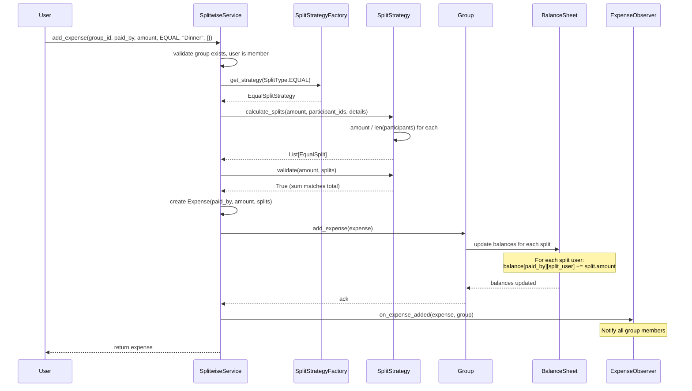
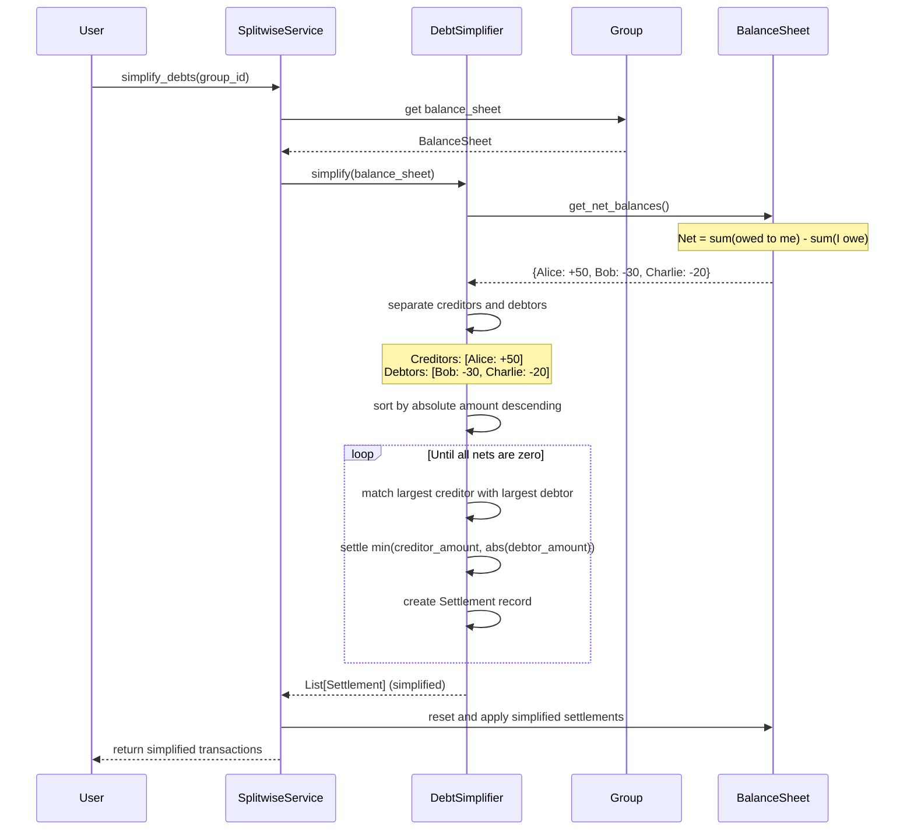
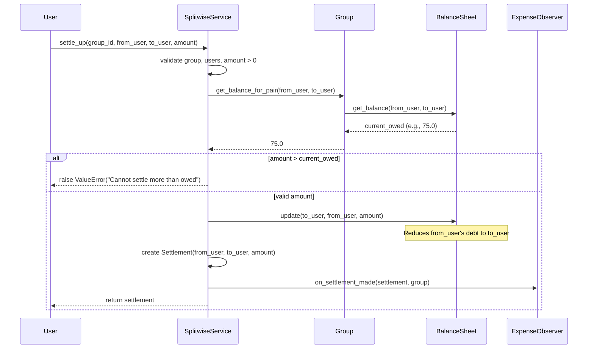
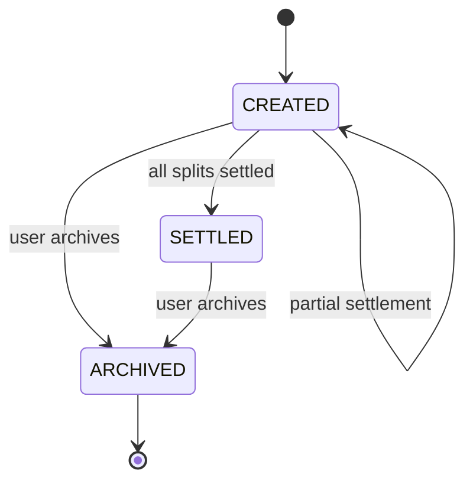
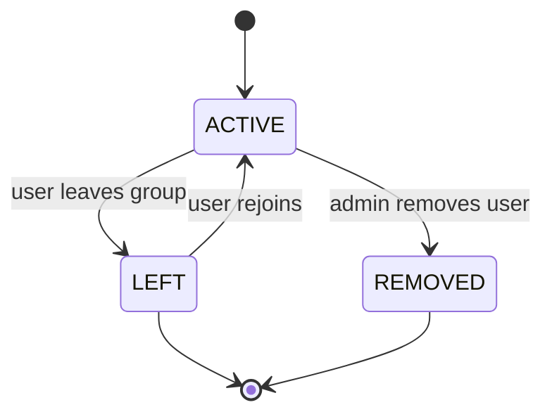

# Low-Level Design: Splitwise (Expense Sharing)

> An expense-sharing system that allows users to create groups, add expenses with
> multiple split types (equal, exact, percentage), track balances between members,
> settle debts, and simplify outstanding balances using graph-based debt minimization.
> This is a popular LLD interview question that tests your ability to model financial
> relationships, apply the Strategy pattern, and implement a non-trivial algorithm.

---

## 1. Requirements

### 1.1 Functional Requirements

- **FR-1:** Register users with name, email, and phone number.
- **FR-2:** Create groups of users for shared expenses (e.g., trip, flat, dinner).
- **FR-3:** Add an expense paid by one or more users and split among group members.
- **FR-4:** Support multiple split types -- equal, exact amount, and percentage.
- **FR-5:** Track per-pair balances (who owes whom, how much) within a group.
- **FR-6:** Settle debts between two users (full or partial settlement).
- **FR-7:** Simplify debts within a group to minimize the number of transactions.
- **FR-8:** View expense history for a group, filtered by date or member.

### 1.2 Constraints & Assumptions

- The system runs as a single process (no distributed concerns).
- Concurrency model: single-threaded for interview scope.
- Persistence: in-memory only; swappable via Repository pattern.
- All amounts are stored as floats rounded to two decimal places.
- Multi-currency is out of scope for the core design but addressed in extensibility.
- A user can belong to multiple groups simultaneously.
- An expense has exactly one "paid by" user (simplification; extensibility covers multi-payer).

> **Guidance:** In the interview, start by asking: "Do we need to support multi-payer
> expenses? Should we handle currency conversion? Is there a notion of recurring
> expenses?" Scope it down to equal/exact/percentage splits first.

---

## 2. Use Cases

| #    | Actor  | Action                               | Outcome                                          |
|------|--------|--------------------------------------|--------------------------------------------------|
| UC-1 | User   | Creates a group with members         | Group is created, all members added               |
| UC-2 | User   | Adds an expense to a group           | Expense recorded, balances updated, members notified |
| UC-3 | User   | Views balances for a group           | Per-pair balances displayed (who owes whom)       |
| UC-4 | User   | Settles a debt with another user     | Balance between the two users adjusted            |
| UC-5 | User   | Requests debt simplification         | Minimum transactions computed, balances simplified |
| UC-6 | User   | Views expense history for a group    | Chronological list of expenses with split details |

> **Guidance:** Keep it to 4-6 use cases. Each one maps to a method or flow later.

---

## 3. Core Classes & Interfaces

### 3.1 Class Diagram

```mermaid
classDiagram
    class SplitwiseService {
        -users: Dict~str, User~
        -groups: Dict~str, Group~
        -split_strategy_factory: SplitStrategyFactory
        -observers: List~ExpenseObserver~
        +register_user(name: str, email: str, phone: str) User
        +create_group(name: str, member_ids: List~str~) Group
        +add_expense(group_id: str, paid_by: str, amount: float, split_type: SplitType, description: str, split_details: Dict) Expense
        +get_balances(group_id: str) Dict
        +settle_up(group_id: str, from_user: str, to_user: str, amount: float) Settlement
        +simplify_debts(group_id: str) List~Settlement~
        +get_expense_history(group_id: str) List~Expense~
        +add_observer(observer: ExpenseObserver) void
    }

    class User {
        -user_id: str
        -name: str
        -email: str
        -phone: str
        +get_id() str
        +get_name() str
    }

    class Group {
        -group_id: str
        -name: str
        -members: Dict~str, User~
        -expenses: List~Expense~
        -balances: BalanceSheet
        +add_member(user: User) void
        +add_expense(expense: Expense) void
        +get_balance_for_pair(user_a: str, user_b: str) float
        +get_all_balances() Dict
        +get_members() List~User~
    }

    class Expense {
        -expense_id: str
        -group_id: str
        -paid_by: str
        -amount: float
        -description: str
        -split_type: SplitType
        -splits: List~Split~
        -status: ExpenseStatus
        -created_at: datetime
        +get_splits() List~Split~
        +settle() void
    }

    class SplitType {
        <<enumeration>>
        EQUAL
        EXACT
        PERCENTAGE
    }

    class ExpenseStatus {
        <<enumeration>>
        CREATED
        SETTLED
        ARCHIVED
    }

    class Split {
        <<abstract>>
        #user_id: str
        #amount: float
        +get_user_id() str
        +get_amount() float
        +validate()* bool
    }

    class EqualSplit {
        +validate() bool
    }

    class ExactSplit {
        -exact_amount: float
        +validate() bool
    }

    class PercentageSplit {
        -percentage: float
        +validate() bool
    }

    class BalanceSheet {
        -balances: Dict~str, Dict~str, float~~
        +update(from_user: str, to_user: str, amount: float) void
        +get_balance(user_a: str, user_b: str) float
        +get_all_balances() Dict
        +get_net_balances() Dict~str, float~
        +reset() void
    }

    class Settlement {
        -settlement_id: str
        -group_id: str
        -from_user: str
        -to_user: str
        -amount: float
        -created_at: datetime
    }

    class SplitStrategy {
        <<interface>>
        +calculate_splits(amount: float, participants: List~str~, details: Dict) List~Split~
        +validate(amount: float, splits: List~Split~) bool
    }

    class EqualSplitStrategy {
        +calculate_splits(amount: float, participants: List~str~, details: Dict) List~Split~
        +validate(amount: float, splits: List~Split~) bool
    }

    class ExactSplitStrategy {
        +calculate_splits(amount: float, participants: List~str~, details: Dict) List~Split~
        +validate(amount: float, splits: List~Split~) bool
    }

    class PercentageSplitStrategy {
        +calculate_splits(amount: float, participants: List~str~, details: Dict) List~Split~
        +validate(amount: float, splits: List~Split~) bool
    }

    class SplitStrategyFactory {
        +get_strategy(split_type: SplitType) SplitStrategy
    }

    class DebtSimplifier {
        +simplify(balance_sheet: BalanceSheet) List~Settlement~
        -_compute_net_balances(balance_sheet: BalanceSheet) Dict~str, float~
        -_minimize_transactions(net_balances: Dict~str, float~) List~Settlement~
    }

    class ExpenseObserver {
        <<interface>>
        +on_expense_added(expense: Expense, group: Group) void
        +on_settlement_made(settlement: Settlement, group: Group) void
    }

    class NotificationObserver {
        +on_expense_added(expense: Expense, group: Group) void
        +on_settlement_made(settlement: Settlement, group: Group) void
    }

    class ActivityLogObserver {
        +on_expense_added(expense: Expense, group: Group) void
        +on_settlement_made(settlement: Settlement, group: Group) void
    }

    SplitwiseService --> User : manages
    SplitwiseService --> Group : manages
    SplitwiseService --> SplitStrategyFactory : uses
    SplitwiseService --> DebtSimplifier : uses
    SplitwiseService --> ExpenseObserver : notifies

    Group "1" *-- "0..*" Expense : contains
    Group "1" *-- "1" BalanceSheet : owns
    Group "1" o-- "1..*" User : has members

    Expense "1" *-- "1..*" Split : contains
    Expense --> SplitType : has
    Expense --> ExpenseStatus : has

    EqualSplit --|> Split : extends
    ExactSplit --|> Split : extends
    PercentageSplit --|> Split : extends

    EqualSplitStrategy ..|> SplitStrategy : implements
    ExactSplitStrategy ..|> SplitStrategy : implements
    PercentageSplitStrategy ..|> SplitStrategy : implements

    SplitStrategyFactory ..> SplitStrategy : creates

    NotificationObserver ..|> ExpenseObserver : implements
    ActivityLogObserver ..|> ExpenseObserver : implements
```



### 3.2 Class Descriptions

| Class / Interface          | Responsibility                                                        | Pattern      |
|----------------------------|-----------------------------------------------------------------------|--------------|
| `SplitwiseService`         | Central facade; orchestrates users, groups, expenses, settlements     | Facade       |
| `User`                     | Core domain object representing a user                                | Domain Model |
| `Group`                    | Contains members, expenses, and a balance sheet                       | Aggregate    |
| `Expense`                  | Records a single expense with payer, amount, and splits               | Domain Model |
| `Split` (abstract)         | Base class for how an expense is divided among users                  | Template     |
| `EqualSplit`               | Each participant owes an equal share                                  | --           |
| `ExactSplit`               | Each participant owes a specific exact amount                         | --           |
| `PercentageSplit`          | Each participant owes a percentage of the total                       | --           |
| `BalanceSheet`             | Tracks per-pair balances and computes net amounts owed                | Domain Model |
| `Settlement`               | Records a debt payment between two users                              | Domain Model |
| `SplitStrategy`            | Interface for calculating splits from an amount and participant list  | Strategy     |
| `EqualSplitStrategy`       | Divides amount equally among all participants                         | Strategy     |
| `ExactSplitStrategy`       | Assigns caller-specified exact amounts to each participant            | Strategy     |
| `PercentageSplitStrategy`  | Converts percentages to amounts; ensures they sum to 100%            | Strategy     |
| `SplitStrategyFactory`     | Returns the correct SplitStrategy for a given SplitType enum         | Factory      |
| `DebtSimplifier`           | Computes net balances and minimizes transactions via greedy algorithm | --           |
| `ExpenseObserver`          | Interface for reacting to expense and settlement events              | Observer     |
| `NotificationObserver`     | Sends push/email notifications to affected group members             | Observer     |
| `ActivityLogObserver`      | Logs expense and settlement events for audit trail                   | Observer     |

> **Guidance:** Favour interfaces over concrete classes at boundaries. This makes the
> design testable and satisfies the Dependency Inversion Principle.

---

## 4. Design Patterns Used

| Pattern   | Where Applied                                      | Why                                                              |
|-----------|----------------------------------------------------|------------------------------------------------------------------|
| Strategy  | `SplitStrategy` (Equal, Exact, Percentage)         | Swap split calculation at runtime without changing callers        |
| Factory   | `SplitStrategyFactory.get_strategy()`              | Centralise split strategy creation; caller passes only an enum   |
| Observer  | `ExpenseObserver` (Notification, ActivityLog)      | Decouple expense/settlement events from side effects             |
| Facade    | `SplitwiseService`                                 | Single entry point hiding internal complexity of groups/balances |

### 4.1 Strategy Pattern -- Split Calculation

```
Context: An expense of $120 among 4 people can be split multiple ways.

Instead of:
    if split_type == "EQUAL":
        each = amount / len(participants)
    elif split_type == "EXACT":
        validate sum matches total
    elif split_type == "PERCENTAGE":
        each = amount * (pct / 100)

Use:
    strategy = split_strategy_factory.get_strategy(split_type)
    splits = strategy.calculate_splits(amount, participants, details)

Where strategy is resolved via factory and implements SplitStrategy interface.
Adding a new split type (e.g., ShareBasedSplit) requires only a new strategy
class and a factory mapping -- zero changes to SplitwiseService or Expense.
```

### 4.2 Factory Pattern -- Strategy Creation

```
Context: The caller knows the SplitType enum but should not know which concrete
strategy class to instantiate.

SplitStrategyFactory.get_strategy(SplitType.EQUAL)
    returns an EqualSplitStrategy instance.

SplitStrategyFactory.get_strategy(SplitType.PERCENTAGE)
    returns a PercentageSplitStrategy instance.

This avoids a scattered if-elif chain and makes adding new split types a
one-line addition to the factory mapping.
```

### 4.3 Observer Pattern -- Expense Events

```
Context: When an expense is added or a settlement is made, multiple things
need to happen:
    1. Notify all group members via push notification / email.
    2. Log the event in the activity feed.
    3. Update analytics dashboards (future extension).

Instead of SplitwiseService calling all these directly, it iterates over
registered observers. Each observer reacts independently. Adding a new
observer (e.g., AnalyticsObserver) requires zero changes to SplitwiseService.
```

### 4.4 Debt Simplification -- Greedy Graph Algorithm

```
Context: In a group of 5 people, there might be 10 pairwise debts. The
simplification algorithm reduces this to at most N-1 transactions.

Algorithm:
    1. Compute net balance for each user (sum of what they are owed minus
       what they owe).
    2. Separate into creditors (positive net) and debtors (negative net).
    3. Greedily match the largest creditor with the largest debtor.
    4. Settle the minimum of the two amounts. Repeat until all nets are zero.

This is a greedy approach that produces optimal results for the general case.
For interview purposes, this O(N log N) solution is preferred over the
NP-hard minimum-edge variant.
```

> **Guidance:** Name the pattern, explain where it applies, and justify *why* it
> helps. Interviewers do not want pattern-stuffing; they want thoughtful application.

---

## 5. Key Flows

### 5.1 Add Expense Flow



### 5.2 Debt Simplification Flow



### 5.3 Settle Up Flow



> **Guidance:** Draw one flow per major use case. Show method-level calls, not
> HTTP requests. Keep the focus on object interactions.

---

## 6. State Diagrams

### 6.1 Expense States



### 6.2 Expense State Transition Table

| Current State | Event                    | Next State | Guard Condition                        |
|---------------|--------------------------|------------|----------------------------------------|
| CREATED       | All splits settled       | SETTLED    | Total settled equals expense amount    |
| CREATED       | Partial settlement       | CREATED    | Remaining balance > 0                  |
| CREATED       | User archives expense    | ARCHIVED   | None                                   |
| SETTLED       | User archives expense    | ARCHIVED   | None                                   |

### 6.3 Group Membership States



> **Guidance:** Every object that can change state deserves a state diagram. The table
> format is useful for complex transitions with guard conditions.

---

## 7. Code Skeleton

```python
from abc import ABC, abstractmethod
from enum import Enum
from datetime import datetime
from dataclasses import dataclass, field
from typing import List, Optional, Dict, Tuple
import uuid


# -- Enums ------------------------------------------------------------------

class SplitType(Enum):
    EQUAL = "EQUAL"
    EXACT = "EXACT"
    PERCENTAGE = "PERCENTAGE"


class ExpenseStatus(Enum):
    CREATED = "CREATED"
    SETTLED = "SETTLED"
    ARCHIVED = "ARCHIVED"


# -- Domain Models ----------------------------------------------------------

@dataclass
class User:
    user_id: str = field(default_factory=lambda: str(uuid.uuid4()))
    name: str = ""
    email: str = ""
    phone: str = ""


# -- Splits (abstract + concrete) ------------------------------------------

class Split(ABC):
    def __init__(self, user_id: str):
        self._user_id = user_id
        self._amount: float = 0.0

    @property
    def user_id(self) -> str:
        return self._user_id

    @property
    def amount(self) -> float:
        return self._amount

    @amount.setter
    def amount(self, value: float) -> None:
        self._amount = round(value, 2)

    @abstractmethod
    def validate(self) -> bool:
        ...


class EqualSplit(Split):
    """Amount is computed by the strategy, not set by the caller."""

    def validate(self) -> bool:
        return self._amount >= 0


class ExactSplit(Split):
    """Caller specifies the exact amount this user owes."""

    def __init__(self, user_id: str, exact_amount: float):
        super().__init__(user_id)
        self._amount = round(exact_amount, 2)

    def validate(self) -> bool:
        return self._amount >= 0


class PercentageSplit(Split):
    """Caller specifies a percentage; strategy converts to amount."""

    def __init__(self, user_id: str, percentage: float):
        super().__init__(user_id)
        self._percentage = percentage

    @property
    def percentage(self) -> float:
        return self._percentage

    def validate(self) -> bool:
        return 0 <= self._percentage <= 100


# -- Split Strategy (interface + implementations) --------------------------

class SplitStrategy(ABC):
    @abstractmethod
    def calculate_splits(
        self, amount: float, participants: List[str], details: Dict
    ) -> List[Split]:
        ...

    @abstractmethod
    def validate(self, amount: float, splits: List[Split]) -> bool:
        ...


class EqualSplitStrategy(SplitStrategy):
    """Divides amount equally among all participants."""

    def calculate_splits(
        self, amount: float, participants: List[str], details: Dict
    ) -> List[Split]:
        n = len(participants)
        if n == 0:
            raise ValueError("At least one participant required")

        per_person = round(amount / n, 2)
        # Handle rounding remainder: assign extra cent to first user
        remainder = round(amount - (per_person * n), 2)

        splits: List[Split] = []
        for i, uid in enumerate(participants):
            s = EqualSplit(uid)
            s.amount = per_person + (remainder if i == 0 else 0)
            splits.append(s)
        return splits

    def validate(self, amount: float, splits: List[Split]) -> bool:
        total = sum(s.amount for s in splits)
        return abs(total - amount) < 0.01


class ExactSplitStrategy(SplitStrategy):
    """Each participant owes a caller-specified exact amount."""

    def calculate_splits(
        self, amount: float, participants: List[str], details: Dict
    ) -> List[Split]:
        # details = {"user_id_1": 40.0, "user_id_2": 60.0, ...}
        splits: List[Split] = []
        for uid in participants:
            exact_amount = details.get(uid, 0.0)
            splits.append(ExactSplit(uid, exact_amount))
        return splits

    def validate(self, amount: float, splits: List[Split]) -> bool:
        total = sum(s.amount for s in splits)
        return abs(total - amount) < 0.01


class PercentageSplitStrategy(SplitStrategy):
    """Each participant owes a percentage of the total."""

    def calculate_splits(
        self, amount: float, participants: List[str], details: Dict
    ) -> List[Split]:
        # details = {"user_id_1": 40.0, "user_id_2": 60.0}  (percentages)
        splits: List[Split] = []
        for uid in participants:
            pct = details.get(uid, 0.0)
            s = PercentageSplit(uid, pct)
            s.amount = round(amount * pct / 100, 2)
            splits.append(s)
        return splits

    def validate(self, amount: float, splits: List[Split]) -> bool:
        total_pct = sum(
            s.percentage for s in splits if isinstance(s, PercentageSplit)
        )
        return abs(total_pct - 100.0) < 0.01


# -- Split Strategy Factory ------------------------------------------------

class SplitStrategyFactory:
    _STRATEGIES: Dict[SplitType, SplitStrategy] = {
        SplitType.EQUAL: EqualSplitStrategy(),
        SplitType.EXACT: ExactSplitStrategy(),
        SplitType.PERCENTAGE: PercentageSplitStrategy(),
    }

    @staticmethod
    def get_strategy(split_type: SplitType) -> SplitStrategy:
        strategy = SplitStrategyFactory._STRATEGIES.get(split_type)
        if strategy is None:
            raise ValueError(f"Unknown split type: {split_type}")
        return strategy


# -- Balance Sheet ----------------------------------------------------------

class BalanceSheet:
    """
    Tracks pairwise balances. balances[A][B] > 0 means B owes A that amount.
    Invariant: balances[A][B] == -balances[B][A].
    """

    def __init__(self):
        self._balances: Dict[str, Dict[str, float]] = {}

    def update(self, creditor: str, debtor: str, amount: float) -> None:
        """Record that debtor owes creditor the given amount."""
        if creditor == debtor:
            return
        self._ensure_key(creditor, debtor)
        self._balances[creditor][debtor] = round(
            self._balances[creditor][debtor] + amount, 2
        )
        self._balances[debtor][creditor] = round(
            self._balances[debtor][creditor] - amount, 2
        )

    def get_balance(self, user_a: str, user_b: str) -> float:
        """Positive means user_b owes user_a; negative means user_a owes user_b."""
        self._ensure_key(user_a, user_b)
        return self._balances[user_a][user_b]

    def get_all_balances(self) -> Dict[str, Dict[str, float]]:
        """Return the full pairwise balance map."""
        return {
            creditor: {
                debtor: amt
                for debtor, amt in debtors.items()
                if amt > 0
            }
            for creditor, debtors in self._balances.items()
        }

    def get_net_balances(self) -> Dict[str, float]:
        """
        Compute net balance for each user.
        Positive = net creditor (others owe them).
        Negative = net debtor (they owe others).
        """
        nets: Dict[str, float] = {}
        for user, others in self._balances.items():
            nets[user] = round(sum(others.values()), 2)
        return nets

    def reset(self) -> None:
        self._balances.clear()

    def _ensure_key(self, a: str, b: str) -> None:
        if a not in self._balances:
            self._balances[a] = {}
        if b not in self._balances:
            self._balances[b] = {}
        if b not in self._balances[a]:
            self._balances[a][b] = 0.0
        if a not in self._balances[b]:
            self._balances[b][a] = 0.0


# -- Expense ---------------------------------------------------------------

@dataclass
class Expense:
    expense_id: str = field(default_factory=lambda: str(uuid.uuid4()))
    group_id: str = ""
    paid_by: str = ""
    amount: float = 0.0
    description: str = ""
    split_type: SplitType = SplitType.EQUAL
    splits: List[Split] = field(default_factory=list)
    status: ExpenseStatus = ExpenseStatus.CREATED
    created_at: datetime = field(default_factory=datetime.utcnow)

    def settle(self) -> None:
        self.status = ExpenseStatus.SETTLED

    def archive(self) -> None:
        self.status = ExpenseStatus.ARCHIVED


# -- Settlement -------------------------------------------------------------

@dataclass
class Settlement:
    settlement_id: str = field(default_factory=lambda: str(uuid.uuid4()))
    group_id: str = ""
    from_user: str = ""
    to_user: str = ""
    amount: float = 0.0
    created_at: datetime = field(default_factory=datetime.utcnow)


# -- Group ------------------------------------------------------------------

class Group:
    def __init__(self, group_id: str, name: str):
        self._group_id = group_id
        self._name = name
        self._members: Dict[str, User] = {}
        self._expenses: List[Expense] = []
        self._balance_sheet = BalanceSheet()

    @property
    def group_id(self) -> str:
        return self._group_id

    @property
    def name(self) -> str:
        return self._name

    @property
    def balance_sheet(self) -> BalanceSheet:
        return self._balance_sheet

    def add_member(self, user: User) -> None:
        self._members[user.user_id] = user

    def get_members(self) -> List[User]:
        return list(self._members.values())

    def is_member(self, user_id: str) -> bool:
        return user_id in self._members

    def add_expense(self, expense: Expense) -> None:
        self._expenses.append(expense)
        # Update balance sheet: payer is owed by each split participant
        for split in expense.splits:
            if split.user_id != expense.paid_by:
                self._balance_sheet.update(
                    creditor=expense.paid_by,
                    debtor=split.user_id,
                    amount=split.amount,
                )

    def get_balance_for_pair(self, user_a: str, user_b: str) -> float:
        return self._balance_sheet.get_balance(user_a, user_b)

    def get_all_balances(self) -> Dict[str, Dict[str, float]]:
        return self._balance_sheet.get_all_balances()

    def get_expenses(self) -> List[Expense]:
        return list(self._expenses)


# -- Debt Simplifier (graph-based minimization) ----------------------------

class DebtSimplifier:
    """
    Minimizes the number of transactions needed to settle all debts.

    Algorithm (greedy):
        1. Compute net balance for each user.
        2. Separate into creditors (net > 0) and debtors (net < 0).
        3. Sort both lists by absolute amount descending.
        4. Match the largest creditor with the largest debtor.
        5. Settle the minimum of the two amounts.
        6. Repeat until all balances are zero.

    Time complexity: O(N log N) where N = number of users.
    Space complexity: O(N) for the net balance map.
    """

    @staticmethod
    def simplify(
        balance_sheet: BalanceSheet, group_id: str
    ) -> List[Settlement]:
        nets = balance_sheet.get_net_balances()
        return DebtSimplifier._minimize_transactions(nets, group_id)

    @staticmethod
    def _minimize_transactions(
        net_balances: Dict[str, float], group_id: str
    ) -> List[Settlement]:
        # Separate creditors and debtors
        creditors: List[Tuple[str, float]] = []
        debtors: List[Tuple[str, float]] = []

        for user_id, net in net_balances.items():
            if net > 0.01:
                creditors.append((user_id, net))
            elif net < -0.01:
                debtors.append((user_id, abs(net)))

        # Sort descending by amount
        creditors.sort(key=lambda x: x[1], reverse=True)
        debtors.sort(key=lambda x: x[1], reverse=True)

        settlements: List[Settlement] = []
        ci, di = 0, 0

        while ci < len(creditors) and di < len(debtors):
            creditor_id, credit_amt = creditors[ci]
            debtor_id, debit_amt = debtors[di]

            settle_amt = round(min(credit_amt, debit_amt), 2)

            settlements.append(
                Settlement(
                    group_id=group_id,
                    from_user=debtor_id,
                    to_user=creditor_id,
                    amount=settle_amt,
                )
            )

            # Update remaining amounts
            creditors[ci] = (creditor_id, round(credit_amt - settle_amt, 2))
            debtors[di] = (debtor_id, round(debit_amt - settle_amt, 2))

            if creditors[ci][1] < 0.01:
                ci += 1
            if debtors[di][1] < 0.01:
                di += 1

        return settlements


# -- Observer Interface -----------------------------------------------------

class ExpenseObserver(ABC):
    @abstractmethod
    def on_expense_added(self, expense: Expense, group: Group) -> None:
        ...

    @abstractmethod
    def on_settlement_made(self, settlement: Settlement, group: Group) -> None:
        ...


class NotificationObserver(ExpenseObserver):
    def on_expense_added(self, expense: Expense, group: Group) -> None:
        for member in group.get_members():
            if member.user_id != expense.paid_by:
                print(
                    f"[NOTIFY] {member.name}: "
                    f"New expense '{expense.description}' "
                    f"of {expense.amount} added by {expense.paid_by}"
                )

    def on_settlement_made(self, settlement: Settlement, group: Group) -> None:
        print(
            f"[NOTIFY] {settlement.from_user} paid "
            f"{settlement.amount} to {settlement.to_user}"
        )


class ActivityLogObserver(ExpenseObserver):
    def __init__(self):
        self.log: List[str] = []

    def on_expense_added(self, expense: Expense, group: Group) -> None:
        self.log.append(
            f"[{expense.created_at}] Expense '{expense.description}' "
            f"({expense.amount}) added to group '{group.name}'"
        )

    def on_settlement_made(self, settlement: Settlement, group: Group) -> None:
        self.log.append(
            f"[{settlement.created_at}] Settlement of "
            f"{settlement.amount} from {settlement.from_user} "
            f"to {settlement.to_user} in group '{group.name}'"
        )


# -- Splitwise Service (Facade) --------------------------------------------

class SplitwiseService:
    def __init__(self):
        self._users: Dict[str, User] = {}
        self._groups: Dict[str, Group] = {}
        self._observers: List[ExpenseObserver] = []

    def add_observer(self, observer: ExpenseObserver) -> None:
        self._observers.append(observer)

    def _notify_expense_added(self, expense: Expense, group: Group) -> None:
        for obs in self._observers:
            obs.on_expense_added(expense, group)

    def _notify_settlement_made(
        self, settlement: Settlement, group: Group
    ) -> None:
        for obs in self._observers:
            obs.on_settlement_made(settlement, group)

    # -- User Management ---------------------------------------------------

    def register_user(self, name: str, email: str, phone: str = "") -> User:
        user = User(name=name, email=email, phone=phone)
        self._users[user.user_id] = user
        return user

    def get_user(self, user_id: str) -> User:
        user = self._users.get(user_id)
        if user is None:
            raise KeyError(f"User {user_id} not found")
        return user

    # -- Group Management --------------------------------------------------

    def create_group(self, name: str, member_ids: List[str]) -> Group:
        group = Group(group_id=str(uuid.uuid4()), name=name)
        for uid in member_ids:
            user = self.get_user(uid)
            group.add_member(user)
        self._groups[group.group_id] = group
        return group

    def get_group(self, group_id: str) -> Group:
        group = self._groups.get(group_id)
        if group is None:
            raise KeyError(f"Group {group_id} not found")
        return group

    # -- Expense Management ------------------------------------------------

    def add_expense(
        self,
        group_id: str,
        paid_by: str,
        amount: float,
        split_type: SplitType,
        description: str,
        split_details: Optional[Dict] = None,
    ) -> Expense:
        group = self.get_group(group_id)

        if not group.is_member(paid_by):
            raise ValueError(f"User {paid_by} is not a member of this group")
        if amount <= 0:
            raise ValueError("Amount must be positive")

        participant_ids = [m.user_id for m in group.get_members()]
        details = split_details or {}

        # Use strategy pattern to compute splits
        strategy = SplitStrategyFactory.get_strategy(split_type)
        splits = strategy.calculate_splits(amount, participant_ids, details)

        if not strategy.validate(amount, splits):
            raise ValueError(
                f"Invalid split: amounts do not sum to {amount}"
            )

        expense = Expense(
            group_id=group_id,
            paid_by=paid_by,
            amount=amount,
            description=description,
            split_type=split_type,
            splits=splits,
        )

        group.add_expense(expense)
        self._notify_expense_added(expense, group)
        return expense

    # -- Balance & Settlement ----------------------------------------------

    def get_balances(self, group_id: str) -> Dict[str, Dict[str, float]]:
        group = self.get_group(group_id)
        return group.get_all_balances()

    def settle_up(
        self,
        group_id: str,
        from_user: str,
        to_user: str,
        amount: float,
    ) -> Settlement:
        group = self.get_group(group_id)

        if amount <= 0:
            raise ValueError("Settlement amount must be positive")

        owed = group.get_balance_for_pair(to_user, from_user)
        if amount > owed + 0.01:
            raise ValueError(
                f"Cannot settle {amount}: {from_user} only owes "
                f"{owed} to {to_user}"
            )

        # Reduce the debt
        group.balance_sheet.update(
            creditor=from_user, debtor=to_user, amount=amount
        )

        settlement = Settlement(
            group_id=group_id,
            from_user=from_user,
            to_user=to_user,
            amount=amount,
        )

        self._notify_settlement_made(settlement, group)
        return settlement

    def simplify_debts(self, group_id: str) -> List[Settlement]:
        group = self.get_group(group_id)
        simplified = DebtSimplifier.simplify(
            group.balance_sheet, group_id
        )

        # Reset balance sheet and apply simplified settlements
        group.balance_sheet.reset()
        for s in simplified:
            group.balance_sheet.update(
                creditor=s.to_user, debtor=s.from_user, amount=s.amount
            )

        return simplified

    def get_expense_history(self, group_id: str) -> List[Expense]:
        group = self.get_group(group_id)
        return sorted(group.get_expenses(), key=lambda e: e.created_at)


# -- Usage Example ----------------------------------------------------------

if __name__ == "__main__":
    service = SplitwiseService()
    service.add_observer(NotificationObserver())

    # Register users
    alice = service.register_user("Alice", "alice@example.com")
    bob = service.register_user("Bob", "bob@example.com")
    charlie = service.register_user("Charlie", "charlie@example.com")

    # Create a group
    group = service.create_group(
        "Weekend Trip",
        [alice.user_id, bob.user_id, charlie.user_id],
    )

    # Add an equal-split expense
    expense1 = service.add_expense(
        group_id=group.group_id,
        paid_by=alice.user_id,
        amount=120.00,
        split_type=SplitType.EQUAL,
        description="Dinner",
    )
    # Alice paid 120 split equally: Alice, Bob, Charlie each owe 40
    # Bob owes Alice 40, Charlie owes Alice 40

    # Add a percentage-split expense
    expense2 = service.add_expense(
        group_id=group.group_id,
        paid_by=bob.user_id,
        amount=200.00,
        split_type=SplitType.PERCENTAGE,
        description="Hotel",
        split_details={
            alice.user_id: 50.0,
            bob.user_id: 25.0,
            charlie.user_id: 25.0,
        },
    )
    # Bob paid 200: Alice owes Bob 100, Charlie owes Bob 50

    # View balances
    print("\n--- Balances before simplification ---")
    balances = service.get_balances(group.group_id)
    for creditor, debtors in balances.items():
        for debtor, amt in debtors.items():
            print(f"  {debtor} owes {creditor}: {amt}")

    # Simplify debts
    print("\n--- Simplified transactions ---")
    simplified = service.simplify_debts(group.group_id)
    for s in simplified:
        print(f"  {s.from_user} pays {s.to_user}: {s.amount}")
```

> **Guidance:** In an interview, write the class signatures and key methods first.
> Fill in method bodies only for the most interesting logic (split strategies,
> debt simplification algorithm). Skip boilerplate getters/setters.

---

## 8. Extensibility & Edge Cases

### 8.1 Extensibility Checklist

| Change Request                         | How the Design Handles It                                     |
|----------------------------------------|---------------------------------------------------------------|
| Add a new split type (e.g., shares)    | Implement `SplitStrategy`, add mapping in `SplitStrategyFactory` |
| Recurring expenses                     | Add a `RecurringExpenseScheduler` that calls `add_expense` on a cron |
| Receipt scanning (OCR)                 | Add a `ReceiptParser` that extracts amount and items, feeds into `add_expense` |
| Multi-currency support                 | Add a `CurrencyConverter` service; convert to base currency before splitting |
| Multi-payer expenses                   | Change `paid_by` from `str` to `Dict[str, float]` mapping payer to paid amount |
| Expense categories                     | Add `category: str` field to `Expense`; filter history by category |
| Export to CSV                          | Add an `ExpenseExporter` that reads expense history and serializes to CSV |
| Switch to database persistence         | Extract a `GroupRepository` interface; implement with SQL/NoSQL driver |

### 8.2 Edge Cases to Address

- **Rounding errors:** When splitting $100 among 3 people, each share is $33.33.
  The extra $0.01 must go to one person. The `EqualSplitStrategy` assigns the
  remainder to the first participant.
- **Self-split:** If the payer is also a participant, their split does not create
  a balance entry (you do not owe yourself).
- **Zero amount splits:** Validate that each split amount is non-negative and
  total matches the expense amount.
- **Empty group:** Reject `add_expense` if the group has fewer than 2 members.
- **Double settlement:** If A settles their full debt to B, further settlement
  attempts should be rejected (amount exceeds owed).
- **User leaves group with outstanding balance:** The balance must be settled
  before removal, or the debt carries over.
- **Concurrent expense additions:** In a multi-threaded system, `BalanceSheet.update`
  would need locking to prevent race conditions.

> **Guidance:** Mentioning edge cases proactively signals senior-level thinking.
> You do not need to solve all of them, but you should acknowledge them.

---

## 9. Interview Tips

### What Interviewers Look For

1. **Split types modeled correctly** -- Can you explain why Strategy pattern is the right
   choice and not a giant if-elif chain?
2. **Balance tracking** -- Do you understand the pairwise balance invariant
   (`balance[A][B] == -balance[B][A]`)?
3. **Debt simplification algorithm** -- Can you explain the greedy approach, its time
   complexity, and why it produces optimal results for this problem?
4. **Validation** -- Do your split strategies validate that amounts/percentages sum
   correctly before persisting?
5. **Extensibility** -- Can you add a new split type without modifying existing code
   (Open/Closed Principle)?

### Approach for a 45-Minute LLD Round

1. **Minutes 0-5:** Clarify requirements -- ask about split types, multi-payer,
   currency, and group size limits.
2. **Minutes 5-15:** Draw the class diagram. Focus on `Expense`, `Split` hierarchy,
   `SplitStrategy` interface, and `BalanceSheet`.
3. **Minutes 15-25:** Walk through the "add expense" and "simplify debts" flows
   as sequence diagrams.
4. **Minutes 25-40:** Code the split strategies and the debt simplification algorithm.
   These are the two most interesting pieces.
5. **Minutes 40-45:** Discuss extensibility (recurring expenses, multi-currency),
   edge cases (rounding), and testing strategy.

### Common Follow-up Questions

- "How would you handle multi-payer expenses (e.g., Alice and Bob both pay)?"
- "What if we need to support a new split type -- say, share-based (Alice 2 shares,
  Bob 1 share)?"
- "How would you simplify debts across groups, not just within a single group?"
- "What is the time complexity of your debt simplification algorithm?"
- "How would you unit test the balance sheet to ensure the invariant holds?"
- "What happens with rounding when splitting an odd amount among an even number
  of people?"

### Common Pitfalls

- Confusing the balance direction (who owes whom). Always define a clear convention
  and document it.
- Forgetting to handle the rounding remainder in equal splits.
- Not validating that exact amounts sum to the total or percentages sum to 100%.
- Making `DebtSimplifier` tightly coupled to `Group` instead of operating on the
  `BalanceSheet` abstraction.
- Over-engineering with currency conversion before the interviewer asks for it.
- Storing balances as a flat list instead of a pairwise map, making lookups O(N).

---

> **Checklist before finishing your design:**
> - [x] Requirements clarified and scoped (equal, exact, percentage splits).
> - [x] Class diagram drawn with relationships (composition, inheritance, interface).
> - [x] At least 3 design patterns identified and justified (Strategy, Factory, Observer).
> - [x] State diagram for Expense (CREATED -> SETTLED -> ARCHIVED).
> - [x] Code skeleton covers split strategies, balance tracking, and debt simplification.
> - [x] Edge cases acknowledged (rounding, self-split, double settlement).
> - [x] Extensibility demonstrated (new split types, multi-currency, recurring expenses).
