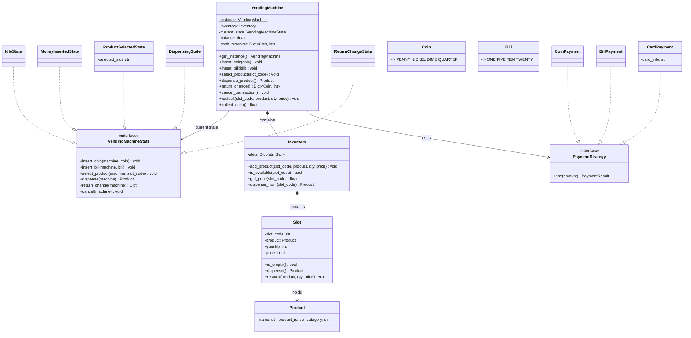
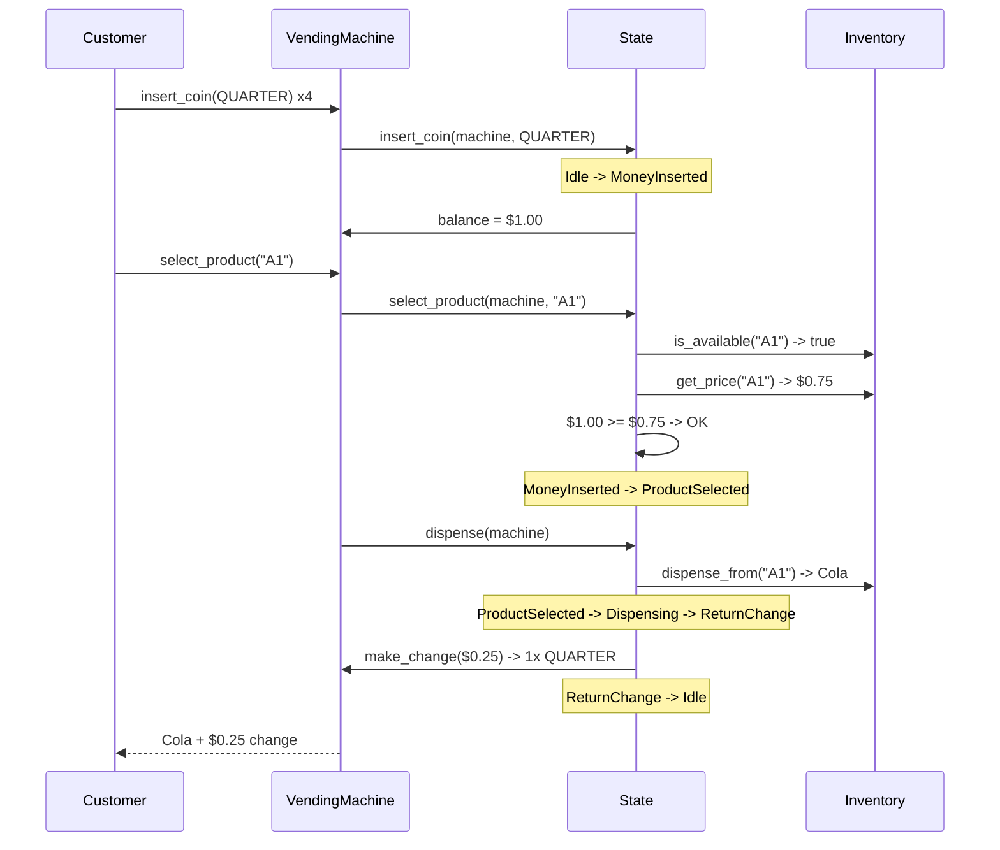
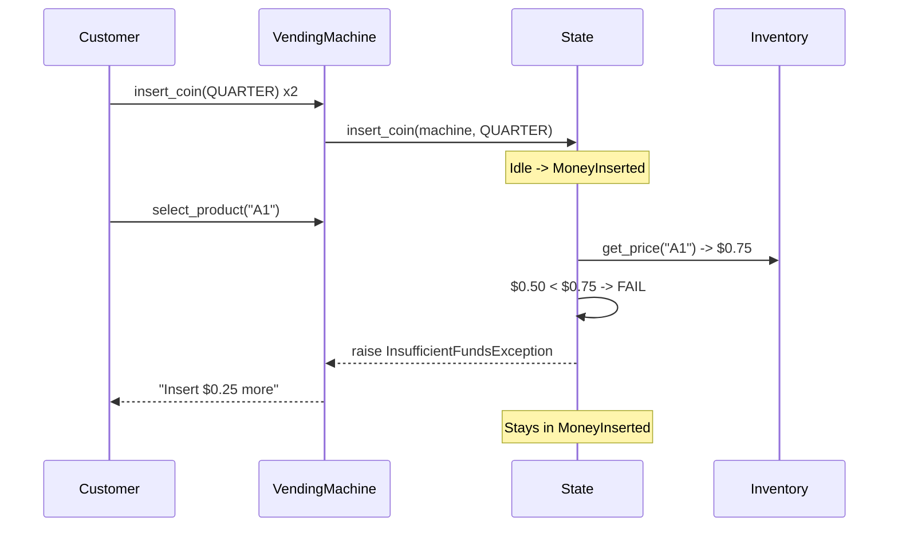
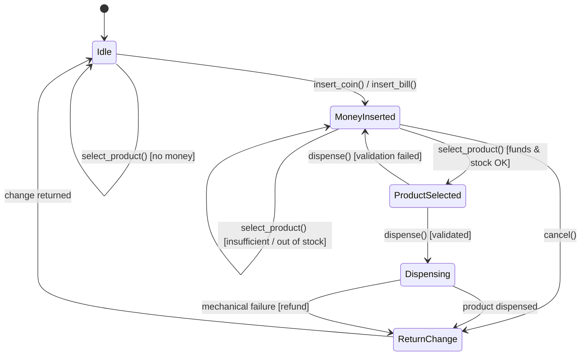

# Low-Level Design: Vending Machine

> A vending machine that displays products with prices, accepts coins/bills/card,
> dispenses products, returns change, and supports admin restocking. This classic
> LLD question showcases the State pattern -- master it and you can handle any
> state-machine-driven design problem.

---

## 1. Requirements

### 1.1 Functional Requirements

- **FR-1:** Display available products with names, prices, and remaining quantities.
- **FR-2:** Accept payment via coins (penny, nickel, dime, quarter), bills ($1, $5, $10, $20), or card.
- **FR-3:** Allow the user to select a product by slot code (e.g., A1, B3).
- **FR-4:** Dispense the selected product after verifying sufficient funds and stock.
- **FR-5:** Return change to the user after a successful purchase.
- **FR-6:** Refund all inserted money if the transaction fails (out of stock, mechanical error).
- **FR-7:** (Admin) Restock products into specific slots with quantity and price.
- **FR-8:** (Admin) Collect accumulated cash from the machine.
- **FR-9:** Handle "exact change only" mode when the machine cannot guarantee change.

### 1.2 Constraints & Assumptions

- Single process, single-threaded -- one customer interaction at a time.
- In-memory persistence (interview scope); swappable via Repository pattern.
- ~20-30 product slots, ~5-10 unique product types.
- Finite coin/bill reservoir for making change.
- Card payments process instantly (external gateway abstracted).

> **Guidance:** Ask: "How many slots? Card payments? Concurrent users?" Scope it down.

---

## 2. Use Cases

| #    | Actor    | Action                         | Outcome                                         |
|------|----------|--------------------------------|--------------------------------------------------|
| UC-1 | Customer | Inserts coins or bills         | Machine accumulates balance, displays total       |
| UC-2 | Customer | Selects product by slot code   | Checks funds and stock, prepares to dispense      |
| UC-3 | Customer | Receives dispensed product     | Product drops into tray, inventory decremented    |
| UC-4 | Customer | Receives change                | Machine returns excess coins/bills                |
| UC-5 | Customer | Requests refund (cancel)       | All inserted money returned, machine resets       |
| UC-6 | Admin    | Restocks products              | Inventory updated with new quantities and prices  |
| UC-7 | Admin    | Collects cash                  | Cash reservoir emptied, total reported            |

---

## 3. Core Classes & Interfaces

### 3.1 Class Diagram



### 3.2 Class Descriptions

| Class / Interface          | Responsibility                                                    | Pattern    |
|----------------------------|-------------------------------------------------------------------|------------|
| `VendingMachine`           | Central coordinator; manages state, balance, inventory, payments  | Singleton  |
| `VendingMachineState`      | Interface defining allowed actions per state                      | State      |
| `IdleState`                | Waiting; only accepts money insertion                             | State      |
| `MoneyInsertedState`       | Money received; accepts more money or product selection            | State      |
| `ProductSelectedState`     | Product chosen; validates and transitions to dispense              | State      |
| `DispensingState`          | Product being dispensed; transitions to return change              | State      |
| `ReturnChangeState`        | Calculates and returns excess money; resets to idle                | State      |
| `Inventory`                | Manages all product slots; checks availability                    | Repository |
| `Slot`                     | Holds a product type with quantity, price, and capacity            | Domain     |
| `Product`                  | Value object (name, id, category)                                  | Domain     |
| `Coin` / `Bill`            | Enum of accepted denominations with monetary values                | Enum       |
| `PaymentStrategy`          | Interface for payment processing                                   | Strategy   |
| `CoinPayment` / `BillPayment` / `CardPayment` | Concrete payment processors               | Strategy   |

---

## 4. Design Patterns Used

| Pattern    | Where Applied                                  | Why                                                          |
|------------|-------------------------------------------------|--------------------------------------------------------------|
| State      | `VendingMachineState` and concrete states       | Each state encapsulates its own transition rules; eliminates if-elif chains |
| Strategy   | `PaymentStrategy` (Coin, Bill, Card)            | Swap payment methods at runtime without changing machine logic |
| Singleton  | `VendingMachine.get_instance()`                 | Exactly one vending machine instance in the process           |

### 4.1 State Pattern

```
Instead of:
    if self.state == "IDLE" and action == "insert_coin": ...
    elif self.state == "MONEY_INSERTED" and action == "select": ...

Use:
    self.current_state.insert_coin(self, coin)

Each state class defines what happens for each action. Adding MaintenanceState
requires only a new class -- zero changes to VendingMachine.
```

### 4.2 Strategy Pattern

```
Instead of:
    if payment_type == "coin": process_coins(amount)
    elif payment_type == "card": charge_card(card_info, amount)

Use:
    result = self._payment_strategy.pay(amount)

Adding MobilePayment requires only a new PaymentStrategy class.
```

---

## 5. Key Flows

### 5.1 Successful Purchase Flow



### 5.2 Insufficient Funds Flow



---

## 6. State Diagrams



### State Transition Table

| Current State     | Event              | Next State        | Guard Condition                     |
|-------------------|--------------------|-------------------|-------------------------------------|
| Idle              | insert_coin/bill() | MoneyInserted     | valid denomination                  |
| Idle              | select_product()   | Idle              | error: no money inserted            |
| MoneyInserted     | insert_coin/bill() | MoneyInserted     | accumulate balance                  |
| MoneyInserted     | select_product()   | ProductSelected   | in stock and balance >= price       |
| MoneyInserted     | select_product()   | MoneyInserted     | insufficient funds or out of stock  |
| MoneyInserted     | cancel()           | ReturnChange      | refund all money                    |
| ProductSelected   | dispense()         | Dispensing        | validation passed                   |
| Dispensing        | (product drops)    | ReturnChange      | success or mechanical failure       |
| ReturnChange      | (change returned)  | Idle              | all change dispensed                |

---

## 7. Code Skeleton

```python
from abc import ABC, abstractmethod
from enum import Enum
from dataclasses import dataclass, field
from typing import Dict, List, Optional
import uuid

# -- Enums & Domain Models ------------------------------------------------

class Coin(Enum):
    PENNY = 0.01; NICKEL = 0.05; DIME = 0.10; QUARTER = 0.25

class Bill(Enum):
    ONE = 1.00; FIVE = 5.00; TEN = 10.00; TWENTY = 20.00

@dataclass
class Product:
    name: str
    product_id: str = field(default_factory=lambda: str(uuid.uuid4()))
    category: str = "general"

@dataclass
class Slot:
    slot_code: str
    product: Optional[Product] = None
    quantity: int = 0
    price: float = 0.0
    max_capacity: int = 10

    def is_empty(self) -> bool:
        return self.quantity <= 0

    def dispense(self) -> Product:
        if self.is_empty():
            raise ValueError(f"Slot {self.slot_code} is empty")
        self.quantity -= 1
        return self.product

    def restock(self, product: Product, qty: int, price: float) -> None:
        self.product = product
        self.quantity = min(qty, self.max_capacity)
        self.price = price

# -- Inventory ------------------------------------------------------------

class Inventory:
    def __init__(self):
        self._slots: Dict[str, Slot] = {}

    def add_product(self, slot_code: str, product: Product, qty: int, price: float):
        if slot_code not in self._slots:
            self._slots[slot_code] = Slot(slot_code=slot_code)
        self._slots[slot_code].restock(product, qty, price)

    def get_slot(self, slot_code: str) -> Slot:
        if slot_code not in self._slots:
            raise KeyError(f"Invalid slot: {slot_code}")
        return self._slots[slot_code]

    def is_available(self, slot_code: str) -> bool:
        return not self.get_slot(slot_code).is_empty()

    def get_price(self, slot_code: str) -> float:
        return self.get_slot(slot_code).price

    def dispense_from(self, slot_code: str) -> Product:
        return self.get_slot(slot_code).dispense()

# -- Payment Strategy -----------------------------------------------------

class PaymentStrategy(ABC):
    @abstractmethod
    def pay(self, amount: float) -> bool: ...

class CoinPayment(PaymentStrategy):
    def __init__(self):
        self._inserted: List[Coin] = []
    def insert(self, coin: Coin): self._inserted.append(coin)
    def get_total(self) -> float: return round(sum(c.value for c in self._inserted), 2)
    def pay(self, amount: float) -> bool: return self.get_total() >= amount

class BillPayment(PaymentStrategy):
    def __init__(self):
        self._inserted: List[Bill] = []
    def insert(self, bill: Bill): self._inserted.append(bill)
    def get_total(self) -> float: return round(sum(b.value for b in self._inserted), 2)
    def pay(self, amount: float) -> bool: return self.get_total() >= amount

class CardPayment(PaymentStrategy):
    def __init__(self, card_info: str): self._card_info = card_info
    def pay(self, amount: float) -> bool: return True  # External gateway

# -- Exceptions -----------------------------------------------------------

class InsufficientFundsException(Exception): pass
class OutOfStockException(Exception): pass
class InvalidActionException(Exception): pass

# -- State Pattern --------------------------------------------------------

class VendingMachineState(ABC):
    """Base state -- invalid actions raise by default."""
    def insert_coin(self, machine, coin):  raise InvalidActionException("Invalid action.")
    def insert_bill(self, machine, bill):  raise InvalidActionException("Invalid action.")
    def select_product(self, machine, sc): raise InvalidActionException("Invalid action.")
    def dispense(self, machine):           raise InvalidActionException("Invalid action.")
    def return_change(self, machine):      raise InvalidActionException("Invalid action.")
    def cancel(self, machine):             raise InvalidActionException("Invalid action.")


class IdleState(VendingMachineState):
    def insert_coin(self, machine, coin):
        machine.add_to_balance(coin.value)
        machine.set_state(MoneyInsertedState())

    def insert_bill(self, machine, bill):
        machine.add_to_balance(bill.value)
        machine.set_state(MoneyInsertedState())

    def cancel(self, machine):
        pass  # No-op


class MoneyInsertedState(VendingMachineState):
    def insert_coin(self, machine, coin):
        machine.add_to_balance(coin.value)

    def insert_bill(self, machine, bill):
        machine.add_to_balance(bill.value)

    def select_product(self, machine, slot_code):
        inv = machine.get_inventory()
        if not inv.is_available(slot_code):
            raise OutOfStockException(f"Slot {slot_code} is out of stock.")
        price = inv.get_price(slot_code)
        if machine.get_balance() < price:
            raise InsufficientFundsException(f"Need ${price - machine.get_balance():.2f} more.")
        machine.set_state(ProductSelectedState(slot_code))

    def cancel(self, machine):
        machine.set_state(ReturnChangeState())
        machine.get_state().return_change(machine)


class ProductSelectedState(VendingMachineState):
    def __init__(self, slot_code: str):
        self._slot_code = slot_code

    def dispense(self, machine):
        inv = machine.get_inventory()
        machine.deduct_from_balance(inv.get_price(self._slot_code))
        product = inv.dispense_from(self._slot_code)
        machine.set_state(DispensingState(product))
        return product

    def cancel(self, machine):
        machine.set_state(ReturnChangeState())
        machine.get_state().return_change(machine)


class DispensingState(VendingMachineState):
    def __init__(self, product: Product):
        self._product = product

    def dispense(self, machine):
        machine.set_state(ReturnChangeState())
        return self._product


class ReturnChangeState(VendingMachineState):
    def return_change(self, machine):
        change = machine.make_change(machine.get_balance())
        machine.reset_balance()
        machine.set_state(IdleState())
        return change

    def cancel(self, machine):
        self.return_change(machine)


# -- Vending Machine (Singleton) ------------------------------------------

class VendingMachine:
    _instance = None

    def __init__(self):
        self._inventory = Inventory()
        self._state: VendingMachineState = IdleState()
        self._balance = 0.0
        self._cash_reservoir: Dict[Coin, int] = {c: 100 for c in Coin}

    @classmethod
    def get_instance(cls):
        if cls._instance is None:
            cls._instance = cls()
        return cls._instance

    # State & balance helpers
    def get_state(self): return self._state
    def set_state(self, s): self._state = s
    def get_balance(self): return round(self._balance, 2)
    def add_to_balance(self, a): self._balance = round(self._balance + a, 2)
    def deduct_from_balance(self, a): self._balance = round(self._balance - a, 2)
    def reset_balance(self): self._balance = 0.0
    def get_inventory(self): return self._inventory

    def make_change(self, amount: float) -> Dict[Coin, int]:
        """Greedy algorithm: largest coins first, works in cents to avoid floats."""
        change, remaining = {}, round(amount * 100)
        for coin in sorted(Coin, key=lambda c: c.value, reverse=True):
            cents = int(coin.value * 100)
            use = min(remaining // cents, self._cash_reservoir.get(coin, 0))
            if use > 0:
                change[coin] = use
                remaining -= use * cents
                self._cash_reservoir[coin] -= use
        if remaining > 0:
            for c, n in change.items(): self._cash_reservoir[c] += n  # Rollback
            raise ValueError("Cannot make exact change.")
        return change

    # Public API -- delegates to current state
    def insert_coin(self, coin): self._state.insert_coin(self, coin)
    def insert_bill(self, bill): self._state.insert_bill(self, bill)
    def select_product(self, sc): self._state.select_product(self, sc)
    def dispense_product(self):  return self._state.dispense(self)
    def return_change(self):     return self._state.return_change(self)
    def cancel_transaction(self): self._state.cancel(self)

    # Admin
    def restock(self, slot_code, product, qty, price):
        self._inventory.add_product(slot_code, product, qty, price)

    def collect_cash(self) -> float:
        total = sum(c.value * n for c, n in self._cash_reservoir.items())
        self._cash_reservoir = {c: 0 for c in Coin}
        return round(total, 2)
```

---

## 8. Extensibility & Edge Cases

### 8.1 Extensibility

| Change Request                    | How the Design Handles It                                      |
|-----------------------------------|----------------------------------------------------------------|
| Touchscreen UI                    | `DisplayAdapter` reads Inventory; no core changes              |
| Promotional discounts             | `DiscountDecorator` wrapping Slot prices                       |
| Remote monitoring                 | Observer interface; machine notifies on stock-low or errors    |
| Temperature control for beverages | Extend `Slot` with `temperature_zone`; add `TemperatureController` |
| Mobile/NFC payment                | New `MobilePayment` implementing `PaymentStrategy`             |
| Maintenance mode                  | New `MaintenanceState` implementing `VendingMachineState`      |

### 8.2 Edge Cases

- **Exact change:** Cannot guarantee change -- display "exact change only", reject bills.
- **Mechanical failure:** Product stuck -- transition to `ReturnChangeState` with full refund.
- **Timeout:** Customer walks away -- auto-refund after N minutes.
- **Float precision:** Use integer cents internally (as in `make_change`).
- **Coin reservoir depletion:** Greedy algorithm falls back to smaller coins; if impossible, refund.
- **Admin during transaction:** Gate admin operations behind state checks.

---

## 9. Interview Tips

### 45-Minute Approach

1. **0-5 min:** Clarify requirements -- payment types, slot count, concurrent users.
2. **5-15 min:** Draw class diagram with State and Strategy patterns.
3. **15-25 min:** Walk through purchase and cancellation flows.
4. **25-40 min:** Write code skeleton -- state transitions and change-making.
5. **40-45 min:** Discuss extensibility and edge cases.

### Common Follow-ups

- "How do you handle exact-change-only mode?"
- "How would you add a maintenance mode?"
- "How would you unit test the state transitions?"
- "Walk through a cancelled transaction."
- "How would you add discounts without changing existing code?"

### Common Pitfalls

- Giant `if state == ...` block instead of State pattern.
- Forgetting the exact-change problem.
- Using floating-point for money without converting to cents.
- Implicit state transitions inside VendingMachine instead of in state objects.
- Not resetting state properly after cancel/failure.

---

> **Checklist:**
> - [x] Requirements clarified and scoped.
> - [x] Class diagram with State, Strategy, Singleton.
> - [x] State diagram for vending machine lifecycle.
> - [x] Code skeleton covers states, payments, inventory, change-making.
> - [x] Edge cases acknowledged.
> - [x] Extensibility demonstrated.
