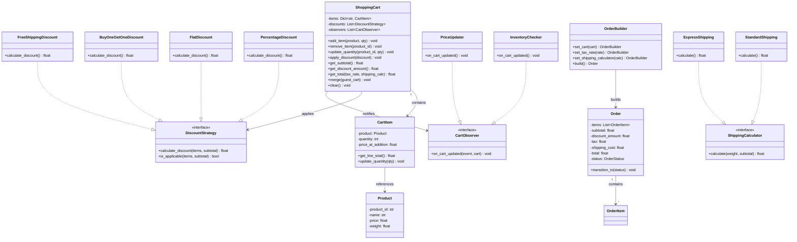
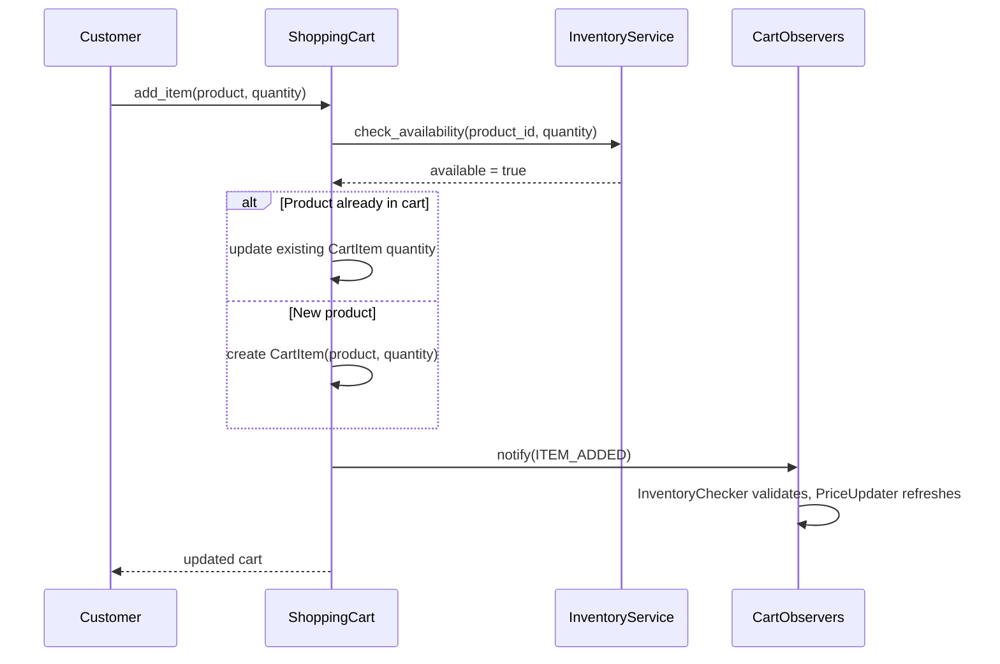
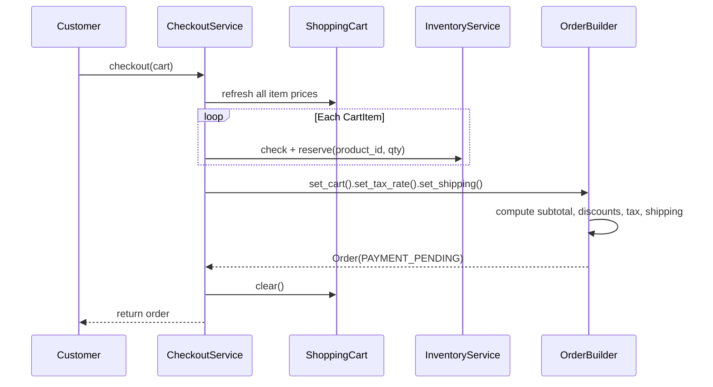
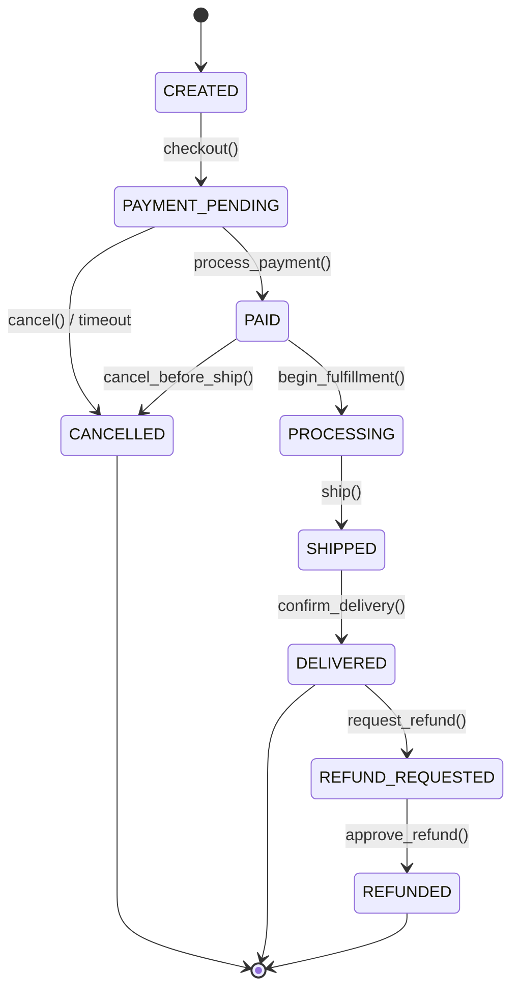

# Low-Level Design: Online Shopping Cart

> E-commerce shopping cart with add/remove items, discount strategies, persistent
> carts, guest-to-user merging, and checkout with tax/shipping. Tests Strategy,
> Observer, and Builder patterns.

---

## 1. Requirements

### 1.1 Functional Requirements

- **FR-1:** Add a product to the cart with a specified quantity.
- **FR-2:** Remove a product from the cart entirely.
- **FR-3:** Update the quantity of an existing cart item.
- **FR-4:** Apply one or more discount codes/coupons to the cart.
- **FR-5:** Calculate totals -- subtotal, tax, shipping, discount, grand total.
- **FR-6:** Persist the cart across sessions.
- **FR-7:** Merge a guest cart into a user cart on login.
- **FR-8:** Checkout: validate inventory, apply discounts, create order.

### 1.2 Constraints & Assumptions

- Single process, multi-threaded (concurrent cart modifications possible).
- Persistence: in-memory (interview scope); swappable via Repository pattern.
- Inventory checked at add-to-cart and re-validated at checkout.
- Prices may change between add-time and checkout -- system handles staleness.
- One cart per user/guest session; one entry per product (quantity adjusted).

> **Guidance:** Ask: "Multiple coupons? Inventory reservation needed? Wishlists?"

---

## 2. Use Cases

| #    | Actor    | Action                    | Outcome                                           |
|------|----------|---------------------------|----------------------------------------------------|
| UC-1 | Customer | Adds product to cart      | CartItem created, totals recalculated              |
| UC-2 | Customer | Removes product           | CartItem deleted, totals recalculated              |
| UC-3 | Customer | Updates item quantity      | Quantity adjusted (validated against stock)         |
| UC-4 | Customer | Applies coupon code       | Discount strategy attached, totals recalculated    |
| UC-5 | Customer | Views cart                | Items, quantities, prices, totals displayed        |
| UC-6 | Customer | Proceeds to checkout      | Inventory locked, discounts applied, order created |

---

## 3. Core Classes & Interfaces

### 3.1 Class Diagram



### 3.2 Class Descriptions

| Class / Interface         | Responsibility                                          | Pattern  |
|---------------------------|---------------------------------------------------------|----------|
| `ShoppingCart`            | Manages items, discounts, totals; notifies observers    | Facade   |
| `CartItem`                | Wraps product with quantity and price snapshot           | Domain   |
| `Product`                 | Catalog entry with price and metadata                   | Domain   |
| `DiscountStrategy`        | Interface for computing discount from cart state        | Strategy |
| `PercentageDiscount`      | X% off subtotal with optional min-order and cap         | Strategy |
| `FlatDiscount`            | Flat amount off subtotal                                | Strategy |
| `BuyOneGetOneDiscount`    | Every second eligible item free                         | Strategy |
| `FreeShippingDiscount`    | Flags shipping as free                                  | Strategy |
| `CartObserver`            | Interface notified on cart changes                      | Observer |
| `InventoryChecker`        | Validates stock on add/update                           | Observer |
| `PriceUpdater`            | Refreshes prices from catalog                           | Observer |
| `Order` / `OrderItem`     | Immutable snapshot of a completed purchase              | Domain   |
| `OrderBuilder`            | Constructs Order from cart + tax + shipping             | Builder  |
| `ShippingCalculator`      | Interface for computing shipping cost                   | Strategy |
| `InventoryService`        | Stock checks and reservations                           | Service  |

---

## 4. Design Patterns Used

| Pattern  | Where Applied                  | Why                                                       |
|----------|--------------------------------|-----------------------------------------------------------|
| Strategy | Discount types, shipping calc  | Swap logic at runtime; Open/Closed Principle              |
| Observer | Cart change notifications      | Decouple cart from inventory, pricing, analytics          |
| Builder  | Order construction from cart   | Complex object with many computed fields                  |

### 4.1 Strategy -- Discounts

```
Instead of:  if coupon.type == "percentage": ... elif "flat": ... elif "bogo": ...
Use:         discount = strategy.calculate_discount(cart_items, subtotal)
Adding a new coupon type = new class. No existing code changes. Open/Closed.
```

### 4.2 Observer -- Cart Notifications

```
On item add/remove/update, observers react independently:
  InventoryChecker -> validates stock    PriceUpdater -> refreshes prices
New observers added without modifying ShoppingCart.
```

### 4.3 Builder -- Order Construction

```
OrderBuilder().set_cart(cart).set_tax_rate(0.08)
    .set_shipping_calculator(StandardShipping()).build()
build() orchestrates: subtotal -> discounts -> tax -> shipping -> Order
```

---

## 5. Key Flows

### 5.1 Add Item to Cart



### 5.2 Checkout Flow



---

## 6. State Diagrams

### 6.1 Order State Machine



### 6.2 State Transition Table

| Current State     | Event               | Next State        | Guard Condition                    |
|-------------------|----------------------|-------------------|------------------------------------|
| CREATED           | checkout()           | PAYMENT_PENDING   | Cart non-empty, inventory reserved |
| PAYMENT_PENDING   | process_payment()    | PAID              | Payment succeeds                   |
| PAYMENT_PENDING   | cancel() / timeout   | CANCELLED         | 30-min timeout or user cancel      |
| PAID              | begin_fulfillment()  | PROCESSING        | None                               |
| PROCESSING        | ship()               | SHIPPED           | Tracking number assigned           |
| SHIPPED           | confirm_delivery()   | DELIVERED         | Delivery confirmed                 |
| DELIVERED         | request_refund()     | REFUND_REQUESTED  | Within 30-day return window        |
| REFUND_REQUESTED  | approve_refund()     | REFUNDED          | Policy satisfied                   |

---

## 7. Code Skeleton (Python)

```python
from abc import ABC, abstractmethod
from enum import Enum
from dataclasses import dataclass, field
from typing import List, Optional, Dict, Set
import uuid


# -- Enums ------------------------------------------------------------------

class OrderStatus(Enum):
    CREATED = "CREATED"
    PAYMENT_PENDING = "PAYMENT_PENDING"
    PAID = "PAID"
    PROCESSING = "PROCESSING"
    SHIPPED = "SHIPPED"
    DELIVERED = "DELIVERED"
    CANCELLED = "CANCELLED"
    REFUNDED = "REFUNDED"

class CartEventType(Enum):
    ITEM_ADDED = "ITEM_ADDED"
    ITEM_REMOVED = "ITEM_REMOVED"
    QUANTITY_UPDATED = "QUANTITY_UPDATED"
    DISCOUNT_APPLIED = "DISCOUNT_APPLIED"


# -- Domain Models ----------------------------------------------------------

@dataclass
class Product:
    product_id: str
    name: str
    price: float
    weight: float
    category: str
    is_active: bool = True

@dataclass
class CartItem:
    product: Product
    quantity: int
    price_at_addition: float = 0.0

    def __post_init__(self):
        if self.price_at_addition == 0.0:
            self.price_at_addition = self.product.price

    def get_line_total(self) -> float:
        return self.price_at_addition * self.quantity

    def update_quantity(self, new_qty: int) -> None:
        if new_qty < 1:
            raise ValueError("Quantity must be >= 1.")
        self.quantity = new_qty

@dataclass
class CartEvent:
    event_type: CartEventType
    product_id: Optional[str]
    quantity: Optional[int]


# -- Discount Strategy ------------------------------------------------------

class DiscountStrategy(ABC):
    @property
    @abstractmethod
    def code(self) -> str: ...

    @abstractmethod
    def calculate_discount(self, items: List[CartItem], subtotal: float) -> float: ...

    @abstractmethod
    def is_applicable(self, items: List[CartItem], subtotal: float) -> bool: ...

class PercentageDiscount(DiscountStrategy):
    def __init__(self, code: str, pct: float, min_order: float = 0,
                 max_disc: float = float("inf")):
        self._code, self._pct, self._min, self._max = code, pct, min_order, max_disc

    @property
    def code(self): return self._code

    def is_applicable(self, items, subtotal):
        return subtotal >= self._min and len(items) > 0

    def calculate_discount(self, items, subtotal):
        if not self.is_applicable(items, subtotal): return 0.0
        return min(subtotal * self._pct / 100, self._max)

class FlatDiscount(DiscountStrategy):
    def __init__(self, code: str, amount: float, min_order: float = 0):
        self._code, self._amount, self._min = code, amount, min_order

    @property
    def code(self): return self._code

    def is_applicable(self, items, subtotal):
        return subtotal >= self._min and len(items) > 0

    def calculate_discount(self, items, subtotal):
        if not self.is_applicable(items, subtotal): return 0.0
        return min(self._amount, subtotal)

class BuyOneGetOneDiscount(DiscountStrategy):
    def __init__(self, code: str, eligible_ids: Set[str]):
        self._code, self._eligible = code, eligible_ids

    @property
    def code(self): return self._code

    def is_applicable(self, items, subtotal):
        return any(i.product.product_id in self._eligible
                   and i.quantity >= 2 for i in items)

    def calculate_discount(self, items, subtotal):
        return sum((i.quantity // 2) * i.price_at_addition for i in items
                   if i.product.product_id in self._eligible)

class FreeShippingDiscount(DiscountStrategy):
    def __init__(self, code: str, min_order: float = 0):
        self._code, self._min = code, min_order

    @property
    def code(self): return self._code

    def is_applicable(self, items, subtotal): return subtotal >= self._min
    def calculate_discount(self, items, subtotal): return 0.0  # shipping handled separately


# -- Observer Pattern -------------------------------------------------------

class CartObserver(ABC):
    @abstractmethod
    def on_cart_updated(self, event: CartEvent, cart: "ShoppingCart") -> None: ...

class InventoryChecker(CartObserver):
    def __init__(self, inventory: "InventoryService"):
        self._inv = inventory

    def on_cart_updated(self, event, cart):
        if event.event_type in (CartEventType.ITEM_ADDED, CartEventType.QUANTITY_UPDATED):
            if not self._inv.check_availability(event.product_id, event.quantity):
                raise ValueError(f"Insufficient stock for {event.product_id}")

class PriceUpdater(CartObserver):
    def __init__(self, pricing: "PricingService"):
        self._pricing = pricing

    def on_cart_updated(self, event, cart):
        if event.event_type == CartEventType.ITEM_ADDED and event.product_id:
            item = cart._items.get(event.product_id)
            if item:
                item.price_at_addition = self._pricing.get_current_price(event.product_id)


# -- Shipping Calculator ----------------------------------------------------

class ShippingCalculator(ABC):
    @abstractmethod
    def calculate(self, weight: float, subtotal: float) -> float: ...

class StandardShipping(ShippingCalculator):
    def __init__(self, base: float = 5.0, per_kg: float = 1.5):
        self._base, self._per_kg = base, per_kg
    def calculate(self, weight, subtotal): return self._base + weight * self._per_kg

class ExpressShipping(ShippingCalculator):
    def __init__(self, flat_rate: float = 15.0):
        self._rate = flat_rate
    def calculate(self, weight, subtotal): return self._rate


# -- Services ---------------------------------------------------------------

class InventoryService:
    def __init__(self):
        self._stock: Dict[str, int] = {}

    def check_availability(self, product_id: str, qty: int) -> bool:
        return self._stock.get(product_id, 0) >= qty

    def reserve(self, product_id: str, qty: int) -> bool:
        if not self.check_availability(product_id, qty): return False
        self._stock[product_id] -= qty
        return True

    def release(self, product_id: str, qty: int) -> None:
        self._stock[product_id] = self._stock.get(product_id, 0) + qty

class PricingService:
    def __init__(self, catalog: Dict[str, float]):
        self._catalog = catalog
    def get_current_price(self, product_id: str) -> float:
        return self._catalog[product_id]


# -- Shopping Cart -----------------------------------------------------------

class ShoppingCart:
    def __init__(self, user_id: str):
        self.cart_id = str(uuid.uuid4())
        self.user_id = user_id
        self._items: Dict[str, CartItem] = {}
        self._discounts: List[DiscountStrategy] = []
        self._observers: List[CartObserver] = []

    def register_observer(self, obs: CartObserver): self._observers.append(obs)

    def _notify(self, event: CartEvent):
        for obs in self._observers: obs.on_cart_updated(event, self)

    def add_item(self, product: Product, quantity: int = 1):
        if product.product_id in self._items:
            ci = self._items[product.product_id]
            ci.update_quantity(ci.quantity + quantity)
        else:
            self._items[product.product_id] = CartItem(product, quantity)
        self._notify(CartEvent(CartEventType.ITEM_ADDED, product.product_id,
                               self._items[product.product_id].quantity))

    def remove_item(self, product_id: str):
        del self._items[product_id]
        self._notify(CartEvent(CartEventType.ITEM_REMOVED, product_id, 0))

    def update_quantity(self, product_id: str, quantity: int):
        if quantity < 1: return self.remove_item(product_id)
        self._items[product_id].update_quantity(quantity)
        self._notify(CartEvent(CartEventType.QUANTITY_UPDATED, product_id, quantity))

    def apply_discount(self, discount: DiscountStrategy):
        if any(d.code == discount.code for d in self._discounts):
            raise ValueError(f"Discount {discount.code} already applied.")
        if not discount.is_applicable(self.get_items(), self.get_subtotal()):
            raise ValueError(f"Discount {discount.code} not applicable.")
        self._discounts.append(discount)

    def get_items(self) -> List[CartItem]: return list(self._items.values())

    def get_subtotal(self) -> float:
        return sum(i.get_line_total() for i in self._items.values())

    def get_discount_amount(self) -> float:
        sub, items = self.get_subtotal(), self.get_items()
        return min(sum(d.calculate_discount(items, sub) for d in self._discounts), sub)

    def get_shipping_cost(self, calc: ShippingCalculator) -> float:
        if any(isinstance(d, FreeShippingDiscount) and
               d.is_applicable(self.get_items(), self.get_subtotal())
               for d in self._discounts):
            return 0.0
        wt = sum(i.product.weight * i.quantity for i in self._items.values())
        return calc.calculate(wt, self.get_subtotal())

    def get_tax(self, rate: float) -> float:
        return round(max(0, self.get_subtotal() - self.get_discount_amount()) * rate, 2)

    def get_total(self, tax_rate: float, calc: ShippingCalculator) -> float:
        return round(self.get_subtotal() - self.get_discount_amount()
                     + self.get_tax(tax_rate) + self.get_shipping_cost(calc), 2)

    def merge(self, guest: "ShoppingCart"):
        for pid, gi in guest._items.items():
            if pid in self._items:
                self._items[pid].quantity = max(self._items[pid].quantity, gi.quantity)
            else:
                self._items[pid] = gi

    def clear(self):
        self._items.clear()
        self._discounts.clear()


# -- Order & Builder ---------------------------------------------------------

VALID_TRANSITIONS = {
    OrderStatus.CREATED:         [OrderStatus.PAYMENT_PENDING],
    OrderStatus.PAYMENT_PENDING: [OrderStatus.PAID, OrderStatus.CANCELLED],
    OrderStatus.PAID:            [OrderStatus.PROCESSING, OrderStatus.CANCELLED],
    OrderStatus.PROCESSING:      [OrderStatus.SHIPPED],
    OrderStatus.SHIPPED:         [OrderStatus.DELIVERED],
    OrderStatus.DELIVERED:       [OrderStatus.REFUNDED],
    OrderStatus.CANCELLED:       [],
    OrderStatus.REFUNDED:        [],
}

@dataclass
class OrderItem:
    product_id: str
    product_name: str
    quantity: int
    unit_price: float
    line_total: float

@dataclass
class Order:
    order_id: str
    user_id: str
    items: List[OrderItem]
    subtotal: float
    discount_amount: float
    tax: float
    shipping_cost: float
    total: float
    status: OrderStatus = OrderStatus.CREATED

    def transition_to(self, new_status: OrderStatus):
        if new_status not in VALID_TRANSITIONS[self.status]:
            raise ValueError(f"Invalid: {self.status.value} -> {new_status.value}")
        self.status = new_status

class OrderBuilder:
    def __init__(self):
        self._cart = None
        self._tax_rate = 0.0
        self._shipping = None

    def set_cart(self, c): self._cart = c; return self
    def set_tax_rate(self, r): self._tax_rate = r; return self
    def set_shipping_calculator(self, s): self._shipping = s; return self

    def build(self) -> Order:
        c, s = self._cart, self._shipping
        items = [OrderItem(ci.product.product_id, ci.product.name, ci.quantity,
                           ci.price_at_addition, ci.get_line_total())
                 for ci in c.get_items()]
        return Order(str(uuid.uuid4()), c.user_id, items, c.get_subtotal(),
                     c.get_discount_amount(), c.get_tax(self._tax_rate),
                     c.get_shipping_cost(s), c.get_total(self._tax_rate, s),
                     OrderStatus.PAYMENT_PENDING)


# -- Checkout Service -------------------------------------------------------

class CheckoutService:
    def __init__(self, inventory: InventoryService, pricing: PricingService,
                 shipping: ShippingCalculator, tax_rate: float = 0.08):
        self._inv, self._pricing, self._ship, self._tax = (
            inventory, pricing, shipping, tax_rate)

    def checkout(self, cart: ShoppingCart) -> Order:
        items = cart.get_items()
        if not items: raise ValueError("Empty cart.")
        for i in items:
            i.price_at_addition = self._pricing.get_current_price(i.product.product_id)
        reserved = []
        for i in items:
            if not self._inv.reserve(i.product.product_id, i.quantity):
                for r in reserved: self._inv.release(r.product.product_id, r.quantity)
                raise ValueError(f"Out of stock: {i.product.product_id}")
            reserved.append(i)
        order = (OrderBuilder().set_cart(cart).set_tax_rate(self._tax)
                 .set_shipping_calculator(self._ship).build())
        cart.clear()
        return order
```

---

## 8. Extensibility & Edge Cases

### 8.1 Extensibility

| Change Request                     | How the Design Handles It                                    |
|------------------------------------|--------------------------------------------------------------|
| New discount type (e.g., tiered)   | Implement `DiscountStrategy`; no changes to `ShoppingCart`   |
| Wishlist / save-for-later          | New collection on User; move items between cart and wishlist |
| Cart expiry after inactivity       | Background job checks `updated_at`; clears cart              |
| A/B testing prices                 | Inject variant-aware `PricingService`                        |
| Subscription items                 | `is_subscription` flag; OrderBuilder splits orders           |
| Loyalty points as payment          | `LoyaltyPointsDiscount` strategy                             |

### 8.2 Edge Cases

- **Inventory race condition:** Two users add the last item. Use atomic `reserve()` with optimistic locking.
- **Price staleness:** Price changed since add-time. `PriceUpdater` observer refreshes; checkout re-fetches.
- **Coupon stacking overflow:** Total discount > subtotal. Capped in `get_discount_amount()`.
- **Guest merge conflict:** Same product in both carts. Take higher quantity.
- **Concurrent checkout:** Another tab modifies cart. Re-validate at start of `checkout()`.
- **Delisted product:** Validate `is_active` at checkout; remove stale items.

---

## 9. Interview Tips

### 45-Minute Approach

1. **0-5 min:** Clarify -- "Multiple coupons? Guest carts? Tax rules?"
2. **5-15 min:** Class diagram: Cart, CartItem, DiscountStrategy hierarchy, Observers, OrderBuilder.
3. **15-25 min:** Sequence diagrams for add-item and checkout.
4. **25-40 min:** Code -- `ShoppingCart`, discount strategies, `OrderBuilder.build()`.
5. **40-45 min:** Extensibility and edge cases.

### Common Follow-ups

- "New discount without modifying existing code?" -- New `DiscountStrategy` impl. Open/Closed.
- "Two users grab the last item?" -- Atomic `reserve()` + optimistic locking.
- "Prevent coupon abuse?" -- `CouponRepository` validates used/expired; stacking rules in `apply_discount()`.
- "Unit test discount logic?" -- Mock `CartItem` lists, assert `calculate_discount()`. No DB.
- "Payment fails after inventory reserved?" -- Compensating transaction releases stock; order -> CANCELLED.

### Common Pitfalls

- All discount logic in ShoppingCart instead of strategy classes.
- Forgetting price snapshot at add-time (inconsistent totals).
- Not capping discount at subtotal (negative totals).
- Ignoring guest-to-user cart merge.
- Treating cart as a DB table instead of a rich domain object.
