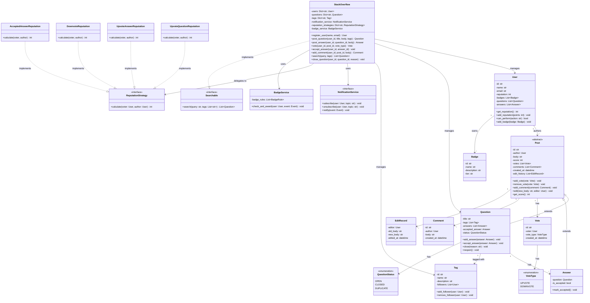
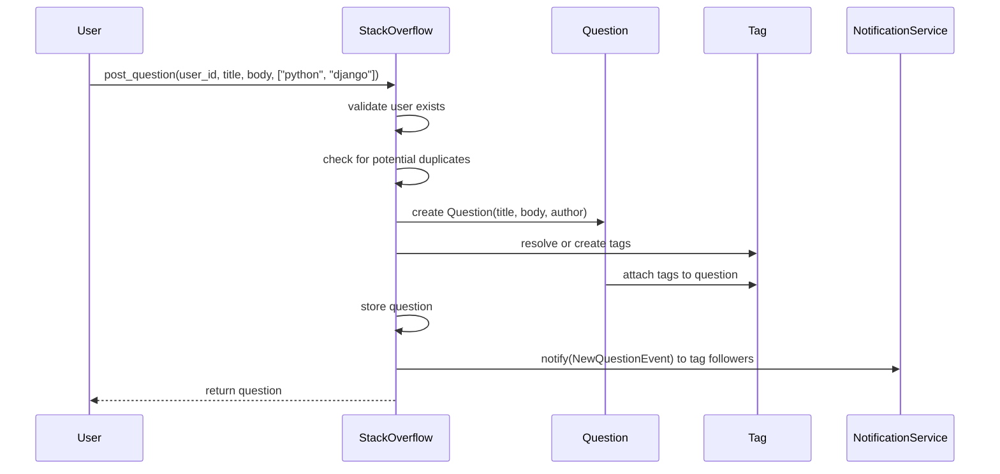
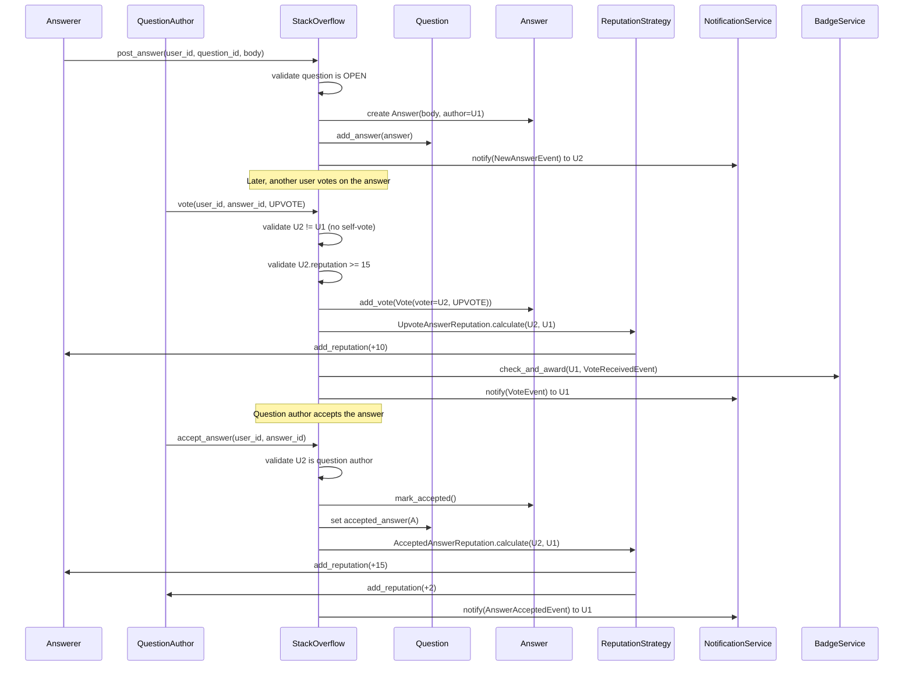
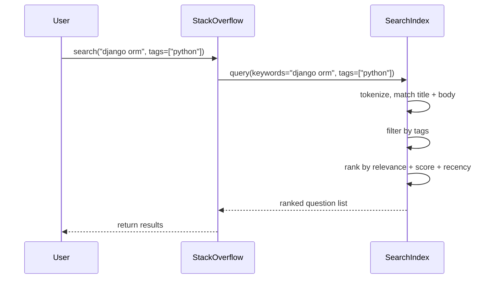
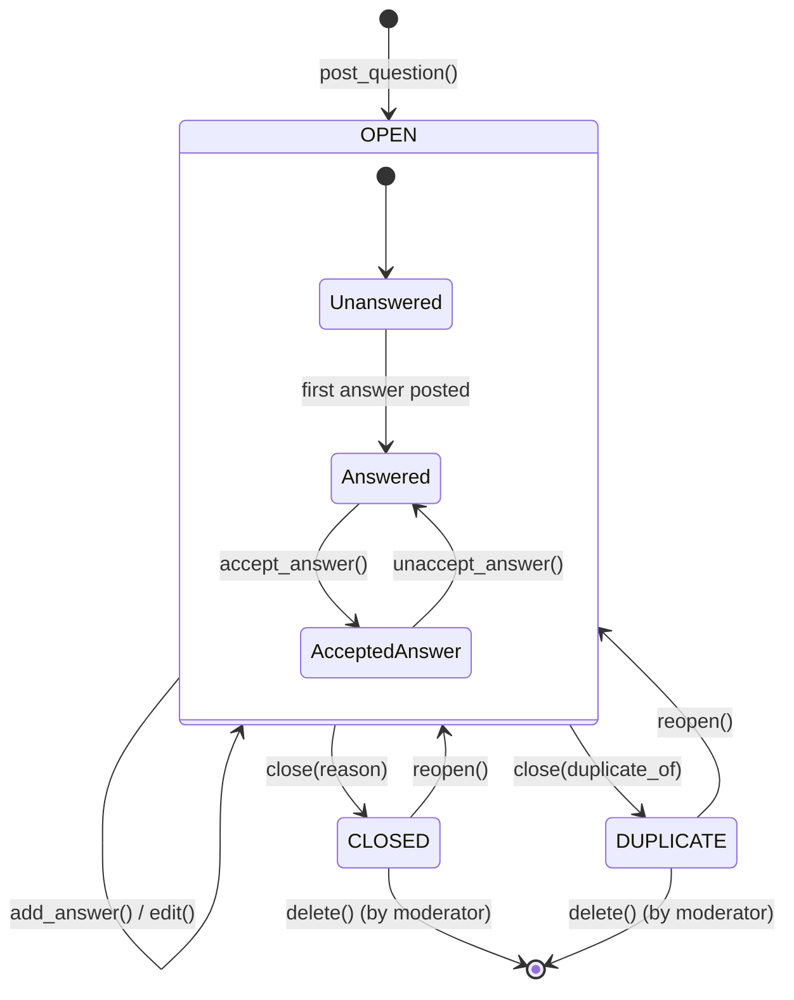
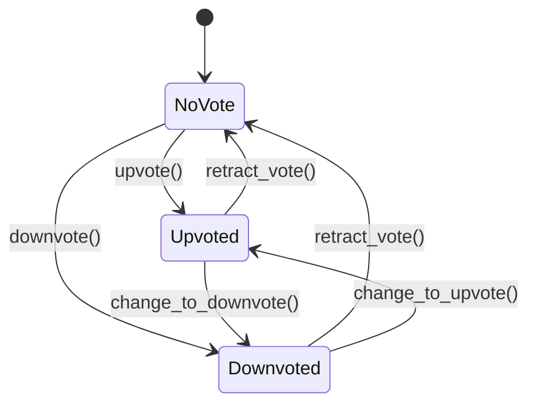

# Low-Level Design: Stack Overflow (Q&A Platform)

> A community-driven question-and-answer platform where users post programming
> questions with tags, provide answers, vote on content quality, and earn
> reputation points through contributions. The core challenges are the reputation
> system (gating actions behind earned trust), the voting mechanism, and
> community moderation. This problem tests Strategy, Observer, Decorator, and
> Facade patterns in a content-rich domain.

---

## 1. Requirements

### 1.1 Functional Requirements

- **FR-1:** Users can post questions with a title, body, and one or more tags.
- **FR-2:** Users can post answers to any open question.
- **FR-3:** Users can upvote or downvote both questions and answers.
- **FR-4:** The question author can accept one answer as the best answer.
- **FR-5:** Users can add comments to questions and answers.
- **FR-6:** Users earn or lose reputation points based on votes, accepted answers, and other actions.
- **FR-7:** Search questions by keyword, tag, or author.
- **FR-8:** Users earn badges for milestones (first question, 100 upvotes, etc.).
- **FR-9:** Questions can be closed (off-topic, duplicate) or reopened by privileged users.
- **FR-10:** All edits to questions and answers are tracked in an edit history.
- **FR-11:** The system detects and flags potential duplicate questions.

### 1.2 Constraints & Assumptions

- The system runs as a single process (no distributed concerns).
- Concurrency model: multi-threaded -- multiple users can post, vote, and comment simultaneously.
- Persistence: in-memory (interview scope); easily swappable via Repository pattern.
- Reputation thresholds gate certain actions:
  - 15 rep: upvote
  - 50 rep: comment on others' posts
  - 125 rep: downvote (costs 1 rep to the downvoter on answers)
  - 500 rep: cast close/reopen votes
  - 2000 rep: edit others' posts without review
- A user cannot vote on their own posts.
- A user can cast only one vote (up or down) per post; they can change or retract it.
- Accepting an answer awards +15 rep to the answerer and +2 to the acceptor.

> **Guidance:** In the interview, clarify: "Do we need bounties? Wiki-style
> community editing? Markdown rendering?" Scope to core Q&A, voting, and
> reputation first.

---

## 2. Use Cases

| #    | Actor  | Action                              | Outcome                                          |
|------|--------|-------------------------------------|--------------------------------------------------|
| UC-1 | User   | Posts a new question with tags      | Question saved, tag followers notified            |
| UC-2 | User   | Posts an answer to a question       | Answer saved, question author notified            |
| UC-3 | User   | Upvotes or downvotes a post         | Vote recorded, author's reputation updated        |
| UC-4 | Author | Accepts an answer on their question | Answer marked accepted, reputation awarded        |
| UC-5 | User   | Adds a comment to a post            | Comment saved, post author notified               |
| UC-6 | User   | Searches questions by keyword/tag   | Matching questions returned, sorted by relevance  |
| UC-7 | System | Awards a badge to a user            | Badge recorded, user notified                     |
| UC-8 | Moderator | Closes or reopens a question     | Question status updated, participants notified    |

> **Guidance:** Each use case maps to one or more methods in the facade. Focus
> on UC-1 through UC-4 for the core interview flow.

---

## 3. Core Classes & Interfaces

### 3.1 Class Diagram



### 3.2 Class Descriptions

| Class / Interface             | Responsibility                                                         | Pattern      |
|-------------------------------|------------------------------------------------------------------------|--------------|
| `StackOverflow`               | Facade -- single entry point for all platform operations               | Facade       |
| `User`                        | Represents a registered user; owns reputation, badges, and privileges  | Domain Model |
| `Post`                        | Abstract base for content that can be voted on, commented on, edited   | Domain Model |
| `Question`                    | A question post with title, tags, answers, and status                  | Domain Model |
| `Answer`                      | An answer linked to a specific question                                | Domain Model |
| `Comment`                     | A short remark attached to a question or answer                        | Domain Model |
| `Vote`                        | A single upvote or downvote cast by a user on a post                   | Domain Model |
| `Tag`                         | A topic label applied to questions; users can follow tags              | Domain Model |
| `Badge`                       | A milestone reward earned by users for specific achievements           | Domain Model |
| `EditRecord`                  | Tracks a single edit to a post with before/after content               | Domain Model |
| `VoteType`                    | Enum: UPVOTE, DOWNVOTE                                                 | Enumeration  |
| `QuestionStatus`              | Enum: OPEN, CLOSED, DUPLICATE                                         | Enumeration  |
| `Searchable`                  | Interface for searching questions by keywords and tags                 | Interface    |
| `ReputationStrategy`          | Interface for calculating reputation changes per action type           | Strategy     |
| `UpvoteQuestionReputation`    | Awards +10 to question author on upvote                                | Strategy     |
| `UpvoteAnswerReputation`      | Awards +10 to answer author on upvote                                  | Strategy     |
| `DownvoteReputation`          | Deducts -2 from author, -1 from voter (answers only)                   | Strategy     |
| `AcceptedAnswerReputation`    | Awards +15 to answerer, +2 to question author                         | Strategy     |
| `NotificationService`         | Observer -- subscribes users and dispatches events                      | Observer     |
| `BadgeService`                | Evaluates badge rules and awards badges on qualifying events           | Rule Engine  |

> **Guidance:** The `Post` abstract class avoids duplicating vote/comment/edit
> logic between Question and Answer. This follows the DRY principle and makes
> the voting system uniform across content types.

---

## 4. Design Patterns Used

| Pattern    | Where Applied                            | Why                                                              |
|------------|------------------------------------------|------------------------------------------------------------------|
| Strategy   | Reputation calculation per action type   | Different actions yield different rep changes; swap without `if/elif` chains |
| Observer   | Notifications on answers, votes, badges  | Decouple core logic from notification delivery                   |
| Facade     | `StackOverflow` class                    | Single entry point simplifies client interaction                 |
| Decorator  | User privilege checks based on reputation | Layer capabilities without subclassing for each rep tier         |
| Repository | Data access for users, questions, tags   | Abstract storage behind an interface for testability             |
| Template Method | `Post.add_vote()` shared by Question and Answer | Common voting logic in base class, specifics in subclasses |

### 4.1 Strategy Pattern -- Reputation Calculation

```
Context: Different actions award different reputation points.

Instead of:
    if action == "upvote_question":    author.reputation += 10
    elif action == "upvote_answer":    author.reputation += 10
    elif action == "downvote_answer":  author.reputation -= 2; voter.reputation -= 1
    elif action == "accept_answer":    author.reputation += 15; acceptor.reputation += 2

Use:
    strategy = reputation_strategies[action_key]
    strategy.calculate(voter, author)

Each strategy encapsulates its own point logic and side effects.
Benefits: Adding a new action (e.g., bounty award) requires only a new strategy class.
```

### 4.2 Observer Pattern -- Notifications

```
Context: When a user answers a question, the question author should be notified.
         When a user earns a badge, they should be notified.
         When a tag gets a new question, tag followers should be notified.

Instead of:
    def post_answer(...):
        save_answer()
        send_email(question.author)     # tightly coupled
        push_notification(question.author)  # more coupling

Use:
    notification_service.notify(NewAnswerEvent(question, answer))

    Subscribers registered for "question:{id}" topic receive the event.
    Adding SMS or Slack notifications requires no changes to post_answer().
```

### 4.3 Decorator Pattern -- Privilege Escalation

```
Context: Users gain privileges as their reputation increases.
         A 1-rep user can only post questions and answers.
         A 15-rep user can also upvote.
         A 125-rep user can also downvote.
         A 500-rep user can also cast close votes.

Instead of:
    class BasicUser, class TrustedUser, class ModeratorUser  # class explosion

Use:
    user.can_perform("upvote")  # checks reputation >= threshold
    Privilege thresholds stored in a configuration map.
    The User object dynamically resolves capabilities from its current reputation.
```

> **Guidance:** The Decorator here is conceptual -- we avoid literal wrapper
> classes in favour of a threshold lookup, which is simpler and more practical.
> Mention the pattern name, explain the concept, and justify the pragmatic choice.

---

## 5. Key Flows

### 5.1 Post Question Flow



### 5.2 Answer, Vote, and Accept Flow



### 5.3 Search Flow



---

## 6. State Diagrams

### 6.1 Question Lifecycle



### 6.2 Question State Transition Table

| Current State     | Event                 | Next State        | Guard Condition                              |
|-------------------|-----------------------|-------------------|----------------------------------------------|
| OPEN:Unanswered   | add_answer()          | OPEN:Answered     | Question is open, answerer != author         |
| OPEN:Answered     | accept_answer()       | OPEN:Accepted     | Caller is question author                    |
| OPEN:Accepted     | unaccept_answer()     | OPEN:Answered     | Caller is question author                    |
| OPEN              | close(reason)         | CLOSED            | Caller has >= 500 rep or is moderator        |
| OPEN              | close(duplicate_of)   | DUPLICATE         | Caller has >= 500 rep or is moderator        |
| CLOSED            | reopen()              | OPEN              | Caller has >= 500 rep or is moderator        |
| DUPLICATE         | reopen()              | OPEN              | Caller has >= 500 rep or is moderator        |

### 6.3 Vote State per User-Post Pair



---

## 7. Code Skeleton

```python
from abc import ABC, abstractmethod
from enum import Enum
from datetime import datetime
from dataclasses import dataclass, field
from typing import List, Optional, Dict, Set
import uuid


# -- Enums -------------------------------------------------------------------

class VoteType(Enum):
    UPVOTE = "UPVOTE"
    DOWNVOTE = "DOWNVOTE"


class QuestionStatus(Enum):
    OPEN = "OPEN"
    CLOSED = "CLOSED"
    DUPLICATE = "DUPLICATE"


# -- Reputation Thresholds ---------------------------------------------------

REPUTATION_THRESHOLDS: Dict[str, int] = {
    "upvote": 15,
    "comment": 50,
    "downvote": 125,
    "close_vote": 500,
    "edit_without_review": 2000,
}


# -- Domain Models -----------------------------------------------------------

@dataclass
class Badge:
    id: str = field(default_factory=lambda: str(uuid.uuid4()))
    name: str = ""
    description: str = ""
    tier: str = "bronze"  # bronze, silver, gold


@dataclass
class EditRecord:
    editor_id: str = ""
    old_body: str = ""
    new_body: str = ""
    edited_at: datetime = field(default_factory=datetime.utcnow)


@dataclass
class Vote:
    id: str = field(default_factory=lambda: str(uuid.uuid4()))
    voter_id: str = ""
    vote_type: VoteType = VoteType.UPVOTE
    created_at: datetime = field(default_factory=datetime.utcnow)


@dataclass
class Comment:
    id: str = field(default_factory=lambda: str(uuid.uuid4()))
    author_id: str = ""
    body: str = ""
    created_at: datetime = field(default_factory=datetime.utcnow)


@dataclass
class User:
    id: str = field(default_factory=lambda: str(uuid.uuid4()))
    name: str = ""
    email: str = ""
    reputation: int = 1  # new users start with 1
    badges: List[Badge] = field(default_factory=list)
    question_ids: List[str] = field(default_factory=list)
    answer_ids: List[str] = field(default_factory=list)

    def add_reputation(self, points: int) -> None:
        self.reputation = max(1, self.reputation + points)  # minimum 1

    def can_perform(self, action: str) -> bool:
        threshold = REPUTATION_THRESHOLDS.get(action, 0)
        return self.reputation >= threshold

    def add_badge(self, badge: Badge) -> None:
        self.badges.append(badge)


@dataclass
class Tag:
    id: str = field(default_factory=lambda: str(uuid.uuid4()))
    name: str = ""
    description: str = ""
    follower_ids: Set[str] = field(default_factory=set)

    def add_follower(self, user_id: str) -> None:
        self.follower_ids.add(user_id)

    def remove_follower(self, user_id: str) -> None:
        self.follower_ids.discard(user_id)


class Post(ABC):
    """Abstract base class for votable, commentable content."""

    def __init__(self, post_id: str, author_id: str, body: str):
        self.id = post_id
        self.author_id = author_id
        self.body = body
        self.score: int = 0
        self.votes: Dict[str, Vote] = {}      # voter_id -> Vote
        self.comments: List[Comment] = []
        self.edit_history: List[EditRecord] = []
        self.created_at: datetime = datetime.utcnow()

    def add_vote(self, vote: Vote) -> Optional[Vote]:
        """Add or change a vote. Returns the previous vote if one existed."""
        previous = self.votes.get(vote.voter_id)
        self.votes[vote.voter_id] = vote
        self._recalculate_score()
        return previous

    def remove_vote(self, voter_id: str) -> Optional[Vote]:
        """Retract a vote. Returns the removed vote."""
        removed = self.votes.pop(voter_id, None)
        self._recalculate_score()
        return removed

    def _recalculate_score(self) -> None:
        self.score = sum(
            1 if v.vote_type == VoteType.UPVOTE else -1
            for v in self.votes.values()
        )

    def add_comment(self, comment: Comment) -> None:
        self.comments.append(comment)

    def edit(self, new_body: str, editor_id: str) -> None:
        record = EditRecord(
            editor_id=editor_id,
            old_body=self.body,
            new_body=new_body,
        )
        self.edit_history.append(record)
        self.body = new_body

    def get_score(self) -> int:
        return self.score


class Question(Post):

    def __init__(self, post_id: str, author_id: str, title: str, body: str):
        super().__init__(post_id, author_id, body)
        self.title = title
        self.tags: List[str] = []          # tag names
        self.answer_ids: List[str] = []
        self.accepted_answer_id: Optional[str] = None
        self.status: QuestionStatus = QuestionStatus.OPEN
        self.close_reason: Optional[str] = None
        self.duplicate_of: Optional[str] = None

    def add_answer(self, answer_id: str) -> None:
        self.answer_ids.append(answer_id)

    def accept_answer(self, answer_id: str) -> None:
        if answer_id not in self.answer_ids:
            raise ValueError(f"Answer {answer_id} does not belong to this question")
        self.accepted_answer_id = answer_id

    def unaccept_answer(self) -> None:
        self.accepted_answer_id = None

    def close(self, reason: str, duplicate_of: Optional[str] = None) -> None:
        if self.status != QuestionStatus.OPEN:
            raise ValueError(f"Cannot close question in {self.status.value} state")
        if duplicate_of:
            self.status = QuestionStatus.DUPLICATE
            self.duplicate_of = duplicate_of
        else:
            self.status = QuestionStatus.CLOSED
        self.close_reason = reason

    def reopen(self) -> None:
        if self.status == QuestionStatus.OPEN:
            raise ValueError("Question is already open")
        self.status = QuestionStatus.OPEN
        self.close_reason = None
        self.duplicate_of = None


class Answer(Post):

    def __init__(self, post_id: str, author_id: str, body: str, question_id: str):
        super().__init__(post_id, author_id, body)
        self.question_id = question_id
        self.is_accepted: bool = False

    def mark_accepted(self) -> None:
        self.is_accepted = True

    def unmark_accepted(self) -> None:
        self.is_accepted = False


# -- Strategy: Reputation Calculation ----------------------------------------

class ReputationStrategy(ABC):
    @abstractmethod
    def calculate(self, voter: User, author: User) -> Dict[str, int]:
        """Returns dict of {user_id: reputation_delta}."""
        ...


class UpvoteQuestionReputation(ReputationStrategy):
    def calculate(self, voter: User, author: User) -> Dict[str, int]:
        author.add_reputation(10)
        return {author.id: 10}


class UpvoteAnswerReputation(ReputationStrategy):
    def calculate(self, voter: User, author: User) -> Dict[str, int]:
        author.add_reputation(10)
        return {author.id: 10}


class DownvoteReputation(ReputationStrategy):
    def calculate(self, voter: User, author: User) -> Dict[str, int]:
        author.add_reputation(-2)
        voter.add_reputation(-1)
        return {author.id: -2, voter.id: -1}


class AcceptedAnswerReputation(ReputationStrategy):
    def calculate(self, voter: User, author: User) -> Dict[str, int]:
        # voter = question author (acceptor), author = answer author
        author.add_reputation(15)
        voter.add_reputation(2)
        return {author.id: 15, voter.id: 2}


# -- Observer: Notification Service ------------------------------------------

@dataclass
class Event:
    event_type: str = ""
    payload: Dict = field(default_factory=dict)


class NotificationService(ABC):
    @abstractmethod
    def subscribe(self, user_id: str, topic: str) -> None: ...

    @abstractmethod
    def unsubscribe(self, user_id: str, topic: str) -> None: ...

    @abstractmethod
    def notify(self, event: Event) -> None: ...


class InMemoryNotificationService(NotificationService):
    def __init__(self):
        self._subscriptions: Dict[str, Set[str]] = {}  # topic -> set of user_ids

    def subscribe(self, user_id: str, topic: str) -> None:
        if topic not in self._subscriptions:
            self._subscriptions[topic] = set()
        self._subscriptions[topic].add(user_id)

    def unsubscribe(self, user_id: str, topic: str) -> None:
        if topic in self._subscriptions:
            self._subscriptions[topic].discard(user_id)

    def notify(self, event: Event) -> None:
        topic = event.payload.get("topic", "")
        subscribers = self._subscriptions.get(topic, set())
        for user_id in subscribers:
            print(f"[NOTIFY] User {user_id}: {event.event_type} -- {event.payload}")


# -- Searchable Interface ----------------------------------------------------

class Searchable(ABC):
    @abstractmethod
    def search(self, query: str, tags: Optional[List[str]] = None) -> List[Question]:
        ...


# -- Badge Service -----------------------------------------------------------

class BadgeRule(ABC):
    @abstractmethod
    def evaluate(self, user: User, event: Event) -> Optional[Badge]:
        """Returns a Badge if the user qualifies, else None."""
        ...


class FirstQuestionBadge(BadgeRule):
    def evaluate(self, user: User, event: Event) -> Optional[Badge]:
        if event.event_type == "QUESTION_POSTED" and len(user.question_ids) == 1:
            return Badge(name="Student", description="Asked first question", tier="bronze")
        return None


class HundredUpvotesBadge(BadgeRule):
    def evaluate(self, user: User, event: Event) -> Optional[Badge]:
        if event.event_type == "VOTE_RECEIVED" and user.reputation >= 1000:
            already_has = any(b.name == "Epic" for b in user.badges)
            if not already_has:
                return Badge(name="Epic", description="Earned 1000+ reputation", tier="silver")
        return None


class BadgeService:
    def __init__(self, rules: Optional[List[BadgeRule]] = None):
        self._rules: List[BadgeRule] = rules or []

    def add_rule(self, rule: BadgeRule) -> None:
        self._rules.append(rule)

    def check_and_award(self, user: User, event: Event) -> List[Badge]:
        awarded = []
        for rule in self._rules:
            badge = rule.evaluate(user, event)
            if badge:
                user.add_badge(badge)
                awarded.append(badge)
        return awarded


# -- Facade: StackOverflow ---------------------------------------------------

class StackOverflowPlatform(Searchable):
    """Main facade -- single entry point for all platform operations."""

    def __init__(self):
        self._users: Dict[str, User] = {}
        self._questions: Dict[str, Question] = {}
        self._answers: Dict[str, Answer] = {}
        self._tags: Dict[str, Tag] = {}
        self._notification_service: NotificationService = InMemoryNotificationService()
        self._badge_service: BadgeService = BadgeService([
            FirstQuestionBadge(),
            HundredUpvotesBadge(),
        ])
        self._reputation_strategies: Dict[str, ReputationStrategy] = {
            "upvote_question": UpvoteQuestionReputation(),
            "upvote_answer": UpvoteAnswerReputation(),
            "downvote": DownvoteReputation(),
            "accept_answer": AcceptedAnswerReputation(),
        }

    # -- User Management --

    def register_user(self, name: str, email: str) -> User:
        user = User(name=name, email=email)
        self._users[user.id] = user
        return user

    def get_user(self, user_id: str) -> User:
        user = self._users.get(user_id)
        if not user:
            raise KeyError(f"User {user_id} not found")
        return user

    # -- Questions --

    def post_question(self, user_id: str, title: str, body: str,
                      tag_names: List[str]) -> Question:
        user = self.get_user(user_id)
        question = Question(
            post_id=str(uuid.uuid4()),
            author_id=user_id,
            title=title,
            body=body,
        )

        # Resolve or create tags
        for tag_name in tag_names:
            if tag_name not in self._tags:
                self._tags[tag_name] = Tag(name=tag_name)
            question.tags.append(tag_name)

        self._questions[question.id] = question
        user.question_ids.append(question.id)

        # Notify tag followers
        for tag_name in tag_names:
            tag = self._tags[tag_name]
            self._notification_service.notify(Event(
                event_type="NEW_QUESTION",
                payload={"topic": f"tag:{tag_name}", "question_id": question.id},
            ))

        # Check badges
        self._badge_service.check_and_award(
            user, Event(event_type="QUESTION_POSTED", payload={"question_id": question.id})
        )

        return question

    # -- Answers --

    def post_answer(self, user_id: str, question_id: str, body: str) -> Answer:
        user = self.get_user(user_id)
        question = self._questions.get(question_id)
        if not question:
            raise KeyError(f"Question {question_id} not found")
        if question.status != QuestionStatus.OPEN:
            raise ValueError("Cannot answer a closed question")

        answer = Answer(
            post_id=str(uuid.uuid4()),
            author_id=user_id,
            body=body,
            question_id=question_id,
        )
        self._answers[answer.id] = answer
        question.add_answer(answer.id)
        user.answer_ids.append(answer.id)

        # Notify question author
        self._notification_service.notify(Event(
            event_type="NEW_ANSWER",
            payload={"topic": f"question:{question_id}", "answer_id": answer.id},
        ))

        return answer

    # -- Voting --

    def vote(self, user_id: str, post_id: str, vote_type: VoteType) -> Vote:
        user = self.get_user(user_id)
        post = self._find_post(post_id)

        # Validate: cannot self-vote
        if post.author_id == user_id:
            raise ValueError("Cannot vote on your own post")

        # Validate: reputation threshold
        action = "upvote" if vote_type == VoteType.UPVOTE else "downvote"
        if not user.can_perform(action):
            raise PermissionError(
                f"Need {REPUTATION_THRESHOLDS[action]} reputation to {action}"
            )

        vote = Vote(voter_id=user_id, vote_type=vote_type)
        previous_vote = post.add_vote(vote)

        # Reverse previous reputation if changing vote
        author = self.get_user(post.author_id)
        if previous_vote:
            self._reverse_reputation(previous_vote, user, author, post)

        # Apply new reputation
        strategy_key = self._get_strategy_key(vote_type, post)
        strategy = self._reputation_strategies[strategy_key]
        strategy.calculate(user, author)

        # Check badges for author
        self._badge_service.check_and_award(
            author, Event(event_type="VOTE_RECEIVED", payload={"post_id": post_id})
        )

        # Notify post author
        self._notification_service.notify(Event(
            event_type="VOTE_CAST",
            payload={"topic": f"post:{post_id}", "vote_type": vote_type.value},
        ))

        return vote

    # -- Accept Answer --

    def accept_answer(self, user_id: str, answer_id: str) -> None:
        answer = self._answers.get(answer_id)
        if not answer:
            raise KeyError(f"Answer {answer_id} not found")

        question = self._questions.get(answer.question_id)
        if not question:
            raise KeyError(f"Question {answer.question_id} not found")

        # Only question author can accept
        if question.author_id != user_id:
            raise PermissionError("Only the question author can accept an answer")

        # Unaccept previous if exists
        if question.accepted_answer_id:
            prev_answer = self._answers[question.accepted_answer_id]
            prev_answer.unmark_accepted()

        question.accept_answer(answer_id)
        answer.mark_accepted()

        # Reputation: +15 to answerer, +2 to question author
        acceptor = self.get_user(user_id)
        answerer = self.get_user(answer.author_id)
        strategy = self._reputation_strategies["accept_answer"]
        strategy.calculate(acceptor, answerer)

        self._notification_service.notify(Event(
            event_type="ANSWER_ACCEPTED",
            payload={"topic": f"answer:{answer_id}", "question_id": question.id},
        ))

    # -- Comments --

    def add_comment(self, user_id: str, post_id: str, body: str) -> Comment:
        user = self.get_user(user_id)
        post = self._find_post(post_id)

        # Author can always comment on their own post
        if post.author_id != user_id and not user.can_perform("comment"):
            raise PermissionError(
                f"Need {REPUTATION_THRESHOLDS['comment']} reputation to comment"
            )

        comment = Comment(author_id=user_id, body=body)
        post.add_comment(comment)

        self._notification_service.notify(Event(
            event_type="NEW_COMMENT",
            payload={"topic": f"post:{post_id}", "comment_id": comment.id},
        ))

        return comment

    # -- Search --

    def search(self, query: str, tags: Optional[List[str]] = None) -> List[Question]:
        results = []
        query_lower = query.lower()

        for question in self._questions.values():
            # Match by keyword in title or body
            if query_lower in question.title.lower() or query_lower in question.body.lower():
                if tags:
                    if any(t in question.tags for t in tags):
                        results.append(question)
                else:
                    results.append(question)

        # Sort by score descending, then by recency
        results.sort(key=lambda q: (-q.score, q.created_at))
        return results

    # -- Moderation --

    def close_question(self, user_id: str, question_id: str, reason: str,
                       duplicate_of: Optional[str] = None) -> None:
        user = self.get_user(user_id)
        if not user.can_perform("close_vote"):
            raise PermissionError(
                f"Need {REPUTATION_THRESHOLDS['close_vote']} reputation to close questions"
            )

        question = self._questions.get(question_id)
        if not question:
            raise KeyError(f"Question {question_id} not found")

        question.close(reason, duplicate_of)

        self._notification_service.notify(Event(
            event_type="QUESTION_CLOSED",
            payload={"topic": f"question:{question_id}", "reason": reason},
        ))

    def reopen_question(self, user_id: str, question_id: str) -> None:
        user = self.get_user(user_id)
        if not user.can_perform("close_vote"):
            raise PermissionError(
                f"Need {REPUTATION_THRESHOLDS['close_vote']} reputation to reopen questions"
            )

        question = self._questions.get(question_id)
        if not question:
            raise KeyError(f"Question {question_id} not found")

        question.reopen()

    # -- Helper Methods --

    def _find_post(self, post_id: str) -> Post:
        if post_id in self._questions:
            return self._questions[post_id]
        if post_id in self._answers:
            return self._answers[post_id]
        raise KeyError(f"Post {post_id} not found")

    def _get_strategy_key(self, vote_type: VoteType, post: Post) -> str:
        if vote_type == VoteType.UPVOTE:
            return "upvote_question" if isinstance(post, Question) else "upvote_answer"
        return "downvote"

    def _reverse_reputation(self, old_vote: Vote, voter: User,
                            author: User, post: Post) -> None:
        """Undo the reputation effect of a previous vote."""
        if old_vote.vote_type == VoteType.UPVOTE:
            author.add_reputation(-10)
        else:
            author.add_reputation(2)
            voter.add_reputation(1)
```

> **Guidance:** In an interview, write the class signatures and key methods
> first. Focus on voting logic, reputation calculation, and privilege checks.
> Skip boilerplate getters/setters. The Strategy pattern for reputation and
> the privilege threshold map are the two most interesting pieces to walk through.

---

## 8. Extensibility & Edge Cases

### 8.1 Extensibility Checklist

| Change Request                          | How the Design Handles It                                      |
|-----------------------------------------|----------------------------------------------------------------|
| Add bounties on questions               | New `Bounty` class, new `BountyReputation` strategy            |
| Wiki-style community editing            | `EditRecord` already tracks edits; add review queue for low-rep users |
| Code snippet execution (playground)     | Separate `CodeRunner` service; Question/Answer body unchanged  |
| Teams / Enterprise (private Q&A)        | Add `Organization` and `Team` classes; filter questions by team scope |
| REST API layer                          | Facade methods map 1:1 to API endpoints; add serialization layer |
| Add new badge type                      | Implement `BadgeRule` interface, register in `BadgeService`    |
| Add new notification channel (email, Slack) | Implement `NotificationService` interface                  |
| Add new vote-gated action               | Add entry to `REPUTATION_THRESHOLDS` dictionary                |
| Full-text search with ranking           | Swap in-memory search with Elasticsearch behind `Searchable` interface |

### 8.2 Edge Cases to Address

- **Self-voting:** Prevented by checking `post.author_id != user_id`.
- **Double voting:** `votes` dict is keyed by `voter_id` -- second vote overwrites the first, and reputation is reversed before applying the new vote.
- **Accepting answer on closed question:** Should this be allowed? Current design permits it (accepting is orthogonal to open/closed).
- **Reputation going below 1:** `add_reputation()` clamps at minimum 1.
- **Concurrent vote + accept on same answer:** Thread safety requires locking on the post or user objects.
- **Editing a deleted post:** Need a soft-delete flag and guard in `edit()`.
- **Circular duplicate marking:** Question A marked as duplicate of B, then B of A. Guard against cycles by checking the duplicate chain.
- **Tag with zero questions:** Orphan tags should be cleaned up periodically or left for autocomplete.

> **Guidance:** Mentioning edge cases proactively signals senior-level thinking.
> The self-vote and double-vote guards are especially important for a Q&A system.

---

## 9. Interview Tips

### What Interviewers Look For

1. **Reputation as a first-class concept** -- It drives permissions across the entire system. Model it early and explain the threshold map.
2. **Strategy pattern for reputation** -- Different actions yield different point changes. A single `if/elif` chain is a red flag; the Strategy pattern is the clean solution.
3. **Post as an abstract base** -- Questions and Answers share voting, commenting, and editing. Extracting `Post` demonstrates DRY and polymorphism.
4. **Observer for notifications** -- Q&A platforms notify on many events (new answer, vote, badge, close). Hardcoding notification logic into each method couples unrelated concerns.
5. **State machine for questions** -- Open, Closed, Duplicate, and the sub-states (Unanswered, Answered, Accepted) show thoughtful lifecycle modeling.

### Approach for a 45-Minute LLD Round

1. **Minutes 0-5:** Clarify requirements. Ask: "Do we need bounties? Markdown rendering? Flagging/moderation queue?" Scope to core Q&A + voting + reputation.
2. **Minutes 5-15:** Draw the class diagram. Start with `User`, `Question`, `Answer`, `Vote`. Introduce `Post` as a base class. Add `Tag`, `Comment`, `Badge`.
3. **Minutes 15-25:** Walk through the "post question" and "vote + accept" sequence diagrams. Highlight reputation updates at each step.
4. **Minutes 25-40:** Write the code skeleton. Focus on `vote()` (self-vote check, rep check, strategy dispatch) and `accept_answer()` (author validation, rep award).
5. **Minutes 40-45:** Discuss extensibility (bounties, teams) and edge cases (double vote, circular duplicates).

### Key Talking Points

- **Why Strategy over `if/elif` for reputation?** Adding a new action (bounty, suggested edit approved) requires only a new class, not modifying existing code. Open/Closed Principle.
- **Why abstract `Post` class?** Questions and Answers both need votes, comments, and edit history. Without a shared base, you duplicate all that logic.
- **Why `REPUTATION_THRESHOLDS` as a dict?** Easy to tune, easy to extend, easy to test. Avoids scattering magic numbers.
- **Why Observer for notifications?** The `vote()` method should not know about email, push, or SMS. Decoupling enables adding channels without touching business logic.

### Common Follow-up Questions

- "How would you add a bounty system without modifying existing classes?"
  - New `Bounty` class with expiry, new `BountyAwardedReputation` strategy, `BadgeRule` for bounty milestones.
- "How would you handle 10M questions in search?"
  - Replace in-memory search with inverted index (Elasticsearch) behind the `Searchable` interface.
- "How would you unit test the voting system?"
  - Inject mock `NotificationService` and mock `ReputationStrategy`. Test: self-vote raises error, insufficient rep raises error, upvote awards +10, vote change reverses then applies.
- "What if two users vote on the same post at the same time?"
  - `votes` dict keyed by `voter_id` is naturally idempotent per user. For thread safety, add a lock per post or use a thread-safe dict.
- "How would you prevent gaming the reputation system?"
  - Rate-limit votes per user per day, detect voting rings (same users always voting for each other), cap daily reputation gain at 200.

### Common Pitfalls

- Forgetting the `Post` abstraction and duplicating vote logic in `Question` and `Answer`.
- Using inheritance for privilege tiers (`BasicUser`, `TrustedUser`, `Moderator`) instead of a threshold map -- this creates a rigid class hierarchy that breaks when thresholds change.
- Not handling vote reversal when a user changes their vote from upvote to downvote.
- Putting notification logic directly inside `vote()` and `post_answer()` instead of using an observer.
- Modeling reputation as a simple counter without explaining the strategy behind point values.

---

> **Checklist before finishing your design:**
> - [x] Requirements clarified: core Q&A, voting, reputation, badges, moderation.
> - [x] Class diagram drawn with `Post` hierarchy, Strategy, and Observer.
> - [x] Design patterns identified: Strategy (reputation), Observer (notifications), Facade, Decorator (privileges).
> - [x] State diagram for Question lifecycle (Open -> Closed/Duplicate, sub-states for answer acceptance).
> - [x] Code skeleton covers voting, reputation, privilege checks, and badge rules.
> - [x] Edge cases acknowledged: self-vote, double-vote, rep floor, circular duplicates.
> - [x] Extensibility demonstrated: bounties, teams, search scaling, new badge rules.
