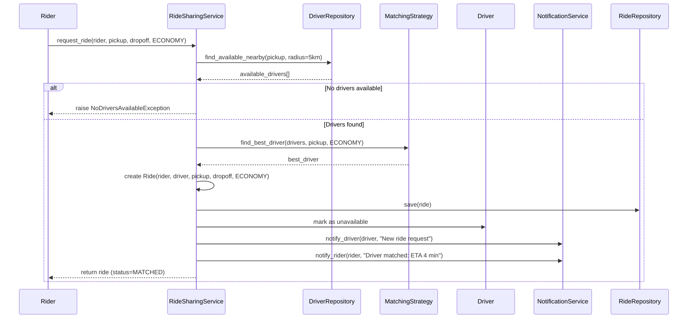
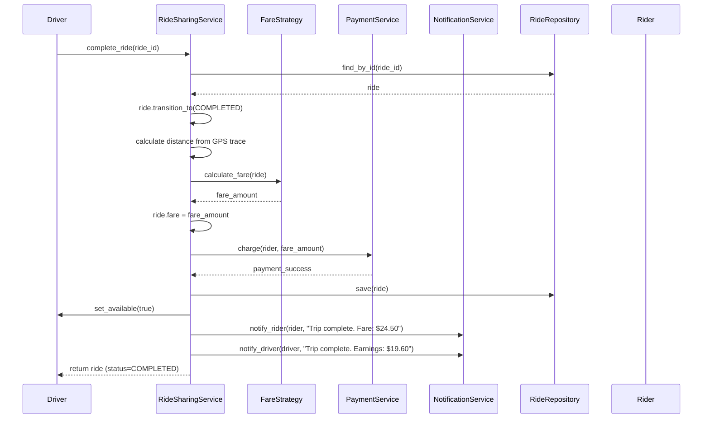
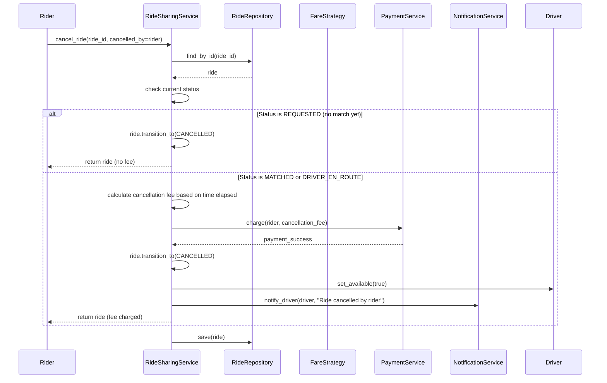
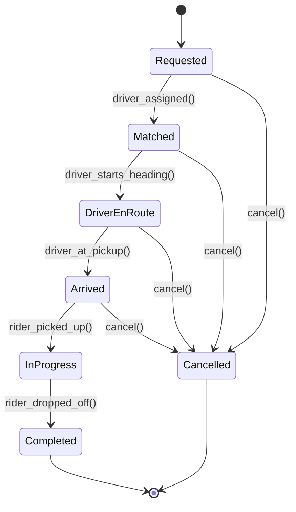
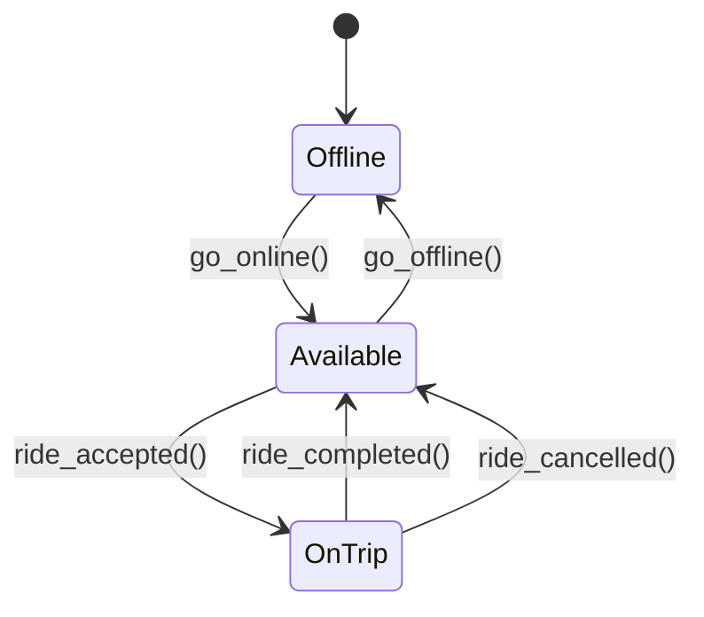

# Low-Level Design: Ride Sharing (Uber/Lyft)

> A ride-sharing platform that connects riders with nearby drivers, supports
> multiple ride types (economy, premium, pool, XL), real-time tracking, dynamic
> fare calculation with surge pricing, and a mutual rating system. This is a
> high-frequency LLD interview question that tests Strategy, Observer, State,
> and Factory patterns together.

---

## 1. Requirements

### 1.1 Functional Requirements

- **FR-1:** Rider requests a ride by specifying pickup location, destination, and ride type.
- **FR-2:** System matches the rider with the best available driver based on a pluggable matching strategy.
- **FR-3:** Driver can accept or decline a ride request; on decline, the system re-matches.
- **FR-4:** Real-time location tracking for both rider and driver during an active ride.
- **FR-5:** Fare is calculated based on distance, duration, ride type, and surge multiplier.
- **FR-6:** Support multiple ride types: Economy, Premium, Pool, and XL.
- **FR-7:** Both riders and drivers can rate each other after ride completion (1-5 stars).
- **FR-8:** Trip history is maintained for both riders and drivers.
- **FR-9:** Cancellation is supported with fee rules based on ride state.
- **FR-10:** Payment is processed automatically upon ride completion.

### 1.2 Constraints & Assumptions

- The system runs as a single process (no distributed concerns).
- Concurrency model: multi-threaded -- multiple ride requests can be processed simultaneously.
- Persistence: in-memory (interview scope); swappable via Repository pattern.
- Expected scale: hundreds of concurrent ride requests, thousands of active drivers.
- Each driver can have at most one active ride at a time (except Pool, max 3 riders).
- Location is represented as (latitude, longitude) coordinates.
- Surge pricing is determined by demand-to-supply ratio in a geographic zone.

> **Guidance:** In the interview, start by asking: "Do we need to support scheduled
> rides? Is carpooling (pool) in scope? Should we handle payments in detail or
> treat it as an external service?" Scope it down quickly.

---

## 2. Use Cases

| #    | Actor  | Action                                | Outcome                                          |
|------|--------|---------------------------------------|--------------------------------------------------|
| UC-1 | Rider  | Requests a ride                       | System finds nearby drivers, matches best one     |
| UC-2 | Driver | Accepts or declines a ride request    | Ride is confirmed or re-matched to another driver |
| UC-3 | System | Tracks driver and rider locations     | Real-time location updates sent to both parties   |
| UC-4 | System | Calculates fare on ride completion    | Fare computed, payment processed automatically    |
| UC-5 | Rider  | Cancels a ride                        | Ride cancelled, cancellation fee applied if applicable |
| UC-6 | Rider/Driver | Rates the other party after trip | Rating stored, average rating updated             |

> **Guidance:** Keep it to 4-6 use cases. Each one maps to a method or flow later.

---

## 3. Core Classes & Interfaces

### 3.1 Class Diagram

```mermaid
classDiagram
    class RideSharingService {
        -ride_repo: RideRepository
        -driver_repo: DriverRepository
        -fare_strategy: FareStrategy
        -matching_strategy: MatchingStrategy
        -notification_service: NotificationService
        -payment_service: PaymentService
        +request_ride(rider, pickup, dropoff, ride_type) Ride
        +accept_ride(ride_id, driver_id) Ride
        +decline_ride(ride_id, driver_id) Ride
        +start_ride(ride_id) Ride
        +complete_ride(ride_id) Ride
        +cancel_ride(ride_id, cancelled_by) Ride
        +rate_ride(ride_id, rater_id, score, comment) Rating
        +update_driver_location(driver_id, location) void
        +get_ride_history(user_id) List~Ride~
    }

    class User {
        <<abstract>>
        #user_id: str
        #name: str
        #email: str
        #phone: str
        #average_rating: float
        #ratings: List~Rating~
        +get_average_rating() float
        +add_rating(rating: Rating) void
    }

    class Rider {
        -payment_method: PaymentMethod
        -ride_history: List~Ride~
        +get_ride_history() List~Ride~
    }

    class Driver {
        -license_number: str
        -vehicle: Vehicle
        -current_location: Location
        -is_available: bool
        -ride_history: List~Ride~
        +set_location(location: Location) void
        +set_available(available: bool) void
        +is_available() bool
    }

    class Vehicle {
        -vehicle_id: str
        -license_plate: str
        -model: str
        -color: str
        -capacity: int
        -vehicle_type: VehicleType
    }

    class Location {
        -latitude: float
        -longitude: float
        +distance_to(other: Location) float
        +__eq__(other: Location) bool
    }

    class Ride {
        -ride_id: str
        -rider: Rider
        -driver: Driver
        -pickup: Location
        -dropoff: Location
        -ride_type: RideType
        -status: RideStatus
        -requested_at: datetime
        -started_at: datetime
        -completed_at: datetime
        -fare: float
        -distance_km: float
        -driver_rating: Rating
        -rider_rating: Rating
        +get_duration_minutes() float
        +transition_to(new_status: RideStatus) void
    }

    class Rating {
        -rating_id: str
        -ride_id: str
        -rater_id: str
        -ratee_id: str
        -score: int
        -comment: str
        -created_at: datetime
    }

    class RideType {
        <<enumeration>>
        ECONOMY
        PREMIUM
        POOL
        XL
    }

    class RideStatus {
        <<enumeration>>
        REQUESTED
        MATCHED
        DRIVER_EN_ROUTE
        ARRIVED
        IN_PROGRESS
        COMPLETED
        CANCELLED
    }

    class FareStrategy {
        <<interface>>
        +calculate_fare(ride: Ride) float
    }

    class StandardFare {
        -base_fare: float
        -per_km_rate: float
        -per_minute_rate: float
        +calculate_fare(ride: Ride) float
    }

    class SurgeFare {
        -base_strategy: FareStrategy
        -surge_multiplier: float
        +calculate_fare(ride: Ride) float
    }

    class PoolFare {
        -base_strategy: FareStrategy
        -discount_factor: float
        +calculate_fare(ride: Ride) float
    }

    class FlatRateFare {
        -flat_rate: float
        +calculate_fare(ride: Ride) float
    }

    class MatchingStrategy {
        <<interface>>
        +find_best_driver(drivers: List~Driver~, pickup: Location, ride_type: RideType) Driver
    }

    class NearestDriverStrategy {
        +find_best_driver(drivers: List~Driver~, pickup: Location, ride_type: RideType) Driver
    }

    class BestRatedStrategy {
        -min_rating: float
        +find_best_driver(drivers: List~Driver~, pickup: Location, ride_type: RideType) Driver
    }

    class OptimalETAStrategy {
        -max_eta_minutes: float
        +find_best_driver(drivers: List~Driver~, pickup: Location, ride_type: RideType) Driver
    }

    class NotificationService {
        <<interface>>
        +notify_rider(rider: Rider, message: str) void
        +notify_driver(driver: Driver, message: str) void
    }

    class PaymentService {
        <<interface>>
        +charge(rider: Rider, amount: float) bool
        +refund(rider: Rider, amount: float) bool
    }

    class RideRepository {
        <<interface>>
        +save(ride: Ride) void
        +find_by_id(ride_id: str) Ride
        +find_by_rider(rider_id: str) List~Ride~
        +find_by_driver(driver_id: str) List~Ride~
    }

    class DriverRepository {
        <<interface>>
        +save(driver: Driver) void
        +find_by_id(driver_id: str) Driver
        +find_available_nearby(location: Location, radius_km: float) List~Driver~
    }

    Rider --|> User : extends
    Driver --|> User : extends

    RideSharingService --> RideRepository : uses
    RideSharingService --> DriverRepository : uses
    RideSharingService --> FareStrategy : uses
    RideSharingService --> MatchingStrategy : uses
    RideSharingService --> NotificationService : uses
    RideSharingService --> PaymentService : uses

    Ride --> Rider : has
    Ride --> Driver : has
    Ride --> Location : pickup/dropoff
    Ride --> RideType : has
    Ride --> RideStatus : has
    Ride --> Rating : has

    Driver --> Vehicle : drives
    Driver --> Location : current_location

    StandardFare ..|> FareStrategy : implements
    SurgeFare ..|> FareStrategy : implements
    PoolFare ..|> FareStrategy : implements
    FlatRateFare ..|> FareStrategy : implements

    NearestDriverStrategy ..|> MatchingStrategy : implements
    BestRatedStrategy ..|> MatchingStrategy : implements
    OptimalETAStrategy ..|> MatchingStrategy : implements

    SurgeFare --> FareStrategy : wraps (Decorator)
    PoolFare --> FareStrategy : wraps (Decorator)
```



### 3.2 Class Descriptions

| Class / Interface          | Responsibility                                                      | Pattern        |
|----------------------------|---------------------------------------------------------------------|----------------|
| `RideSharingService`       | Orchestrates ride lifecycle: request, match, track, complete, rate   | Facade         |
| `User` (abstract)          | Base class for riders and drivers; holds common fields and ratings   | --             |
| `Rider`                    | Represents a passenger; owns payment method and ride history         | --             |
| `Driver`                   | Represents a driver; tracks location, availability, and vehicle      | --             |
| `Vehicle`                  | Driver's vehicle with type, capacity, and identifying details        | Domain Model   |
| `Location`                 | Latitude/longitude pair with distance calculation                    | Value Object   |
| `Ride`                     | Core domain object; tracks the full lifecycle of a single trip       | Domain Model   |
| `Rating`                   | A score (1-5) given by one party to another after a ride             | Value Object   |
| `RideType`                 | Enum of ride categories (Economy, Premium, Pool, XL)                 | Enumeration    |
| `RideStatus`               | Enum of ride lifecycle states                                        | Enumeration    |
| `FareStrategy`             | Interface for fare calculation algorithms                            | Strategy       |
| `StandardFare`             | Base fare + per-km + per-minute calculation                          | Strategy       |
| `SurgeFare`                | Wraps a base strategy and multiplies by surge factor                 | Strategy/Decorator |
| `PoolFare`                 | Wraps a base strategy and applies pool discount                      | Strategy/Decorator |
| `FlatRateFare`             | Fixed fare regardless of distance/time (airport routes, etc.)        | Strategy       |
| `MatchingStrategy`         | Interface for driver-rider matching algorithm                        | Strategy       |
| `NearestDriverStrategy`    | Picks the closest available driver by distance                       | Strategy       |
| `BestRatedStrategy`        | Picks the highest-rated driver within a radius                       | Strategy       |
| `OptimalETAStrategy`       | Picks the driver with the lowest estimated arrival time              | Strategy       |
| `NotificationService`      | Sends real-time updates to riders and drivers                        | Observer       |
| `PaymentService`           | Processes charges and refunds                                        | --             |
| `RideRepository`           | Abstract persistence for ride entities                               | Repository     |
| `DriverRepository`         | Abstract persistence for drivers with geo-query support              | Repository     |

> **Guidance:** Favour interfaces over concrete classes at boundaries. This makes the
> design testable and satisfies the Dependency Inversion Principle.

---

## 4. Design Patterns Used

| Pattern    | Where Applied                                  | Why                                                               |
|------------|-------------------------------------------------|-------------------------------------------------------------------|
| Strategy   | `FareStrategy`, `MatchingStrategy`              | Swap fare/matching algorithms at runtime without changing callers  |
| Observer   | `NotificationService` on ride state changes     | Decouple ride lifecycle from notification side effects             |
| State      | `RideStatus` transitions in `Ride`              | Each state defines valid transitions; prevents illegal jumps       |
| Factory    | `RideFactory.create_ride()` for ride types       | Centralise ride creation with type-specific defaults              |
| Decorator  | `SurgeFare` and `PoolFare` wrapping base fare   | Layer pricing modifiers without subclass explosion                 |
| Repository | `RideRepository`, `DriverRepository`            | Abstract storage details behind an interface                       |

### 4.1 Strategy Pattern -- Fare Calculation

```
Context: Fares vary by ride type, time of day, and demand conditions.

Instead of:
    if ride_type == "economy":
        fare = base + distance * 10 + time * 2
    elif ride_type == "premium":
        fare = base + distance * 20 + time * 5
    elif surge_active:
        fare = fare * surge_multiplier

Use:
    fare = self._fare_strategy.calculate_fare(ride)

Where _fare_strategy is injected and implements FareStrategy.
SurgeFare wraps any base strategy as a Decorator:
    SurgeFare(StandardFare(), multiplier=1.8).calculate_fare(ride)

Adding a new pricing model (e.g., SubscriptionFare) requires only a new class --
zero changes to RideSharingService.
```

### 4.2 Strategy Pattern -- Driver Matching

```
Context: Different markets or ride types may prefer different matching policies.

NearestDriverStrategy: Finds the driver with the shortest straight-line distance.
    Best for: minimizing rider wait time in dense urban areas.

BestRatedStrategy: Finds the highest-rated driver within a radius.
    Best for: premium rides where quality matters more than speed.

OptimalETAStrategy: Estimates actual arrival time considering traffic/roads.
    Best for: balancing distance with real-world driving conditions.

All implement MatchingStrategy.find_best_driver() -- the RideSharingService
does not know which algorithm is running.
```

### 4.3 State Pattern -- Ride Lifecycle

```
Context: A ride moves through well-defined states with strict transition rules.

    REQUESTED -> MATCHED        (driver assigned)
    MATCHED -> DRIVER_EN_ROUTE  (driver starts heading to pickup)
    DRIVER_EN_ROUTE -> ARRIVED  (driver reaches pickup location)
    ARRIVED -> IN_PROGRESS      (rider picked up, trip begins)
    IN_PROGRESS -> COMPLETED    (rider dropped off)

    REQUESTED -> CANCELLED      (rider cancels before match -- no fee)
    MATCHED -> CANCELLED        (either party cancels -- may incur fee)
    DRIVER_EN_ROUTE -> CANCELLED (late cancel -- fee applies)

Each state transition is validated. Attempting IN_PROGRESS -> REQUESTED
raises an error. This prevents bugs like completing an already-cancelled ride.
```

### 4.4 Observer Pattern -- Notifications

```
Context: When a ride changes state, multiple things need to happen:
    1. Rider receives a push notification ("Driver is 3 min away").
    2. Driver receives route updates.
    3. Analytics logs the state change for metrics.
    4. ETA service recalculates estimated arrival.

Instead of RideSharingService calling all of these directly, it fires a
state-change event. Observers subscribe and react independently. Adding a
new observer (e.g., FraudDetectionService) requires zero changes to the
ride service.
```

> **Guidance:** Name the pattern, explain where it applies, and justify *why* it
> helps. Interviewers do not want pattern-stuffing; they want thoughtful application.

---

## 5. Key Flows

### 5.1 Ride Request & Matching Flow



### 5.2 Ride Completion & Payment Flow



### 5.3 Cancellation Flow



> **Guidance:** Draw one flow per major use case. Show method-level calls, not
> HTTP requests. Keep the focus on object interactions.

---

## 6. State Diagrams

### 6.1 Ride State Machine



### 6.2 Ride State Transition Table

| Current State    | Event                  | Next State       | Guard Condition                        |
|------------------|------------------------|------------------|----------------------------------------|
| Requested        | driver_assigned()      | Matched          | At least one available driver found     |
| Matched          | driver_starts_heading()| DriverEnRoute    | Driver accepted the ride                |
| DriverEnRoute    | driver_at_pickup()     | Arrived          | Driver within 50m of pickup location    |
| Arrived          | rider_picked_up()      | InProgress       | Rider confirms pickup                   |
| InProgress       | rider_dropped_off()    | Completed        | Driver at dropoff location              |
| Requested        | cancel()               | Cancelled        | No fee -- match not yet made            |
| Matched          | cancel()               | Cancelled        | Small fee if > 2 min after match        |
| DriverEnRoute    | cancel()               | Cancelled        | Full cancellation fee applies           |
| Arrived          | cancel()               | Cancelled        | Full cancellation fee + wait charge     |

### 6.3 Driver Availability States



### 6.4 Cancellation Fee Rules

| Ride State When Cancelled | Cancelled By | Fee                              |
|---------------------------|-------------|----------------------------------|
| Requested                 | Rider       | No fee                           |
| Matched (< 2 min)         | Rider       | No fee                           |
| Matched (>= 2 min)        | Rider       | $5 cancellation fee              |
| DriverEnRoute             | Rider       | $5 + $1/min driver wait          |
| Arrived (waiting)         | Rider       | $5 + full wait time charge       |
| Matched                   | Driver      | No fee (warning to driver)       |
| DriverEnRoute             | Driver      | No fee (strike on driver record) |

---

## 7. Code Skeleton

```python
from abc import ABC, abstractmethod
from enum import Enum
from datetime import datetime
from dataclasses import dataclass, field
from typing import List, Optional, Dict
from threading import Lock
import uuid
import math


# ── Enums ────────────────────────────────────────────────────────────

class RideType(Enum):
    ECONOMY = "ECONOMY"
    PREMIUM = "PREMIUM"
    POOL = "POOL"
    XL = "XL"


class RideStatus(Enum):
    REQUESTED = "REQUESTED"
    MATCHED = "MATCHED"
    DRIVER_EN_ROUTE = "DRIVER_EN_ROUTE"
    ARRIVED = "ARRIVED"
    IN_PROGRESS = "IN_PROGRESS"
    COMPLETED = "COMPLETED"
    CANCELLED = "CANCELLED"


class VehicleType(Enum):
    SEDAN = "SEDAN"
    SUV = "SUV"
    LUXURY = "LUXURY"
    MINI = "MINI"


class PaymentMethod(Enum):
    CREDIT_CARD = "CREDIT_CARD"
    DEBIT_CARD = "DEBIT_CARD"
    WALLET = "WALLET"
    CASH = "CASH"


# ── State Transitions ────────────────────────────────────────────────

VALID_TRANSITIONS: Dict[RideStatus, List[RideStatus]] = {
    RideStatus.REQUESTED: [RideStatus.MATCHED, RideStatus.CANCELLED],
    RideStatus.MATCHED: [RideStatus.DRIVER_EN_ROUTE, RideStatus.CANCELLED],
    RideStatus.DRIVER_EN_ROUTE: [RideStatus.ARRIVED, RideStatus.CANCELLED],
    RideStatus.ARRIVED: [RideStatus.IN_PROGRESS, RideStatus.CANCELLED],
    RideStatus.IN_PROGRESS: [RideStatus.COMPLETED],
    RideStatus.COMPLETED: [],
    RideStatus.CANCELLED: [],
}


# ── Value Objects ────────────────────────────────────────────────────

@dataclass(frozen=True)
class Location:
    latitude: float
    longitude: float

    def distance_to(self, other: "Location") -> float:
        """Haversine distance in kilometres."""
        R = 6371  # Earth radius in km
        lat1, lat2 = math.radians(self.latitude), math.radians(other.latitude)
        dlat = math.radians(other.latitude - self.latitude)
        dlon = math.radians(other.longitude - self.longitude)
        a = (math.sin(dlat / 2) ** 2
             + math.cos(lat1) * math.cos(lat2) * math.sin(dlon / 2) ** 2)
        return R * 2 * math.atan2(math.sqrt(a), math.sqrt(1 - a))


@dataclass
class Rating:
    rating_id: str = field(default_factory=lambda: str(uuid.uuid4()))
    ride_id: str = ""
    rater_id: str = ""
    ratee_id: str = ""
    score: int = 5  # 1-5
    comment: str = ""
    created_at: datetime = field(default_factory=datetime.utcnow)


# ── Domain Models ────────────────────────────────────────────────────

@dataclass
class Vehicle:
    vehicle_id: str = field(default_factory=lambda: str(uuid.uuid4()))
    license_plate: str = ""
    model: str = ""
    color: str = ""
    capacity: int = 4
    vehicle_type: VehicleType = VehicleType.SEDAN


class User(ABC):
    def __init__(self, user_id: str, name: str, email: str, phone: str):
        self._user_id = user_id
        self._name = name
        self._email = email
        self._phone = phone
        self._ratings: List[Rating] = []

    @property
    def user_id(self) -> str:
        return self._user_id

    @property
    def name(self) -> str:
        return self._name

    def get_average_rating(self) -> float:
        if not self._ratings:
            return 5.0  # Default rating for new users
        return sum(r.score for r in self._ratings) / len(self._ratings)

    def add_rating(self, rating: Rating) -> None:
        self._ratings.append(rating)


class Rider(User):
    def __init__(self, user_id: str, name: str, email: str, phone: str,
                 payment_method: PaymentMethod = PaymentMethod.CREDIT_CARD):
        super().__init__(user_id, name, email, phone)
        self._payment_method = payment_method
        self._ride_history: List[str] = []  # ride IDs

    @property
    def payment_method(self) -> PaymentMethod:
        return self._payment_method

    def add_to_history(self, ride_id: str) -> None:
        self._ride_history.append(ride_id)


class Driver(User):
    def __init__(self, user_id: str, name: str, email: str, phone: str,
                 license_number: str, vehicle: Vehicle):
        super().__init__(user_id, name, email, phone)
        self._license_number = license_number
        self._vehicle = vehicle
        self._current_location: Optional[Location] = None
        self._is_available = False
        self._ride_history: List[str] = []
        self._lock = Lock()

    @property
    def vehicle(self) -> Vehicle:
        return self._vehicle

    @property
    def current_location(self) -> Optional[Location]:
        return self._current_location

    def set_location(self, location: Location) -> None:
        self._current_location = location

    def is_available(self) -> bool:
        return self._is_available and self._current_location is not None

    def set_available(self, available: bool) -> None:
        with self._lock:
            self._is_available = available

    def add_to_history(self, ride_id: str) -> None:
        self._ride_history.append(ride_id)


# ── Ride ─────────────────────────────────────────────────────────────

@dataclass
class Ride:
    ride_id: str = field(default_factory=lambda: str(uuid.uuid4()))
    rider: Rider = field(default=None)
    driver: Optional[Driver] = None
    pickup: Location = field(default=None)
    dropoff: Location = field(default=None)
    ride_type: RideType = RideType.ECONOMY
    status: RideStatus = RideStatus.REQUESTED
    requested_at: datetime = field(default_factory=datetime.utcnow)
    matched_at: Optional[datetime] = None
    started_at: Optional[datetime] = None
    completed_at: Optional[datetime] = None
    fare: float = 0.0
    distance_km: float = 0.0
    driver_rating: Optional[Rating] = None
    rider_rating: Optional[Rating] = None

    def transition_to(self, new_status: RideStatus) -> None:
        if new_status not in VALID_TRANSITIONS[self.status]:
            raise ValueError(
                f"Invalid transition: {self.status.value} -> {new_status.value}"
            )
        self.status = new_status
        if new_status == RideStatus.MATCHED:
            self.matched_at = datetime.utcnow()
        elif new_status == RideStatus.IN_PROGRESS:
            self.started_at = datetime.utcnow()
        elif new_status == RideStatus.COMPLETED:
            self.completed_at = datetime.utcnow()

    def get_duration_minutes(self) -> float:
        if not self.started_at:
            return 0.0
        end = self.completed_at or datetime.utcnow()
        return (end - self.started_at).total_seconds() / 60


# ── Fare Strategies ──────────────────────────────────────────────────

class FareStrategy(ABC):
    @abstractmethod
    def calculate_fare(self, ride: Ride) -> float:
        ...


class StandardFare(FareStrategy):
    """Base fare + per-km + per-minute. Rates vary by ride type."""

    RATES = {
        RideType.ECONOMY: {"base": 2.0, "per_km": 1.0, "per_min": 0.15},
        RideType.PREMIUM: {"base": 5.0, "per_km": 2.5, "per_min": 0.30},
        RideType.POOL:    {"base": 1.5, "per_km": 0.7, "per_min": 0.10},
        RideType.XL:      {"base": 4.0, "per_km": 2.0, "per_min": 0.25},
    }

    def calculate_fare(self, ride: Ride) -> float:
        rates = self.RATES.get(ride.ride_type, self.RATES[RideType.ECONOMY])
        distance_fare = ride.distance_km * rates["per_km"]
        time_fare = ride.get_duration_minutes() * rates["per_min"]
        total = rates["base"] + distance_fare + time_fare
        return round(max(total, rates["base"]), 2)  # Minimum is the base fare


class SurgeFare(FareStrategy):
    """Decorator: wraps any FareStrategy and applies a surge multiplier."""

    def __init__(self, base_strategy: FareStrategy, surge_multiplier: float):
        self._base_strategy = base_strategy
        self._surge_multiplier = max(surge_multiplier, 1.0)

    def calculate_fare(self, ride: Ride) -> float:
        base_fare = self._base_strategy.calculate_fare(ride)
        return round(base_fare * self._surge_multiplier, 2)


class PoolFare(FareStrategy):
    """Decorator: wraps a base strategy and applies a pool discount."""

    def __init__(self, base_strategy: FareStrategy, discount_factor: float = 0.6):
        self._base_strategy = base_strategy
        self._discount_factor = discount_factor

    def calculate_fare(self, ride: Ride) -> float:
        base_fare = self._base_strategy.calculate_fare(ride)
        return round(base_fare * self._discount_factor, 2)


class FlatRateFare(FareStrategy):
    """Fixed price for predefined routes (e.g., airport shuttles)."""

    def __init__(self, flat_rate: float = 25.0):
        self._flat_rate = flat_rate

    def calculate_fare(self, ride: Ride) -> float:
        return self._flat_rate


# ── Matching Strategies ──────────────────────────────────────────────

class MatchingStrategy(ABC):
    @abstractmethod
    def find_best_driver(
        self, drivers: List[Driver], pickup: Location, ride_type: RideType
    ) -> Optional[Driver]:
        ...


class NearestDriverStrategy(MatchingStrategy):
    """Pick the closest available driver by straight-line distance."""

    def find_best_driver(
        self, drivers: List[Driver], pickup: Location, ride_type: RideType
    ) -> Optional[Driver]:
        available = [d for d in drivers if d.is_available()]
        if not available:
            return None
        return min(available, key=lambda d: d.current_location.distance_to(pickup))


class BestRatedStrategy(MatchingStrategy):
    """Pick the highest-rated available driver within range."""

    def __init__(self, min_rating: float = 4.0):
        self._min_rating = min_rating

    def find_best_driver(
        self, drivers: List[Driver], pickup: Location, ride_type: RideType
    ) -> Optional[Driver]:
        qualified = [
            d for d in drivers
            if d.is_available() and d.get_average_rating() >= self._min_rating
        ]
        if not qualified:
            return None
        return max(qualified, key=lambda d: d.get_average_rating())


class OptimalETAStrategy(MatchingStrategy):
    """Pick the driver with the lowest estimated time of arrival.
    In a real system this would call a routing service; here we
    approximate ETA as distance / average_speed."""

    AVG_SPEED_KMH = 30  # Average city driving speed

    def __init__(self, max_eta_minutes: float = 15.0):
        self._max_eta_minutes = max_eta_minutes

    def find_best_driver(
        self, drivers: List[Driver], pickup: Location, ride_type: RideType
    ) -> Optional[Driver]:
        candidates = []
        for driver in drivers:
            if not driver.is_available():
                continue
            dist = driver.current_location.distance_to(pickup)
            eta_minutes = (dist / self.AVG_SPEED_KMH) * 60
            if eta_minutes <= self._max_eta_minutes:
                candidates.append((driver, eta_minutes))
        if not candidates:
            return None
        return min(candidates, key=lambda x: x[1])[0]


# ── Observer / Notification ──────────────────────────────────────────

class NotificationService(ABC):
    @abstractmethod
    def notify_rider(self, rider: Rider, message: str) -> None: ...

    @abstractmethod
    def notify_driver(self, driver: Driver, message: str) -> None: ...


class ConsoleNotificationService(NotificationService):
    def notify_rider(self, rider: Rider, message: str) -> None:
        print(f"[RIDER {rider.name}] {message}")

    def notify_driver(self, driver: Driver, message: str) -> None:
        print(f"[DRIVER {driver.name}] {message}")


# ── Payment ──────────────────────────────────────────────────────────

class PaymentService(ABC):
    @abstractmethod
    def charge(self, rider: Rider, amount: float) -> bool: ...

    @abstractmethod
    def refund(self, rider: Rider, amount: float) -> bool: ...


class InMemoryPaymentService(PaymentService):
    def charge(self, rider: Rider, amount: float) -> bool:
        print(f"[PAYMENT] Charged ${amount:.2f} to {rider.name}")
        return True

    def refund(self, rider: Rider, amount: float) -> bool:
        print(f"[PAYMENT] Refunded ${amount:.2f} to {rider.name}")
        return True


# ── Repositories ─────────────────────────────────────────────────────

class RideRepository(ABC):
    @abstractmethod
    def save(self, ride: Ride) -> None: ...

    @abstractmethod
    def find_by_id(self, ride_id: str) -> Optional[Ride]: ...

    @abstractmethod
    def find_by_rider(self, rider_id: str) -> List[Ride]: ...

    @abstractmethod
    def find_by_driver(self, driver_id: str) -> List[Ride]: ...


class InMemoryRideRepository(RideRepository):
    def __init__(self):
        self._store: Dict[str, Ride] = {}

    def save(self, ride: Ride) -> None:
        self._store[ride.ride_id] = ride

    def find_by_id(self, ride_id: str) -> Optional[Ride]:
        return self._store.get(ride_id)

    def find_by_rider(self, rider_id: str) -> List[Ride]:
        return [r for r in self._store.values() if r.rider.user_id == rider_id]

    def find_by_driver(self, driver_id: str) -> List[Ride]:
        return [r for r in self._store.values()
                if r.driver and r.driver.user_id == driver_id]


class DriverRepository(ABC):
    @abstractmethod
    def save(self, driver: Driver) -> None: ...

    @abstractmethod
    def find_by_id(self, driver_id: str) -> Optional[Driver]: ...

    @abstractmethod
    def find_available_nearby(self, location: Location, radius_km: float) -> List[Driver]: ...


class InMemoryDriverRepository(DriverRepository):
    def __init__(self):
        self._store: Dict[str, Driver] = {}

    def save(self, driver: Driver) -> None:
        self._store[driver.user_id] = driver

    def find_by_id(self, driver_id: str) -> Optional[Driver]:
        return self._store.get(driver_id)

    def find_available_nearby(self, location: Location, radius_km: float) -> List[Driver]:
        return [
            d for d in self._store.values()
            if d.is_available()
            and d.current_location is not None
            and d.current_location.distance_to(location) <= radius_km
        ]


# ── Ride Factory ─────────────────────────────────────────────────────

class RideFactory:
    """Creates rides with type-specific default configurations."""

    @staticmethod
    def create_ride(rider: Rider, pickup: Location, dropoff: Location,
                    ride_type: RideType) -> Ride:
        return Ride(
            rider=rider,
            pickup=pickup,
            dropoff=dropoff,
            ride_type=ride_type,
            distance_km=pickup.distance_to(dropoff),
        )


# ── Service (Facade) ─────────────────────────────────────────────────

class RideSharingService:
    SEARCH_RADIUS_KM = 5.0
    CANCELLATION_FEE = 5.0

    def __init__(
        self,
        ride_repo: RideRepository,
        driver_repo: DriverRepository,
        fare_strategy: FareStrategy,
        matching_strategy: MatchingStrategy,
        notification_service: NotificationService,
        payment_service: PaymentService,
    ):
        self._ride_repo = ride_repo
        self._driver_repo = driver_repo
        self._fare_strategy = fare_strategy
        self._matching_strategy = matching_strategy
        self._notifier = notification_service
        self._payment = payment_service

    # ── Core Operations ──────────────────────────────────────────

    def request_ride(self, rider: Rider, pickup: Location,
                     dropoff: Location, ride_type: RideType) -> Ride:
        nearby = self._driver_repo.find_available_nearby(
            pickup, self.SEARCH_RADIUS_KM
        )
        if not nearby:
            raise RuntimeError("No drivers available nearby")

        driver = self._matching_strategy.find_best_driver(nearby, pickup, ride_type)
        if driver is None:
            raise RuntimeError("No suitable driver found")

        ride = RideFactory.create_ride(rider, pickup, dropoff, ride_type)
        ride.driver = driver
        ride.transition_to(RideStatus.MATCHED)
        driver.set_available(False)

        self._ride_repo.save(ride)
        rider.add_to_history(ride.ride_id)
        driver.add_to_history(ride.ride_id)

        self._notifier.notify_driver(driver, f"New ride request from {rider.name}")
        self._notifier.notify_rider(rider, f"Driver {driver.name} is on the way")
        return ride

    def start_ride(self, ride_id: str) -> Ride:
        ride = self._get_ride(ride_id)
        ride.transition_to(RideStatus.DRIVER_EN_ROUTE)
        self._notifier.notify_rider(ride.rider, "Driver is heading to your pickup")
        self._ride_repo.save(ride)
        return ride

    def driver_arrived(self, ride_id: str) -> Ride:
        ride = self._get_ride(ride_id)
        ride.transition_to(RideStatus.ARRIVED)
        self._notifier.notify_rider(ride.rider, "Your driver has arrived")
        self._ride_repo.save(ride)
        return ride

    def pickup_rider(self, ride_id: str) -> Ride:
        ride = self._get_ride(ride_id)
        ride.transition_to(RideStatus.IN_PROGRESS)
        self._notifier.notify_rider(ride.rider, "Trip started")
        self._ride_repo.save(ride)
        return ride

    def complete_ride(self, ride_id: str) -> Ride:
        ride = self._get_ride(ride_id)
        ride.transition_to(RideStatus.COMPLETED)
        ride.fare = self._fare_strategy.calculate_fare(ride)
        self._payment.charge(ride.rider, ride.fare)
        ride.driver.set_available(True)

        self._ride_repo.save(ride)
        self._notifier.notify_rider(ride.rider, f"Trip complete. Fare: ${ride.fare:.2f}")
        self._notifier.notify_driver(ride.driver, f"Trip complete. Earned: ${ride.fare:.2f}")
        return ride

    def cancel_ride(self, ride_id: str, cancelled_by: str) -> Ride:
        ride = self._get_ride(ride_id)
        fee = self._calculate_cancellation_fee(ride)
        ride.transition_to(RideStatus.CANCELLED)

        if fee > 0 and cancelled_by == ride.rider.user_id:
            self._payment.charge(ride.rider, fee)

        if ride.driver:
            ride.driver.set_available(True)
            self._notifier.notify_driver(ride.driver, "Ride has been cancelled")

        self._notifier.notify_rider(ride.rider, f"Ride cancelled. Fee: ${fee:.2f}")
        self._ride_repo.save(ride)
        return ride

    def rate_ride(self, ride_id: str, rater_id: str, score: int,
                  comment: str = "") -> Rating:
        if not 1 <= score <= 5:
            raise ValueError("Rating must be between 1 and 5")
        ride = self._get_ride(ride_id)
        if ride.status != RideStatus.COMPLETED:
            raise ValueError("Can only rate completed rides")

        rating = Rating(ride_id=ride_id, rater_id=rater_id, score=score, comment=comment)

        if rater_id == ride.rider.user_id:
            rating.ratee_id = ride.driver.user_id
            ride.driver_rating = rating
            ride.driver.add_rating(rating)
        elif rater_id == ride.driver.user_id:
            rating.ratee_id = ride.rider.user_id
            ride.rider_rating = rating
            ride.rider.add_rating(rating)
        else:
            raise ValueError("Rater must be the rider or driver of this ride")

        self._ride_repo.save(ride)
        return rating

    def update_driver_location(self, driver_id: str, location: Location) -> None:
        driver = self._driver_repo.find_by_id(driver_id)
        if driver is None:
            raise KeyError(f"Driver {driver_id} not found")
        driver.set_location(location)
        self._driver_repo.save(driver)

    def get_ride_history(self, user_id: str) -> List[Ride]:
        rider_rides = self._ride_repo.find_by_rider(user_id)
        driver_rides = self._ride_repo.find_by_driver(user_id)
        all_rides = rider_rides + driver_rides
        return sorted(all_rides, key=lambda r: r.requested_at, reverse=True)

    def set_fare_strategy(self, strategy: FareStrategy) -> None:
        self._fare_strategy = strategy

    def set_matching_strategy(self, strategy: MatchingStrategy) -> None:
        self._matching_strategy = strategy

    # ── Private Helpers ──────────────────────────────────────────

    def _get_ride(self, ride_id: str) -> Ride:
        ride = self._ride_repo.find_by_id(ride_id)
        if ride is None:
            raise KeyError(f"Ride {ride_id} not found")
        return ride

    def _calculate_cancellation_fee(self, ride: Ride) -> float:
        if ride.status == RideStatus.REQUESTED:
            return 0.0  # No fee before matching
        if ride.status == RideStatus.MATCHED:
            elapsed = (datetime.utcnow() - ride.matched_at).total_seconds()
            return self.CANCELLATION_FEE if elapsed > 120 else 0.0  # 2 min grace
        # DRIVER_EN_ROUTE or ARRIVED -- full cancellation fee
        return self.CANCELLATION_FEE
```

> **Guidance:** In an interview, write the class signatures and key methods first.
> Fill in method bodies only for the most interesting logic (state transitions,
> fare calculation, matching). Skip boilerplate getters/setters.

---

## 8. Extensibility & Edge Cases

### 8.1 Extensibility Checklist

| Change Request                          | How the Design Handles It                              |
|-----------------------------------------|--------------------------------------------------------|
| Add scheduled/future rides              | Add `scheduled_at` field to Ride; new SCHEDULED state before REQUESTED; SchedulerService triggers ride at time |
| Support multi-stop rides                | Add `waypoints: List[Location]` to Ride; update distance calculation to sum segments |
| Pool ride matching (shared rides)       | Extend matching strategy to group riders with similar routes; allow Driver to hold multiple active rides |
| Driver incentives / bonuses             | Add `IncentiveStrategy` interface; apply bonus after fare calculation; keeps core logic unchanged |
| Ride type expansion (e.g., AUTO, BIKE)  | Add new `RideType` enum value; add rates to `StandardFare.RATES`; no other changes needed |
| Surge pricing by zone                   | Inject `SurgeCalculator` that determines multiplier from zone/demand; wrap base strategy with `SurgeFare` |
| Switch from in-memory to DB storage     | Implement `RideRepository` and `DriverRepository` with a DB driver |
| Add ETA prediction                      | Add `ETAService` that uses routing API; called after matching to show rider wait time |
| Promo codes and discounts               | Add `PromoCodeFare` decorator wrapping base strategy; applies discount if code is valid |

### 8.2 Edge Cases to Address

- **No drivers available:** Raise a clear error; let the client retry or expand search radius.
- **Driver declines after match:** Re-enter matching with remaining drivers; update ride status back to REQUESTED (or add REMATCHING state).
- **Concurrent ride requests for same driver:** Thread-safe `set_available()` with locking prevents double-assignment.
- **GPS drift / inaccurate location:** Use a tolerance threshold (e.g., 100m) for arrival detection rather than exact match.
- **Ride in progress but app crashes:** Persist ride state; on reconnect, resume from last known state.
- **Rating abuse:** Cap rating changes; require ride completion; one rating per party per ride.
- **Surge multiplier boundaries:** Cap surge at a maximum (e.g., 3x) to prevent extreme fares.
- **Payment failure after ride:** Queue for retry; do not mark ride as unpaid until retries exhausted.

> **Guidance:** Mentioning edge cases proactively signals senior-level thinking.
> You do not need to solve all of them, but you should acknowledge them.

---

## 9. Interview Tips

### What Interviewers Look For

1. **SOLID principles** -- Is each class single-responsibility? Are interfaces lean?
2. **Design patterns** -- Are Strategy, Observer, State, and Factory applied where they genuinely help?
3. **Extensibility** -- Can the design accommodate surge pricing, new ride types, or pool matching with minimal changes?
4. **Code clarity** -- Are names meaningful? Is the Ride lifecycle easy to follow?
5. **Trade-off awareness** -- Can you explain why you chose composition (SurgeFare wrapping StandardFare) over inheritance?

### Approach for a 45-Minute LLD Round

1. **Minutes 0-5:** Clarify requirements -- ride types in scope, pool complexity, payment detail level.
2. **Minutes 5-15:** Draw the class diagram -- focus on Ride, Driver, Rider, and the two Strategy interfaces.
3. **Minutes 15-25:** Walk through the ride request flow and the state diagram for Ride.
4. **Minutes 25-40:** Write the code skeleton -- fare strategies, matching strategies, and the service facade.
5. **Minutes 40-45:** Discuss extensibility (scheduled rides, pool matching) and edge cases (concurrent requests, surge caps).

### Common Follow-up Questions

- "How would you add surge pricing without modifying existing fare classes?" -- Use the Decorator pattern with SurgeFare.
- "How would you handle pool rides where multiple riders share one vehicle?" -- Extend matching to group riders by route similarity; allow Driver to hold multiple concurrent Rides.
- "What if the driver goes offline mid-trip?" -- Ride stays IN_PROGRESS; on reconnect, resume from persisted state; alert support after timeout.
- "How would you unit test the matching strategy?" -- Inject mock DriverRepository; verify the strategy picks the correct driver for given positions.
- "What happens under concurrent ride requests?" -- Locking on Driver.set_available() prevents two rides from claiming the same driver.
- "How would you support tipping?" -- Add a TipService; called after rating; updates fare and driver earnings post-completion.

### Common Pitfalls

- Drawing a database schema instead of an object model (tables are not classes).
- Hardcoding fare logic inside the Ride class instead of extracting a Strategy.
- Using a single monolithic if-elif for ride types instead of polymorphism.
- Forgetting state validation -- allowing impossible transitions like COMPLETED to REQUESTED.
- Not separating matching from the service (matching logic embedded in the facade).
- Over-engineering pool rides when the interviewer only asked about basic ride flow.
- Skipping the Observer pattern -- directly coupling notifications into every method.

---

> **Checklist before finishing your design:**
> - [x] Requirements clarified and scoped (ride types, matching, fare, rating).
> - [x] Class diagram drawn with relationships (composition, inheritance, strategy injection).
> - [x] Design patterns identified and justified (Strategy, Observer, State, Factory, Decorator).
> - [x] State diagram for ride lifecycle with transition table.
> - [x] Sequence diagrams for ride request, completion, and cancellation flows.
> - [x] Code skeleton covers fare calculation, matching, state transitions, and service facade.
> - [x] Edge cases acknowledged (concurrency, GPS drift, payment failure, surge caps).
> - [x] Extensibility demonstrated (scheduled rides, pool, multi-stop, incentives).
