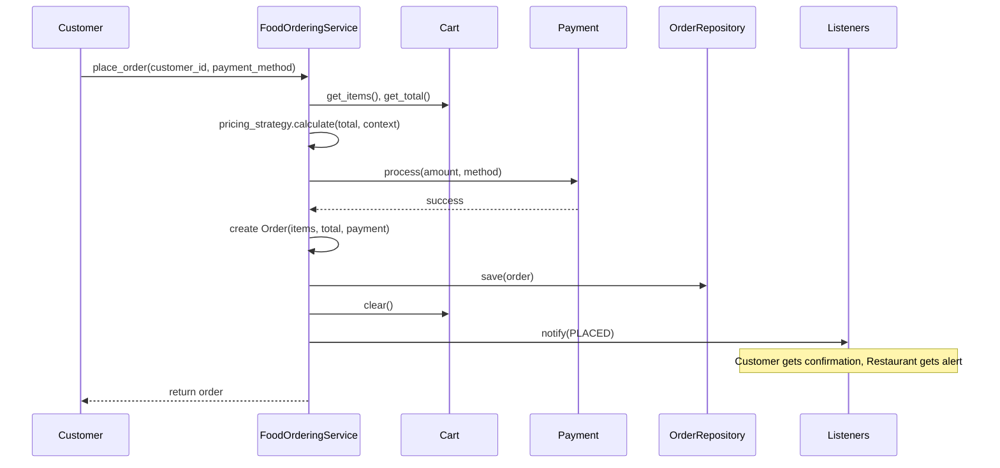
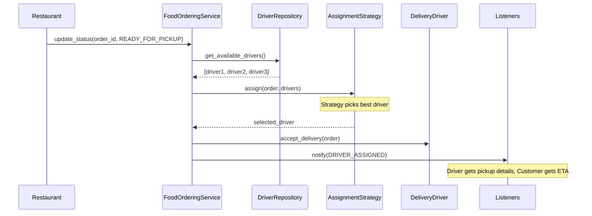
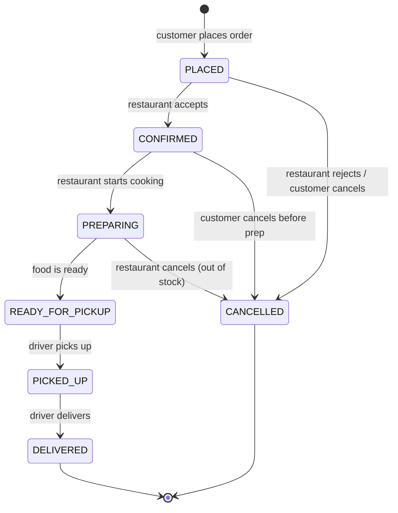

# Low-Level Design: Food Ordering System

> A food ordering and delivery platform (like Swiggy/Zomato) that lets customers
> browse restaurants, build carts, place orders, and track deliveries in real-time.
> This is a rich LLD problem that exercises Strategy, Observer, State, and Facade
> patterns all in one design.

---

## 1. Requirements

### 1.1 Functional Requirements

- **FR-1:** Browse and search restaurants by name, cuisine, or location.
- **FR-2:** View a restaurant's menu with item details, prices, and availability.
- **FR-3:** Add/remove items to a cart (scoped to a single restaurant at a time).
- **FR-4:** Place an order from the cart with a selected payment method.
- **FR-5:** Track order status in real-time (placed through delivered).
- **FR-6:** Assign a delivery driver via a pluggable assignment strategy.
- **FR-7:** Allow restaurants to accept/reject orders and update preparation status.
- **FR-8:** Maintain order history for customers, restaurants, and drivers.
- **FR-9:** Rate and review restaurants and delivery drivers after delivery.
- **FR-10:** Notify all stakeholders on every status change.

### 1.2 Constraints & Assumptions

- Single process, multi-threaded -- multiple orders placed and tracked simultaneously.
- Persistence: in-memory (interview scope); swappable via Repository pattern.
- Cart holds items from one restaurant at a time; adding from another clears it.
- Delivery area restricted -- customers only see restaurants within a configurable radius.
- Each order fulfilled by exactly one driver. Payment processed at order placement.

> **Guidance:** Ask: "Do we support multiple restaurants in one order? Scheduled
> orders? Surge pricing?" Scope it down to single-restaurant, immediate orders first.

---

## 2. Use Cases

| #    | Actor      | Action                              | Outcome                                              |
|------|------------|-------------------------------------|------------------------------------------------------|
| UC-1 | Customer   | Searches for restaurants            | Filtered list within delivery area                   |
| UC-2 | Customer   | Browses menu, adds items to cart    | Cart updated with items and quantities               |
| UC-3 | Customer   | Places an order                     | Order created, payment processed, restaurant notified|
| UC-4 | Customer   | Tracks order status                 | Real-time status from placed through delivered       |
| UC-5 | Restaurant | Accepts/rejects order               | Order confirmed or cancelled, customer notified      |
| UC-6 | System     | Assigns delivery driver             | Nearest/least-busy driver assigned, driver notified  |
| UC-7 | Driver     | Picks up and delivers order         | Status moves through PICKED_UP to DELIVERED          |
| UC-8 | Customer   | Rates restaurant and driver         | Rating stored, averages updated                      |

---

## 3. Core Classes & Interfaces

### 3.1 Class Diagram

```mermaid
classDiagram
    class Customer {
        -id: str
        -name: str
        -cart: Cart
        -order_history: List~Order~
    }
    class Restaurant {
        -id: str
        -name: str
        -address: Address
        -menu: Dict~str,MenuItem~
        -avg_rating: float
        +accept_order(order_id) void
        +is_within_radius(addr, radius_km) bool
    }
    class DeliveryDriver {
        -id: str
        -current_location: Address
        -is_available: bool
        -completed_deliveries: int
        +accept_delivery(order_id) void
        +complete_delivery() void
    }
    class MenuItem {
        -id: str
        -name: str
        -price: float
        -is_available: bool
    }
    class Cart {
        -restaurant_id: str
        -items: List~CartItem~
        +add_item(item, qty) void
        +get_total() float
        +clear() void
    }
    class Order {
        -id: str
        -customer_id: str
        -restaurant_id: str
        -driver_id: str
        -status: OrderStatus
        -total_amount: float
        -payment: Payment
        +transition_to(new_status) void
        +assign_driver(driver_id) void
    }
    class OrderStatus {
        <<enumeration>>
        PLACED / CONFIRMED / PREPARING
        READY_FOR_PICKUP / PICKED_UP
        DELIVERED / CANCELLED
    }
    class Payment {
        -amount: float
        -method: PaymentMethod
        +process() bool
        +refund() bool
    }
    class DeliveryAssignmentStrategy {
        <<interface>>
        +assign(order, drivers) DeliveryDriver
    }
    class NearestDriverStrategy { }
    class LeastBusyDriverStrategy { }
    class OptimalRouteStrategy { }
    class PricingStrategy {
        <<interface>>
        +calculate(base_amount, ctx) float
    }
    class BasePricingStrategy { }
    class SurgePricingStrategy { }
    class PromotionalPricingStrategy { }
    class OrderEventListener {
        <<interface>>
        +on_order_event(event) void
    }
    class CustomerNotifier { }
    class RestaurantNotifier { }
    class DriverNotifier { }
    class FoodOrderingService {
        -assignment_strategy: DeliveryAssignmentStrategy
        -pricing_strategy: PricingStrategy
        -listeners: List~OrderEventListener~
        +search_restaurants(location, query) List~Restaurant~
        +add_to_cart(customer_id, item_id, qty) Cart
        +place_order(customer_id, payment_method) Order
        +update_order_status(order_id, status) Order
        +assign_driver(order_id) Order
        +rate(customer_id, target_id, score) void
    }

    Customer --> Cart
    Restaurant --> MenuItem
    Cart --> MenuItem
    Order --> OrderStatus
    Order --> Payment
    DeliveryAssignmentStrategy <|.. NearestDriverStrategy
    DeliveryAssignmentStrategy <|.. LeastBusyDriverStrategy
    DeliveryAssignmentStrategy <|.. OptimalRouteStrategy
    PricingStrategy <|.. BasePricingStrategy
    PricingStrategy <|.. SurgePricingStrategy
    PricingStrategy <|.. PromotionalPricingStrategy
    OrderEventListener <|.. CustomerNotifier
    OrderEventListener <|.. RestaurantNotifier
    OrderEventListener <|.. DriverNotifier
    FoodOrderingService --> DeliveryAssignmentStrategy
    FoodOrderingService --> PricingStrategy
    FoodOrderingService --> OrderEventListener
```



### 3.2 Class Descriptions

| Class / Interface            | Responsibility                                     | Pattern  |
|------------------------------|-----------------------------------------------------|----------|
| `FoodOrderingService`        | Facade -- orchestrates ordering and notifications   | Facade   |
| `Customer` / `Restaurant` / `DeliveryDriver` | Core domain actors                 | Domain   |
| `Cart` / `CartItem`          | Temporary collection before order placement         | Domain   |
| `Order`                      | Placed order with state machine transitions         | State    |
| `DeliveryAssignmentStrategy` | Pluggable driver assignment algorithms              | Strategy |
| `PricingStrategy`            | Pluggable pricing (base, surge, promo)              | Strategy |
| `OrderEventListener`         | Observers notified on order status changes          | Observer |

---

## 4. Design Patterns Used

| Pattern   | Where Applied                            | Why                                                    |
|-----------|------------------------------------------|--------------------------------------------------------|
| Strategy  | Delivery assignment (nearest, least busy, optimal route) | Swap algorithms at runtime without changing callers |
| Strategy  | Pricing (base, surge, promotional)       | Apply different pricing models based on demand         |
| Observer  | Order status notifications               | Decouple state machine from notification side effects  |
| State     | Order lifecycle transitions              | Each state defines valid transitions; invalid rejected  |
| Facade    | `FoodOrderingService`                    | Single entry point hides repos, strategies, observers  |

### 4.1 Strategy -- Delivery Assignment

```
Instead of:
    if strategy == "nearest": driver = find_nearest(order)
    elif strategy == "least_busy": driver = find_least_busy(order)

Use:
    driver = self._assignment_strategy.assign(order, available_drivers)

New algorithms (e.g., HighestRatedDriverStrategy) require zero changes to
FoodOrderingService. Strategies can be swapped at runtime based on load.
```

### 4.2 Observer -- Order Notifications

```
Instead of:
    order.transition_to(new_status)
    send_sms_to_customer(order)       # tightly coupled
    push_to_restaurant(order)
    ping_driver(order)

Use:
    order.transition_to(new_status)
    for listener in self._listeners:
        listener.on_order_event(OrderEvent(order.id, new_status))

Adding a new channel (analytics, SMS) = implement OrderEventListener only.
```

### 4.3 State -- Order Lifecycle

```
PLACED.confirm()        -> CONFIRMED    (valid)
PLACED.mark_preparing() -> ERROR        (must confirm first)
PICKED_UP.cancel()      -> ERROR        (too late)
CONFIRMED.cancel()      -> CANCELLED    (valid, triggers refund)

Transition map enforces business rules without scattered if/else chains.
```

---

## 5. Key Flows

### 5.1 Place Order Flow



### 5.2 Delivery Assignment Flow



---

## 6. State Diagrams

### 6.1 Order State Machine



### 6.2 State Transition Table

| Current State      | Event                | Next State         | Guard Condition                    |
|--------------------|----------------------|--------------------|------------------------------------|
| PLACED             | restaurant accepts   | CONFIRMED          | Restaurant is active               |
| PLACED             | reject / cancel      | CANCELLED          | Triggers refund                    |
| CONFIRMED          | start preparation    | PREPARING          | None                               |
| CONFIRMED          | customer cancels     | CANCELLED          | Before prep starts, triggers refund|
| PREPARING          | food ready           | READY_FOR_PICKUP   | None                               |
| READY_FOR_PICKUP   | driver picks up      | PICKED_UP          | Driver assigned and at restaurant  |
| PICKED_UP          | driver delivers      | DELIVERED          | Driver at customer location        |

> **Key rule:** Cancellation allowed only before PICKED_UP. After pickup, only
> complaint/refund flow applies.

---

## 7. Code Skeleton (Python)

```python
from abc import ABC, abstractmethod
from enum import Enum
from dataclasses import dataclass, field
from typing import List, Optional, Dict
from datetime import datetime
import uuid, math


# ── Enums & Transitions ─────────────────────────────────────────────

class OrderStatus(Enum):
    PLACED = "PLACED"
    CONFIRMED = "CONFIRMED"
    PREPARING = "PREPARING"
    READY_FOR_PICKUP = "READY_FOR_PICKUP"
    PICKED_UP = "PICKED_UP"
    DELIVERED = "DELIVERED"
    CANCELLED = "CANCELLED"

class PaymentMethod(Enum):
    CREDIT_CARD = "CREDIT_CARD"
    UPI = "UPI"
    WALLET = "WALLET"

VALID_TRANSITIONS: Dict[OrderStatus, List[OrderStatus]] = {
    OrderStatus.PLACED:           [OrderStatus.CONFIRMED, OrderStatus.CANCELLED],
    OrderStatus.CONFIRMED:        [OrderStatus.PREPARING, OrderStatus.CANCELLED],
    OrderStatus.PREPARING:        [OrderStatus.READY_FOR_PICKUP, OrderStatus.CANCELLED],
    OrderStatus.READY_FOR_PICKUP: [OrderStatus.PICKED_UP],
    OrderStatus.PICKED_UP:        [OrderStatus.DELIVERED],
    OrderStatus.DELIVERED:        [],
    OrderStatus.CANCELLED:        [],
}


# ── Value Objects & Domain Models ────────────────────────────────────

@dataclass
class Address:
    latitude: float = 0.0
    longitude: float = 0.0

    def distance_to(self, other: "Address") -> float:
        """Haversine distance in km (simplified for interview)."""
        dx = (other.latitude - self.latitude) * 111  # ~111 km per degree lat
        dy = (other.longitude - self.longitude) * 111 * math.cos(math.radians(self.latitude))
        return math.sqrt(dx**2 + dy**2)

@dataclass
class MenuItem:
    id: str = field(default_factory=lambda: str(uuid.uuid4()))
    name: str = ""
    price: float = 0.0
    is_available: bool = True

@dataclass
class CartItem:
    menu_item: MenuItem = field(default_factory=MenuItem)
    quantity: int = 1
    def get_subtotal(self) -> float:
        return self.menu_item.price * self.quantity

@dataclass
class Cart:
    customer_id: str = ""
    restaurant_id: str = ""
    items: List[CartItem] = field(default_factory=list)

    def add_item(self, item: MenuItem, qty: int, restaurant_id: str) -> None:
        if self.restaurant_id and self.restaurant_id != restaurant_id:
            self.clear()  # single-restaurant constraint
        self.restaurant_id = restaurant_id
        for ci in self.items:
            if ci.menu_item.id == item.id:
                ci.quantity += qty
                return
        self.items.append(CartItem(menu_item=item, quantity=qty))

    def remove_item(self, item_id: str) -> None:
        self.items = [ci for ci in self.items if ci.menu_item.id != item_id]

    def get_total(self) -> float:
        return sum(ci.get_subtotal() for ci in self.items)

    def clear(self) -> None:
        self.items.clear()
        self.restaurant_id = ""

    def is_empty(self) -> bool:
        return len(self.items) == 0

@dataclass
class Payment:
    id: str = field(default_factory=lambda: str(uuid.uuid4()))
    amount: float = 0.0
    method: PaymentMethod = PaymentMethod.UPI
    status: str = "PENDING"

    def process(self) -> bool:
        self.status = "COMPLETED"
        return True

    def refund(self) -> bool:
        if self.status == "COMPLETED":
            self.status = "REFUNDED"
            return True
        return False

@dataclass
class Order:
    id: str = field(default_factory=lambda: str(uuid.uuid4()))
    customer_id: str = ""
    restaurant_id: str = ""
    driver_id: Optional[str] = None
    items: List[CartItem] = field(default_factory=list)
    status: OrderStatus = OrderStatus.PLACED
    total_amount: float = 0.0
    delivery_address: Address = field(default_factory=Address)
    payment: Payment = field(default_factory=Payment)
    created_at: datetime = field(default_factory=datetime.utcnow)

    def transition_to(self, new_status: OrderStatus) -> None:
        if new_status not in VALID_TRANSITIONS[self.status]:
            raise ValueError(f"Invalid: {self.status.value} -> {new_status.value}")
        self.status = new_status

    def assign_driver(self, driver_id: str) -> None:
        self.driver_id = driver_id

@dataclass
class Restaurant:
    id: str = field(default_factory=lambda: str(uuid.uuid4()))
    name: str = ""
    address: Address = field(default_factory=Address)
    menu: Dict[str, MenuItem] = field(default_factory=dict)  # item_id -> MenuItem
    is_active: bool = True
    avg_rating: float = 0.0
    total_ratings: int = 0

    def is_within_radius(self, addr: Address, radius_km: float) -> bool:
        return self.address.distance_to(addr) <= radius_km

@dataclass
class DeliveryDriver:
    id: str = field(default_factory=lambda: str(uuid.uuid4()))
    name: str = ""
    current_location: Address = field(default_factory=Address)
    is_available: bool = True
    active_order_id: Optional[str] = None
    completed_deliveries: int = 0

    def accept_delivery(self, order_id: str) -> None:
        self.active_order_id = order_id
        self.is_available = False

    def complete_delivery(self) -> None:
        self.active_order_id = None
        self.is_available = True
        self.completed_deliveries += 1


# ── Strategy: Delivery Assignment ────────────────────────────────────

class DeliveryAssignmentStrategy(ABC):
    @abstractmethod
    def assign(self, order: Order, restaurant: Restaurant,
               drivers: List[DeliveryDriver]) -> Optional[DeliveryDriver]: ...

class NearestDriverStrategy(DeliveryAssignmentStrategy):
    def assign(self, order, restaurant, drivers):
        if not drivers: return None
        return min(drivers, key=lambda d: d.current_location.distance_to(restaurant.address))

class LeastBusyDriverStrategy(DeliveryAssignmentStrategy):
    def assign(self, order, restaurant, drivers):
        if not drivers: return None
        return min(drivers, key=lambda d: d.completed_deliveries)

class OptimalRouteStrategy(DeliveryAssignmentStrategy):
    def assign(self, order, restaurant, drivers):
        if not drivers: return None
        return min(drivers, key=lambda d: (
            d.current_location.distance_to(restaurant.address) +
            restaurant.address.distance_to(order.delivery_address)))


# ── Strategy: Pricing ────────────────────────────────────────────────

class PricingStrategy(ABC):
    @abstractmethod
    def calculate(self, base_amount: float, context: dict) -> float: ...

class BasePricingStrategy(PricingStrategy):
    def __init__(self, delivery_fee: float = 30.0): self._fee = delivery_fee
    def calculate(self, base_amount, context): return base_amount + self._fee

class SurgePricingStrategy(PricingStrategy):
    def __init__(self, multiplier: float = 1.5, fee: float = 30.0):
        self._multiplier, self._fee = multiplier, fee
    def calculate(self, base_amount, context): return base_amount + self._fee * self._multiplier

class PromotionalPricingStrategy(PricingStrategy):
    def __init__(self, discount_pct: float = 10.0, fee: float = 30.0):
        self._discount, self._fee = discount_pct, fee
    def calculate(self, base_amount, context):
        return base_amount * (1 - self._discount / 100) + self._fee


# ── Observer: Order Events ───────────────────────────────────────────

@dataclass
class OrderEvent:
    order_id: str
    status: OrderStatus
    customer_id: str = ""
    restaurant_id: str = ""
    driver_id: Optional[str] = None

class OrderEventListener(ABC):
    @abstractmethod
    def on_order_event(self, event: OrderEvent) -> None: ...

class CustomerNotifier(OrderEventListener):
    def on_order_event(self, event):
        msgs = {
            OrderStatus.CONFIRMED: "Order confirmed!",
            OrderStatus.PREPARING: "Food is being prepared.",
            OrderStatus.PICKED_UP: "Order picked up!",
            OrderStatus.DELIVERED: "Delivered. Enjoy!",
            OrderStatus.CANCELLED: "Order cancelled.",
        }
        print(f"[CUSTOMER {event.customer_id}] {msgs.get(event.status, event.status.value)}")

class RestaurantNotifier(OrderEventListener):
    def on_order_event(self, event):
        if event.status == OrderStatus.PLACED:
            print(f"[RESTAURANT {event.restaurant_id}] New order: {event.order_id}")

class DriverNotifier(OrderEventListener):
    def on_order_event(self, event):
        if event.driver_id and event.status == OrderStatus.READY_FOR_PICKUP:
            print(f"[DRIVER {event.driver_id}] Pickup assigned: {event.order_id}")


# ── Service Facade ───────────────────────────────────────────────────

class FoodOrderingService:
    def __init__(self, assignment_strategy: DeliveryAssignmentStrategy,
                 pricing_strategy: PricingStrategy):
        self._restaurants: Dict[str, Restaurant] = {}
        self._orders: Dict[str, Order] = {}
        self._drivers: Dict[str, DeliveryDriver] = {}
        self._carts: Dict[str, Cart] = {}
        self._assignment = assignment_strategy
        self._pricing = pricing_strategy
        self._listeners: List[OrderEventListener] = []

    def register_listener(self, listener: OrderEventListener) -> None:
        self._listeners.append(listener)

    def _notify(self, event: OrderEvent) -> None:
        for l in self._listeners:
            l.on_order_event(event)

    def search_restaurants(self, location: Address, query: str,
                           radius_km: float = 10.0) -> List[Restaurant]:
        return [r for r in self._restaurants.values()
                if r.is_active and r.is_within_radius(location, radius_km)
                and query.lower() in r.name.lower()]

    def add_to_cart(self, customer_id: str, restaurant_id: str,
                    item_id: str, qty: int) -> Cart:
        restaurant = self._restaurants[restaurant_id]
        item = restaurant.menu.get(item_id)
        if not item or not item.is_available:
            raise ValueError(f"Item {item_id} unavailable")
        cart = self._carts.setdefault(customer_id, Cart(customer_id=customer_id))
        cart.add_item(item, qty, restaurant_id)
        return cart

    def place_order(self, customer_id: str, delivery_addr: Address,
                    payment_method: PaymentMethod) -> Order:
        cart = self._carts.get(customer_id)
        if not cart or cart.is_empty():
            raise ValueError("Cart is empty")
        total = self._pricing.calculate(cart.get_total(), {})
        payment = Payment(amount=total, method=payment_method)
        if not payment.process():
            raise RuntimeError("Payment failed")
        order = Order(customer_id=customer_id, restaurant_id=cart.restaurant_id,
                      items=list(cart.items), total_amount=total,
                      delivery_address=delivery_addr, payment=payment)
        self._orders[order.id] = order
        cart.clear()
        self._notify(OrderEvent(order.id, OrderStatus.PLACED,
                                customer_id, order.restaurant_id))
        return order

    def update_order_status(self, order_id: str, new_status: OrderStatus) -> Order:
        order = self._orders[order_id]
        order.transition_to(new_status)
        if new_status == OrderStatus.READY_FOR_PICKUP and not order.driver_id:
            self._assign_driver(order)
        if new_status == OrderStatus.DELIVERED and order.driver_id:
            self._drivers[order.driver_id].complete_delivery()
        if new_status == OrderStatus.CANCELLED:
            order.payment.refund()
        self._notify(OrderEvent(order.id, new_status, order.customer_id,
                                order.restaurant_id, order.driver_id))
        return order

    def _assign_driver(self, order: Order) -> None:
        restaurant = self._restaurants[order.restaurant_id]
        available = [d for d in self._drivers.values() if d.is_available]
        driver = self._assignment.assign(order, restaurant, available)
        if not driver:
            raise RuntimeError("No available drivers")
        driver.accept_delivery(order.id)
        order.assign_driver(driver.id)

    def rate(self, customer_id: str, target_id: str, target_type: str, score: int):
        if not 1 <= score <= 5: raise ValueError("Score must be 1-5")
        if target_type == "restaurant" and target_id in self._restaurants:
            r = self._restaurants[target_id]
            r.avg_rating = (r.avg_rating * r.total_ratings + score) / (r.total_ratings + 1)
            r.total_ratings += 1

    def set_assignment_strategy(self, s): self._assignment = s
    def set_pricing_strategy(self, s): self._pricing = s
```

---

## 8. Extensibility & Edge Cases

### 8.1 Extensibility

| Change Request                   | How the Design Handles It                                     |
|----------------------------------|---------------------------------------------------------------|
| Scheduled orders                 | Add `scheduled_at` to Order; service delays placement         |
| Group ordering                   | `GroupCart` merges multiple customer carts                     |
| Loyalty rewards                  | New `LoyaltyPricingStrategy` wrapping base (Decorator)        |
| Multi-restaurant orders          | Split into sub-orders per restaurant; aggregate at delivery   |
| New assignment / notification    | Implement strategy or listener interface, inject it           |

### 8.2 Edge Cases

- **Empty cart / cross-restaurant cart:** Rejected or auto-cleared respectively.
- **No available drivers:** Raises error; production would queue and retry.
- **Concurrent status updates:** Needs optimistic locking (version field).
- **Double cancellation:** Transition map rejects CANCELLED -> CANCELLED.
- **Payment failure:** Processed before order creation; order not persisted on failure.
- **Driver offline mid-delivery:** Needs reassignment mechanism (mention in interview).

---

## 9. Interview Tips

### 45-Minute Approach

1. **0-5 min:** Clarify requirements -- single vs multi-restaurant, cancellation rules.
2. **5-15 min:** Class diagram -- Order, Cart, Menu, strategy/observer interfaces.
3. **15-25 min:** Sequence diagrams for place-order and delivery-assignment.
4. **25-40 min:** Code -- order state machine, cart logic, assignment strategy.
5. **40-45 min:** Extensibility and edge cases.

### Common Follow-ups

- **Surge pricing?** -- Swap `PricingStrategy` at runtime; multiplier-based strategy.
- **Multi-restaurant?** -- Split into sub-orders per restaurant, aggregate at delivery.
- **Test assignment?** -- Inject mock drivers with known positions, assert selection.
- **Driver declines?** -- Re-run strategy excluding that driver, retry with timeout.
- **Concurrent updates?** -- Optimistic locking with version field; reject stale updates.
- **SOLID?** -- OCP: new strategies without modifying service. DIP: depend on abstractions.

### Common Pitfalls

- Drawing a database schema instead of OO class diagram.
- God class -- putting all logic in `FoodOrderingService` instead of domain objects.
- Hardcoding status checks with if/else instead of a state transition map.
- Not defining interfaces for strategies and observers (rigid design).
- Ignoring the cart-to-order transition where most business rules live.

---

> **Checklist:** Requirements scoped | Class diagram with relationships | Strategy
> for assignment + pricing | Observer for notifications | State diagram for order
> lifecycle | Sequence diagrams for key flows | Code skeleton with state machine |
> Edge cases acknowledged | Extensibility demonstrated.
