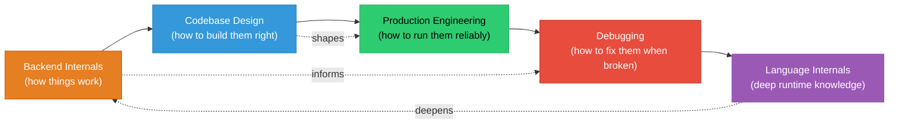
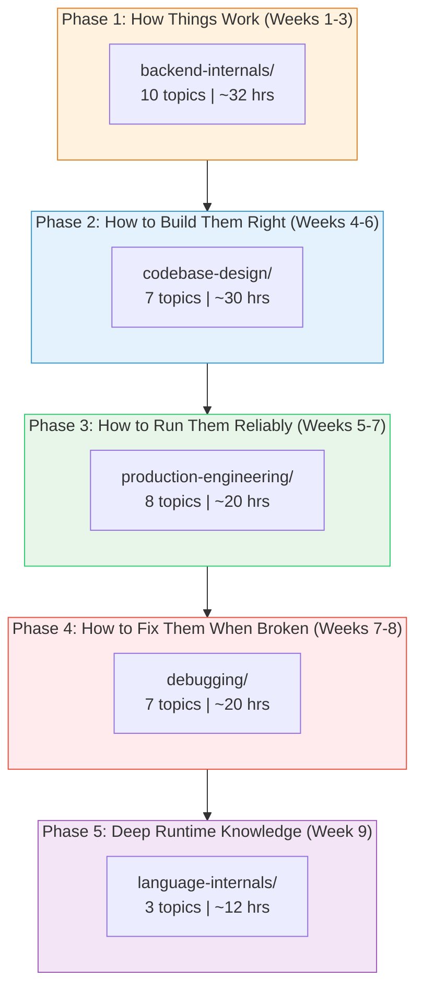

# Engineering Core

A deep dive into the internal mechanics, design principles, operational practices, debugging strategies, and language-level knowledge that senior and staff engineers are expected to demonstrate in interviews. This section spans 35 topics across 5 sub-sections.

---

## Visual Overview

```mermaid
graph TB
    EC["Engineering Core<br/>35 Topics | 5 Sub-sections"]

    EC --> BI["backend-internals/<br/>10 Topics"]
    EC --> CD["codebase-design/<br/>7 Topics"]
    EC --> PE["production-engineering/<br/>8 Topics"]
    EC --> DB["debugging/<br/>7 Topics"]
    EC --> LI["language-internals/<br/>3 Topics"]

    BI --> BI1["Concurrency, Thread Safety,<br/>Connection Pooling"]
    BI --> BI2["DB Internals, Memory Mgmt,<br/>OS Fundamentals"]
    BI --> BI3["Networking, Caching,<br/>Message Queues, Load Balancing"]

    CD --> CD1["SOLID, Design Patterns,<br/>Clean Architecture"]
    CD --> CD2["DI, API Design,<br/>TypeScript Patterns, Code Review"]

    PE --> PE1["SLO/SLA/SLI, Incident Handling,<br/>Rollback, Disaster Recovery"]
    PE --> PE2["Capacity Planning, Deployment,<br/>Alerting, Chaos Engineering"]

    DB --> DB1["Root Cause Analysis,<br/>Log Analysis, Hypothesis Debugging"]
    DB --> DB2["Performance Profiling,<br/>Distributed Tracing,<br/>Failure Patterns, Scenarios"]

    LI --> LI1["Node.js V8 Internals"]
    LI --> LI2["TypeScript Advanced"]
    LI --> LI3["Python Internals"]

    style EC fill:#1a1a2e,stroke:#e94560,color:#eee
    style BI fill:#e67e22,stroke:#d35400,color:#fff
    style CD fill:#3498db,stroke:#2980b9,color:#fff
    style PE fill:#2ecc71,stroke:#27ae60,color:#000
    style DB fill:#e74c3c,stroke:#c0392b,color:#fff
    style LI fill:#9b59b6,stroke:#8e44ad,color:#fff
    style BI1 fill:#d35400,stroke:#b94600,color:#fff
    style BI2 fill:#d35400,stroke:#b94600,color:#fff
    style BI3 fill:#d35400,stroke:#b94600,color:#fff
    style CD1 fill:#2980b9,stroke:#1f6dad,color:#fff
    style CD2 fill:#2980b9,stroke:#1f6dad,color:#fff
    style PE1 fill:#27ae60,stroke:#1e8449,color:#fff
    style PE2 fill:#27ae60,stroke:#1e8449,color:#fff
    style DB1 fill:#c0392b,stroke:#a93226,color:#fff
    style DB2 fill:#c0392b,stroke:#a93226,color:#fff
    style LI1 fill:#8e44ad,stroke:#7d3c98,color:#fff
    style LI2 fill:#8e44ad,stroke:#7d3c98,color:#fff
    style LI3 fill:#8e44ad,stroke:#7d3c98,color:#fff
```

### How Sub-sections Relate

---

## Sub-section 1: Backend Internals (10 Topics)

> How backend systems actually work under the hood -- from OS-level syscalls to application-level caching and message queues.

| # | Topic | Link | Difficulty | Est. Time |
|---|-------|------|:----------:|:---------:|
| 01 | Concurrency Models | [concepts.md](./backend-internals/01-concurrency-models/concepts.md) | Medium | 3-4 hrs |
| 02 | Thread Safety | [concepts.md](./backend-internals/02-thread-safety/concepts.md) | Medium-Hard | 2-3 hrs |
| 03 | Connection Pooling | [concepts.md](./backend-internals/03-connection-pooling/concepts.md) | Medium | 2 hrs |
| 04 | Database Internals | [concepts.md](./backend-internals/04-database-internals/concepts.md) | Hard | 4-5 hrs |
| 05 | Memory Management | [concepts.md](./backend-internals/05-memory-management/concepts.md) | Medium-Hard | 3 hrs |
| 06 | OS Fundamentals | [concepts.md](./backend-internals/06-os-fundamentals/concepts.md) | Hard | 3-4 hrs |
| 07 | Networking Deep Dive | [concepts.md](./backend-internals/07-networking-deep-dive/concepts.md) | Hard | 4 hrs |
| 08 | Caching Deep Dive | [concepts.md](./backend-internals/08-caching-deep-dive/concepts.md) | Medium-Hard | 3 hrs |
| 09 | Message Queues Deep Dive | [concepts.md](./backend-internals/09-message-queues-deep-dive/concepts.md) | Hard | 4 hrs |
| 10 | Load Balancing Internals | [concepts.md](./backend-internals/10-load-balancing-internals/concepts.md) | Medium-Hard | 3 hrs |

**Sub-section README:** [backend-internals/00-README.md](./backend-internals/00-README.md)

---

## Sub-section 2: Codebase Design (7 Topics)

> How to structure code, apply design principles, and build maintainable systems that pass senior-level code review.

| # | Topic | Link | Difficulty | Est. Time |
|---|-------|------|:----------:|:---------:|
| 01 | SOLID Principles | [concepts.md](./codebase-design/01-solid-principles/concepts.md) | Medium | 3-4 hrs |
| 02 | Design Patterns | [concepts.md](./codebase-design/02-design-patterns/concepts.md) | Hard | 6-8 hrs |
| 03 | Code Review Skills | [concepts.md](./codebase-design/03-code-review-skills/concepts.md) | Medium | 2-3 hrs |
| 04 | API Design Maturity | [concepts.md](./codebase-design/04-api-design-maturity/concepts.md) | Medium-Hard | 4-5 hrs |
| 05 | Clean Architecture | [concepts.md](./codebase-design/05-clean-architecture/concepts.md) | Hard | 5-6 hrs |
| 06 | Dependency Injection | [concepts.md](./codebase-design/06-dependency-injection/concepts.md) | Medium | 3-4 hrs |
| 07 | TypeScript Patterns | [concepts.md](./codebase-design/07-typescript-patterns/concepts.md) | Hard | 5-6 hrs |

**Sub-section README:** [codebase-design/00-README.md](./codebase-design/00-README.md)

---

## Sub-section 3: Production Engineering (8 Topics)

> How to deploy, monitor, and keep production systems reliable -- SRE and platform engineering fundamentals.

| # | Topic | Link | Difficulty | Est. Time |
|---|-------|------|:----------:|:---------:|
| 01 | SLO / SLA / SLI | [concepts.md](./production-engineering/01-slo-sla-sli/concepts.md) | Medium | 2-3 hrs |
| 02 | Incident Handling | [concepts.md](./production-engineering/02-incident-handling/concepts.md) | Medium | 2-3 hrs |
| 03 | Rollback Strategies | [concepts.md](./production-engineering/03-rollback-strategies/concepts.md) | Medium-Hard | 3-4 hrs |
| 04 | Disaster Recovery | [concepts.md](./production-engineering/04-disaster-recovery/concepts.md) | Hard | 3-4 hrs |
| 05 | Capacity Planning | [concepts.md](./production-engineering/05-capacity-planning/concepts.md) | Medium | 2-3 hrs |
| 06 | Deployment Pipelines | [concepts.md](./production-engineering/06-deployment-pipelines/concepts.md) | Medium | 2-3 hrs |
| 07 | Alerting Practices | [concepts.md](./production-engineering/07-alerting-practices/concepts.md) | Medium | 2 hrs |
| 08 | Chaos Engineering | [concepts.md](./production-engineering/08-chaos-engineering/concepts.md) | Medium-Hard | 2-3 hrs |

**Sub-section README:** [production-engineering/00-README.md](./production-engineering/00-README.md)

---

## Sub-section 4: Debugging (7 Topics)

> How to systematically diagnose, isolate, and resolve issues in complex distributed systems.

| # | Topic | Link | Difficulty | Est. Time |
|---|-------|------|:----------:|:---------:|
| 01 | Root Cause Analysis | [concepts.md](./debugging/01-root-cause-analysis/concepts.md) | Medium | 2 hrs |
| 02 | Log Analysis | [concepts.md](./debugging/02-log-analysis/concepts.md) | Medium | 2.5 hrs |
| 03 | Hypothesis-Driven Debugging | [concepts.md](./debugging/03-hypothesis-driven-debugging/concepts.md) | Medium | 2 hrs |
| 04 | Performance Profiling | [concepts.md](./debugging/04-performance-profiling/concepts.md) | Hard | 3 hrs |
| 05 | Distributed Tracing | [concepts.md](./debugging/05-distributed-tracing/concepts.md) | Hard | 3 hrs |
| 06 | Failure Patterns | [concepts.md](./debugging/06-failure-patterns/concepts.md) | Hard | 3 hrs |
| 07 | Debugging Scenarios | [concepts.md](./debugging/07-debugging-scenarios/concepts.md) | Hard | 4 hrs |

**Sub-section README:** [debugging/00-README.md](./debugging/00-README.md)

---

## Sub-section 5: Language Internals (3 Topics)

> Runtime-level knowledge of the languages you use -- V8, TypeScript compiler, and Python internals.

| # | Topic | Link | Difficulty | Est. Time |
|---|-------|------|:----------:|:---------:|
| 01 | Node.js V8 Internals | [concepts.md](./language-internals/01-nodejs-v8-internals/concepts.md) | Hard | 4-5 hrs |
| 02 | TypeScript Advanced | [concepts.md](./language-internals/02-typescript-advanced/concepts.md) | Hard | 3-4 hrs |
| 03 | Python Internals | [concepts.md](./language-internals/03-python-internals/concepts.md) | Hard | 3-4 hrs |

---

## Recommended Study Order

Study sub-sections in this sequence. Each builds on the knowledge from the previous one.

**Rationale:**

1. **Backend Internals first** -- understanding how systems work internally is the foundation for everything else.
2. **Codebase Design second** -- knowing good architecture and design patterns builds on internal knowledge.
3. **Production Engineering third** -- operating systems well requires knowing how they are built.
4. **Debugging fourth** -- effective debugging requires understanding of internals, architecture, and production systems.
5. **Language Internals last** -- deepens everything above with runtime-specific knowledge.

---

## Progress Tracker

### Backend Internals

| # | Topic | Read | Notes | Practice | Confident |
|---|-------|:----:|:-----:|:--------:|:---------:|
| 01 | Concurrency Models | [ ] | [ ] | [ ] | [ ] |
| 02 | Thread Safety | [ ] | [ ] | [ ] | [ ] |
| 03 | Connection Pooling | [ ] | [ ] | [ ] | [ ] |
| 04 | Database Internals | [ ] | [ ] | [ ] | [ ] |
| 05 | Memory Management | [ ] | [ ] | [ ] | [ ] |
| 06 | OS Fundamentals | [ ] | [ ] | [ ] | [ ] |
| 07 | Networking Deep Dive | [ ] | [ ] | [ ] | [ ] |
| 08 | Caching Deep Dive | [ ] | [ ] | [ ] | [ ] |
| 09 | Message Queues Deep Dive | [ ] | [ ] | [ ] | [ ] |
| 10 | Load Balancing Internals | [ ] | [ ] | [ ] | [ ] |

### Codebase Design

| # | Topic | Read | Notes | Practice | Confident |
|---|-------|:----:|:-----:|:--------:|:---------:|
| 01 | SOLID Principles | [ ] | [ ] | [ ] | [ ] |
| 02 | Design Patterns | [ ] | [ ] | [ ] | [ ] |
| 03 | Code Review Skills | [ ] | [ ] | [ ] | [ ] |
| 04 | API Design Maturity | [ ] | [ ] | [ ] | [ ] |
| 05 | Clean Architecture | [ ] | [ ] | [ ] | [ ] |
| 06 | Dependency Injection | [ ] | [ ] | [ ] | [ ] |
| 07 | TypeScript Patterns | [ ] | [ ] | [ ] | [ ] |

### Production Engineering

| # | Topic | Read | Notes | Practice | Confident |
|---|-------|:----:|:-----:|:--------:|:---------:|
| 01 | SLO / SLA / SLI | [ ] | [ ] | [ ] | [ ] |
| 02 | Incident Handling | [ ] | [ ] | [ ] | [ ] |
| 03 | Rollback Strategies | [ ] | [ ] | [ ] | [ ] |
| 04 | Disaster Recovery | [ ] | [ ] | [ ] | [ ] |
| 05 | Capacity Planning | [ ] | [ ] | [ ] | [ ] |
| 06 | Deployment Pipelines | [ ] | [ ] | [ ] | [ ] |
| 07 | Alerting Practices | [ ] | [ ] | [ ] | [ ] |
| 08 | Chaos Engineering | [ ] | [ ] | [ ] | [ ] |

### Debugging

| # | Topic | Read | Notes | Practice | Confident |
|---|-------|:----:|:-----:|:--------:|:---------:|
| 01 | Root Cause Analysis | [ ] | [ ] | [ ] | [ ] |
| 02 | Log Analysis | [ ] | [ ] | [ ] | [ ] |
| 03 | Hypothesis-Driven Debugging | [ ] | [ ] | [ ] | [ ] |
| 04 | Performance Profiling | [ ] | [ ] | [ ] | [ ] |
| 05 | Distributed Tracing | [ ] | [ ] | [ ] | [ ] |
| 06 | Failure Patterns | [ ] | [ ] | [ ] | [ ] |
| 07 | Debugging Scenarios | [ ] | [ ] | [ ] | [ ] |

### Language Internals

| # | Topic | Read | Notes | Practice | Confident |
|---|-------|:----:|:-----:|:--------:|:---------:|
| 01 | Node.js V8 Internals | [ ] | [ ] | [ ] | [ ] |
| 02 | TypeScript Advanced | [ ] | [ ] | [ ] | [ ] |
| 03 | Python Internals | [ ] | [ ] | [ ] | [ ] |

---

## Summary

| Sub-section | Topics | Est. Total Time |
|-------------|:------:|:---------------:|
| Backend Internals | 10 | ~32 hrs |
| Codebase Design | 7 | ~30 hrs |
| Production Engineering | 8 | ~20 hrs |
| Debugging | 7 | ~20 hrs |
| Language Internals | 3 | ~12 hrs |
| **Total** | **35** | **~114 hrs** |
