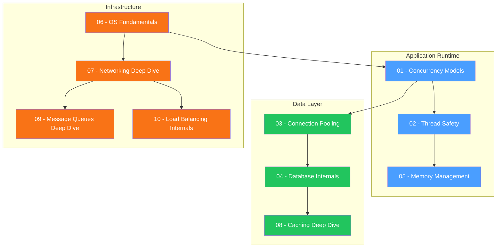

# Backend Internals — Study Guide

## Overview

This module covers the internal mechanics of backend systems — from how Node.js processes asynchronous work to how databases store and retrieve data, how networks transport bytes, and how caches and message queues achieve reliability at scale. Mastering these topics separates senior engineers from mid-level ones in interviews.

## Topic Table

| # | Topic | Key Concepts | Difficulty | Est. Time |
|---|-------|-------------|------------|-----------|
| 01 | [Concurrency Models](./01-concurrency-models.md) | Event loop phases, libuv, worker threads, microtasks vs macrotasks | Medium | 3-4 hrs |
| 02 | [Thread Safety](./02-thread-safety.md) | Mutexes, race conditions, deadlocks, optimistic/pessimistic locking | Medium-Hard | 2-3 hrs |
| 03 | [Connection Pooling](./03-connection-pooling.md) | Pool lifecycle, Little's Law, leak detection, sizing | Medium | 2 hrs |
| 04 | [Database Internals](./04-database-internals.md) | B+ trees, WAL, MVCC, query planners, EXPLAIN ANALYZE | Hard | 4-5 hrs |
| 05 | [Memory Management](./05-memory-management.md) | V8 GC, leak patterns, heap snapshots, profiling | Medium-Hard | 3 hrs |
| 06 | [OS Fundamentals](./06-os-fundamentals.md) | Processes vs threads, virtual memory, epoll/kqueue, syscalls | Hard | 3-4 hrs |
| 07 | [Networking Deep Dive](./07-networking-deep-dive.md) | TCP internals, congestion control, HTTP/2-3, TLS 1.3, QUIC | Hard | 4 hrs |
| 08 | [Caching Deep Dive](./08-caching-deep-dive.md) | Cache stampede, Redis internals, eviction, distributed cache | Medium-Hard | 3 hrs |
| 09 | [Message Queues Deep Dive](./09-message-queues-deep-dive.md) | Kafka internals, consumer groups, exactly-once, partitions | Hard | 4 hrs |
| 10 | [Load Balancing Internals](./10-load-balancing-internals.md) | Consistent hashing, L4 vs L7, health checks, connection draining | Medium-Hard | 3 hrs |

## Recommended Study Order

**Rationale:**

1. **OS Fundamentals first** — Understanding processes, threads, and syscalls grounds everything else.
2. **Concurrency + Thread Safety** — Core to how Node.js (and any runtime) works.
3. **Memory + Connection Pooling + DB Internals** — The data path from application to storage.
4. **Networking + Load Balancing + Caching + Message Queues** — The infrastructure layer that ties it all together.

## Progress Tracker

| # | Topic | Read | Notes | Practice Qs | Confident |
|---|-------|:----:|:-----:|:-----------:|:---------:|
| 01 | Concurrency Models | [ ] | [ ] | [ ] | [ ] |
| 02 | Thread Safety | [ ] | [ ] | [ ] | [ ] |
| 03 | Connection Pooling | [ ] | [ ] | [ ] | [ ] |
| 04 | Database Internals | [ ] | [ ] | [ ] | [ ] |
| 05 | Memory Management | [ ] | [ ] | [ ] | [ ] |
| 06 | OS Fundamentals | [ ] | [ ] | [ ] | [ ] |
| 07 | Networking Deep Dive | [ ] | [ ] | [ ] | [ ] |
| 08 | Caching Deep Dive | [ ] | [ ] | [ ] | [ ] |
| 09 | Message Queues Deep Dive | [ ] | [ ] | [ ] | [ ] |
| 10 | Load Balancing Internals | [ ] | [ ] | [ ] | [ ] |

## How to Use This Guide

1. **Follow the study order** — each topic builds on the previous ones.
2. **Read the concepts.md** in each folder thoroughly, paying attention to diagrams.
3. **Work through the code examples** — type them out, modify them, break them.
4. **Answer the Interview Q&A** sections — cover the answer and try to articulate it yourself first.
5. **Use the comparison tables** for quick revision before interviews.
6. **Mark your progress** in the tracker above after each session.
