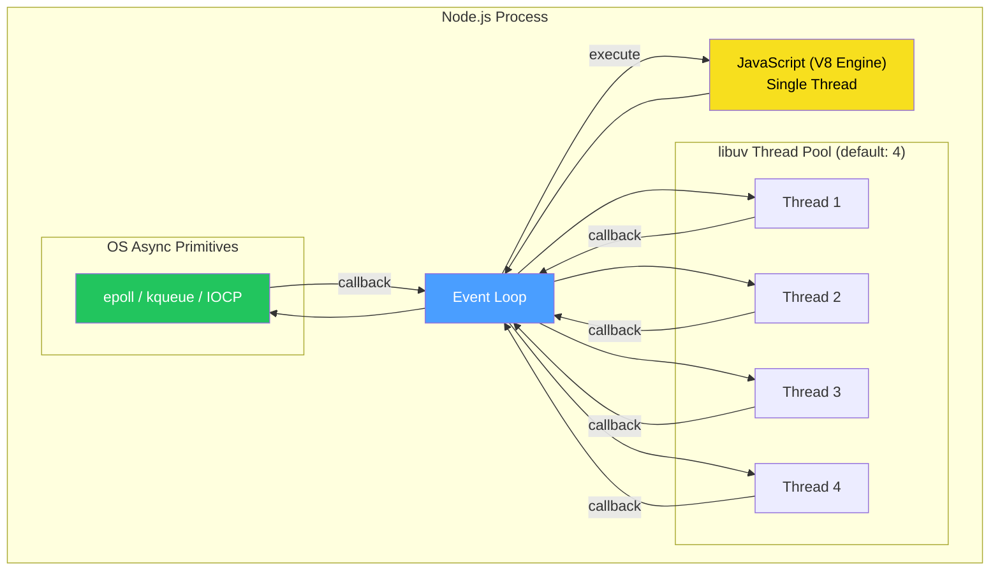
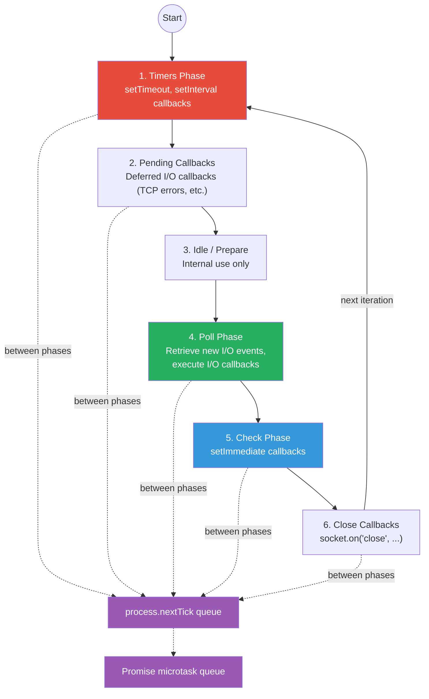
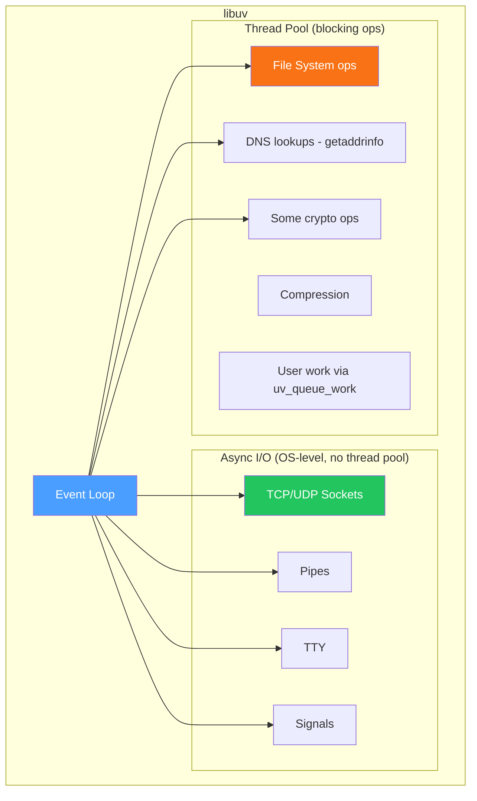
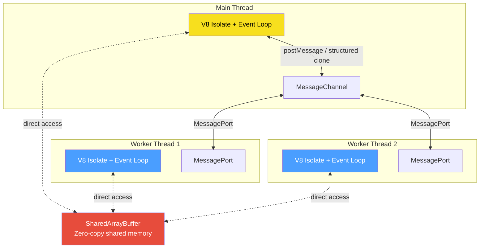

# Concurrency Models — Event Loop, Worker Threads & Async Internals

## Table of Contents

- [The Node.js Architecture](#the-nodejs-architecture)
- [Event Loop Phases in Detail](#event-loop-phases-in-detail)
- [libuv Architecture](#libuv-architecture)
- [Microtasks vs Macrotasks](#microtasks-vs-macrotasks)
- [async/await Under the Hood](#asyncawait-under-the-hood)
- [Worker Threads](#worker-threads)
- [Comparison Tables](#comparison-tables)
- [Code Examples](#code-examples)
- [Interview Q&A](#interview-qa)

---

## The Node.js Architecture

Node.js is **single-threaded for JavaScript execution** but uses multiple threads internally via libuv for I/O operations. Understanding this distinction is fundamental.



**Key points:**
- V8 executes JavaScript on a single thread.
- libuv provides an event loop and a thread pool (default 4 threads, configurable via `UV_THREADPOOL_SIZE`, max 1024).
- Network I/O uses OS async primitives (epoll on Linux, kqueue on macOS), **not** the thread pool.
- File I/O, DNS lookups, and some crypto operations use the thread pool.

---

## Event Loop Phases in Detail

The event loop is **not** a simple `while(true)` loop. It has distinct phases, each with its own FIFO queue of callbacks.



### Phase Breakdown

| Phase | What Runs | Key Details |
|-------|-----------|-------------|
| **Timers** | `setTimeout` / `setInterval` callbacks | Executes callbacks whose threshold has elapsed. Not exact — depends on OS scheduling and poll phase. |
| **Pending Callbacks** | Deferred I/O callbacks | TCP `ECONNREFUSED` errors, some system-level callbacks postponed from previous iteration. |
| **Idle/Prepare** | Internal to libuv | Not directly accessible from JS. |
| **Poll** | I/O callbacks (file reads, network, etc.) | The workhorse phase. Calculates how long to block waiting for I/O. Will block if no timers are scheduled. |
| **Check** | `setImmediate` callbacks | Runs after poll phase completes. Guaranteed to run before timers in the next iteration. |
| **Close** | Close event callbacks | `socket.on('close', ...)`, cleanup handlers. |

### Between Every Phase: Microtask Queues

After **every** phase transition, Node.js drains:
1. **`process.nextTick` queue** (fully drained first)
2. **Promise microtask queue** (then fully drained)

This means `process.nextTick` always has priority over Promises.

---

## libuv Architecture

libuv is the C library that provides the event loop, thread pool, and cross-platform async I/O abstractions.



### What Uses the Thread Pool vs OS Async

| Mechanism | Examples | Notes |
|-----------|----------|-------|
| **OS Async (no thread pool)** | TCP/UDP sockets, pipes, signals, child processes | Uses epoll/kqueue/IOCP — highly scalable |
| **Thread Pool** | `fs.*`, DNS `lookup()`, crypto `pbkdf2`/`randomBytes`, zlib | Default 4 threads — can bottleneck under heavy file I/O |

**Critical insight:** If your app does heavy file I/O, increase `UV_THREADPOOL_SIZE`. If it's mostly network I/O, the thread pool size doesn't matter.

---

## Microtasks vs Macrotasks

This is one of the most commonly asked interview questions about JavaScript concurrency.

### Macrotasks (Task Queue)
- `setTimeout`
- `setInterval`
- `setImmediate`
- I/O callbacks
- UI rendering (browser)

### Microtasks (Microtask Queue)
- `Promise.then` / `.catch` / `.finally`
- `process.nextTick` (Node.js — even higher priority than Promise microtasks)
- `queueMicrotask()`
- `MutationObserver` (browser)

### Execution Order

```typescript
// Predict the output order:

console.log("1 - script start");

setTimeout(() => {
  console.log("2 - setTimeout");
}, 0);

Promise.resolve().then(() => {
  console.log("3 - promise 1");
}).then(() => {
  console.log("4 - promise 2");
});

process.nextTick(() => {
  console.log("5 - nextTick");
});

setImmediate(() => {
  console.log("6 - setImmediate");
});

console.log("7 - script end");

// Output:
// 1 - script start
// 7 - script end
// 5 - nextTick          (nextTick queue drained first)
// 3 - promise 1         (promise microtask queue next)
// 4 - promise 2         (still in microtask queue)
// 2 - setTimeout        (timers phase)
// 6 - setImmediate      (check phase)
```

### Priority Order

| Priority | Source | Queue |
|----------|--------|-------|
| 1 (highest) | `process.nextTick` | nextTick queue |
| 2 | `Promise.then`, `queueMicrotask` | microtask queue |
| 3 | `setTimeout(fn, 0)` | timers phase |
| 4 | `setImmediate` | check phase |
| 5 (lowest) | I/O callbacks | poll phase |

**Warning:** `setTimeout(fn, 0)` vs `setImmediate` order is **non-deterministic** in the main module. Inside an I/O callback, `setImmediate` always fires first.

---

## async/await Under the Hood

`async/await` is syntactic sugar over Promises and generators. Understanding the desugaring helps predict execution order.

### How It Transforms

```typescript
// What you write:
async function fetchUser(id: string) {
  const response = await fetch(`/api/users/${id}`);
  const user = await response.json();
  return user;
}

// What the engine essentially does (simplified):
function fetchUser(id: string) {
  return fetch(`/api/users/${id}`)
    .then((response) => response.json())
    .then((user) => user);
}
```

### Key Behaviors

1. **`async` functions always return a Promise** — even if you return a plain value.
2. **`await` yields control** — the code after `await` is scheduled as a microtask.
3. **Error propagation** — a rejected promise after `await` throws synchronously within the async function (caught by try/catch).

### Execution Flow with await

```typescript
async function main() {
  console.log("A");               // Synchronous
  const result = await someAsync(); // Pauses here
  console.log("B");               // Scheduled as microtask after someAsync resolves
  return result;
}

console.log("C");
main();
console.log("D");

// Output: C, A, D, B
// "D" runs before "B" because await yields control back to the caller
```

### Common Pitfall: Sequential vs Parallel

```typescript
// BAD: Sequential — takes 2 seconds
async function sequential() {
  const user = await fetchUser();       // 1 sec
  const posts = await fetchPosts();     // 1 sec
  return { user, posts };
}

// GOOD: Parallel — takes 1 second
async function parallel() {
  const [user, posts] = await Promise.all([
    fetchUser(),    // 1 sec
    fetchPosts(),   // 1 sec — runs concurrently
  ]);
  return { user, posts };
}

// ALSO GOOD: Fire-and-coordinate pattern
async function fireAndCoordinate() {
  const userPromise = fetchUser();   // Fire immediately
  const postsPromise = fetchPosts(); // Fire immediately
  const user = await userPromise;    // Wait for result
  const posts = await postsPromise;  // Already resolved or wait
  return { user, posts };
}
```

---

## Worker Threads

Worker threads allow true parallelism for CPU-intensive tasks without sacrificing Node.js's single-threaded simplicity for I/O.

### Architecture



### Key Characteristics

| Feature | Worker Threads | Child Processes | Cluster |
|---------|---------------|----------------|---------|
| **Memory** | Shared (via SharedArrayBuffer) | Separate | Separate |
| **Communication** | MessagePort (fast) | IPC (slower) | IPC |
| **Overhead** | Lower (~few MB) | Higher (~30MB+) | Higher |
| **Use case** | CPU tasks | Isolation, different binaries | HTTP scaling |
| **Event loop** | Own event loop | Own event loop | Own event loop |
| **Can share file descriptors** | No | Yes (with `fork`) | Yes |

### When to Use Worker Threads

- **CPU-heavy computations** — image processing, encryption, parsing large JSON/CSV.
- **Not for I/O** — the event loop already handles I/O concurrently. Workers for I/O add overhead without benefit.

---

## Comparison Tables

### Concurrency vs Parallelism

| Aspect | Concurrency | Parallelism |
|--------|-------------|-------------|
| **Definition** | Managing multiple tasks at once | Executing multiple tasks simultaneously |
| **Mechanism in Node.js** | Event loop + async I/O | Worker threads / child processes |
| **Suitable for** | I/O-bound work | CPU-bound work |
| **Threads needed** | 1 (single-threaded) | Multiple |
| **Example** | Handling 10K HTTP connections | Compressing 100 images |

### setTimeout(0) vs setImmediate vs process.nextTick

| Feature | `process.nextTick` | `Promise.then` | `setTimeout(fn, 0)` | `setImmediate` |
|---------|-------------------|----------------|---------------------|----------------|
| **Queue** | nextTick queue | microtask queue | timers phase | check phase |
| **When** | Before any I/O or timer | After nextTick, before macrotasks | Next timer phase | After poll phase |
| **Starves I/O?** | Yes (if recursive) | Yes (if recursive) | No | No |
| **Use case** | Must run before I/O | Normal async continuation | Delayed execution | After current I/O batch |

---

## Code Examples

### Demonstrating Event Loop Phases

```typescript
import { readFile } from "fs";

// Inside an I/O callback, setImmediate always fires before setTimeout
readFile(__filename, () => {
  setTimeout(() => {
    console.log("setTimeout inside I/O");
  }, 0);

  setImmediate(() => {
    console.log("setImmediate inside I/O");
  });
});

// Output (deterministic):
// setImmediate inside I/O
// setTimeout inside I/O
```

### Worker Thread: CPU-Bound Task

```typescript
// main.ts
import { Worker, isMainThread, parentPort, workerData } from "worker_threads";

interface WorkerResult {
  workerId: number;
  result: number;
  duration: number;
}

function runWorker(data: { start: number; end: number; id: number }): Promise<WorkerResult> {
  return new Promise((resolve, reject) => {
    const worker = new Worker(__filename, { workerData: data });
    worker.on("message", resolve);
    worker.on("error", reject);
    worker.on("exit", (code) => {
      if (code !== 0) reject(new Error(`Worker exited with code ${code}`));
    });
  });
}

if (isMainThread) {
  // Split work across 4 workers
  const TOTAL = 1_000_000_000;
  const WORKERS = 4;
  const chunk = TOTAL / WORKERS;

  const start = Date.now();

  const workers = Array.from({ length: WORKERS }, (_, i) =>
    runWorker({
      start: i * chunk,
      end: (i + 1) * chunk,
      id: i,
    })
  );

  Promise.all(workers).then((results) => {
    const totalSum = results.reduce((acc, r) => acc + r.result, 0);
    console.log(`Total: ${totalSum}, Time: ${Date.now() - start}ms`);
  });
} else {
  // Worker thread: compute sum of range
  const { start, end, id } = workerData as { start: number; end: number; id: number };
  const workerStart = Date.now();
  let sum = 0;

  for (let i = start; i < end; i++) {
    sum += i % 100; // Simulated CPU work
  }

  parentPort!.postMessage({
    workerId: id,
    result: sum,
    duration: Date.now() - workerStart,
  } satisfies WorkerResult);
}
```

### SharedArrayBuffer with Atomics

```typescript
import { Worker, isMainThread, parentPort, workerData } from "worker_threads";

if (isMainThread) {
  // Create shared memory
  const sharedBuffer = new SharedArrayBuffer(4); // 4 bytes = 1 Int32
  const sharedArray = new Int32Array(sharedBuffer);

  // Both workers increment the same shared counter
  const w1 = new Worker(__filename, { workerData: { buffer: sharedBuffer } });
  const w2 = new Worker(__filename, { workerData: { buffer: sharedBuffer } });

  let finished = 0;
  const onMessage = () => {
    finished++;
    if (finished === 2) {
      // Without Atomics this could be < 200000 due to race conditions
      console.log(`Final counter value: ${sharedArray[0]}`);
      // With Atomics.add: always 200000
    }
  };

  w1.on("message", onMessage);
  w2.on("message", onMessage);
} else {
  const sharedArray = new Int32Array(workerData.buffer);

  for (let i = 0; i < 100_000; i++) {
    // Atomic increment — thread-safe
    Atomics.add(sharedArray, 0, 1);
  }

  parentPort!.postMessage("done");
}
```

### Measuring Event Loop Lag

```typescript
function measureEventLoopLag(): void {
  const INTERVAL_MS = 1000;
  let lastCheck = process.hrtime.bigint();

  setInterval(() => {
    const now = process.hrtime.bigint();
    const elapsed = Number(now - lastCheck) / 1e6; // Convert ns to ms
    const lag = elapsed - INTERVAL_MS;

    if (lag > 50) {
      console.warn(`Event loop lag: ${lag.toFixed(1)}ms — possible blocking operation`);
    }

    lastCheck = now;
  }, INTERVAL_MS);
}

measureEventLoopLag();
```

---

## Interview Q&A

> **Q1: Is Node.js single-threaded?**
>
> Node.js executes JavaScript on a single thread via V8, but it is not truly single-threaded. libuv maintains a thread pool (default 4 threads) for blocking operations like file I/O and DNS lookups. Network I/O uses OS-level async mechanisms (epoll/kqueue) and does not consume thread pool threads. Additionally, developers can create worker threads for CPU-intensive parallelism. So the accurate answer is: "JavaScript execution is single-threaded, but the runtime uses multiple threads behind the scenes."

> **Q2: What happens if you call `process.nextTick` recursively? Why is that dangerous?**
>
> Recursive `process.nextTick` calls will **starve the event loop**. Since the nextTick queue is drained completely between every event loop phase, infinite recursive nextTick calls prevent the event loop from ever reaching the poll phase (I/O). This means no I/O callbacks, no timers, no setImmediate callbacks will ever execute. This is why Node.js documentation recommends using `setImmediate` instead of `process.nextTick` for most cases — setImmediate is bounded to one callback per event loop iteration.

> **Q3: What is the difference between `setImmediate` and `setTimeout(fn, 0)`?**
>
> `setTimeout(fn, 0)` runs in the **timers phase** of the event loop, while `setImmediate` runs in the **check phase** (after the poll phase). In the main module, their order is non-deterministic because it depends on process performance and how quickly the event loop enters the timer phase. However, inside an I/O callback, `setImmediate` always fires first because the check phase always follows the poll phase. This makes `setImmediate` more predictable for "run after current I/O" semantics.

> **Q4: When should you use Worker Threads vs the cluster module?**
>
> Use **Worker Threads** for CPU-bound tasks (image processing, heavy computation, large JSON parsing) because they share memory via SharedArrayBuffer and have lower overhead. Use the **cluster module** for scaling HTTP servers across CPU cores — it forks the entire Node.js process and uses the OS to distribute incoming connections. The key difference: worker threads share a process and can share memory; cluster creates separate processes with separate memory spaces and separate event loops.

> **Q5: Explain how `await` affects the execution order of code.**
>
> When the runtime hits `await`, it wraps the remaining code in the async function as a `.then()` microtask and **yields control back to the caller**. The calling code continues executing synchronously. Once the awaited Promise resolves, the continuation is placed on the microtask queue and will execute before any macrotasks (timers, I/O). This is why code after `await` appears to "pause" the function but doesn't block the thread — it's just a continuation scheduled via the microtask queue.

> **Q6: How can you detect and fix event loop blocking in production?**
>
> Detection: (1) Measure event loop lag by comparing `setInterval` actual timing vs expected timing. (2) Use `perf_hooks.monitorEventLoopDelay()` for histogram data. (3) Use `--diagnostic-report` flag for detailed runtime reports. (4) Tools like `clinic.js` provide flame graphs. Fixes: (1) Move CPU-bound work to worker threads. (2) Break up large synchronous loops with `setImmediate` to yield to the event loop. (3) Avoid synchronous API variants (`readFileSync`, `JSON.parse` on huge strings). (4) Use streams instead of buffering entire files in memory.
