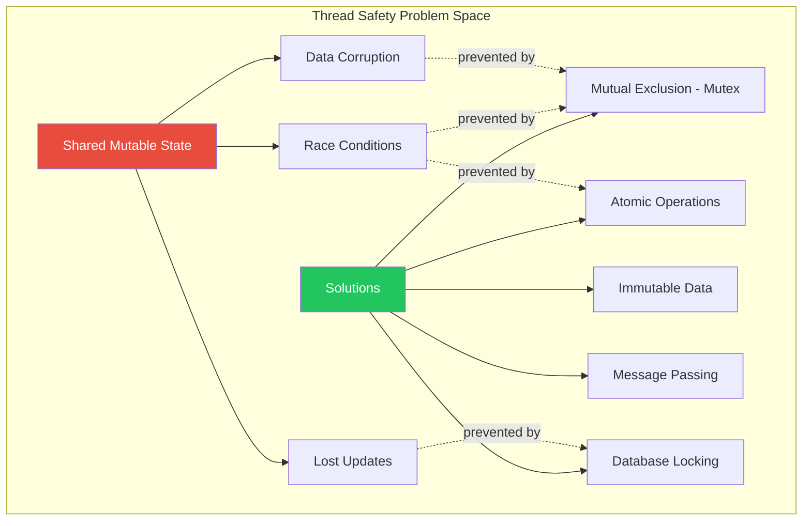
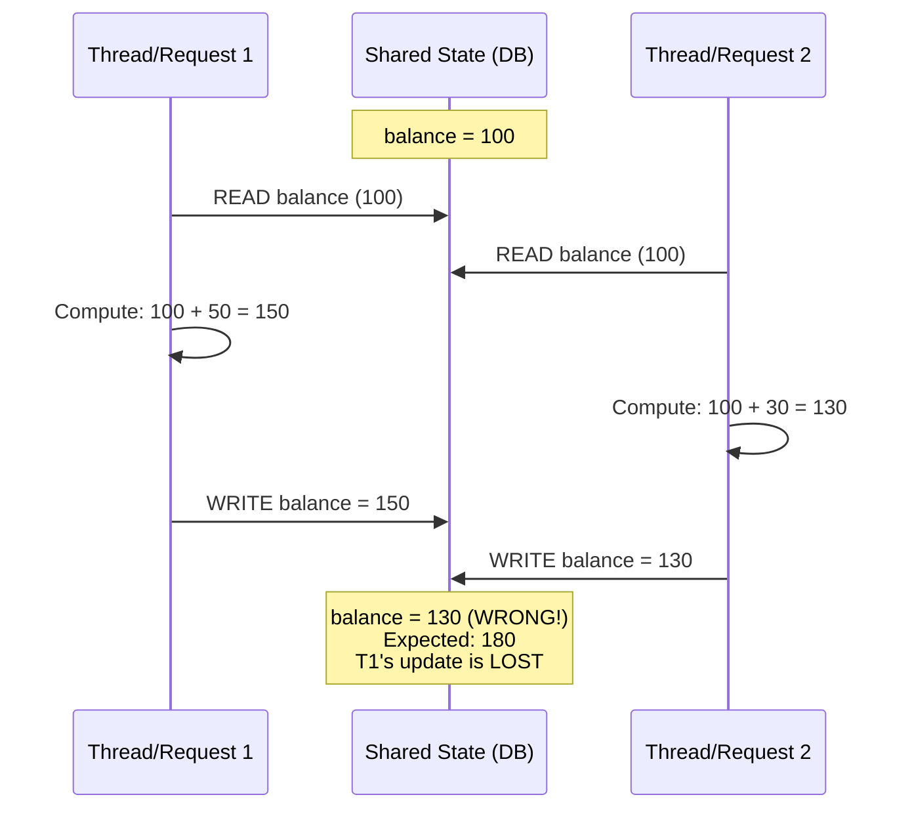
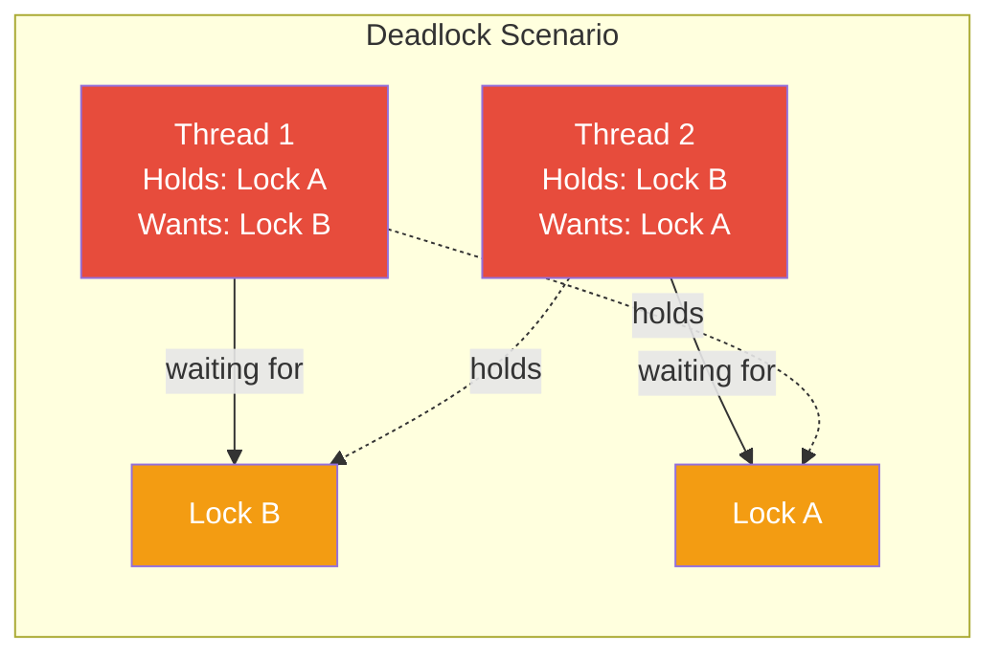
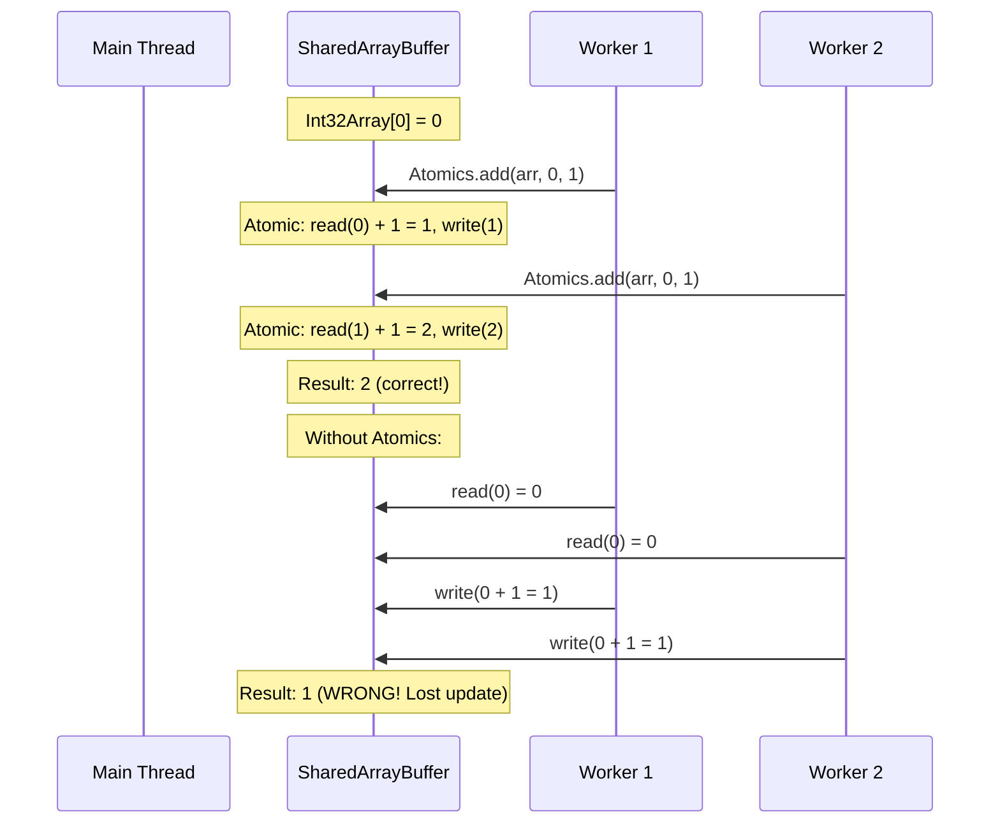

# Thread Safety — Mutexes, Race Conditions, Deadlocks & Locking Strategies

## Table of Contents

- [Core Concepts](#core-concepts)
- [Race Conditions](#race-conditions)
- [Mutexes and Locking Primitives](#mutexes-and-locking-primitives)
- [Deadlocks](#deadlocks)
- [Optimistic vs Pessimistic Locking](#optimistic-vs-pessimistic-locking)
- [Thread Safety in Node.js](#thread-safety-in-nodejs)
- [Database-Level Locking](#database-level-locking)
- [Comparison Tables](#comparison-tables)
- [Code Examples](#code-examples)
- [Interview Q&A](#interview-qa)

---

## Core Concepts

Thread safety means that shared data can be accessed by multiple threads without resulting in undefined behavior or corruption. Even though Node.js JavaScript runs on a single thread, thread safety becomes critical in three scenarios:

1. **Worker threads with SharedArrayBuffer** — actual shared memory between threads.
2. **Database concurrent access** — multiple requests modifying the same rows.
3. **Distributed systems** — multiple Node.js instances accessing shared resources (Redis, databases).



---

## Race Conditions

A race condition occurs when the outcome of a program depends on the relative timing or interleaving of multiple concurrent operations.

### Classic Example: Read-Modify-Write



### Race Conditions in Node.js (Yes, They Exist!)

Even in single-threaded Node.js, race conditions happen with async operations:

```typescript
// RACE CONDITION: Two concurrent requests can read stale data
async function transferMoney(fromId: string, toId: string, amount: number): Promise<void> {
  const from = await db.accounts.findOne({ id: fromId }); // Read
  const to = await db.accounts.findOne({ id: toId });     // Read

  // Between READ and WRITE, another request could modify these accounts!
  if (from.balance < amount) throw new Error("Insufficient funds");

  await db.accounts.updateOne({ id: fromId }, { balance: from.balance - amount }); // Write
  await db.accounts.updateOne({ id: toId }, { balance: to.balance + amount });     // Write
}
```

The `await` points are where other async operations can interleave, creating time-of-check to time-of-use (TOCTOU) bugs.

---

## Mutexes and Locking Primitives

A **mutex** (mutual exclusion) ensures that only one thread/process can access a critical section at a time.

### Mutex Types

| Type | Description | Use Case |
|------|-------------|----------|
| **Binary Mutex** | Locked or unlocked — one owner at a time | General critical sections |
| **Recursive Mutex** | Same thread can lock multiple times | Nested function calls |
| **Read-Write Lock** | Multiple readers OR one writer | Read-heavy workloads |
| **Spinlock** | Busy-waits instead of sleeping | Very short critical sections |
| **Semaphore** | Allows N concurrent accesses | Connection pools, rate limiting |

### Mutex in Node.js with Worker Threads

```typescript
import { Worker, isMainThread, workerData, parentPort } from "worker_threads";

// Using Atomics as a mutex (spinlock approach)
class AtomicMutex {
  private lockArray: Int32Array;

  constructor(sharedBuffer: SharedArrayBuffer, offset: number = 0) {
    this.lockArray = new Int32Array(sharedBuffer, offset, 1);
  }

  lock(): void {
    // Spin until we acquire the lock (CAS: compare-and-swap)
    while (Atomics.compareExchange(this.lockArray, 0, 0, 1) !== 0) {
      // Wait until lock is released
      Atomics.wait(this.lockArray, 0, 1);
    }
  }

  unlock(): void {
    Atomics.store(this.lockArray, 0, 0);
    // Wake one waiting thread
    Atomics.notify(this.lockArray, 0, 1);
  }
}
```

### Application-Level Mutex (Async Mutex for Node.js)

```typescript
// Async mutex for protecting critical sections in single-threaded Node.js
class AsyncMutex {
  private locked = false;
  private waitQueue: Array<() => void> = [];

  async acquire(): Promise<void> {
    if (!this.locked) {
      this.locked = true;
      return;
    }

    return new Promise<void>((resolve) => {
      this.waitQueue.push(resolve);
    });
  }

  release(): void {
    if (this.waitQueue.length > 0) {
      const next = this.waitQueue.shift()!;
      next(); // Give lock to next waiter
    } else {
      this.locked = false;
    }
  }

  async runExclusive<T>(fn: () => Promise<T>): Promise<T> {
    await this.acquire();
    try {
      return await fn();
    } finally {
      this.release();
    }
  }
}

// Usage:
const accountMutex = new Map<string, AsyncMutex>();

function getMutex(accountId: string): AsyncMutex {
  if (!accountMutex.has(accountId)) {
    accountMutex.set(accountId, new AsyncMutex());
  }
  return accountMutex.get(accountId)!;
}

async function safeTransfer(fromId: string, toId: string, amount: number): Promise<void> {
  // Lock both accounts in consistent order to prevent deadlocks
  const [first, second] = fromId < toId ? [fromId, toId] : [toId, fromId];
  const mutex1 = getMutex(first);
  const mutex2 = getMutex(second);

  await mutex1.runExclusive(async () => {
    await mutex2.runExclusive(async () => {
      const from = await db.accounts.findOne({ id: fromId });
      const to = await db.accounts.findOne({ id: toId });

      if (from.balance < amount) throw new Error("Insufficient funds");

      await db.accounts.updateOne({ id: fromId }, { balance: from.balance - amount });
      await db.accounts.updateOne({ id: toId }, { balance: to.balance + amount });
    });
  });
}
```

---

## Deadlocks

A deadlock occurs when two or more threads are each waiting for the other to release a resource, and none can proceed.

### Four Conditions for Deadlock (Coffman Conditions)

All four must hold simultaneously for a deadlock to occur:

1. **Mutual Exclusion** — Resources are held exclusively.
2. **Hold and Wait** — A thread holds one resource and waits for another.
3. **No Preemption** — Resources cannot be forcibly taken away.
4. **Circular Wait** — A circular chain of threads, each waiting for a resource held by the next.



### Deadlock Prevention Strategies

| Strategy | How | Trade-off |
|----------|-----|-----------|
| **Lock ordering** | Always acquire locks in a consistent global order | Requires discipline, may not always be natural |
| **Lock timeout** | Abort if lock not acquired within N ms | Can cause unnecessary failures |
| **Try-lock** | Non-blocking attempt; back off if unavailable | Complex retry logic |
| **Single lock** | Use one global lock | Reduces concurrency |
| **Avoid nested locks** | Restructure to never hold multiple locks | Not always possible |

### Database Deadlock Example

```sql
-- Transaction 1:
BEGIN;
UPDATE accounts SET balance = balance - 100 WHERE id = 'A';  -- Locks row A
UPDATE accounts SET balance = balance + 100 WHERE id = 'B';  -- Waits for row B

-- Transaction 2 (concurrent):
BEGIN;
UPDATE accounts SET balance = balance - 50 WHERE id = 'B';   -- Locks row B
UPDATE accounts SET balance = balance + 50 WHERE id = 'A';   -- Waits for row A
-- DEADLOCK! Both transactions wait for each other
```

**Fix:** Always update rows in a consistent order (e.g., by ascending ID).

---

## Optimistic vs Pessimistic Locking

### Pessimistic Locking

Assumes conflicts **will** happen. Locks the resource before reading.

```typescript
// Pessimistic: SELECT ... FOR UPDATE
async function pessimisticTransfer(
  fromId: string,
  toId: string,
  amount: number
): Promise<void> {
  const client = await pool.connect();
  try {
    await client.query("BEGIN");

    // FOR UPDATE locks these rows — other transactions must wait
    const { rows } = await client.query(
      `SELECT id, balance FROM accounts
       WHERE id IN ($1, $2)
       ORDER BY id
       FOR UPDATE`,
      [fromId, toId]
    );

    const from = rows.find((r) => r.id === fromId)!;
    const to = rows.find((r) => r.id === toId)!;

    if (from.balance < amount) {
      await client.query("ROLLBACK");
      throw new Error("Insufficient funds");
    }

    await client.query("UPDATE accounts SET balance = balance - $1 WHERE id = $2", [amount, fromId]);
    await client.query("UPDATE accounts SET balance = balance + $1 WHERE id = $2", [amount, toId]);
    await client.query("COMMIT");
  } catch (err) {
    await client.query("ROLLBACK");
    throw err;
  } finally {
    client.release();
  }
}
```

### Optimistic Locking

Assumes conflicts are **rare**. Reads without locking, checks for conflicts at write time.

```typescript
// Optimistic: version column check
async function optimisticUpdate(
  accountId: string,
  newBalance: number,
  expectedVersion: number
): Promise<boolean> {
  const result = await pool.query(
    `UPDATE accounts
     SET balance = $1, version = version + 1
     WHERE id = $2 AND version = $3`,
    [newBalance, accountId, expectedVersion]
  );

  if (result.rowCount === 0) {
    // Someone else modified the row — retry or fail
    return false;
  }
  return true;
}

// With retry logic
async function optimisticTransferWithRetry(
  fromId: string,
  toId: string,
  amount: number,
  maxRetries: number = 3
): Promise<void> {
  for (let attempt = 0; attempt < maxRetries; attempt++) {
    const from = await pool.query("SELECT * FROM accounts WHERE id = $1", [fromId]);
    const to = await pool.query("SELECT * FROM accounts WHERE id = $1", [toId]);

    const fromAccount = from.rows[0];
    const toAccount = to.rows[0];

    if (fromAccount.balance < amount) throw new Error("Insufficient funds");

    const client = await pool.connect();
    try {
      await client.query("BEGIN");

      const r1 = await client.query(
        "UPDATE accounts SET balance = $1, version = version + 1 WHERE id = $2 AND version = $3",
        [fromAccount.balance - amount, fromId, fromAccount.version]
      );

      const r2 = await client.query(
        "UPDATE accounts SET balance = $1, version = version + 1 WHERE id = $2 AND version = $3",
        [toAccount.balance + amount, toId, toAccount.version]
      );

      if (r1.rowCount === 0 || r2.rowCount === 0) {
        await client.query("ROLLBACK");
        continue; // Retry — version mismatch
      }

      await client.query("COMMIT");
      return; // Success
    } catch (err) {
      await client.query("ROLLBACK");
      throw err;
    } finally {
      client.release();
    }
  }
  throw new Error("Transfer failed after max retries — too much contention");
}
```

---

## Thread Safety in Node.js

### SharedArrayBuffer Safety



### Atomics API

| Method | Description |
|--------|-------------|
| `Atomics.add(arr, idx, val)` | Atomic add, returns old value |
| `Atomics.sub(arr, idx, val)` | Atomic subtract |
| `Atomics.and/or/xor` | Atomic bitwise operations |
| `Atomics.compareExchange(arr, idx, expected, replacement)` | CAS operation |
| `Atomics.load(arr, idx)` | Atomic read |
| `Atomics.store(arr, idx, val)` | Atomic write |
| `Atomics.wait(arr, idx, val)` | Block until value changes (workers only) |
| `Atomics.notify(arr, idx, count)` | Wake waiting threads |

---

## Database-Level Locking

### PostgreSQL Lock Types

| Lock Level | SQL | Blocks | Use Case |
|------------|-----|--------|----------|
| **Row Share** | `SELECT ... FOR SHARE` | Exclusive row locks | Read protection |
| **Row Exclusive** | `SELECT ... FOR UPDATE` | Share and exclusive row locks | Modify intent |
| **Advisory Lock** | `pg_advisory_lock(key)` | Other advisory locks with same key | Application-level coordination |
| **Table Lock** | `LOCK TABLE ... IN EXCLUSIVE MODE` | All other access | Schema migrations |

### Distributed Locking with Redis

```typescript
import Redis from "ioredis";

class RedisDistributedLock {
  private redis: Redis;
  private lockKey: string;
  private lockValue: string;
  private ttlMs: number;

  constructor(redis: Redis, resource: string, ttlMs: number = 10000) {
    this.redis = redis;
    this.lockKey = `lock:${resource}`;
    this.lockValue = `${process.pid}:${Date.now()}:${Math.random()}`;
    this.ttlMs = ttlMs;
  }

  async acquire(): Promise<boolean> {
    // SET NX (only if not exists) with TTL
    const result = await this.redis.set(this.lockKey, this.lockValue, "PX", this.ttlMs, "NX");
    return result === "OK";
  }

  async release(): Promise<boolean> {
    // Lua script ensures atomicity: only delete if we own the lock
    const script = `
      if redis.call("GET", KEYS[1]) == ARGV[1] then
        return redis.call("DEL", KEYS[1])
      else
        return 0
      end
    `;
    const result = await this.redis.eval(script, 1, this.lockKey, this.lockValue);
    return result === 1;
  }

  async runExclusive<T>(fn: () => Promise<T>): Promise<T> {
    const acquired = await this.acquire();
    if (!acquired) {
      throw new Error(`Failed to acquire lock: ${this.lockKey}`);
    }

    try {
      return await fn();
    } finally {
      await this.release();
    }
  }
}
```

---

## Comparison Tables

### Optimistic vs Pessimistic Locking

| Aspect | Optimistic Locking | Pessimistic Locking |
|--------|-------------------|-------------------|
| **Assumption** | Conflicts are rare | Conflicts are common |
| **Lock timing** | At write time (version check) | At read time (FOR UPDATE) |
| **Blocking** | Non-blocking reads | Blocks other transactions |
| **Throughput** | Higher when low contention | Lower due to lock waits |
| **Failure mode** | Retry on version mismatch | Deadlock possible |
| **Best for** | Read-heavy, rare conflicts | Write-heavy, frequent conflicts |
| **Implementation** | Version column, ETag, timestamp | SELECT FOR UPDATE, advisory locks |

### Locking Strategies Across Layers

| Layer | Mechanism | Granularity | Example |
|-------|-----------|-------------|---------|
| **Application (in-process)** | AsyncMutex, Semaphore | Per key/resource | Mutex per account ID |
| **Application (distributed)** | Redis locks, ZooKeeper | Per resource | Distributed rate limiter |
| **Database** | Row locks, table locks | Row or table | `SELECT ... FOR UPDATE` |
| **OS/Thread** | Atomics, pthread_mutex | Memory location | SharedArrayBuffer access |

---

## Code Examples

### Semaphore for Concurrency Limiting

```typescript
class Semaphore {
  private permits: number;
  private waitQueue: Array<() => void> = [];

  constructor(permits: number) {
    this.permits = permits;
  }

  async acquire(): Promise<void> {
    if (this.permits > 0) {
      this.permits--;
      return;
    }

    return new Promise<void>((resolve) => {
      this.waitQueue.push(resolve);
    });
  }

  release(): void {
    if (this.waitQueue.length > 0) {
      const next = this.waitQueue.shift()!;
      next();
    } else {
      this.permits++;
    }
  }
}

// Limit concurrent external API calls to 5
const apiSemaphore = new Semaphore(5);

async function callExternalAPI(endpoint: string): Promise<unknown> {
  await apiSemaphore.acquire();
  try {
    const response = await fetch(endpoint);
    return response.json();
  } finally {
    apiSemaphore.release();
  }
}

// 100 concurrent requests, but only 5 hit the API at a time
const results = await Promise.all(
  urls.map((url) => callExternalAPI(url))
);
```

### Read-Write Lock

```typescript
class ReadWriteLock {
  private readers = 0;
  private writer = false;
  private readWaiters: Array<() => void> = [];
  private writeWaiters: Array<() => void> = [];

  async acquireRead(): Promise<void> {
    if (!this.writer && this.writeWaiters.length === 0) {
      this.readers++;
      return;
    }
    return new Promise<void>((resolve) => {
      this.readWaiters.push(() => {
        this.readers++;
        resolve();
      });
    });
  }

  releaseRead(): void {
    this.readers--;
    if (this.readers === 0 && this.writeWaiters.length > 0) {
      this.writer = true;
      const next = this.writeWaiters.shift()!;
      next();
    }
  }

  async acquireWrite(): Promise<void> {
    if (!this.writer && this.readers === 0) {
      this.writer = true;
      return;
    }
    return new Promise<void>((resolve) => {
      this.writeWaiters.push(() => {
        this.writer = true;
        resolve();
      });
    });
  }

  releaseWrite(): void {
    this.writer = false;
    // Prefer waiting writers over readers (write-priority)
    if (this.writeWaiters.length > 0) {
      const next = this.writeWaiters.shift()!;
      next();
    } else {
      // Wake all waiting readers
      while (this.readWaiters.length > 0) {
        const next = this.readWaiters.shift()!;
        next();
      }
    }
  }
}
```

---

## Interview Q&A

> **Q1: Can race conditions happen in single-threaded Node.js? Give an example.**
>
> Yes. Race conditions in Node.js occur between `await` points. When an async function yields at `await`, other requests can execute and modify the same shared state (database rows, in-memory objects, files). The classic example is a read-modify-write pattern: two requests read a balance of 100, both compute a new value, and both write — the second write overwrites the first. This is a TOCTOU (time-of-check to time-of-use) bug. Solutions include database-level `SELECT FOR UPDATE`, atomic updates (`UPDATE ... SET balance = balance - $1`), or application-level async mutexes.

> **Q2: Explain the four Coffman conditions for deadlock and how to prevent each.**
>
> (1) **Mutual Exclusion** — can't usually eliminate; resources are inherently exclusive. (2) **Hold and Wait** — prevent by acquiring all resources atomically (request everything at once). (3) **No Preemption** — allow lock timeouts so locks are forcibly released. (4) **Circular Wait** — impose a total ordering on lock acquisition (always lock account A before B, where A.id < B.id). Breaking any one condition prevents deadlock. In practice, **lock ordering** (breaking circular wait) and **timeouts** (breaking no preemption) are the most common strategies.

> **Q3: When would you choose optimistic locking over pessimistic locking?**
>
> Optimistic locking is preferred when: (1) Conflicts are rare — most transactions don't collide. (2) Read-heavy workloads — reads don't need locks, so throughput is higher. (3) Short transactions — reduces the window for conflicts. (4) You can tolerate retries — the application handles version mismatches gracefully. Pessimistic locking is better when: (1) Conflicts are frequent — retries would be constant. (2) The cost of failure is high — you can't afford to redo work. (3) Long transactions — holding a lock is cheaper than retrying complex multi-step operations.

> **Q4: How does `SELECT FOR UPDATE` work, and what are its variants?**
>
> `SELECT FOR UPDATE` acquires exclusive row-level locks on the selected rows. Other transactions that try to `SELECT FOR UPDATE` or modify these rows will block until the lock is released (at COMMIT or ROLLBACK). Variants: `FOR SHARE` — shared lock, allows other readers but blocks writers. `FOR UPDATE SKIP LOCKED` — skips already-locked rows instead of waiting (great for job queues). `FOR UPDATE NOWAIT` — immediately errors if the row is locked instead of waiting. These variants help avoid deadlocks and implement patterns like work-stealing queues.

> **Q5: How would you implement a distributed lock? What are the pitfalls?**
>
> The standard approach is Redis `SET NX PX` (set if not exists with expiry): `SET lock:resource unique_value NX PX 10000`. Release must be atomic (Lua script: only delete if value matches). Pitfalls: (1) **Clock drift** — if the process pauses (GC, VM migration) longer than the TTL, two processes hold the lock simultaneously. (2) **Redis failover** — if the Redis master fails before replicating the lock to a replica, the lock is lost. (3) **No fencing** — there's no token to prove you still hold the lock when writing to the downstream resource. The Redlock algorithm addresses some issues using multiple Redis instances, but Martin Kleppmann's analysis shows it still has fundamental problems. For critical sections, use a consensus-based system (ZooKeeper, etcd) with fencing tokens.

> **Q6: What is the ABA problem, and how does it relate to compare-and-swap?**
>
> The ABA problem occurs with CAS (compare-and-swap) operations: Thread 1 reads value A, gets preempted. Thread 2 changes A to B then back to A. Thread 1 resumes, sees A (unchanged), and proceeds — but the state may have changed semantically even though the value looks the same. In Node.js with `Atomics.compareExchange`, this can happen with SharedArrayBuffer. Solutions: (1) Use a version counter alongside the value — CAS on the counter too. (2) Use tagged pointers (combine value + generation count). (3) In database contexts, use monotonically increasing version columns instead of comparing actual values.
