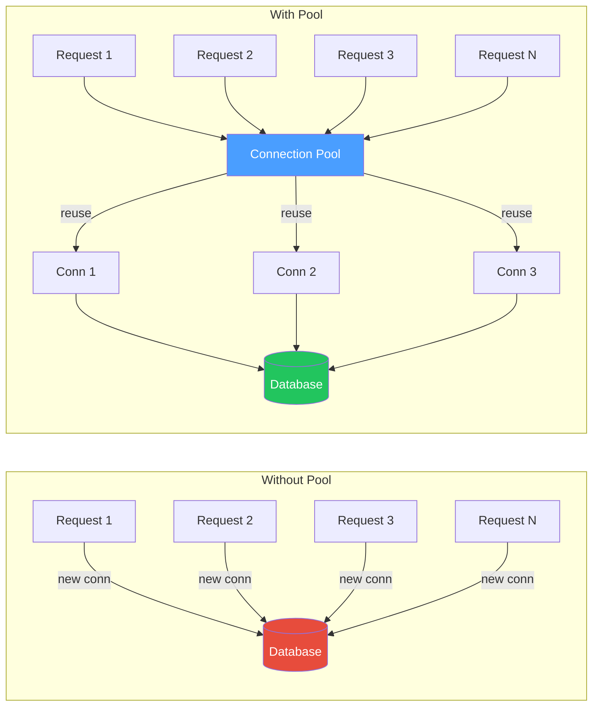
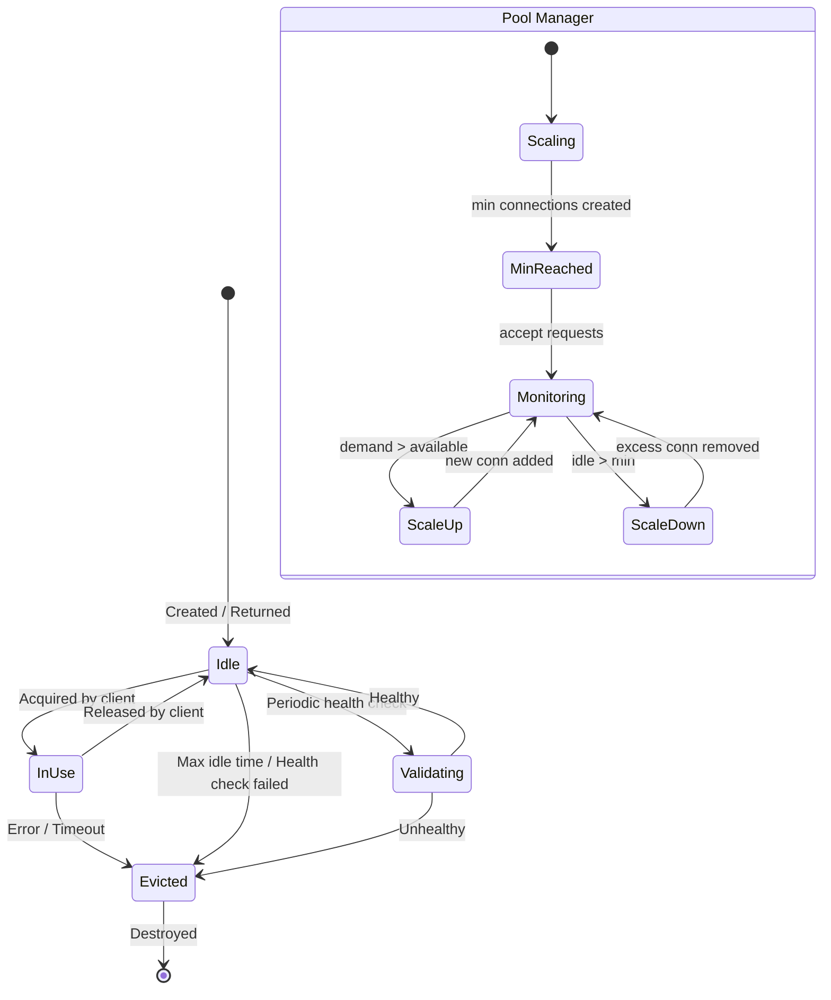
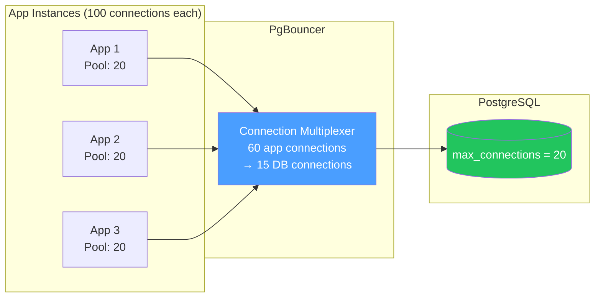

# Connection Pooling — Pool Lifecycle, Sizing, Leak Detection & Monitoring

## Table of Contents

- [Why Connection Pooling](#why-connection-pooling)
- [Pool Lifecycle](#pool-lifecycle)
- [Pool Sizing with Little's Law](#pool-sizing-with-littles-law)
- [Database Connection Pooling](#database-connection-pooling)
- [HTTP Connection Pooling](#http-connection-pooling)
- [Connection Leak Detection](#connection-leak-detection)
- [Pool Monitoring](#pool-monitoring)
- [Comparison Tables](#comparison-tables)
- [Code Examples](#code-examples)
- [Interview Q&A](#interview-qa)

---

## Why Connection Pooling

Creating a new database connection involves TCP handshake, TLS negotiation, authentication, and session setup — typically 20-50ms per connection. Under load (e.g., 1000 requests/sec), creating a fresh connection per request would:

1. Add 20-50ms latency per request.
2. Overwhelm the database with connection overhead.
3. Hit OS file descriptor limits.
4. Cause TCP port exhaustion.

A connection pool maintains a set of **pre-established, reusable connections** that requests borrow and return.



---

## Pool Lifecycle



### Connection States

| State | Description |
|-------|-------------|
| **Creating** | TCP + TLS + Auth handshake in progress |
| **Idle** | Connected, in pool, available for checkout |
| **In Use** | Checked out by a client, executing queries |
| **Validating** | Health check in progress (e.g., `SELECT 1`) |
| **Evicted** | Marked for removal due to error, timeout, or max lifetime |
| **Destroyed** | TCP connection closed, resources freed |

### Pool Configuration Parameters

| Parameter | Description | Typical Default | Guidance |
|-----------|-------------|----------------|----------|
| `min` | Minimum idle connections | 0-2 | Set to expected baseline concurrency |
| `max` | Maximum total connections | 10-20 | Use Little's Law (see below) |
| `acquireTimeoutMs` | Max wait time to get a connection | 10,000ms | Match your request timeout |
| `idleTimeoutMs` | How long idle conn stays in pool | 30,000ms | Balance resource usage vs latency |
| `connectionTimeoutMs` | Max time to establish new conn | 5,000ms | Depends on network latency |
| `maxLifetimeMs` | Max age of a connection | 1,800,000ms (30min) | Prevents stale connections |
| `validationInterval` | How often to health-check idle conns | 30,000ms | Lower = more reliable, higher overhead |

---

## Pool Sizing with Little's Law

**Little's Law**: `L = λ × W`

Where:
- **L** = average number of items in the system (pool size needed)
- **λ** (lambda) = average arrival rate (requests per second)
- **W** = average time each request holds a connection (seconds)

### Example Calculation

```
Given:
  - 500 requests/sec to the database
  - Average query takes 20ms (0.02 seconds)
  - Each request does 2 queries sequentially

Connection hold time (W) = 2 × 0.02 = 0.04 seconds

Pool size (L) = λ × W = 500 × 0.04 = 20 connections

Add 20-30% headroom for variance: ~25 connections
```

### Pool Size Formula with Safety Margin

```typescript
function calculatePoolSize(params: {
  requestsPerSecond: number;
  avgQueryTimeMs: number;
  queriesPerRequest: number;
  safetyMarginPercent: number;
}): number {
  const { requestsPerSecond, avgQueryTimeMs, queriesPerRequest, safetyMarginPercent } = params;
  const holdTimeSeconds = (avgQueryTimeMs * queriesPerRequest) / 1000;
  const baseSize = requestsPerSecond * holdTimeSeconds;
  const withMargin = baseSize * (1 + safetyMarginPercent / 100);
  return Math.ceil(withMargin);
}

// Example:
const poolSize = calculatePoolSize({
  requestsPerSecond: 500,
  avgQueryTimeMs: 20,
  queriesPerRequest: 2,
  safetyMarginPercent: 25,
});
// Result: 25
```

### Important Constraints

| Factor | Impact |
|--------|--------|
| **Database max connections** | PostgreSQL default: 100. Divide among all app instances. |
| **CPU cores on DB server** | More connections than cores = context switching overhead |
| **pgBouncer / ProxySQL** | External poolers allow app-side pools to be larger |
| **Cloud DB limits** | RDS limits vary by instance size (e.g., db.t3.micro = 66 max) |

**Rule of thumb from HikariCP docs:**

```
connections = (core_count * 2) + effective_spindle_count
```

For SSD-backed databases: `connections ≈ core_count * 2` (since spindle count is 0 for SSDs).

A 4-core database server needs about **10 connections** — not 100. More connections often means **worse** performance due to contention.

---

## Database Connection Pooling

### Node.js with pg (PostgreSQL)

```typescript
import { Pool, PoolConfig, PoolClient } from "pg";

const poolConfig: PoolConfig = {
  host: process.env.DB_HOST,
  port: parseInt(process.env.DB_PORT || "5432"),
  database: process.env.DB_NAME,
  user: process.env.DB_USER,
  password: process.env.DB_PASSWORD,

  // Pool sizing
  min: 2,                        // Keep 2 idle connections warm
  max: 20,                       // Maximum 20 connections
  idleTimeoutMillis: 30_000,     // Close idle connections after 30s
  connectionTimeoutMillis: 5_000, // Fail if connection takes > 5s

  // Statement timeout for safety
  statement_timeout: 30_000,      // Kill queries after 30s
};

const pool = new Pool(poolConfig);

// Event monitoring
pool.on("connect", (client: PoolClient) => {
  console.log("New connection established");
});

pool.on("acquire", (client: PoolClient) => {
  console.log("Connection acquired from pool");
});

pool.on("remove", (client: PoolClient) => {
  console.log("Connection removed from pool");
});

pool.on("error", (err: Error) => {
  console.error("Unexpected pool error:", err);
});

// Usage patterns

// Pattern 1: Simple query (auto-checkout/return)
async function getUser(id: string) {
  const { rows } = await pool.query("SELECT * FROM users WHERE id = $1", [id]);
  return rows[0];
}

// Pattern 2: Transaction (manual checkout)
async function transferFunds(fromId: string, toId: string, amount: number) {
  const client = await pool.connect(); // Checkout
  try {
    await client.query("BEGIN");
    await client.query(
      "UPDATE accounts SET balance = balance - $1 WHERE id = $2",
      [amount, fromId]
    );
    await client.query(
      "UPDATE accounts SET balance = balance + $1 WHERE id = $2",
      [amount, toId]
    );
    await client.query("COMMIT");
  } catch (err) {
    await client.query("ROLLBACK");
    throw err;
  } finally {
    client.release(); // ALWAYS return to pool
  }
}
```

### External Connection Pooling with PgBouncer



PgBouncer modes:

| Mode | Description | Best For |
|------|-------------|----------|
| **Session** | 1:1 mapping for session lifetime | Connection-specific state (LISTEN/NOTIFY, prepared statements) |
| **Transaction** | Return to pool after each transaction | Most applications (recommended) |
| **Statement** | Return after each statement | Simple queries, no multi-statement transactions |

---

## HTTP Connection Pooling

### Node.js HTTP Agent

```typescript
import http from "http";
import https from "https";

// Custom HTTP agent with connection pooling
const httpAgent = new http.Agent({
  keepAlive: true,          // Reuse connections
  keepAliveMsecs: 60_000,  // TCP keepalive interval
  maxSockets: 50,           // Max connections per host
  maxFreeSockets: 10,       // Max idle connections per host
  timeout: 30_000,          // Socket timeout
});

const httpsAgent = new https.Agent({
  keepAlive: true,
  maxSockets: 50,
  maxFreeSockets: 10,
  // TLS-specific
  rejectUnauthorized: true,
  minVersion: "TLSv1.2",
});

// Using with fetch (Node 18+)
const response = await fetch("https://api.example.com/data", {
  agent: httpsAgent, // Reuses connections from the pool
} as any);
```

### Connection Pool for External Service Calls

```typescript
import axios, { AxiosInstance } from "axios";
import https from "https";

function createApiClient(baseURL: string): AxiosInstance {
  const agent = new https.Agent({
    keepAlive: true,
    maxSockets: 25,           // Per host
    maxFreeSockets: 5,
    timeout: 10_000,
    scheduling: "lifo",       // Reuse most recent connection (better for idle timeout)
  });

  return axios.create({
    baseURL,
    timeout: 10_000,
    httpsAgent: agent,
    // Connection-level headers
    headers: {
      Connection: "keep-alive",
    },
  });
}

const paymentClient = createApiClient("https://payment-api.example.com");
const notificationClient = createApiClient("https://notify.example.com");
```

---

## Connection Leak Detection

A **connection leak** occurs when a checked-out connection is never returned to the pool. Over time, this exhausts the pool.

### Common Causes

1. Missing `client.release()` in error paths.
2. Unhandled promise rejections.
3. Long-running queries without timeouts.
4. Forgetting to call `release()` when using manual checkout.

### Leak Detection Implementation

```typescript
import { Pool, PoolClient } from "pg";

class MonitoredPool {
  private pool: Pool;
  private activeConnections = new Map<PoolClient, { stack: string; acquiredAt: number }>();
  private leakCheckInterval: NodeJS.Timeout;

  constructor(config: any) {
    this.pool = new Pool(config);

    // Check for leaks every 30 seconds
    this.leakCheckInterval = setInterval(() => this.checkForLeaks(), 30_000);
  }

  async connect(): Promise<PoolClient> {
    const client = await this.pool.connect();
    const stack = new Error().stack || "unknown";
    const acquiredAt = Date.now();

    this.activeConnections.set(client, { stack, acquiredAt });

    // Wrap release to track returns
    const originalRelease = client.release.bind(client);
    client.release = (err?: Error | boolean) => {
      this.activeConnections.delete(client);
      return originalRelease(err);
    };

    return client;
  }

  private checkForLeaks(): void {
    const now = Date.now();
    const LEAK_THRESHOLD_MS = 60_000; // 1 minute

    for (const [client, info] of this.activeConnections) {
      const heldFor = now - info.acquiredAt;
      if (heldFor > LEAK_THRESHOLD_MS) {
        console.warn(
          `[POOL LEAK] Connection held for ${heldFor}ms.\n` +
          `Acquired at:\n${info.stack}`
        );
      }
    }

    // Log pool stats
    console.log({
      total: this.pool.totalCount,
      idle: this.pool.idleCount,
      waiting: this.pool.waitingCount,
      active: this.activeConnections.size,
    });
  }

  async query(text: string, params?: unknown[]) {
    return this.pool.query(text, params);
  }

  async end(): Promise<void> {
    clearInterval(this.leakCheckInterval);
    await this.pool.end();
  }
}
```

---

## Pool Monitoring

### Key Metrics to Track

| Metric | What It Tells You | Alert Threshold |
|--------|-------------------|-----------------|
| `pool.totalCount` | Total connections (idle + in-use) | Near `max` = scaling issue |
| `pool.idleCount` | Available connections | 0 = all connections busy |
| `pool.waitingCount` | Requests waiting for a connection | > 0 for extended period = pool too small |
| Checkout latency | Time to acquire a connection | > 100ms = contention |
| Connection lifetime | How long connections live | Abnormally short = instability |
| Query duration | Time per query | p99 > threshold = slow queries |

### Prometheus Metrics Integration

```typescript
import { Pool } from "pg";
import { Gauge, Histogram, Counter, Registry } from "prom-client";

class InstrumentedPool {
  private pool: Pool;
  private metrics: {
    totalConnections: Gauge;
    idleConnections: Gauge;
    waitingRequests: Gauge;
    checkoutDuration: Histogram;
    queryDuration: Histogram;
    errors: Counter;
  };

  constructor(config: any, registry: Registry) {
    this.pool = new Pool(config);

    this.metrics = {
      totalConnections: new Gauge({
        name: "db_pool_total_connections",
        help: "Total number of connections in pool",
        registers: [registry],
      }),
      idleConnections: new Gauge({
        name: "db_pool_idle_connections",
        help: "Number of idle connections",
        registers: [registry],
      }),
      waitingRequests: new Gauge({
        name: "db_pool_waiting_requests",
        help: "Number of requests waiting for a connection",
        registers: [registry],
      }),
      checkoutDuration: new Histogram({
        name: "db_pool_checkout_duration_ms",
        help: "Time to acquire a connection from pool",
        buckets: [1, 5, 10, 25, 50, 100, 250, 500, 1000],
        registers: [registry],
      }),
      queryDuration: new Histogram({
        name: "db_query_duration_ms",
        help: "Query execution time",
        buckets: [1, 5, 10, 25, 50, 100, 250, 500, 1000, 5000],
        registers: [registry],
      }),
      errors: new Counter({
        name: "db_pool_errors_total",
        help: "Total pool errors",
        labelNames: ["type"],
        registers: [registry],
      }),
    };

    // Collect pool stats every 5 seconds
    setInterval(() => {
      this.metrics.totalConnections.set(this.pool.totalCount);
      this.metrics.idleConnections.set(this.pool.idleCount);
      this.metrics.waitingRequests.set(this.pool.waitingCount);
    }, 5_000);

    this.pool.on("error", () => {
      this.metrics.errors.inc({ type: "pool_error" });
    });
  }

  async query(text: string, params?: unknown[]) {
    const checkoutStart = Date.now();
    const client = await this.pool.connect();
    this.metrics.checkoutDuration.observe(Date.now() - checkoutStart);

    const queryStart = Date.now();
    try {
      const result = await client.query(text, params);
      this.metrics.queryDuration.observe(Date.now() - queryStart);
      return result;
    } catch (err) {
      this.metrics.errors.inc({ type: "query_error" });
      throw err;
    } finally {
      client.release();
    }
  }
}
```

---

## Comparison Tables

### Database Pool Libraries for Node.js

| Library | Database | Features | Notes |
|---------|----------|----------|-------|
| **pg (node-postgres)** | PostgreSQL | Built-in pool, event hooks | Most popular for Postgres |
| **mysql2** | MySQL | Built-in pool, prepared statements | Successor to mysql |
| **knex** | Multiple | Query builder + pool (via tarn.js) | Good abstraction layer |
| **TypeORM** | Multiple | ORM + pool management | Higher-level, more overhead |
| **Prisma** | Multiple | Connection pool built-in | Managed via connection string params |
| **generic-pool** | Any | Generic pool factory | Use for custom resources (SMTP, etc.) |

### Pool Sizing Quick Reference

| Scenario | Pool Size | Reasoning |
|----------|-----------|-----------|
| Single app, 4-core DB | 10 | `cores * 2 + 2` |
| 5 app instances, 4-core DB | 2 each (10 total) | Divide DB capacity across instances |
| With PgBouncer | 50 per app | PgBouncer multiplexes to fewer DB conns |
| High-latency queries (100ms avg) | 50+ | `L = λ × W` with larger W |
| Microservice (low traffic) | 3-5 | Small footprint, fast enough |

---

## Interview Q&A

> **Q1: How do you determine the optimal connection pool size?**
>
> Start with Little's Law: `Pool Size = Requests/sec x Avg Hold Time`. For a service handling 200 req/s with 25ms average query time and 2 queries per request, that's `200 x 0.05 = 10` connections, plus 20-30% headroom = ~13. But also consider: (1) Database CPU cores — more connections than `cores * 2` causes contention. (2) Number of application instances sharing the DB. (3) Tail latency — p99 query time may need larger pools. Always load test and measure. Too many connections is worse than too few — it causes DB CPU thrashing from context switching.

> **Q2: What happens when the connection pool is exhausted?**
>
> Requests queue up waiting for a connection. If the wait exceeds `acquireTimeoutMs`, the request fails with a timeout error. Symptoms: (1) Latency spikes across all endpoints. (2) Cascading failures — as wait times increase, more connections are held longer (because HTTP request timeouts haven't fired yet), making the problem worse. (3) Eventually, upstream load balancers or clients timeout. Solutions: set reasonable `acquireTimeoutMs`, implement circuit breakers, shed load early, and increase pool size if the DB can handle it.

> **Q3: How do you detect and fix connection leaks?**
>
> Detection: (1) Monitor `pool.waitingCount` — if it grows over time, connections aren't being returned. (2) Track checkout/checkin pairs with stack traces. (3) Set `connectionTimeoutMillis` aggressively so leaks surface as errors quickly. (4) Use the leak detection pattern: record acquisition time and stack trace, log warnings for connections held beyond a threshold. Fixing: (1) Always use try/finally for `client.release()`. (2) Use wrapper functions like `pool.query()` that auto-release. (3) Set `statement_timeout` in PostgreSQL to kill runaway queries. (4) Use `idle_in_transaction_session_timeout` to auto-close idle transactions.

> **Q4: What is PgBouncer and when would you use it?**
>
> PgBouncer is an external connection pooler for PostgreSQL that sits between your application and the database. It multiplexes many application connections to a smaller number of database connections. Use it when: (1) You have many application instances (e.g., 20 pods x 20 connections = 400, but DB handles 100). (2) You want connection reuse across application restarts/deployments. (3) You need to enforce connection limits centrally. In transaction pooling mode, connections are returned to the pool after each transaction, achieving high multiplexing ratios (e.g., 400 app connections to 20 DB connections).

> **Q5: Explain the difference between connection pool sizing for OLTP vs OLAP workloads.**
>
> OLTP (transactional) workloads have short queries (1-50ms) and high request rates. Pool size is driven by concurrency: `L = λ x W` with small W, so pools are moderate (10-30). Connections are checked out briefly. OLAP (analytical) workloads have long queries (seconds to minutes) with lower request rates. Each connection is held much longer, so you need fewer but longer-lived connections. The key insight: a small OLTP pool (10 connections) can serve 1000 req/s if queries are fast, while an OLAP query holding a connection for 30 seconds at 10 req/s needs 300 connections. This is why OLAP workloads should use separate pools or even separate database replicas.

> **Q6: How does HTTP keep-alive connection pooling differ from database connection pooling?**
>
> HTTP keep-alive pools TCP connections to reduce handshake overhead (TCP + TLS = 2-4 round trips). Unlike database pools, HTTP pools are per-host (separate pool for each domain). Key differences: (1) HTTP connections are stateless — any request can use any pooled connection. Database connections may have session state (prepared statements, transaction context). (2) HTTP pools use LIFO scheduling (reuse most-recent connection) to allow idle connections to naturally timeout. Database pools often use FIFO. (3) HTTP/2 multiplexes multiple requests on one connection, reducing the need for large pools. (4) HTTP pools don't need validation queries — the protocol handles connection health via keep-alive probes.
