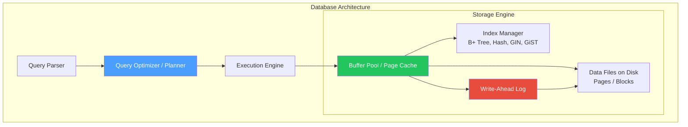
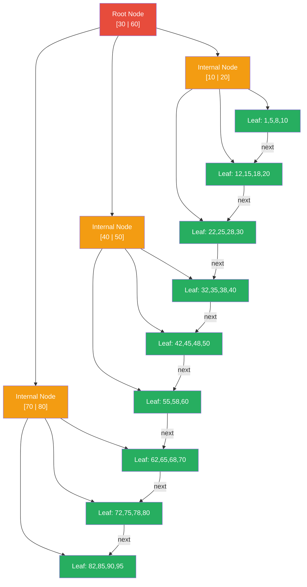
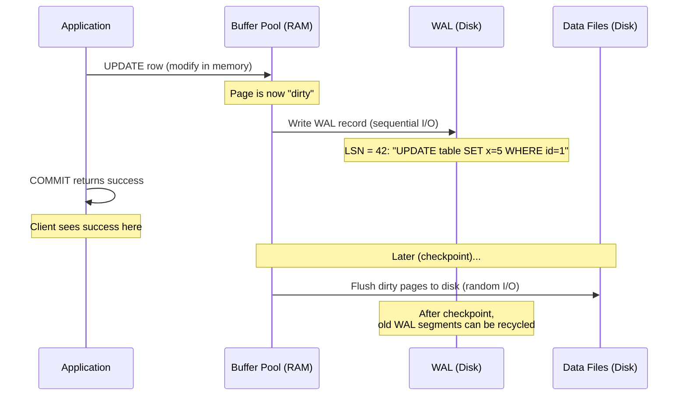
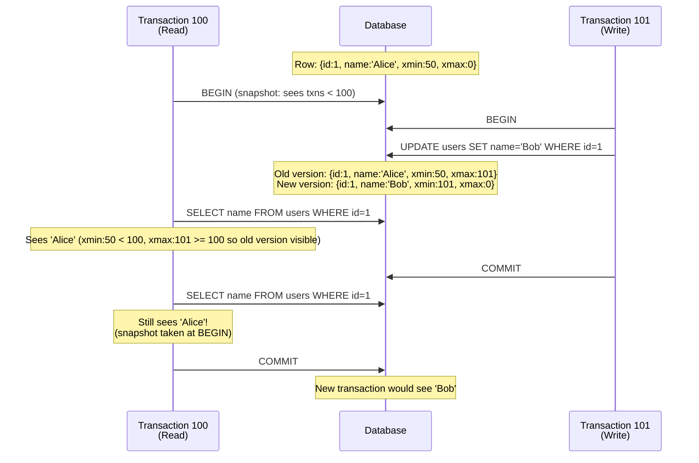
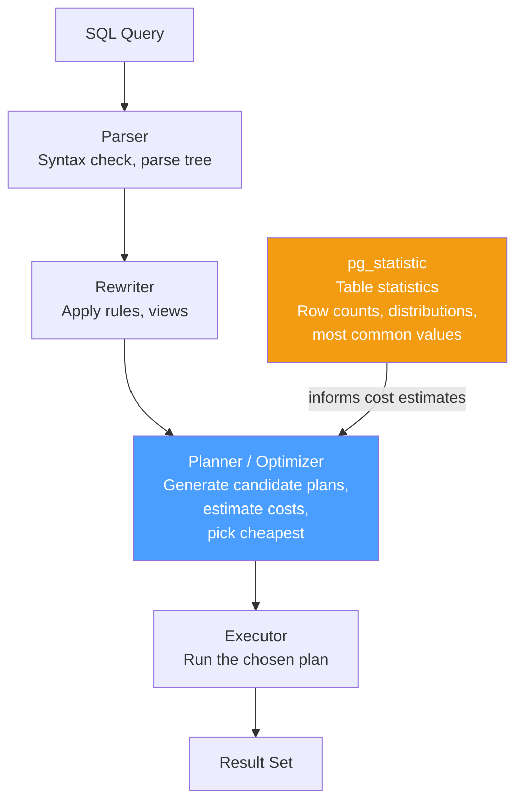

# Database Internals — B+ Trees, WAL, MVCC, Query Planners & EXPLAIN ANALYZE

## Table of Contents

- [Storage Engines](#storage-engines)
- [B+ Tree Indexes](#b-tree-indexes)
- [Index Types](#index-types)
- [Write-Ahead Logging (WAL)](#write-ahead-logging-wal)
- [MVCC (Multi-Version Concurrency Control)](#mvcc-multi-version-concurrency-control)
- [Transaction Isolation Levels](#transaction-isolation-levels)
- [Query Planners and Optimization](#query-planners-and-optimization)
- [EXPLAIN ANALYZE Deep Dive](#explain-analyze-deep-dive)
- [Comparison Tables](#comparison-tables)
- [Code Examples](#code-examples)
- [Interview Q&A](#interview-qa)

---

## Storage Engines

A storage engine determines how data is physically stored, indexed, and retrieved.



### Page-Based Storage

Databases store data in fixed-size **pages** (typically 8KB in PostgreSQL, 16KB in InnoDB).

| Concept | Description |
|---------|-------------|
| **Page** | Fixed-size block of data (8KB default in Postgres) |
| **Tuple/Row** | Individual record stored within a page |
| **Heap** | Unordered collection of pages containing table data |
| **TOAST** | Oversized attribute storage for values > 2KB (Postgres) |
| **Buffer Pool** | In-memory cache of frequently accessed pages |
| **Dirty Page** | Modified page in buffer pool not yet written to disk |

---

## B+ Tree Indexes

The B+ tree is the **default index structure** in virtually all relational databases. It provides O(log n) lookups, range scans, and ordered traversal.

### Structure



### B+ Tree Properties

| Property | Description |
|----------|-------------|
| **All data in leaves** | Internal nodes only store keys + child pointers |
| **Leaves are linked** | Doubly-linked list for efficient range scans |
| **Balanced** | All leaf nodes at the same depth |
| **High fan-out** | Each node holds many keys (hundreds), keeping tree shallow |
| **Typical depth** | 3-4 levels for millions of rows |

### B+ Tree vs B-Tree

| Feature | B-Tree | B+ Tree |
|---------|--------|---------|
| Data storage | In all nodes | Only in leaf nodes |
| Leaf linking | No | Yes (linked list) |
| Range queries | Requires tree traversal | Sequential scan of leaves |
| Fan-out | Lower (data in internal nodes) | Higher (internal nodes smaller) |
| Used by | Few modern DBs | PostgreSQL, MySQL, most RDBMS |

### Why B+ Trees Win for Databases

For a table with 10 million rows on an 8KB page that fits ~500 keys:
- **Depth**: `log₅₀₀(10,000,000) ≈ 3` levels
- **Lookup**: 3 page reads = 3 disk seeks ≈ 0.03ms with SSD
- **Range scan**: Find start in 3 hops, then sequential leaf traversal

---

## Index Types

| Index Type | Structure | Best For | Example |
|------------|-----------|----------|---------|
| **B+ Tree** | Balanced tree | Equality, range, ordering, prefix matching | `CREATE INDEX idx ON users(email)` |
| **Hash** | Hash table | Equality only (no ranges) | `CREATE INDEX idx ON users USING hash(email)` |
| **GIN** | Inverted index | Full-text search, JSONB, arrays | `CREATE INDEX idx ON docs USING gin(content)` |
| **GiST** | Generalized search tree | Geometric, range types, nearest-neighbor | `CREATE INDEX idx ON locations USING gist(point)` |
| **BRIN** | Block range | Large naturally ordered tables (time-series) | `CREATE INDEX idx ON events USING brin(created_at)` |
| **Partial** | B+ Tree (filtered) | Subset of rows | `CREATE INDEX idx ON orders(status) WHERE status = 'pending'` |
| **Covering** | B+ Tree + included cols | Index-only scans | `CREATE INDEX idx ON users(email) INCLUDE (name)` |

### Composite Index Ordering Matters

```sql
-- Index on (country, city, zip)
CREATE INDEX idx_location ON addresses(country, city, zip);

-- These queries USE the index:
SELECT * FROM addresses WHERE country = 'US';                              -- leftmost prefix
SELECT * FROM addresses WHERE country = 'US' AND city = 'NYC';           -- two leftmost
SELECT * FROM addresses WHERE country = 'US' AND city = 'NYC' AND zip = '10001'; -- full match

-- These queries CANNOT use the index efficiently:
SELECT * FROM addresses WHERE city = 'NYC';           -- skips leftmost column
SELECT * FROM addresses WHERE zip = '10001';          -- skips two leftmost
SELECT * FROM addresses WHERE city = 'NYC' AND zip = '10001'; -- no leading column
```

---

## Write-Ahead Logging (WAL)

WAL ensures **durability** — committed transactions survive crashes. The rule: **write the log before writing the data**.



### Why WAL Works

| Aspect | Without WAL | With WAL |
|--------|-------------|----------|
| Write pattern | Random I/O (update pages in-place) | Sequential I/O (append to log) |
| Crash safety | Partial writes corrupt data | Replay log to recover |
| Performance | Slow (random writes) | Fast (sequential writes) |
| Durability | Must flush every page on commit | Only flush WAL record on commit |

### WAL Key Concepts

| Concept | Description |
|---------|-------------|
| **LSN** (Log Sequence Number) | Monotonically increasing ID for each WAL record |
| **Checkpoint** | Flush all dirty pages to disk; WAL before this point can be recycled |
| **WAL segment** | Fixed-size file (16MB default in Postgres) |
| **Full-page write** | On first modification after checkpoint, write entire page to WAL (prevents torn pages) |
| **WAL archiving** | Ship WAL segments for point-in-time recovery (PITR) and replication |

---

## MVCC (Multi-Version Concurrency Control)

MVCC allows **readers and writers to not block each other** by maintaining multiple versions of each row.

### How PostgreSQL MVCC Works

Every row has hidden system columns:
- `xmin` — Transaction ID that created this row version
- `xmax` — Transaction ID that deleted/updated this row version (0 if active)



### MVCC Implications

| Aspect | Detail |
|--------|--------|
| **No read locks** | Readers never block writers, writers never block readers |
| **Snapshot isolation** | Each transaction sees a consistent snapshot |
| **Dead tuples** | Old row versions must be cleaned up by VACUUM |
| **Bloat** | Without VACUUM, tables and indexes grow indefinitely |
| **VACUUM** | Reclaims space from dead tuples, updates visibility map |
| **autovacuum** | Background process that runs VACUUM automatically |

---

## Transaction Isolation Levels

| Level | Dirty Read | Non-Repeatable Read | Phantom Read | Serialization Anomaly |
|-------|:----------:|:-------------------:|:------------:|:--------------------:|
| **Read Uncommitted** | Possible | Possible | Possible | Possible |
| **Read Committed** (PG default) | No | Possible | Possible | Possible |
| **Repeatable Read** | No | No | No* | Possible |
| **Serializable** | No | No | No | No |

*PostgreSQL's Repeatable Read actually prevents phantom reads too (it uses snapshot isolation).

### Anomaly Definitions

| Anomaly | Description | Example |
|---------|-------------|---------|
| **Dirty Read** | Read uncommitted data from another transaction | T1 writes, T2 reads it, T1 rolls back |
| **Non-Repeatable Read** | Same query returns different values | T1 reads row, T2 updates + commits, T1 reads again — different |
| **Phantom Read** | Same query returns different set of rows | T1 counts rows, T2 inserts, T1 counts again — different |
| **Serialization Anomaly** | Result differs from any serial execution | Write skew, read-only anomaly |

```typescript
// Setting isolation level in Node.js
async function serializableTransaction(pool: Pool): Promise<void> {
  const client = await pool.connect();
  try {
    await client.query("BEGIN ISOLATION LEVEL SERIALIZABLE");

    // All reads in this transaction see a consistent snapshot
    // If a conflict is detected, Postgres throws serialization_failure
    const { rows } = await client.query("SELECT * FROM inventory WHERE item_id = $1", [42]);

    if (rows[0].quantity > 0) {
      await client.query(
        "UPDATE inventory SET quantity = quantity - 1 WHERE item_id = $1",
        [42]
      );
    }

    await client.query("COMMIT");
  } catch (err: any) {
    await client.query("ROLLBACK");
    if (err.code === "40001") {
      // Serialization failure — retry the transaction
      return serializableTransaction(pool);
    }
    throw err;
  } finally {
    client.release();
  }
}
```

---

## Query Planners and Optimization

The query planner (optimizer) transforms a SQL query into an execution plan. PostgreSQL uses a **cost-based optimizer**.

### How the Planner Decides



### Scan Types

| Scan Type | When Used | Cost |
|-----------|-----------|------|
| **Sequential Scan** | No useful index, or most rows needed | O(n) — reads every page |
| **Index Scan** | Selective query with matching index | O(log n + k) — tree lookup + fetch rows |
| **Index-Only Scan** | All needed columns in the index | O(log n + k) — no heap access |
| **Bitmap Index Scan** | Multiple index conditions, moderate selectivity | Build bitmap, then sequential scan matching pages |
| **TID Scan** | Direct tuple ID access | O(1) — used for CTID lookups |

### Join Algorithms

| Algorithm | When Used | Complexity |
|-----------|-----------|------------|
| **Nested Loop** | Small inner table, indexed inner table | O(n * m), fast with index on inner |
| **Hash Join** | Equality joins, larger tables | O(n + m), needs memory for hash table |
| **Merge Join** | Sorted inputs, equality/range joins | O(n log n + m log m), or O(n + m) if pre-sorted |

### Statistics and ANALYZE

```sql
-- Update statistics for the planner
ANALYZE users;

-- View statistics
SELECT
  tablename,
  attname,
  n_distinct,
  most_common_vals,
  most_common_freqs,
  correlation
FROM pg_stats
WHERE tablename = 'users'
  AND attname = 'status';
```

---

## EXPLAIN ANALYZE Deep Dive

`EXPLAIN` shows the plan. `EXPLAIN ANALYZE` **actually runs the query** and shows real timing.

### Reading EXPLAIN ANALYZE Output

```sql
EXPLAIN (ANALYZE, BUFFERS, FORMAT TEXT)
SELECT u.name, COUNT(o.id) as order_count
FROM users u
JOIN orders o ON o.user_id = u.id
WHERE u.created_at > '2025-01-01'
GROUP BY u.name
ORDER BY order_count DESC
LIMIT 10;
```

```
Limit  (cost=1234.56..1234.58 rows=10 width=40) (actual time=45.2..45.3 rows=10 loops=1)
  ->  Sort  (cost=1234.56..1240.00 rows=2178 width=40) (actual time=45.2..45.2 rows=10 loops=1)
        Sort Key: (count(o.id)) DESC
        Sort Method: top-N heapsort  Memory: 25kB
        ->  HashAggregate  (cost=1180.00..1201.78 rows=2178 width=40) (actual time=42.1..43.8 rows=2178 loops=1)
              Group Key: u.name
              Batches: 1  Memory Usage: 369kB
              ->  Hash Join  (cost=85.00..1090.00 rows=18000 width=36) (actual time=5.2..35.0 rows=18234 loops=1)
                    Hash Cond: (o.user_id = u.id)
                    ->  Seq Scan on orders o  (cost=0.00..750.00 rows=50000 width=12) (actual time=0.01..12.0 rows=50000 loops=1)
                          Buffers: shared hit=400 read=50
                    ->  Hash  (cost=70.00..70.00 rows=1200 width=32) (actual time=4.8..4.8 rows=1245 loops=1)
                          Buckets: 2048  Memory Usage: 85kB
                          ->  Index Scan using idx_users_created on users u  (cost=0.29..70.00 rows=1200 width=32) (actual time=0.05..3.5 rows=1245 loops=1)
                                Index Cond: (created_at > '2025-01-01'::date)
                                Buffers: shared hit=50
Planning Time: 0.5ms
Execution Time: 45.5ms
```

### Key Fields Explained

| Field | Meaning |
|-------|---------|
| `cost=start..total` | Estimated cost (arbitrary units). Start = startup cost, Total = total including output. |
| `rows=N` | Estimated rows output by this node |
| `width=N` | Estimated average row width in bytes |
| `actual time=start..end` | Real time in milliseconds |
| `rows=N` (actual) | Real number of rows — compare with estimate! |
| `loops=N` | How many times this node was executed |
| `Buffers: shared hit=N` | Pages found in buffer pool (cache hit) |
| `Buffers: shared read=N` | Pages read from disk (cache miss) |

### Red Flags in EXPLAIN ANALYZE

| Red Flag | Symptom | Fix |
|----------|---------|-----|
| **Row estimate way off** | `rows=100` estimated, `rows=100000` actual | Run `ANALYZE`; add extended statistics |
| **Sequential scan on large table** | `Seq Scan` with high cost | Add an appropriate index |
| **Nested loop with large outer** | Huge `loops=N` on inner | Consider hash/merge join (may need more `work_mem`) |
| **Sort spills to disk** | `Sort Method: external merge Disk: XXkB` | Increase `work_mem` |
| **Low buffer cache hit ratio** | Many `shared read` vs `shared hit` | Increase `shared_buffers` or improve index |

---

## Comparison Tables

### PostgreSQL vs MySQL (InnoDB) Internals

| Feature | PostgreSQL | MySQL (InnoDB) |
|---------|-----------|----------------|
| **Default index** | B+ Tree | B+ Tree (clustered on PK) |
| **MVCC** | Heap tuples + xmin/xmax | Undo log + rollback segments |
| **Clustering** | Heap (no clustered index) | Clustered on primary key |
| **VACUUM needed** | Yes (dead tuple cleanup) | No (undo log manages versions) |
| **WAL** | WAL (16MB segments) | Redo log + doublewrite buffer |
| **Default isolation** | Read Committed | Repeatable Read |
| **Query planner** | Cost-based, single plan | Cost-based, limited join orders |
| **JSONB support** | Native with GIN indexes | JSON type (less efficient) |

### Index Selection Guide

| Query Pattern | Recommended Index |
|--------------|-------------------|
| `WHERE email = 'x'` | B+ Tree on `email` (or Hash) |
| `WHERE created_at > '2025-01-01'` | B+ Tree on `created_at` |
| `WHERE status = 'active' AND country = 'US'` | Composite B+ Tree on `(status, country)` |
| `WHERE tags @> '{node,typescript}'` | GIN on `tags` |
| `WHERE document @@ to_tsquery('search term')` | GIN on `document` (tsvector) |
| `WHERE ST_DWithin(location, point, 1000)` | GiST on `location` |
| Time-series `WHERE timestamp > X` (naturally ordered) | BRIN on `timestamp` |
| `WHERE status = 'pending'` (only 1% of rows) | Partial B+ Tree `WHERE status = 'pending'` |

---

## Code Examples

### Analyzing Query Performance in Node.js

```typescript
import { Pool, QueryResult } from "pg";

interface ExplainResult {
  "QUERY PLAN": string;
}

async function analyzeQuery(
  pool: Pool,
  query: string,
  params: unknown[]
): Promise<{
  plan: string;
  executionTimeMs: number;
  rowsReturned: number;
  bufferHits: number;
  bufferReads: number;
}> {
  const explainQuery = `EXPLAIN (ANALYZE, BUFFERS, FORMAT JSON) ${query}`;
  const result: QueryResult = await pool.query(explainQuery, params);
  const plan = result.rows[0]["QUERY PLAN"][0];

  return {
    plan: JSON.stringify(plan, null, 2),
    executionTimeMs: plan.Plan["Actual Total Time"],
    rowsReturned: plan.Plan["Actual Rows"],
    bufferHits: plan.Plan["Shared Hit Blocks"] || 0,
    bufferReads: plan.Plan["Shared Read Blocks"] || 0,
  };
}

// Usage
const analysis = await analyzeQuery(
  pool,
  "SELECT * FROM orders WHERE user_id = $1 AND status = $2",
  [123, "pending"]
);

console.log(`Execution time: ${analysis.executionTimeMs}ms`);
console.log(`Buffer hit ratio: ${
  analysis.bufferHits / (analysis.bufferHits + analysis.bufferReads) * 100
}%`);
```

### Index Monitoring Queries

```typescript
// Find unused indexes
const unusedIndexes = await pool.query(`
  SELECT
    schemaname,
    tablename,
    indexname,
    idx_scan as times_used,
    pg_size_pretty(pg_relation_size(indexrelid)) as index_size
  FROM pg_stat_user_indexes
  WHERE idx_scan = 0
    AND indexrelid NOT IN (
      SELECT conindid FROM pg_constraint WHERE contype IN ('p', 'u')
    )
  ORDER BY pg_relation_size(indexrelid) DESC;
`);

// Find missing indexes (sequential scans on large tables)
const missingIndexes = await pool.query(`
  SELECT
    relname as table_name,
    seq_scan,
    seq_tup_read,
    idx_scan,
    seq_tup_read / GREATEST(seq_scan, 1) as avg_rows_per_scan,
    pg_size_pretty(pg_relation_size(relid)) as table_size
  FROM pg_stat_user_tables
  WHERE seq_scan > 100
    AND seq_tup_read > 10000
    AND idx_scan < seq_scan
  ORDER BY seq_tup_read DESC;
`);

// Table bloat estimation
const bloat = await pool.query(`
  SELECT
    relname as table_name,
    n_live_tup as live_tuples,
    n_dead_tup as dead_tuples,
    ROUND(n_dead_tup::numeric / GREATEST(n_live_tup, 1) * 100, 2) as dead_pct,
    last_autovacuum
  FROM pg_stat_user_tables
  WHERE n_dead_tup > 1000
  ORDER BY n_dead_tup DESC;
`);
```

---

## Interview Q&A

> **Q1: Why does PostgreSQL use B+ trees instead of hash indexes by default?**
>
> B+ trees support equality lookups, range queries (`>`, `<`, `BETWEEN`), ordering (`ORDER BY`), and prefix matching (`LIKE 'abc%'`). Hash indexes only support equality. Additionally, B+ tree leaf nodes are linked, enabling efficient sequential scans for range queries. Hash indexes in PostgreSQL also had WAL support issues until version 10, making them unsafe for crash recovery. The only advantage of hash indexes is slightly faster equality lookups on very large values (less comparison overhead), but B+ trees are nearly as fast and far more versatile.

> **Q2: Explain how MVCC works and its trade-offs compared to locking-based concurrency.**
>
> MVCC maintains multiple versions of each row. In PostgreSQL, each row has `xmin` (creating transaction) and `xmax` (deleting transaction). A transaction's visibility rules determine which version it sees based on its snapshot. Advantages: readers never block writers (no read locks), consistent snapshots without holding locks, excellent for read-heavy workloads. Trade-offs: (1) Dead tuples accumulate — needs VACUUM to reclaim space. (2) Table bloat if VACUUM can't keep up. (3) Higher storage overhead (multiple versions). (4) Write amplification for HOT (heap-only tuple) updates. (5) Long-running transactions prevent old versions from being vacuumed.

> **Q3: A query is slow. Walk through your debugging process.**
>
> (1) Run `EXPLAIN (ANALYZE, BUFFERS)` to see the actual execution plan. (2) Compare estimated vs actual rows — if they differ wildly, run `ANALYZE` to update statistics. (3) Look for sequential scans on large tables — add indexes if needed. (4) Check for sort spills to disk — increase `work_mem`. (5) Check buffer cache hit ratio — low hits mean too small `shared_buffers` or poor locality. (6) Look at join algorithms — nested loops with large outer tables suggest missing indexes or insufficient `work_mem` for hash joins. (7) Check for lock contention with `pg_stat_activity`. (8) Consider query rewriting: subqueries to JOINs, EXISTS instead of IN, materializing CTEs.

> **Q4: What is the difference between a clustered and non-clustered index?**
>
> A clustered index determines the physical order of data on disk. InnoDB (MySQL) always has a clustered index on the primary key — the leaf nodes of the PK index contain the actual row data. Non-clustered (secondary) indexes store the primary key value as a pointer, requiring a second lookup to fetch the row. PostgreSQL does not have clustered indexes by default — all indexes are secondary, pointing to heap tuple locations (ctid). You can run `CLUSTER table USING index` to physically reorder rows, but it's a one-time operation and not maintained on subsequent writes. This is why InnoDB PK lookups are faster (no indirection) but secondary index lookups are slower (double lookup).

> **Q5: What is WAL and why is it crucial for database reliability?**
>
> WAL (Write-Ahead Logging) ensures durability by writing all changes to a sequential log before modifying actual data pages. On commit, only the WAL record needs to be flushed to disk (sequential I/O — fast). Dirty pages are flushed later during checkpoints (background). If the database crashes, it replays the WAL from the last checkpoint to recover committed transactions and undo uncommitted ones. WAL also enables: (1) Streaming replication — ship WAL to replicas. (2) Point-in-time recovery — replay WAL to any moment. (3) Better write performance — sequential I/O instead of random page writes.

> **Q6: When would you use a partial index vs a regular index?**
>
> Partial indexes only index rows matching a WHERE condition. Use them when: (1) You frequently query a small subset — e.g., `WHERE status = 'pending'` on a table where 99% of rows are 'completed'. The index is tiny and fast. (2) You want to enforce a partial unique constraint — `CREATE UNIQUE INDEX ON users(email) WHERE deleted_at IS NULL`. (3) You need to reduce index maintenance cost — smaller indexes mean faster INSERT/UPDATE. Example: a 100M-row orders table where only 10K are 'pending'. A partial index on `(created_at) WHERE status = 'pending'` is ~0.01% the size of a full index.
