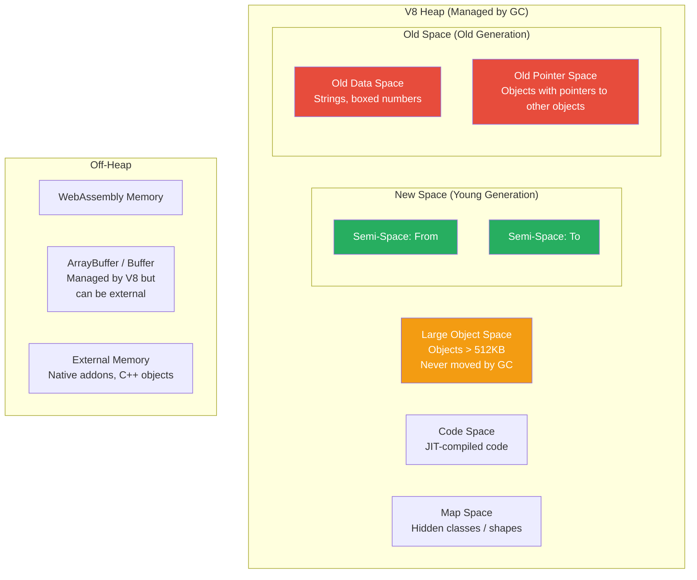
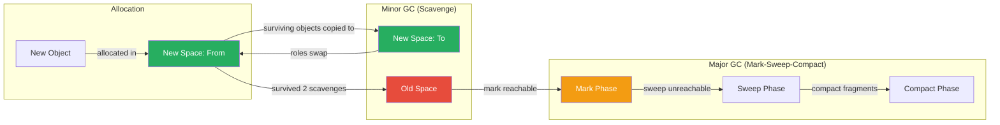
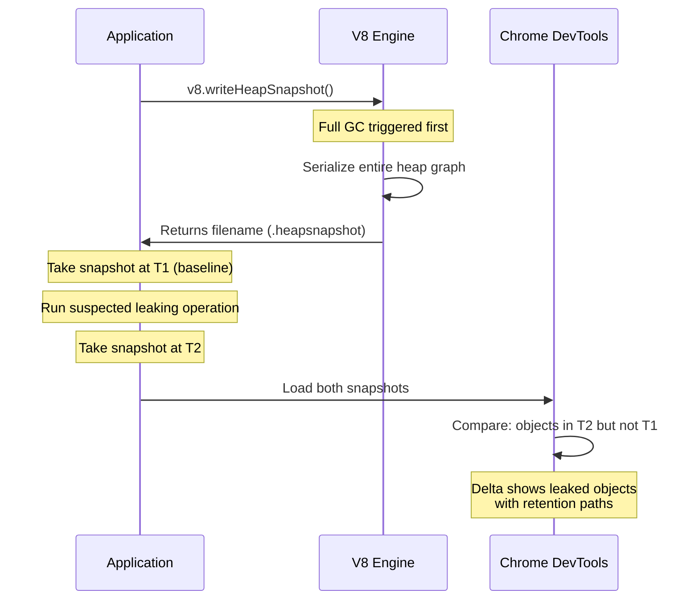

# Memory Management — V8 GC, Leak Patterns, Profiling & Optimization

## Table of Contents

- [V8 Memory Architecture](#v8-memory-architecture)
- [Generational Garbage Collection](#generational-garbage-collection)
- [Mark-Sweep-Compact Algorithm](#mark-sweep-compact-algorithm)
- [Common Memory Leak Patterns](#common-memory-leak-patterns)
- [Profiling Tools and Techniques](#profiling-tools-and-techniques)
- [Heap Snapshots](#heap-snapshots)
- [Tuning V8 Memory](#tuning-v8-memory)
- [Comparison Tables](#comparison-tables)
- [Code Examples](#code-examples)
- [Interview Q&A](#interview-qa)

---

## V8 Memory Architecture

V8 divides memory into several spaces, each with a specific purpose and garbage collection strategy.



### Memory Spaces

| Space | Size (default) | GC Algorithm | Contents |
|-------|---------------|--------------|----------|
| **New Space** | 1-8 MB per semi-space | Scavenge (copy) | Short-lived objects, recently allocated |
| **Old Pointer Space** | Grows up to heap limit | Mark-Sweep-Compact | Objects surviving 2+ GC cycles, with references |
| **Old Data Space** | Grows up to heap limit | Mark-Sweep-Compact | Primitive data (strings, numbers) |
| **Large Object Space** | No fixed limit | Mark-Sweep (no compaction) | Objects > ~512KB |
| **Code Space** | Varies | Mark-Sweep | JIT-compiled machine code |
| **Map Space** | Varies | Mark-Sweep | V8 hidden classes (object shapes) |

---

## Generational Garbage Collection

V8 uses the **generational hypothesis**: most objects die young. It divides the heap into generations and collects the young generation more frequently.



### Minor GC (Scavenge) — Young Generation

1. Objects are allocated in the "From" semi-space.
2. When "From" is full, a scavenge begins.
3. Live objects are copied to the "To" semi-space.
4. "From" and "To" swap roles.
5. Objects that survive **two** scavenges are promoted to Old Space.
6. Typically takes **1-5ms** — very fast.

### Major GC (Mark-Sweep-Compact) — Old Generation

1. **Mark**: Starting from roots (global object, stack, handles), traverse all reachable objects and mark them.
2. **Sweep**: Scan through old space, free unmarked objects.
3. **Compact** (optional): Move surviving objects together to reduce fragmentation.
4. Takes **50-100ms+** for large heaps — can cause latency spikes.

### Incremental and Concurrent GC

V8 uses several techniques to reduce pause times:

| Technique | Description |
|-----------|-------------|
| **Incremental marking** | Mark phase split into small steps interleaved with JS execution |
| **Concurrent marking** | Marking done on background threads while JS runs |
| **Concurrent sweeping** | Sweeping done on background threads |
| **Lazy sweeping** | Sweep only when memory is needed |
| **Parallel scavenging** | Young generation GC uses multiple threads |

---

## Mark-Sweep-Compact Algorithm

### Detailed Steps

```typescript
// Conceptual representation of mark-sweep-compact

// 1. MARK PHASE: Start from GC roots, traverse all reachable objects
function mark(roots: GCRoot[]): void {
  const worklist: HeapObject[] = [];

  // Start with roots
  for (const root of roots) {
    if (!root.object.isMarked) {
      root.object.isMarked = true;
      worklist.push(root.object);
    }
  }

  // Traverse all reachable objects
  while (worklist.length > 0) {
    const obj = worklist.pop()!;
    for (const child of obj.references) {
      if (!child.isMarked) {
        child.isMarked = true;
        worklist.push(child);
      }
    }
  }
}

// 2. SWEEP PHASE: Free all unmarked objects
function sweep(heap: HeapPage[]): void {
  for (const page of heap) {
    for (const obj of page.objects) {
      if (obj.isMarked) {
        obj.isMarked = false; // Reset for next GC cycle
      } else {
        page.free(obj); // Add to free list
      }
    }
  }
}

// 3. COMPACT PHASE: Move objects to eliminate fragmentation
function compact(heap: HeapPage[]): void {
  let destination = heap[0].startAddress;
  for (const page of heap) {
    for (const obj of page.liveObjects) {
      if (obj.address !== destination) {
        move(obj, destination);
        updateAllReferences(obj.oldAddress, destination);
      }
      destination += obj.size;
    }
  }
}
```

### GC Roots in Node.js

| Root Type | Example |
|-----------|---------|
| Global object | `global`, `globalThis` |
| Stack variables | Local variables in currently executing functions |
| Active handles | Timers, sockets, file handles |
| Persistent handles | V8 persistent handles from native addons |
| Module cache | `require.cache` |

---

## Common Memory Leak Patterns

### 1. Forgotten Event Listeners

```typescript
// LEAK: Event listener keeps reference to large object
class DataProcessor {
  private cache: Map<string, Buffer> = new Map();

  process(stream: EventEmitter): void {
    // This listener is NEVER removed
    stream.on("data", (chunk: Buffer) => {
      // `this` keeps DataProcessor (and its cache) alive
      this.cache.set(chunk.toString("hex"), chunk);
    });
  }
}

// FIX: Remove listeners when done
class DataProcessorFixed {
  private cache: Map<string, Buffer> = new Map();

  process(stream: EventEmitter): void {
    const handler = (chunk: Buffer) => {
      this.cache.set(chunk.toString("hex"), chunk);
    };

    stream.on("data", handler);

    stream.on("end", () => {
      stream.removeListener("data", handler);
      this.cache.clear();
    });
  }
}
```

### 2. Unbounded Caches

```typescript
// LEAK: Cache grows forever
const cache = new Map<string, object>();

function getUser(id: string): object {
  if (cache.has(id)) return cache.get(id)!;
  const user = fetchUserFromDB(id);
  cache.set(id, user); // Never evicted!
  return user;
}

// FIX: Use LRU cache with max size
import { LRUCache } from "lru-cache";

const cache2 = new LRUCache<string, object>({
  max: 1000,             // Max entries
  ttl: 1000 * 60 * 5,   // 5 minute TTL
  maxSize: 50_000_000,   // 50MB max
  sizeCalculation: (value) => JSON.stringify(value).length,
});
```

### 3. Closures Retaining Large Scopes

```typescript
// LEAK: Closure retains the entire `largeData` array
function processData(): () => string {
  const largeData = new Array(1_000_000).fill("x".repeat(1000));
  const summary = largeData.length.toString(); // Only need the length

  return function getSummary() {
    // This closure retains `largeData` because it's in scope
    // even though we only use `summary`
    return summary;
  };
  // V8 is smart about this in many cases (dead variable elimination)
  // but eval() or with() prevent this optimization
}

// FIX: Explicitly null out or restructure
function processDataFixed(): () => string {
  let summary: string;
  {
    const largeData = new Array(1_000_000).fill("x".repeat(1000));
    summary = largeData.length.toString();
    // largeData goes out of block scope
  }

  return function getSummary() {
    return summary;
  };
}
```

### 4. Global References and Module Cache

```typescript
// LEAK: Global array that grows
const allRequests: object[] = [];

app.use((req, res, next) => {
  allRequests.push({ url: req.url, time: Date.now() }); // Never cleared
  next();
});

// LEAK: Circular references in module cache
// module-a.ts
import { b } from "./module-b";
export const a = { ref: b, data: Buffer.alloc(10_000_000) };

// module-b.ts
import { a } from "./module-a";
export const b = { ref: a }; // Circular — both modules and their data stay in memory forever
```

### 5. Uncleared Timers and Intervals

```typescript
// LEAK: Interval never cleared, keeps closure and referenced data alive
class WebSocketManager {
  private connections: Map<string, WebSocket> = new Map();
  private heartbeatInterval: NodeJS.Timeout;

  constructor() {
    this.heartbeatInterval = setInterval(() => {
      // `this` reference keeps entire WebSocketManager alive
      for (const [id, ws] of this.connections) {
        ws.ping();
      }
    }, 30_000);
  }

  // FIX: Always provide cleanup
  destroy(): void {
    clearInterval(this.heartbeatInterval);
    this.connections.clear();
  }
}
```

---

## Profiling Tools and Techniques

### Built-in Node.js Tools

| Tool | Command | Use |
|------|---------|-----|
| `--inspect` | `node --inspect app.js` | Chrome DevTools profiling |
| `--heap-prof` | `node --heap-prof app.js` | Heap profile on exit |
| `--cpu-prof` | `node --cpu-prof app.js` | CPU profile on exit |
| `process.memoryUsage()` | Runtime call | Quick memory check |
| `v8.getHeapStatistics()` | Runtime call | Detailed heap info |
| `v8.writeHeapSnapshot()` | Runtime call | On-demand heap snapshot |

### process.memoryUsage() Explained

```typescript
import { memoryUsage } from "process";

const mem = memoryUsage();
console.log({
  rss: `${(mem.rss / 1024 / 1024).toFixed(1)} MB`,          // Resident Set Size (total RAM)
  heapTotal: `${(mem.heapTotal / 1024 / 1024).toFixed(1)} MB`, // V8 heap allocated
  heapUsed: `${(mem.heapUsed / 1024 / 1024).toFixed(1)} MB`,  // V8 heap in use
  external: `${(mem.external / 1024 / 1024).toFixed(1)} MB`,  // C++ objects bound to JS
  arrayBuffers: `${(mem.arrayBuffers / 1024 / 1024).toFixed(1)} MB`, // ArrayBuffer + SharedArrayBuffer
});
```

| Field | What It Measures |
|-------|-----------------|
| `rss` | Total memory allocated to the process (includes code, stack, heap, shared libs) |
| `heapTotal` | V8's total allocated heap memory |
| `heapUsed` | V8's actual used heap memory |
| `external` | Memory used by C++ objects tied to JavaScript objects |
| `arrayBuffers` | Memory for ArrayBuffer and SharedArrayBuffer |

**Key relationship**: `heapUsed < heapTotal < rss`. If `rss` grows but `heapUsed` doesn't, the leak is in native memory (Buffers, native addons).

---

## Heap Snapshots



### Taking Heap Snapshots Programmatically

```typescript
import v8 from "v8";
import { writeFileSync } from "fs";

// Method 1: v8.writeHeapSnapshot()
function takeSnapshot(label: string): string {
  const filename = v8.writeHeapSnapshot();
  console.log(`Heap snapshot written to: ${filename} (${label})`);
  return filename;
}

// Method 2: Manual trigger via signal
process.on("SIGUSR2", () => {
  const filename = v8.writeHeapSnapshot();
  console.log(`Heap snapshot: ${filename}`);
});

// Method 3: Periodic snapshots for comparison
class MemoryMonitor {
  private snapshots: string[] = [];
  private baselineMemory: number = 0;

  start(intervalMs: number = 60_000): void {
    this.baselineMemory = process.memoryUsage().heapUsed;

    setInterval(() => {
      const current = process.memoryUsage().heapUsed;
      const growth = current - this.baselineMemory;
      const growthMB = growth / 1024 / 1024;

      if (growthMB > 100) {
        console.warn(`Memory growth: ${growthMB.toFixed(1)} MB — taking snapshot`);
        const file = takeSnapshot(`growth-${growthMB.toFixed(0)}MB`);
        this.snapshots.push(file);
      }
    }, intervalMs);
  }
}
```

### Analyzing Heap Snapshots

In Chrome DevTools, use these views:

| View | Purpose |
|------|---------|
| **Summary** | Objects grouped by constructor name, with sizes |
| **Comparison** | Diff between two snapshots — shows what was allocated/freed |
| **Containment** | Tree view of object ownership |
| **Statistics** | Pie chart of memory by type |

**Key columns:**
- **Shallow Size**: Memory directly held by the object itself
- **Retained Size**: Memory that would be freed if this object were garbage collected (includes everything it keeps alive)

---

## Tuning V8 Memory

### Key Flags

| Flag | Default | Description |
|------|---------|-------------|
| `--max-old-space-size=N` | ~1.7GB (64-bit) | Maximum old generation size in MB |
| `--max-semi-space-size=N` | 16MB | Semi-space size (young generation = 2x this) |
| `--max-heap-size=N` | ~4GB | Total heap limit |
| `--gc-interval=N` | Automatic | Force GC every N allocations |
| `--expose-gc` | Off | Expose `global.gc()` for manual GC |
| `--trace-gc` | Off | Log GC events to stderr |

### When to Increase --max-old-space-size

```bash
# Default is ~1.7GB — increase for memory-heavy apps
node --max-old-space-size=4096 app.js  # 4GB heap

# Monitor with --trace-gc
node --trace-gc app.js
# Output: [GC] Scavenge 45.2 (50.0) -> 3.1 (50.0) MB, 2.1 / 0.0 ms ...
```

---

## Comparison Tables

### Memory Leak Detection Approaches

| Approach | Best For | Pros | Cons |
|----------|----------|------|------|
| **Heap Snapshots** | Finding specific leaked objects | Exact retention paths | Expensive to take, large files |
| **process.memoryUsage()** | Trend monitoring | Lightweight, continuous | No detail on what's leaking |
| **--trace-gc** | GC behavior analysis | Shows GC frequency and duration | Verbose, needs interpretation |
| **Allocation Timeline** | Finding allocation hot spots | Shows when objects are allocated | DevTools connection required |
| **clinic.js** | Production diagnostics | Comprehensive, visual | Additional dependency |

### GC Types Comparison

| GC Type | Scope | Typical Duration | Trigger |
|---------|-------|-----------------|---------|
| **Scavenge** | New Space (young gen) | 1-5ms | New space full |
| **Mark-Sweep** | Old Space (old gen) | 50-200ms | Old space pressure |
| **Mark-Compact** | Old Space (with compaction) | 100-500ms | High fragmentation |
| **Incremental Mark** | Old Space (incremental) | Many 1-5ms steps | Background, low-latency |

---

## Code Examples

### Production Memory Monitoring

```typescript
import v8 from "v8";

interface MemoryReport {
  timestamp: string;
  heapUsedMB: number;
  heapTotalMB: number;
  rssMB: number;
  externalMB: number;
  heapUsedPercent: number;
  gcStats: {
    totalHeapSize: number;
    usedHeapSize: number;
    heapSizeLimit: number;
    mallocedMemory: number;
    numberOfNativeContexts: number;
    numberOfDetachedContexts: number;
  };
}

function getMemoryReport(): MemoryReport {
  const mem = process.memoryUsage();
  const heapStats = v8.getHeapStatistics();

  return {
    timestamp: new Date().toISOString(),
    heapUsedMB: Math.round(mem.heapUsed / 1024 / 1024),
    heapTotalMB: Math.round(mem.heapTotal / 1024 / 1024),
    rssMB: Math.round(mem.rss / 1024 / 1024),
    externalMB: Math.round(mem.external / 1024 / 1024),
    heapUsedPercent: Math.round((mem.heapUsed / heapStats.heap_size_limit) * 100),
    gcStats: {
      totalHeapSize: heapStats.total_heap_size,
      usedHeapSize: heapStats.used_heap_size,
      heapSizeLimit: heapStats.heap_size_limit,
      mallocedMemory: heapStats.malloced_memory,
      numberOfNativeContexts: heapStats.number_of_native_contexts,
      numberOfDetachedContexts: heapStats.number_of_detached_contexts,
    },
  };
}

// Alert on detached contexts (common leak in SSR apps)
function checkDetachedContexts(): void {
  const stats = v8.getHeapStatistics();
  if (stats.number_of_detached_contexts > 0) {
    console.warn(
      `Detached contexts detected: ${stats.number_of_detached_contexts}. ` +
      `This often indicates a memory leak from unreleased VM contexts or iframes.`
    );
  }
}
```

### Detecting Leaks with Allocation Tracking

```typescript
// Track allocations by wrapping constructors
function trackAllocations<T extends new (...args: any[]) => any>(
  ClassName: T,
  label: string
): T {
  let instanceCount = 0;
  const instances = new WeakSet();

  const Tracked = class extends ClassName {
    constructor(...args: any[]) {
      super(...args);
      instanceCount++;
      instances.add(this);
      if (instanceCount % 1000 === 0) {
        console.log(`[MemTrack] ${label}: ${instanceCount} instances created`);
      }
    }
  };

  // Expose stats via a static method
  (Tracked as any).getInstanceCount = () => instanceCount;

  return Tracked as unknown as T;
}

// WeakRef-based leak detector
class LeakDetector<T extends object> {
  private refs: Array<{ ref: WeakRef<T>; label: string; createdAt: number }> = [];

  track(obj: T, label: string): void {
    this.refs.push({
      ref: new WeakRef(obj),
      label,
      createdAt: Date.now(),
    });
  }

  check(): { alive: number; collected: number; leaked: Array<{ label: string; age: number }> } {
    const now = Date.now();
    let alive = 0;
    let collected = 0;
    const leaked: Array<{ label: string; age: number }> = [];

    this.refs = this.refs.filter((entry) => {
      const obj = entry.ref.deref();
      if (obj === undefined) {
        collected++;
        return false; // Remove from tracking
      }
      alive++;
      const age = now - entry.createdAt;
      if (age > 60_000) {
        leaked.push({ label: entry.label, age });
      }
      return true;
    });

    return { alive, collected, leaked };
  }
}
```

### Streaming to Avoid Memory Bloat

```typescript
import { createReadStream, createWriteStream } from "fs";
import { Transform } from "stream";
import { pipeline } from "stream/promises";

// BAD: Loading entire file into memory
async function processFileBad(path: string): Promise<void> {
  const data = await fs.readFile(path, "utf8"); // 1GB file = 1GB in memory
  const lines = data.split("\n");
  const results = lines.map(processLine);
  await fs.writeFile("output.json", JSON.stringify(results));
}

// GOOD: Streaming — constant memory usage
async function processFileGood(inputPath: string, outputPath: string): Promise<void> {
  const lineTransform = new Transform({
    objectMode: true,
    transform(chunk: Buffer, encoding, callback) {
      const line = chunk.toString();
      try {
        const result = processLine(line);
        this.push(JSON.stringify(result) + "\n");
        callback();
      } catch (err) {
        callback(err as Error);
      }
    },
  });

  await pipeline(
    createReadStream(inputPath, { encoding: "utf8", highWaterMark: 64 * 1024 }),
    createLineStream(),
    lineTransform,
    createWriteStream(outputPath)
  );
  // Memory usage: ~128KB regardless of file size
}
```

---

## Interview Q&A

> **Q1: How does V8's garbage collector work? Explain the generational approach.**
>
> V8 uses generational GC based on the hypothesis that most objects die young. The heap is split into a young generation (New Space) and old generation (Old Space). New objects are allocated in New Space, which uses a Scavenge (copying) algorithm: live objects are copied from one semi-space to another, and dead objects are simply left behind (fast, ~1-5ms). Objects surviving two scavenges are promoted to Old Space. Old Space uses Mark-Sweep-Compact: mark all reachable objects from roots, sweep (free) unreachable ones, optionally compact to reduce fragmentation. Major GC is slower (50-200ms+) but runs less frequently. V8 also uses incremental and concurrent marking to reduce pause times.

> **Q2: How would you debug a memory leak in a Node.js production service?**
>
> (1) Confirm the leak: monitor `process.memoryUsage().heapUsed` over time — a steady upward trend indicates a leak. (2) Take heap snapshots: use `v8.writeHeapSnapshot()` at intervals (e.g., after 1 hour and after 4 hours). (3) Compare snapshots in Chrome DevTools: load both, use the "Comparison" view to see what was allocated between snapshots. (4) Follow retention paths: the "Retainers" panel shows why objects can't be GC'd. (5) Common culprits: event listeners not removed, unbounded caches/arrays, closures retaining large scopes, uncleared timers/intervals. (6) For native memory leaks (RSS grows but heapUsed doesn't): check Buffer allocations, native addons, or child process handles.

> **Q3: What is the difference between `rss`, `heapTotal`, and `heapUsed` in `process.memoryUsage()`?**
>
> `rss` (Resident Set Size) is the total physical memory allocated to the process by the OS, including code segment, stack, V8 heap, and C++ objects. `heapTotal` is how much memory V8 has allocated for its managed heap (but not all of it may be in use). `heapUsed` is how much of V8's heap is actually occupied by live objects. The relationship is `heapUsed <= heapTotal <= rss`. If `heapUsed` grows steadily, it's a JavaScript object leak. If `rss` grows but `heapUsed` is stable, the leak is in native memory (Buffers, external C++ bindings, file descriptor leaks).

> **Q4: What is `--max-old-space-size` and when should you change it?**
>
> This V8 flag sets the maximum size of the old generation heap in megabytes. Default is approximately 1.7GB on 64-bit systems. Increase it when: (1) Your application legitimately needs more memory (large in-memory datasets, caching). (2) You see `FATAL ERROR: CALL_AND_RETRY_LAST Allocation failed - JavaScript heap out of memory`. (3) Build tools (TypeScript compiler, webpack) processing large codebases. Set it to about 75% of your container's memory limit (leave room for stack, native memory, OS). Example: for a 4GB container, use `--max-old-space-size=3072`. Never set it higher than available RAM — the OS will kill the process (OOM killer).

> **Q5: Explain the difference between shallow size and retained size in heap snapshots.**
>
> Shallow size is the memory directly consumed by the object itself (its own properties, without what they point to). For example, an object with 3 number fields has a shallow size of ~56 bytes. Retained size is the total memory that would be freed if this object were garbage collected — it includes the object itself plus everything only reachable through this object. For example, if an object holds the only reference to a 10MB Buffer, its shallow size is ~56 bytes but its retained size is ~10MB. When hunting leaks, sort by retained size to find the objects keeping the most memory alive, then examine their retention paths.

> **Q6: How do you prevent memory issues in a long-running Node.js server?**
>
> (1) Use bounded data structures: LRU caches instead of plain Maps, circular buffers instead of growing arrays. (2) Always remove event listeners: use `once()` where possible, track and remove listeners in cleanup methods. (3) Clear timers and intervals in destroy/shutdown hooks. (4) Use streams for large data processing instead of buffering. (5) Set `--max-old-space-size` appropriately for your container. (6) Monitor `process.memoryUsage()` and v8 heap statistics; alert on trends. (7) Use WeakRef and FinalizationRegistry for optional caches. (8) Avoid storing request-scoped data in module-level variables. (9) Periodically take heap snapshots in staging to compare across releases.
