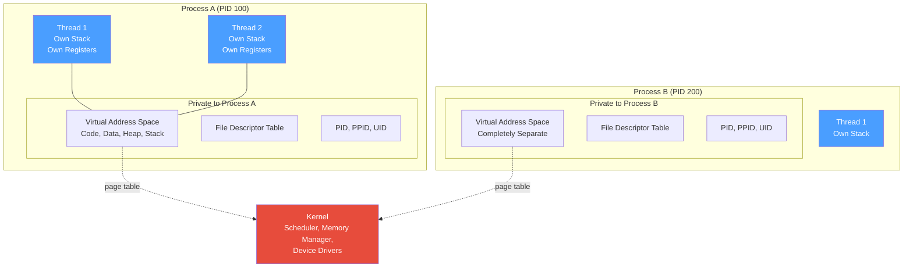
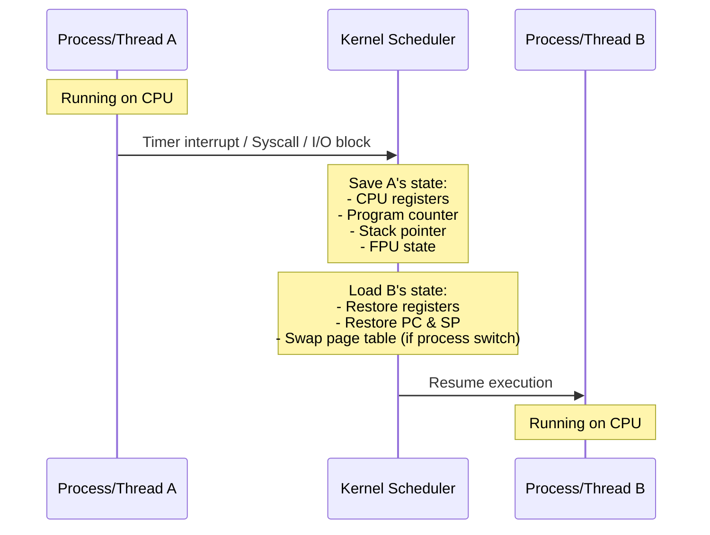
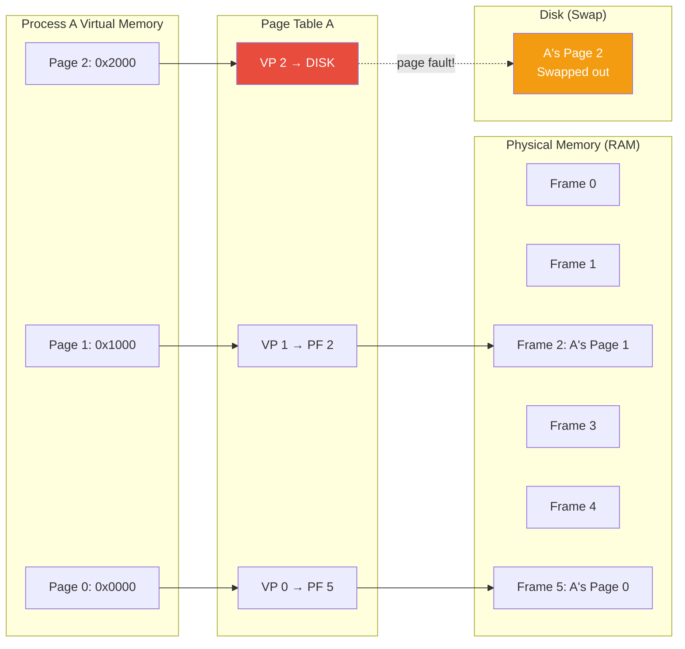
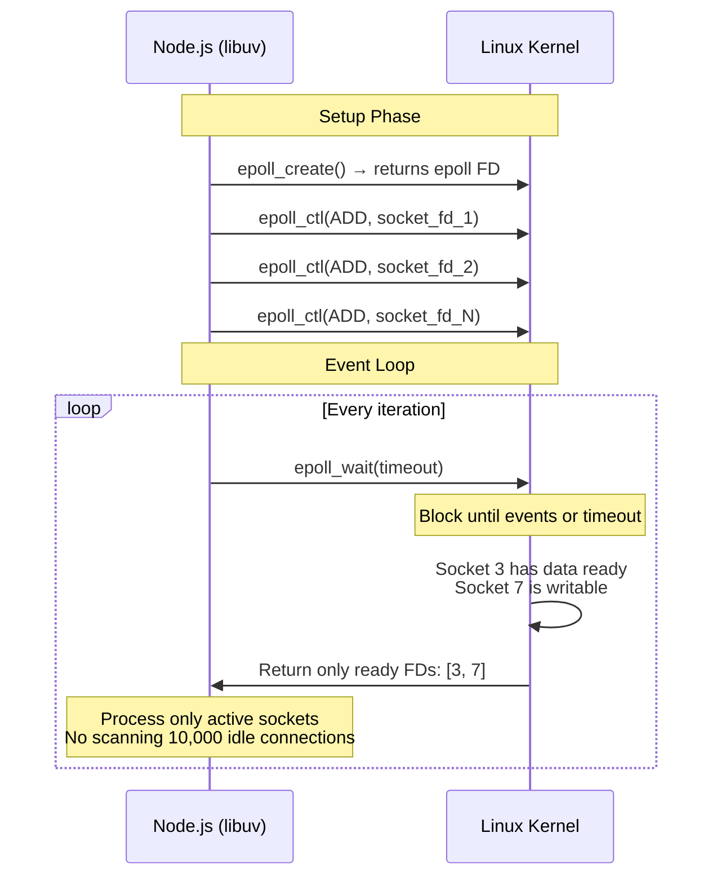

# OS Fundamentals — Processes, Threads, Virtual Memory, epoll/kqueue & Syscalls

## Table of Contents

- [Processes vs Threads](#processes-vs-threads)
- [Context Switching](#context-switching)
- [Virtual Memory](#virtual-memory)
- [Inter-Process Communication (IPC)](#inter-process-communication-ipc)
- [File Descriptors](#file-descriptors)
- [I/O Models and epoll/kqueue](#io-models-and-epollkqueue)
- [System Calls Relevant to Backend](#system-calls-relevant-to-backend)
- [Comparison Tables](#comparison-tables)
- [Code Examples](#code-examples)
- [Interview Q&A](#interview-qa)

---

## Processes vs Threads



### Key Differences

| Property | Process | Thread |
|----------|---------|--------|
| **Address space** | Own virtual address space | Shares process address space |
| **Creation cost** | Heavy (~10-30ms, fork+exec) | Light (~1ms) |
| **Memory overhead** | ~30MB+ (full address space) | ~1-8MB (stack only) |
| **Communication** | IPC (pipes, sockets, shared memory) | Direct memory access |
| **Isolation** | Full — crash doesn't affect others | Shared — crash kills all threads |
| **Context switch cost** | Higher (TLB flush, page table swap) | Lower (same page table) |
| **Scheduling** | By OS scheduler | By OS scheduler (1:1 model) |
| **File descriptors** | Own table | Shares process FD table |

### Process Memory Layout

```
High Address
┌──────────────────────┐
│     Kernel Space      │  (not accessible by process)
├──────────────────────┤
│       Stack ↓         │  Local variables, function frames
│         ...           │  Grows downward
├──────────────────────┤
│                       │  (unmapped — gap)
├──────────────────────┤
│         ...           │  Grows upward
│       Heap ↑          │  malloc, new, dynamic allocation
├──────────────────────┤
│   BSS (uninitialized) │  Global variables (zeroed)
├──────────────────────┤
│   Data (initialized)  │  Global variables with values
├──────────────────────┤
│       Text (Code)     │  Executable instructions (read-only)
└──────────────────────┘
Low Address
```

---

## Context Switching

A context switch is when the OS saves the state of one process/thread and loads the state of another. This is how the OS creates the illusion of parallelism on fewer CPU cores.



### Context Switch Costs

| Switch Type | Typical Cost | Why |
|-------------|-------------|-----|
| **Thread switch (same process)** | 1-10 microseconds | Same page table, minimal TLB disruption |
| **Process switch** | 10-100 microseconds | Page table swap, TLB flush, cache cold |
| **Syscall (user → kernel → user)** | 0.1-1 microsecond | Mode switch, no address space change |

### What Triggers Context Switches

| Trigger | Type | Example |
|---------|------|---------|
| **Timer interrupt** | Preemptive | Process used its time quantum (1-10ms) |
| **Blocking syscall** | Voluntary | `read()`, `accept()`, `sleep()` |
| **I/O completion** | Interrupt | Disk read complete, packet arrived |
| **Higher priority task** | Preemptive | Real-time process needs CPU |
| **`sched_yield()`** | Voluntary | Process explicitly yields |

---

## Virtual Memory

Virtual memory gives each process the illusion of having its own contiguous memory space, regardless of physical RAM layout.



### Key Concepts

| Concept | Description |
|---------|-------------|
| **Virtual Address** | Address used by the process (e.g., 0x7fff5a00) |
| **Physical Address** | Actual RAM location |
| **Page** | Fixed-size block (4KB typical) of virtual memory |
| **Frame** | Fixed-size block of physical memory |
| **Page Table** | Per-process mapping: virtual page → physical frame |
| **TLB** | Translation Lookaside Buffer — hardware cache for page table entries |
| **Page Fault** | Accessing a page not in RAM — OS loads from disk |
| **Demand Paging** | Pages loaded only when accessed, not at process start |
| **Copy-on-Write (COW)** | After `fork()`, parent and child share pages until one writes |
| **mmap** | Map file or device into virtual address space |

### Why Virtual Memory Matters for Backend

1. **Process isolation**: Processes can't read each other's memory.
2. **Memory overcommit**: Linux can allocate more virtual memory than physical RAM (OOM killer handles failures).
3. **COW fork**: `fork()` in Node.js cluster is cheap — pages are shared until modified.
4. **mmap for files**: Databases use mmap for memory-mapped file I/O (e.g., LMDB).
5. **Swap pressure**: If RSS exceeds available RAM, the OS swaps pages to disk — latency skyrockets.

---

## Inter-Process Communication (IPC)

| Mechanism | Speed | Complexity | Use Case |
|-----------|-------|------------|----------|
| **Pipe** | Fast | Simple | Parent-child communication |
| **Named Pipe (FIFO)** | Fast | Simple | Unrelated processes, unidirectional |
| **Unix Domain Socket** | Very fast | Medium | Local client-server (e.g., Docker, nginx → PHP-FPM) |
| **TCP Socket** | Moderate | Medium | Network + local communication |
| **Shared Memory** | Fastest | Complex | High-throughput data sharing |
| **Message Queue (POSIX)** | Moderate | Medium | Decoupled producer-consumer |
| **Signal** | Fast | Simple | Notifications (SIGTERM, SIGUSR1) |
| **Semaphore** | Fast | Medium | Synchronization between processes |

### IPC in Node.js

```typescript
import { fork, ChildProcess } from "child_process";
import cluster from "cluster";

// Method 1: child_process.fork() — built-in IPC channel
const child: ChildProcess = fork("./worker.js");

// Parent sends message to child
child.send({ type: "task", payload: { userId: 123 } });

// Parent receives message from child
child.on("message", (message) => {
  console.log("From child:", message);
});

// In worker.js:
// process.on('message', (msg) => {
//   process.send({ type: 'result', data: processTask(msg) });
// });

// Method 2: cluster — multiple workers sharing a server port
if (cluster.isPrimary) {
  const numCPUs = require("os").cpus().length;
  for (let i = 0; i < numCPUs; i++) {
    cluster.fork();
  }

  for (const id in cluster.workers) {
    cluster.workers[id]!.on("message", (msg) => {
      console.log(`Worker ${id}:`, msg);
    });
  }
} else {
  // Worker process — shares the same server port
  const server = require("http").createServer((req: any, res: any) => {
    res.end(`Handled by worker ${process.pid}`);
  });
  server.listen(3000);
}
```

---

## File Descriptors

A file descriptor (FD) is an integer that refers to an open file, socket, pipe, or other I/O resource. Everything in Unix is a file.

### Standard File Descriptors

| FD | Name | Constant | Description |
|----|------|----------|-------------|
| 0 | stdin | `STDIN_FILENO` | Standard input |
| 1 | stdout | `STDOUT_FILENO` | Standard output |
| 2 | stderr | `STDERR_FILENO` | Standard error |
| 3+ | - | - | Opened files, sockets, pipes |

### FD Limits and Backend Impact

```bash
# Check current limits
ulimit -n          # Per-process soft limit (default: 1024 on many systems)
ulimit -Hn         # Per-process hard limit

# For high-connection servers, increase:
# /etc/security/limits.conf
# *    soft    nofile    65536
# *    hard    nofile    65536

# Check system-wide limit
cat /proc/sys/fs/file-max   # Total FDs the kernel can allocate
```

**Each TCP connection = 1 file descriptor.** A Node.js server handling 10,000 concurrent connections needs at least 10,000 FDs, plus some for files, pipes, and internal use. Running out of FDs causes `EMFILE: too many open files`.

```typescript
// Check open file descriptors in Node.js (Linux)
import { readdirSync } from "fs";

function getOpenFDCount(): number {
  try {
    return readdirSync("/proc/self/fd").length;
  } catch {
    return -1; // Not on Linux
  }
}
```

---

## I/O Models and epoll/kqueue

### The Five I/O Models

| Model | Blocking? | Notification | Used By |
|-------|-----------|--------------|---------|
| **Blocking I/O** | Yes | Returns when data ready | Traditional thread-per-connection |
| **Non-blocking I/O** | No (polls) | Returns immediately; must retry | Busy-wait loops (inefficient) |
| **I/O Multiplexing** | Blocks on multiplexer | `select`/`poll`/`epoll`/`kqueue` | **Node.js, nginx, Redis** |
| **Signal-driven I/O** | No | Signal on data ready | Rarely used |
| **Async I/O (AIO)** | No | Kernel notifies on completion | io_uring (Linux), IOCP (Windows) |

### select → poll → epoll Evolution

| Feature | `select` (1983) | `poll` (1997) | `epoll` (2002) | `kqueue` (BSD) |
|---------|----------------|---------------|----------------|----------------|
| **FD limit** | 1024 (FD_SETSIZE) | No limit | No limit | No limit |
| **Performance** | O(n) scan every call | O(n) scan every call | O(1) for events | O(1) for events |
| **State** | Stateless (rebuild each call) | Stateless | **Stateful** (kernel maintains) | **Stateful** |
| **Mechanism** | Copy FD sets user↔kernel | Copy FD array user↔kernel | Register once, get events | Register once, get events |

### How epoll Works



**Why epoll/kqueue is O(1):**
- `select`/`poll`: every call copies all FDs to kernel, kernel checks each one. With 10,000 connections, scan 10,000 FDs every iteration.
- `epoll`: register FDs once. On each wait, kernel only returns the FDs with events. With 10,000 connections where 5 are active, only 5 are returned.

### Edge-Triggered vs Level-Triggered

| Mode | Behavior | Used By |
|------|----------|---------|
| **Level-Triggered (LT)** | Notifies as long as FD is ready | Default in epoll; easier to use |
| **Edge-Triggered (ET)** | Notifies only when state changes | nginx; more efficient but harder to use |

---

## System Calls Relevant to Backend

### Network Syscalls

| Syscall | Purpose | Node.js Equivalent |
|---------|---------|-------------------|
| `socket()` | Create a socket | `net.createServer()` |
| `bind()` | Bind to address/port | `server.listen(port)` |
| `listen()` | Mark as passive (accept connections) | `server.listen()` |
| `accept()` | Accept incoming connection | Connection event |
| `connect()` | Initiate connection to server | `net.connect()` |
| `read()`/`recv()` | Read data from socket | `socket.on('data')` |
| `write()`/`send()` | Write data to socket | `socket.write()` |
| `close()` | Close file descriptor | `socket.destroy()` |
| `epoll_create()`/`kqueue()` | Create event poller | libuv internal |

### File Syscalls

| Syscall | Purpose | Node.js Equivalent |
|---------|---------|-------------------|
| `open()` | Open a file | `fs.open()` |
| `read()` | Read from file | `fs.read()` |
| `write()` | Write to file | `fs.write()` |
| `close()` | Close file | `fs.close()` |
| `stat()` | Get file metadata | `fs.stat()` |
| `mmap()` | Map file to memory | N/A (native addons) |
| `sendfile()` | Zero-copy file→socket transfer | Used internally by `stream.pipe()` |

---

## Comparison Tables

### Server Architectures

| Architecture | Example | Concurrency | FD Per Connection | Memory Per Connection |
|-------------|---------|-------------|-------------------|----------------------|
| **Thread-per-connection** | Apache (prefork) | ~1,000 | 1 | ~1-8MB (thread stack) |
| **Event-driven** | Node.js, nginx | ~100,000+ | 1 | ~few KB (callback) |
| **Coroutine-based** | Go goroutines | ~1,000,000 | 1 | ~4KB (goroutine stack) |
| **Multi-process** | PHP-FPM, Gunicorn | ~hundreds | 1 | ~10-50MB (process) |

### Node.js Process Model Comparison

| Feature | Single Process | Cluster | Worker Threads | Child Process |
|---------|---------------|---------|---------------|---------------|
| **Memory** | Shared | Separate per worker | Shared (SharedArrayBuffer) | Separate |
| **CPU utilization** | 1 core | All cores | All cores | 1 core per child |
| **Isolation** | None | Full | Partial | Full |
| **Communication** | N/A | IPC (JSON) | MessagePort / Shared memory | IPC / stdio |
| **Use case** | Simple apps | HTTP scaling | CPU-bound tasks | External commands |

---

## Code Examples

### Graceful Shutdown with Signal Handling

```typescript
import { createServer, Server, IncomingMessage, ServerResponse } from "http";

const server: Server = createServer((req: IncomingMessage, res: ServerResponse) => {
  res.writeHead(200);
  res.end("OK");
});

let isShuttingDown = false;

async function gracefulShutdown(signal: string): Promise<void> {
  if (isShuttingDown) return;
  isShuttingDown = true;
  console.log(`\nReceived ${signal}. Starting graceful shutdown...`);

  // 1. Stop accepting new connections
  server.close(() => {
    console.log("Server closed — no more connections");
  });

  // 2. Give existing requests time to complete
  const shutdownTimeout = setTimeout(() => {
    console.error("Shutdown timeout — forcing exit");
    process.exit(1);
  }, 30_000);

  // 3. Close database pools, flush logs, etc.
  try {
    await Promise.all([
      // db.pool.end(),
      // redis.quit(),
      // logger.flush(),
    ]);
    console.log("All resources cleaned up");
    clearTimeout(shutdownTimeout);
    process.exit(0);
  } catch (err) {
    console.error("Error during shutdown:", err);
    clearTimeout(shutdownTimeout);
    process.exit(1);
  }
}

// Handle common termination signals
process.on("SIGTERM", () => gracefulShutdown("SIGTERM")); // Kubernetes, Docker stop
process.on("SIGINT", () => gracefulShutdown("SIGINT"));   // Ctrl+C

// Handle uncaught errors
process.on("uncaughtException", (err) => {
  console.error("Uncaught exception:", err);
  gracefulShutdown("uncaughtException");
});

process.on("unhandledRejection", (reason) => {
  console.error("Unhandled rejection:", reason);
  gracefulShutdown("unhandledRejection");
});

server.listen(3000, () => {
  console.log(`Server running on port 3000 (PID: ${process.pid})`);
});
```

### Monitoring System Resources from Node.js

```typescript
import os from "os";
import { readFileSync } from "fs";

interface SystemMetrics {
  cpuUsage: number;
  loadAverage: number[];
  totalMemoryMB: number;
  freeMemoryMB: number;
  memoryUsagePercent: number;
  uptimeSeconds: number;
  openFileDescriptors: number;
  processMemory: {
    rssMB: number;
    heapUsedMB: number;
  };
}

function getSystemMetrics(): SystemMetrics {
  const totalMem = os.totalmem();
  const freeMem = os.freemem();
  const memUsage = process.memoryUsage();

  let openFDs = -1;
  try {
    const fdDir = readFileSync("/proc/self/fd", { encoding: "utf8" });
    openFDs = fdDir.split("\n").length;
  } catch {
    // Not on Linux
  }

  return {
    cpuUsage: os.loadavg()[0] / os.cpus().length, // Normalized 0-1
    loadAverage: os.loadavg(), // 1, 5, 15 minute
    totalMemoryMB: Math.round(totalMem / 1024 / 1024),
    freeMemoryMB: Math.round(freeMem / 1024 / 1024),
    memoryUsagePercent: Math.round(((totalMem - freeMem) / totalMem) * 100),
    uptimeSeconds: os.uptime(),
    openFileDescriptors: openFDs,
    processMemory: {
      rssMB: Math.round(memUsage.rss / 1024 / 1024),
      heapUsedMB: Math.round(memUsage.heapUsed / 1024 / 1024),
    },
  };
}
```

---

## Interview Q&A

> **Q1: What is the difference between a process and a thread? When would you choose each?**
>
> A process has its own virtual address space, file descriptors, and heap — providing full isolation. A thread shares the process's address space, so threads can access the same memory directly but a crash in one thread kills all threads. Choose processes when you need isolation (different codebases, crash resilience) or security boundaries. Choose threads for CPU-bound parallelism within the same application where shared memory is beneficial (avoids serialization overhead). In Node.js: use cluster module (processes) for HTTP server scaling, and worker threads for CPU-heavy computation.

> **Q2: Explain how epoll works and why it's more efficient than select/poll for high-concurrency servers.**
>
> `select` and `poll` are stateless: every call copies the full set of file descriptors from user space to kernel space, and the kernel linearly scans all FDs — O(n) per call. With 10,000 connections, this means scanning 10,000 FDs even if only 5 have data. `epoll` is stateful: you register FDs once with `epoll_ctl()`, and the kernel maintains a red-black tree of monitored FDs and a ready list. When a socket has data, the kernel adds it to the ready list via a callback. `epoll_wait()` returns only the ready FDs — O(1) regardless of total connections. This is why Node.js (via libuv) and nginx can handle 100K+ concurrent connections.

> **Q3: What happens during a page fault? How does it affect backend performance?**
>
> A page fault occurs when a process accesses a virtual memory page that isn't currently in physical RAM. The CPU traps to the kernel, which (1) looks up the page in the process's page table, (2) if the page is valid but on disk (major fault), reads it from swap/file into a free frame, (3) updates the page table, (4) resumes the process. A major page fault takes 1-10ms (disk I/O). For backend services, page faults matter when: (1) Memory exceeds RAM — swap thrashing kills latency. (2) Cold start — loading libraries/code for the first time. (3) Large mmap'd files — accessing unmapped regions triggers faults. Solution: ensure sufficient RAM, use `mlockall()` for latency-critical services, and monitor `sar -B` for page fault rates.

> **Q4: Why does running out of file descriptors crash a server? How do you prevent it?**
>
> Every open socket, file, pipe, or epoll instance consumes one FD. The default per-process limit is often 1024. A server handling 1000 concurrent connections can exhaust this. Symptoms: `EMFILE: too many open files` errors, connection failures, inability to open log files. Prevention: (1) Increase `ulimit -n` to 65536+. (2) Set `/etc/security/limits.conf` for persistent changes. (3) Close connections and files promptly — don't leak FDs. (4) Use connection pooling to bound FD usage. (5) Monitor open FD count (`/proc/self/fd` or `lsof -p PID`). (6) Set `net.core.somaxconn` and `fs.file-max` kernel parameters for high-traffic servers.

> **Q5: What is copy-on-write (COW) and how does Node.js benefit from it?**
>
> When `fork()` creates a child process, the OS doesn't copy the parent's memory. Instead, both processes share the same physical pages marked as read-only. When either process writes to a page, the OS intercepts the write (page fault), copies that specific page, and gives the writer its own copy. Benefits for Node.js: (1) `cluster.fork()` is fast — the child starts with shared memory, only diverging where needed. (2) Code and read-only data (V8 compiled code, module cache) remain shared. (3) Memory-efficient for worker processes that mostly read shared state. Trade-off: the first write to each page after fork incurs a copy penalty.

> **Q6: How does virtual memory enable memory overcommit, and what are the implications?**
>
> Linux allows processes to allocate more virtual memory than available physical RAM (controlled by `vm.overcommit_memory`). The kernel assumes not all allocated memory will be used simultaneously. When total physical memory is exhausted, the OOM (Out-of-Memory) killer terminates processes to reclaim memory. Implications for backend: (1) `malloc` rarely fails — it returns virtual addresses even without backing RAM. (2) A process can be killed unexpectedly by the OOM killer. (3) Container memory limits (cgroups) provide more predictable behavior. Best practice: set `--max-old-space-size` in Node.js to 75% of container memory limit, monitor RSS, and configure OOM score adjustments for critical processes.
