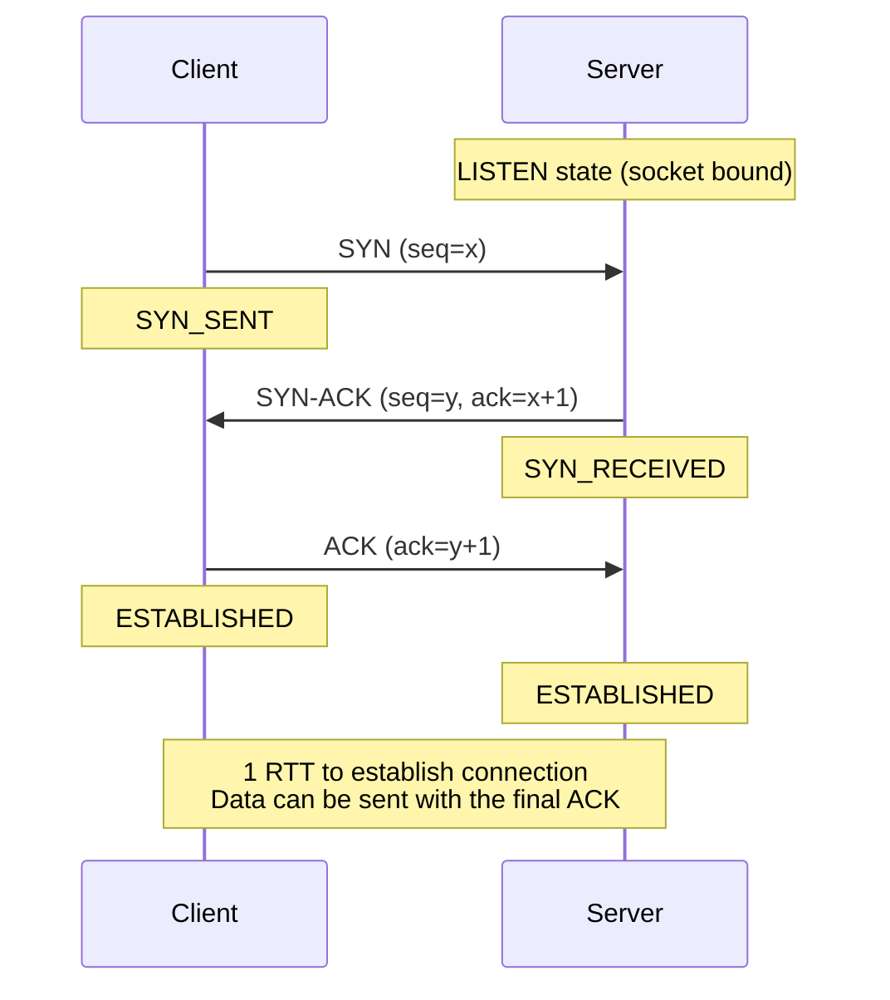
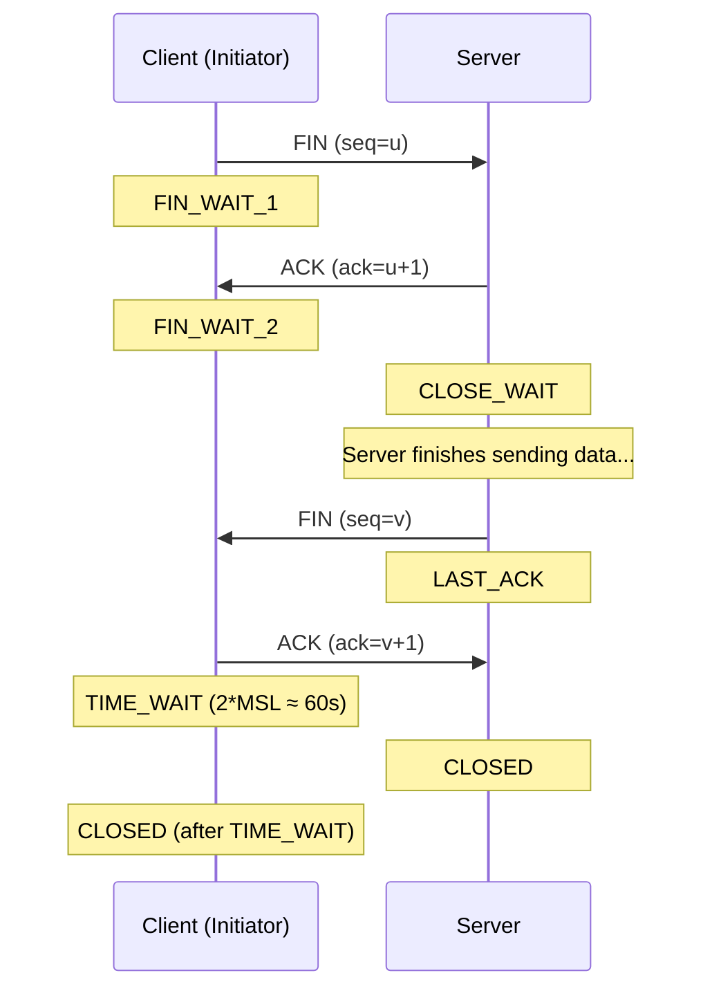
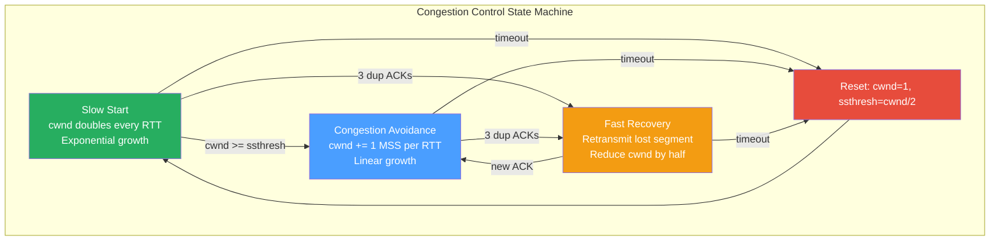
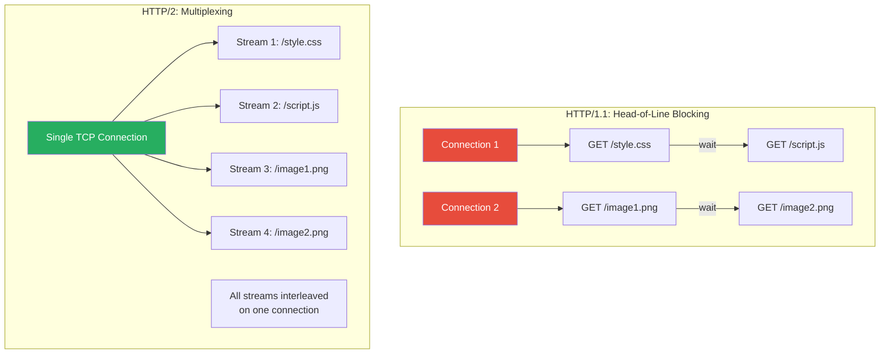
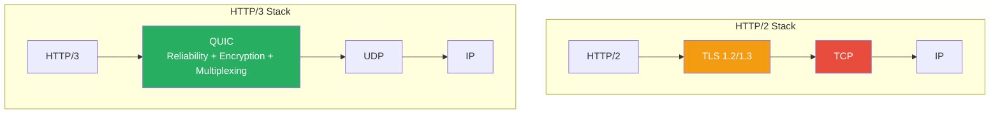
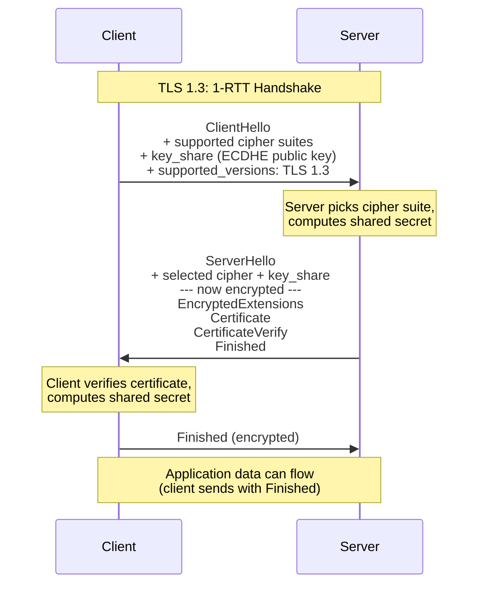

# Networking Deep Dive — TCP Internals, Congestion Control, HTTP/2-3, TLS & QUIC

## Table of Contents

- [TCP Internals](#tcp-internals)
- [TCP Congestion Control](#tcp-congestion-control)
- [Flow Control](#flow-control)
- [HTTP/2 Multiplexing](#http2-multiplexing)
- [HTTP/3 and QUIC](#http3-and-quic)
- [TLS 1.3 Handshake](#tls-13-handshake)
- [Comparison Tables](#comparison-tables)
- [Code Examples](#code-examples)
- [Interview Q&A](#interview-qa)

---

## TCP Internals

### Three-Way Handshake



### Four-Way Connection Termination



### TCP State Machine

| State | Description | Common Issue |
|-------|-------------|--------------|
| `LISTEN` | Server waiting for connections | Backlog full → connections refused |
| `SYN_SENT` | Client sent SYN, waiting | Firewall blocking → timeout |
| `SYN_RECEIVED` | Server got SYN, sent SYN-ACK | SYN flood attack target |
| `ESTABLISHED` | Connection active | Normal data transfer |
| `FIN_WAIT_1` | Sent FIN, waiting for ACK | |
| `FIN_WAIT_2` | Got ACK for FIN, waiting for peer's FIN | Peer not closing → stuck |
| `TIME_WAIT` | Waiting for 2*MSL (60s default) | **Port exhaustion** on high-churn servers |
| `CLOSE_WAIT` | Got FIN, need to close our side | **App bug** — not calling `close()` |

### TIME_WAIT and Backend Impact

`TIME_WAIT` lasts 2*MSL (Maximum Segment Lifetime, typically 60 seconds). During this period, the port can't be reused. For high-throughput services making many short-lived connections:

```bash
# Check TIME_WAIT connections
ss -s
# or
netstat -an | grep TIME_WAIT | wc -l

# Kernel tuning for high-connection servers
# /etc/sysctl.conf
net.ipv4.tcp_tw_reuse = 1          # Reuse TIME_WAIT connections
net.ipv4.tcp_fin_timeout = 15       # Reduce FIN_WAIT_2 timeout
net.core.somaxconn = 65535          # Listen backlog
net.ipv4.tcp_max_syn_backlog = 65535
```

### TCP Segment Structure

| Field | Size | Purpose |
|-------|------|---------|
| Source Port | 16 bits | Sender's port |
| Destination Port | 16 bits | Receiver's port |
| Sequence Number | 32 bits | Byte position in stream |
| Acknowledgment Number | 32 bits | Next expected byte from sender |
| Flags (SYN, ACK, FIN, RST, PSH) | 6 bits | Control flags |
| Window Size | 16 bits | Receiver's available buffer (flow control) |
| Checksum | 16 bits | Error detection |
| Options | Variable | MSS, Window Scale, SACK, Timestamps |

---

## TCP Congestion Control

Congestion control prevents the sender from overwhelming the network. The sender maintains a **congestion window (cwnd)** that limits bytes in flight.



### Slow Start

1. Connection starts with `cwnd = 1 MSS` (or 10 MSS in modern Linux — IW10).
2. For every ACK received, `cwnd += 1 MSS`.
3. Effectively doubles cwnd every RTT (exponential growth).
4. Continues until `cwnd >= ssthresh` (slow start threshold), then switches to Congestion Avoidance.

### Congestion Avoidance

1. `cwnd += MSS * (MSS / cwnd)` per ACK — approximately 1 MSS per RTT (linear growth).
2. Much slower growth to avoid congestion.

### Fast Retransmit / Fast Recovery

1. On receiving 3 duplicate ACKs (packet likely lost but network not severely congested):
   - Retransmit the missing segment immediately (don't wait for timeout).
   - `ssthresh = cwnd / 2`
   - `cwnd = ssthresh + 3 MSS`
   - Enter Fast Recovery.

### Modern Algorithms

| Algorithm | Strategy | Use Case |
|-----------|----------|----------|
| **Reno** | Classic AIMD (Additive Increase, Multiplicative Decrease) | Legacy |
| **CUBIC** | Cubic function for cwnd growth, time-based | **Linux default** |
| **BBR** (Google) | Model-based: estimates bandwidth and RTT | Google's servers, YouTube |
| **BBR v2** | Improved fairness over BBR v1 | Newer deployments |

**BBR vs CUBIC**: CUBIC is loss-based (reduces on packet loss). BBR is model-based (estimates bottleneck bandwidth and min RTT). BBR performs much better on lossy networks (mobile, long-distance) because it doesn't interpret loss as congestion.

---

## Flow Control

Flow control prevents the sender from overwhelming the **receiver** (vs congestion control, which protects the **network**).

| Concept | Controls | Mechanism |
|---------|----------|-----------|
| **Flow Control** | Sender → Receiver rate | Receiver's window (rwnd) |
| **Congestion Control** | Sender → Network rate | Congestion window (cwnd) |
| **Effective Window** | Actual sending rate | `min(cwnd, rwnd)` |

The receiver advertises its available buffer space in the **Window Size** field of every ACK. The sender never sends more than this.

```
Sender's effective window = min(cwnd, rwnd)

If rwnd = 0: sender stops (receiver buffer full)
             sender sends periodic "window probes" to check
```

---

## HTTP/2 Multiplexing

HTTP/1.1 suffered from **head-of-line (HOL) blocking**: only one request/response pair per TCP connection at a time (browsers opened 6-8 connections to work around this).



### HTTP/2 Key Features

| Feature | Description |
|---------|-------------|
| **Binary framing** | Requests/responses split into binary frames (not text) |
| **Multiplexing** | Multiple streams on one TCP connection, interleaved |
| **Header compression** | HPACK — headers compressed with static + dynamic tables |
| **Server push** | Server proactively sends resources before client requests them |
| **Stream prioritization** | Client can indicate priority of each stream |
| **Flow control** | Per-stream and per-connection flow control |

### HTTP/2's Remaining Problem: TCP HOL Blocking

Even with HTTP/2 multiplexing, if a single TCP packet is lost, **all streams** on that connection are blocked until retransmission. This is TCP-level head-of-line blocking — and it's why HTTP/3 was created.

---

## HTTP/3 and QUIC

QUIC runs over **UDP** instead of TCP, implementing its own reliability, congestion control, and encryption — eliminating TCP HOL blocking.



### QUIC Key Features

| Feature | Benefit |
|---------|---------|
| **No TCP HOL blocking** | Each stream is independent — loss in one stream doesn't block others |
| **0-RTT connection establishment** | Combine transport + TLS handshake; reconnections can send data immediately |
| **Built-in TLS 1.3** | Always encrypted; no unencrypted option |
| **Connection migration** | Connection ID (not IP:port) identifies connections — survives network switches |
| **Userspace implementation** | Easier to update than kernel TCP stack |

### Connection Establishment Comparison

| Protocol | New Connection | Resumed Connection |
|----------|---------------|-------------------|
| TCP + TLS 1.2 | 3 RTT (TCP handshake + TLS handshake) | 2 RTT |
| TCP + TLS 1.3 | 2 RTT (TCP handshake + TLS 1-RTT) | 1 RTT (TLS 0-RTT) |
| QUIC (HTTP/3) | **1 RTT** (combined transport + TLS) | **0 RTT** |

---

## TLS 1.3 Handshake

TLS 1.3 simplified the handshake from 2 round trips (TLS 1.2) to **1 round trip** by combining key exchange with the first flight.



### TLS 1.3 vs 1.2

| Feature | TLS 1.2 | TLS 1.3 |
|---------|---------|---------|
| **Handshake RTT** | 2 RTT | 1 RTT (0-RTT for resumed) |
| **Key exchange** | RSA or ECDHE | ECDHE only (forward secrecy mandatory) |
| **Cipher suites** | ~40 options | 5 options (removed weak ciphers) |
| **Encryption starts** | After 2nd RTT | After 1st RTT |
| **0-RTT resumption** | No | Yes (with replay protection caveats) |
| **Static RSA** | Supported | Removed (enables forward secrecy) |

### 0-RTT Resumption Caveat

TLS 1.3 0-RTT data can be **replayed** by an attacker. The early data is not protected against replay. Therefore:
- Only use 0-RTT for **idempotent requests** (GET, not POST).
- Servers should implement replay protection or accept the risk.

---

## Comparison Tables

### HTTP Version Evolution

| Feature | HTTP/1.0 | HTTP/1.1 | HTTP/2 | HTTP/3 |
|---------|----------|----------|--------|--------|
| **Year** | 1996 | 1997 | 2015 | 2022 |
| **Transport** | TCP | TCP | TCP | **QUIC (UDP)** |
| **Connections** | 1 per request | Persistent (keep-alive) | 1 multiplexed | 1 multiplexed |
| **HOL blocking** | Yes (connection) | Yes (connection) | Yes (TCP layer) | **No** |
| **Header format** | Text | Text | **Binary (HPACK)** | **Binary (QPACK)** |
| **Server push** | No | No | Yes | Yes |
| **Encryption** | Optional | Optional | Practically required | **Always (built-in)** |
| **Connection setup** | 1 RTT (TCP) | 1 RTT (TCP) | 2-3 RTT (TCP+TLS) | **1 RTT (0-RTT resumed)** |

### TCP vs UDP

| Property | TCP | UDP |
|----------|-----|-----|
| **Connection** | Connection-oriented (handshake) | Connectionless |
| **Reliability** | Guaranteed delivery, ordering | No guarantees |
| **Flow control** | Yes (window-based) | No |
| **Congestion control** | Yes (cwnd) | No (application must handle) |
| **Header size** | 20-60 bytes | 8 bytes |
| **Use case** | HTTP, database connections, file transfer | DNS, video streaming, gaming, **QUIC** |
| **Head-of-line blocking** | Yes | No |

### Congestion Control Algorithms

| Algorithm | Type | cwnd Growth | Loss Response | Best For |
|-----------|------|-------------|---------------|----------|
| **Reno** | Loss-based | Linear (CA) | Halve cwnd | Legacy |
| **CUBIC** | Loss-based | Cubic function | Reduce cwnd (cubic) | **Linux default**, general purpose |
| **BBR** | Model-based | Probe bandwidth/RTT | Reduce by estimated BDP | Lossy networks, long-distance |
| **Westwood+** | Bandwidth estimation | Based on estimated BWE | Reduce proportionally | Lossy wireless networks |

---

## Code Examples

### TCP Server with Connection Tracking

```typescript
import net from "net";

interface ConnectionInfo {
  id: number;
  remoteAddress: string;
  remotePort: number;
  connectedAt: Date;
  bytesReceived: number;
  bytesSent: number;
}

const connections = new Map<number, ConnectionInfo>();
let connectionCounter = 0;

const server = net.createServer({ keepAlive: true, noDelay: true }, (socket) => {
  const connId = ++connectionCounter;

  const info: ConnectionInfo = {
    id: connId,
    remoteAddress: socket.remoteAddress || "unknown",
    remotePort: socket.remotePort || 0,
    connectedAt: new Date(),
    bytesReceived: 0,
    bytesSent: 0,
  };
  connections.set(connId, info);

  console.log(`[${connId}] Connected from ${info.remoteAddress}:${info.remotePort}`);
  console.log(`Active connections: ${connections.size}`);

  socket.on("data", (data: Buffer) => {
    info.bytesReceived += data.length;
    // Echo back (example)
    const response = Buffer.from(`Received ${data.length} bytes\n`);
    socket.write(response);
    info.bytesSent += response.length;
  });

  socket.on("close", () => {
    connections.delete(connId);
    const duration = Date.now() - info.connectedAt.getTime();
    console.log(
      `[${connId}] Disconnected after ${duration}ms. ` +
      `Rx: ${info.bytesReceived}B, Tx: ${info.bytesSent}B`
    );
  });

  socket.on("error", (err) => {
    console.error(`[${connId}] Socket error:`, err.message);
  });

  // TCP keepalive to detect dead connections
  socket.setKeepAlive(true, 60_000);

  // Read timeout
  socket.setTimeout(120_000, () => {
    console.log(`[${connId}] Idle timeout — closing`);
    socket.end();
  });
});

server.listen(8080, () => {
  console.log("TCP server listening on port 8080");
});

// Expose metrics
setInterval(() => {
  console.log(`Active connections: ${connections.size}`);
}, 10_000);
```

### HTTP/2 Server in Node.js

```typescript
import http2 from "http2";
import { readFileSync } from "fs";

const server = http2.createSecureServer({
  key: readFileSync("server.key"),
  cert: readFileSync("server.crt"),

  // HTTP/2 settings
  settings: {
    maxConcurrentStreams: 100,    // Max parallel streams per connection
    initialWindowSize: 65535,     // Flow control window
    headerTableSize: 4096,        // HPACK dynamic table size
  },
});

server.on("stream", (stream, headers) => {
  const method = headers[":method"];
  const path = headers[":path"];

  console.log(`${method} ${path} (Stream ID: ${stream.id})`);

  // Server push example
  if (path === "/index.html") {
    // Push CSS before the client requests it
    stream.pushStream({ ":path": "/style.css" }, (err, pushStream) => {
      if (err) return;
      pushStream.respond({
        ":status": 200,
        "content-type": "text/css",
        "cache-control": "max-age=3600",
      });
      pushStream.end("body { font-family: sans-serif; }");
    });
  }

  // Main response
  stream.respond({
    ":status": 200,
    "content-type": "text/html",
  });
  stream.end("<html><head><link rel='stylesheet' href='/style.css'></head><body>Hello HTTP/2!</body></html>");
});

server.on("session", (session) => {
  console.log("New HTTP/2 session");

  session.on("close", () => {
    console.log("HTTP/2 session closed");
  });
});

server.listen(443, () => {
  console.log("HTTP/2 server on port 443");
});
```

### Measuring TCP Connection Timing

```typescript
import { Socket } from "net";
import tls from "tls";

interface ConnectionTiming {
  dnsLookupMs: number;
  tcpConnectMs: number;
  tlsHandshakeMs: number;
  totalMs: number;
}

async function measureConnection(host: string, port: number = 443): Promise<ConnectionTiming> {
  return new Promise((resolve, reject) => {
    const start = process.hrtime.bigint();
    let dnsTime = 0n;
    let tcpTime = 0n;
    let tlsTime = 0n;

    const socket = new Socket();

    socket.on("lookup", () => {
      dnsTime = process.hrtime.bigint() - start;
    });

    socket.on("connect", () => {
      tcpTime = process.hrtime.bigint() - start;

      // Upgrade to TLS
      const tlsSocket = tls.connect({ socket, host, servername: host }, () => {
        tlsTime = process.hrtime.bigint() - start;

        resolve({
          dnsLookupMs: Number(dnsTime) / 1e6,
          tcpConnectMs: Number(tcpTime) / 1e6,
          tlsHandshakeMs: Number(tlsTime - tcpTime) / 1e6,
          totalMs: Number(tlsTime) / 1e6,
        });

        tlsSocket.destroy();
      });

      tlsSocket.on("error", reject);
    });

    socket.on("error", reject);
    socket.connect(port, host);
  });
}

// Usage
const timing = await measureConnection("api.example.com");
console.log(`DNS:  ${timing.dnsLookupMs.toFixed(1)}ms`);
console.log(`TCP:  ${timing.tcpConnectMs.toFixed(1)}ms`);
console.log(`TLS:  ${timing.tlsHandshakeMs.toFixed(1)}ms`);
console.log(`Total: ${timing.totalMs.toFixed(1)}ms`);
```

---

## Interview Q&A

> **Q1: Explain the TCP three-way handshake. Why three steps and not two?**
>
> The handshake: (1) Client sends SYN with initial sequence number (ISN). (2) Server responds with SYN-ACK containing its own ISN and acknowledging the client's. (3) Client sends ACK acknowledging the server's ISN. Three steps are needed because TCP is bidirectional — each side must synchronize its sequence number. Two steps would mean the server doesn't know if the client received its ISN, leading to half-open connections. The third ACK confirms the client received the server's ISN and is ready to communicate. This also protects against stale SYN packets from old connections (the ISN exchange detects them).

> **Q2: What is TCP head-of-line blocking and how does HTTP/3 solve it?**
>
> TCP delivers bytes in order. If packet 3 of 5 is lost, packets 4 and 5 must wait in the receiver's buffer until packet 3 is retransmitted — even though they're complete. With HTTP/2's multiplexing, multiple streams share one TCP connection, so a single lost packet blocks ALL streams. HTTP/3 uses QUIC (over UDP), which implements per-stream reliability. Each stream has independent ordering, so a lost packet only blocks its own stream. Additionally, QUIC integrates TLS 1.3, reducing connection setup from 2-3 RTT (TCP + TLS) to 1 RTT (0-RTT for resumed connections).

> **Q3: Explain the difference between TCP flow control and congestion control.**
>
> Flow control prevents the sender from overwhelming the **receiver**. The receiver advertises its available buffer space (`rwnd`) in every ACK. Congestion control prevents the sender from overwhelming the **network**. The sender maintains a congestion window (`cwnd`) based on observed packet loss and RTT. The effective sending rate is `min(cwnd, rwnd)`. Flow control is endpoint-to-endpoint and directly communicated. Congestion control is inferred from network behavior (loss, delay). They solve different problems: flow control prevents buffer overflow at the receiver; congestion control prevents router queue overflow in the network.

> **Q4: What is the TIME_WAIT state and why does it cause problems for high-traffic servers?**
>
> TIME_WAIT occurs after a TCP connection is closed, lasting 2*MSL (typically 60 seconds). Its purpose: (1) ensure the final ACK reaches the peer (if lost, the peer will retransmit FIN). (2) Let delayed packets expire so they don't interfere with new connections on the same port. The problem: each TIME_WAIT socket holds a source port. On high-churn servers making many short-lived outbound connections, you can exhaust the ~28,000 ephemeral ports. Solutions: `tcp_tw_reuse=1` (reuse TIME_WAIT sockets for new outbound connections), connection pooling (keep-alive to reuse connections), increase ephemeral port range (`ip_local_port_range`).

> **Q5: How does TLS 1.3 achieve a 1-RTT handshake compared to TLS 1.2's 2-RTT?**
>
> TLS 1.2 separates key exchange from handshake completion: ClientHello, ServerHello (1 RTT), then key exchange, ChangeCipherSpec, Finished (2nd RTT). TLS 1.3 combines them: the client sends its key share (ECDHE public key) with ClientHello. The server responds with its key share, certificate, and Finished — all in one flight. Both sides can compute the shared secret immediately. The client sends its Finished (and can attach early application data) in the second flight. TLS 1.3 also removes RSA key exchange (all key exchanges provide forward secrecy), reduced cipher suites from ~40 to 5, and the entire handshake after ServerHello is encrypted.

> **Q6: When would you choose HTTP/2 vs HTTP/3 for a backend API?**
>
> HTTP/2 is the safe default: widely supported, works through all proxies and CDNs, and multiplexing solves most HTTP/1.1 problems. Choose HTTP/3 when: (1) Clients experience high packet loss (mobile networks, unstable WiFi) — QUIC eliminates TCP HOL blocking. (2) Connection migration is valuable (mobile apps switching between WiFi and cellular). (3) Low-latency connection setup matters (0-RTT). (4) You're behind a CDN that supports it (Cloudflare, Google). Challenges with HTTP/3: some firewalls block UDP, debugging tools are less mature, and middleboxes may interfere. For server-to-server communication (microservices within a data center with reliable networks), HTTP/2 is usually sufficient — the benefits of HTTP/3 are most visible on unreliable networks.
