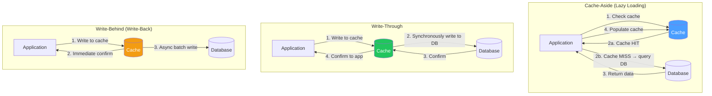
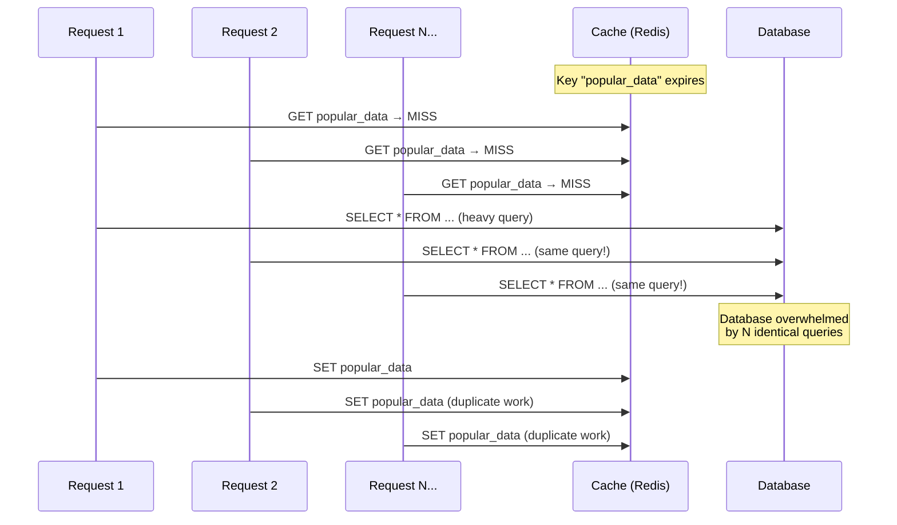
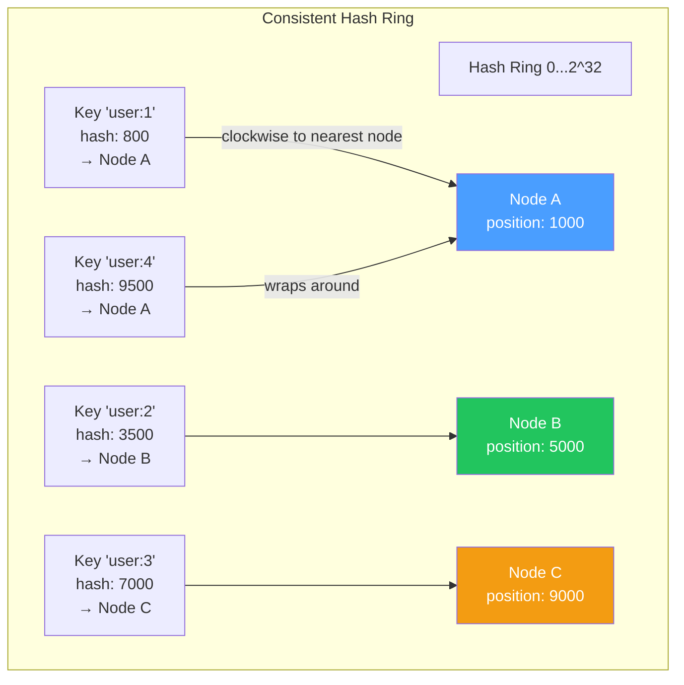

# Caching Deep Dive — Cache Stampede, Redis Internals, Hot Keys & Distributed Caching

## Table of Contents

- [Caching Patterns](#caching-patterns)
- [Cache Eviction Strategies](#cache-eviction-strategies)
- [Cache Stampede (Thundering Herd)](#cache-stampede-thundering-herd)
- [Redis Internals](#redis-internals)
- [Redis Data Structures](#redis-data-structures)
- [Hot Key Problem](#hot-key-problem)
- [Distributed Caching](#distributed-caching)
- [Comparison Tables](#comparison-tables)
- [Code Examples](#code-examples)
- [Interview Q&A](#interview-qa)

---

## Caching Patterns



### Pattern Comparison

| Pattern | Consistency | Write Latency | Read Latency | Complexity | Data Loss Risk |
|---------|-------------|---------------|--------------|------------|---------------|
| **Cache-Aside** | Eventual (stale reads possible) | N/A (writes go to DB) | Low (after first miss) | Low | None |
| **Read-Through** | Eventual (similar to cache-aside) | N/A | Low | Medium (cache manages loads) | None |
| **Write-Through** | Strong (cache + DB always in sync) | Higher (sync write to both) | Low | Medium | None |
| **Write-Behind** | Eventual (async DB writes) | **Lowest** (cache-only ack) | Low | High | **Yes** (if cache crashes) |
| **Refresh-Ahead** | Proactive refresh before expiry | N/A | Lowest (always hot) | High | None |

---

## Cache Eviction Strategies

| Strategy | How It Works | Pros | Cons |
|----------|-------------|------|------|
| **LRU** (Least Recently Used) | Evicts the entry not accessed for the longest time | Good general purpose, recency-aware | Extra overhead tracking access time |
| **LFU** (Least Frequently Used) | Evicts the entry accessed fewest times | Good for stable access patterns | New entries get evicted too quickly |
| **FIFO** (First In, First Out) | Evicts the oldest entry | Simple | Ignores access frequency/recency |
| **TTL** (Time To Live) | Evicts after fixed time period | Bounded staleness | May evict hot data |
| **Random** | Evicts a random entry | Simple, no tracking overhead | Unpredictable |
| **LRU-K** | LRU but considers K-th most recent access | Better than LRU for scan-resistant cache | More complex |
| **ARC** (Adaptive Replacement Cache) | Combines LRU and LFU, self-tuning | Excellent hit rate | Complex, patented |

### Redis Eviction Policies

| Policy | Scope | Strategy |
|--------|-------|----------|
| `noeviction` | — | Return error on write when memory full |
| `allkeys-lru` | All keys | LRU across all keys |
| `volatile-lru` | Keys with TTL | LRU among keys with expiry set |
| `allkeys-lfu` | All keys | LFU across all keys |
| `volatile-lfu` | Keys with TTL | LFU among keys with expiry |
| `allkeys-random` | All keys | Random eviction |
| `volatile-random` | Keys with TTL | Random among keys with expiry |
| `volatile-ttl` | Keys with TTL | Shortest TTL evicted first |

---

## Cache Stampede (Thundering Herd)

A cache stampede occurs when a popular cache entry expires and many concurrent requests simultaneously try to regenerate it, hammering the database.



### Mitigation Strategies

#### 1. Mutex / Locking

Only one request regenerates; others wait for the new value.

```typescript
import Redis from "ioredis";

const redis = new Redis();

async function getWithMutex<T>(
  key: string,
  ttlSeconds: number,
  fetchFn: () => Promise<T>
): Promise<T> {
  // Try cache first
  const cached = await redis.get(key);
  if (cached) return JSON.parse(cached);

  const lockKey = `lock:${key}`;
  const lockTTL = 10; // Lock expires in 10s (safety net)

  // Try to acquire lock
  const acquired = await redis.set(lockKey, "1", "EX", lockTTL, "NX");

  if (acquired) {
    try {
      // We got the lock — fetch from source
      const data = await fetchFn();
      await redis.set(key, JSON.stringify(data), "EX", ttlSeconds);
      return data;
    } finally {
      await redis.del(lockKey);
    }
  } else {
    // Someone else is fetching — wait and retry
    await new Promise((resolve) => setTimeout(resolve, 100));
    return getWithMutex(key, ttlSeconds, fetchFn);
  }
}
```

#### 2. Stale-While-Revalidate

Serve stale data while refreshing in the background.

```typescript
async function getWithStaleWhileRevalidate<T>(
  key: string,
  ttlSeconds: number,
  staleTTLSeconds: number,
  fetchFn: () => Promise<T>
): Promise<T | null> {
  const raw = await redis.get(key);

  if (raw) {
    const { data, expiresAt } = JSON.parse(raw);

    if (Date.now() < expiresAt) {
      return data; // Fresh data
    }

    // Data is stale but within stale window — serve it and refresh async
    refreshInBackground(key, ttlSeconds, staleTTLSeconds, fetchFn);
    return data;
  }

  // No data at all — must fetch synchronously
  const data = await fetchFn();
  await storeWithTimestamp(key, data, ttlSeconds, staleTTLSeconds);
  return data;
}

async function storeWithTimestamp<T>(
  key: string,
  data: T,
  ttlSeconds: number,
  staleTTLSeconds: number
): Promise<void> {
  const entry = {
    data,
    expiresAt: Date.now() + ttlSeconds * 1000,
  };
  await redis.set(key, JSON.stringify(entry), "EX", ttlSeconds + staleTTLSeconds);
}

function refreshInBackground<T>(
  key: string,
  ttlSeconds: number,
  staleTTLSeconds: number,
  fetchFn: () => Promise<T>
): void {
  fetchFn().then((data) => {
    storeWithTimestamp(key, data, ttlSeconds, staleTTLSeconds);
  }).catch((err) => {
    console.error(`Background refresh failed for ${key}:`, err);
  });
}
```

#### 3. Probabilistic Early Expiration (XFetch)

Each request has a small probability of refreshing the cache before it actually expires.

```typescript
async function getWithXFetch<T>(
  key: string,
  ttlSeconds: number,
  beta: number, // Typically 1.0
  fetchFn: () => Promise<T>
): Promise<T> {
  const raw = await redis.get(key);

  if (raw) {
    const { data, delta, expiresAt } = JSON.parse(raw);
    const now = Date.now();

    // Probabilistic early expiration
    const ttlRemaining = (expiresAt - now) / 1000;
    const shouldRefresh = ttlRemaining - delta * beta * Math.log(Math.random()) <= 0;

    if (!shouldRefresh) {
      return data;
    }
    // Fall through to refetch
  }

  const start = Date.now();
  const data = await fetchFn();
  const delta = (Date.now() - start) / 1000; // Computation time

  const entry = {
    data,
    delta,
    expiresAt: Date.now() + ttlSeconds * 1000,
  };
  await redis.set(key, JSON.stringify(entry), "EX", ttlSeconds);

  return data;
}
```

---

## Redis Internals

### Threading Model

Redis is **mostly single-threaded** for command execution. This simplifies its design and avoids lock contention.

```mermaid
graph TB
    subgraph "Redis 7.x Architecture"
        MAIN[Main Thread<br/>Command Execution<br/>Event Loop]

        subgraph "I/O Threads (since Redis 6)"
            IO1[I/O Thread 1<br/>Read/Write socket data]
            IO2[I/O Thread 2]
            IO3[I/O Thread 3]
        end

        subgraph "Background Threads"
            BG1[BIO: Lazy Free<br/>Async key deletion]
            BG2[BIO: AOF fsync<br/>Background fsync]
            BG3[BIO: Close file<br/>Async FD close]
        end

        FORK[fork() for RDB/AOF rewrite]
    end

    IO1 -->|parsed commands| MAIN
    IO2 -->|parsed commands| MAIN
    IO3 -->|parsed commands| MAIN
    MAIN -->|responses| IO1
    MAIN -->|responses| IO2
    MAIN -->|responses| IO3
    MAIN -.->|triggers| BG1
    MAIN -.->|triggers| BG2
    MAIN -.->|triggers| FORK

    style MAIN fill:#e74c3c,color:#fff
```

### Persistence Mechanisms

| Mechanism | How | Durability | Performance Impact |
|-----------|-----|------------|-------------------|
| **RDB (Snapshotting)** | `fork()` → child writes entire dataset to disk | Point-in-time (can lose data since last snapshot) | Minimal (COW fork) |
| **AOF (Append-Only File)** | Logs every write command | Configurable: `always`, `everysec`, `no` | Higher with `always` (fsync on every write) |
| **RDB + AOF** | Both mechanisms | Best of both | Combined overhead |
| **AOF Rewrite** | `fork()` → child compacts AOF | No data loss | COW fork overhead |

### Memory Encoding Optimizations

Redis uses compact encodings for small data:

| Type | Small Encoding | Threshold | Full Encoding |
|------|---------------|-----------|---------------|
| **String** | int (if numeric) or embstr | ≤ 44 bytes | raw (SDS) |
| **List** | listpack (ziplist replacement) | ≤ 128 elements, ≤ 64 bytes each | quicklist |
| **Hash** | listpack | ≤ 128 fields, ≤ 64 bytes each | hashtable |
| **Set** | listpack (or intset if all integers) | ≤ 128 members, ≤ 64 bytes each | hashtable |
| **Sorted Set** | listpack | ≤ 128 members, ≤ 64 bytes each | skiplist + hashtable |

---

## Redis Data Structures

### Internal Data Structures

| Redis Type | Internal Structure | Operations | Time Complexity |
|------------|-------------------|------------|-----------------|
| **String** | Simple Dynamic String (SDS) | GET, SET, INCR, APPEND | O(1) |
| **List** | Quicklist (linked list of listpacks) | LPUSH, RPOP, LRANGE | O(1) push/pop, O(n) range |
| **Hash** | Listpack or Hashtable | HSET, HGET, HGETALL | O(1) per field |
| **Set** | Intset or Hashtable | SADD, SISMEMBER, SINTER | O(1) add/check, O(n*m) intersection |
| **Sorted Set** | Skiplist + Hashtable | ZADD, ZRANGE, ZRANGEBYSCORE | O(log n) add, O(log n + k) range |
| **Stream** | Radix tree of listpacks | XADD, XREAD, XRANGE | O(1) add, O(n) read |
| **HyperLogLog** | Probabilistic (12KB fixed) | PFADD, PFCOUNT | O(1) |
| **Bitmap** | String (bit array) | SETBIT, GETBIT, BITCOUNT | O(1) per bit |

---

## Hot Key Problem

A **hot key** is a cache key that receives a disproportionate amount of traffic, potentially overwhelming a single Redis node.

### Detection

```typescript
// Monitor key access frequency
// Redis CLI: redis-cli --hotkeys (uses LFU info)
// Or: redis-cli MONITOR (WARNING: performance impact in production)

// Application-level tracking
class HotKeyDetector {
  private accessCounts = new Map<string, number>();
  private windowStart = Date.now();
  private readonly windowMs = 60_000;
  private readonly threshold = 10_000;

  recordAccess(key: string): void {
    const now = Date.now();
    if (now - this.windowStart > this.windowMs) {
      this.report();
      this.accessCounts.clear();
      this.windowStart = now;
    }

    const count = (this.accessCounts.get(key) || 0) + 1;
    this.accessCounts.set(key, count);
  }

  private report(): void {
    for (const [key, count] of this.accessCounts) {
      if (count > this.threshold) {
        console.warn(`Hot key detected: "${key}" — ${count} accesses in ${this.windowMs}ms`);
      }
    }
  }
}
```

### Solutions

| Solution | How | Trade-off |
|----------|-----|-----------|
| **Local cache (L1)** | Cache hot keys in application memory | Staleness; memory per instance |
| **Key splitting** | Distribute `key` → `key:1`, `key:2`, ..., `key:N`; read random shard | Complexity; update all shards |
| **Read replicas** | Read from replicas, write to primary | Replication lag; more nodes |
| **Client-side caching** | Redis 6+ server-assisted client cache | Need client support |

```typescript
import { LRUCache } from "lru-cache";
import Redis from "ioredis";

// L1 (in-process) + L2 (Redis) caching
class TwoTierCache {
  private l1: LRUCache<string, string>;
  private l2: Redis;

  constructor(redis: Redis) {
    this.l1 = new LRUCache({
      max: 1000,
      ttl: 5_000, // 5 second local TTL (short to limit staleness)
    });
    this.l2 = redis;
  }

  async get(key: string): Promise<string | null> {
    // L1 check
    const l1Value = this.l1.get(key);
    if (l1Value !== undefined) return l1Value;

    // L2 check
    const l2Value = await this.l2.get(key);
    if (l2Value !== null) {
      this.l1.set(key, l2Value);
      return l2Value;
    }

    return null;
  }

  async set(key: string, value: string, ttlSeconds: number): Promise<void> {
    await this.l2.set(key, value, "EX", ttlSeconds);
    this.l1.set(key, value);
  }

  async invalidate(key: string): Promise<void> {
    this.l1.delete(key);
    await this.l2.del(key);
  }
}
```

---

## Distributed Caching

### Consistent Hashing

Consistent hashing distributes keys across cache nodes such that adding or removing a node only remaps ~1/N of keys.



### Redis Cluster

| Feature | Description |
|---------|-------------|
| **Hash slots** | 16384 slots distributed across nodes |
| **Slot assignment** | Each master owns a range of slots |
| **Key routing** | `HASH_SLOT = CRC16(key) mod 16384` |
| **Replication** | Each master has 1+ replicas |
| **Failover** | Automatic — replica promoted if master fails |
| **Multi-key operations** | Only if all keys in same hash slot (use `{hash_tag}`) |

---

## Comparison Tables

### Cache-Aside vs Write-Through vs Write-Behind

| Scenario | Cache-Aside | Write-Through | Write-Behind |
|----------|-------------|---------------|--------------|
| Read-heavy (95% reads) | Best | Good | Good |
| Write-heavy (50%+ writes) | Moderate | Slow (sync DB writes) | **Best** (async writes) |
| Consistency requirement | Eventual | Strong | Eventual |
| Cache miss penalty | 1 DB query | 0 (cache always populated) | 0 |
| Data loss risk | None | None | **Data in cache not yet in DB** |
| Implementation | Simple | Moderate | Complex |

### Redis vs Memcached

| Feature | Redis | Memcached |
|---------|-------|-----------|
| **Data structures** | Strings, Lists, Sets, Hashes, Sorted Sets, Streams, etc. | Strings only |
| **Persistence** | RDB + AOF | None (pure cache) |
| **Clustering** | Redis Cluster (native) | Client-side consistent hashing |
| **Replication** | Master-replica | None |
| **Lua scripting** | Yes | No |
| **Pub/Sub** | Yes | No |
| **Memory efficiency** | Good (with encodings) | Excellent (slab allocator) |
| **Multi-threaded** | I/O threads (Redis 6+) | Yes (multi-threaded) |
| **Max value size** | 512MB | 1MB |
| **Use case** | Feature-rich caching, queues, pub/sub | Simple high-throughput caching |

---

## Code Examples

### Redis Pipeline for Bulk Operations

```typescript
import Redis from "ioredis";

const redis = new Redis();

async function bulkCachePopulate(
  items: Array<{ key: string; value: object; ttl: number }>
): Promise<void> {
  const pipeline = redis.pipeline();

  for (const item of items) {
    pipeline.set(item.key, JSON.stringify(item.value), "EX", item.ttl);
  }

  const results = await pipeline.exec();

  const errors = results?.filter(([err]) => err !== null);
  if (errors && errors.length > 0) {
    console.error(`${errors.length} pipeline errors`);
  }
}

// Bulk read
async function bulkCacheGet(keys: string[]): Promise<Map<string, object | null>> {
  const pipeline = redis.pipeline();
  for (const key of keys) {
    pipeline.get(key);
  }

  const results = await pipeline.exec();
  const map = new Map<string, object | null>();

  results?.forEach(([err, value], index) => {
    if (!err && value) {
      map.set(keys[index], JSON.parse(value as string));
    } else {
      map.set(keys[index], null);
    }
  });

  return map;
}
```

### Cache Invalidation Patterns

```typescript
import Redis from "ioredis";

const redis = new Redis();

// Pattern 1: Tag-based invalidation
class TaggedCache {
  async set(key: string, value: string, ttl: number, tags: string[]): Promise<void> {
    const pipeline = redis.pipeline();
    pipeline.set(key, value, "EX", ttl);

    // Track which keys belong to each tag
    for (const tag of tags) {
      pipeline.sadd(`tag:${tag}`, key);
      pipeline.expire(`tag:${tag}`, ttl + 60); // Tag lives slightly longer
    }

    await pipeline.exec();
  }

  async invalidateByTag(tag: string): Promise<number> {
    const keys = await redis.smembers(`tag:${tag}`);
    if (keys.length === 0) return 0;

    const pipeline = redis.pipeline();
    for (const key of keys) {
      pipeline.del(key);
    }
    pipeline.del(`tag:${tag}`);

    await pipeline.exec();
    return keys.length;
  }
}

// Pattern 2: Version-based invalidation
class VersionedCache {
  async getVersion(entity: string): Promise<number> {
    const v = await redis.get(`version:${entity}`);
    return v ? parseInt(v) : 1;
  }

  async invalidate(entity: string): Promise<void> {
    await redis.incr(`version:${entity}`);
    // Old keys naturally expire — no need to find and delete them
  }

  buildKey(entity: string, version: number, id: string): string {
    return `${entity}:v${version}:${id}`;
  }

  async get(entity: string, id: string): Promise<string | null> {
    const version = await this.getVersion(entity);
    return redis.get(this.buildKey(entity, version, id));
  }

  async set(entity: string, id: string, value: string, ttl: number): Promise<void> {
    const version = await this.getVersion(entity);
    await redis.set(this.buildKey(entity, version, id), value, "EX", ttl);
  }
}
```

---

## Interview Q&A

> **Q1: Explain cache stampede and three ways to prevent it.**
>
> Cache stampede occurs when a popular key expires and many concurrent requests simultaneously query the database to regenerate it. Prevention: (1) **Mutex/Lock**: only one request regenerates; others wait or get stale data. Use Redis `SET NX` as a distributed lock. (2) **Stale-while-revalidate**: serve expired data to all requests immediately, while one request refreshes in the background. (3) **Probabilistic early expiration (XFetch)**: each request has a probability of refreshing before actual expiry, proportional to how close the TTL is to zero. This spreads regeneration over time. Additional: never set the same TTL for all keys — add jitter (e.g., TTL + random(0, 60s)) to prevent mass expiration.

> **Q2: Why is Redis single-threaded and how does it still achieve high throughput?**
>
> Redis executes commands on a single thread to avoid synchronization overhead (locks, context switching). It achieves 100K+ ops/sec because: (1) All data is in memory — no disk I/O during command execution. (2) Operations are extremely fast (microseconds per command). (3) I/O multiplexing via epoll handles thousands of connections without threads. (4) Since Redis 6, I/O threads handle network read/write (parsing requests and writing responses) in parallel, while command execution remains single-threaded. (5) Most commands are O(1) or O(log n). The bottleneck is usually network, not CPU. For CPU-bound scenarios (Lua scripts, big O(n) commands), use Redis Cluster to scale horizontally.

> **Q3: How does Redis Cluster handle data distribution and failover?**
>
> Redis Cluster divides the key space into 16384 hash slots. Each master node owns a subset of slots. Keys are mapped to slots via `CRC16(key) % 16384`. When a client sends a command, the node checks if it owns the slot; if not, it responds with `MOVED` redirect. Each master has replicas; if a master fails, replicas detect this via gossip protocol and elect one to promote (Raft-like consensus). The failover typically takes 1-2 seconds. Multi-key operations only work if all keys map to the same slot — use hash tags `{user}:profile` and `{user}:orders` to force co-location.

> **Q4: When would you use Redis Sorted Sets and what is the internal implementation?**
>
> Sorted Sets are ideal for: leaderboards, rate limiters (sliding window), priority queues, time-series top-N, and range queries by score. Internally, they use a **skip list** (for ordered range operations in O(log n)) plus a **hash table** (for O(1) score lookups by member). This dual structure gives efficient O(log n) insertion/deletion and O(log n + k) range queries, while ZSCORE is O(1). For small sorted sets (< 128 elements), Redis uses a listpack encoding which is more memory-efficient.

> **Q5: How do you handle cache invalidation in a distributed system?**
>
> Cache invalidation is famously hard. Strategies: (1) **TTL-based**: set expiry times; accept bounded staleness. Simple but may serve stale data. (2) **Event-driven invalidation**: publish invalidation events via Redis Pub/Sub or Kafka when data changes; all instances subscribe and delete their local cache entries. (3) **Version-based**: include a version number in cache keys; bump version on writes; old keys expire naturally. (4) **Tag-based**: associate keys with tags (e.g., `user:123`); invalidate all keys with that tag on user update. (5) **Write-through**: always update cache on write; no separate invalidation needed. For multi-layer caches (L1 in-process + L2 Redis), use Redis keyspace notifications or a message bus to propagate invalidations to all L1 caches.

> **Q6: What is the difference between `allkeys-lru` and `volatile-lru` eviction policies in Redis?**
>
> `allkeys-lru` evicts any key (regardless of whether it has a TTL) using approximate LRU when memory is full. `volatile-lru` only evicts keys that have an expiry set (TTL). If no keys have TTL and memory is full, `volatile-lru` behaves like `noeviction` and returns errors. Use `allkeys-lru` when Redis is a pure cache (all data is regeneratable). Use `volatile-lru` when some keys are permanent (e.g., configuration, counters) and should never be evicted, while cached data with TTLs can be evicted. Note: Redis uses approximate LRU (sampling-based, not true LRU) — it samples N random keys and evicts the least recently used among the sample. This is configurable via `maxmemory-samples` (default 5).
