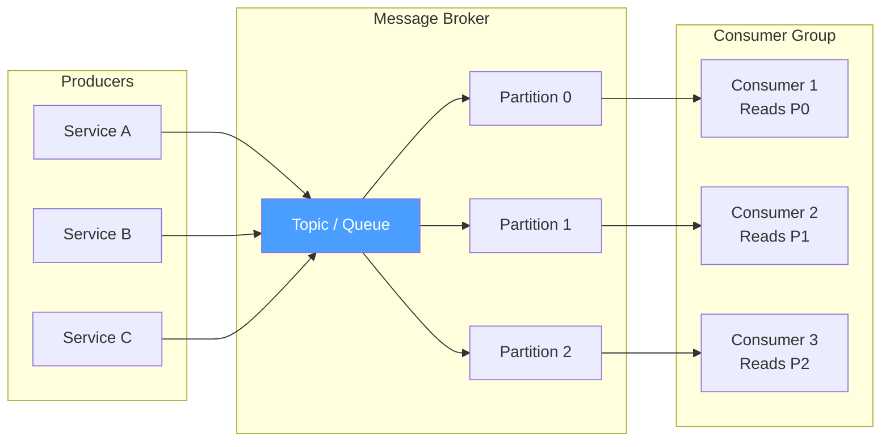
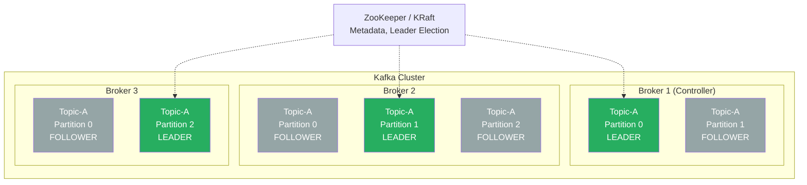
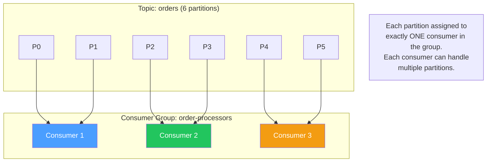
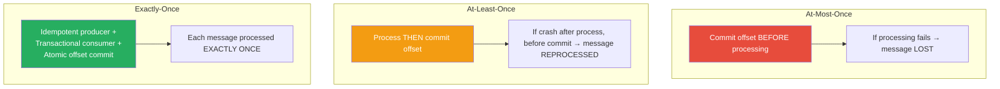
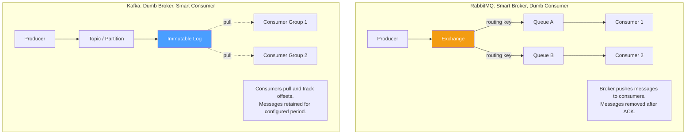

# Message Queues Deep Dive — Kafka Internals, Consumer Groups & Exactly-Once Semantics

## Table of Contents

- [Message Queue Fundamentals](#message-queue-fundamentals)
- [Kafka Architecture](#kafka-architecture)
- [Partitions and Partition Strategy](#partitions-and-partition-strategy)
- [Consumer Groups and Rebalancing](#consumer-groups-and-rebalancing)
- [Offset Management](#offset-management)
- [Delivery Semantics](#delivery-semantics)
- [Exactly-Once Semantics (EOS)](#exactly-once-semantics-eos)
- [In-Sync Replicas (ISR)](#in-sync-replicas-isr)
- [Dead Letter Queues](#dead-letter-queues)
- [RabbitMQ vs Kafka](#rabbitmq-vs-kafka)
- [Comparison Tables](#comparison-tables)
- [Code Examples](#code-examples)
- [Interview Q&A](#interview-qa)

---

## Message Queue Fundamentals

Message queues decouple producers from consumers, enabling asynchronous processing, load leveling, and fault tolerance.



### Messaging Patterns

| Pattern | Description | Example |
|---------|-------------|---------|
| **Point-to-Point** | One message → one consumer | Job queue, task processing |
| **Pub/Sub** | One message → many consumers | Event notification, fanout |
| **Request/Reply** | Message + reply channel | RPC over messaging |
| **Competing Consumers** | Multiple consumers share a queue | Load distribution |

---

## Kafka Architecture



### Core Components

| Component | Description |
|-----------|-------------|
| **Broker** | A Kafka server; stores partitions. A cluster has 3+ brokers. |
| **Topic** | Named stream of messages (like a table name). |
| **Partition** | Ordered, immutable log within a topic. Unit of parallelism. |
| **Leader** | The broker that handles reads/writes for a partition. |
| **Follower** | Replicas that copy data from the leader for fault tolerance. |
| **Producer** | Publishes messages to topics. |
| **Consumer** | Reads messages from partitions. |
| **Consumer Group** | Set of consumers that cooperatively read a topic. |
| **ZooKeeper / KRaft** | Cluster coordination, leader election (KRaft replaces ZooKeeper in newer versions). |

### Kafka's Log Structure

A partition is an append-only log:

```
Partition 0:
┌─────┬─────┬─────┬─────┬─────┬─────┬─────┐
│  0  │  1  │  2  │  3  │  4  │  5  │  6  │ ← Offsets
│ msg │ msg │ msg │ msg │ msg │ msg │ msg │
└─────┴─────┴─────┴─────┴─────┴─────┴─────┘
                               ↑           ↑
                         Consumer       Newest
                         Offset          (HW)
```

- **Offset**: Sequential ID for each message in a partition.
- **Log Segment**: Partitions are divided into segment files (default 1GB each).
- **Retention**: Messages are kept for a configurable period (default 7 days) or size.

---

## Partitions and Partition Strategy

### How Partitions Enable Scaling

| Metric | Impact |
|--------|--------|
| **Throughput** | More partitions = more parallel consumers = higher throughput |
| **Ordering** | Messages within a partition are strictly ordered |
| **Consumer parallelism** | Max consumers in a group = number of partitions |
| **Replication** | Each partition is replicated across brokers |

### Partition Key Selection

The partition key determines which partition a message goes to: `partition = hash(key) % num_partitions`.

| Key Strategy | Guarantees | Use Case |
|-------------|------------|----------|
| **User ID** | All events for a user go to same partition → ordered per user | User activity streams |
| **Order ID** | All events for an order are ordered | Order processing pipeline |
| **Random / Round-Robin** | No ordering; best throughput distribution | Logs, metrics (no ordering needed) |
| **Tenant ID** | Per-tenant ordering | Multi-tenant SaaS |
| **Custom partitioner** | Application-specific logic | Geo-based routing, priority lanes |

```typescript
import { Kafka, Partitioners } from "kafkajs";

const kafka = new Kafka({ brokers: ["localhost:9092"] });
const producer = kafka.producer({
  // Default partitioner: uses key hash if key present, round-robin otherwise
  createPartitioner: Partitioners.DefaultPartitioner,
});

await producer.connect();

// Key-based partitioning: all events for user 123 go to same partition
await producer.send({
  topic: "user-events",
  messages: [
    {
      key: "user-123",  // Partition key
      value: JSON.stringify({ event: "page_view", url: "/home" }),
      headers: { source: "web-app" },
    },
  ],
});

// No key: round-robin across partitions
await producer.send({
  topic: "logs",
  messages: [
    {
      value: JSON.stringify({ level: "info", message: "Server started" }),
    },
  ],
});
```

---

## Consumer Groups and Rebalancing

### Consumer Group Mechanics



**Rules:**
- Each partition is consumed by exactly **one** consumer in a group.
- A consumer can be assigned **multiple** partitions.
- If consumers > partitions, some consumers are **idle**.
- Adding consumers (up to partition count) increases parallelism.

### Rebalancing

Rebalancing occurs when consumers join, leave, or crash. During rebalancing:
1. All consumers stop processing.
2. Partitions are reassigned.
3. Consumers resume from their committed offsets.

| Rebalance Trigger | What Happens |
|-------------------|-------------|
| Consumer joins group | Partitions redistributed to include new consumer |
| Consumer leaves (graceful) | Its partitions assigned to remaining consumers |
| Consumer crashes (heartbeat timeout) | Detected after `session.timeout.ms`; partitions reassigned |
| Topic partitions added | New partitions distributed to existing consumers |

### Rebalancing Strategies

| Strategy | Description | Trade-off |
|----------|-------------|-----------|
| **Eager (Stop-the-World)** | All consumers release all partitions; full reassignment | Simple but causes processing gap |
| **Cooperative (Incremental)** | Only affected partitions are revoked and reassigned | Minimal disruption; preferred in production |
| **Static Group Membership** | Consumers have fixed `group.instance.id`; no rebalance on restart | Fastest recovery; requires stable deployment |

---

## Offset Management

Offsets track each consumer's position in each partition.

| Offset Type | Description |
|-------------|-------------|
| **Current offset** | Where the consumer will read next |
| **Committed offset** | Last offset the consumer confirmed processing |
| **Log-end offset (LEO)** | Latest message in the partition |
| **High watermark (HW)** | Latest committed message (replicated to all ISR) |
| **Consumer lag** | `HW - committed offset` = messages behind |

### Commit Strategies

| Strategy | Method | Risk | Use Case |
|----------|--------|------|----------|
| **Auto-commit** | Periodic commit (default 5s) | Re-processing on crash (at-least-once) | Simple consumers |
| **Manual sync commit** | `consumer.commitSync()` after processing | Blocks; slower throughput | Strict at-least-once |
| **Manual async commit** | `consumer.commitAsync()` after processing | Could lose offset on failure | Performance-sensitive |
| **Batch commit** | Commit after processing a batch | Re-process batch on crash | Balanced |

---

## Delivery Semantics



| Semantic | Message Loss | Duplication | Complexity | Use Case |
|----------|:-----------:|:-----------:|:----------:|----------|
| **At-most-once** | Possible | No | Low | Metrics, logs (loss tolerable) |
| **At-least-once** | No | Possible | Medium | **Most applications** (with idempotent consumers) |
| **Exactly-once** | No | No | High | Financial transactions, critical state changes |

---

## Exactly-Once Semantics (EOS)

Kafka achieves EOS through three mechanisms:

### 1. Idempotent Producer

```typescript
const producer = kafka.producer({
  idempotent: true,  // Enable idempotent producer
  maxInFlightRequests: 5, // Required for idempotent
});
```

The broker assigns a Producer ID (PID) and tracks sequence numbers. Duplicate messages are silently discarded.

### 2. Transactional Producer

```typescript
const producer = kafka.producer({
  idempotent: true,
  transactionalId: "order-processor-1", // Must be unique per instance
});

await producer.connect();

const transaction = await producer.transaction();
try {
  // All messages in the transaction are committed atomically
  await transaction.send({
    topic: "order-events",
    messages: [{ key: "order-1", value: JSON.stringify({ status: "confirmed" }) }],
  });

  await transaction.send({
    topic: "inventory-events",
    messages: [{ key: "item-42", value: JSON.stringify({ action: "decrement" }) }],
  });

  // Commit offsets as part of the transaction
  await transaction.sendOffsets({
    consumerGroupId: "order-processors",
    topics: [{ topic: "incoming-orders", partitions: [{ partition: 0, offset: "42" }] }],
  });

  await transaction.commit();
} catch (err) {
  await transaction.abort();
  throw err;
}
```

### 3. Read-Process-Write Pattern

The consumer reads, processes, produces output, and commits input offsets **atomically** in a single transaction.

---

## In-Sync Replicas (ISR)

ISR is the set of replicas that are fully caught up with the leader.

| Concept | Description |
|---------|-------------|
| **ISR** | Replicas that are in sync with the leader (within `replica.lag.time.max.ms`) |
| **OSR** | Out-of-sync replicas (too far behind) |
| **min.insync.replicas** | Minimum ISR count required for a write to succeed |
| **acks=all** | Producer waits for all ISR replicas to acknowledge |

### Configuration for Durability

```
# Broker config
min.insync.replicas = 2        # At least 2 replicas must acknowledge
default.replication.factor = 3  # 3 copies of each partition

# Producer config
acks = all                      # Wait for all ISR to acknowledge
retries = Integer.MAX_VALUE     # Retry on transient failures
```

**Scenario with `replication.factor=3` and `min.insync.replicas=2`:**
- If all 3 replicas are healthy: write succeeds, acknowledged by all 3.
- If 1 replica is down (ISR = 2): write succeeds, acknowledged by 2.
- If 2 replicas are down (ISR = 1): write **fails** (ISR < min.insync.replicas).

---

## Dead Letter Queues

A DLQ stores messages that repeatedly fail processing, preventing a single bad message from blocking the entire queue.

```typescript
import { Kafka, EachMessagePayload } from "kafkajs";

const kafka = new Kafka({ brokers: ["localhost:9092"] });
const consumer = kafka.consumer({ groupId: "order-processors" });
const producer = kafka.producer();

const MAX_RETRIES = 3;
const RETRY_TOPIC = "orders.retry";
const DLQ_TOPIC = "orders.dlq";

async function processWithDLQ(payload: EachMessagePayload): Promise<void> {
  const { topic, partition, message } = payload;
  const retryCount = parseInt(message.headers?.["retry-count"]?.toString() || "0");

  try {
    await processOrder(JSON.parse(message.value!.toString()));
  } catch (err) {
    if (retryCount < MAX_RETRIES) {
      // Send to retry topic with incremented retry count and backoff
      await producer.send({
        topic: RETRY_TOPIC,
        messages: [{
          key: message.key,
          value: message.value,
          headers: {
            ...message.headers,
            "retry-count": (retryCount + 1).toString(),
            "original-topic": topic,
            "error-message": (err as Error).message,
            "failed-at": new Date().toISOString(),
          },
        }],
      });
      console.warn(`Retry ${retryCount + 1}/${MAX_RETRIES} for message ${message.key}`);
    } else {
      // Max retries exhausted — send to DLQ
      await producer.send({
        topic: DLQ_TOPIC,
        messages: [{
          key: message.key,
          value: message.value,
          headers: {
            ...message.headers,
            "original-topic": topic,
            "original-partition": partition.toString(),
            "original-offset": message.offset,
            "final-error": (err as Error).message,
            "exhausted-at": new Date().toISOString(),
          },
        }],
      });
      console.error(`Message ${message.key} sent to DLQ after ${MAX_RETRIES} retries`);
    }
  }
}

await consumer.connect();
await consumer.subscribe({ topics: ["orders", RETRY_TOPIC], fromBeginning: false });
await consumer.run({ eachMessage: processWithDLQ });
```

---

## RabbitMQ vs Kafka



---

## Comparison Tables

### Kafka vs RabbitMQ

| Feature | Kafka | RabbitMQ |
|---------|-------|----------|
| **Model** | Distributed log (append-only) | Message broker (queue) |
| **Delivery** | Pull-based (consumer controls pace) | Push-based (broker routes to consumers) |
| **Message retention** | Time/size-based (days/weeks) | Until consumed + ACK |
| **Replay** | Yes (rewind offset to any point) | No (once consumed, gone) |
| **Ordering** | Per-partition guaranteed | Per-queue guaranteed |
| **Throughput** | Very high (millions/sec) | High (tens of thousands/sec) |
| **Routing** | Topic + partition key | Exchange types (direct, fanout, topic, headers) |
| **Consumer groups** | Native (partition-based) | Competing consumers on queue |
| **Exactly-once** | Yes (transactions + idempotent producer) | No (at-least-once with dedup) |
| **Best for** | Event streaming, log aggregation, high throughput | Task queues, RPC, complex routing |

### Delivery Guarantee Mechanisms

| Guarantee | Producer Side | Consumer Side | Combined |
|-----------|--------------|---------------|----------|
| **At-most-once** | `acks=0` (fire and forget) | Auto-commit before process | Fast, lossy |
| **At-least-once** | `acks=all` + retries | Manual commit after process | Safe, possible duplicates |
| **Exactly-once** | Idempotent + transactional producer | Transactional offset commit | Slowest, no loss/dupes |

### When to Use What

| Scenario | Recommendation |
|----------|---------------|
| Task queue (email sending, image processing) | RabbitMQ |
| Event sourcing / event streaming | Kafka |
| Complex routing (headers, wildcards) | RabbitMQ |
| Log aggregation | Kafka |
| Replay past events | Kafka |
| Real-time analytics pipeline | Kafka |
| Microservice async communication (simple) | RabbitMQ |
| High-throughput data pipeline | Kafka |

---

## Code Examples

### Kafka Consumer with Graceful Shutdown

```typescript
import { Kafka, Consumer, EachBatchPayload } from "kafkajs";

const kafka = new Kafka({
  clientId: "order-service",
  brokers: ["broker1:9092", "broker2:9092", "broker3:9092"],
  connectionTimeout: 3000,
  retry: {
    initialRetryTime: 100,
    retries: 8,
  },
});

const consumer: Consumer = kafka.consumer({
  groupId: "order-processors",
  sessionTimeout: 30000,
  heartbeatInterval: 3000,
  maxBytesPerPartition: 1048576, // 1MB
  maxWaitTimeInMs: 500,
});

async function startConsumer(): Promise<void> {
  await consumer.connect();
  await consumer.subscribe({ topics: ["orders"], fromBeginning: false });

  await consumer.run({
    // Batch processing for throughput
    eachBatch: async ({ batch, resolveOffset, heartbeat, isRunning }: EachBatchPayload) => {
      for (const message of batch.messages) {
        if (!isRunning()) break;

        try {
          const order = JSON.parse(message.value!.toString());
          await processOrder(order);
          resolveOffset(message.offset);
        } catch (err) {
          console.error(`Failed to process message at offset ${message.offset}:`, err);
          // Don't resolve offset — will be reprocessed
          break;
        }

        // Heartbeat to prevent session timeout during long batches
        await heartbeat();
      }
    },
  });
}

// Graceful shutdown
const shutdown = async (signal: string) => {
  console.log(`${signal} received. Disconnecting consumer...`);
  await consumer.disconnect();
  console.log("Consumer disconnected gracefully");
  process.exit(0);
};

process.on("SIGTERM", () => shutdown("SIGTERM"));
process.on("SIGINT", () => shutdown("SIGINT"));

startConsumer().catch(console.error);
```

### Consumer Lag Monitoring

```typescript
import { Kafka, Admin } from "kafkajs";

async function getConsumerLag(
  admin: Admin,
  groupId: string,
  topic: string
): Promise<Map<number, { currentOffset: string; endOffset: string; lag: number }>> {
  const offsets = await admin.fetchOffsets({ groupId, topics: [topic] });
  const topicOffsets = await admin.fetchTopicOffsets(topic);

  const lagMap = new Map<number, { currentOffset: string; endOffset: string; lag: number }>();

  for (const partitionOffset of offsets[0].partitions) {
    const endOffset = topicOffsets.find(
      (t) => t.partition === partitionOffset.partition
    );

    if (endOffset) {
      const current = parseInt(partitionOffset.offset);
      const end = parseInt(endOffset.offset);
      lagMap.set(partitionOffset.partition, {
        currentOffset: partitionOffset.offset,
        endOffset: endOffset.offset,
        lag: end - current,
      });
    }
  }

  return lagMap;
}

// Monitor and alert
async function monitorLag(): Promise<void> {
  const admin = kafka.admin();
  await admin.connect();

  setInterval(async () => {
    const lag = await getConsumerLag(admin, "order-processors", "orders");
    let totalLag = 0;

    for (const [partition, info] of lag) {
      totalLag += info.lag;
      if (info.lag > 10000) {
        console.warn(`High lag on partition ${partition}: ${info.lag} messages behind`);
      }
    }

    console.log(`Total consumer lag: ${totalLag} messages`);
  }, 10_000);
}
```

---

## Interview Q&A

> **Q1: How does Kafka guarantee message ordering?**
>
> Kafka guarantees ordering **within a partition** only. Messages with the same partition key (e.g., user ID) always go to the same partition, so all events for that key are ordered. There is **no global ordering** across partitions. To ensure ordering: (1) Choose a meaningful partition key. (2) Set `max.in.flight.requests.per.connection = 5` with idempotent producer (or 1 without). Without idempotent producer and in-flight > 1, retries can reorder messages. (3) Don't change partition count for existing topics — it changes key-to-partition mapping.

> **Q2: Explain Kafka consumer group rebalancing. What problems can it cause?**
>
> Rebalancing redistributes partitions when consumers join, leave, or crash. Problems: (1) **Stop-the-World (eager)**: all consumers stop processing during rebalancing, causing a processing gap. (2) **Duplicate processing**: uncommitted offsets mean in-progress messages get reprocessed. (3) **Session timeout tuning**: too short → frequent false rebalances from GC pauses; too long → slow detection of dead consumers. Solutions: use Cooperative Sticky assignor (incremental rebalance), static group membership (`group.instance.id`), and tune `session.timeout.ms` (30s) and `max.poll.interval.ms` (5 min).

> **Q3: How does Kafka achieve exactly-once semantics?**
>
> Three layers: (1) **Idempotent producer**: broker assigns Producer ID + sequence number per partition; duplicates from retries are silently dropped. (2) **Transactional producer**: multiple messages across topics/partitions are committed or aborted atomically. (3) **Read-process-write transactions**: consume from input topic, produce to output topic, and commit input offsets all in one atomic transaction. Consumers set `isolation.level=read_committed` to only see committed messages. The transactional ID must be unique per application instance. This works for Kafka-to-Kafka pipelines. For Kafka-to-external-system, you need idempotent consumers (deduplication at the sink).

> **Q4: What is the ISR (In-Sync Replica) set and why does it matter?**
>
> ISR is the set of replicas that have fully caught up with the leader (within `replica.lag.time.max.ms`, default 30s). With `acks=all`, a write succeeds only when all ISR members acknowledge it. With `min.insync.replicas=2` and `replication.factor=3`, the system tolerates 1 broker failure (ISR=2 satisfies the minimum). If too many replicas fall out of sync (ISR < min.insync.replicas), writes fail with `NotEnoughReplicasException`. This prevents data loss at the cost of availability — a classic CAP theorem trade-off. Monitor ISR shrinkage as it indicates broker health issues.

> **Q5: When would you choose RabbitMQ over Kafka?**
>
> Choose RabbitMQ for: (1) **Task queues** — workers compete for jobs; once processed, the message is consumed and deleted. RabbitMQ's push model with per-message ACK is ideal. (2) **Complex routing** — RabbitMQ exchanges support direct, fanout, topic, and header-based routing natively. (3) **Request/reply patterns** — built-in reply-to queues and correlation IDs. (4) **Low-latency delivery** — RabbitMQ pushes messages immediately to consumers. (5) **Message-level priority** — RabbitMQ supports priority queues natively. Choose Kafka for: event streaming, log aggregation, replay capability, very high throughput, event sourcing, or when multiple consumer groups need independent reads of the same data.

> **Q6: How do you handle poison messages (messages that always fail processing)?**
>
> A poison message causes a consumer to fail repeatedly, potentially blocking the partition. Strategies: (1) **Retry with backoff**: on failure, publish to a retry topic with incremented retry count and exponential delay. (2) **Dead Letter Queue (DLQ)**: after N retries, move the message to a DLQ for manual inspection. Include original topic, partition, offset, error message, and timestamp in headers. (3) **Skip and log**: for non-critical data, log the error and commit the offset to skip past it. (4) **Circuit breaker**: if many messages fail, pause the consumer to prevent cascading failures. (5) **Schema validation**: validate message format before processing to catch malformed messages early. Always monitor DLQ depth and alert on growth.
