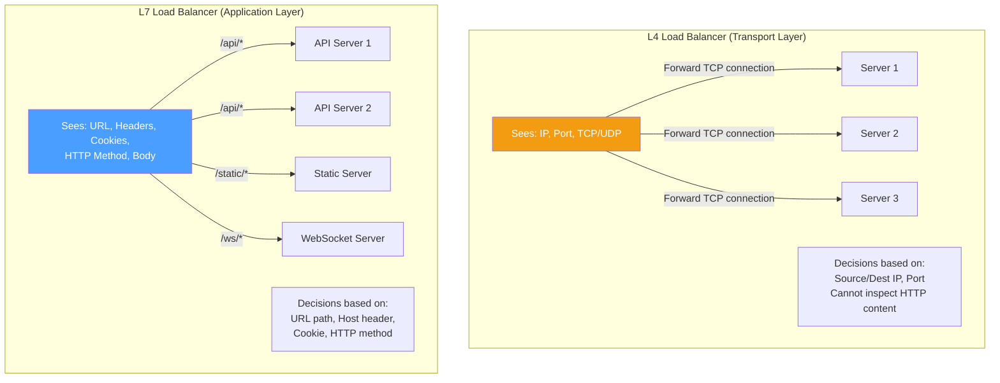
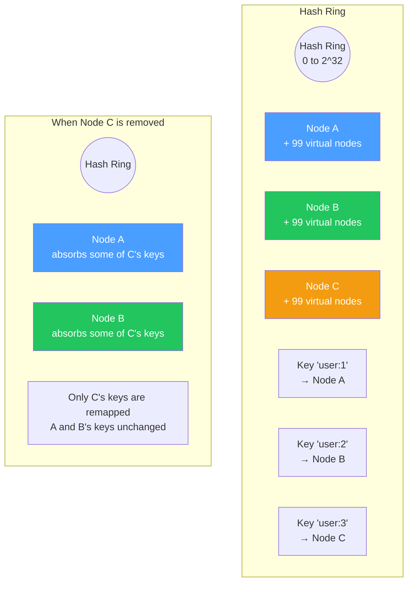
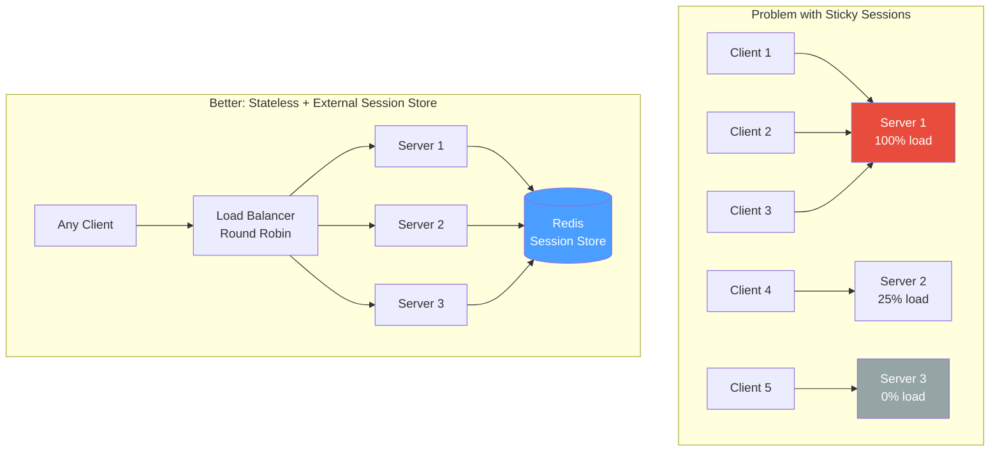
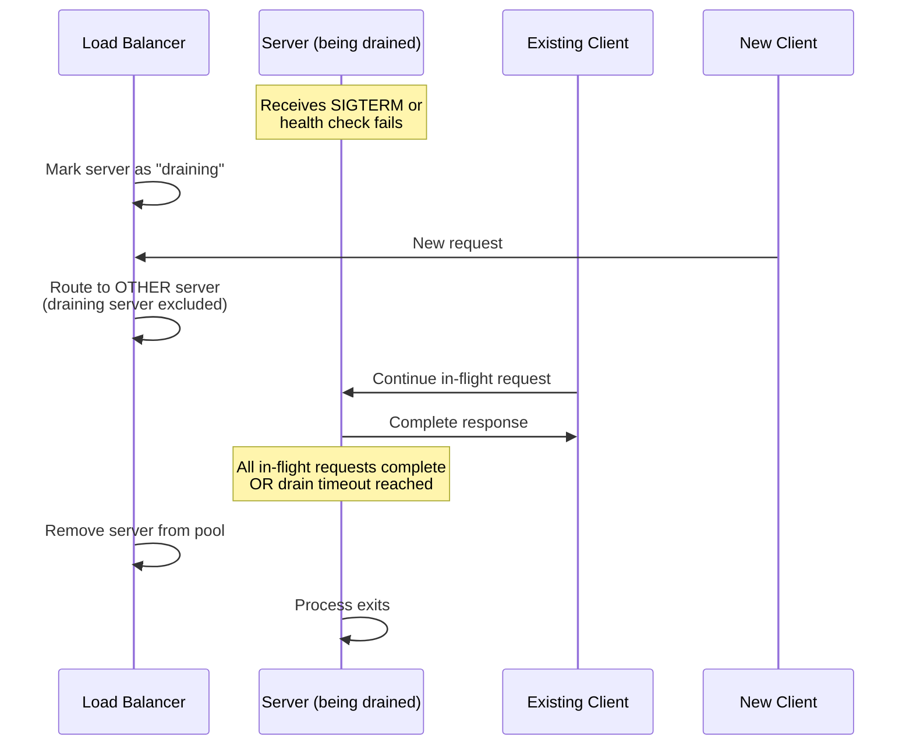

# Load Balancing Internals — Consistent Hashing, Health Checks, Connection Draining & Algorithms

## Table of Contents

- [L4 vs L7 Load Balancing](#l4-vs-l7-load-balancing)
- [Load Balancing Algorithms](#load-balancing-algorithms)
- [Consistent Hashing](#consistent-hashing)
- [Health Checks](#health-checks)
- [Sticky Sessions](#sticky-sessions)
- [Connection Draining and Graceful Shutdown](#connection-draining-and-graceful-shutdown)
- [SSL/TLS Termination](#ssltls-termination)
- [Comparison Tables](#comparison-tables)
- [Code Examples](#code-examples)
- [Interview Q&A](#interview-qa)

---

## L4 vs L7 Load Balancing

Load balancers operate at different OSI layers, making routing decisions based on different information.



### Detailed Comparison

| Aspect | L4 (Transport) | L7 (Application) |
|--------|----------------|-------------------|
| **OSI Layer** | Layer 4 (TCP/UDP) | Layer 7 (HTTP/HTTPS) |
| **Sees** | IP, port, TCP flags | Full HTTP request (URL, headers, cookies, body) |
| **Routing** | Based on IP/port tuples | Based on URL path, host, headers, cookies |
| **Performance** | Faster (less parsing) | Slower (must parse HTTP) |
| **TLS** | Pass-through (doesn't terminate) | Can terminate TLS |
| **Connection** | One TCP connection forwarded | Two connections (client→LB, LB→backend) |
| **Content modification** | No | Yes (header injection, URL rewriting, compression) |
| **WebSocket** | Works (TCP pass-through) | Can route specifically |
| **Examples** | AWS NLB, HAProxy (TCP mode) | AWS ALB, nginx, HAProxy (HTTP mode), Envoy |
| **Use case** | High throughput, non-HTTP, TCP services | HTTP routing, microservices, API gateway |

---

## Load Balancing Algorithms

```mermaid
graph TB
    subgraph "Static Algorithms"
        RR[Round Robin<br/>1→2→3→1→2→3]
        WRR[Weighted Round Robin<br/>1→1→1→2→3<br/>(weight 3:1:1)]
        HASH[IP Hash<br/>hash(client_ip) % N]
    end

    subgraph "Dynamic Algorithms"
        LC[Least Connections<br/>Route to server with<br/>fewest active connections]
        WLC[Weighted Least Connections<br/>connections / weight]
        LRT[Least Response Time<br/>Route to fastest server]
        RAND[Random with Two Choices<br/>Pick 2 random, choose<br/>the less loaded one]
    end

    style RR fill:#4a9eff,color:#fff
    style LC fill:#22c55e,color:#fff
    style RAND fill:#f39c12,color:#fff
```

### Algorithm Comparison

| Algorithm | Type | How It Works | Pros | Cons |
|-----------|------|-------------|------|------|
| **Round Robin** | Static | Rotate sequentially through servers | Simple, even distribution | Ignores server load/capacity |
| **Weighted Round Robin** | Static | Round robin with server weights | Handles heterogeneous servers | Weights must be manually configured |
| **IP Hash** | Static | `hash(client_ip) % servers` | Session affinity without cookies | Uneven distribution with few clients |
| **Least Connections** | Dynamic | Route to server with fewest active connections | Adapts to varying request durations | Slower (must track connections) |
| **Weighted Least Connections** | Dynamic | `active_connections / weight` — pick lowest | Handles heterogeneous servers + varying load | More complex |
| **Least Response Time** | Dynamic | Route to server with fastest recent response | Optimal latency | Requires response time tracking |
| **Random** | Static | Pick a random server | Simple, no state | Can be unlucky |
| **Power of Two Choices** | Dynamic | Pick 2 random servers, choose less loaded | Near-optimal with minimal state | Slightly more complex than random |

### Power of Two Choices (P2C)

This surprisingly effective algorithm: pick 2 random servers, route to the one with fewer connections. It's provably exponentially better than pure random.

```typescript
function powerOfTwoChoices(servers: Server[]): Server {
  const i = Math.floor(Math.random() * servers.length);
  let j = Math.floor(Math.random() * servers.length);
  while (j === i && servers.length > 1) {
    j = Math.floor(Math.random() * servers.length);
  }

  return servers[i].activeConnections <= servers[j].activeConnections
    ? servers[i]
    : servers[j];
}
```

---

## Consistent Hashing

Standard modular hashing (`hash(key) % N`) remaps almost all keys when N changes. Consistent hashing remaps only ~1/N of keys.



### Virtual Nodes

Without virtual nodes, physical nodes may be unevenly distributed on the ring. Virtual nodes solve this:

- Each physical node gets 100-200 virtual nodes scattered across the ring.
- This ensures even key distribution.
- When a node is removed, its load is distributed across many other nodes (not just its ring neighbor).

### Implementation

```typescript
import crypto from "crypto";

class ConsistentHashRing {
  private ring: Map<number, string> = new Map(); // hash -> nodeId
  private sortedHashes: number[] = [];
  private readonly virtualNodes: number;

  constructor(virtualNodes: number = 150) {
    this.virtualNodes = virtualNodes;
  }

  private hash(key: string): number {
    const h = crypto.createHash("md5").update(key).digest();
    return h.readUInt32BE(0);
  }

  addNode(nodeId: string): void {
    for (let i = 0; i < this.virtualNodes; i++) {
      const virtualKey = `${nodeId}:vn${i}`;
      const h = this.hash(virtualKey);
      this.ring.set(h, nodeId);
      this.sortedHashes.push(h);
    }
    this.sortedHashes.sort((a, b) => a - b);
  }

  removeNode(nodeId: string): void {
    for (let i = 0; i < this.virtualNodes; i++) {
      const virtualKey = `${nodeId}:vn${i}`;
      const h = this.hash(virtualKey);
      this.ring.delete(h);
    }
    this.sortedHashes = this.sortedHashes.filter((h) => this.ring.has(h));
  }

  getNode(key: string): string | null {
    if (this.sortedHashes.length === 0) return null;

    const h = this.hash(key);

    // Binary search for first hash >= h (clockwise on ring)
    let low = 0;
    let high = this.sortedHashes.length - 1;

    if (h > this.sortedHashes[high]) {
      // Wrap around to first node
      return this.ring.get(this.sortedHashes[0])!;
    }

    while (low < high) {
      const mid = (low + high) >>> 1;
      if (this.sortedHashes[mid] < h) {
        low = mid + 1;
      } else {
        high = mid;
      }
    }

    return this.ring.get(this.sortedHashes[low])!;
  }

  // Get N distinct nodes for replication
  getNodes(key: string, count: number): string[] {
    const nodes: string[] = [];
    const seen = new Set<string>();

    const h = this.hash(key);
    let idx = this.findStartIndex(h);

    while (nodes.length < count && seen.size < this.ring.size) {
      const nodeId = this.ring.get(this.sortedHashes[idx % this.sortedHashes.length])!;
      if (!seen.has(nodeId)) {
        seen.add(nodeId);
        nodes.push(nodeId);
      }
      idx++;
    }

    return nodes;
  }

  private findStartIndex(h: number): number {
    let low = 0;
    let high = this.sortedHashes.length - 1;

    if (h > this.sortedHashes[high]) return 0;

    while (low < high) {
      const mid = (low + high) >>> 1;
      if (this.sortedHashes[mid] < h) low = mid + 1;
      else high = mid;
    }
    return low;
  }
}

// Usage
const ring = new ConsistentHashRing(150);
ring.addNode("server-1");
ring.addNode("server-2");
ring.addNode("server-3");

console.log(ring.getNode("user:123")); // → "server-2"
console.log(ring.getNode("user:456")); // → "server-1"

// Adding a node only remaps ~1/3 of keys
ring.addNode("server-4");
console.log(ring.getNode("user:123")); // Likely same server (66% chance)
```

---

## Health Checks

Health checks determine if a backend server can accept traffic.

### Types of Health Checks

| Type | Mechanism | Checks | Latency |
|------|-----------|--------|---------|
| **TCP** | Attempt TCP connection | Port is open | ~1ms |
| **HTTP** | Send GET to health endpoint | App is responsive | ~5-50ms |
| **Deep / Dependency** | Check DB, cache, dependencies | Full readiness | ~50-500ms |
| **gRPC** | gRPC Health Checking Protocol | App-level health | ~5-50ms |

### Health Check Implementation

```typescript
import { createServer, IncomingMessage, ServerResponse } from "http";
import { Pool } from "pg";

interface HealthStatus {
  status: "healthy" | "degraded" | "unhealthy";
  checks: Record<string, { status: string; latencyMs: number; error?: string }>;
  uptime: number;
  version: string;
}

const pool = new Pool();
const startTime = Date.now();

async function checkDatabase(): Promise<{ ok: boolean; latencyMs: number; error?: string }> {
  const start = Date.now();
  try {
    await pool.query("SELECT 1");
    return { ok: true, latencyMs: Date.now() - start };
  } catch (err) {
    return { ok: false, latencyMs: Date.now() - start, error: (err as Error).message };
  }
}

async function checkRedis(): Promise<{ ok: boolean; latencyMs: number; error?: string }> {
  const start = Date.now();
  try {
    // await redis.ping();
    return { ok: true, latencyMs: Date.now() - start };
  } catch (err) {
    return { ok: false, latencyMs: Date.now() - start, error: (err as Error).message };
  }
}

async function getHealthStatus(): Promise<HealthStatus> {
  const [db, cache] = await Promise.all([checkDatabase(), checkRedis()]);

  const allHealthy = db.ok && cache.ok;
  const anyHealthy = db.ok || cache.ok;

  return {
    status: allHealthy ? "healthy" : anyHealthy ? "degraded" : "unhealthy",
    checks: {
      database: {
        status: db.ok ? "up" : "down",
        latencyMs: db.latencyMs,
        ...(db.error && { error: db.error }),
      },
      cache: {
        status: cache.ok ? "up" : "down",
        latencyMs: cache.latencyMs,
        ...(cache.error && { error: cache.error }),
      },
    },
    uptime: Math.floor((Date.now() - startTime) / 1000),
    version: process.env.APP_VERSION || "unknown",
  };
}

// Kubernetes probes
const server = createServer(async (req: IncomingMessage, res: ServerResponse) => {
  if (req.url === "/healthz/live") {
    // Liveness: is the process running? (simple check)
    res.writeHead(200);
    res.end("OK");
    return;
  }

  if (req.url === "/healthz/ready") {
    // Readiness: can the process handle traffic?
    const health = await getHealthStatus();
    const statusCode = health.status === "unhealthy" ? 503 : 200;
    res.writeHead(statusCode, { "Content-Type": "application/json" });
    res.end(JSON.stringify(health));
    return;
  }

  if (req.url === "/healthz/startup") {
    // Startup: has the process finished initializing?
    const health = await getHealthStatus();
    const statusCode = health.status === "unhealthy" ? 503 : 200;
    res.writeHead(statusCode);
    res.end(health.status);
    return;
  }

  res.writeHead(404);
  res.end("Not found");
});
```

### Health Check Configuration

| Parameter | Typical Value | Purpose |
|-----------|---------------|---------|
| `interval` | 10-30 seconds | How often to check |
| `timeout` | 5 seconds | Max time for a single check |
| `unhealthy_threshold` | 3 consecutive failures | Failures before marking unhealthy |
| `healthy_threshold` | 2 consecutive passes | Passes before marking healthy again |

---

## Sticky Sessions

Sticky sessions (session affinity) route all requests from the same client to the same backend server.

### Methods

| Method | How | Pros | Cons |
|--------|-----|------|------|
| **Cookie-based** | LB injects cookie with server ID | Precise, survives IP change | Requires L7 LB, cookie overhead |
| **IP-based** | Hash(client IP) | Works at L4, no cookie needed | NAT/proxy breaks it; uneven distribution |
| **URL parameter** | Session ID in URL | Universal (no cookies) | URL pollution, caching issues |
| **Header-based** | Custom header (X-Session-Id) | Clean, flexible | Requires client cooperation |

### Why to Avoid Sticky Sessions



---

## Connection Draining and Graceful Shutdown

Connection draining ensures in-flight requests complete before a server is removed from the pool.



### Implementation

```typescript
import { createServer, Server, IncomingMessage, ServerResponse } from "http";

class GracefulServer {
  private server: Server;
  private activeConnections = new Set<any>();
  private isShuttingDown = false;

  constructor(handler: (req: IncomingMessage, res: ServerResponse) => void) {
    this.server = createServer(handler);

    // Track connections
    this.server.on("connection", (socket) => {
      this.activeConnections.add(socket);
      socket.on("close", () => {
        this.activeConnections.delete(socket);
      });
    });
  }

  listen(port: number): Promise<void> {
    return new Promise((resolve) => {
      this.server.listen(port, () => {
        console.log(`Server listening on port ${port}`);
        resolve();
      });
    });
  }

  async shutdown(timeoutMs: number = 30_000): Promise<void> {
    if (this.isShuttingDown) return;
    this.isShuttingDown = true;

    console.log("Starting graceful shutdown...");

    // 1. Stop accepting new connections
    this.server.close(() => {
      console.log("No longer accepting new connections");
    });

    // 2. Set Connection: close header on existing keep-alive connections
    // (signals clients to not reuse the connection)
    for (const socket of this.activeConnections) {
      // If no active request, destroy immediately
      if (!(socket as any)._httpMessage) {
        socket.destroy();
        this.activeConnections.delete(socket);
      }
    }

    // 3. Wait for active connections to complete or timeout
    await Promise.race([
      this.waitForConnections(),
      this.timeout(timeoutMs),
    ]);

    // 4. Force-close remaining connections
    for (const socket of this.activeConnections) {
      socket.destroy();
    }

    console.log("Graceful shutdown complete");
  }

  private waitForConnections(): Promise<void> {
    return new Promise((resolve) => {
      const check = () => {
        if (this.activeConnections.size === 0) {
          resolve();
        } else {
          setTimeout(check, 100);
        }
      };
      check();
    });
  }

  private timeout(ms: number): Promise<void> {
    return new Promise((resolve) => {
      setTimeout(() => {
        console.warn(`Drain timeout (${ms}ms) — forcing shutdown with ${this.activeConnections.size} remaining connections`);
        resolve();
      }, ms);
    });
  }
}

// Usage
const app = new GracefulServer((req, res) => {
  // Set Connection header during shutdown
  if (app["isShuttingDown"]) {
    res.setHeader("Connection", "close");
  }
  res.writeHead(200);
  res.end("OK");
});

await app.listen(3000);

process.on("SIGTERM", async () => {
  await app.shutdown(30_000);
  process.exit(0);
});
```

### Kubernetes Graceful Shutdown Sequence

| Step | What Happens | Timing |
|------|-------------|--------|
| 1 | Pod receives SIGTERM | t=0 |
| 2 | `preStop` hook runs (if configured) | t=0 |
| 3 | Pod removed from Service endpoints | t=0 to t=few seconds |
| 4 | Application handles SIGTERM, stops accepting new connections | t=0 |
| 5 | In-flight requests complete | t=0 to t=terminationGracePeriodSeconds |
| 6 | SIGKILL if still running | t=terminationGracePeriodSeconds (default 30s) |

**Important**: Add a `preStop` hook with a short sleep (5s) to allow kube-proxy to update iptables rules before the app stops accepting connections:

```yaml
lifecycle:
  preStop:
    exec:
      command: ["sleep", "5"]
```

---

## SSL/TLS Termination

| Strategy | Where TLS Terminates | Pros | Cons |
|----------|---------------------|------|------|
| **At load balancer** | LB decrypts, sends HTTP to backends | Offloads crypto, simpler backends, centralized cert management | Traffic unencrypted between LB and backend |
| **At backend (passthrough)** | LB forwards encrypted traffic | End-to-end encryption | Each backend manages certs; LB can't inspect traffic |
| **Re-encryption** | LB decrypts, re-encrypts to backend | End-to-end encryption + L7 inspection | Double encryption overhead |

---

## Comparison Tables

### Load Balancer Products

| Product | Layer | Type | Key Feature |
|---------|-------|------|-------------|
| **nginx** | L7 (L4 with stream) | Software | Widely used, HTTP focus |
| **HAProxy** | L4 + L7 | Software | Very high performance, flexible |
| **Envoy** | L7 (L4 capable) | Software | Service mesh (Istio), observability |
| **AWS ALB** | L7 | Cloud managed | HTTP routing, target groups |
| **AWS NLB** | L4 | Cloud managed | Ultra-high throughput, static IPs |
| **Google Cloud LB** | L4 + L7 | Cloud managed | Global anycast |
| **Traefik** | L7 | Software | Auto-discovery (Docker, K8s) |

### Algorithm Selection Guide

| Scenario | Recommended Algorithm | Why |
|----------|----------------------|-----|
| Uniform servers, uniform requests | Round Robin | Simplest, perfectly balanced |
| Different server sizes | Weighted Round Robin | Accounts for capacity differences |
| Long-lived connections (WebSocket) | Least Connections | Prevents overload on slow-draining servers |
| Latency-sensitive API | Least Response Time | Routes to fastest server |
| Cache locality needed | Consistent Hashing | Same keys hit same servers |
| General purpose, minimal state | Power of Two Choices | Near-optimal with minimal overhead |

---

## Code Examples

### Application-Level Load Balancer

```typescript
interface Backend {
  id: string;
  url: string;
  weight: number;
  healthy: boolean;
  activeConnections: number;
  responseTimeMs: number; // Rolling average
}

class LoadBalancer {
  private backends: Backend[] = [];
  private rrIndex = 0;

  addBackend(backend: Backend): void {
    this.backends.push(backend);
  }

  private getHealthy(): Backend[] {
    return this.backends.filter((b) => b.healthy);
  }

  roundRobin(): Backend | null {
    const healthy = this.getHealthy();
    if (healthy.length === 0) return null;
    const backend = healthy[this.rrIndex % healthy.length];
    this.rrIndex++;
    return backend;
  }

  leastConnections(): Backend | null {
    const healthy = this.getHealthy();
    if (healthy.length === 0) return null;
    return healthy.reduce((min, b) =>
      b.activeConnections < min.activeConnections ? b : min
    );
  }

  weightedLeastConnections(): Backend | null {
    const healthy = this.getHealthy();
    if (healthy.length === 0) return null;
    return healthy.reduce((best, b) => {
      const score = b.activeConnections / b.weight;
      const bestScore = best.activeConnections / best.weight;
      return score < bestScore ? b : best;
    });
  }

  leastResponseTime(): Backend | null {
    const healthy = this.getHealthy();
    if (healthy.length === 0) return null;
    return healthy.reduce((min, b) =>
      b.responseTimeMs < min.responseTimeMs ? b : min
    );
  }

  powerOfTwoChoices(): Backend | null {
    const healthy = this.getHealthy();
    if (healthy.length === 0) return null;
    if (healthy.length === 1) return healthy[0];

    const i = Math.floor(Math.random() * healthy.length);
    let j = Math.floor(Math.random() * healthy.length);
    while (j === i) j = Math.floor(Math.random() * healthy.length);

    return healthy[i].activeConnections <= healthy[j].activeConnections
      ? healthy[i]
      : healthy[j];
  }
}
```

### Active Health Checker

```typescript
interface HealthCheckConfig {
  interval: number;       // ms between checks
  timeout: number;        // ms before check times out
  unhealthyThreshold: number;
  healthyThreshold: number;
  path: string;           // HTTP path to check
}

class ActiveHealthChecker {
  private config: HealthCheckConfig;
  private backends: Map<string, {
    backend: Backend;
    consecutiveFailures: number;
    consecutiveSuccesses: number;
  }> = new Map();
  private interval: NodeJS.Timeout | null = null;

  constructor(config: HealthCheckConfig) {
    this.config = config;
  }

  register(backend: Backend): void {
    this.backends.set(backend.id, {
      backend,
      consecutiveFailures: 0,
      consecutiveSuccesses: 0,
    });
  }

  start(): void {
    this.interval = setInterval(() => this.checkAll(), this.config.interval);
  }

  stop(): void {
    if (this.interval) clearInterval(this.interval);
  }

  private async checkAll(): Promise<void> {
    const checks = Array.from(this.backends.values()).map(async (entry) => {
      const healthy = await this.checkOne(entry.backend);

      if (healthy) {
        entry.consecutiveFailures = 0;
        entry.consecutiveSuccesses++;
        if (
          !entry.backend.healthy &&
          entry.consecutiveSuccesses >= this.config.healthyThreshold
        ) {
          entry.backend.healthy = true;
          console.log(`Backend ${entry.backend.id} is now HEALTHY`);
        }
      } else {
        entry.consecutiveSuccesses = 0;
        entry.consecutiveFailures++;
        if (
          entry.backend.healthy &&
          entry.consecutiveFailures >= this.config.unhealthyThreshold
        ) {
          entry.backend.healthy = false;
          console.warn(`Backend ${entry.backend.id} is now UNHEALTHY`);
        }
      }
    });

    await Promise.allSettled(checks);
  }

  private async checkOne(backend: Backend): Promise<boolean> {
    const controller = new AbortController();
    const timeoutId = setTimeout(() => controller.abort(), this.config.timeout);

    try {
      const response = await fetch(`${backend.url}${this.config.path}`, {
        signal: controller.signal,
      });
      clearTimeout(timeoutId);
      return response.status >= 200 && response.status < 400;
    } catch {
      clearTimeout(timeoutId);
      return false;
    }
  }
}

// Usage
const checker = new ActiveHealthChecker({
  interval: 10_000,
  timeout: 5_000,
  unhealthyThreshold: 3,
  healthyThreshold: 2,
  path: "/healthz/ready",
});
```

---

## Interview Q&A

> **Q1: Explain the difference between L4 and L7 load balancing. When would you use each?**
>
> L4 operates at the transport layer, making routing decisions based on IP addresses and TCP/UDP ports. It forwards raw TCP connections without inspecting content. L7 operates at the application layer, parsing HTTP requests to route based on URL paths, headers, cookies, and methods. Use L4 when: (1) You need maximum throughput with minimal latency (L4 doesn't parse HTTP). (2) You're load balancing non-HTTP traffic (databases, gRPC, custom TCP protocols). (3) You want TLS passthrough. Use L7 when: (1) You need content-based routing (/api to API servers, /static to CDN). (2) You want to terminate TLS at the load balancer. (3) You need features like header injection, URL rewriting, or rate limiting.

> **Q2: What is consistent hashing and why is it important for cache clusters?**
>
> Consistent hashing maps both keys and servers onto a ring (0 to 2^32). Each key is assigned to the next server clockwise on the ring. When a server is added or removed, only ~1/N of keys are remapped (vs modular hashing where nearly all keys remap). This is critical for cache clusters because remapping keys means cache misses, which cause a stampede to the database. Virtual nodes (100+ per physical node) ensure even distribution across the ring. Consistent hashing is used by: Redis Cluster (hash slots are a variant), Memcached client libraries, Cassandra (partition ring), and CDNs.

> **Q3: How does connection draining work and why is it important?**
>
> Connection draining is the process of allowing in-flight requests to complete before removing a server from the load balancer pool. Without it, active requests would be abruptly terminated (TCP RST), causing errors for clients. The process: (1) Mark server as "draining" — no new requests routed to it. (2) Existing connections continue until completion or timeout. (3) Once all connections close (or timeout), remove from pool. In Kubernetes, this involves: SIGTERM signal, preStop hook (5s sleep to let endpoints update), application stops accepting new connections, waits for in-flight requests, then exits. The `terminationGracePeriodSeconds` (default 30s) sets the hard deadline before SIGKILL.

> **Q4: What is the "Power of Two Choices" algorithm and why is it effective?**
>
> Power of Two Choices (P2C) picks two random servers and routes the request to the less loaded one. Despite its simplicity, it's provably exponentially better than pure random: with pure random, the most loaded server has O(log n / log log n) connections above average; with P2C, it's only O(log log n). The key insight is that comparing even two random choices avoids the worst-case piling that pure random causes, while requiring almost no state (just current connection counts). It's used by Envoy, nginx (with the `random two` directive), and many modern load balancers as a default algorithm.

> **Q5: How do you implement health checks properly? What are liveness vs readiness probes?**
>
> Liveness probes check if the process is alive (not deadlocked). If it fails, the container is restarted. It should be lightweight: return 200 if the event loop is responsive. Don't check dependencies here — a slow database shouldn't restart your app. Readiness probes check if the process can handle traffic. If it fails, the pod is removed from the Service endpoints (no traffic routed). This should check critical dependencies (database, cache). Use readiness to handle temporary issues without restarting. Startup probes check if the app has initialized. Prevents premature liveness/readiness checks for slow-starting apps. Best practice: separate `/healthz/live` (simple), `/healthz/ready` (dependency checks), and `/healthz/startup` (initialization complete).

> **Q6: Why should you prefer stateless backends over sticky sessions?**
>
> Sticky sessions create several problems: (1) **Uneven load distribution** — some servers get more "sticky" clients than others. (2) **Scaling issues** — when a server is removed, all its sticky clients lose their sessions. (3) **Deployment complexity** — rolling updates must carefully drain sticky sessions. (4) **Reduced fault tolerance** — if a server crashes, all its sessions are lost. Instead, store session state in an external store (Redis, database). Benefits: any server can handle any request, load balancers distribute evenly, servers can be added/removed freely, and failures only affect in-flight requests (not sessions). The exception: WebSocket connections inherently need affinity (they're long-lived TCP connections), and some legacy applications require server-side session state.
