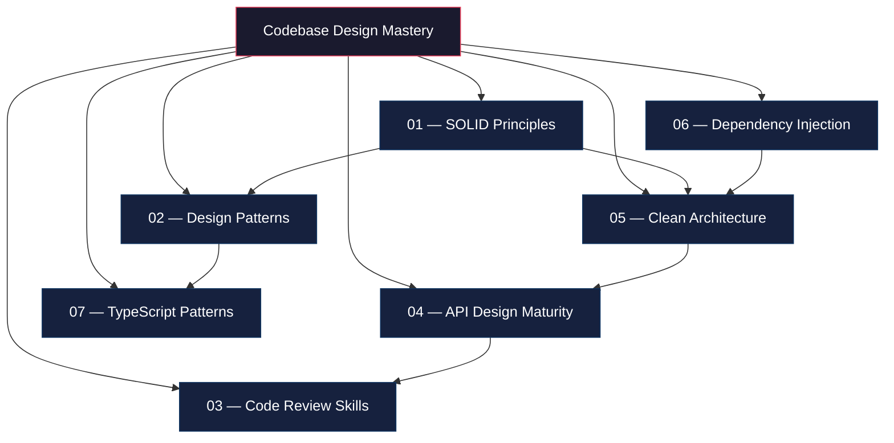

# Codebase Design — Study Guide

## Overview

This module covers the foundational engineering principles that separate junior developers from senior engineers. Every topic here is regularly tested in system design rounds, code review exercises, and architecture discussions at top tech companies.

## Topic Table

| # | Topic | Key Focus Areas | Difficulty | Est. Time |
|---|-------|----------------|------------|-----------|
| 01 | [SOLID Principles](./01-solid-principles/concepts.md) | SRP, OCP, LSP, ISP, DIP — violation detection & refactoring | Medium | 3-4 hrs |
| 02 | [Design Patterns](./02-design-patterns/concepts.md) | GoF Creational, Structural, Behavioral — when to use AND when NOT to use | Hard | 6-8 hrs |
| 03 | [Code Review Skills](./03-code-review-skills/concepts.md) | Review checklists, code smells, security review, feedback patterns | Medium | 2-3 hrs |
| 04 | [API Design Maturity](./04-api-design-maturity/concepts.md) | REST maturity, idempotency, pagination, error standards, versioning | Medium-Hard | 4-5 hrs |
| 05 | [Clean Architecture](./05-clean-architecture/concepts.md) | Hexagonal, Onion, DDD basics, dependency rule, folder structures | Hard | 5-6 hrs |
| 06 | [Dependency Injection](./06-dependency-injection/concepts.md) | Constructor injection, DI containers, testing with mocks, anti-patterns | Medium | 3-4 hrs |
| 07 | [TypeScript Patterns](./07-typescript-patterns/concepts.md) | Branded types, Result/Either, Zod, type-safe builders, conditional types | Hard | 5-6 hrs |

## Recommended Study Order

```mermaid
graph LR
    subgraph "Week 1 — Foundations"
        S1[01 SOLID Principles] --> S2[06 Dependency Injection]
    end

    subgraph "Week 2 — Patterns & Architecture"
        S3[02 Design Patterns] --> S4[05 Clean Architecture]
    end

    subgraph "Week 3 — Applied Skills"
        S5[07 TypeScript Patterns] --> S6[04 API Design]
        S6 --> S7[03 Code Review]
    end

    S2 --> S3
    S4 --> S5

    style S1 fill:#e94560,stroke:#333,color:#fff
    style S2 fill:#e94560,stroke:#333,color:#fff
    style S3 fill:#0f3460,stroke:#333,color:#fff
    style S4 fill:#0f3460,stroke:#333,color:#fff
    style S5 fill:#533483,stroke:#333,color:#fff
    style S6 fill:#533483,stroke:#333,color:#fff
    style S7 fill:#533483,stroke:#333,color:#fff
```

**Rationale:**
1. SOLID first — everything else builds on these principles
2. DI next — it is the practical application of DIP (the "D" in SOLID)
3. Design Patterns — requires SOLID understanding to know when patterns apply
4. Clean Architecture — combines SOLID + DI + patterns into a cohesive structure
5. TypeScript Patterns — advanced type-level programming for safety
6. API Design — applies architectural thinking to external interfaces
7. Code Review — capstone: you need all prior knowledge to review effectively

## Progress Tracker

| # | Topic | Read | Notes | Practice | Mock Interview | Done |
|---|-------|------|-------|----------|----------------|------|
| 01 | SOLID Principles | [ ] | [ ] | [ ] | [ ] | [ ] |
| 02 | Design Patterns | [ ] | [ ] | [ ] | [ ] | [ ] |
| 03 | Code Review Skills | [ ] | [ ] | [ ] | [ ] | [ ] |
| 04 | API Design Maturity | [ ] | [ ] | [ ] | [ ] | [ ] |
| 05 | Clean Architecture | [ ] | [ ] | [ ] | [ ] | [ ] |
| 06 | Dependency Injection | [ ] | [ ] | [ ] | [ ] | [ ] |
| 07 | TypeScript Patterns | [ ] | [ ] | [ ] | [ ] | [ ] |

## How to Use This Guide

1. **Read** each concepts.md file thoroughly
2. **Code along** with every TypeScript example — do not just read them
3. **Answer** the Interview Q&A sections out loud before revealing the answer
4. **Practice** refactoring bad code into good code using the principles
5. **Mock interview** — explain each topic as if you are in a 45-minute interview round
