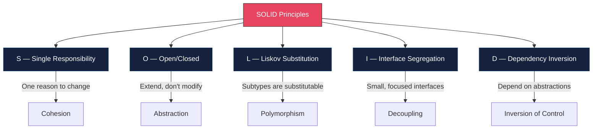
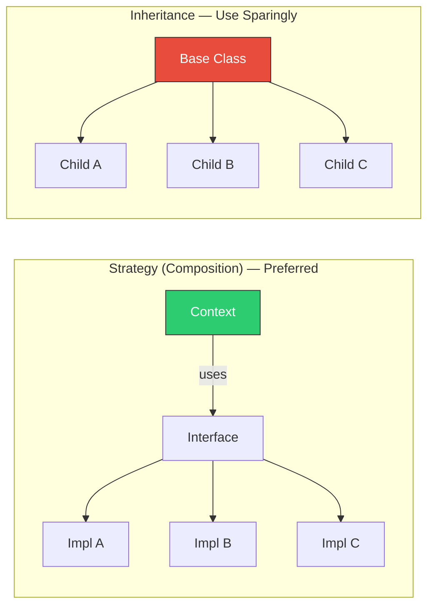
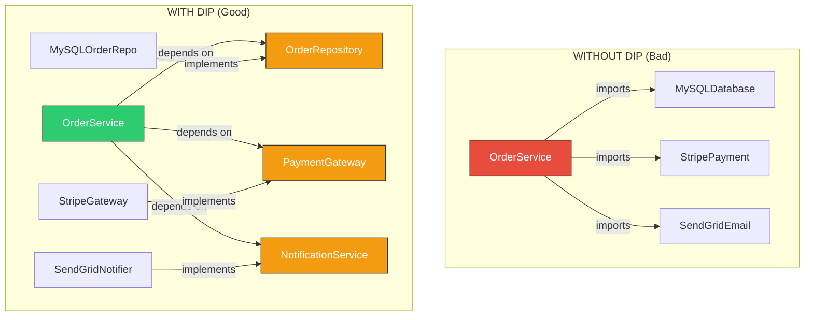

# SOLID Principles

## Overview

SOLID is a mnemonic for five object-oriented design principles that make software more understandable, flexible, and maintainable. Robert C. Martin introduced these principles, and they remain the most frequently tested design concepts in senior engineering interviews.



---

## 1. Single Responsibility Principle (SRP)

> A class should have one, and only one, reason to change.

### The Core Idea

SRP does not mean "a class should do one thing." It means a class should have **one actor** — one stakeholder or source of change — that would cause it to be modified.

### Violation Example

```typescript
// BAD: This class has THREE reasons to change:
// 1. Report format changes (presentation)
// 2. Salary calculation rules change (business logic)
// 3. Database schema changes (persistence)

class Employee {
  constructor(
    private name: string,
    private salary: number,
    private department: string
  ) {}

  // Business logic — owned by HR
  calculateAnnualBonus(): number {
    if (this.department === "engineering") {
      return this.salary * 0.15;
    }
    return this.salary * 0.1;
  }

  // Presentation — owned by reporting team
  generatePerformanceReport(): string {
    return `
      <html>
        <body>
          <h1>Performance Report for ${this.name}</h1>
          <p>Department: ${this.department}</p>
          <p>Salary: $${this.salary}</p>
          <p>Bonus: $${this.calculateAnnualBonus()}</p>
        </body>
      </html>
    `;
  }

  // Persistence — owned by DBA team
  saveToDatabase(): void {
    const query = `INSERT INTO employees (name, salary, department)
                   VALUES ('${this.name}', ${this.salary}, '${this.department}')`;
    // execute query...
  }
}
```

### Fixed Example

```typescript
// GOOD: Each class has a single reason to change

// Pure data + identity
class Employee {
  constructor(
    public readonly name: string,
    public readonly salary: number,
    public readonly department: string
  ) {}
}

// Business logic — changes when bonus rules change
class BonusCalculator {
  calculate(employee: Employee): number {
    const rates: Record<string, number> = {
      engineering: 0.15,
      sales: 0.12,
      default: 0.1,
    };
    const rate = rates[employee.department] ?? rates.default;
    return employee.salary * rate;
  }
}

// Presentation — changes when report format changes
class PerformanceReportGenerator {
  constructor(private bonusCalculator: BonusCalculator) {}

  generate(employee: Employee): string {
    const bonus = this.bonusCalculator.calculate(employee);
    return `
      <html>
        <body>
          <h1>Performance Report for ${employee.name}</h1>
          <p>Department: ${employee.department}</p>
          <p>Salary: $${employee.salary}</p>
          <p>Bonus: $${bonus}</p>
        </body>
      </html>
    `;
  }
}

// Persistence — changes when storage mechanism changes
class EmployeeRepository {
  async save(employee: Employee): Promise<void> {
    await this.db.query(
      "INSERT INTO employees (name, salary, department) VALUES ($1, $2, $3)",
      [employee.name, employee.salary, employee.department]
    );
  }

  async findByName(name: string): Promise<Employee | null> {
    const row = await this.db.query(
      "SELECT * FROM employees WHERE name = $1",
      [name]
    );
    return row ? new Employee(row.name, row.salary, row.department) : null;
  }
}
```

### Real-World Scenarios

| Violation | Why It's a Problem | Fix |
|-----------|-------------------|-----|
| Express route handler that validates, processes, and responds | Three actors (security team, business, frontend) | Extract validator, service, and response formatter |
| React component with fetch + state + rendering | Data layer changes break UI | Custom hook for data, component for rendering |
| Logger class that formats, filters, and writes | Output format and destination are independent concerns | Formatter, Filter, and Writer classes |

---

## 2. Open/Closed Principle (OCP)

> Software entities should be open for extension, but closed for modification.

### The Core Idea

You should be able to add new behavior to a module without changing its existing source code. This is typically achieved through **abstraction** and **polymorphism**.

### Violation Example

```typescript
// BAD: Adding a new payment method requires modifying this function
type PaymentMethod = "credit_card" | "paypal" | "crypto";

interface PaymentRequest {
  method: PaymentMethod;
  amount: number;
  currency: string;
}

function processPayment(request: PaymentRequest): boolean {
  if (request.method === "credit_card") {
    // Credit card processing logic
    console.log(`Charging $${request.amount} to credit card`);
    // Stripe API call...
    return true;
  } else if (request.method === "paypal") {
    // PayPal processing logic
    console.log(`Charging $${request.amount} via PayPal`);
    // PayPal API call...
    return true;
  } else if (request.method === "crypto") {
    // Crypto processing logic
    console.log(`Charging $${request.amount} in crypto`);
    // Blockchain transaction...
    return true;
  }
  // Every new payment method = modify this function
  return false;
}
```

### Fixed Example

```typescript
// GOOD: New payment methods are added by creating new classes, not modifying existing code

interface PaymentProcessor {
  readonly name: string;
  supports(method: string): boolean;
  process(amount: number, currency: string): Promise<PaymentResult>;
}

interface PaymentResult {
  success: boolean;
  transactionId: string;
  error?: string;
}

class CreditCardProcessor implements PaymentProcessor {
  readonly name = "credit_card";

  supports(method: string): boolean {
    return method === "credit_card";
  }

  async process(amount: number, currency: string): Promise<PaymentResult> {
    // Stripe API call
    const charge = await stripe.charges.create({ amount, currency });
    return { success: true, transactionId: charge.id };
  }
}

class PayPalProcessor implements PaymentProcessor {
  readonly name = "paypal";

  supports(method: string): boolean {
    return method === "paypal";
  }

  async process(amount: number, currency: string): Promise<PaymentResult> {
    const order = await paypal.orders.create({ amount, currency });
    return { success: true, transactionId: order.id };
  }
}

// Adding crypto support = new class, ZERO changes to existing code
class CryptoProcessor implements PaymentProcessor {
  readonly name = "crypto";

  supports(method: string): boolean {
    return method === "crypto";
  }

  async process(amount: number, currency: string): Promise<PaymentResult> {
    const tx = await blockchain.send({ amount, currency });
    return { success: true, transactionId: tx.hash };
  }
}

// Payment service is CLOSED for modification, OPEN for extension
class PaymentService {
  private processors: PaymentProcessor[] = [];

  register(processor: PaymentProcessor): void {
    this.processors.push(processor);
  }

  async processPayment(method: string, amount: number, currency: string): Promise<PaymentResult> {
    const processor = this.processors.find((p) => p.supports(method));
    if (!processor) {
      return { success: false, transactionId: "", error: `No processor for method: ${method}` };
    }
    return processor.process(amount, currency);
  }
}

// Usage
const service = new PaymentService();
service.register(new CreditCardProcessor());
service.register(new PayPalProcessor());
service.register(new CryptoProcessor());
```

### OCP via Strategy vs Inheritance



---

## 3. Liskov Substitution Principle (LSP)

> Objects of a superclass should be replaceable with objects of a subclass without breaking the program.

### The Core Idea

If `S` is a subtype of `T`, then objects of type `T` may be replaced with objects of type `S` without altering any of the desirable properties of the program (correctness, task performed, etc.).

### The Classic Violation: Rectangle/Square

```typescript
// BAD: Square violates LSP when substituted for Rectangle

class Rectangle {
  constructor(protected _width: number, protected _height: number) {}

  get width(): number { return this._width; }
  set width(value: number) { this._width = value; }

  get height(): number { return this._height; }
  set height(value: number) { this._height = value; }

  area(): number {
    return this._width * this._height;
  }
}

class Square extends Rectangle {
  set width(value: number) {
    // Breaks the expectation: setting width also changes height
    this._width = value;
    this._height = value;
  }

  set height(value: number) {
    this._width = value;
    this._height = value;
  }
}

// This function works correctly with Rectangle but BREAKS with Square
function doubleWidth(rect: Rectangle): void {
  const originalHeight = rect.height;
  rect.width = rect.width * 2;

  // This assertion FAILS when rect is a Square
  console.assert(
    rect.height === originalHeight,
    `Expected height ${originalHeight}, got ${rect.height}`
  );
}

const square = new Square(5, 5);
doubleWidth(square); // ASSERTION FAILURE: height changed to 10
```

### Fixed Example

```typescript
// GOOD: Use interfaces to define capabilities, not inheritance hierarchies

interface Shape {
  area(): number;
  perimeter(): number;
}

interface Resizable {
  resize(width: number, height: number): Shape;
}

class Rectangle implements Shape, Resizable {
  constructor(
    public readonly width: number,
    public readonly height: number
  ) {}

  area(): number {
    return this.width * this.height;
  }

  perimeter(): number {
    return 2 * (this.width + this.height);
  }

  resize(width: number, height: number): Rectangle {
    return new Rectangle(width, height);
  }
}

class Square implements Shape {
  constructor(public readonly side: number) {}

  area(): number {
    return this.side * this.side;
  }

  perimeter(): number {
    return 4 * this.side;
  }

  resize(side: number): Square {
    return new Square(side);
  }
}

// Functions that accept Shape work correctly with both
function printShapeInfo(shape: Shape): void {
  console.log(`Area: ${shape.area()}, Perimeter: ${shape.perimeter()}`);
}

printShapeInfo(new Rectangle(5, 10)); // Works
printShapeInfo(new Square(5));         // Works — no broken invariants
```

### LSP Violation Checklist

| Signal | Example | Problem |
|--------|---------|---------|
| Subclass throws unexpected exceptions | `ReadOnlyList.add()` throws `UnsupportedOperationError` | Callers expecting `List` behavior break |
| Subclass ignores parent method | `FakeEmailService.send()` is a no-op | Callers expecting email was sent get silent failure |
| Subclass strengthens preconditions | Parent accepts `number`, child requires `positive number` | Callers passing zero or negatives break |
| Subclass weakens postconditions | Parent guarantees sorted output, child returns unsorted | Callers depending on sorting break |
| Type checks in consumer code | `if (shape instanceof Square)` | Polymorphism is broken |

---

## 4. Interface Segregation Principle (ISP)

> Clients should not be forced to depend on interfaces they do not use.

### The Core Idea

Large, "fat" interfaces force implementers to provide methods they do not need. Split them into smaller, role-specific interfaces.

### Violation Example

```typescript
// BAD: Fat interface forces every worker type to implement everything

interface Worker {
  work(): void;
  eat(): void;
  sleep(): void;
  attendMeeting(): void;
  writeReport(): void;
}

class Developer implements Worker {
  work(): void { console.log("Writing code"); }
  eat(): void { console.log("Eating lunch"); }
  sleep(): void { console.log("Sleeping"); }
  attendMeeting(): void { console.log("In standup"); }
  writeReport(): void { console.log("Writing sprint report"); }
}

class Robot implements Worker {
  work(): void { console.log("Assembling parts"); }

  // Robots don't eat, sleep, attend meetings, or write reports
  // but are FORCED to implement these
  eat(): void { throw new Error("Robots don't eat"); }
  sleep(): void { throw new Error("Robots don't sleep"); }
  attendMeeting(): void { throw new Error("Robots don't attend meetings"); }
  writeReport(): void { throw new Error("Robots don't write reports"); }
}
```

### Fixed Example

```typescript
// GOOD: Small, focused interfaces — compose only what you need

interface Workable {
  work(): void;
}

interface Feedable {
  eat(): void;
}

interface Sleepable {
  sleep(): void;
}

interface Meetable {
  attendMeeting(): void;
}

interface Reportable {
  writeReport(): void;
}

// Humans compose the interfaces they need
class Developer implements Workable, Feedable, Sleepable, Meetable, Reportable {
  work(): void { console.log("Writing code"); }
  eat(): void { console.log("Eating lunch"); }
  sleep(): void { console.log("Sleeping"); }
  attendMeeting(): void { console.log("In standup"); }
  writeReport(): void { console.log("Writing sprint report"); }
}

class Intern implements Workable, Feedable, Sleepable {
  work(): void { console.log("Learning and assisting"); }
  eat(): void { console.log("Eating lunch"); }
  sleep(): void { console.log("Sleeping"); }
  // No meetings, no reports — and that's fine
}

// Robots only implement what they can do
class Robot implements Workable {
  work(): void { console.log("Assembling parts 24/7"); }
}

// Functions depend only on the interfaces they need
function assignTask(worker: Workable): void {
  worker.work();
}

function scheduleLunch(entity: Feedable): void {
  entity.eat();
}

assignTask(new Robot());       // Works
assignTask(new Developer());   // Works
// scheduleLunch(new Robot()); // Compile error — Robot is not Feedable
```

### Real-World ISP Application

```typescript
// Common in Node.js: Repository interfaces

// BAD: One big repository interface
interface UserRepository {
  findById(id: string): Promise<User>;
  findByEmail(email: string): Promise<User>;
  findAll(): Promise<User[]>;
  create(user: User): Promise<User>;
  update(user: User): Promise<User>;
  delete(id: string): Promise<void>;
  archive(id: string): Promise<void>;
  generateReport(): Promise<Report>;
}

// GOOD: Split by capability
interface UserReader {
  findById(id: string): Promise<User | null>;
  findByEmail(email: string): Promise<User | null>;
}

interface UserLister {
  findAll(filter?: UserFilter): Promise<User[]>;
}

interface UserWriter {
  create(data: CreateUserData): Promise<User>;
  update(id: string, data: UpdateUserData): Promise<User>;
}

interface UserDeleter {
  delete(id: string): Promise<void>;
  archive(id: string): Promise<void>;
}

// An auth service only needs to read users
class AuthService {
  constructor(private users: UserReader) {}

  async authenticate(email: string, password: string): Promise<boolean> {
    const user = await this.users.findByEmail(email);
    if (!user) return false;
    return verifyPassword(password, user.passwordHash);
  }
}

// The full repository implements all interfaces
class PostgresUserRepository implements UserReader, UserLister, UserWriter, UserDeleter {
  // ... all methods implemented
}
```

---

## 5. Dependency Inversion Principle (DIP)

> High-level modules should not depend on low-level modules. Both should depend on abstractions.

### The Core Idea

The direction of dependency should be **inverted** from the natural flow of control. Instead of high-level business logic importing and directly using low-level infrastructure, both depend on an interface defined in the domain layer.



### Violation Example

```typescript
// BAD: High-level OrderService directly depends on low-level modules

import { Pool } from "pg";               // Low-level database driver
import Stripe from "stripe";              // Low-level payment SDK
import sgMail from "@sendgrid/mail";      // Low-level email SDK

class OrderService {
  private db = new Pool({ connectionString: "postgres://..." });
  private stripe = new Stripe("sk_test_...");

  async placeOrder(userId: string, items: CartItem[]): Promise<Order> {
    // Direct database call
    const result = await this.db.query(
      "INSERT INTO orders (user_id, total) VALUES ($1, $2) RETURNING *",
      [userId, this.calculateTotal(items)]
    );
    const order = result.rows[0];

    // Direct Stripe call
    await this.stripe.charges.create({
      amount: order.total,
      currency: "usd",
      source: "tok_visa",
    });

    // Direct SendGrid call
    await sgMail.send({
      to: order.email,
      subject: "Order Confirmation",
      text: `Your order #${order.id} has been placed.`,
    });

    return order;
  }

  private calculateTotal(items: CartItem[]): number {
    return items.reduce((sum, item) => sum + item.price * item.quantity, 0);
  }
}
```

### Fixed Example

```typescript
// GOOD: High-level module depends on abstractions; low-level modules implement them

// --- Abstractions (defined in the domain layer) ---

interface OrderRepository {
  create(userId: string, total: number): Promise<Order>;
  findById(id: string): Promise<Order | null>;
}

interface PaymentGateway {
  charge(amount: number, currency: string, customerId: string): Promise<PaymentResult>;
}

interface NotificationService {
  sendOrderConfirmation(order: Order, email: string): Promise<void>;
}

// --- High-level module depends ONLY on abstractions ---

class OrderService {
  constructor(
    private orderRepo: OrderRepository,
    private paymentGateway: PaymentGateway,
    private notifications: NotificationService
  ) {}

  async placeOrder(userId: string, items: CartItem[]): Promise<Order> {
    const total = items.reduce((sum, item) => sum + item.price * item.quantity, 0);
    const order = await this.orderRepo.create(userId, total);

    await this.paymentGateway.charge(total, "usd", userId);
    await this.notifications.sendOrderConfirmation(order, order.email);

    return order;
  }
}

// --- Low-level modules implement abstractions ---

class PostgresOrderRepository implements OrderRepository {
  constructor(private pool: Pool) {}

  async create(userId: string, total: number): Promise<Order> {
    const result = await this.pool.query(
      "INSERT INTO orders (user_id, total) VALUES ($1, $2) RETURNING *",
      [userId, total]
    );
    return result.rows[0];
  }

  async findById(id: string): Promise<Order | null> {
    const result = await this.pool.query("SELECT * FROM orders WHERE id = $1", [id]);
    return result.rows[0] ?? null;
  }
}

class StripePaymentGateway implements PaymentGateway {
  constructor(private stripe: Stripe) {}

  async charge(amount: number, currency: string, customerId: string): Promise<PaymentResult> {
    const charge = await this.stripe.charges.create({ amount, currency, customer: customerId });
    return { transactionId: charge.id, success: true };
  }
}

class SendGridNotificationService implements NotificationService {
  async sendOrderConfirmation(order: Order, email: string): Promise<void> {
    await sgMail.send({
      to: email,
      subject: `Order #${order.id} Confirmed`,
      text: `Thank you for your order of $${order.total}.`,
    });
  }
}

// --- Composition root (wiring) ---
const orderService = new OrderService(
  new PostgresOrderRepository(new Pool({ connectionString: process.env.DATABASE_URL })),
  new StripePaymentGateway(new Stripe(process.env.STRIPE_KEY!)),
  new SendGridNotificationService()
);
```

### DIP Benefits for Testing

```typescript
// With DIP, testing is trivial — use in-memory fakes

class InMemoryOrderRepository implements OrderRepository {
  private orders: Order[] = [];
  private nextId = 1;

  async create(userId: string, total: number): Promise<Order> {
    const order: Order = { id: String(this.nextId++), userId, total, email: "test@test.com" };
    this.orders.push(order);
    return order;
  }

  async findById(id: string): Promise<Order | null> {
    return this.orders.find((o) => o.id === id) ?? null;
  }
}

class FakePaymentGateway implements PaymentGateway {
  public charges: Array<{ amount: number; currency: string }> = [];

  async charge(amount: number, currency: string): Promise<PaymentResult> {
    this.charges.push({ amount, currency });
    return { transactionId: "fake-tx-id", success: true };
  }
}

class FakeNotificationService implements NotificationService {
  public sent: Order[] = [];

  async sendOrderConfirmation(order: Order): Promise<void> {
    this.sent.push(order);
  }
}

// Test
describe("OrderService", () => {
  it("should create order, charge payment, and send notification", async () => {
    const repo = new InMemoryOrderRepository();
    const payments = new FakePaymentGateway();
    const notifications = new FakeNotificationService();
    const service = new OrderService(repo, payments, notifications);

    const items = [{ price: 100, quantity: 2 }];
    const order = await service.placeOrder("user-1", items);

    expect(order.total).toBe(200);
    expect(payments.charges).toHaveLength(1);
    expect(payments.charges[0].amount).toBe(200);
    expect(notifications.sent).toHaveLength(1);
  });
});
```

---

## SOLID Principles Comparison Table

| Principle | One-Liner | Violation Signal | Refactoring Tool |
|-----------|-----------|-----------------|------------------|
| **SRP** | One reason to change | Class has methods serving different stakeholders | Extract class |
| **OCP** | Extend, don't modify | `if/else` or `switch` on type | Strategy pattern, polymorphism |
| **LSP** | Subtypes are substitutable | `instanceof` checks, unexpected exceptions | Composition over inheritance, smaller interfaces |
| **ISP** | No fat interfaces | Implementers throw `NotImplementedError` | Split interface, role interfaces |
| **DIP** | Depend on abstractions | Direct imports of infrastructure in business logic | Constructor injection, interfaces |

---

## Common Violations in Real Codebases

| Scenario | Principles Violated | Fix |
|----------|-------------------|-----|
| Express controller with DB queries, validation, and response formatting | SRP, DIP | Service layer + repository + validation middleware |
| `switch(type)` in a renderer to handle each shape | OCP | Shape interface with `render()` method |
| `AdminUser extends User` but `AdminUser.logout()` throws | LSP | Separate interface for admin capabilities |
| React component prop interface with 20+ optional props | ISP | Split into composed components with focused props |
| Service class that `new`s its dependencies internally | DIP | Constructor injection |

---

## Interview Q&A

> **Q: Explain SRP. Does it mean a class should only have one method?**
>
> A: No. SRP says a class should have only one reason to change, meaning it should serve a single actor or stakeholder. A class can have many methods as long as they all serve the same concern. For example, a `UserRepository` can have `findById`, `findByEmail`, `create`, and `delete` because they all serve the same persistence concern. But if it also has `generateReport`, that serves a different stakeholder (reporting), violating SRP.

> **Q: How does OCP work without modifying existing code? Isn't that impractical?**
>
> A: OCP is achieved through abstraction. You define an interface or abstract class, and new behavior is added by creating new implementations rather than adding `if` branches. For example, a payment system defines a `PaymentProcessor` interface. Adding Apple Pay means creating `ApplePayProcessor`, not modifying the existing payment routing code. In practice, you allow modification for bug fixes but prevent modification for adding new features.

> **Q: Give me a real example of LSP violation that isn't the Rectangle/Square problem.**
>
> A: A common real-world violation is the `ReadOnlyCollection` problem. If you have a `List<T>` interface with an `add()` method, and you create `ImmutableList<T>` that extends it but throws an error on `add()`, that violates LSP. Code expecting a `List<T>` assumes `add()` works. The fix is to have separate `ReadableList<T>` and `WritableList<T>` interfaces, and `ImmutableList` only implements `ReadableList<T>`.

> **Q: ISP seems like it would lead to an explosion of tiny interfaces. How do you balance it?**
>
> A: The key is to segregate based on client needs, not arbitrarily. Look at who consumes the interface. If one consumer only reads data and another only writes, split into `Reader` and `Writer`. You often end up with 2-4 role interfaces, not dozens. TypeScript's structural typing makes this easier because a class automatically satisfies an interface if it has the right shape — you don't need explicit `implements` declarations for every combination.

> **Q: What's the relationship between DIP and Dependency Injection?**
>
> A: DIP is the principle (depend on abstractions, not concretions). Dependency Injection is one technique to achieve DIP by passing dependencies into a class through its constructor, setter, or method parameters, rather than having the class instantiate them directly. You can follow DIP without a DI container, and you can use DI (passing concrete classes) without fully following DIP if you don't use interfaces. The principle guides the design; the injection is the mechanism.

> **Q: If you could only apply one SOLID principle in a legacy codebase, which would it be?**
>
> A: DIP, because it has the highest ROI for testability and changeability. Once your business logic depends on abstractions rather than concrete infrastructure, you can swap implementations (databases, APIs, services) without rewriting business rules. It also unlocks unit testing with fakes/mocks immediately. SRP is a close second, but DIP gives you the most immediate practical benefit in a legacy codebase where testing is typically the biggest pain point.
