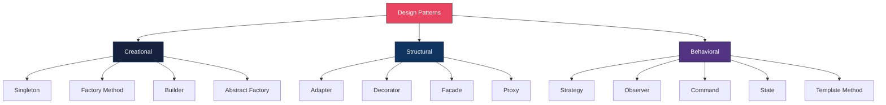
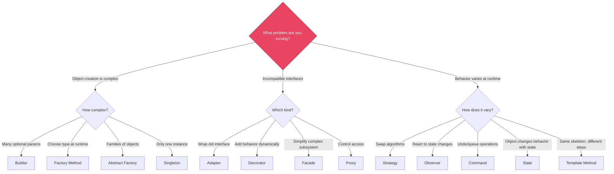

# Design Patterns (Gang of Four)

## Overview

Design patterns are reusable solutions to recurring problems in software design. The Gang of Four (GoF) catalog from 1994 defines 23 patterns in three categories. This guide covers the most interview-relevant patterns with TypeScript examples, focusing equally on **when to use** and **when NOT to use** each pattern.



---

## Pattern Selection Decision Tree



---

## Creational Patterns

### Singleton

**Intent:** Ensure a class has only one instance and provide global access to it.

```typescript
// Modern TypeScript Singleton using a module-scoped instance
class DatabasePool {
  private static instance: DatabasePool | null = null;

  private connections: Connection[] = [];
  private readonly maxConnections = 10;

  // Private constructor prevents direct instantiation
  private constructor(private readonly connectionString: string) {
    this.initializePool();
  }

  static getInstance(connectionString?: string): DatabasePool {
    if (!DatabasePool.instance) {
      if (!connectionString) {
        throw new Error("Connection string required for first initialization");
      }
      DatabasePool.instance = new DatabasePool(connectionString);
    }
    return DatabasePool.instance;
  }

  // For testing: allow reset
  static resetInstance(): void {
    DatabasePool.instance = null;
  }

  async getConnection(): Promise<Connection> {
    const available = this.connections.find((c) => !c.inUse);
    if (available) {
      available.inUse = true;
      return available;
    }
    if (this.connections.length < this.maxConnections) {
      const conn = await this.createConnection();
      this.connections.push(conn);
      return conn;
    }
    throw new Error("Pool exhausted");
  }

  private initializePool(): void { /* ... */ }
  private async createConnection(): Promise<Connection> { /* ... */ }
}

// Simpler alternative: just export a module-scoped instance
// This is often preferred in TypeScript/Node.js
let pool: DatabasePool | null = null;

export function getPool(): DatabasePool {
  if (!pool) {
    pool = DatabasePool.getInstance(process.env.DATABASE_URL);
  }
  return pool;
}
```

| When to Use | When NOT to Use |
|-------------|-----------------|
| Connection pools, thread pools | "I want global state" (use module scope instead) |
| Configuration managers | Most classes — Singleton is overused |
| Logger instances | When you need different instances for testing |
| Hardware interface controllers | When state should be request-scoped (web servers) |

---

### Factory Method

**Intent:** Define an interface for creating objects, but let subclasses decide which class to instantiate.

```typescript
// The product interface
interface Notification {
  send(to: string, message: string): Promise<boolean>;
  getChannel(): string;
}

// Concrete products
class EmailNotification implements Notification {
  async send(to: string, message: string): Promise<boolean> {
    console.log(`Email to ${to}: ${message}`);
    // SMTP logic...
    return true;
  }
  getChannel(): string { return "email"; }
}

class SMSNotification implements Notification {
  async send(to: string, message: string): Promise<boolean> {
    console.log(`SMS to ${to}: ${message}`);
    // Twilio logic...
    return true;
  }
  getChannel(): string { return "sms"; }
}

class PushNotification implements Notification {
  async send(to: string, message: string): Promise<boolean> {
    console.log(`Push to ${to}: ${message}`);
    // Firebase logic...
    return true;
  }
  getChannel(): string { return "push"; }
}

// Factory — centralizes creation logic
class NotificationFactory {
  private static registry = new Map<string, () => Notification>();

  static register(channel: string, creator: () => Notification): void {
    this.registry.set(channel, creator);
  }

  static create(channel: string): Notification {
    const creator = this.registry.get(channel);
    if (!creator) {
      throw new Error(`Unknown notification channel: ${channel}`);
    }
    return creator();
  }
}

// Register at startup
NotificationFactory.register("email", () => new EmailNotification());
NotificationFactory.register("sms", () => new SMSNotification());
NotificationFactory.register("push", () => new PushNotification());

// Client code is decoupled from concrete classes
async function notifyUser(channel: string, userId: string, message: string): Promise<void> {
  const notification = NotificationFactory.create(channel);
  await notification.send(userId, message);
}
```

| When to Use | When NOT to Use |
|-------------|-----------------|
| Object type determined at runtime | Only one concrete type exists |
| Complex construction logic that should be hidden | Simple `new` calls suffice |
| Need to swap implementations (testing, multi-tenant) | Over-engineering a simple creation |
| Decoupling consumer from concrete types | When type is always known at compile time |

---

### Builder

**Intent:** Separate the construction of a complex object from its representation.

```typescript
// The product
interface HttpRequest {
  url: string;
  method: "GET" | "POST" | "PUT" | "DELETE" | "PATCH";
  headers: Record<string, string>;
  body?: unknown;
  timeout: number;
  retries: number;
  auth?: { type: "bearer" | "basic"; token: string };
}

// The builder
class HttpRequestBuilder {
  private request: Partial<HttpRequest> = {
    method: "GET",
    headers: {},
    timeout: 5000,
    retries: 0,
  };

  url(url: string): this {
    this.request.url = url;
    return this;
  }

  method(method: HttpRequest["method"]): this {
    this.request.method = method;
    return this;
  }

  header(key: string, value: string): this {
    this.request.headers![key] = value;
    return this;
  }

  jsonBody(data: unknown): this {
    this.request.body = data;
    this.request.headers!["Content-Type"] = "application/json";
    return this;
  }

  timeout(ms: number): this {
    this.request.timeout = ms;
    return this;
  }

  retries(count: number): this {
    this.request.retries = count;
    return this;
  }

  bearerAuth(token: string): this {
    this.request.auth = { type: "bearer", token };
    this.request.headers!["Authorization"] = `Bearer ${token}`;
    return this;
  }

  basicAuth(username: string, password: string): this {
    const token = Buffer.from(`${username}:${password}`).toString("base64");
    this.request.auth = { type: "basic", token };
    this.request.headers!["Authorization"] = `Basic ${token}`;
    return this;
  }

  build(): HttpRequest {
    if (!this.request.url) {
      throw new Error("URL is required");
    }
    return { ...this.request } as HttpRequest;
  }
}

// Usage — fluent, readable, self-documenting
const request = new HttpRequestBuilder()
  .url("https://api.example.com/users")
  .method("POST")
  .jsonBody({ name: "Alice", role: "admin" })
  .bearerAuth("eyJhbGciOiJIUzI1NiIs...")
  .timeout(10000)
  .retries(3)
  .build();
```

| When to Use | When NOT to Use |
|-------------|-----------------|
| Objects with many optional parameters | Object has 1-3 required params (use constructor) |
| Step-by-step construction | Simple value objects |
| Need validation at build time | When a plain object literal suffices |
| Test data factories | Over-engineering simple DTOs |

---

### Abstract Factory

**Intent:** Provide an interface for creating families of related objects without specifying concrete classes.

```typescript
// Abstract products
interface Button {
  render(): string;
  onClick(handler: () => void): void;
}

interface TextInput {
  render(): string;
  getValue(): string;
}

interface Modal {
  render(): string;
  open(): void;
  close(): void;
}

// Abstract factory
interface UIComponentFactory {
  createButton(label: string): Button;
  createTextInput(placeholder: string): TextInput;
  createModal(title: string): Modal;
}

// Concrete factory: Material Design
class MaterialUIFactory implements UIComponentFactory {
  createButton(label: string): Button {
    return {
      render: () => `<button class="mdc-button">${label}</button>`,
      onClick: (handler) => { /* Material ripple + handler */ },
    };
  }
  createTextInput(placeholder: string): TextInput {
    return {
      render: () => `<input class="mdc-text-field" placeholder="${placeholder}" />`,
      getValue: () => "",
    };
  }
  createModal(title: string): Modal {
    return {
      render: () => `<div class="mdc-dialog"><h2>${title}</h2></div>`,
      open: () => {},
      close: () => {},
    };
  }
}

// Concrete factory: Bootstrap
class BootstrapUIFactory implements UIComponentFactory {
  createButton(label: string): Button {
    return {
      render: () => `<button class="btn btn-primary">${label}</button>`,
      onClick: (handler) => { /* Bootstrap handler */ },
    };
  }
  createTextInput(placeholder: string): TextInput {
    return {
      render: () => `<input class="form-control" placeholder="${placeholder}" />`,
      getValue: () => "",
    };
  }
  createModal(title: string): Modal {
    return {
      render: () => `<div class="modal"><h5 class="modal-title">${title}</h5></div>`,
      open: () => {},
      close: () => {},
    };
  }
}

// Client code works with any factory
class LoginPage {
  constructor(private uiFactory: UIComponentFactory) {}

  render(): string {
    const emailInput = this.uiFactory.createTextInput("Email");
    const passwordInput = this.uiFactory.createTextInput("Password");
    const submitButton = this.uiFactory.createButton("Sign In");

    return `
      <form>
        ${emailInput.render()}
        ${passwordInput.render()}
        ${submitButton.render()}
      </form>
    `;
  }
}
```

| When to Use | When NOT to Use |
|-------------|-----------------|
| Multiple families of related products | Only one product type (use Factory Method) |
| Theming/skinning systems | No family of related objects |
| Cross-platform UI (iOS/Android/Web) | Over-engineering — rarely needed in CRUD apps |
| Plugin systems with full component sets | When products aren't related to each other |

---

## Structural Patterns

### Adapter

**Intent:** Convert the interface of a class into another interface clients expect.

```typescript
// Existing third-party payment SDKs with incompatible interfaces
interface LegacyStripeSDK {
  createCharge(params: {
    amount_cents: number;
    currency_code: string;
    card_token: string;
  }): { charge_id: string; status: "succeeded" | "failed" };
}

interface ModernPayPalSDK {
  executePayment(payment: {
    total: number;
    currencyCode: string;
    payerId: string;
  }): Promise<{ paymentId: string; state: "approved" | "rejected" }>;
}

// Our unified interface
interface PaymentProvider {
  charge(request: ChargeRequest): Promise<ChargeResult>;
}

interface ChargeRequest {
  amountInCents: number;
  currency: string;
  customerToken: string;
}

interface ChargeResult {
  transactionId: string;
  success: boolean;
}

// Adapter for legacy Stripe SDK
class StripeAdapter implements PaymentProvider {
  constructor(private stripe: LegacyStripeSDK) {}

  async charge(request: ChargeRequest): Promise<ChargeResult> {
    const result = this.stripe.createCharge({
      amount_cents: request.amountInCents,
      currency_code: request.currency,
      card_token: request.customerToken,
    });
    return {
      transactionId: result.charge_id,
      success: result.status === "succeeded",
    };
  }
}

// Adapter for modern PayPal SDK
class PayPalAdapter implements PaymentProvider {
  constructor(private paypal: ModernPayPalSDK) {}

  async charge(request: ChargeRequest): Promise<ChargeResult> {
    const result = await this.paypal.executePayment({
      total: request.amountInCents / 100,
      currencyCode: request.currency.toUpperCase(),
      payerId: request.customerToken,
    });
    return {
      transactionId: result.paymentId,
      success: result.state === "approved",
    };
  }
}

// Client code works with any payment provider uniformly
class CheckoutService {
  constructor(private paymentProvider: PaymentProvider) {}

  async processCheckout(cart: Cart): Promise<ChargeResult> {
    return this.paymentProvider.charge({
      amountInCents: cart.totalInCents,
      currency: cart.currency,
      customerToken: cart.customerToken,
    });
  }
}
```

| When to Use | When NOT to Use |
|-------------|-----------------|
| Integrating third-party libraries with different APIs | You control both interfaces (just align them) |
| Migrating from one library to another | Adding behavior (use Decorator instead) |
| Wrapping legacy code for modern consumers | The interfaces are already compatible |

---

### Decorator

**Intent:** Attach additional responsibilities to an object dynamically.

```typescript
// Base interface
interface Logger {
  log(level: string, message: string, meta?: Record<string, unknown>): void;
}

// Concrete component
class ConsoleLogger implements Logger {
  log(level: string, message: string, meta?: Record<string, unknown>): void {
    console.log(`[${level.toUpperCase()}] ${message}`, meta ?? "");
  }
}

// Decorator base — forwards to the wrapped logger
class LoggerDecorator implements Logger {
  constructor(protected wrapped: Logger) {}

  log(level: string, message: string, meta?: Record<string, unknown>): void {
    this.wrapped.log(level, message, meta);
  }
}

// Adds timestamps
class TimestampDecorator extends LoggerDecorator {
  log(level: string, message: string, meta?: Record<string, unknown>): void {
    const timestamp = new Date().toISOString();
    super.log(level, `[${timestamp}] ${message}`, meta);
  }
}

// Adds request correlation ID
class CorrelationIdDecorator extends LoggerDecorator {
  constructor(
    wrapped: Logger,
    private getCorrelationId: () => string
  ) {
    super(wrapped);
  }

  log(level: string, message: string, meta?: Record<string, unknown>): void {
    super.log(level, message, {
      ...meta,
      correlationId: this.getCorrelationId(),
    });
  }
}

// Filters out logs below a certain level
class LevelFilterDecorator extends LoggerDecorator {
  private levels = ["debug", "info", "warn", "error"];

  constructor(
    wrapped: Logger,
    private minLevel: string
  ) {
    super(wrapped);
  }

  log(level: string, message: string, meta?: Record<string, unknown>): void {
    if (this.levels.indexOf(level) >= this.levels.indexOf(this.minLevel)) {
      super.log(level, message, meta);
    }
  }
}

// Compose decorators — order matters
const logger: Logger = new LevelFilterDecorator(
  new CorrelationIdDecorator(
    new TimestampDecorator(
      new ConsoleLogger()
    ),
    () => "req-abc-123"
  ),
  "info"
);

logger.log("debug", "This is filtered out");
logger.log("info", "This appears with timestamp and correlation ID");
```

| When to Use | When NOT to Use |
|-------------|-----------------|
| Adding behavior without modifying existing code | The behavior never changes (just put it in the class) |
| Combining behaviors dynamically (logging + timing + auth) | Too many decorators make debugging hard |
| Middleware pipelines (Express, Koa) | When subclassing is simpler and sufficient |
| Feature flags (wrap component to add/remove behavior) | Performance-critical paths (each layer adds overhead) |

---

### Facade

**Intent:** Provide a unified, simplified interface to a complex subsystem.

```typescript
// Complex subsystem classes
class VideoDecoder {
  decode(file: Buffer): RawVideoFrames {
    // Complex decoding logic
    return { frames: [], codec: "h264", fps: 30 };
  }
}

class AudioExtractor {
  extract(file: Buffer): AudioTrack {
    return { samples: [], sampleRate: 44100, channels: 2 };
  }
}

class VideoEncoder {
  encode(frames: RawVideoFrames, format: string, quality: number): Buffer {
    return Buffer.from([]);
  }
}

class AudioEncoder {
  encode(audio: AudioTrack, format: string, bitrate: number): Buffer {
    return Buffer.from([]);
  }
}

class Muxer {
  combine(video: Buffer, audio: Buffer, container: string): Buffer {
    return Buffer.from([]);
  }
}

class ThumbnailGenerator {
  generate(frames: RawVideoFrames, timestamp: number): Buffer {
    return Buffer.from([]);
  }
}

// Facade — clients don't need to know about the 6 subsystem classes
class VideoConverter {
  private decoder = new VideoDecoder();
  private audioExtractor = new AudioExtractor();
  private videoEncoder = new VideoEncoder();
  private audioEncoder = new AudioEncoder();
  private muxer = new Muxer();
  private thumbnailGen = new ThumbnailGenerator();

  async convert(
    input: Buffer,
    options: {
      format: "mp4" | "webm" | "avi";
      quality: "low" | "medium" | "high";
    }
  ): Promise<{ video: Buffer; thumbnail: Buffer }> {
    const qualityMap = { low: 30, medium: 60, high: 90 };
    const bitrateMap = { low: 128, medium: 256, high: 320 };

    const rawFrames = this.decoder.decode(input);
    const audioTrack = this.audioExtractor.extract(input);

    const encodedVideo = this.videoEncoder.encode(
      rawFrames, options.format, qualityMap[options.quality]
    );
    const encodedAudio = this.audioEncoder.encode(
      audioTrack, options.format, bitrateMap[options.quality]
    );

    const video = this.muxer.combine(encodedVideo, encodedAudio, options.format);
    const thumbnail = this.thumbnailGen.generate(rawFrames, 0);

    return { video, thumbnail };
  }
}

// Client code — simple and clean
const converter = new VideoConverter();
const result = await converter.convert(inputFile, { format: "mp4", quality: "high" });
```

| When to Use | When NOT to Use |
|-------------|-----------------|
| Simplifying a complex library for common use cases | Hiding complexity you will inevitably need to expose |
| Providing a stable API over volatile subsystems | When the subsystem API is already simple |
| Creating a "convenience layer" for external consumers | When it becomes a god object |

---

### Proxy

**Intent:** Provide a surrogate or placeholder for another object to control access to it.

```typescript
// Subject interface
interface ImageService {
  getImage(id: string): Promise<Buffer>;
  uploadImage(data: Buffer, metadata: ImageMetadata): Promise<string>;
  deleteImage(id: string): Promise<void>;
}

// Real subject — actual S3 service
class S3ImageService implements ImageService {
  async getImage(id: string): Promise<Buffer> {
    // Actual S3 download
    return await s3.getObject({ Bucket: "images", Key: id }).promise();
  }

  async uploadImage(data: Buffer, metadata: ImageMetadata): Promise<string> {
    const key = `${Date.now()}-${metadata.filename}`;
    await s3.putObject({ Bucket: "images", Key: key, Body: data }).promise();
    return key;
  }

  async deleteImage(id: string): Promise<void> {
    await s3.deleteObject({ Bucket: "images", Key: id }).promise();
  }
}

// Caching proxy
class CachingImageProxy implements ImageService {
  private cache = new Map<string, { data: Buffer; expiry: number }>();
  private readonly TTL = 60 * 1000; // 1 minute

  constructor(private real: ImageService) {}

  async getImage(id: string): Promise<Buffer> {
    const cached = this.cache.get(id);
    if (cached && cached.expiry > Date.now()) {
      console.log(`Cache HIT for ${id}`);
      return cached.data;
    }
    console.log(`Cache MISS for ${id}`);
    const data = await this.real.getImage(id);
    this.cache.set(id, { data, expiry: Date.now() + this.TTL });
    return data;
  }

  async uploadImage(data: Buffer, metadata: ImageMetadata): Promise<string> {
    const id = await this.real.uploadImage(data, metadata);
    this.cache.set(id, { data, expiry: Date.now() + this.TTL });
    return id;
  }

  async deleteImage(id: string): Promise<void> {
    this.cache.delete(id);
    await this.real.deleteImage(id);
  }
}

// Access control proxy
class AuthImageProxy implements ImageService {
  constructor(
    private real: ImageService,
    private authService: AuthService
  ) {}

  async getImage(id: string): Promise<Buffer> {
    // Read access — any authenticated user
    await this.authService.requireAuthentication();
    return this.real.getImage(id);
  }

  async uploadImage(data: Buffer, metadata: ImageMetadata): Promise<string> {
    // Write access — requires upload permission
    await this.authService.requirePermission("images:upload");
    return this.real.uploadImage(data, metadata);
  }

  async deleteImage(id: string): Promise<void> {
    // Delete access — admin only
    await this.authService.requireRole("admin");
    await this.real.deleteImage(id);
  }
}

// Compose proxies
const imageService: ImageService = new AuthImageProxy(
  new CachingImageProxy(new S3ImageService()),
  authService
);
```

| When to Use | When NOT to Use |
|-------------|-----------------|
| Caching expensive operations | Adding unrelated behavior (use Decorator) |
| Access control / authorization | When direct access is fine |
| Lazy initialization of heavy objects | Over-engineering simple objects |
| Logging / monitoring / metrics | Performance-critical paths where indirection hurts |

---

## Behavioral Patterns

### Strategy

**Intent:** Define a family of algorithms, encapsulate each one, and make them interchangeable.

```typescript
// Strategy interface
interface CompressionStrategy {
  compress(data: Buffer): Promise<Buffer>;
  decompress(data: Buffer): Promise<Buffer>;
  readonly name: string;
  readonly extension: string;
}

// Concrete strategies
class GzipStrategy implements CompressionStrategy {
  readonly name = "gzip";
  readonly extension = ".gz";

  async compress(data: Buffer): Promise<Buffer> {
    return new Promise((resolve, reject) => {
      zlib.gzip(data, (err, result) => (err ? reject(err) : resolve(result)));
    });
  }

  async decompress(data: Buffer): Promise<Buffer> {
    return new Promise((resolve, reject) => {
      zlib.gunzip(data, (err, result) => (err ? reject(err) : resolve(result)));
    });
  }
}

class BrotliStrategy implements CompressionStrategy {
  readonly name = "brotli";
  readonly extension = ".br";

  async compress(data: Buffer): Promise<Buffer> {
    return new Promise((resolve, reject) => {
      zlib.brotliCompress(data, (err, result) => (err ? reject(err) : resolve(result)));
    });
  }

  async decompress(data: Buffer): Promise<Buffer> {
    return new Promise((resolve, reject) => {
      zlib.brotliDecompress(data, (err, result) => (err ? reject(err) : resolve(result)));
    });
  }
}

class NoCompressionStrategy implements CompressionStrategy {
  readonly name = "none";
  readonly extension = "";

  async compress(data: Buffer): Promise<Buffer> { return data; }
  async decompress(data: Buffer): Promise<Buffer> { return data; }
}

// Context — uses the strategy
class FileArchiver {
  constructor(private strategy: CompressionStrategy) {}

  setStrategy(strategy: CompressionStrategy): void {
    this.strategy = strategy;
  }

  async archiveFile(filePath: string): Promise<string> {
    const data = await fs.readFile(filePath);
    const compressed = await this.strategy.compress(data);
    const outputPath = `${filePath}${this.strategy.extension}`;
    await fs.writeFile(outputPath, compressed);

    const ratio = ((1 - compressed.length / data.length) * 100).toFixed(1);
    console.log(`Compressed with ${this.strategy.name}: ${ratio}% reduction`);
    return outputPath;
  }
}

// Usage — swap algorithms at runtime
const archiver = new FileArchiver(new GzipStrategy());
await archiver.archiveFile("data.json");

archiver.setStrategy(new BrotliStrategy()); // Switch strategy
await archiver.archiveFile("data.json");
```

| When to Use | When NOT to Use |
|-------------|-----------------|
| Multiple algorithms for the same task | Only one algorithm will ever be used |
| Algorithm selection at runtime | The algorithm never changes after initialization |
| Eliminating conditionals (switch/if-else on type) | Over-engineering simple conditional logic |
| Testing with different strategies | When a simple function parameter suffices |

---

### Observer

**Intent:** Define a one-to-many dependency between objects so that when one object changes state, all its dependents are notified automatically.

```typescript
// Type-safe event system using generics
type EventMap = {
  "user:created": { userId: string; email: string };
  "user:updated": { userId: string; changes: Record<string, unknown> };
  "order:placed": { orderId: string; userId: string; total: number };
  "order:shipped": { orderId: string; trackingNumber: string };
};

type EventHandler<T> = (payload: T) => void | Promise<void>;

class EventBus {
  private handlers = new Map<string, Set<EventHandler<unknown>>>();

  on<K extends keyof EventMap>(event: K, handler: EventHandler<EventMap[K]>): () => void {
    if (!this.handlers.has(event as string)) {
      this.handlers.set(event as string, new Set());
    }
    this.handlers.get(event as string)!.add(handler as EventHandler<unknown>);

    // Return unsubscribe function
    return () => {
      this.handlers.get(event as string)?.delete(handler as EventHandler<unknown>);
    };
  }

  async emit<K extends keyof EventMap>(event: K, payload: EventMap[K]): Promise<void> {
    const handlers = this.handlers.get(event as string);
    if (!handlers) return;

    const promises = Array.from(handlers).map((handler) => {
      try {
        return Promise.resolve(handler(payload));
      } catch (error) {
        console.error(`Error in handler for ${String(event)}:`, error);
        return Promise.resolve();
      }
    });

    await Promise.allSettled(promises);
  }
}

// Usage — loosely coupled modules
const bus = new EventBus();

// Analytics module subscribes
bus.on("order:placed", async (payload) => {
  await analytics.track("purchase", {
    orderId: payload.orderId,
    revenue: payload.total,
  });
});

// Email module subscribes
bus.on("order:placed", async (payload) => {
  await emailService.sendOrderConfirmation(payload.userId, payload.orderId);
});

// Inventory module subscribes
bus.on("order:placed", async (payload) => {
  await inventoryService.reserveItems(payload.orderId);
});

// Order service emits — doesn't know about subscribers
class OrderService {
  constructor(private bus: EventBus) {}

  async placeOrder(userId: string, items: CartItem[]): Promise<Order> {
    const order = await this.orderRepo.create(userId, items);
    await this.bus.emit("order:placed", {
      orderId: order.id,
      userId,
      total: order.total,
    });
    return order;
  }
}
```

| When to Use | When NOT to Use |
|-------------|-----------------|
| Decoupling modules that react to same events | Synchronous, ordered execution is required |
| Event-driven architectures | Debugging is critical (event flow is hard to trace) |
| UI state change notifications | Small app where direct calls are simpler |
| Plugin/extension systems | When you need return values from handlers |

---

### Command

**Intent:** Encapsulate a request as an object, allowing parameterization, queuing, logging, and undo.

```typescript
// Command interface
interface Command {
  execute(): Promise<void>;
  undo(): Promise<void>;
  describe(): string;
}

// Concrete commands for a text editor
class InsertTextCommand implements Command {
  constructor(
    private document: TextDocument,
    private position: number,
    private text: string
  ) {}

  async execute(): Promise<void> {
    this.document.insertAt(this.position, this.text);
  }

  async undo(): Promise<void> {
    this.document.deleteRange(this.position, this.position + this.text.length);
  }

  describe(): string {
    return `Insert "${this.text.slice(0, 20)}..." at position ${this.position}`;
  }
}

class DeleteTextCommand implements Command {
  private deletedText = "";

  constructor(
    private document: TextDocument,
    private start: number,
    private end: number
  ) {}

  async execute(): Promise<void> {
    this.deletedText = this.document.getRange(this.start, this.end);
    this.document.deleteRange(this.start, this.end);
  }

  async undo(): Promise<void> {
    this.document.insertAt(this.start, this.deletedText);
  }

  describe(): string {
    return `Delete from ${this.start} to ${this.end}`;
  }
}

class FormatTextCommand implements Command {
  private previousFormat: TextFormat | null = null;

  constructor(
    private document: TextDocument,
    private start: number,
    private end: number,
    private format: TextFormat
  ) {}

  async execute(): Promise<void> {
    this.previousFormat = this.document.getFormat(this.start, this.end);
    this.document.applyFormat(this.start, this.end, this.format);
  }

  async undo(): Promise<void> {
    if (this.previousFormat) {
      this.document.applyFormat(this.start, this.end, this.previousFormat);
    }
  }

  describe(): string {
    return `Format ${this.start}-${this.end} as ${this.format.type}`;
  }
}

// Command history manager — supports undo/redo
class CommandHistory {
  private undoStack: Command[] = [];
  private redoStack: Command[] = [];

  async execute(command: Command): Promise<void> {
    await command.execute();
    this.undoStack.push(command);
    this.redoStack = []; // Clear redo stack on new command
  }

  async undo(): Promise<void> {
    const command = this.undoStack.pop();
    if (!command) return;
    await command.undo();
    this.redoStack.push(command);
  }

  async redo(): Promise<void> {
    const command = this.redoStack.pop();
    if (!command) return;
    await command.execute();
    this.undoStack.push(command);
  }

  getHistory(): string[] {
    return this.undoStack.map((c) => c.describe());
  }
}

// Usage
const history = new CommandHistory();
await history.execute(new InsertTextCommand(doc, 0, "Hello, World!"));
await history.execute(new FormatTextCommand(doc, 0, 5, { type: "bold" }));
await history.undo(); // Removes bold formatting
await history.undo(); // Removes "Hello, World!"
await history.redo(); // Re-inserts "Hello, World!"
```

| When to Use | When NOT to Use |
|-------------|-----------------|
| Undo/redo functionality | Simple operations without undo needs |
| Queuing and scheduling operations | Direct function calls are sufficient |
| Transaction logging and replay | The overhead of command objects isn't justified |
| Macro recording (batch multiple commands) | When commands don't carry meaningful state |

---

### State

**Intent:** Allow an object to alter its behavior when its internal state changes. The object will appear to change its class.

```typescript
// State interface
interface OrderState {
  readonly name: string;
  confirm(order: Order): Promise<void>;
  ship(order: Order): Promise<void>;
  deliver(order: Order): Promise<void>;
  cancel(order: Order): Promise<void>;
}

class PendingState implements OrderState {
  readonly name = "pending";

  async confirm(order: Order): Promise<void> {
    // Validate payment, reserve inventory
    await order.processPayment();
    order.setState(new ConfirmedState());
  }

  async ship(): Promise<void> {
    throw new Error("Cannot ship a pending order — confirm it first");
  }

  async deliver(): Promise<void> {
    throw new Error("Cannot deliver a pending order");
  }

  async cancel(order: Order): Promise<void> {
    order.setState(new CancelledState());
  }
}

class ConfirmedState implements OrderState {
  readonly name = "confirmed";

  async confirm(): Promise<void> {
    throw new Error("Order is already confirmed");
  }

  async ship(order: Order): Promise<void> {
    await order.createShipment();
    order.setState(new ShippedState());
  }

  async deliver(): Promise<void> {
    throw new Error("Cannot deliver before shipping");
  }

  async cancel(order: Order): Promise<void> {
    await order.refundPayment();
    order.setState(new CancelledState());
  }
}

class ShippedState implements OrderState {
  readonly name = "shipped";

  async confirm(): Promise<void> {
    throw new Error("Order is already confirmed and shipped");
  }

  async ship(): Promise<void> {
    throw new Error("Order is already shipped");
  }

  async deliver(order: Order): Promise<void> {
    await order.confirmDelivery();
    order.setState(new DeliveredState());
  }

  async cancel(): Promise<void> {
    throw new Error("Cannot cancel a shipped order — initiate a return instead");
  }
}

class DeliveredState implements OrderState {
  readonly name = "delivered";
  async confirm(): Promise<void> { throw new Error("Order already delivered"); }
  async ship(): Promise<void> { throw new Error("Order already delivered"); }
  async deliver(): Promise<void> { throw new Error("Order already delivered"); }
  async cancel(): Promise<void> { throw new Error("Cannot cancel delivered order"); }
}

class CancelledState implements OrderState {
  readonly name = "cancelled";
  async confirm(): Promise<void> { throw new Error("Order is cancelled"); }
  async ship(): Promise<void> { throw new Error("Order is cancelled"); }
  async deliver(): Promise<void> { throw new Error("Order is cancelled"); }
  async cancel(): Promise<void> { throw new Error("Order is already cancelled"); }
}

// Context
class Order {
  private state: OrderState = new PendingState();

  setState(state: OrderState): void {
    console.log(`Order ${this.id}: ${this.state.name} -> ${state.name}`);
    this.state = state;
  }

  getStateName(): string { return this.state.name; }

  // Delegate to current state
  async confirm(): Promise<void> { await this.state.confirm(this); }
  async ship(): Promise<void> { await this.state.ship(this); }
  async deliver(): Promise<void> { await this.state.deliver(this); }
  async cancel(): Promise<void> { await this.state.cancel(this); }

  // Internal methods called by states
  async processPayment(): Promise<void> { /* ... */ }
  async createShipment(): Promise<void> { /* ... */ }
  async confirmDelivery(): Promise<void> { /* ... */ }
  async refundPayment(): Promise<void> { /* ... */ }

  constructor(public readonly id: string) {}
}
```

| When to Use | When NOT to Use |
|-------------|-----------------|
| Object behavior depends entirely on its state | Only 2-3 simple states (use if/else) |
| Many state-specific methods (avoids giant switch) | States don't have significantly different behavior |
| State transitions have complex rules | Adding patterns for pattern's sake |
| Workflow engines, game AI, protocol handlers | When a simple enum + switch is readable |

---

### Template Method

**Intent:** Define the skeleton of an algorithm in a base class, letting subclasses override specific steps.

```typescript
// Template method using abstract class
abstract class DataExporter {
  // Template method — defines the algorithm skeleton
  async export(query: ExportQuery): Promise<ExportResult> {
    const data = await this.fetchData(query);
    const validated = this.validate(data);
    const transformed = this.transform(validated);
    const formatted = this.format(transformed);
    const path = await this.save(formatted, query.filename);
    await this.notify(path, query);

    return { path, recordCount: validated.length };
  }

  // Steps that subclasses MUST implement
  protected abstract fetchData(query: ExportQuery): Promise<RawRecord[]>;
  protected abstract format(data: TransformedRecord[]): string | Buffer;

  // Steps with default implementations that CAN be overridden
  protected validate(data: RawRecord[]): RawRecord[] {
    return data.filter((record) => record.id != null);
  }

  protected transform(data: RawRecord[]): TransformedRecord[] {
    return data.map((record) => ({
      ...record,
      exportedAt: new Date().toISOString(),
    }));
  }

  protected async save(content: string | Buffer, filename: string): Promise<string> {
    const path = `/exports/${filename}`;
    await fs.writeFile(path, content);
    return path;
  }

  protected async notify(path: string, query: ExportQuery): Promise<void> {
    console.log(`Export complete: ${path}`);
  }
}

// Concrete implementations
class CSVExporter extends DataExporter {
  protected async fetchData(query: ExportQuery): Promise<RawRecord[]> {
    return this.db.query(`SELECT * FROM ${query.table} WHERE ${query.filter}`);
  }

  protected format(data: TransformedRecord[]): string {
    const headers = Object.keys(data[0]).join(",");
    const rows = data.map((row) => Object.values(row).join(","));
    return [headers, ...rows].join("\n");
  }
}

class JSONExporter extends DataExporter {
  protected async fetchData(query: ExportQuery): Promise<RawRecord[]> {
    return this.db.query(`SELECT * FROM ${query.table} WHERE ${query.filter}`);
  }

  protected format(data: TransformedRecord[]): string {
    return JSON.stringify(data, null, 2);
  }

  // Override notification to send email
  protected async notify(path: string, query: ExportQuery): Promise<void> {
    await emailService.send({
      to: query.requestedBy,
      subject: "Export Ready",
      body: `Your JSON export is ready at ${path}`,
    });
  }
}

class ExcelExporter extends DataExporter {
  protected async fetchData(query: ExportQuery): Promise<RawRecord[]> {
    return this.db.query(`SELECT * FROM ${query.table} WHERE ${query.filter}`);
  }

  protected format(data: TransformedRecord[]): Buffer {
    const workbook = new ExcelJS.Workbook();
    const sheet = workbook.addWorksheet("Export");
    sheet.columns = Object.keys(data[0]).map((key) => ({ header: key, key }));
    data.forEach((row) => sheet.addRow(row));
    return workbook.xlsx.writeBuffer();
  }
}
```

| When to Use | When NOT to Use |
|-------------|-----------------|
| Algorithm steps are fixed, but step implementations vary | All steps vary (use Strategy instead) |
| Enforcing a specific order of operations | Composition is a better fit than inheritance |
| Frameworks that let users customize specific hooks | Deep inheritance hierarchies |
| ETL pipelines, test fixtures, report generators | When it leads to tight coupling via base class |

---

## Pattern Comparison Table

| Pattern | Category | Problem It Solves | Key Benefit | Complexity |
|---------|----------|-------------------|-------------|------------|
| Singleton | Creational | Multiple instances wasteful/dangerous | Controlled shared access | Low |
| Factory Method | Creational | Client shouldn't know concrete type | Decoupled object creation | Low |
| Builder | Creational | Complex object construction | Readable, validated construction | Low |
| Abstract Factory | Creational | Families of related objects | Consistent product families | High |
| Adapter | Structural | Incompatible interfaces | Integration without modification | Low |
| Decorator | Structural | Adding behavior dynamically | Composable responsibilities | Medium |
| Facade | Structural | Complex subsystem | Simplified API | Low |
| Proxy | Structural | Controlled access | Transparent interception | Medium |
| Strategy | Behavioral | Swappable algorithms | Runtime flexibility | Low |
| Observer | Behavioral | State change notification | Loose coupling | Medium |
| Command | Behavioral | Encapsulate operations | Undo, queue, log | Medium |
| State | Behavioral | State-dependent behavior | Eliminates conditional complexity | Medium |
| Template Method | Behavioral | Algorithm skeleton with varying steps | Code reuse with customization | Low |

---

## Interview Q&A

> **Q: When would you use the Strategy pattern vs the Template Method pattern?**
>
> A: Use Strategy when the entire algorithm varies and you want to swap it at runtime via composition. Use Template Method when the algorithm structure is fixed but specific steps vary, and inheritance makes sense. Strategy favors composition ("has-a"), Template Method favors inheritance ("is-a"). In modern TypeScript, I generally prefer Strategy because composition is more flexible — you can change strategies at runtime and avoid deep inheritance hierarchies.

> **Q: What are the downsides of the Singleton pattern?**
>
> A: Singleton has several problems: (1) It introduces hidden global state, making it hard to reason about who modifies the instance. (2) It makes unit testing difficult because you cannot easily replace the instance with a mock. (3) It violates the Single Responsibility Principle by managing both its own lifecycle and its business logic. (4) It creates tight coupling — all consumers depend on the concrete class. In Node.js/TypeScript, I prefer module-scoped instances or dependency injection. If I need "one instance," I achieve that through the composition root, not the class itself.

> **Q: Explain the difference between Adapter, Decorator, and Proxy. They all wrap objects.**
>
> A: They wrap objects for different reasons. **Adapter** changes the interface — it makes an incompatible interface compatible (e.g., wrapping a legacy API to match your current interface). **Decorator** adds behavior while keeping the same interface — it enhances without changing the contract (e.g., adding caching to a service). **Proxy** controls access while keeping the same interface — it intercepts calls for purposes like lazy loading, access control, or logging. The key distinction is intent: Adapter = interface conversion, Decorator = behavior addition, Proxy = access control.

> **Q: How would you implement the Observer pattern in a microservices architecture?**
>
> A: In-process Observer uses direct method calls, but in microservices you need distributed events. I would use a message broker (Kafka, RabbitMQ, or AWS SNS/SQS). The publishing service emits events to a topic. Subscribing services consume from that topic. The pattern is the same conceptually — publishers don't know about subscribers — but the implementation uses async messaging instead of function callbacks. You also need to handle idempotency (subscribers may receive duplicates), ordering (events may arrive out of order), and dead-letter queues for failed processing.

> **Q: You mentioned "when NOT to use" patterns. Can you give an example of pattern overuse?**
>
> A: The most common overuse I see is applying the Factory pattern when a simple constructor call works fine. If you only have one implementation of an interface and don't foresee needing more, a Factory adds indirection without value. Another example is the Singleton pattern — developers use it for "convenience" (global access) rather than because exactly one instance is truly required. The Builder pattern is also overused for objects with 2-3 fields where a plain constructor or object literal is clearer. The rule I follow: introduce a pattern when you feel the pain it solves, not preemptively.

> **Q: How do you decide between the State pattern and a state machine library?**
>
> A: For simple state machines (3-5 states, clear transitions), the State pattern implemented manually is fine and keeps things explicit. For complex state machines (many states, guards, parallel states, history states), I use a library like XState because it gives you visualization tools, formal verification, and handles edge cases I would miss. The key decision factor is complexity: if I can draw the state diagram on a whiteboard in under a minute, I implement it manually. If it takes longer, I reach for a library.
