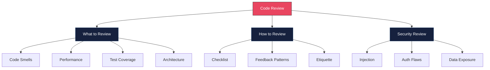
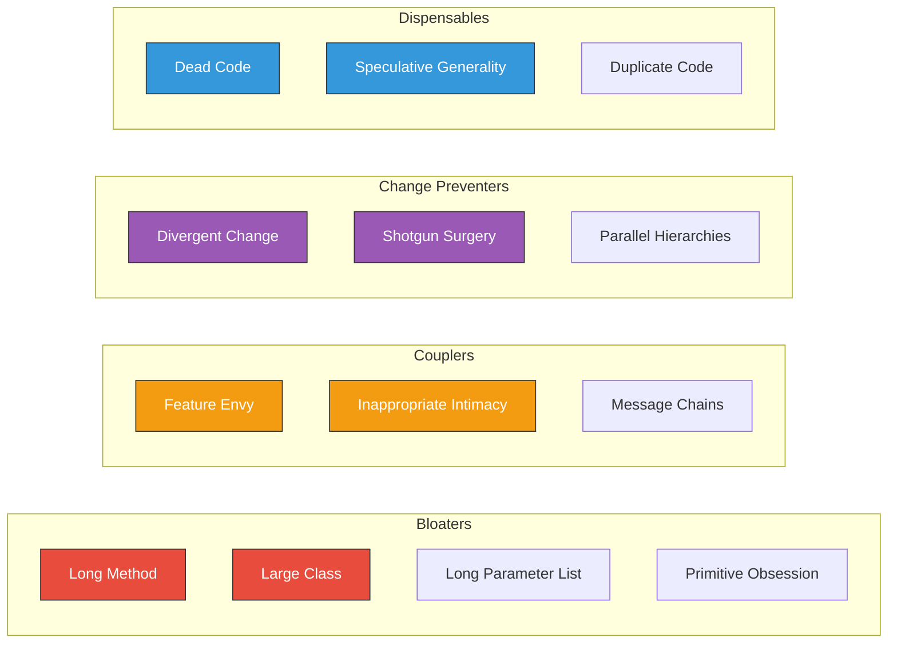

# Code Review Skills

## Overview

Code review is one of the most impactful engineering practices. It catches bugs, enforces standards, spreads knowledge, and mentors junior engineers. Senior engineers are expected to conduct thorough, constructive reviews — and to handle receiving reviews gracefully. This guide covers the complete review toolkit: checklists, code smells, security review, and communication patterns.



---

## Code Review Checklist

### Tier 1: Correctness (Must-Check)

| Check | What to Look For | Why |
|-------|-----------------|-----|
| Logic correctness | Off-by-one errors, wrong comparisons, missing edge cases | Bugs in production |
| Error handling | Unhandled exceptions, swallowed errors, missing try/catch | Silent failures |
| Null/undefined safety | Missing null checks, optional chaining, nullish coalescing | Runtime crashes |
| Concurrency | Race conditions, missing locks, shared mutable state | Data corruption |
| Data validation | Input validation at boundaries, schema validation | Injection attacks |

### Tier 2: Design (Should-Check)

| Check | What to Look For | Why |
|-------|-----------------|-----|
| Single Responsibility | Does this class/function do one thing well? | Maintainability |
| Naming | Are variables, functions, classes named clearly? | Readability |
| Abstractions | Right level of abstraction? Too many layers? Too few? | Complexity |
| DRY vs WET | Appropriate deduplication (not premature) | Maintainability |
| Interface design | Are public APIs intuitive? Consistent with existing patterns? | Usability |

### Tier 3: Operational (Nice-to-Check)

| Check | What to Look For | Why |
|-------|-----------------|-----|
| Logging | Sufficient logging at boundaries, no sensitive data in logs | Debuggability |
| Metrics | Are key operations instrumented? | Observability |
| Configuration | No hardcoded values that should be configurable | Flexibility |
| Backward compatibility | Will this break existing clients/consumers? | Stability |
| Database | N+1 queries, missing indexes, large transactions | Performance |

---

## Code Smells — Detection and Fixes

### Smell Categories



### Long Method

```typescript
// BAD: This function does too many things
async function processUserRegistration(data: RegistrationData): Promise<User> {
  // Validation (30 lines)
  if (!data.email || !data.email.includes("@")) {
    throw new Error("Invalid email");
  }
  if (!data.password || data.password.length < 8) {
    throw new Error("Password too short");
  }
  if (data.password === data.email) {
    throw new Error("Password cannot be same as email");
  }
  const existingUser = await db.query("SELECT * FROM users WHERE email = $1", [data.email]);
  if (existingUser.rows.length > 0) {
    throw new Error("Email already registered");
  }

  // User creation (15 lines)
  const salt = await bcrypt.genSalt(10);
  const hash = await bcrypt.hash(data.password, salt);
  const result = await db.query(
    "INSERT INTO users (email, password_hash, name) VALUES ($1, $2, $3) RETURNING *",
    [data.email, hash, data.name]
  );
  const user = result.rows[0];

  // Welcome email (10 lines)
  await sgMail.send({
    to: user.email,
    from: "welcome@app.com",
    subject: "Welcome!",
    html: `<h1>Welcome ${user.name}</h1><p>Thank you for registering.</p>`,
  });

  // Analytics (5 lines)
  await analytics.track("user_registered", {
    userId: user.id,
    source: data.referralSource,
  });

  return user;
}

// GOOD: Extracted into focused functions
async function processUserRegistration(data: RegistrationData): Promise<User> {
  await validateRegistrationData(data);
  await ensureEmailNotTaken(data.email);
  const user = await createUser(data);
  await sendWelcomeEmail(user);
  await trackRegistration(user, data.referralSource);
  return user;
}

async function validateRegistrationData(data: RegistrationData): Promise<void> {
  const schema = z.object({
    email: z.string().email(),
    password: z.string().min(8),
    name: z.string().min(1),
  });
  schema.parse(data);
  if (data.password === data.email) {
    throw new ValidationError("Password cannot be same as email");
  }
}

async function ensureEmailNotTaken(email: string): Promise<void> {
  const exists = await userRepo.existsByEmail(email);
  if (exists) throw new ConflictError("Email already registered");
}

async function createUser(data: RegistrationData): Promise<User> {
  const passwordHash = await hashPassword(data.password);
  return userRepo.create({ email: data.email, passwordHash, name: data.name });
}
```

### Feature Envy

```typescript
// BAD: OrderProcessor is obsessed with Order's internals
class OrderProcessor {
  calculateShipping(order: Order): number {
    const weight = order.items.reduce(
      (sum, item) => sum + item.product.weight * item.quantity, 0
    );
    const volume = order.items.reduce(
      (sum, item) => sum + item.product.volume * item.quantity, 0
    );
    const distance = this.getDistance(order.shippingAddress.zipCode, order.warehouse.zipCode);

    if (weight > 50) return distance * 0.5;
    if (volume > 100) return distance * 0.3;
    return distance * 0.1;
  }
}

// GOOD: Move logic to the class that owns the data
class Order {
  totalWeight(): number {
    return this.items.reduce(
      (sum, item) => sum + item.product.weight * item.quantity, 0
    );
  }

  totalVolume(): number {
    return this.items.reduce(
      (sum, item) => sum + item.product.volume * item.quantity, 0
    );
  }
}

class ShippingCalculator {
  calculate(order: Order, warehouseZip: string): number {
    const distance = this.getDistance(order.shippingAddress.zipCode, warehouseZip);
    if (order.totalWeight() > 50) return distance * 0.5;
    if (order.totalVolume() > 100) return distance * 0.3;
    return distance * 0.1;
  }
}
```

### Primitive Obsession

```typescript
// BAD: Using primitives for domain concepts
function createUser(
  email: string,        // Could be any string
  phone: string,        // Could be "hello"
  zipCode: string,      // Could be "banana"
  currency: string,     // Could be "xyz"
  amount: number        // Dollars? Cents? Yen?
): void { /* ... */ }

// GOOD: Value objects for domain concepts
class Email {
  private constructor(private readonly value: string) {}

  static create(raw: string): Email {
    const trimmed = raw.trim().toLowerCase();
    if (!/^[^\s@]+@[^\s@]+\.[^\s@]+$/.test(trimmed)) {
      throw new ValidationError(`Invalid email: ${raw}`);
    }
    return new Email(trimmed);
  }

  toString(): string { return this.value; }
  getDomain(): string { return this.value.split("@")[1]; }
  equals(other: Email): boolean { return this.value === other.value; }
}

class Money {
  private constructor(
    private readonly cents: number,
    private readonly currency: Currency
  ) {}

  static fromCents(cents: number, currency: Currency): Money {
    if (!Number.isInteger(cents)) throw new Error("Cents must be an integer");
    return new Money(cents, currency);
  }

  static fromDollars(dollars: number, currency: Currency): Money {
    return new Money(Math.round(dollars * 100), currency);
  }

  add(other: Money): Money {
    if (!this.currency.equals(other.currency)) {
      throw new Error("Cannot add different currencies");
    }
    return new Money(this.cents + other.cents, this.currency);
  }

  toCents(): number { return this.cents; }
  toDollars(): number { return this.cents / 100; }
}

function createUser(email: Email, phone: PhoneNumber, address: Address): void { /* ... */ }
```

### Code Smell Comparison Table

| Smell | Detection Signal | Refactoring | Risk Level |
|-------|-----------------|-------------|------------|
| Long Method | > 20 lines, multiple responsibilities | Extract Method | Medium |
| Large Class | > 200 lines, many instance variables | Extract Class | High |
| Long Parameter List | > 3-4 params | Introduce Parameter Object | Medium |
| Primitive Obsession | Raw strings/numbers for domain concepts | Value Objects | High |
| Feature Envy | Method uses another class's data more than its own | Move Method | Medium |
| Shotgun Surgery | One change requires edits in many files | Move Method, Inline Class | High |
| Dead Code | Unreachable code, unused imports, commented-out blocks | Delete it | Low |
| Speculative Generality | Abstractions without current use cases | Collapse Hierarchy, Remove | Low |
| Duplicate Code | Copy-pasted logic with minor variations | Extract Method, Template Method | Medium |
| Message Chains | `a.getB().getC().getD().doThing()` | Hide Delegate, move method | Medium |

---

## Security Review

### OWASP Top 10 Checks for Code Review

```typescript
// 1. INJECTION — SQL, NoSQL, OS command
// BAD
const user = await db.query(`SELECT * FROM users WHERE id = '${req.params.id}'`);

// GOOD — parameterized query
const user = await db.query("SELECT * FROM users WHERE id = $1", [req.params.id]);

// 2. BROKEN AUTHENTICATION
// BAD — timing attack vulnerable comparison
if (providedToken === storedToken) { /* ... */ }

// GOOD — constant-time comparison
import { timingSafeEqual } from "crypto";
const a = Buffer.from(providedToken);
const b = Buffer.from(storedToken);
if (a.length === b.length && timingSafeEqual(a, b)) { /* ... */ }

// 3. SENSITIVE DATA EXPOSURE
// BAD — logging sensitive data
console.log("User login:", { email, password, ssn });

// GOOD — redact sensitive fields
console.log("User login:", { email, password: "[REDACTED]" });

// 4. MASS ASSIGNMENT
// BAD — spreading request body directly
const user = await User.create(req.body); // Could include isAdmin: true

// GOOD — whitelist allowed fields
const { name, email, password } = req.body;
const user = await User.create({ name, email, password });

// 5. INSECURE DESERIALIZATION
// BAD — trusting JWT without verification
const payload = JSON.parse(Buffer.from(token.split(".")[1], "base64").toString());

// GOOD — verify signature
const payload = jwt.verify(token, process.env.JWT_SECRET);

// 6. BROKEN ACCESS CONTROL
// BAD — no authorization check
app.delete("/api/users/:id", async (req, res) => {
  await userService.delete(req.params.id); // Anyone can delete any user
});

// GOOD — verify ownership or admin role
app.delete("/api/users/:id", authorize("admin"), async (req, res) => {
  if (req.user.id !== req.params.id && req.user.role !== "admin") {
    return res.status(403).json({ error: "Forbidden" });
  }
  await userService.delete(req.params.id);
});

// 7. XSS (Cross-Site Scripting)
// BAD — rendering user input as HTML
res.send(`<h1>Welcome, ${req.query.name}</h1>`);

// GOOD — escape output
import { escape } from "lodash";
res.send(`<h1>Welcome, ${escape(req.query.name)}</h1>`);

// 8. INSECURE DIRECT OBJECT REFERENCES (IDOR)
// BAD — trusting user-provided ID without scope
app.get("/api/invoices/:id", async (req, res) => {
  const invoice = await Invoice.findById(req.params.id); // Any user can see any invoice
  res.json(invoice);
});

// GOOD — scope to authenticated user
app.get("/api/invoices/:id", async (req, res) => {
  const invoice = await Invoice.findOne({
    _id: req.params.id,
    userId: req.user.id,  // Scoped to current user
  });
  if (!invoice) return res.status(404).json({ error: "Not found" });
  res.json(invoice);
});
```

### Security Review Checklist

| Category | Check | Severity |
|----------|-------|----------|
| Input Validation | All user input validated and sanitized | Critical |
| SQL/NoSQL Injection | Parameterized queries used everywhere | Critical |
| Authentication | Passwords hashed with bcrypt/argon2 (not MD5/SHA) | Critical |
| Authorization | Every endpoint checks user permissions | Critical |
| Secrets | No hardcoded API keys, passwords, tokens | Critical |
| HTTPS | All external calls use HTTPS | High |
| CORS | Restrictive CORS policy, not `*` | High |
| Rate Limiting | Auth endpoints rate limited | High |
| Logging | No PII/secrets in logs | High |
| Dependencies | No known vulnerabilities (`npm audit`) | Medium |
| Error Messages | No stack traces or internal details in responses | Medium |
| File Uploads | File type validation, size limits, no path traversal | Medium |

---

## Review Etiquette and Communication

### Constructive Feedback Framework

```mermaid
graph TD
    FB[Giving Feedback] --> WHAT_TYPE{What type?}
    WHAT_TYPE --> |Must fix| BLOCKING[Blocking — "This will cause X bug"]
    WHAT_TYPE --> |Should fix| SUGGEST[Suggestion — "Consider doing X because Y"]
    WHAT_TYPE --> |Nice to have| NIT[Nit — "nit: prefer const over let here"]
    WHAT_TYPE --> |Positive| PRAISE[Praise — "Great use of the Builder pattern here"]

    BLOCKING --> |Explain why| WHY1["Provide the 'why' + evidence"]
    SUGGEST --> |Offer alternative| ALT["Show the alternative code"]
    NIT --> |Low priority| LABEL["Prefix with 'nit:' so author can deprioritize"]
    PRAISE --> |Reinforce good patterns| REIN["Be specific about what's good"]

    style BLOCKING fill:#e74c3c,stroke:#333,color:#fff
    style SUGGEST fill:#f39c12,stroke:#333,color:#fff
    style NIT fill:#3498db,stroke:#333,color:#fff
    style PRAISE fill:#2ecc71,stroke:#333,color:#fff
```

### Good vs Bad Review Comments

| Bad Comment | Good Comment | Why It's Better |
|-------------|-------------|-----------------|
| "This is wrong." | "This will throw a null reference error when `user` is undefined on line 42. Consider adding an early return or optional chaining." | Specific, explains the bug, suggests a fix |
| "Use a better name." | "nit: `d` doesn't convey meaning. Since this represents elapsed days, how about `elapsedDays`?" | Specific suggestion with reasoning |
| "Why didn't you use X?" | "Have you considered using the Strategy pattern here? It would make adding new payment methods easier without modifying this switch." | Framed as a question, explains the benefit |
| "This is not how we do things." | "We use repository pattern for data access (see `UserRepository` in `/src/repos/`). Could you follow that pattern here for consistency?" | Points to existing example, explains why |
| *(no comment on good code)* | "Nice — extracting this into a pure function makes it much easier to test. Well done." | Recognizes good work, reinforces good patterns |

### The Review Pyramid

Spend most of your review time on the bottom (most important) and least time on the top (least important):

| Priority | Focus Area | Time Spent |
|----------|-----------|------------|
| 5 (Lowest) | Style/formatting | 5% (automated by linters) |
| 4 | Naming conventions | 10% |
| 3 | Design/architecture | 25% |
| 2 | Correctness/bugs | 30% |
| 1 (Highest) | Security vulnerabilities | 30% |

### As a Reviewer

- Review within 24 hours (ideally within a few hours)
- Start with understanding the context: read the PR description and linked tickets
- Run the code locally if the change is complex
- Distinguish between blocking issues and suggestions
- Prefix nitpicks with "nit:" so the author knows they are optional
- Approve with comments when only nits remain

### As an Author

- Keep PRs small (under 400 lines of diff)
- Write a clear PR description explaining what and why
- Self-review before requesting reviews
- Respond to every comment, even if it is just "Done" or "Good point, fixed"
- Don't take feedback personally — it is about the code, not about you
- If you disagree, explain your reasoning calmly and be open to being wrong

---

## Common Code Review Anti-Patterns

| Anti-Pattern | Description | Impact |
|-------------|-------------|--------|
| Rubber Stamping | Approving without reading the code | Bugs slip through, trust erodes |
| Gatekeeping | Blocking PRs for stylistic preferences | Slows team velocity, frustrates authors |
| Drive-by Reviews | Leaving one vague comment and disappearing | Author is stuck, no resolution |
| Perfectionism | Demanding perfection instead of "good enough" | PRs sit open for days/weeks |
| Passive Aggression | "I guess this works..." | Toxic culture, people stop submitting PRs |
| Hero Reviewing | One person reviews everything | Bus factor of 1, bottleneck |

---

## Interview Q&A

> **Q: What is the most important thing you look for in a code review?**
>
> A: Correctness and security first, design second. I check: does this code actually solve the problem stated in the ticket? Are there edge cases that would cause failures? Are there security vulnerabilities like SQL injection, missing auth checks, or data exposure? Only after those are clear do I look at design, naming, and style. I also check that tests cover the new behavior — if there are no tests for a new feature, that is a blocking comment.

> **Q: How do you handle disagreements in code reviews?**
>
> A: I follow the "strong opinions, weakly held" principle. If I believe something is objectively wrong (a bug, a security vulnerability, a violation of established team patterns), I explain my reasoning with evidence — test cases that would fail, documentation references, or examples from the codebase. If it is a subjective design preference, I frame it as a suggestion ("Consider X because Y") and defer to the author if they have a reasonable counter-argument. If we truly cannot agree, we escalate to a tech lead or discuss in the team's architecture channel.

> **Q: How do you review code from a senior engineer vs a junior engineer?**
>
> A: The technical standard is the same — code quality should not vary based on who wrote it. But the communication style differs. For senior engineers, I keep feedback concise and focus on high-level design decisions. For junior engineers, I provide more context, explain the "why" behind suggestions, and link to documentation or examples. I also make sure to leave positive comments on things they did well to build their confidence and reinforce good patterns.

> **Q: What is a code smell and how is it different from a bug?**
>
> A: A bug is incorrect behavior — the code does not do what it is supposed to do. A code smell is a surface indication of a deeper structural problem — the code works, but its design makes it hard to maintain, extend, or understand. For example, a 200-line function is a code smell (Long Method). It might work perfectly today, but adding a feature to it next month will be error-prone. Code smells are leading indicators of future bugs. I treat bugs as blocking and smells as suggestions unless they cross a severity threshold.

> **Q: How do you approach reviewing a 2000-line PR?**
>
> A: My first comment is usually: "This PR is quite large. Can it be split into smaller, independently reviewable PRs?" Large PRs have higher defect rates because reviewers lose focus. If splitting is not possible (e.g., a large refactor), I review it in passes: first pass for architecture and data flow, second pass for correctness and edge cases, third pass for naming and style. I also ask the author to guide me through the PR with annotations or a walkthrough.

> **Q: What security vulnerabilities do you prioritize in code reviews?**
>
> A: The top three I always check: (1) Injection — SQL injection, NoSQL injection, command injection. I look for any place user input is concatenated into queries or commands. (2) Broken access control — I verify every endpoint checks authorization, not just authentication. IDOR vulnerabilities are common where a user can access another user's data by changing an ID. (3) Sensitive data exposure — I check that secrets are not hardcoded, PII is not logged, and error responses do not leak internal details. These three alone cover most critical vulnerabilities.
