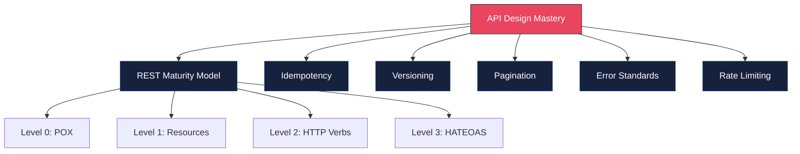
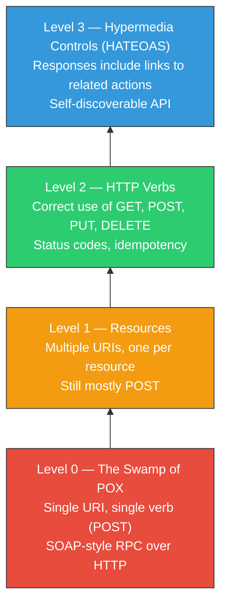
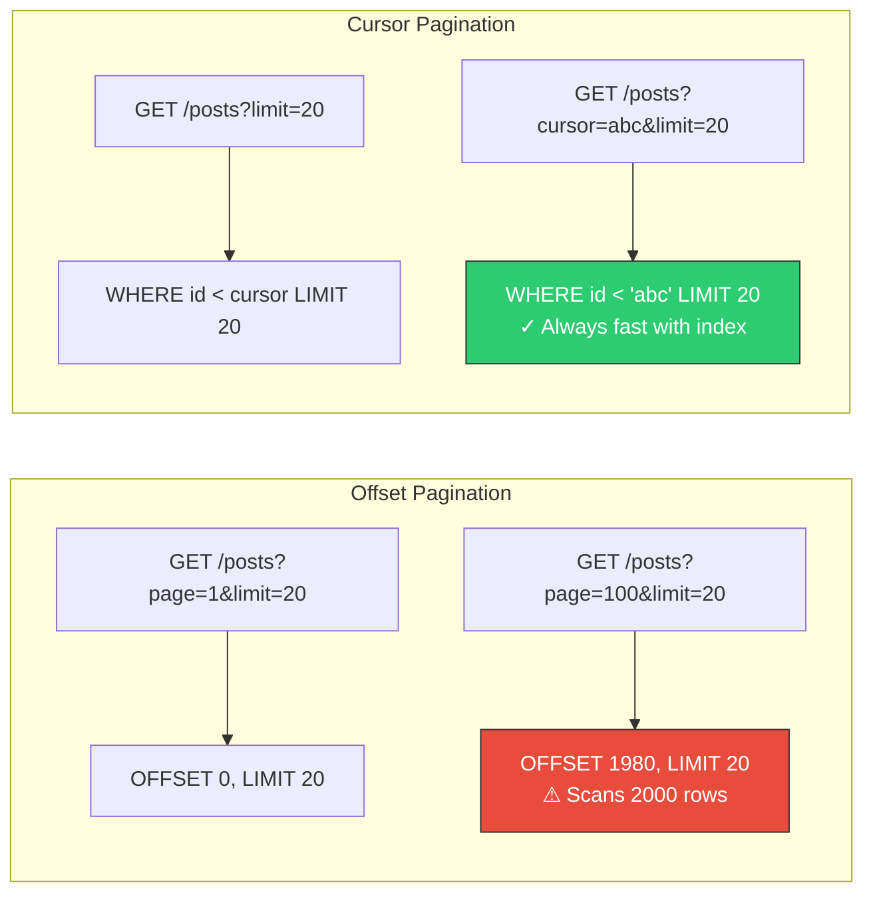

# API Design Maturity

## Overview

API design is one of the most consequential decisions in software engineering. A well-designed API is intuitive, backward-compatible, and resilient. A poorly designed API becomes a permanent tax on every consumer. This guide covers the REST maturity model, idempotency, versioning, pagination, error standards, and rate limiting — all topics that come up frequently in system design interviews.



---

## Richardson Maturity Model

The Richardson Maturity Model classifies REST APIs into four levels of maturity.



### Level 0: The Swamp of POX (Plain Old XML/JSON)

```typescript
// Everything goes to one endpoint with POST
// The action is encoded in the request body

// Create a user
// POST /api
{ "action": "createUser", "data": { "name": "Alice", "email": "alice@example.com" } }

// Get a user
// POST /api
{ "action": "getUser", "data": { "userId": "123" } }

// Delete a user
// POST /api
{ "action": "deleteUser", "data": { "userId": "123" } }
```

### Level 1: Resources

```typescript
// Different URIs per resource, but still mostly POST

// POST /api/users
{ "name": "Alice", "email": "alice@example.com" }

// POST /api/users/123/get
{}

// POST /api/users/123/delete
{}
```

### Level 2: HTTP Verbs (Industry Standard)

```typescript
// Correct HTTP methods + status codes

// Create a user
// POST /api/users  -> 201 Created
// { "name": "Alice", "email": "alice@example.com" }

// Get a user
// GET /api/users/123  -> 200 OK

// Update a user (full replacement)
// PUT /api/users/123  -> 200 OK
// { "name": "Alice Updated", "email": "alice@example.com" }

// Partial update
// PATCH /api/users/123  -> 200 OK
// { "name": "Alice Updated" }

// Delete a user
// DELETE /api/users/123  -> 204 No Content

// List users with filtering
// GET /api/users?role=admin&status=active  -> 200 OK
```

### Level 3: HATEOAS (Hypertext As The Engine Of Application State)

```typescript
// Response includes links to related actions and resources
// GET /api/orders/456

const response = {
  id: "456",
  status: "confirmed",
  total: 9999,
  items: [
    { productId: "p-1", name: "Widget", quantity: 2, price: 4999 }
  ],
  _links: {
    self: { href: "/api/orders/456", method: "GET" },
    cancel: { href: "/api/orders/456/cancel", method: "POST" },
    ship: { href: "/api/orders/456/ship", method: "POST" },
    customer: { href: "/api/users/789", method: "GET" },
    items: { href: "/api/orders/456/items", method: "GET" },
  },
  _actions: {
    cancel: {
      href: "/api/orders/456/cancel",
      method: "POST",
      description: "Cancel this order",
    },
    ship: {
      href: "/api/orders/456/ship",
      method: "POST",
      fields: [
        { name: "carrier", type: "string", required: true },
        { name: "trackingNumber", type: "string", required: true },
      ],
    },
  },
};
```

### Maturity Level Comparison

| Level | Resources | HTTP Verbs | Status Codes | Hypermedia | Real-World Use |
|-------|-----------|------------|-------------|------------|----------------|
| 0 | No | POST only | 200 for everything | No | Legacy SOAP-style APIs |
| 1 | Yes | POST mostly | Minimal | No | Early REST attempts |
| 2 | Yes | Yes | Yes | No | Most production APIs (Stripe, GitHub) |
| 3 | Yes | Yes | Yes | Yes | Rare in practice (some enterprise APIs) |

---

## Idempotency

An operation is idempotent if calling it multiple times produces the same result as calling it once. This is critical for reliability in distributed systems where network failures cause retries.

### HTTP Method Idempotency

| Method | Idempotent? | Safe? | Use Case |
|--------|------------|-------|----------|
| GET | Yes | Yes | Read resource |
| HEAD | Yes | Yes | Check resource exists |
| PUT | Yes | No | Replace resource entirely |
| DELETE | Yes | No | Remove resource |
| POST | **No** | No | Create resource, trigger action |
| PATCH | **No** | No | Partial update (depends on implementation) |

### Making POST Idempotent with Idempotency Keys

```typescript
// Client generates a unique idempotency key per logical operation
// Server stores the result and returns cached result on retry

interface IdempotencyRecord {
  key: string;
  statusCode: number;
  body: unknown;
  createdAt: Date;
  expiresAt: Date;
}

class IdempotencyMiddleware {
  constructor(private store: IdempotencyStore) {}

  middleware() {
    return async (req: Request, res: Response, next: NextFunction) => {
      // Only apply to POST requests
      if (req.method !== "POST") return next();

      const idempotencyKey = req.headers["idempotency-key"] as string;
      if (!idempotencyKey) return next(); // No key = no idempotency guarantee

      // Check if we've already processed this request
      const existing = await this.store.get(idempotencyKey);
      if (existing) {
        // Return cached response
        res.status(existing.statusCode).json(existing.body);
        return;
      }

      // Lock the key to prevent concurrent duplicate processing
      const locked = await this.store.lock(idempotencyKey);
      if (!locked) {
        res.status(409).json({ error: "Request is already being processed" });
        return;
      }

      // Capture the response
      const originalJson = res.json.bind(res);
      res.json = (body: unknown) => {
        // Store the result
        this.store.set(idempotencyKey, {
          key: idempotencyKey,
          statusCode: res.statusCode,
          body,
          createdAt: new Date(),
          expiresAt: new Date(Date.now() + 24 * 60 * 60 * 1000), // 24 hours
        });
        return originalJson(body);
      };

      next();
    };
  }
}

// Client usage
async function createPaymentWithRetry(paymentData: PaymentData): Promise<Payment> {
  const idempotencyKey = crypto.randomUUID(); // Generate ONCE per logical operation

  for (let attempt = 0; attempt < 3; attempt++) {
    try {
      const response = await fetch("/api/payments", {
        method: "POST",
        headers: {
          "Content-Type": "application/json",
          "Idempotency-Key": idempotencyKey, // Same key for all retries
        },
        body: JSON.stringify(paymentData),
      });
      return response.json();
    } catch (error) {
      if (attempt === 2) throw error;
      await sleep(Math.pow(2, attempt) * 1000); // Exponential backoff
    }
  }
}
```

---

## API Versioning Strategies

### Comparison Table

| Strategy | Example | Pros | Cons |
|----------|---------|------|------|
| URI Path | `/api/v1/users` | Explicit, easy to understand | URL changes on version bump, caching issues |
| Query Parameter | `/api/users?version=2` | Flexible, default version possible | Easy to forget, less visible |
| Header | `Accept: application/vnd.api.v2+json` | Clean URLs, proper HTTP semantics | Harder to test (can't paste URL in browser) |
| Content Negotiation | `Accept: application/json; version=2` | Standards-compliant | Complex implementation |
| No versioning (evolve) | Use additive changes only | Simplest to maintain | Requires strict discipline |

### Implementing URI-Based Versioning (Most Common)

```typescript
import { Router } from "express";

// Version 1
const v1Router = Router();
v1Router.get("/users/:id", async (req, res) => {
  const user = await userService.findById(req.params.id);
  // V1 response format
  res.json({
    id: user.id,
    name: user.name,           // V1: single name field
    email: user.email,
  });
});

// Version 2 — breaking change: split name into firstName/lastName
const v2Router = Router();
v2Router.get("/users/:id", async (req, res) => {
  const user = await userService.findById(req.params.id);
  // V2 response format
  res.json({
    id: user.id,
    firstName: user.firstName,  // V2: split name
    lastName: user.lastName,
    email: user.email,
    createdAt: user.createdAt,  // V2: added field (additive = safe)
  });
});

// Mount
app.use("/api/v1", v1Router);
app.use("/api/v2", v2Router);
```

### Backward Compatibility Rules

| Change Type | Backward Compatible? | Example |
|-------------|---------------------|---------|
| Add optional field to response | Yes | Add `createdAt` to user response |
| Add optional field to request | Yes | Add optional `nickname` parameter |
| Add new endpoint | Yes | Add `GET /api/v1/users/:id/avatar` |
| Remove a field from response | **No** | Remove `name` from user response |
| Rename a field | **No** | Rename `name` to `fullName` |
| Change field type | **No** | Change `id` from number to string |
| Add required field to request | **No** | Make `phoneNumber` required |
| Change status code semantics | **No** | Return 200 instead of 201 for creation |

---

## Pagination Patterns

### Offset-Based Pagination

```typescript
// GET /api/posts?page=3&limit=20

interface OffsetPaginatedResponse<T> {
  data: T[];
  pagination: {
    page: number;
    limit: number;
    totalItems: number;
    totalPages: number;
    hasNext: boolean;
    hasPrevious: boolean;
  };
}

async function getPostsWithOffset(
  page: number,
  limit: number
): Promise<OffsetPaginatedResponse<Post>> {
  const offset = (page - 1) * limit;

  const [posts, totalItems] = await Promise.all([
    db.query("SELECT * FROM posts ORDER BY created_at DESC LIMIT $1 OFFSET $2", [limit, offset]),
    db.query("SELECT COUNT(*) FROM posts"),
  ]);

  const totalPages = Math.ceil(totalItems / limit);

  return {
    data: posts,
    pagination: {
      page,
      limit,
      totalItems,
      totalPages,
      hasNext: page < totalPages,
      hasPrevious: page > 1,
    },
  };
}
```

### Cursor-Based Pagination

```typescript
// GET /api/posts?cursor=eyJjcmVhdGVkQXQiOiIyMDI0LTAxLTAxIn0&limit=20

interface CursorPaginatedResponse<T> {
  data: T[];
  pagination: {
    nextCursor: string | null;
    previousCursor: string | null;
    hasMore: boolean;
    limit: number;
  };
}

function encodeCursor(data: Record<string, unknown>): string {
  return Buffer.from(JSON.stringify(data)).toString("base64url");
}

function decodeCursor(cursor: string): Record<string, unknown> {
  return JSON.parse(Buffer.from(cursor, "base64url").toString("utf-8"));
}

async function getPostsWithCursor(
  cursor: string | null,
  limit: number
): Promise<CursorPaginatedResponse<Post>> {
  let query = "SELECT * FROM posts";
  const params: unknown[] = [limit + 1]; // Fetch one extra to check hasMore

  if (cursor) {
    const { createdAt, id } = decodeCursor(cursor);
    query += " WHERE (created_at, id) < ($2, $3)";
    params.push(createdAt, id);
  }

  query += " ORDER BY created_at DESC, id DESC LIMIT $1";

  const posts = await db.query(query, params);

  const hasMore = posts.length > limit;
  const data = hasMore ? posts.slice(0, limit) : posts;

  const lastItem = data[data.length - 1];
  const nextCursor = hasMore && lastItem
    ? encodeCursor({ createdAt: lastItem.createdAt, id: lastItem.id })
    : null;

  return {
    data,
    pagination: {
      nextCursor,
      previousCursor: null, // Implement if bidirectional needed
      hasMore,
      limit,
    },
  };
}
```

### Pagination Comparison



| Feature | Offset | Cursor |
|---------|--------|--------|
| Jump to page N | Yes | No |
| Consistent with live data | No (inserts shift pages) | Yes |
| Performance at page 1000 | Slow (scans offset rows) | Fast (index seek) |
| Implementation complexity | Simple | Moderate |
| Total count available | Yes (extra query) | Not easily |
| Ideal for | Admin dashboards, small datasets | Feeds, infinite scroll, large datasets |
| Used by | Many simple APIs | Twitter, Slack, Stripe, GitHub |

---

## Error Response Standards (RFC 7807)

RFC 7807 (Problem Details for HTTP APIs) defines a standard format for API error responses.

```typescript
// Standard error response following RFC 7807
interface ProblemDetail {
  type: string;        // URI reference identifying the error type
  title: string;       // Short, human-readable summary
  status: number;      // HTTP status code
  detail: string;      // Human-readable explanation specific to this occurrence
  instance?: string;   // URI reference for the specific occurrence
  // Extensions — add any additional fields
  [key: string]: unknown;
}

// Implementation
class ApiError extends Error {
  constructor(
    public readonly type: string,
    public readonly title: string,
    public readonly status: number,
    public readonly detail: string,
    public readonly extensions: Record<string, unknown> = {}
  ) {
    super(detail);
  }

  toProblemDetail(instance?: string): ProblemDetail {
    return {
      type: this.type,
      title: this.title,
      status: this.status,
      detail: this.detail,
      instance,
      ...this.extensions,
    };
  }
}

// Predefined error types
class NotFoundError extends ApiError {
  constructor(resource: string, id: string) {
    super(
      "https://api.example.com/errors/not-found",
      "Resource Not Found",
      404,
      `${resource} with id '${id}' was not found.`,
      { resource, resourceId: id }
    );
  }
}

class ValidationError extends ApiError {
  constructor(errors: Array<{ field: string; message: string }>) {
    super(
      "https://api.example.com/errors/validation",
      "Validation Failed",
      422,
      "One or more fields failed validation.",
      { errors }
    );
  }
}

class RateLimitError extends ApiError {
  constructor(retryAfter: number) {
    super(
      "https://api.example.com/errors/rate-limit",
      "Rate Limit Exceeded",
      429,
      "You have exceeded the rate limit. Please retry later.",
      { retryAfter }
    );
  }
}

class ConflictError extends ApiError {
  constructor(detail: string) {
    super(
      "https://api.example.com/errors/conflict",
      "Conflict",
      409,
      detail
    );
  }
}

// Error handling middleware
function errorHandler(err: Error, req: Request, res: Response, next: NextFunction): void {
  if (err instanceof ApiError) {
    res
      .status(err.status)
      .type("application/problem+json")
      .json(err.toProblemDetail(req.originalUrl));
    return;
  }

  // Unexpected errors — don't leak internals
  console.error("Unhandled error:", err);
  res
    .status(500)
    .type("application/problem+json")
    .json({
      type: "https://api.example.com/errors/internal",
      title: "Internal Server Error",
      status: 500,
      detail: "An unexpected error occurred. Please try again later.",
      instance: req.originalUrl,
    });
}

// Example error response
// Status: 422
// Content-Type: application/problem+json
//
// {
//   "type": "https://api.example.com/errors/validation",
//   "title": "Validation Failed",
//   "status": 422,
//   "detail": "One or more fields failed validation.",
//   "instance": "/api/v1/users",
//   "errors": [
//     { "field": "email", "message": "must be a valid email address" },
//     { "field": "password", "message": "must be at least 8 characters" }
//   ]
// }
```

---

## Rate Limiting

### Standard Headers

```typescript
// Rate limit response headers (following draft-ietf-httpapi-ratelimit-headers)

interface RateLimitInfo {
  limit: number;      // Maximum requests in the window
  remaining: number;  // Requests remaining in current window
  reset: number;      // Unix timestamp when the window resets
  retryAfter?: number; // Seconds until the client should retry (only on 429)
}

class RateLimiter {
  constructor(
    private store: RateLimitStore, // Redis, in-memory, etc.
    private config: { windowMs: number; maxRequests: number }
  ) {}

  middleware() {
    return async (req: Request, res: Response, next: NextFunction) => {
      const key = this.getKey(req); // IP, API key, user ID, etc.
      const record = await this.store.increment(key, this.config.windowMs);

      const info: RateLimitInfo = {
        limit: this.config.maxRequests,
        remaining: Math.max(0, this.config.maxRequests - record.count),
        reset: record.resetAt,
      };

      // Always set rate limit headers
      res.setHeader("RateLimit-Limit", info.limit);
      res.setHeader("RateLimit-Remaining", info.remaining);
      res.setHeader("RateLimit-Reset", info.reset);

      if (record.count > this.config.maxRequests) {
        const retryAfter = Math.ceil((record.resetAt - Date.now()) / 1000);
        res.setHeader("Retry-After", retryAfter);

        res.status(429).json({
          type: "https://api.example.com/errors/rate-limit",
          title: "Rate Limit Exceeded",
          status: 429,
          detail: `Rate limit of ${this.config.maxRequests} requests per ${this.config.windowMs / 1000}s exceeded.`,
          retryAfter,
        });
        return;
      }

      next();
    };
  }

  private getKey(req: Request): string {
    // Prefer API key, fall back to IP
    return req.headers["x-api-key"] as string ?? req.ip;
  }
}

// Different rate limits for different endpoints
const publicLimiter = new RateLimiter(redisStore, {
  windowMs: 60_000,       // 1 minute
  maxRequests: 60,         // 60 requests per minute
});

const authLimiter = new RateLimiter(redisStore, {
  windowMs: 900_000,      // 15 minutes
  maxRequests: 5,          // 5 login attempts per 15 minutes
});

app.use("/api", publicLimiter.middleware());
app.use("/api/auth/login", authLimiter.middleware());
```

### Rate Limiting Strategies

| Strategy | How It Works | Best For |
|----------|-------------|----------|
| Fixed Window | Count requests in fixed time slots (e.g., per minute) | Simple, most common |
| Sliding Window Log | Track timestamps of each request, count in rolling window | Precise, memory-heavy |
| Sliding Window Counter | Weighted combination of current and previous window | Good balance of accuracy and memory |
| Token Bucket | Tokens added at fixed rate, consumed per request | Allowing bursts while limiting average rate |
| Leaky Bucket | Requests processed at fixed rate, excess queued/dropped | Smoothing traffic |

---

## Complete API Design Example

```typescript
// A well-designed API endpoint incorporating all concepts

// POST /api/v2/orders
// Headers:
//   Authorization: Bearer <token>
//   Idempotency-Key: <uuid>
//   Content-Type: application/json
//
// Request Body:
// {
//   "items": [{ "productId": "prod_123", "quantity": 2 }],
//   "shippingAddressId": "addr_456",
//   "paymentMethodId": "pm_789"
// }
//
// Success Response: 201 Created
// {
//   "id": "ord_abc",
//   "status": "confirmed",
//   "total": { "amount": 5998, "currency": "USD" },
//   "items": [...],
//   "_links": {
//     "self": { "href": "/api/v2/orders/ord_abc" },
//     "cancel": { "href": "/api/v2/orders/ord_abc/cancel", "method": "POST" },
//     "track": { "href": "/api/v2/orders/ord_abc/tracking" }
//   }
// }
//
// Error Response: 422 Unprocessable Entity
// Content-Type: application/problem+json
// {
//   "type": "https://api.example.com/errors/validation",
//   "title": "Validation Failed",
//   "status": 422,
//   "detail": "One or more fields failed validation.",
//   "errors": [{ "field": "items", "message": "must contain at least one item" }]
// }
//
// Rate Limited Response: 429 Too Many Requests
// RateLimit-Limit: 100
// RateLimit-Remaining: 0
// RateLimit-Reset: 1700000000
// Retry-After: 30
```

---

## Interview Q&A

> **Q: What is idempotency and why does it matter?**
>
> A: An operation is idempotent if performing it multiple times has the same effect as performing it once. GET, PUT, and DELETE are idempotent by definition in HTTP. POST is not — creating an order twice would create two orders. Idempotency matters because networks are unreliable. If a client sends a POST request and the connection drops before receiving the response, it does not know whether the server processed the request. With an idempotency key, the client can safely retry, and the server will return the cached result instead of processing it again. Stripe, PayPal, and most payment APIs use idempotency keys for this reason.

> **Q: Cursor vs offset pagination — when would you use each?**
>
> A: Offset pagination is simpler and allows jumping to any page, making it ideal for admin dashboards and small datasets. But it has two major problems at scale: (1) performance degrades because the database must scan all offset rows before returning results, and (2) pages shift when new items are inserted, causing duplicate or missed items. Cursor pagination solves both: it uses an indexed column to seek directly to the right position, so it is O(1) regardless of page depth. I use cursor pagination for user-facing feeds, timelines, infinite scroll, and any dataset that grows continuously.

> **Q: How do you handle breaking changes in an API?**
>
> A: I follow this process: (1) Avoid breaking changes when possible — additive changes (new optional fields, new endpoints) are backward-compatible. (2) When a breaking change is necessary, introduce a new API version (e.g., /v2) while keeping the old version running. (3) Set a deprecation timeline — give consumers 6-12 months to migrate. (4) Add deprecation headers (`Deprecation: true`, `Sunset: date`) to the old version. (5) Monitor usage of the old version and proactively reach out to remaining consumers before sunsetting. The goal is to never surprise consumers with a breaking change.

> **Q: What is RFC 7807 and why should APIs use it?**
>
> A: RFC 7807 defines a standard format for error responses called "Problem Details for HTTP APIs." It specifies fields like `type` (a URI identifying the error category), `title` (human-readable summary), `status` (HTTP status code), `detail` (specific explanation), and `instance` (URI of the specific occurrence). Using it provides consistency across all endpoints, makes errors machine-parsable for client error handling, and allows extensions for domain-specific metadata like validation errors. Without a standard, every team invents their own error format, and consumers must handle multiple inconsistent formats.

> **Q: How would you design rate limiting for a multi-tenant SaaS API?**
>
> A: I would implement tiered rate limiting: (1) Per-tenant limits based on their plan (free: 100 req/min, pro: 1000 req/min, enterprise: custom). (2) Per-endpoint limits for expensive operations (search: 10 req/min, exports: 5 req/hour). (3) Global limits to protect infrastructure (total: 50,000 req/min across all tenants). I use the token bucket algorithm because it allows short bursts while maintaining average limits. I always return `RateLimit-*` headers so clients can self-regulate. I store counters in Redis for distributed consistency across multiple API server instances. For enterprise customers, I offer dedicated rate limit pools that are not affected by other tenants.

> **Q: Should you use REST or GraphQL for a new API?**
>
> A: It depends on the use case. REST is better when: you have well-defined, stable resources; you want strong caching (HTTP caching works natively); you need simplicity for external consumers; your data model is not deeply nested. GraphQL is better when: the client needs flexible queries (mobile vs web need different data); you have deeply nested data with many relationships; you want to eliminate over-fetching and under-fetching; you have a sophisticated frontend team that benefits from type-safe queries. For most CRUD APIs with external consumers, I default to REST Level 2. For internal APIs serving complex frontends, GraphQL is often the better choice.
