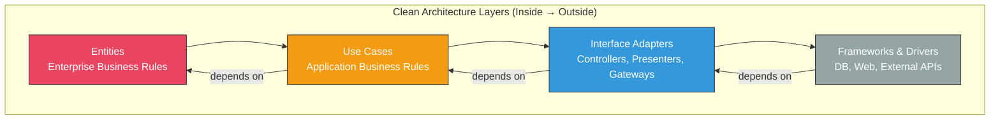
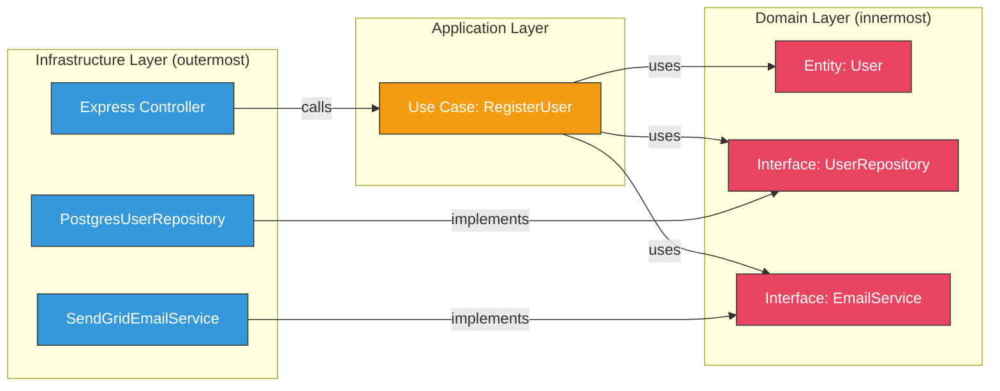

# Clean Architecture

## Overview

Clean Architecture is a set of principles for organizing code so that business logic is independent of frameworks, databases, and UI. The core idea — the **Dependency Rule** — states that source code dependencies must point inward, toward higher-level policies. This guide covers Clean Architecture, Hexagonal Architecture (Ports & Adapters), Onion Architecture, DDD tactical patterns, and practical TypeScript/Node.js project structures.



---

## The Dependency Rule

> Source code dependencies must only point inward. Nothing in an inner circle can know anything about something in an outer circle.

This is the single most important rule of Clean Architecture. Inner layers define interfaces (ports). Outer layers implement them (adapters).



---

## Architecture Variants Comparison

| Aspect | Clean Architecture | Hexagonal (Ports & Adapters) | Onion Architecture |
|--------|-------------------|------------------------------|-------------------|
| Author | Robert C. Martin | Alistair Cockburn | Jeffrey Palermo |
| Core Idea | Dependency Rule — inward only | Ports (interfaces) + Adapters (implementations) | Layers like an onion, domain at center |
| Layers | Entities, Use Cases, Adapters, Frameworks | Application, Ports, Adapters | Domain, Domain Services, Application, Infrastructure |
| Key Metaphor | Concentric circles | Hexagon with ports on edges | Onion layers |
| Practical Difference | Almost none — these are the same idea with different terminology |

### Hexagonal Architecture (Ports & Adapters)

```typescript
// === PORTS (Interfaces — defined in the domain) ===

// Driving port (primary) — how the outside world calls our app
interface RegisterUserPort {
  execute(command: RegisterUserCommand): Promise<UserDTO>;
}

// Driven port (secondary) — how our app calls the outside world
interface UserRepositoryPort {
  save(user: User): Promise<void>;
  findByEmail(email: string): Promise<User | null>;
}

interface PasswordHasherPort {
  hash(password: string): Promise<string>;
  verify(password: string, hash: string): Promise<boolean>;
}

interface EventPublisherPort {
  publish(event: DomainEvent): Promise<void>;
}

// === DOMAIN ===

class User {
  private constructor(
    public readonly id: string,
    public readonly email: string,
    public readonly passwordHash: string,
    public readonly name: string,
    public readonly createdAt: Date
  ) {}

  static create(props: { id: string; email: string; passwordHash: string; name: string }): User {
    return new User(props.id, props.email, props.passwordHash, props.name, new Date());
  }
}

// === APPLICATION (Use Case — implements driving port) ===

interface RegisterUserCommand {
  email: string;
  password: string;
  name: string;
}

interface UserDTO {
  id: string;
  email: string;
  name: string;
  createdAt: string;
}

class RegisterUserUseCase implements RegisterUserPort {
  constructor(
    private userRepo: UserRepositoryPort,
    private hasher: PasswordHasherPort,
    private events: EventPublisherPort,
    private idGenerator: () => string
  ) {}

  async execute(command: RegisterUserCommand): Promise<UserDTO> {
    // Business rule: no duplicate emails
    const existing = await this.userRepo.findByEmail(command.email);
    if (existing) {
      throw new DomainError("Email already registered");
    }

    // Business rule: password must be at least 8 characters
    if (command.password.length < 8) {
      throw new DomainError("Password must be at least 8 characters");
    }

    const passwordHash = await this.hasher.hash(command.password);
    const user = User.create({
      id: this.idGenerator(),
      email: command.email,
      passwordHash,
      name: command.name,
    });

    await this.userRepo.save(user);
    await this.events.publish({ type: "UserRegistered", payload: { userId: user.id } });

    return {
      id: user.id,
      email: user.email,
      name: user.name,
      createdAt: user.createdAt.toISOString(),
    };
  }
}

// === ADAPTERS (Implementations — outer layer) ===

// Driven adapter: PostgreSQL
class PostgresUserRepository implements UserRepositoryPort {
  constructor(private pool: Pool) {}

  async save(user: User): Promise<void> {
    await this.pool.query(
      "INSERT INTO users (id, email, password_hash, name, created_at) VALUES ($1, $2, $3, $4, $5)",
      [user.id, user.email, user.passwordHash, user.name, user.createdAt]
    );
  }

  async findByEmail(email: string): Promise<User | null> {
    const result = await this.pool.query("SELECT * FROM users WHERE email = $1", [email]);
    if (result.rows.length === 0) return null;
    const row = result.rows[0];
    return User.create({
      id: row.id,
      email: row.email,
      passwordHash: row.password_hash,
      name: row.name,
    });
  }
}

// Driven adapter: bcrypt
class BcryptPasswordHasher implements PasswordHasherPort {
  async hash(password: string): Promise<string> {
    return bcrypt.hash(password, 12);
  }

  async verify(password: string, hash: string): Promise<boolean> {
    return bcrypt.compare(password, hash);
  }
}

// Driving adapter: Express controller
class UserController {
  constructor(private registerUser: RegisterUserPort) {}

  async register(req: Request, res: Response): Promise<void> {
    try {
      const result = await this.registerUser.execute({
        email: req.body.email,
        password: req.body.password,
        name: req.body.name,
      });
      res.status(201).json(result);
    } catch (error) {
      if (error instanceof DomainError) {
        res.status(422).json({ error: error.message });
      } else {
        res.status(500).json({ error: "Internal server error" });
      }
    }
  }
}
```

---

## Domain-Driven Design (DDD) Tactical Patterns

### Key Concepts

| Concept | Definition | Example |
|---------|-----------|---------|
| **Entity** | Object with identity that persists over time | User, Order, Product |
| **Value Object** | Immutable object defined by its attributes, no identity | Email, Money, Address |
| **Aggregate** | Cluster of entities treated as a unit for data changes | Order (with OrderItems) |
| **Aggregate Root** | The single entry point to an Aggregate | Order is root, OrderItem accessed through Order |
| **Repository** | Abstraction for persisting and retrieving Aggregates | OrderRepository |
| **Domain Service** | Business logic that doesn't belong to a single Entity | TransferMoneyService |
| **Domain Event** | Record of something significant that happened | OrderPlaced, PaymentFailed |
| **Factory** | Encapsulates complex creation logic | OrderFactory |

### Aggregate Design

```typescript
// Aggregate Root: Order
// Rule: All modifications to OrderItems go through Order

class Order {
  private items: OrderItem[] = [];
  private _status: OrderStatus = "draft";

  private constructor(
    public readonly id: string,
    public readonly customerId: string,
    private readonly createdAt: Date
  ) {}

  static create(id: string, customerId: string): Order {
    return new Order(id, customerId, new Date());
  }

  get status(): OrderStatus { return this._status; }

  get totalInCents(): number {
    return this.items.reduce(
      (sum, item) => sum + item.priceInCents * item.quantity, 0
    );
  }

  // Business rule: cannot add items to a confirmed order
  addItem(productId: string, priceInCents: number, quantity: number): void {
    if (this._status !== "draft") {
      throw new DomainError("Cannot modify a non-draft order");
    }
    if (quantity <= 0) {
      throw new DomainError("Quantity must be positive");
    }
    if (priceInCents <= 0) {
      throw new DomainError("Price must be positive");
    }

    const existing = this.items.find((i) => i.productId === productId);
    if (existing) {
      existing.increaseQuantity(quantity);
    } else {
      this.items.push(new OrderItem(productId, priceInCents, quantity));
    }
  }

  removeItem(productId: string): void {
    if (this._status !== "draft") {
      throw new DomainError("Cannot modify a non-draft order");
    }
    this.items = this.items.filter((i) => i.productId !== productId);
  }

  // Business rule: must have at least one item to confirm
  confirm(): OrderConfirmedEvent {
    if (this._status !== "draft") {
      throw new DomainError("Only draft orders can be confirmed");
    }
    if (this.items.length === 0) {
      throw new DomainError("Cannot confirm an empty order");
    }
    this._status = "confirmed";

    return {
      type: "OrderConfirmed",
      orderId: this.id,
      customerId: this.customerId,
      totalInCents: this.totalInCents,
      occurredAt: new Date(),
    };
  }

  cancel(): OrderCancelledEvent {
    if (this._status === "cancelled") {
      throw new DomainError("Order is already cancelled");
    }
    if (this._status === "shipped") {
      throw new DomainError("Cannot cancel a shipped order");
    }
    this._status = "cancelled";

    return {
      type: "OrderCancelled",
      orderId: this.id,
      occurredAt: new Date(),
    };
  }

  getItems(): ReadonlyArray<OrderItem> {
    return [...this.items]; // Return a copy to protect invariants
  }
}

// Value Object within the Aggregate
class OrderItem {
  constructor(
    public readonly productId: string,
    public readonly priceInCents: number,
    private _quantity: number
  ) {}

  get quantity(): number { return this._quantity; }

  increaseQuantity(amount: number): void {
    if (amount <= 0) throw new DomainError("Amount must be positive");
    this._quantity += amount;
  }
}

// Value Object: Money
class Money {
  private constructor(
    public readonly amount: number,
    public readonly currency: string
  ) {
    if (!Number.isFinite(amount)) throw new DomainError("Invalid amount");
  }

  static of(amount: number, currency: string): Money {
    return new Money(amount, currency);
  }

  add(other: Money): Money {
    if (this.currency !== other.currency) {
      throw new DomainError(`Cannot add ${this.currency} and ${other.currency}`);
    }
    return new Money(this.amount + other.amount, this.currency);
  }

  multiply(factor: number): Money {
    return new Money(Math.round(this.amount * factor), this.currency);
  }

  equals(other: Money): boolean {
    return this.amount === other.amount && this.currency === other.currency;
  }
}
```

---

## Node.js / TypeScript Project Structure

### Feature-Based (Recommended)

```
src/
├── modules/
│   ├── user/
│   │   ├── domain/
│   │   │   ├── user.entity.ts          # Entity with business rules
│   │   │   ├── user.repository.ts       # Repository interface (port)
│   │   │   ├── email.value-object.ts    # Value object
│   │   │   └── user.errors.ts           # Domain-specific errors
│   │   ├── application/
│   │   │   ├── register-user.use-case.ts
│   │   │   ├── get-user.use-case.ts
│   │   │   ├── update-user.use-case.ts
│   │   │   └── dto/
│   │   │       ├── register-user.command.ts
│   │   │       └── user.response.ts
│   │   ├── infrastructure/
│   │   │   ├── postgres-user.repository.ts  # Repository implementation
│   │   │   ├── user.mapper.ts               # DB row ↔ entity mapping
│   │   │   └── user.schema.ts               # DB schema / migration
│   │   └── presentation/
│   │       ├── user.controller.ts           # HTTP controller
│   │       ├── user.routes.ts               # Route definitions
│   │       └── user.validation.ts           # Input validation (Zod)
│   │
│   ├── order/
│   │   ├── domain/
│   │   ├── application/
│   │   ├── infrastructure/
│   │   └── presentation/
│   │
│   └── payment/
│       ├── domain/
│       ├── application/
│       ├── infrastructure/
│       └── presentation/
│
├── shared/
│   ├── domain/
│   │   ├── base.entity.ts
│   │   ├── domain.error.ts
│   │   └── domain.event.ts
│   ├── infrastructure/
│   │   ├── database.ts
│   │   ├── logger.ts
│   │   └── event-bus.ts
│   └── presentation/
│       ├── error-handler.middleware.ts
│       └── auth.middleware.ts
│
├── config/
│   ├── index.ts
│   └── di-container.ts       # Dependency injection wiring
│
├── app.ts                     # Express app setup
└── server.ts                  # Entry point
```

### Layer-Based (Simpler, for Smaller Projects)

```
src/
├── domain/
│   ├── entities/
│   │   ├── user.ts
│   │   └── order.ts
│   ├── value-objects/
│   │   ├── email.ts
│   │   └── money.ts
│   ├── repositories/          # Interfaces only
│   │   ├── user.repository.ts
│   │   └── order.repository.ts
│   └── errors/
│       └── domain.error.ts
│
├── application/
│   ├── use-cases/
│   │   ├── register-user.ts
│   │   └── place-order.ts
│   └── dto/
│       ├── register-user.command.ts
│       └── user.response.ts
│
├── infrastructure/
│   ├── repositories/          # Implementations
│   │   ├── postgres-user.repository.ts
│   │   └── postgres-order.repository.ts
│   ├── services/
│   │   ├── bcrypt-hasher.ts
│   │   └── sendgrid-email.ts
│   └── database/
│       ├── connection.ts
│       └── migrations/
│
├── presentation/
│   ├── controllers/
│   │   ├── user.controller.ts
│   │   └── order.controller.ts
│   ├── routes/
│   ├── middleware/
│   └── validation/
│
└── config/
    ├── index.ts
    └── di-container.ts
```

### Structure Comparison

| Aspect | Feature-Based | Layer-Based |
|--------|--------------|-------------|
| File proximity | Related files together | Related layers together |
| Scalability | Better for large teams | Better for small teams |
| Module boundaries | Clear bounded contexts | Shared by default |
| Navigation | Find all user code in one folder | Find all controllers in one folder |
| When to use | Microservice-ready monoliths, large codebases | Smaller projects, MVPs, 1-3 developer teams |

---

## Wiring It All Together (Composition Root)

```typescript
// config/di-container.ts
// The Composition Root — the ONLY place that knows about all concrete types

import { Pool } from "pg";
import { RegisterUserUseCase } from "../modules/user/application/register-user.use-case";
import { PostgresUserRepository } from "../modules/user/infrastructure/postgres-user.repository";
import { BcryptPasswordHasher } from "../shared/infrastructure/bcrypt-hasher";
import { EventBus } from "../shared/infrastructure/event-bus";
import { UserController } from "../modules/user/presentation/user.controller";

export function createContainer(config: AppConfig) {
  // Infrastructure
  const pool = new Pool({ connectionString: config.databaseUrl });
  const eventBus = new EventBus();

  // Repositories (driven adapters)
  const userRepo = new PostgresUserRepository(pool);

  // Services
  const hasher = new BcryptPasswordHasher();

  // Use Cases
  const registerUser = new RegisterUserUseCase(
    userRepo,
    hasher,
    eventBus,
    () => crypto.randomUUID()
  );

  // Controllers (driving adapters)
  const userController = new UserController(registerUser);

  return {
    userController,
    // Expose other controllers...
    pool, // For graceful shutdown
  };
}

// server.ts
const container = createContainer({
  databaseUrl: process.env.DATABASE_URL!,
});

app.post("/api/v1/users", (req, res) => container.userController.register(req, res));
```

---

## Interview Q&A

> **Q: What is the Dependency Rule and why does it matter?**
>
> A: The Dependency Rule states that source code dependencies must only point inward — from outer layers toward inner layers. The domain layer (entities, business rules) must not depend on infrastructure (databases, frameworks, HTTP). This matters because it makes your business logic testable without infrastructure, portable across frameworks, and resilient to technology changes. If you switch from PostgreSQL to MongoDB, only the repository adapter changes; the use cases and domain remain untouched.

> **Q: What is the difference between Clean Architecture, Hexagonal Architecture, and Onion Architecture?**
>
> A: They are essentially the same idea expressed differently. Clean Architecture uses concentric circles (entities, use cases, adapters, frameworks). Hexagonal Architecture uses the metaphor of a hexagon with ports (interfaces) on its edges and adapters plugged in. Onion Architecture uses layers like an onion with the domain at the center. All three share the fundamental principle: business logic at the center, infrastructure at the edges, dependencies pointing inward. In practice, I use the terms interchangeably and focus on the Dependency Rule rather than terminology.

> **Q: What is an Aggregate in DDD and why is it important?**
>
> A: An Aggregate is a cluster of domain objects treated as a single unit for data changes. It has an Aggregate Root — the only entity through which external code can access the cluster. For example, an Order aggregate contains OrderItems. You cannot modify an OrderItem directly; you must go through Order. This is important because it enforces business invariants (e.g., "an order's total must always equal the sum of its items") and provides a transactional boundary — you load and save the entire aggregate atomically.

> **Q: How do you decide between feature-based and layer-based folder structure?**
>
> A: I use layer-based for small projects (MVP, 1-3 developers) where navigating by technical concern (all controllers, all services) is natural. I switch to feature-based when the team grows beyond 3-4 developers or the codebase exceeds 50-100 files. Feature-based grouping reduces merge conflicts because different teams work in different folders. It also makes the code base easier to split into microservices later — each feature folder is already a potential service boundary.

> **Q: Is Clean Architecture always the right choice?**
>
> A: No. Clean Architecture adds complexity. For a simple CRUD API or an MVP, it is over-engineering. The cost of all those interfaces, DTOs, and mappers is not justified when the business logic is trivial. I apply Clean Architecture when: (1) the domain has complex business rules worth protecting, (2) the application will live for years and will undergo significant changes, (3) the team is large enough that clear boundaries reduce coordination cost, (4) testability is a priority. For a weekend hackathon or a simple data pipeline, direct database access in route handlers is perfectly fine.

> **Q: How do you handle cross-cutting concerns like logging and authentication in Clean Architecture?**
>
> A: Cross-cutting concerns belong in the infrastructure and presentation layers, not in the domain. Logging is typically done at the controller level (request/response logging) and at the infrastructure level (query logging). Authentication is handled by middleware before the request reaches the controller. Authorization can be domain-level (business rules about who can do what) or infrastructure-level (role checks). I inject logger and auth interfaces into use cases if the domain needs to log domain events or check permissions, but I keep the domain free of framework-specific logging code.
