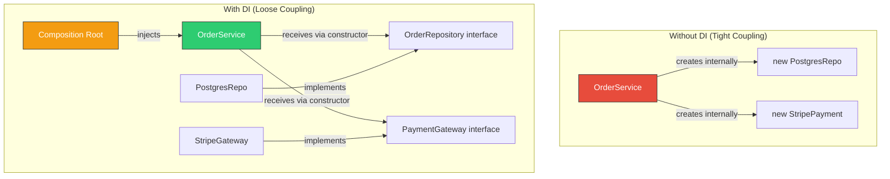
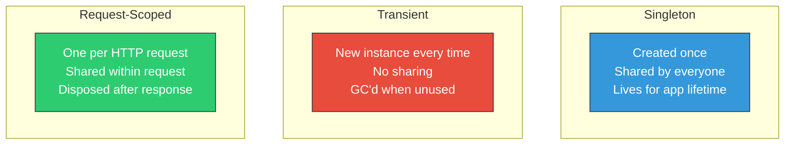
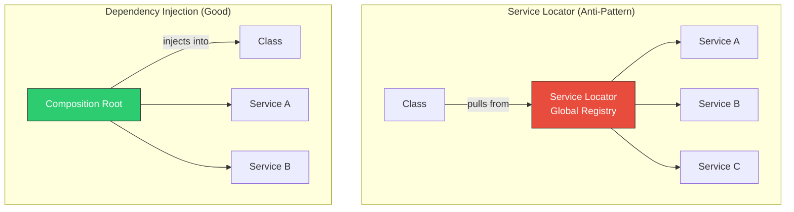

# Dependency Injection

## Overview

Dependency Injection (DI) is a technique where an object receives its dependencies from the outside rather than creating them internally. It is the primary mechanism for achieving the Dependency Inversion Principle (DIP) and is fundamental to writing testable, maintainable, and flexible code. This guide covers DI principles, injection types, DI containers (InversifyJS, tsyringe), testing with mocks, and the Service Locator anti-pattern.



---

## The Three Types of Dependency Injection

### 1. Constructor Injection (Preferred)

Dependencies are provided through the class constructor. This makes dependencies explicit and guarantees the object is fully initialized.

```typescript
interface Logger {
  info(message: string, meta?: Record<string, unknown>): void;
  error(message: string, error?: Error): void;
}

interface UserRepository {
  findById(id: string): Promise<User | null>;
  findByEmail(email: string): Promise<User | null>;
  save(user: User): Promise<void>;
}

interface PasswordHasher {
  hash(password: string): Promise<string>;
  verify(password: string, hash: string): Promise<boolean>;
}

// Dependencies are explicit — you can see exactly what this class needs
class AuthService {
  constructor(
    private readonly userRepo: UserRepository,
    private readonly hasher: PasswordHasher,
    private readonly logger: Logger
  ) {}

  async login(email: string, password: string): Promise<AuthToken> {
    this.logger.info("Login attempt", { email });

    const user = await this.userRepo.findByEmail(email);
    if (!user) {
      this.logger.info("Login failed: user not found", { email });
      throw new AuthError("Invalid credentials");
    }

    const valid = await this.hasher.verify(password, user.passwordHash);
    if (!valid) {
      this.logger.info("Login failed: invalid password", { email });
      throw new AuthError("Invalid credentials");
    }

    this.logger.info("Login successful", { userId: user.id });
    return this.generateToken(user);
  }

  private generateToken(user: User): AuthToken {
    // Token generation logic
    return { token: "jwt...", expiresAt: new Date() };
  }
}
```

### 2. Property (Setter) Injection

Dependencies are set through public properties or setter methods after construction. Use sparingly — it allows partially initialized objects.

```typescript
// Property injection — object can exist in invalid state
class ReportGenerator {
  // These could be undefined if not set!
  private _formatter?: ReportFormatter;
  private _dataSource?: DataSource;

  set formatter(f: ReportFormatter) { this._formatter = f; }
  set dataSource(ds: DataSource) { this._dataSource = ds; }

  async generate(): Promise<Report> {
    if (!this._formatter || !this._dataSource) {
      throw new Error("Dependencies not injected");
    }
    const data = await this._dataSource.fetch();
    return this._formatter.format(data);
  }
}

// Usage — easy to forget setting a dependency
const generator = new ReportGenerator();
generator.formatter = new PDFFormatter();
// Oops, forgot to set dataSource!
await generator.generate(); // Runtime error
```

### 3. Method Injection

Dependencies are passed per method call. Useful when the dependency varies between calls.

```typescript
interface TransactionContext {
  query(sql: string, params: unknown[]): Promise<QueryResult>;
  commit(): Promise<void>;
  rollback(): Promise<void>;
}

class OrderService {
  // Transaction context varies per request — method injection makes sense
  async placeOrder(items: CartItem[], tx: TransactionContext): Promise<Order> {
    try {
      const order = await tx.query(
        "INSERT INTO orders (status) VALUES ('pending') RETURNING *",
        []
      );
      for (const item of items) {
        await tx.query(
          "INSERT INTO order_items (order_id, product_id, qty) VALUES ($1, $2, $3)",
          [order.id, item.productId, item.quantity]
        );
      }
      await tx.commit();
      return order;
    } catch (error) {
      await tx.rollback();
      throw error;
    }
  }
}
```

### Injection Type Comparison

| Type | Pros | Cons | When to Use |
|------|------|------|-------------|
| Constructor | Explicit, immutable, always valid | Can lead to large constructors | Default choice (90% of cases) |
| Property | Flexible, optional dependencies | Partially initialized objects, hidden deps | Rare — optional/circular deps |
| Method | Per-call flexibility | Caller must provide dependency | Transaction contexts, request-scoped deps |

---

## Manual DI vs DI Containers

### Manual DI (Composition Root)

```typescript
// config/composition-root.ts
// All wiring happens in one place — no magic, fully explicit

export function bootstrap(config: AppConfig) {
  // Infrastructure
  const pool = new Pool({ connectionString: config.databaseUrl });
  const logger = new WinstonLogger(config.logLevel);
  const eventBus = new InMemoryEventBus();

  // Repositories
  const userRepo = new PostgresUserRepository(pool);
  const orderRepo = new PostgresOrderRepository(pool);

  // Services
  const hasher = new BcryptPasswordHasher();
  const emailService = new SendGridEmailService(config.sendgridApiKey);

  // Use cases
  const authService = new AuthService(userRepo, hasher, logger);
  const registerUser = new RegisterUserUseCase(userRepo, hasher, emailService, logger);
  const placeOrder = new PlaceOrderUseCase(orderRepo, eventBus, logger);

  // Controllers
  const authController = new AuthController(authService);
  const userController = new UserController(registerUser);
  const orderController = new OrderController(placeOrder);

  return {
    controllers: { authController, userController, orderController },
    shutdown: async () => {
      await pool.end();
      logger.info("Shutting down gracefully");
    },
  };
}

// server.ts
const app = express();
const { controllers, shutdown } = bootstrap(loadConfig());

app.post("/api/auth/login", (req, res) => controllers.authController.login(req, res));
app.post("/api/users", (req, res) => controllers.userController.register(req, res));
app.post("/api/orders", (req, res) => controllers.orderController.create(req, res));

process.on("SIGTERM", shutdown);
```

### DI Container: tsyringe

```typescript
import "reflect-metadata";
import { container, injectable, inject } from "tsyringe";

// Define injection tokens
const TOKENS = {
  UserRepository: Symbol("UserRepository"),
  PasswordHasher: Symbol("PasswordHasher"),
  Logger: Symbol("Logger"),
  DatabasePool: Symbol("DatabasePool"),
} as const;

// Mark classes as injectable
@injectable()
class PostgresUserRepository implements UserRepository {
  constructor(@inject(TOKENS.DatabasePool) private pool: Pool) {}

  async findByEmail(email: string): Promise<User | null> {
    const result = await this.pool.query("SELECT * FROM users WHERE email = $1", [email]);
    return result.rows[0] ?? null;
  }

  async save(user: User): Promise<void> {
    await this.pool.query(
      "INSERT INTO users (id, email, password_hash) VALUES ($1, $2, $3)",
      [user.id, user.email, user.passwordHash]
    );
  }

  async findById(id: string): Promise<User | null> {
    const result = await this.pool.query("SELECT * FROM users WHERE id = $1", [id]);
    return result.rows[0] ?? null;
  }
}

@injectable()
class BcryptPasswordHasher implements PasswordHasher {
  async hash(password: string): Promise<string> {
    return bcrypt.hash(password, 12);
  }

  async verify(password: string, hash: string): Promise<boolean> {
    return bcrypt.compare(password, hash);
  }
}

@injectable()
class AuthService {
  constructor(
    @inject(TOKENS.UserRepository) private userRepo: UserRepository,
    @inject(TOKENS.PasswordHasher) private hasher: PasswordHasher,
    @inject(TOKENS.Logger) private logger: Logger
  ) {}

  async login(email: string, password: string): Promise<AuthToken> {
    // Same logic as before
  }
}

// Register implementations
container.register(TOKENS.DatabasePool, {
  useFactory: () => new Pool({ connectionString: process.env.DATABASE_URL }),
});
container.register(TOKENS.UserRepository, { useClass: PostgresUserRepository });
container.register(TOKENS.PasswordHasher, { useClass: BcryptPasswordHasher });
container.register(TOKENS.Logger, { useFactory: () => new WinstonLogger("info") });

// Resolve — the container builds the dependency graph
const authService = container.resolve(AuthService);
```

### DI Container: InversifyJS

```typescript
import "reflect-metadata";
import { Container, injectable, inject } from "inversify";

const TYPES = {
  UserRepository: Symbol.for("UserRepository"),
  PasswordHasher: Symbol.for("PasswordHasher"),
  Logger: Symbol.for("Logger"),
  AuthService: Symbol.for("AuthService"),
};

@injectable()
class AuthService {
  constructor(
    @inject(TYPES.UserRepository) private userRepo: UserRepository,
    @inject(TYPES.PasswordHasher) private hasher: PasswordHasher,
    @inject(TYPES.Logger) private logger: Logger
  ) {}

  async login(email: string, password: string): Promise<AuthToken> {
    // Same logic
  }
}

// Container setup
const container = new Container();
container.bind<UserRepository>(TYPES.UserRepository).to(PostgresUserRepository).inSingletonScope();
container.bind<PasswordHasher>(TYPES.PasswordHasher).to(BcryptPasswordHasher).inTransientScope();
container.bind<Logger>(TYPES.Logger).toDynamicValue(() => new WinstonLogger("info"));
container.bind<AuthService>(TYPES.AuthService).to(AuthService);

// Resolve
const authService = container.get<AuthService>(TYPES.AuthService);
```

### Manual DI vs Container Comparison

| Aspect | Manual DI | DI Container |
|--------|-----------|-------------|
| Explicitness | Fully visible, no magic | Auto-resolution, decorators |
| Type safety | Full TypeScript support | Depends on container (symbol-based is less safe) |
| Debugging | Easy — follow the constructor calls | Harder — resolution is implicit |
| Boilerplate | More code for large apps | Less code, more configuration |
| Learning curve | None | Container-specific API |
| Circular dependencies | Compile error (good) | Detected at runtime (bad) |
| Best for | Small-medium apps, library code | Large apps with 50+ services |

---

## DI Lifecycle Scopes



| Scope | When to Use | Example |
|-------|------------|---------|
| Singleton | Stateless services, connection pools | Database pool, Logger |
| Transient | Stateful objects, unique per consumer | Request validators, command handlers |
| Request-scoped | Data that varies per HTTP request | Current user context, request logger with correlation ID |

```typescript
// Request-scoped DI with Express

interface RequestContext {
  requestId: string;
  userId: string | null;
  startTime: number;
}

function createRequestContainer(req: Request): Container {
  const requestContainer = new Container();

  // Inherit singleton bindings from the parent container
  requestContainer.parent = globalContainer;

  // Add request-scoped bindings
  const context: RequestContext = {
    requestId: req.headers["x-request-id"] as string ?? crypto.randomUUID(),
    userId: req.user?.id ?? null,
    startTime: Date.now(),
  };

  requestContainer.bind<RequestContext>("RequestContext").toConstantValue(context);

  requestContainer.bind<Logger>("RequestLogger").toDynamicValue(() => {
    return new WinstonLogger("info", { requestId: context.requestId });
  });

  return requestContainer;
}

// Middleware
app.use((req, res, next) => {
  req.container = createRequestContainer(req);
  res.on("finish", () => {
    // Cleanup request-scoped resources
    req.container.unbindAll();
  });
  next();
});
```

---

## Testing with DI

### Fakes (In-Memory Implementations)

```typescript
// In-memory fake for testing — no database needed

class InMemoryUserRepository implements UserRepository {
  private users = new Map<string, User>();

  async findById(id: string): Promise<User | null> {
    return this.users.get(id) ?? null;
  }

  async findByEmail(email: string): Promise<User | null> {
    for (const user of this.users.values()) {
      if (user.email === email) return user;
    }
    return null;
  }

  async save(user: User): Promise<void> {
    this.users.set(user.id, user);
  }

  // Test helper — not part of the interface
  clear(): void {
    this.users.clear();
  }

  getAll(): User[] {
    return Array.from(this.users.values());
  }
}

class FakePasswordHasher implements PasswordHasher {
  // For testing, just reverse the string (fast, deterministic)
  async hash(password: string): Promise<string> {
    return `hashed_${password}`;
  }

  async verify(password: string, hash: string): Promise<boolean> {
    return hash === `hashed_${password}`;
  }
}

class SpyLogger implements Logger {
  public logs: Array<{ level: string; message: string; meta?: Record<string, unknown> }> = [];

  info(message: string, meta?: Record<string, unknown>): void {
    this.logs.push({ level: "info", message, meta });
  }

  error(message: string, error?: Error): void {
    this.logs.push({ level: "error", message, meta: { error: error?.message } });
  }

  // Test helpers
  hasLoggedMessage(message: string): boolean {
    return this.logs.some((log) => log.message.includes(message));
  }
}
```

### Testing with Fakes

```typescript
describe("AuthService", () => {
  let authService: AuthService;
  let userRepo: InMemoryUserRepository;
  let hasher: FakePasswordHasher;
  let logger: SpyLogger;

  beforeEach(() => {
    userRepo = new InMemoryUserRepository();
    hasher = new FakePasswordHasher();
    logger = new SpyLogger();
    authService = new AuthService(userRepo, hasher, logger);
  });

  describe("login", () => {
    it("should return token for valid credentials", async () => {
      // Arrange
      const user = User.create({
        id: "user-1",
        email: "alice@example.com",
        passwordHash: "hashed_correct-password",
        name: "Alice",
      });
      await userRepo.save(user);

      // Act
      const result = await authService.login("alice@example.com", "correct-password");

      // Assert
      expect(result.token).toBeDefined();
      expect(logger.hasLoggedMessage("Login successful")).toBe(true);
    });

    it("should throw for non-existent user", async () => {
      await expect(
        authService.login("nobody@example.com", "password")
      ).rejects.toThrow(AuthError);

      expect(logger.hasLoggedMessage("user not found")).toBe(true);
    });

    it("should throw for wrong password", async () => {
      const user = User.create({
        id: "user-1",
        email: "alice@example.com",
        passwordHash: "hashed_correct-password",
        name: "Alice",
      });
      await userRepo.save(user);

      await expect(
        authService.login("alice@example.com", "wrong-password")
      ).rejects.toThrow(AuthError);

      expect(logger.hasLoggedMessage("invalid password")).toBe(true);
    });
  });
});
```

### Fakes vs Mocks vs Stubs

| Type | What It Does | When to Use |
|------|-------------|-------------|
| **Fake** | Working implementation with shortcuts (in-memory DB) | Preferred — behavior-based testing |
| **Stub** | Returns predetermined responses | When you only care about the return value |
| **Mock** | Records calls for verification | When you need to verify interaction |
| **Spy** | Real implementation + records calls | When you want real behavior AND verification |

```typescript
// Stub — returns predetermined values
const stubRepo: UserRepository = {
  findById: async () => null,
  findByEmail: async () => ({ id: "1", email: "test@test.com" } as User),
  save: async () => {},
};

// Mock (with jest) — verifies interactions
const mockRepo = {
  findById: jest.fn().mockResolvedValue(null),
  findByEmail: jest.fn().mockResolvedValue(null),
  save: jest.fn().mockResolvedValue(undefined),
};

// After test:
expect(mockRepo.save).toHaveBeenCalledWith(expect.objectContaining({ email: "new@test.com" }));
expect(mockRepo.save).toHaveBeenCalledTimes(1);
```

---

## The Service Locator Anti-Pattern

```typescript
// BAD: Service Locator — hides dependencies, hard to test

class ServiceLocator {
  private static services = new Map<string, unknown>();

  static register<T>(name: string, service: T): void {
    this.services.set(name, service);
  }

  static get<T>(name: string): T {
    const service = this.services.get(name);
    if (!service) throw new Error(`Service not found: ${name}`);
    return service as T;
  }
}

// This class HIDES its dependencies — you cannot tell what it needs
class OrderService {
  async placeOrder(items: CartItem[]): Promise<Order> {
    // Dependencies are pulled from the locator — invisible from outside
    const repo = ServiceLocator.get<OrderRepository>("OrderRepository");
    const payment = ServiceLocator.get<PaymentGateway>("PaymentGateway");
    const logger = ServiceLocator.get<Logger>("Logger");

    const order = await repo.create(items);
    await payment.charge(order.total);
    logger.info("Order placed");
    return order;
  }
}

// Problems:
// 1. To test this, you must set up the ServiceLocator globally — shared mutable state
// 2. Reading the class signature tells you NOTHING about its dependencies
// 3. Missing registration = runtime error, not compile-time error
// 4. Impossible to have different configurations for different instances
```

```typescript
// GOOD: Constructor Injection — dependencies are explicit

class OrderService {
  constructor(
    private readonly repo: OrderRepository,
    private readonly payment: PaymentGateway,
    private readonly logger: Logger
  ) {}

  async placeOrder(items: CartItem[]): Promise<Order> {
    const order = await this.repo.create(items);
    await this.payment.charge(order.total);
    this.logger.info("Order placed");
    return order;
  }
}

// Benefits:
// 1. Dependencies are visible in the constructor signature
// 2. TypeScript enforces all dependencies are provided at compile time
// 3. Testing requires only passing the needed fakes — no global state
// 4. Each instance can have different configurations
```

### Service Locator vs DI Comparison



| Aspect | Service Locator | Dependency Injection |
|--------|----------------|---------------------|
| Dependencies visible? | No — hidden inside method bodies | Yes — in constructor signature |
| Compile-time safety | No — runtime errors for missing services | Yes — TypeScript enforces it |
| Testability | Hard — must set up global state | Easy — pass fakes to constructor |
| Coupling | Coupled to the locator itself | Coupled only to interfaces |
| When acceptable | Framework internals, plugin discovery | Never in application code |

---

## Interview Q&A

> **Q: What is Dependency Injection and why is it important?**
>
> A: Dependency Injection is a technique where an object receives its dependencies from outside rather than creating them internally. Instead of a class calling `new PostgresDatabase()` inside its methods, the database connection is passed into the constructor. This is important for three reasons: (1) Testability — you can inject fakes and mocks for unit testing without needing a real database. (2) Flexibility — you can swap implementations (e.g., switch from PostgreSQL to MongoDB) by changing only the composition root. (3) Explicit dependencies — by reading the constructor signature, you know exactly what a class needs to function.

> **Q: What is the difference between DI and the Service Locator pattern?**
>
> A: With DI, dependencies are pushed into a class from outside (via constructor or setter). With Service Locator, the class itself pulls dependencies from a global registry. The critical difference is visibility: DI makes dependencies explicit in the constructor signature, while Service Locator hides them. This means with Service Locator, you cannot tell from the class signature what it depends on, missing registrations cause runtime errors instead of compile errors, and testing requires setting up global state. Service Locator is considered an anti-pattern in application code, though it can be acceptable in framework internals.

> **Q: Constructor injection vs property injection — when would you use each?**
>
> A: Constructor injection should be the default for 90% of cases. It ensures the object is fully initialized at creation time, makes dependencies immutable, and provides compile-time safety (you cannot forget a dependency). I use property injection only in two scenarios: (1) optional dependencies with sensible defaults (e.g., an optional cache layer), and (2) breaking circular dependencies (though circular dependencies usually indicate a design problem that should be fixed at the architecture level). Method injection is appropriate when the dependency varies per invocation, like a transaction context.

> **Q: Should you use a DI container or manual wiring?**
>
> A: For small to medium applications (under 50 services), I prefer manual wiring in a composition root. It is explicit, debuggable, and has zero magic. For large applications (50+ services), a DI container like tsyringe or InversifyJS reduces boilerplate and handles lifecycle management (singleton vs transient vs request-scoped). The key rule: never let the container leak into your business logic. Whether you use manual DI or a container, your services should only depend on interfaces — they should never reference the container itself.

> **Q: How does DI help with testing?**
>
> A: DI is the foundation of testable code. When a class receives its dependencies through the constructor, you can substitute real implementations with test doubles. Instead of hitting a real database, you pass an in-memory fake. Instead of calling a real payment gateway, you pass a stub that returns success. This makes tests fast (no I/O), reliable (no flaky network calls), isolated (no shared state between tests), and deterministic (same inputs always produce same outputs). Without DI, testing requires integration tests with real infrastructure, which are slow and brittle.

> **Q: What are lifecycle scopes in DI and when do you use each?**
>
> A: There are three main scopes. Singleton: one instance for the entire application lifetime — used for stateless services like loggers and connection pools. Transient: a new instance every time it is requested — used for stateful objects like request validators or command handlers. Request-scoped: one instance per HTTP request, shared within that request but isolated between requests — used for things like the current user context or a request-specific logger with a correlation ID. The scope must match the service's statefulness. A common bug is making a request-scoped service depend on a transient service, causing unexpected state leaks.
